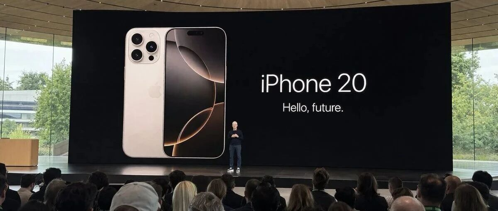
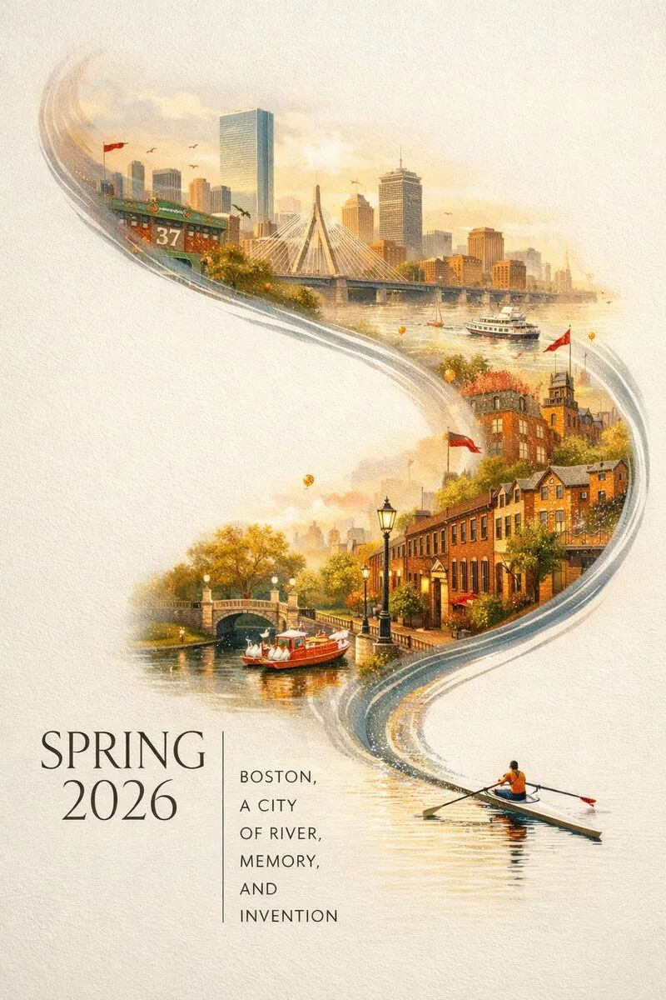
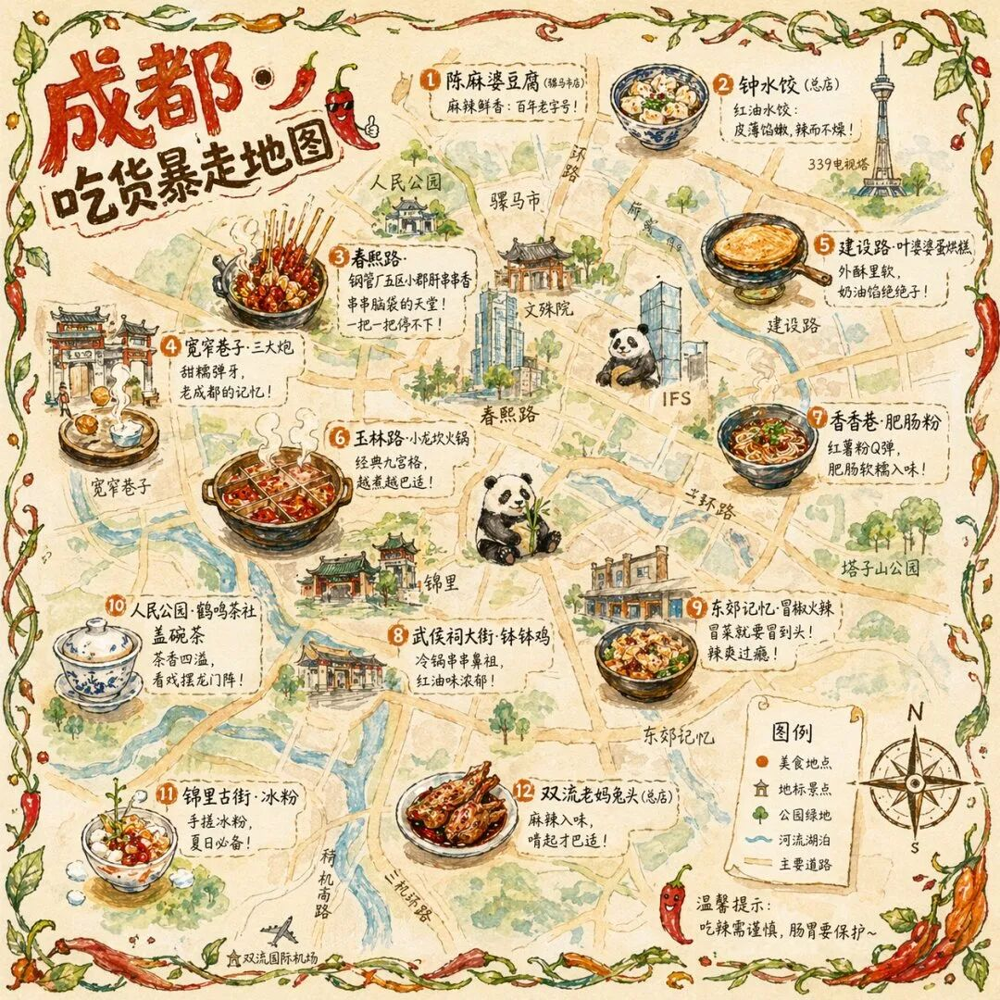
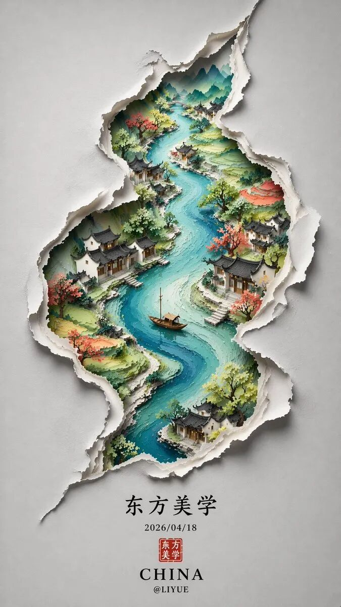
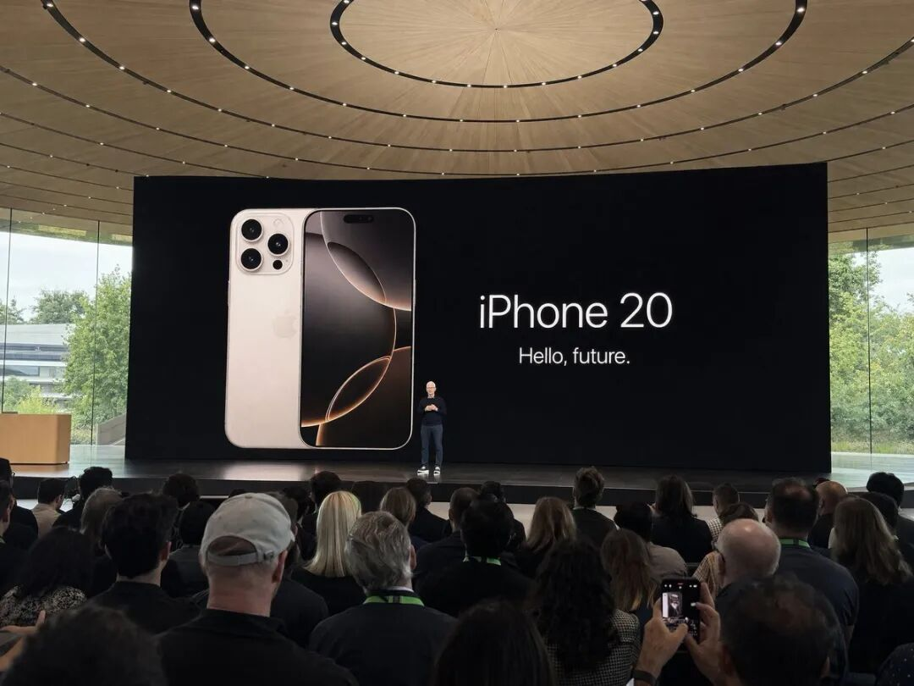

# GPT-Image-2 最火的Prompt提示词，AI电商能抄的，也不少。(附提示词教程）

> 作者：旺哥 · 公众号：AI应用实战派PRO  
> [查看微信公众号原文](https://mp.weixin.qq.com/s?__biz=MzY4NDA4MDUwMA==&mid=2247483720&idx=1&sn=5f2f5aabb51876752082a514ce91924d&chksm=f27344dc778e5beb2b2285bb5600d375edc5a5db2811cbac0b8eb56a42b6a14e127e3c56434e#rd)
> [下载 HTML 图文包（含图片）](https://github.com/wangge-dev/wangge-articles/releases/download/html-archive/202604210920.zip) · [HTML 文件](../../html/2026/202604210920/article.html)

AI CREATIVE · PROMPT ENGINEERING

#  GPT-Image-2 最火的  
50 个 Prompt

电商能抄的，就这 6 套

从 24.5k Star 的开源仓库扒出来

50  案例  6  核心公式  0  拍摄成本  电商  视角拆解

上一篇咱们聊了 AI 应用岗的真实门槛，里面有一句话其实挺关键的——  ** 企业不再为"可能性"买单，只为"确定性"买单  ** 。

那确定性长什么样？今天就上一个特别直观的例子：  ** AI 生图  ** 。 GPT-Image-2 （网传命名）灰度测试，GitHub
上就有人建了一个仓库叫  ** awesome-gpt-image-2-prompts  ** （24.5k star，基本就是 AI
生图圈的半本字典），里面收录了社区里最火的 50 多个案例和对应 prompt。

我花了一些时间，把里面的图和 prompt 都扒了一遍（有模特、海报、插画、UI 截图……各种类型都有），然后从我们电商团队的视角挑了 6 个出来——
** 这 6 个不是随便挑的，每一个都能直接对应到咱们的业务场景  ** （主图、节日 banner、详情页长图、模特拍摄、营销素材都覆盖了）。

先看一张开胃菜，你感受一下现在 AI 生图能做到什么程度：

▲ 这张图

0 拍摄成本，全程 AI 生成（作者 @BubbleBrain）

说实话我第一眼看到这张的时候是有点震惊的（你仔细看，衬衫的透光褶皱、头发的碎发、冰柜玻璃的反光、远处货架上的商品……真实到你根本不会怀疑这是 AI
生成的）。这张图如果走传统流程，从找模特、约摄影师、找场地、后期修图，大概是  ** 两三万起步、至少 3-5 天  ** 的周期。

那这是怎么做出来的？——  ** 就是一段 prompt，几块钱 API 费用，几十秒  ** 。

看来之前写的那份 AI 视觉工具攻略又得更新了——这次咱们先抢跑体验一把，等 GPT-Image-2
正式大范围发布、给团队落地跑一轮之后，我再来一篇详细测评。大家  ** 点个关注  ** ，期待后续哦。

话不多说，下面直接上 6 个公式。

01

##  先亮底牌 · 6 个公式

50 个案例看下来，其实绝大多数都能归到下面这 6 套公式里（个人觉得这比去一个个记 prompt 要省力得多）：

① 胶片六件套  · 写实人像/生活场景

格式 + 光源 + 人物 + 服装 + 姿势 + 反向词，六块堆叠成 150 词以上的长 prompt

② 同公式换场景  · 批量出图

胶片六件套只换 2-3 个关键词（光源/服装/场地），同一套人设可以铺满整个季度的主图

③ S 形构图海报法  · 节日主图/banner

留白底 + S 形主体 + 地标元素 + 字体排版，高级感直接拉满

④ 手绘鸟瞰信息图  · 详情页长图

鸟瞰视角 + 元素分布 + 手写标注 + 边框装饰，一张图塞下 12 个卖点不违和

⑤ 撕纸材质法  · 国潮天花板

撕纸裂口 + 内景山水 + 印章签名，国货/茶叶/中医药类目直接套

⑥ 伪截图法  · 营销素材

拍摄设备 + 构图角度 + "蹩脚感"修饰词，Prompt 越短越灵

下面一个公式配一张图一段 prompt，图和 prompt 是  ** 一一对应  ** 的，你看到图就是这段 prompt
跑出来的（都是仓库里原样抄下来的，我没改过）。

02

##  公式一 · 胶片六件套

这个就是开头那张便利店图用的公式，六件套拆开看是这样的（你盯着 prompt 读，基本能一一对上）：

** ① 格式 /  ** 35mm film photography（胶片的颗粒感，比 photorealistic 高级）

** ② 光源 /  ** 便利店冷白灯 + 外面的粉蓝霓虹（两种混光，出画面层次）

** ③ 人物 /  ** 亚洲女孩 + 杏仁眼 + 瓷白皮肤 + 毛孔细节（越具体越真实）

** ④ 服装 /  ** oversized 白衬衫 + 黑色百褶迷你裙 + 白色拖鞋（精确到件）

** ⑤ 姿势+道具 /  ** 斜靠冰柜玻璃门 + 一条腿弯起抵门框 + 手拿冰饮料

** ⑥ 反向词 /  ** no plastic skin, no airbrushing, no watermark（明确排除"假 AI 感"）

这套公式的核心，其实是  ** 用精确代替模糊  ** 。你不说"一个漂亮女孩"，你说"杏仁眼、高鼻梁、V
字下巴"；你不说"穿白衬衫"，你说"oversized 白色 button-
up、解开顶部扣子、腰间打结"。颗粒度越细，模型的自由发挥空间就越小，输出的稳定性就越高（个人觉得这也是 GPT-Image-2 相比 Midjourney
更适合电商的一个点，它对精确指令的响应更线性）。

下面是上面那张便利店图的  ** 完整原 prompt  ** （长到吓人，你感受一下）：

PROMPT · portrait_case1

35mm film photography with harsh convenience store fluorescent lighting mixed
with colorful neon signs from outside, authentic film grain, high contrast,
slight color cast, cinematic street editorial style, intimate medium shot,
early 20s sexy Chinese female idol with ultra-realistic delicate refined
Chinese features, seductive almond-shaped fox eyes with natural double
eyelids, high nose bridge, small sharp V-shaped jawline, flawless porcelain
skin with cool ivory undertone, subtle skin texture and micro pores, long dark
brown hair in a messy high ponytail, wearing an oversized white button-up
shirt unbuttoned at the top, paired with a tiny black pleated mini skirt,
barefoot in simple white slides, seductive casual leaning pose against the
glass door of a 24-hour convenience store at late night, one hand holding a
bottle of iced drink, bright cold fluorescent store light mixed with pink and
blue neon glow, no plastic skin, no digital over-sharpening, no airbrushing,
no watermark, no text

03

##  公式二 · 同公式换场景

这个公式的牛逼之处在于——  ** 六件套不变，只换 2-3 个关键词，同一个"人"可以出现在任何场景  ** 。看下面这张就明白了：

▲ 场景换成日式温  泉旅馆，人设和五官结构是一脉相承的

你对比一下就会发现，人物部分的描述（杏仁眼/瓷白皮/棕发）  ** 一个字都没改  ** ，改的只是：

✓ 格式：35mm 胶片（不变）

✗ 光源：便利店冷光 →  ** 和风木制灯笼暖光  **

✗ 服装：白衬衫黑短裙 →  ** 浅色浴衣（故意滑落一肩）  **

✗ 姿势：靠冰柜玻璃 →  ** 坐在木制檐廊边沿  **

✓ 反向词（不变）

对电商团队来说这意味着什么？——  ** 一个品牌的"AI 代言人"可以跨季节跨场景复用  **
。春天把她放在樱花树下，夏天放在海边，秋天在咖啡馆，冬天在雪景里，全年的主图素材一个人设就能铺完（家居、个护、食品这种有调性需求的品牌，想做一个专属的"品牌女主角"IP，这套公式就是现成的）。

PROMPT · portrait_case3

35mm film photography, warm vintage Japanese onsen ryokan aesthetic, soft
ambient wooden lantern lighting mixed with gentle natural window light, early
20s beautiful Chinese female idol with almond-shaped fox eyes, high nose
bridge, porcelain skin with warm ivory undertone, long dark brown hair tied in
a loose low bun, wearing a loose white yukata slipped off one shoulder and
loosely tied at the waist, seductive relaxed sitting pose on the edge of a
traditional wooden engawa veranda, warm wooden interior with paper sliding
doors and distant steaming hot spring in soft focus, no plastic skin, no
airbrushing, no watermark

04

##  公式三 · S 形构图海报法

▲ 2026 波士  顿春季城市海报（作者 @BubbleBrain）

这张海报牛在  ** 用一条水流把整个城市串起来  ** ——右下角一个划桨的小人，桨尖的水痕向上蜿蜒，变成查尔斯河，再变成整个波士顿天际线（Fenway
球场、Zakim 桥、Back Bay、天鹅船……全塞进来了）。留白足够，信息量也足够。

拆开就三块：

BLOCK 01 · 主体动线

一条 S 形曲线（可以是水流、丝绸、烟雾、光带），从画面一角起笔，串联到对角

BLOCK 02 · 地标堆叠

在 S 形内部填充 6-8 个可识别元素（城市地标、品牌产品、季节符号都行）

BLOCK 03 · 字体排版

主标题放留白区，副标题竖排（显得洋气）， 9:16 适配手机屏

电商怎么用？——  ** 把"波士顿"换成你的品牌关键词就行  ** 。比如双十一主图：用一条丝绸串起你最爆的 6 款 SKU。春节礼盒
banner：用一条红绳串起礼盒、祝福、年味元素。这种设计放上去就是高级感拉满，视觉组再也不用求着外包了。

PROMPT · poster_case1

A striking Spring 2026 city poster for Boston with an elegant celebratory
mood. On a clean off-white textured background with large areas of negative
space, a miniature single sculler rows across the lower right corner on a
narrow ribbon of reflective water. The wake from the oar sweeps upward in a
dynamic calligraphic curve, gradually transforming into the Charles River and
then into a dreamlike hand-painted panorama of Boston. Inside this flowing
river-shaped composition are iconic Boston elements: the Back Bay skyline,
Beacon Hill brownstones, Swan Boats, Zakim Bridge, Fenway-inspired details,
historic brick architecture. Soft morning fog, golden spring light, subtle
festive accents in crimson and gold. Elegant typography in the lower left
reads "SPRING 2026" with a vertical slogan "BOSTON, A CITY OF RIVER, MEMORY,
AND INVENTION", 9:16

05

##  公式四 · 手绘鸟瞰信息图

▲ 成都吃货暴走地图（作者 @Panda20230902）

这张我个人觉得是这批案例里  ** 对电商最友好的一张  ** （真的，你看完会想立刻试一下）。它本质上就是一张  ** 塞了 12 个卖点的详情页长图
** ，只不过披了个"成都美食地图"的外衣。

拆解一下 prompt 的思路：

** ① 底层 /  ** 鸟瞰视角的手绘简化城市地图（不追求比例，要可爱）

** ② 元素 /  ** 12 个美食点位，每个占 5% 面积，配手绘插画

** ③ 标注 /  ** 手写体店名 + 一句推荐语（"凌晨两点还在排队的那家"）

** ④ 装饰 /  ** 边缘的藤蔓和辣椒边框 + 右下指南针 + 左上标题区

** ⑤ 质感 /  ** 水彩 + 彩铅混合 + 暖色系（辣椒红、姜黄、翠绿）

这个套路直接改成详情页长图：把"成都地图"换成"你产品的成分构成图/功效分布图/使用场景图"，把"12 个美食"换成"12 个成分 / 12 个使用步骤 /
12 个品牌故事节点"，一张图把详情页全部信息塞进去还不觉得挤，客户还愿意截图保存——这种素材换专业插画师做一张至少 2000 起步。

PROMPT · poster_case3

一张手绘风格的城市美食地图，以成都为主题。画面以鸟瞰视角的手绘简化城市地图为底，标注主要道路和地标但不追求精确比例而是追求可爱的手绘感。地图上分布着 12
个美食地点的精致手绘小插画：春熙路的串串香、宽窄巷子的三大炮、建设路的蛋烘糕、玉林路的火锅等，每个插画约占地图的 5%
面积，旁边用手写体标注店名和一句推荐语"凌晨两点还在排队的那家"。地图边缘用手绘藤蔓和辣椒装饰形成边框。右下角有一个手绘指南针和图例说明。左上角标题"成都·吃货暴走地图"使用胖圆的手绘美术字配辣椒装饰。整体画风为水彩+彩铅混合的手绘质感，颜色以暖色系（辣椒红、姜黄、翠绿）为主，图片比例
1:1。

06

##  公式五 · 撕纸材质法

▲ 东方美学撕纸海报（作者 @liyue_ai）

这张是国潮电商的天花板参考。灰白纸底 + 一条 S 形撕裂口 + 裂口里露出山水画卷 + 底部黑色楷书"东方美学" +
红色印章——每一块都是高级感的零件，拼起来就是国货品牌的门面（国风家居、茶叶、中医药保健、文创周边这类有调性要求的品类都能直接套）。

这个公式的关键是  ** "双层空间感"  **
——外层是撕纸的灰白质地，内层是彩色的山水景象，靠撕裂口的阴影把两个世界分开。你把"山水"换成"产品陈列/原料溯源/工艺流程"，立刻就能变成你自己的品牌海报。

最后一定要记得加"黑色楷书 + 红色印章 + 品牌签名"这三件套，国潮感的 80% 就在这里。

PROMPT · poster_case4

极简新中式美学风格，画面以淡雅的灰白色为底，呈现出一种纸艺剪影般的立体感。一条S形蜿蜒的裂痕状边缘将画面分割，仿佛撕开了一层纸面，露出内部色彩斑斓的东方山水景象。裂口内，一条蜿蜒的河流自上而下贯穿整个构图，河水以深浅不一的蓝色渲染。河岸两侧点缀着青翠的山丘与梯田。沿河而建的古风建筑错落有致，飞檐翘角，白墙黛瓦。岸边树木葱茏，一艘小船静泊于水中央。画作边缘采用撕纸效果，营造出立体浮雕般的视觉体验。下方题字"东方美学"以黑色楷体书写，日期"2026/04/18"与红色印章相呼应，底部"CHINA"字样庄重醒目，署名"@LIYUE"低调收尾。

07

##  公式六 · 伪截图法

▲ iPhone 20 发布会现场（作者 @patrickassale）

这张最有意思——  ** prompt 只有 28 个英文单词  ** 。对，你没看错，前面几个公式动辄 150 词起步，这个就一句话：

PROMPT · ui_case2

Amateur iPhone photo at Apple Park during the iPhone 20 keynote, Tim Cook
presenting on stage. Shot from the crowd at a distance

但是出来的效果——观众后脑勺、有人举手机拍照、巨幕反光、甚至还有那种"业余抓拍没对好焦"的 feel，全都在。这就是公式六的精髓：  **
越是想要真实感，prompt 越要写得像一个普通人的口语描述  ** （"amateur photo"、"shot from the crowd"、"at
a distance"——每一个词都在告诉模型"这就是个路人随手拍的"）。

电商怎么用？  ** 伪直播截图、伪朋友圈截图、伪顾客实拍  ** ——这些种草素材过去要花钱找素人摆拍，现在一句话就能出。

08

##  实操 · 套到自家品牌试一遍

讲再多不如自己上手套一遍。我把"胶片六件套"直接改成一个家居香氛类品牌的模特图 prompt，你看下面这个（关键词我用颜色标出来了）：

HOME FRAGRANCE · 家居场景模特图

35mm film photography with  warm morning window light mixed with ambient
living room lamps  , authentic film grain, intimate medium shot, early 30s
elegant Chinese housewife with refined features, subtle natural makeup, long
dark hair loosely tied, wearing  a beige cashmere sweater and high-waisted
wide-leg trousers  , relaxed  sitting pose on a beige boucle sofa  with  an
elegant ceramic aroma diffuser  on the side table emitting soft steam, modern
minimal Chinese home interior in the background, no plastic skin, no
airbrushing, no watermark

六件套的结构一个没动，只是把关键词替换了：光源换成"家居暖光"、服装换成"羊绒衫+阔腿裤"（对应品牌客群）、姿势换成"坐在米色沙发上"、道具换成"陶瓷款香薰器"（真正套到你家产品的时候，这里就换成你的
SKU 描述）。反向词保持原样，这部分基本上是所有模特图的通用模板。

同样的思路，你把"家居沙发"换成"阳台下午茶"、"花园浇花"、"厨房做早餐"……一个"品牌女主角"IP 可以出一整个春季拍摄计划的素材（成本接近于零）。

09

##  最后说两句

扒完这 6 个案例，我自己最大的感受是——  ** 门槛从来不在工具，而在你能不能看出工具背后的公式  ** 。GPT-Image-2
这种模型其实后面对所有人都一样开放，但能把它用成"免费视觉团队"的人，大多数不是 AI 专家，而是对业务场景足够清楚的运营、设计、产品。

然后我也不想吹太狠，说两句实话：

实话 01

这 6 个公式不是万能的，真实电商场景里还得反复调（尤其是产品本体上图那种，模型对具体 SKU 识别还不稳）。

实话 02

场景类、氛围类、信息图类是当前 AI 生图的强项，纯产品图（需要精确还原 SKU）还是要传统拍摄 + AI 后期。

实话 03

这 6 个公式自己去跑一遍最有用，光看不动手，永远只能当看客。

其实整个过程我跑下来感觉最省的不是钱，是  ** 时间  **
——以前一个主图的视觉沟通周期至少两三天，现在一个下午能出十几版方案（哪怕最后只能用一版，试错效率也是指数级的）。

最后附上地址：  https://github.com/Yeachan-Heo/oh-my-codex

END · 如果这篇对你有用

觉得本文还不错，  ** 赶紧点赞收藏  ** 吧，关注我，后续还有更多实战文章。  
  
我是  ** AI 应用实战派pro  ** ，只聊落地，不讲虚的。

---

本文最初发布于微信公众号「AI应用实战派PRO」。未经特别说明，正文与配图采用 [CC BY-NC-ND 4.0](https://creativecommons.org/licenses/by-nc-nd/4.0/deed.zh-hans) 许可。
