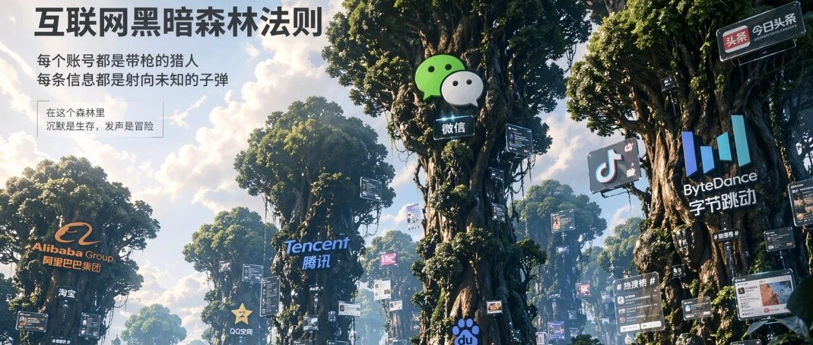

# 从昨天开始,你的微信截图一文不值

> 作者：旺哥 · 公众号：AI应用实战派PRO  
> [查看微信公众号原文](https://mp.weixin.qq.com/s?__biz=MzY4NDA4MDUwMA==&mid=2247483744&idx=1&sn=7043ef3db8dfb8a8a164a76c024e80e0&chksm=f2ad2b726691cc80611dd6c119370df7af305d755b4f4a8e47291e90cd63b8db75a8a0c21f5e#rd)

DARK FOREST · DAY 2

#  昨天开始,你的  
微信截图一文不值

AI 造假时代,电商和普通人  
还能抓住的 6 个机会

2026.04.23 · TRUST COLLAPSE

0 元  造假成本  ∞  信任成本  6 个  新机会  6 条  新铁律

昨天那篇,我跟大家讲 GPT-Image-2 正式发布,99% 的文字准确、4K 直出、Thinking
自查,企业终于能为"确定性"买单了——讲完我还挺乐观,觉得电商素材生产这条链条,从今往后就顺了。

结果  ** 发布当天,整个中文 AI 圈就出事了  ** 。

朋友圈、微博、各种群,一夜之间全是 GPT-Image-2
生成的假图——假微博热搜、假聊天记录、假新闻截图、假转账流水、假护照身份证,甚至还有人把自己朋友圈发的群聊截图,也被人说是 AI 生成的(  **
猜疑链直接闭环  ** )。

这波里最出圈的一篇文章,是  ** 数字生命卡兹克  ** 写的《因为 GPT-image-2,整个互联网都变成了巨大的黑暗森林》,阅读破了十万,评论区
500多条。我今天一条一条翻完,翻完有点小害怕——因为我意识到,这事最先崩的,不是什么高大上的"互联网信任生态",而是  **
每一个电商人、每一个普通人,每天都在打交道的几样东西  ** 。

KAZIKE · 原文金句

"当造假的成本趋近于零的时候,信任的成本就趋近于无穷大。"

"辨别内容由 AI 还是人类生成的成本,将系统性地高于该内容本身带来的价值——所以,绝大多数人将从理性上放弃辨别。"

"信任不再附着在信息上。  信任附着在人上。  "

我个人觉得,卡兹克这三句话,把这件事讲到底了。但他讲的是宏观——整个互联网的信任生态。我今天想讲点更具体的:  **
这件事落在你我身上,到底哪几样东西被斩首了,又冒出了哪几个谁都能抓的机会。  **

不废话,直接开始。

FILE 01 · 崩塌场景之一

##  电商仅退款,要出大事了

昨天卡兹克那条文章下面有一条评论——  ** "电商仅退款率将迎来激增"  ** 。这条评论有三百多赞,下面有人说"某多多商家的天塌了"。

这不是杞人忧天。之前灰产玩"假破损图索赔""假错发图退款"已经玩了好几年,但以前成本在——你要么得会 PS,要么得花钱找人 P
图,一张图半小时起步,门槛挡住了 90% 的人。  ** 现在这个门槛彻底归零了  **
——一张"快递暴力破损""商品发霉""瓶身渗漏""里面少了一半"的图,用 GPT-Image-2 几秒钟一张,做一百张和做一张没有区别。

卡兹克评论区 · 商家原话

"之前就有各种造假图片去索赔。现在都要求传视频、真人出镜之类的验证,能筛选掉一大批不会用 AI 生成视频的人。"

"我现在买东西都得从拆快递开始录视频,以免扯皮。"

但"传视频"这条防线,个人觉得也撑不了太久。Sora 2、可灵、Vidu,现在生成一段 10 秒"手持拍摄拆快递发现坏货"的视频,已经不需要什么门槛了——
** 视频造假只是比图片晚半年,不是不会来  ** 。

然后问题就不仅仅在"仅退款"这一个环节了。  ** 买家秀、追评、差评申诉、虚假好评刷单、竞品恶意攻击  **
——这整条链条上的每一个"图片证据"节点,全部要重新定价。以前你店铺 300 条好评自带 300 张精美买家秀,是护城河;从今往后,这 300
张图的信任权重,大概率会跌到原来的三成都不到,因为消费者自己心里也开始犯嘀咕了——"这些买家秀,是真的,还是店家用 AI 生的?"

最惨的其实是诚信经营的商家。  ** 原来劣币逐良币只是速度问题,现在加了个涡轮增压  ** ——同行用 AI 刷买家秀你不刷,你就慢;黑粉用 AI
做假差评你不防,你就死。

** 一个判断:  ** 未来,电商平台可能会出一波"拆快递全程视频""真人出镜""设备水印强制"的新规矩——不是想不想,是不得不。而这波规矩里冒出来的那些
** 给商家做视频留证、给平台做 AI 鉴图  ** 的小工具,会有一波很大的机会。

电商这条线先放放。第二个崩的场景,和每个有手机的人都有关——

FILE 02 · 崩塌场景之二

##  微信截图,正式失去"证据"身份

这一条,其实比"仅退款"还狠,因为它跟  ** 每一个有微信的人  ** 都有关。

卡兹克评论区一条留言是一个香港读者写的:"以后的举证成本更大了……单独微信截图没有公信力,要微信截图、手机数据甚至公司服务器数据所有符合,一方卡住就可以让整个流程推不下去。"

这话一点都不夸张。你回想一下,以前微信截图能派上用场的地方有多少:

· 老板给你下口头指令,你截图留底

· 中介承诺的条款,你截图留证

· 朋友借钱的承诺,你截图留底

· 商家客服答应的售后承诺,你截图存档

· 对象出轨,你截图留证

· 劳动争议,你拿微信截图去劳动仲裁

以上每一条,从昨天开始,  ** 全部要重新估值  ** 。因为任何一个只会用手机的人,现在都可以花 10 秒钟用 GPT-
Image-2,生成一张一模一样的微信聊天截图,连时间戳、头像、气泡、字体、心电图状态栏,全都分毫不差。而且反过来——  **
你截的真截图,对方也一样可以说"这是你用 AI 生成的"  ** ,你自证清白比对方造假还要累。

卡兹克评论区里有个懂行的留言说得很清楚:"法院的聊天记录从来不是采信截图的,都是手机加密源数据,这个是改不了的——如果是用微信截图作为证据,开庭需要带上截图的原始载体,比如手机版微信截图就需要你带手机过去才行。"

但  ** 法院以外的所有场景,基本就裸奔了  **
。劳动仲裁、民间借贷、租赁纠纷、买卖扯皮、情感对峙——这些场景里,没人会要求你"带手机原始载体过来验一验"。以前大家心照不宣地相信截图,从今以后,这个默认信任没了。

** 普通人第一件要做的事:  ** 从今天开始,  ** 关键沟通不要只截图  ** ——原始手机要留、对方账号 ID
要留、如果涉及重大利益,录屏+拍视频代替截图。一句话:  ** 截图不再等于证据,原始载体才是。  **

微信截图只是冰山一角,第三个崩的场景,才是真正让电商同行今晚睡不着的——

FILE 03 · 崩塌场景之三

##  详情页、质检报告、品牌授权书,全裸奔

昨天在卡兹克评论区我看到一句话,特别扎眼:"互联网商品页上的所有都可能是 AI 的了,包括什么证书、质检报告......"

这话我本来想反驳,但越想越后背发凉——确实是这样。一张详情页上,消费者为什么敢付款?靠的是下面这几样东西:

** ①  ** 产品实拍图 → 能被 AI 生成

** ②  ** 买家秀、好评截图 → 能被 AI 生成

** ③  ** 质检报告、SGS 检测书 → 能被 AI 生成

** ④  ** 品牌授权书、代理证 → 能被 AI 生成

** ⑤  ** 工厂实拍、生产环境 → 能被 AI 生成

** ⑥  ** 明星代言截图、媒体报道 → 能被 AI 生成

以上六条,  ** 一条都跑不了  ** 。昨天有人实测,连"合同盖章 + 骑缝章 + 手写签名"都能一比一复刻了——这个要是流出来一份 AI
做的"品牌代理授权书",下游店铺就能跟着疯。

换句话说,  ** 整个电商详情页的信任体系,是建立在"图片可信"这个默认假设上的  ** 。这个假设一崩,整个体系就晃了。不是说明天详情页就没了,而是——
** 从今往后,消费者在付款前的决策链条里,会多出来一个新步骤,叫"我怎么知道这些图不是 AI 做的"  ** 。这个步骤一旦出现,转化率就一定会掉。

** 一个反直觉结论:  ** 真实商家  ** 不会  ** 被这件事搞死,反而会  ** 升值  ** 。因为当所有人都在被怀疑的时候,那些  **
能自证、敢留原始载体、老板真人出镜、工厂实地直播  ** 的商家,就是黑森林里那盏灯。消费者最终会学会——只买灯下面的东西。

三个崩塌场景讲完了。但卡兹克那篇文章我看到最后,并不觉得悲观——恰恰相反,因为每一处崩塌的地方,都在冒新的生意——

FILE 04 · 黑森林里的新光

##  每一处崩塌的地方,都在长新生意

昨天卡兹克评论区第二高赞是这一条——  ** "感觉 AI 鉴别和做信用担保有搞头"  ** ,350个赞,卡兹克本人回复"我觉得是的,刚需"。

我把 500 多条评论里提到的"机会型想法"全部拎出来、去重归类,喂给Claude之后，合并成 6 个赛道。这里甩清单（请仔细甄别）

OPPORTUNITY 01

开箱视频 SaaS / 电商取证服务

拆快递全程录像 + 云端哈希上链,一键生成取证文件。解的是商家怕仅退款、消费者怕被赖的双向痛。

OPPORTUNITY 02

AI 鉴图插件 / 浏览器扩展

浏览器右键一键识别,输出 AI 概率值。做不到 100% 没关系,做到 70% 就有人装。

OPPORTUNITY 03

可信商家联盟 / 电商"学信网"

商家上传资质原图,出唯一验证码,消费者扫码即知真伪。门槛在商务攒局,不在技术。

OPPORTUNITY 04

家人防骗陪跑 / 中老年科普 IP

中老年是下一波 AI 诈骗重灾区。评论区明牌需求——个人能做、门槛最低。

OPPORTUNITY 05

区块链存证 / 带签名相机

每一张照片自带数字签名+时间戳+GPS,司法、公证、维权全是需求方。护城河深。

OPPORTUNITY 06

真人 IP / 信用资产的反向生意

最朴素也最大的机会——把自己做成一个可被长期验证的真人。卡兹克三年前就押了这条。

** 一句话判断:  ** 前 5 条是  ** 工具型机会  ** ,谁跑得快谁赢;第 6 条是  ** 复利型机会  ** ,谁开始得早谁赢。这两种里
** 最不能忽视的,是第 6 条  ** ——因为它不需要资金、不需要技术,只需要你从今天开始,不糊弄。

FILE 05 · 6 条新铁律

##  从今天起,刻进脑子里的 6 件事

前面讲的是机会,这里讲的是  ** 自保  ** 。6 条,看完就执行,不需要成本——具体操作细节  ** 后面一篇《黑森林生存手册》  ** 再展开。

RULE 01

截图不等于证据。

卡兹克原文第一条。重要沟通保留原始载体——手机不换、号不注销、消息不清理。

RULE 02

传任何图之前,先停 3 秒。

先问自己"这图万一是假的怎么办"——这 3 秒能挡掉 90% 的 AI 假图二次传播。

RULE 03

筛信息源头,不是信息本身。

多关注几个长期靠谱的号,少转几条来源不明的热图。

RULE 04

电商 SOP 立刻更新:拆快递必录像。

买家拆贵重商品从头录到尾,商家发货封箱前就开录,一段视频顶一千字。

RULE 05

家里长辈,今晚就科普一次。

三句话:AI 能伪造你孩子的照片视频;收到急着借钱的消息一律回电话;公检法电话挂掉再打 96110。

RULE 06

做一个值得被信任的人。

卡兹克落脚点。不是鸡汤——在谁都不可信的世界里,你的信誉就是复利最高的资产。

写到这里,我其实和卡兹克一样——没有任何"我早就说过了"的得意。因为这件事短期内对普通人其实不是什么好事——  **
举证成本上天、家里长辈更危险、电商同行活得更累、诚信商家被劣币挤压  ** 。

但短期的混乱里,一定藏着长期的格局重写。流量经济的天花板已经摸到了,  ** 信任经济的地基才刚铺  **
——这一轮技术冲击下来,真正的护城河会从"谁会投流""谁会刷量""谁图做得漂亮",迁移到  ** "谁长期说真话""谁能自证原始""谁值得被依赖"  **
。

对电商老板来说,这意味着:  ** 从今天开始,把"真人老板出镜""工厂直播""真实开箱"这件事排进周计划  **
——不是为了赶风口,是为了提前给自己的店铺存"信用复利"。两年之后,这个账户会救你的命。

对普通打工人来说,这意味着:  ** 选一个方向,开始做一点可被长期验证的输出  **
。不用追爆款、不用追风口,就是持续、真诚、不糊弄——两年之后你就是你这个领域里的"那盏灯"。

对每一个家里有长辈的人来说,这意味着:  ** 今晚就把这篇文章转到家庭群  ** ,然后打电话给爸妈,用他们能听懂的话,把第 5 条铁律讲一遍。

黑暗森林这个说法,听起来很吓人。但个人觉得,森林之所以黑,是因为灯少——  ** 而我们每一个决定做真人、决定不糊弄、决定长期输出的人,就是那一盏灯  **
。

灯多了,就不是黑森林了。

END · 如果这篇对你有用

觉得本文还不错,  ** 赶紧点赞、收藏、转发家庭群三连  ** 。尤其是第 5 条铁律那一段,多一个长辈看到,就少一个被骗的可能。  
  
我是  ** AI 应用实战派pro  ** ,只聊落地,不讲虚的。

---

本文最初发布于微信公众号「AI应用实战派PRO」。未经特别说明，正文与配图采用 [CC BY-NC-ND 4.0](https://creativecommons.org/licenses/by-nc-nd/4.0/deed.zh-hans) 许可。
