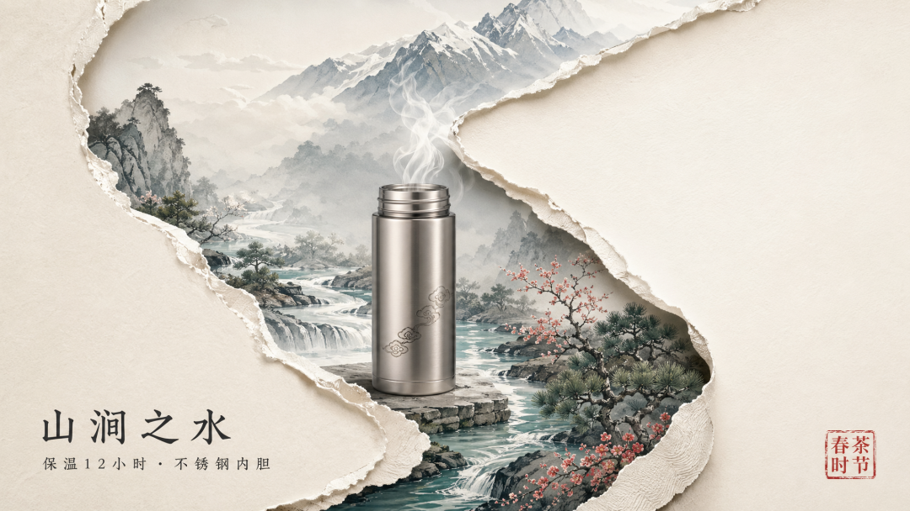
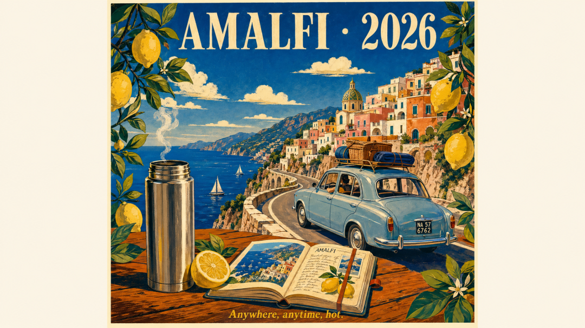
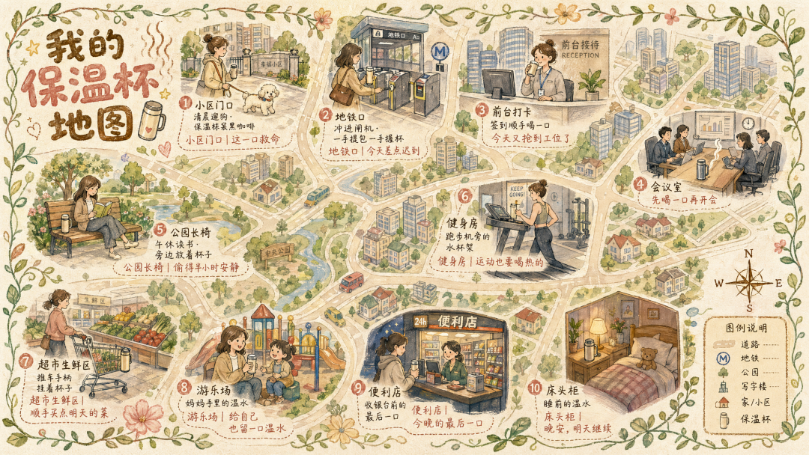
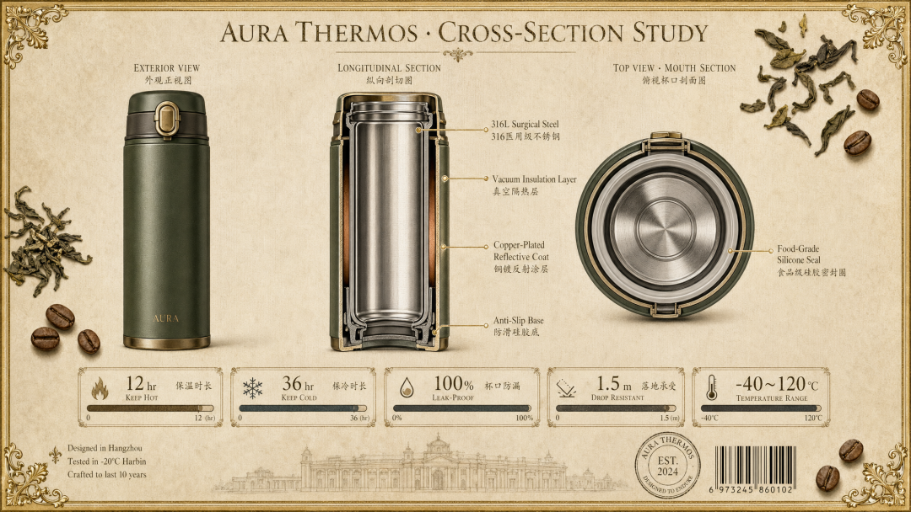
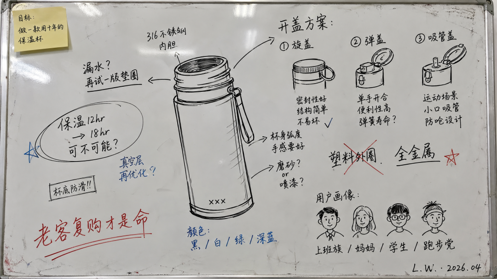
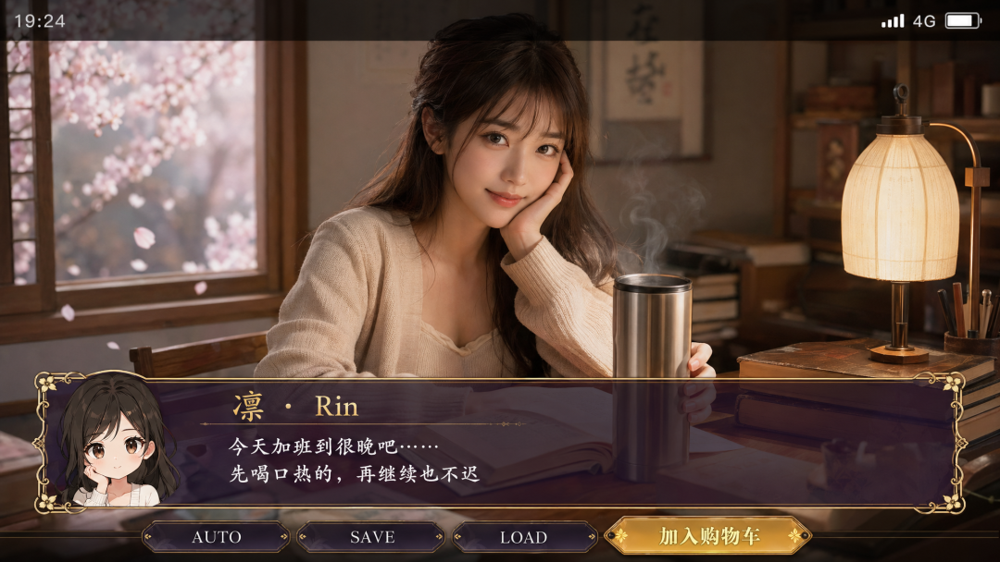
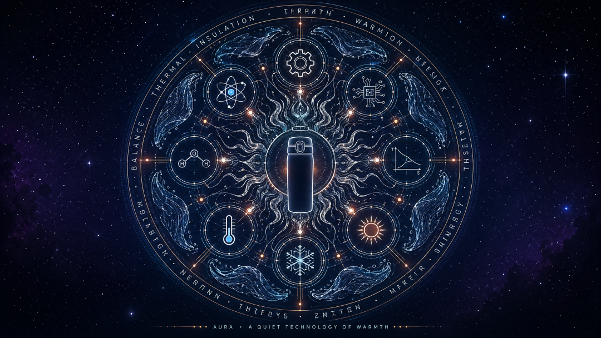

# 我用GPT-Image-2 把最普通的商品跑出了七种花样（附完整提示词以及可以白嫖的网站）

> 作者：旺哥 · 公众号：AI应用实战派PRO  
> [查看微信公众号原文](https://mp.weixin.qq.com/s?__biz=MzY4NDA4MDUwMA==&mid=2247483764&idx=1&sn=d9c2d18620e9f0c8e6cf09f35b1caf26&chksm=f2456a3539941562fc7ad76f9b58a9c57e3dd75f312354cf3bab5b34e406953da4a2c2c4e511#rd)
> [下载 HTML 图文包（含图片）](https://github.com/wangge-dev/wangge-articles/releases/download/html-archive/202604251558.zip) · [HTML 文件](../../html/2026/202604251558/article.html)

PROMPT KIT · GPT-IMAGE-2

#  拿一个最普通的保温杯,  
我用 Image-2 跑出了  7 种花样

7 套电商可用的提示词整理  
看完直接抄就行

2026.04.25 · PROMPT NOTES

7 套  提示词  1 主角  保温杯  3 观察  小复盘

OPENING

##  上一篇聊得思考,这一篇切回工具本身

所以这一篇换个方向——把 GPT-Image-2 正式上线之后这几天,我自己跑过的一组提示词整理出来,可以用在不止电商这一种场景上。每一段 prompt
都附完整版本,看完直接抄就行。

如果没有GPT的账户可以登录这个网站白嫖  一百张  ！：

http://labnana.com?aff=4a4eb73eec394721

或者  labnana.com（需要魔法）

我没找精华水、香水这种天生有故事感的 SKU。

我特意挑了一个最普通的不锈钢保温杯当主角,把整理出来的 7 套公式跑了一遍。

为什么挑保温杯

越是普通的 SKU,越能逼出模型的真本事。  
护肤品、香水自带高级感,模型怎么拍都不会太差;  
但保温杯不一样——它就是一个圆柱体,  没有任何故事感,全靠你给它编故事  。

如果一个保温杯都能被跑出大片,那你手上的产品大概率也能。

注意，你如果想跑其他的商品把下面提示词里面的保温杯换成你想要的就行！

下面我就讲两件事:每个场景能干嘛,prompt 是什么。点赞收藏就行。

PART 01

##  7 个场景的提示词

SCENE · 01

###  撕纸新中式海报(春日限定)

第一张走的是今年比较火的  ** 撕纸感新中式  ** 风格。

天猫、小红书上的茶饮、香薰、文创类目几乎人手一张,逻辑也简单——撕开的纸面 + 山水 + 器物,三件套放一起就是高级。

我跑的时候没画稿,直接把保温杯丢进山涧的场景里让模型自己构图。结果它把杯口的热气和远山的云雾自然连了起来,"温暖"这个产品卖点就视觉化了。

PROMPT

极简新中式美学风格,画面以淡雅的米白色为底,呈现纸艺剪影般的立体感。
一条S形蜿蜒的撕纸边缘从右上向左下贯穿画面,像撕开了一层宣纸,露出内部色彩柔和的山水景象。
撕开的内部是一条蜿蜒的山涧溪流,从远山的雪线流下,水色由墨蓝渐变为青绿,溪边点缀几丛淡红梅花与翠绿松枝。
画面正中是一个手绘风格的不锈钢保温杯,杯身泛着柔和的金属光泽,杯口正冒出袅袅热气,热气向上升腾,与远山的云雾自然融合。
杯身侧面隐约印着小小的中式云纹图样,质感真实。
画面左下方题字"山涧之水"以黑色楷体书写,下方一行小字"保温12小时·不锈钢内胆",右下角配一枚红色印章"春茶时节"。
撕纸边缘呈微微卷起的浮雕质感,画面右上角留出大面积空白。 构图静谧深远,色彩克制,整体有诗意与器物对话的氛围,9:16,高清,无水印。

** 适合:  ** 茶具/水具/香薰/文创类目的品牌主张图、节日限定包装的预告海报、官号头图。

SCENE · 02

###  复古意大利风旅行海报(户外/露营)

第二张换个完全相反的方向——  ** 1960 年代意大利丝网印刷感的旅行海报  ** 。

柠檬黄 + 地中海蓝 + 暖橙的高饱和色块,一眼就让人想出门。

我特意没让模型做照片质感,就要这种丝网印感。这种图最适合做户外/露营/旅行类目的氛围主图,挂在详情页第一屏,比千篇一律的实景图要抓眼球得多。

PROMPT

复古旅行海报风格,1960年代意大利地中海沿岸氛围。
画面前景是一个银色不锈钢保温杯放在手绘的木质野餐桌一角,杯身有微微的蒸汽升起,旁边是一只切开的柠檬和一本翻开的旅行手账。
中景是一辆经典的浅蓝色复古小汽车沿着曲折的悬崖海岸公路行驶,车窗摇下,车顶绑着野餐篮和帐篷。
远景是层叠的彩色山城建筑(粉色、米白、赭石红),背后是深邃的地中海,几艘帆船散布在水面上,天空是高饱和的蔚蓝色配几朵奶油色云。
前景两侧悬挂着柠檬树枝叶,黄色的柠檬和翠绿的叶子形成自然画框。
整体使用1950s旅行海报的鲜艳配色——深蓝、柠檬黄、暖橙、白色——色块大胆,线条清晰,有明显的丝网印刷质感和手绘笔触。
顶部用复古衬线字体写着"AMALFI · 2026",底部一行小字"Anywhere, anytime, hot."
高对比度、装饰性、平面感强,比例3:4,不要照片质感,要的是插画海报感,无水印。

** 适合:  ** 户外/露营/箱包/3C 旅行电源类目的氛围主图、品牌大事件海报、年度 TVC 衍生图。

SCENE · 03

###  手绘城市使用场景地图(鸟瞰风)

第三张比较特别——  ** 鸟瞰视角的手绘"使用场景地图"  ** 。

这个套路在母婴号和宠物号上跑出过爆款。逻辑是把产品在用户一天里的多个使用瞬间画成插画,散布在城市地图上,每个场景旁边写一句生活气息的话。

放在公众号封面或者详情页第一屏,用户会愿意停下来看半分钟,比单张实拍的"信息密度"高得多。

PROMPT

一张手绘风格的城市生活场景地图,主题是"一个保温杯陪我走完一天"。
画面以鸟瞰视角的手绘简化城市地图为底,标注几条主要道路和地标但不追求精确比例,追求可爱的手绘感。
地图上分布着10个使用场景的精致手绘小插画,每个画面占地图约5%面积: (1)小区门口·清晨遛狗·保温杯装黑咖啡 (2)地铁口·冲进闸机·一手提包一手握杯
(3)写字楼前台·签到顺手喝一口 (4)会议室长桌·电脑前氤氲热气 (5)公园长椅·午休读书旁边放着杯子 (6)健身房·跑步机旁的水杯架
(7)超市生鲜区·推车手柄挂着杯子 (8)儿童游乐场·妈妈手里的温水 (9)夜班便利店·收银台前的最后一口 (10)卧室床头柜·睡前的温水
每个插画旁有手写体标注地点名+一句生活气息的话("这一口救命"、"今天又抢到工位了")。
地图边缘用手绘的绿叶藤蔓和小花图样装饰形成边框,右下角有一个手绘指南针和图例说明。 左上角标题"我的保温杯地图"用胖圆的手绘美术字配蒸汽符号。
画风为水彩+彩铅混合的手绘质感,颜色以低饱和暖色(米黄、淡绿、奶咖、薄红)为主,比例1:1。

** 适合:  ** 内容种草文章封面、社群裂变素材、品牌故事页面、新品发布会的环境墙喷绘。

SCENE · 04

###  博物馆图鉴风工艺拆解图

第四张走严肃路线——  ** 博物馆图鉴风的产品工艺拆解  ** 。

精铺和高客单的电商,详情页里几乎都会有一段"工艺/材质/结构"模块。常规做法是放一组 CAD 剖面图,问题是 CAD 图太冷,用户翻三秒就走了。

把它做成博物馆图鉴风之后,CAD 的"冷"被花纹边框、衬线英文、印章这些元素缓和了,但严肃感还在。

PROMPT

博物馆图鉴风格的产品工艺拆解信息图,整体像一页古典博物馆解说牌。 画面深米色亚麻纹理底色,四周一圈细金边框配古典花纹角饰。
画面中心是一个保温杯的剖面图,三个角度并排展示——左:完整外观正视图;中:纵向剖切展示双层真空内胆、保温层、底座结构;右:俯视杯口剖面图。
每一层结构旁边有细金线引出标注,使用衬线英文+中文小字: - "316L Surgical Steel · 316医用级不锈钢" - "Vacuum
Insulation Layer · 真空隔热层" - "Copper-Plated Reflective Coat · 铜镀反射涂层" - "Food-
Grade Silicone Seal · 食品级硅胶密封圈" - "Anti-Slip Base · 防滑硅胶底" 画面顶部居中是产品名"AURA
THERMOS · CROSS-SECTION STUDY"用大号衬线字。 画面底部是5个数据条,每个一个性能指标:保温时长12hr / 保冷36hr /
杯口防漏100% / 落地承受1.5m / 杯身耐温-40~120°C,配进度条样式呈现。 左下角有一段三行小字"Designed in Hangzhou
· Tested in -20°C Harbin · Crafted to last 10 years"。 右下角是一个圆形品牌印章+条形码。
角落散落几片干燥的茶叶和咖啡豆装饰。 整体像一页严肃的工艺白皮书,但保留手绘标注的细腻感,1:1,8K,无水印。

** 适合:  ** 详情页"工艺/材质"模块、众筹页面、精铺品牌的差异化展示页、媒体软文配图。

SCENE · 05

###  白板涂鸦速写风(创始人手稿)

第五张走情绪路线——  ** 一张像创始人凌晨三点画完的白板手稿  ** 。

这种素材以前是品牌故事页里的"灵魂图",但人工画一张要花一两天,预算不够的小品牌只能放一段文字。

Image-2 现在能直接把这种"未完成感"画出来——线条歪、字迹潦草、有划掉重写的痕迹,反而真实感拉满。

PROMPT

白板手绘涂鸦速写风,整体呈现快速勾勒、自由变形、即兴手写的视觉效果。 画面是一面真实的白色磁性白板,边缘有少量油性笔擦不掉的旧痕迹,左上角贴着一张便签贴。
白板中央是一个保温杯的草图,用黑色马克笔随手画出,线条粗细不均,杯身轮廓微微歪斜,杯盖部分用箭头连出来另画了三个不同的开盖结构方案(旋盖/弹盖/吸管盖)。
保温杯草图周围环绕着各种手写笔记和符号: - 一个箭头指向杯口"漏水?再试一版垫圈" - 一个圈起来的字"保温12hr → 18hr 可不可能?" -
一个红色叉号划掉了"塑料外圈",旁边重新写"全金属" - 右下方画了一组用户画像草图(小人头)"上班族 / 妈妈 / 学生 / 跑步党" -
左下方一行红色加重的字"老客复购才是命" 颜色以黑色马克笔为主,关键词配少量红色和蓝色重点标注,整体保持白板的明亮反光质感和油性笔的随手痕迹。
画面右下角随手签着英文名"L.W. · 2026.04"。 画面氛围真实,像创始人凌晨三点画完的工作板,有未完成感和工程感,不要数字插画风,比例16:9。

** 适合:  ** 品牌故事页头图、创始人专访封面、众筹"为什么做这件事"模块、私域日常素材。

SCENE · 06

###  galgame 对话框(IP 人物推荐界面)

第六张是给二次元向品牌玩的——  ** 伪手机截图 + galgame 风对话框  ** 。

我自己一开始没看出这种图能用在哪。后来一个做萌系联名的朋友提醒我:现在 B 站、小红书、抖音的二次元向账号都在做"虚拟代言人"。把保温杯放进 Q
版人设的对话框里,比真人模特更容易戳到 Z 世代。

而且这种图本身就是手机原生比例,丢出去就是一条带货短文案的封面。

PROMPT

生成一张竖版手机截图风格的图片,整体比例9:16。 画面中心偏上是一位真人女主,写实风格但五官略带二次元感,皮肤细腻,眼睛稍大,表情温柔地看向镜头。
她坐在一间日式书房的木桌前,桌上摆着翻开的书、一盏暖光台灯,最显眼的是手边那个不锈钢保温杯,杯身正冒出袅袅热气。
她左手轻轻扶着杯子,右手托腮,背景虚化能看到木窗外飘落的樱花瓣。
画面最上方加入手机系统状态栏UI,包括时间19:24、电量、信号、4G图标,让整张图看起来像手机截图。
画面底部叠加一块宽大的半透明galgame风格对话框(深紫色半透明,金色花纹边框)。 对话框左侧是一个与画面人物对应的Q版头像。
对话框右侧排版文字:第一行用较大字体显示角色名"凛 · Rin",下面两行小字台词"今天加班到很晚吧⋯⋯先喝口热的,再继续也不迟",字体为简体中文楷体。
对话框下方一条操作栏,仿照galgame UI——"AUTO / SAVE / LOAD / 加入购物车"四个按钮,最后一个是醒目的金色按钮。
整体高清、细节丰富、光线柔和,二次元与真人写真自然融合,无水印无logo。

** 适合:  ** 二次元品牌联名素材、IP 带货短视频封面、手游/动漫垂类账号投放、年轻向品牌的小红书首图。

SCENE · 07

###  未来感曼荼罗插画(品牌主视觉)

最后一张是品牌视觉的"上限"——  ** 未来感曼荼罗  ** 。

这种图本身没有信息密度,它的作用是"占场"。年终的品牌大日子、新一年的 slogan 海报、官网首屏视频的最后一帧,都需要一张"看不懂但很高级"的视觉。

曼荼罗本来就有一种神圣对称感,用 Image-2 跑出来之后还多了一层冷调的科幻感,正好对得上"工业品也是器物"的品牌主张。

PROMPT

近未来科幻版的曼荼罗插画,整体构图为一个完美对称的圆形曼荼罗。 曼荼罗的正中心是一个保温杯的极简轮廓剪影,像一颗静止的核心。
从杯口向外呈360度放射状展开,第一层是袅袅升腾的蒸汽,蒸汽逐渐演变为流体几何线条;
第二层是8个精细的科幻符号——齿轮、电路、原子模型、水分子、热力学曲线、温度计、雪花、太阳——每一个图标都用极细的线条绘制;
第三层是8段水波纹饰,像液体在低重力下扩散的痕迹; 最外层是一圈极细的英文文字环——"THERMAL · INSULATION · ETERNAL ·
WARMTH · DESIGN · MATTER · ENERGY · BALANCE"循环排列。
颜色以深紫到靛蓝渐变为底,曼荼罗主色为冷银白和金属青,关键节点用一点点烈焰橙做点缀,呈现出冷暖对撞的科幻神圣感。
背景是深邃的夜空质感,散布几颗微小光点,像星图。 画面正下方一行小字"AURA · A QUIET TECHNOLOGY OF
WARMTH"作为品牌slogan。 画面整体清透、细密、对称、富有未来感,没有任何文字水印,比例1:1,8K高清。

** 适合:  ** 品牌主视觉海报、超级品牌日、官网首屏背景、年终 TVC 的最后一帧、办公室文化墙。

PART 02

##  7 张图跑下来,几点小观察

写到这里我自己也回头复盘了一下,有三个不太成熟的想法:

NOTE · 01

越简单的产品,越能跑出花来。

一开始我也想过用更复杂的 SKU 去测,后来发现保温杯这种"完全没情怀"的品类反而最公平——不靠产品本身赖皮,全靠 prompt
的功力。如果你也想自己跑一遍,建议从手头最普通的那个 SKU 开始。

NOTE · 02

提示词不必啰嗦,但场景要具体。

上面这 7 段
prompt,最长的也就三百字出头。模型并不需要你写一篇散文,它需要的是"具体到哪一束光、哪一种纸、哪一段文字"这样的细节。把"高级感"这种空话去掉,把"S
形撕纸边缘"、"水彩 + 彩铅手绘质感"这样的具体词留下,就够了。

NOTE · 03

提示词是"半成品",不是"成品"。

上面这些 prompt
我也是改了好几遍才跑出现在的效果。建议你拿去之后先跑一版基础的,看看模型怎么理解的,再针对偏掉的地方加细节。这个反复调的过程,比"找到一个完美的
prompt"更重要。

PART 03

##  素材源头,顺手放在这里

这一次的 7 个套路,灵感都是从 GitHub 上一个开源仓库里啃出来的——  ** awesome-gpt-image-2-prompts  **
,到我写这篇为止已经收了 50 多个案例,覆盖人像、海报、角色、UI、社区实验五大类。

REPO

github.com/EvoLinkAI/  
awesome-gpt-image-2-prompts

里面有大量没在电商场景里出现过的玩法(比如汉服博物馆图鉴、剪纸城市海报、X 时代风格 UI 截图),自己去翻一翻,能再扒出十来个适合自家产品的公式。

CLOSING

##  最后

公众号毕竟还是要回到"看完能拿走点什么"这件事上。如果你看到这里觉得这 7 段 prompt 至少有一段能直接抄回去用,那这篇文章就值了。

END

觉得这篇有点意思的话,  ** 点个赞、收藏一下  ** ,留着哪天产品上新需要做图的时候翻出来用。  
  
我是  ** AI 应用实战派pro  ** ,一个还在一线做电商的普通人,只聊自己琢磨出来的东西。

---

本文最初发布于微信公众号「AI应用实战派PRO」。未经特别说明，正文与配图采用 [CC BY-NC-ND 4.0](https://creativecommons.org/licenses/by-nc-nd/4.0/deed.zh-hans) 许可。
