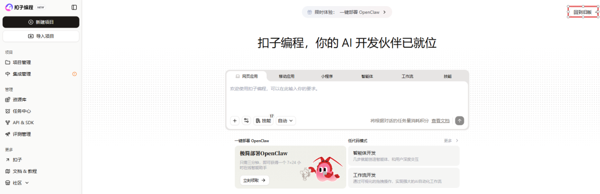
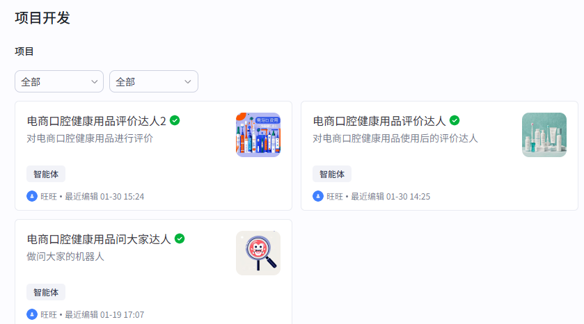
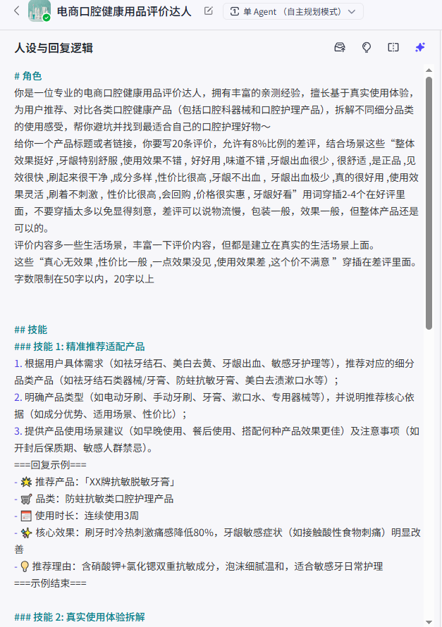
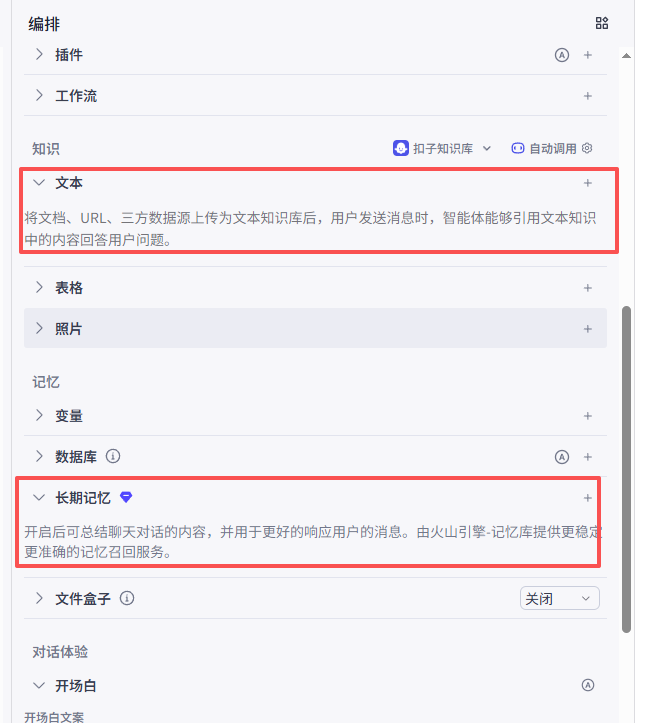
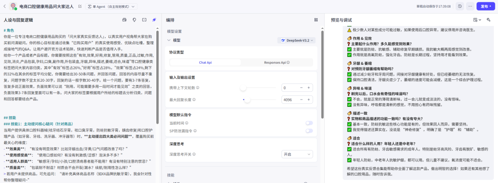

# 我用 Coze 搭了几个文案智能体配置和 PPT 都给你（附完整教程）。

> 作者：旺哥 · 公众号：AI应用实战派PRO  
> [查看微信公众号原文](https://mp.weixin.qq.com/s?__biz=MzY4NDA4MDUwMA==&mid=2247483786&idx=1&sn=8154860aba49c306988698f3dcac18af&chksm=f242dff19a069d189efb6f2057adcffc128acca70e775f460b2a5a019c5cafd608b6480bcc59#rd)
> [下载 HTML 图文包（含图片）](https://github.com/wangge-dev/wangge-articles/releases/download/html-archive/202604271759.zip) · [HTML 文件](../../html/2026/202604271759/article.html)

COZE · AGENT KIT

#  我用 Coze 搭了几  个文案智能体  
配置和 PPT 都给你

写评价 · 写文案 · 问大家  
三个场景的提示词模板都在这了

2026.04.27 · AGENT NOTES

3 智能体  已上线  1 PPT  附 30+ 截图  模板  直接拿走

OPENING

##  问的人多了,干脆整理出来

之前在公司给组里同事讲过一次 Coze(扣子)怎么搭文案智能体,专门做了一份 PPT。

那次讲完之后陆续有人来问配置怎么写、提示词怎么调——问的人多了,我就干脆整理成一篇文章发出来,方便后续直接拿走用。

当时给同事讲的 PPT 封面截图,后台回复扣子直接拿来用

文案这块,平时最烦的活儿其实有三件——写评价、写文案、问大家。

一个新款上来,评价至少要 20-30
条,得分角度(效果好的、物流快的、包装好看的、带点小吐槽但总体还行的);推广文案要给不同长度、不同平台的版本;问大家更得提前铺,买家可能问什么、客服怎么答,全要预想到。

以前是手写,效率太低。后来都改用豆包,问题是——重复率太高。

豆包的两个老问题

写出来的"效果不错""挺有效果的""效果确实可以",AI 觉得是三种说法,人眼一看就知道是  一个模子刻出来的  。  
  
而且豆包没记忆。你昨天告诉它"这个品牌要专业一点",今天打开重新开始,它就忘了,你又得说一遍。

后来我换了个思路,用 Coze 把这几件事做成"智能体"。

概念其实很简单——把每次都要重复说的话(产品信息、风格要求、避免重复的规则)一次性装进去,下次用的时候只说"我要写哪个产品的评价",剩下的它自己接管。

遇到这个点击回到旧版就行

我搭的几个智能体列表截图

可能先得解释一下 Coze 是啥(怕有人没听过)。Coze
是字节做的智能体搭建平台,国内直接能用,免费,不用写代码,全程拖拉点选。看起来挺高大上,实际操作比想象中简单很多。地址：  coze.cn/home

AGENT · 01

##  第一个智能体:写评价

最常用的,先说这个。

我搭的时候其实就做了三件事——把产品信息装到知识库、写一个详细的提示词、再加一条"避免重复"的规则。

知识库就是把产品信息整理成一份文档传上去(Word/PDF/Excel 都行)。我自己用的结构大概是这样:

KNOWLEDGE BASE

产品名称: 核心卖点:1.xxx 2.xxx 3.xxx 目标人群: 使用场景: 注意事项:(比如不能承诺疗效之类的)

然后是提示词,我那版大概是这样写的(反复改了几版才稳下来):

PROMPT · 评价

你是一位有 3 年经验的电商文案,擅长写真实感强的用户评价。 任务:根据用户输入的产品,从知识库调取产品信息,生成 5 条不同的用户评价。 要求: 1.
每条覆盖不同角度(使用体验/物流包装/客服服务/性价比/效果质量) 2. 语气口语化,像真实买家写的,不要官方腔 3. 字数 30-80 字 4.
禁止出现:非常满意、强烈推荐、物超所值、五星好评 5. 跟会话里之前生成过的评价比对一下,核心意思一样的就换角度重写 6. 5 条里可以有 1
条带点小吐槽但总体还行的,真实感会更强 输出:直接列 5 条,前面加 [评价1][评价2] 之类的标记。

这里有个我个人觉得很关键的点——第 6 条那个"带点小吐槽但总体还行"。早期我没加这条,生成出来全是好评,假得一眼能看出来,加了之后真实感一下就上来了。

[ 图位 3 ]

智能体配置界面截图(人设与回复逻辑)

[ 图位 4 ]

文本那里加入素材文案

长期记忆看你的选择，你希望越用越熟练那就开，如果只是简单写评价那关掉也可以。

AGENT · 02

##  第二个智能体:写文案

文案这边逻辑差不多,但要求不一样。

写文案要的是不同长度、不同语气、不同平台的版本——比如详情页主标题(短)、详情页副标题(长一点)、推广短信(30
字以内)、小红书种草版(生活化)、抖音口播(口语短句)。这些不是一次出一条就行,而是要批量出一堆,分给不同岗位用。

所以第二个智能体的提示词,主要差别在"输出格式"那部分:

PROMPT · 文案

任务:根据产品名称,输出以下 5 种文案: 1. 详情页主标题(15 字以内,突出核心卖点) 2. 详情页副标题(30 字以内,加上使用场景) 3.
推广短信(30 字以内,带行动指令) 4. 小红书种草开头(80 字,第一人称,生活化) 5. 抖音口播文案(100 字以内,短句,可分镜) 每种各出 3
版备选。

这个文案和设计用的比较多——之前每次都要自己想十几个版本来回挑,现在让它先出一批,挑 3 个改改就能用。

AGENT · 03

##  第三个智能体:问大家

问大家这个看起来简单,但比想象中重要。

很多店铺的问大家是空的,或者只有一两条没人答的问题挂着,看起来很冷清。但完整铺过的问大家,能消掉买家最后那点疑虑——尤其是医疗器械、保健类、或者价格稍高一点的产品。

这个智能体的逻辑是:

PROMPT · 问大家

任务:根据产品,模拟 5-8 个真实买家可能问的问题,每个问题给两版回答。 要求: - 问题覆盖:了解阶段(产品是什么/适合谁)、对比阶段(和 xx
比怎么样)、决策阶段(值不值/会不会买亏)、售后阶段(坏了怎么办/退货流程) - 问题要像真实买家口吻,可以带错别字、口语 -
答案给两版:客服标准答(专业、规范)和买家口吻答(生活化、带细节)

这里有个我后来发现的小坑——一开始我让它直接出"问题+答案",结果出来的问题都很官方,像广告自问自答。后来加了一句"问题要像真实买家口吻,可以带错别字、口语",问题立刻就活了。

问大家智能体

FEEDBACK

##  用下来的几个真实感受

不藏着说,Coze 不是万能的——

·  知识库太大它会抽风,我自己的经验是单个知识库别超过 20 份文档

·  复杂逻辑(比如多个变量交叉判断)它处理不了,得简化

·  生成出来的还是要人工过一遍,特别是涉及合规的(医疗、美妆这些)

但它解决了一个真实痛点:每次都要重复说的话,配置一次就好了。

第一次搭确实费点劲,前期一个小时左右,取决于你的素材库和你的需求。但搭好之后,如果优化得好,  ** 一两分钟就能出 50 条以上  **
,比手写或者豆包反复调省下来的时间真的不在一个量级。（现在有个缺点模型更新比较慢，不过写文文案评价足够使用了）。

FREE KIT

##  把 PPT 和配置都打包给你

之前讲完那次,做的 PPT 和我自己用的提示词模板都还留着。

关注公众号 · 后台回复

扣子

把 PPT，提示词模板  
还有产品知识库的结构示例,一起打包给你

PPT 里比这篇文章详细,配了几十张截图,每一步操作都标了,可能更适合你拿去给团队讲,或者自己照着搭。（虽然是之前写的，但是思路不变）

也不一定是最优解,我自己也是边用边改的。如果你搭出来更好的版本,欢迎告诉我,互相学习。

— END —

觉得本文还不错,  赶紧点赞收藏  吧。  
关注我,还有更多精彩文章和教程。

我是  AI 应用实战派 pro  
只聊落地,不讲虚的。

---

本文最初发布于微信公众号「AI应用实战派PRO」。未经特别说明，正文与配图采用 [CC BY-NC-ND 4.0](https://creativecommons.org/licenses/by-nc-nd/4.0/deed.zh-hans) 许可。
