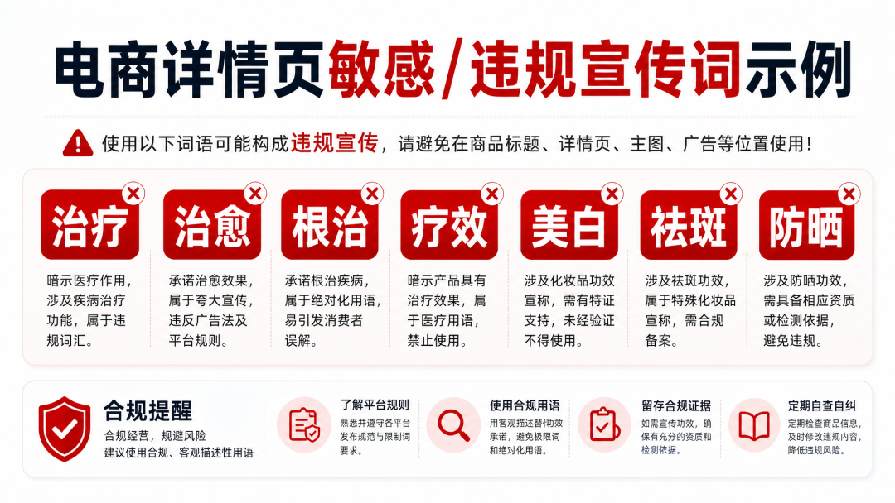

# 教你怎么设置电商违禁词AI防火墙（附完整搭建流程）

> 作者：旺哥 · 公众号：AI应用实战派PRO  
> [查看微信公众号原文](https://mp.weixin.qq.com/s?__biz=MzY4NDA4MDUwMA==&mid=2247483800&idx=1&sn=46d5e8edc16277742ea301b120c174d9&chksm=f2cf61ae32688df8b2313e45a71eaa5795bdda472694f38f7e168441cc91afc9aa716dd8c643#rd)
> [下载 HTML 图文包（含图片）](https://github.com/wangge-dev/wangge-articles/releases/download/html-archive/202605031929.zip) · [HTML 文件](../../html/2026/202605031929/article.html)

AI E-COMMERCE · PRACTICAL GUIDE

#  电商违禁词AI防火墙

器械/美妆类目怎么避坑

电商AI落地 · 一线实战

01  实战指南  08  系列文章  2026  最新

适用：合规岗/运营/文案 | 字数：约2400字 

大家好呀，我是  AI应用实战派pro  呀  ，  这是我的第  16  篇原创内容。趁着五一假期的空闲 ，赶紧给大家伙再更新一期电商违禁词的文章。

做电商的都知道，违禁词是条高压线。

但很多人以为违禁词就是"最""第一""顶级"这种极限词，实际上远不止。尤其是医疗器械和美妆护肤这两个类目，水深得很——有些词看起来完全正常，但放在特定语境里就是违规。

我之前帮团队审过一版详情页文案，运营写的时候觉得没问题，我一眼看过去觉得也没问题，结果平台审核的时候标出来三处——其中两处是我完全没想到的。后来我才意识到，
** 违禁词检查这件事，靠人眼盯是有盲区的而且远远不够，所以搭建自己品类的知识库很有必要的  ** 。

今天分享一个我用AI搭的"违禁词防火墙"思路，不贵、不难，但确实能帮团队少踩坑。

01

##  违禁词的坑，比你想的多

先说说为什么医疗器械和美妆类目的违禁词特别难搞。

** 第一类是明确禁用词。  ** 比如"治疗""治愈""根治""疗效"这些，放在医疗器械上属于承诺功效，直接违规。这个大部分人知道。

** 第二类是"擦边球"。  **
比如你不能说"治愈鼻炎"，但有人说"改善鼻部不适"——这在某些平台审核眼里也可能算暗示疗效。还有"医用级""院线同款""医生推荐"，这些在不同平台的判定标准不一样。

** 第三类是语境敏感词。  **
比如"美白""祛斑""防晒"这类词，普通产品随便用，但如果是普通化妆品却暗示有特殊功效，就可能踩线。反过来，有特殊化妆品备案的可以用"美白"，但不能用"快速美白""7天见效"。

** 第四类是平台差异。  ** 天猫、京东、拼多多、抖音，各家的违禁词库不完全一样。在A平台能过的文案，在B平台可能直接被下架。

所以问题很复杂：不是简单列个黑名单就行，要结合  ** 产品类型+宣称场景+平台规则+语境判断  ** 。

02

##  传统做法为什么不够

目前大部分团队的做法是三种：

** 第一种，运营自查。  ** 写文案的人自己把握。问题是运营通常不是法务出身，很多隐性红线不知道。而且自己写的东西，很难看出问题。

** 第二种，人工复核。  ** 让有经验的同事审一遍。这个相对靠谱，但有两个问题：一是慢，文案多的时候审不过来；二是人也会疲劳、也会漏。

** 第三种，用平台自带的检测工具。  ** 比如某些平台后台有敏感词检测，但通常只覆盖最基础的极限词，对医疗器械这种专业领域的覆盖不够。

我们团队之前就是"运营自查+审核"的模式，结果去年有一版详情页因为用了"消炎"两个字（某款产品），被平台下架整改，耽误了上新节奏。

那次之后，我开始研究怎么用AI来补强这个环节。

03

##  AI防火墙的核心思路

AI在这个场景里的价值不是"替代人工"，而是"在人工审核之前先做一轮初筛"，把明显的、基础的违规先拦掉，让人工把精力放在真正需要判断的灰色地带。

我的做法分三块：

** 第一块：建立分层词库  **

把违禁词分成三档，不同档位处理方式不同：

  * ** 红线档  ** （绝对不能用）：治愈、根治、疗效、治疗、医用、医生推荐……这类词AI直接标红拦截，提交都提交不了。 
  * ** 黄线档  ** （需要人工确认）：改善、缓解、修复、医用级、院线同款……这类词AI标黄提醒，运营需要说明使用理由，法务二次审核。 
  * ** 平台差异档  ** （各平台标准不同）：美白、祛斑、防晒、抗炎……这类词AI根据选择的平台做对应检测，提示该平台是否可用。 

** 第二块：语境检测  **

这是AI比传统词库强的地方。简单词库只能"匹配关键词"，但AI能读上下文。

比如"这个产品可以修复肌肤屏障"——"修复"在黄线档，但后面接了"肌肤屏障"，属于化妆品可以宣称的范围，AI可以判断为"可用但需注意表述"。

但如果写的是"这个产品可以修复受损组织"——"修复"+"组织"就偏向医疗宣称了，AI会标红。

当然，AI的语境判断不是100%准，但  ** 它能把"明显有问题"的先挑出来  ** ，大幅减少人工审核的工作量。

** 第三块：持续更新  **

违禁词库不是一成不变的。平台规则会变、新广告法会出、行业自律组织会发新指引。传统词库更新慢，但AI可以比较快地把新规则吸收进来。

我的做法是：每次遇到新的违规案例，或者看到平台出新规则，就把相关内容更新到知识库里。这样AI下次检查的时候，就能参考最新的标准。

04

##  具体怎么搭

不需要买昂贵的合规系统，用现有的AI工具就能搭一个基础版。

** 方案一：用Coze搭"违禁词检测智能体"  **

适合团队日常使用，操作步骤（之前讲过扣子搭建智能体，大家可以查看一下哈）：

[ 我用 Coze 搭了几个文案智能体配置和 PPT 都给你（附完整教程）。
](https://mp.weixin.qq.com/s?__biz=MzY4NDA4MDUwMA==&mid=2247483786&idx=1&sn=8154860aba49c306988698f3dcac18af&scene=21#wechat_redirect)

1\. 创建一个知识库，把你们类目的违禁词、平台规则、过往违规案例都放进去

2\. 写提示词，让AI扮演"电商合规审核员"

3\. 运营写完文案，先丢给这个智能体检测一遍

4\. AI输出检测结果：哪些词有问题、什么问题、建议怎么改

提示词参考（类目自己改）：

你是一位有5年经验的电商合规审核员，擅长医疗器械和美妆类目的文案审核。  请对以下文案进行违禁词检测，按三档输出： - 红线（必须修改）：明确违反广告法或平台规则 - 黄线（建议修改）：存在风险，建议替换表述 - 提醒（需要注意）：不同平台标准不同，需确认  检测时请结合产品类型和宣称场景做判断，不要只看关键词。  输出格式： [原文] [问题] [建议修改]

** 方案二：用Claude/Kimi/DeepSeek做批量检测  **

适合一次性检测大量文案，比如上新前集中审一批详情页。

把多个文案打包丢给AI，让它统一出一份检测报告。比一个一个查效率高很多。

** 方案三：接入工作流  **

如果团队用飞书，可以搭一个简单的审批流：文案写完→自动发给AI检测→检测通过→进入人工复审→发布。检测不通过的，直接打回修改。

这个需要一点点自动化工具的配合（比如影刀RPA或者飞书自带的自动化），但搭好后基本不用维护。

05

##  几个实操建议

** 第一，AI检测完必须人工复核。  ** 不要觉得AI过了就万事大吉。AI是初筛工具，最终责任还是在人。

** 第二，建立自己的案例库。  **
每次违规被平台打回，都把原文、违规原因、修改方案记录下来。这个案例库比通用的违禁词表更有价值，因为它是你们团队"踩过的坑"。

** 第三，定期对照平台官方规则。  **
AI的知识库更新再快，也快不过平台自己改规则。建议每个季度把各平台的最新规则导出来，和AI的结果对一遍，看看有没有偏差。

** 第四，培训和工具配合。  ** 工具再好用，如果运营不知道怎么用，也是白搭。建议做一张"常见违禁词速查表"贴在工位上，配合AI检测，双保险。

## 最后说两句

违禁词这件事，本质是"风险管控"。它不是要你把文案写得索然无味，而是要你在创意和合规之间找到平衡点。

AI防火墙的作用，就是帮团队把"低级错误"先筛掉，让运营和美工的精力集中在真正需要判断的地方。毕竟，人的时间应该花在"这句话怎么表达更有说服力又不违规"上，而不是"这个词能不能用"这种基础问题上。

如果你也在医疗器械或美妆类目，建议这周就试试搭一个最小版本的检测流程。先从你们被下架过/被投诉过的案例开始，建立第一批词库，后面再慢慢扩展。

一起加油！

END

觉得本文还不错，  ** 赶紧点赞收藏  ** 吧。关注我，还有更多精彩文章和教程。

我是  ** AI 应用实战派pro  ** ，只聊落地，不讲虚的。

---

本文最初发布于微信公众号「AI应用实战派PRO」。未经特别说明，正文与配图采用 [CC BY-NC-ND 4.0](https://creativecommons.org/licenses/by-nc-nd/4.0/deed.zh-hans) 许可。
