# 7000字教你从0开始用GPT-image-2搭建电商主图详情页（附完整教程和仓库地址）

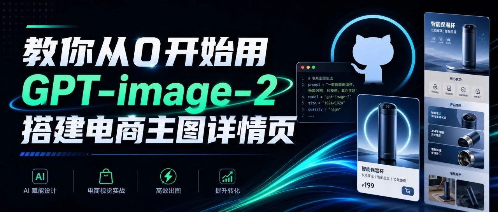

> 作者：旺哥 · 公众号：AI应用实战派PRO  
> [查看微信公众号原文](https://mp.weixin.qq.com/s?__biz=MzY4NDA4MDUwMA==&mid=2247483827&idx=1&sn=95d632b122a2df1f84239a34b7b06a26&chksm=f24b06ff12f7a4f4b5dba1f39e5391e9225e4a1efaf73f7a019deee5e13ce0a3afde2c066bc5#rd)
> [下载 HTML 图文包（含图片）](https://github.com/wangge-dev/wangge-articles/releases/download/html-archive/202605071734.zip) · [HTML 文件](../../html/2026/202605071734/article.html)

FULL FLOW · GPT-IMAGE-2

#  一瓶面霜  12 张电商图  
从 0 跑到上架级

12 张图 30 分钟 17 块钱  
提示词全在下面

2026.05.07 · PROMPT NOTES

12 张  完整链接  ¥17  API 成本  30 min  出图时间

OPENING

##  上次保温杯只跑了 7 种风格，这次想把一个完整链接跑一遍

上一篇拿一个不锈钢保温杯，把 GPT-Image-2 跑出了 7 种花。

[ 我用GPT-Image-2 把最普通的商品跑出了七种花样（附完整提示词以及可以白嫖的网站）
](https://mp.weixin.qq.com/s?__biz=MzY4NDA4MDUwMA==&mid=2247483764&idx=1&sn=d9c2d18620e9f0c8e6cf09f35b1caf26&scene=21#wechat_redirect)

那篇本质是工具包，每张图都是独立的风格练习——撕纸新中式、丝网印旅行海报、像素风、鸟瞰地图……七张图之间没有强关联，喜欢哪个用哪个。

但是现在还有几个问题：

一个新品上架到底需要哪些图？这些图能不能全部也用 GPT-Image-2 跑出来？一张白底主图我会，那卖点副图、详情页长图、618 主视觉这些怎么搞？

这个时候就不得不提github这个神奇的仓库了。今天要讲的是教你从0开始用github辅助做电商主图详情页，下面先看下这个仓库有什么：

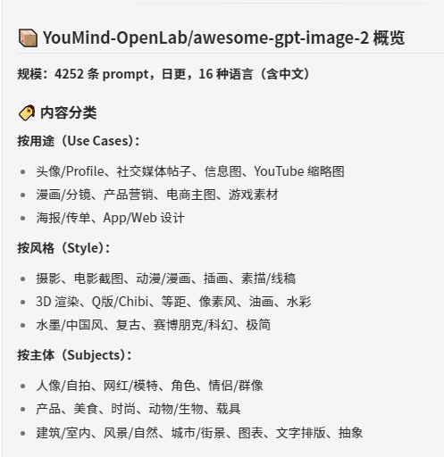

还是非常丰富的，地址：

https://github.com/YouMind-OpenLab/awesome-gpt-image-2

我们今天来搜电商专用的。这里我是让龙虾整理的（或者你让任意agent都可以整理出来）。

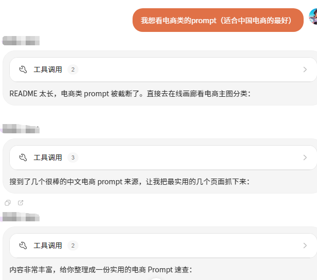

你也可以自己进去仓库下载。

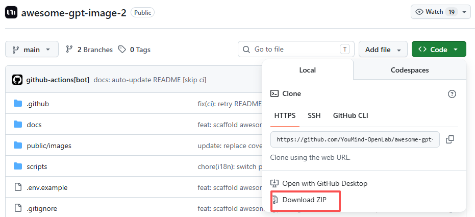

如果你不会整理让其他ai可以整理，把仓库地址丢给他然后把需求说出来就行了。

操作完后，接下来这一篇换个方法，我们挑一个虚构的护肤 SKU，把一个新品上架真正需要的  ** 12 张图  **
从头到尾跑一遍——白底主图、卖点副图、成分解析、使用前后、质地特写、场景氛围 ×2、SKU 卡、详情页长图、促销主视觉、广告素材 ×2，一张都不少。

每张图我都把 prompt 完整贴出来，截图就能抄。最后再讲讲我自己踩的几个坑、成本怎么算（如果用api来跑大概：12 张大概 17
块）。如果是订阅了ChatGPT PRO则是免费生成，没有订阅赶紧去订阅，抢到就是赚到真的，特别是对于出图要数量要求的。

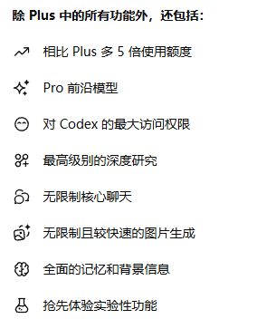

这篇为啥换品类？因为保温杯是单 SKU 单图练习，护肤品是完整链接全套图。  ** 测试目的不一样，方法也不一样  ** 。

PART 01

##  为什么是护肤品，不是衣服也不是 3C

很多人上来就拿衣服测，翻车率极高。相信做过的朋友都知道。

衣服对面料垂坠感、人体比例、穿搭协调性这几样要求太高，目前这一代模型还撑不住。3C 数码也不太适合，接口、按键、屏幕这些细节模型还在乱画。

护肤品反而是相对最稳的品类。

几个原因。瓶身上的中英文标签需要精准渲染，这恰好是 GPT-Image-2
这一代最强的能力。玻璃瓶、磨砂罐、乳霜质地这些材质，模型已经处理得相当真。而且护肤品从白底主图、成分解析到使用前后对比、场景氛围，图型种类极其丰富，刚好能把一个完整链接需要的图跑全。

我挑了一个  ** 虚构  ** 的 SKU——50ml
神经酰胺修护面霜，磨砂白罐加银色按压泵头。虚构的目的是为了不踩任何品牌版权问题，但产品规格是按真实护肤品的写法来的。

PART 02

##  一个新品上架到底要哪些图

不是 3 张，也不是 5 张，淘宝天猫一个完整的护肤品链接，通常需要 12 张：

· 白底主图 ×1（搜索结果页的第一印象）

· 卖点副图 ×4（详情页前五张里除主图剩下的那 4 张）

· 场景氛围图 ×2（让消费者带入"这就是我的生活"）

· SKU 多规格卡 ×1（不同容量横排）

· 详情页长图 ×1（从上拉到下那张信息长图）

· 促销主视觉 ×1（618、双 11 大促用）

· 广告投放素材 ×2（信息流 + 搜索广告各一张）

加起来正好 12 张。

一般电商公司都有美工和建模，做过运营的朋友肯定知道做这些图片没有个两三天是做不出来的。

而现在，下面这一套用 GPT-Image-2 跑下来，30 分钟出完，  ** API 费用大概 17 块人民币  **
。当然初稿不等于成片，后面我会展开讲。

PART 03

##  写 prompt 这事，别从空白页开始

很多人第一反应是"我自己从零憋"。

别这么干。

GitHub 上已经有很多社区验证过的 prompt 库摆在那儿，我们去仓库找现成的就行。

又因为刚才那个仓库里面的东西太多，所以我们只需搜索中国电商就行了。而中国电商场景一般要做三件事。把产品描述换成自己的——英文 prompt
里的产品名、材质、颜色全部替换成自家的。把文字内容换成中文，用「」中文引号包裹，渲染准确率明显高一些。把比例改成平台要的——海外 prompt 很多是
16:9 横版，国内电商主图要 1:1，这个必须改。

GitHub 的 prompt 是骨架，肉是你自己往上填的。

写 prompt 自己心里有几条铁律，下面 12 张图都是这几条的具体落地：

·  ** 3 层信息架构  ** ：核心承诺（≤15 字）+ 关键证据（2 到 3 个）+ 行动指令（≤8 字）

·  ** 留白必须显式声明  ** ："留白至少 50%"——不写 AI 一定画满

·  ** 否定清单不能省  ** ：每条结尾加 不要 logo、不要水印、不要装饰元素

·  ** 颜色用 hex 不用形容词  ** ：写  #FFFFFF  不写"白底"，写  #D4AF37  不写"金色"

·  ** 产品占比必须数字化  ** ：白底主图 35-40%，场景图 20-25%

·  ** 批量出图优于反复调参  ** ：一次 n=5 出 5 个方向，让 CTR 选风格，别让你的审美选风格

下面 12 张图，每张配 1 段思路 + 1 段完整 prompt。截图就能用。

PART 04

##  12 张图，逐张拆

IMG · 01

###  白底主图

这张图是消费者在搜索结果页看到的第一眼，重要性不用我多说。

写法上有几个细节。背景写  #FFFFFF  不写"白底"，"白底"出来的图背景是淡灰的。产品占画面 38%，35-40%
是白底主图的黄金比例，太小显廉价，太大显拥挤。然后是 3/4 微侧角度，比正面对镜头更有立体感。最后一个容易忽略的——顶部要留 200×100
的空白区给平台价格叠加，不写产品会把整个画面填满。

PROMPT

生成一张 1:1 电商白底主图，纯白背景  #FFFFFF  。 产品：一瓶 50ml 神经酰胺修护面霜，磨砂白色圆罐，银色按压泵头，
瓶身正面标签印有「CERAMIDE REPAIR」英文 + 「神经酰胺修护面霜」中文， 底部小字「50ml · 净含量」。 产品居中，占画面 38%，3/4
微侧角度展示瓶身立体感。 柔和棚拍光，顶部漫射，产品下方 5% 不透明度自然接触阴影。 保持瓶身形状、标签文字、颜色比例完全真实。
不要添加：道具、手、水印、假 logo、额外文字、装饰元素、渐变背景。 顶部中央 200×100 区域留空（平台价格叠加区）。

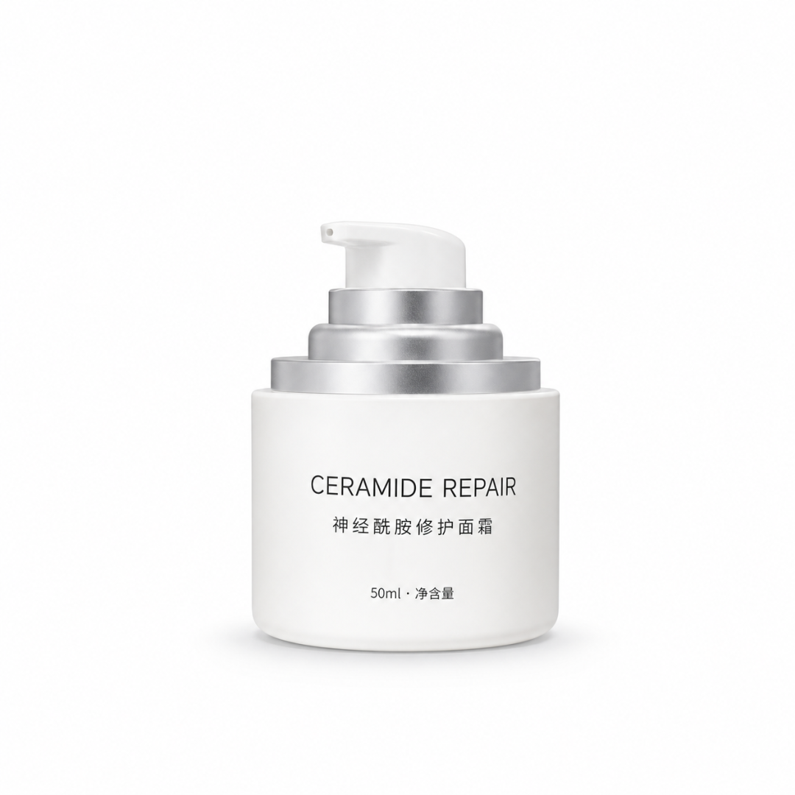

IMG · 02

###  核心卖点副图

左图右文，3 个圆形图标配 3 句短文案。盾牌代表修护屏障，水滴代表 72h 锁水，叶子代表温和低敏。

图标用具象图形，不要用抽象符号——消费者扫一眼就要懂，犹豫一秒就划走了。

PROMPT

生成一张 1:1 电商卖点副图，纯白背景。 左侧：一瓶 50ml 神经酰胺修护面霜（磨砂白罐，银色泵头），占画面 30%。 右侧：3 个圆形图标 +
文字区域，纵向排列： 1. 圆形图标内画一面「皮肤屏障」盾牌 → 右侧文字「修护屏障」 2. 圆形图标内画几滴水滴 → 右侧文字「72h 深层锁水」 3.
圆形图标内画一片叶子 → 右侧文字「温和低敏」 顶部标题：「3 重修护 · 1 罐搞定」36pt 深灰  #2D2D2D  加粗。 字体：SF Pro
Display 或类似简约无衬线体。 留白至少 45%。 不要添加：额外文字、英文假字、水印、装饰纹理。

看下效果还可以吧！

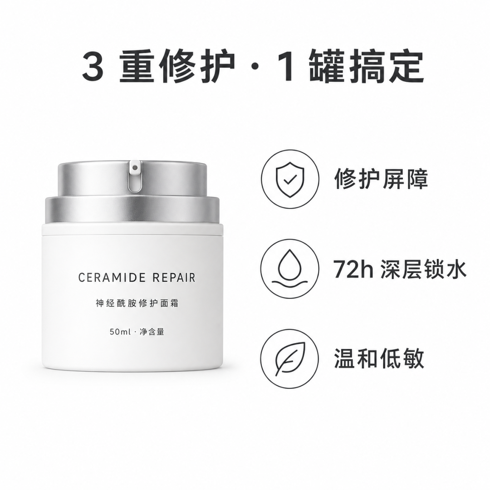

IMG · 03

###  成分解析副图

成分解析是护肤品转化率最高的副图类型，没有之一。

4 种核心成分用细线连接到瓶身，像 Apple 的产品拆解图那种感觉。背景从纯白换成浅米色  #F5F1E8  ，跟前面几张白底图拉开视觉节奏——连续 5
张纯白，消费者眼睛会疲劳的。

PROMPT

生成一张 1:1 电商成分解析副图。 背景：浅米色  #F5F1E8  ，微妙的纸张纹理感。 中央：面霜瓶（磨砂白罐，银色泵头），占画面 25%。
围绕瓶身，4 个成分标注区域，用细线连接到瓶身对应位置： - 左上：「神经酰胺 NP」→ 细线 → 瓶身，小字「修护皮肤屏障」 - 右上：「玻尿酸钠」→
细线 → 瓶身，小字「深层补水锁水」 - 左下：「积雪草提取物」→ 细线 → 瓶身，小字「舒缓褪红」 - 右下：「维生素 B5」→ 细线 →
瓶身，小字「促进修护」 每个标注区域包含：成分名（16pt 深咖  #3D2B1F  加粗）+ 功效（12pt 浅咖  #8B7355  ）。
顶部标题：「4 大核心成分」32pt 深咖加粗。 风格：Apple Style 产品拆解图，科学信息图美学。 字体：SF Pro Display。 no
watermark, no extra text。

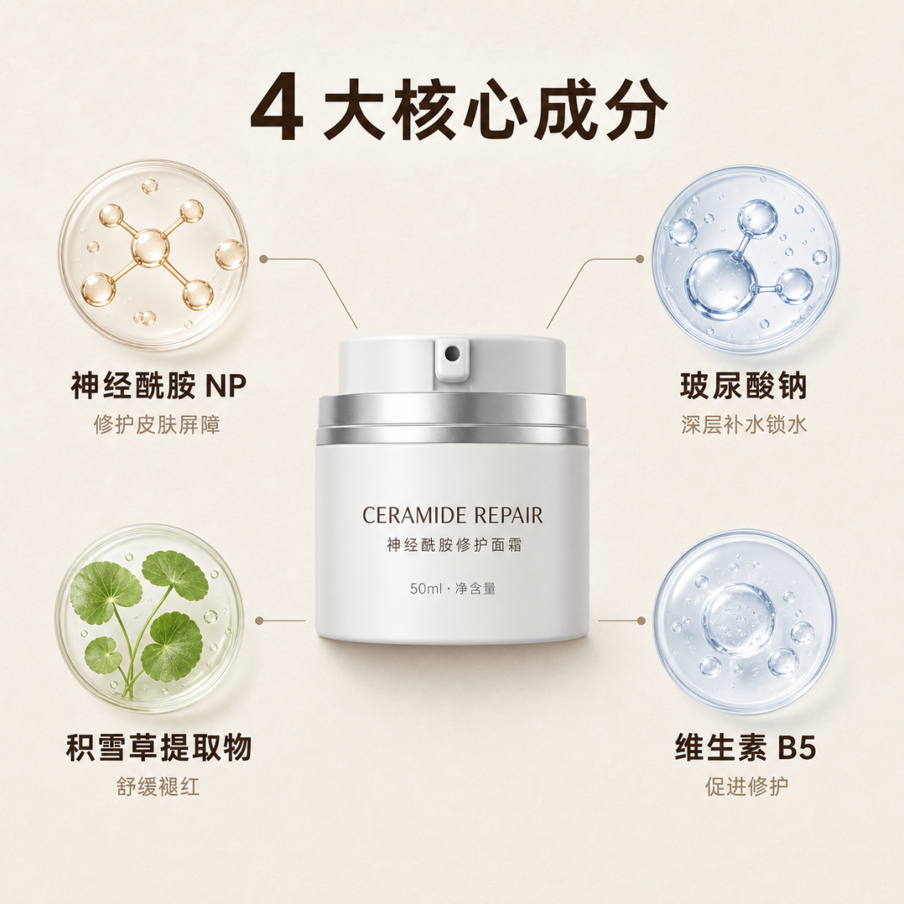

IMG · 04

###  使用前后对比

中间一条垂直分割线，左边干燥泛红，右边光滑水润，分割线上方放一个小面霜瓶发光晕。底部标题"28 天见证修护力"。

有个小细节，  ** 写具体天数比写"效果显著"有力 100 倍  ** ，数字就是说服力。但也不要夸张到"7 天见效"那种，护肤品监管比较严，写 28
天这种合理周期更稳。

PROMPT

生成一张 1:1 电商对比副图。 中间垂直分割线，左右对比： 左侧（使用前）： - 浅灰色底，特写面部皮肤，纹理粗糙、泛红、干燥起皮 -
左上角标签「使用前」14pt 浅灰 右侧（使用后）： - 浅米色底，特写面部皮肤，光滑细腻、水润透亮 - 右上角标签「使用后」14pt 深灰加粗
中间分割线上方：面霜小图（磨砂白罐），向两侧发出柔和光晕。 底部标题：「28 天见证修护力」28pt 深灰加粗。
风格：临床对比图，柔和自然光，真实皮肤质感，不过度修图。 no exaggeration, no watermark。

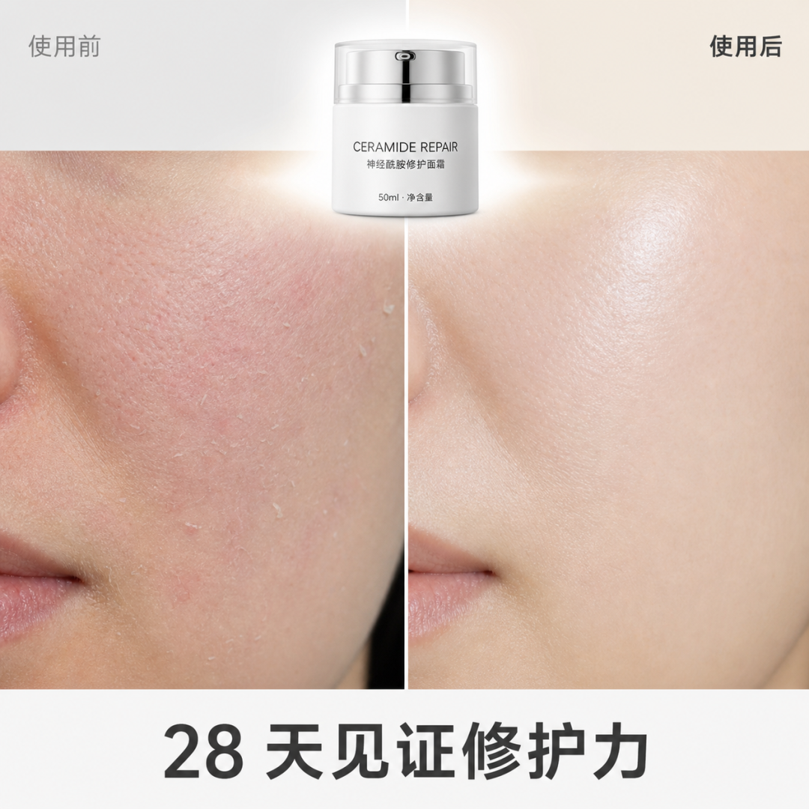

IMG · 05

###  质地特写

微距拍面霜从泵头挤出的瞬间，丝绸般绵密的质感。

这张图 prompt 关键词是"缓缓流动"和"柔和光泽"——你要让模型知道你要的是动态质感的定格，不是一瓶静态产品摆那儿。

PROMPT

生成一张 1:1 电商质地特写副图，纯白背景。 中央：面霜瓶（银色泵头朝上），泵头出口处挤出一小团乳白色面霜， 面霜正在缓缓流动，展现丝绸般绵密质地。
微距镜头，浅景深，焦点在面霜质地。 面霜表面有柔和光泽，可见细腻纹理。 自然侧光，轻微反光。 底部标题：「冰淇淋般丝滑质地」20pt 浅灰  #888  。
右下角小字「一抹化水 · 秒吸收」14pt 浅灰。 不要添加：多余文字、水印、假 logo、手指。

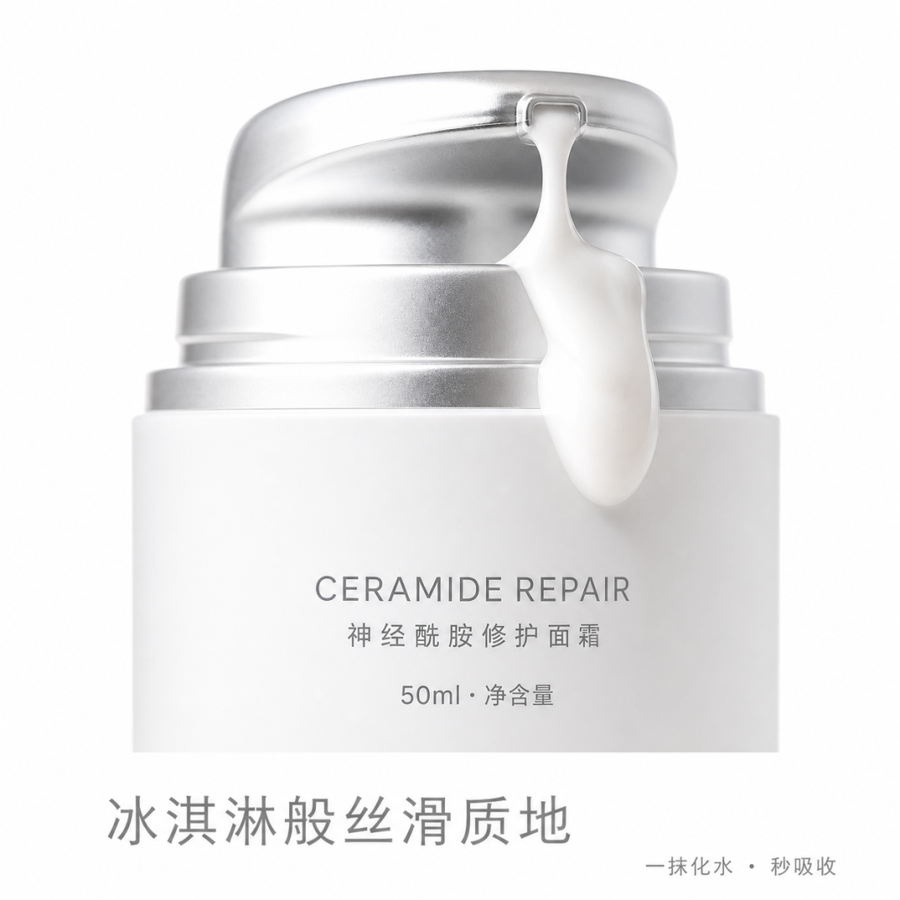

IMG · 06

###  场景氛围 · 晨间浴室

从棚拍切到真实生活。

磨砂窗透进的自然光，大理石台面，面霜瓶旁边放着毛巾、一杯清水、一束白色小雏菊。产品只占画面 20%，其余全是氛围。色温指定
5500K，这是晨间自然光的标准色温。

PROMPT

真实生活场景的电商氛围图，4:5 比例。 场景：晨间浴室，柔和自然光从磨砂窗透入。 洗手台大理石台面上，面霜瓶自然摆放在毛巾旁边，
旁边有一杯清水和一束白色小雏菊。 产品占画面 20%，景深虚化背景，色温 5500K。 产品标签清晰可读。 右下角小字标题「晨间护肤第一步」24pt 白色字
+ 半透明深色背板。 风格：lifestyle photography, soft morning light, Scandinavian
bathroom, high-fidelity Chinese text, no watermark, no excessive text。

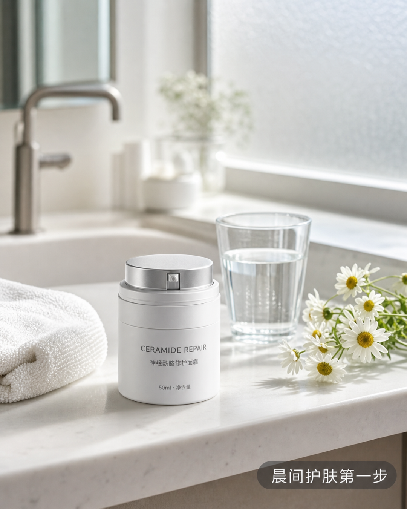

IMG · 07

###  场景氛围 · 夜间梳妆台

跟晨间浴室呼应的另一个时刻。暖黄台灯，木质桌面，旁边一本书一支没点燃的蜡烛，背景虚化可以看到床铺一角。

两张场景图有一个共同原则——产品占画面  ** 不超过 25%  **
。场景图不是产品图，它的功能是让消费者想象"如果这瓶面霜出现在我的生活里"，而不是"再看一遍产品长什么样"。

PROMPT

真实生活场景的电商氛围图，4:5 比例。 场景：晚间卧室梳妆台，暖黄色台灯光。 面霜瓶放在木质梳妆台上，旁边有一本书和一支蜡烛（未点燃）。
背景虚化可见床铺一角。 产品占画面 20%，暖色调，浅景深。 产品标签朝向镜头，清晰可读。 右下角小字标题「夜间深度修护」24pt 白色字 +
半透明深色背板。 风格：warm lifestyle photography, cozy interior, shallow depth of field,
high-fidelity Chinese text, no watermark。

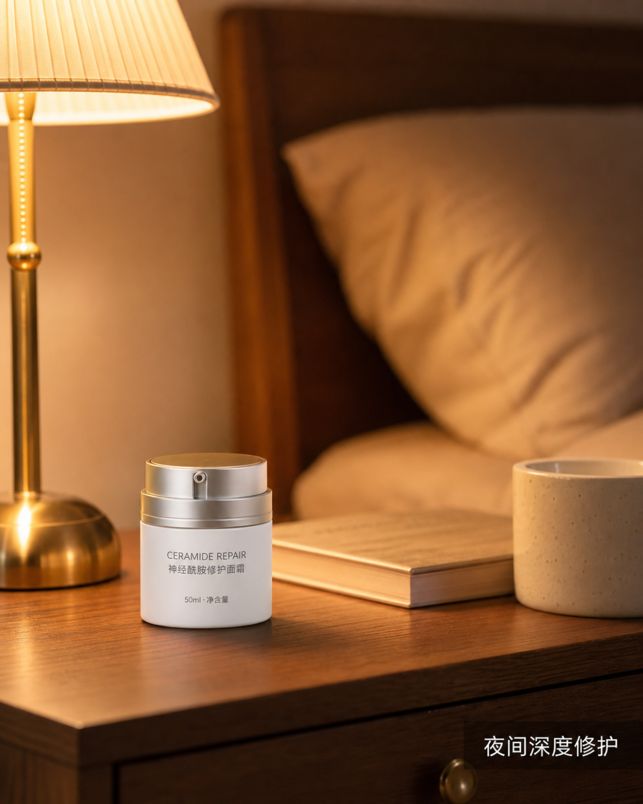

IMG · 08

###  SKU 多规格卡

30ml 旅行装、50ml 正装、100ml 家庭装三个横排，每个下面标容量和场景——"随身带""日常用""全家享"。

这张图最大的好处是模板可复用。换产品的时候只要改容量数字和场景文字就行，构图骨架不用动。

PROMPT

产品多规格展示卡，1:1 比例，浅米色背景  #F5F1E8  。 中央水平排列 3 个不同规格的面霜： - 左：30ml 旅行装（小号磨砂白罐） -
中：50ml 正装（中号磨砂白罐） - 右：100ml 家庭装（大号磨砂白罐） 每个产品下方标注容量和适用场景： 「30ml 随身带」/「50ml
日常用」/「100ml 全家享」（10pt 浅灰小字） 顶部主标题：「CERAMIDE REPAIR」36pt 深咖色加粗。 底部说明：「3 种规格 ·
按需选择」16pt 浅咖色。 柔和顶光 + 微弱投影，产品间距均匀，周围至少 40px 留白。 风格：Apple Style 极简产品摄影。 high-
fidelity color rendering, crisp small text, no watermark。

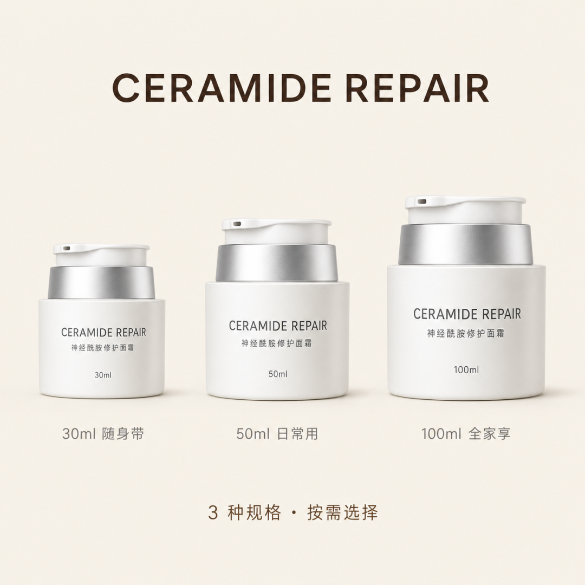

IMG · 09

###  详情页长图

这是 12 张里最复杂的一张。9:16 竖版，从上到下分 6 个区域。

品牌主视觉用深绿底加金色高光，主标题用衬线体 Didot，副标题用无衬线 SF Pro
Display——这种字体搭配是奢侈品画册的标准组合。核心卖点区切到浅米色，3 个卖点横排。成分解析区回到纯白，4
种成分各配原料小图。质地展示区再切浅米色，使用方法是 3 步流程图，适用肤质是 5 个打勾的标签。

6 个区域三种背景色交替——深绿、浅米、纯白，视觉节奏就有了。每一区的文字量严格控制，标题加副标题加小标注不超过 50
个字，超过了消费者根本不会看。特点特性你可以根据自己品牌特点来改。

PROMPT

电商详情页信息长图，9:16 比例。 从上到下分为 6 个区域： 【区域1 - 品牌主视觉】 深绿色  #1A3A2E  背景，面霜瓶居中，金色高光。
主标题「神经酰胺修护面霜」48pt 米白色  #F5F1E8  衬线体加粗。 副标题「CERAMIDE REPAIR · 50ml」20pt 米白色。
【区域2 - 核心卖点】 浅米色  #F5F1E8  背景。 3 个卖点横排：盾牌图标「修护屏障」/ 水滴图标「72h锁水」/ 叶子图标「温和低敏」
标题「3 重修护力」28pt 深咖色加粗。 【区域3 - 成分解析】 纯白背景。 4 种核心成分（神经酰胺NP / 玻尿酸 / 积雪草 / 维B5），
每种配一个原料实拍小图 + 名称 + 功效说明。 标题「4 大核心成分」28pt 深灰加粗。 【区域4 - 质地展示】 浅米色背景。
面霜挤出特写，展示丝绸般质地。 小字「冰淇淋般丝滑 · 一抹化水」。 【区域5 - 使用方法】 3 步流程图： ① 取适量 → ② 均匀涂抹 → ③
轻拍吸收 每步配简洁手绘图标。 【区域6 - 适用肤质】 5 种肤质标签：干性 ✓ / 混合 ✓ / 敏感 ✓ / 油性 ✓ / 痘肌 ✓
标题「全肤质适用」。 字体：Didot（标题）+ SF Pro Display（正文）。 整体风格：Hermès 级高级美学，留白 50%+。 no
watermark, no decorative noise。

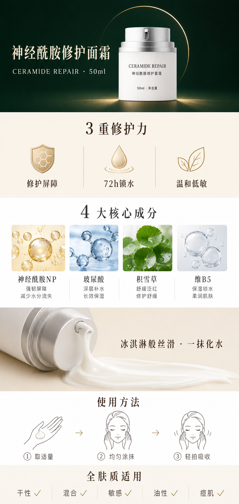

IMG · 10

###  促销主视觉

深绿底金色字，618 大促场景。

促销图最关键的是价格和 CTA 必须醒目，"¥198 原价 ¥328"原价划线，"立即抢购"按钮金底白字。  ** 促销图不怕信息少，就怕信息多  **
——消费者就记一个数字加一个按钮，其他全是干扰。

PROMPT

电商促销主视觉，3:4 比例。 背景：深绿色  #1A3A2E  ， 中央偏左：面霜瓶（50ml 正装），产品占画面 30%，金色侧光高光。
文字区域（右侧）： 主标题「618 限时特惠」64pt 金色  #D4AF37  加粗。 副标题「修护面霜 50ml」28pt 米白色。 价格行「¥198
原价 ¥328」18pt 浅灰色（原价划线）。 右下角 CTA 按钮「立即抢购」24pt 白字 + 金底圆角按钮。 左上角品牌 Logo 区域留白
200×100。 字体：Didot + SF Pro Display。 风格：luxury sale, premium aesthetic, gold
and dark green palette。 no watermark, no extra elements。

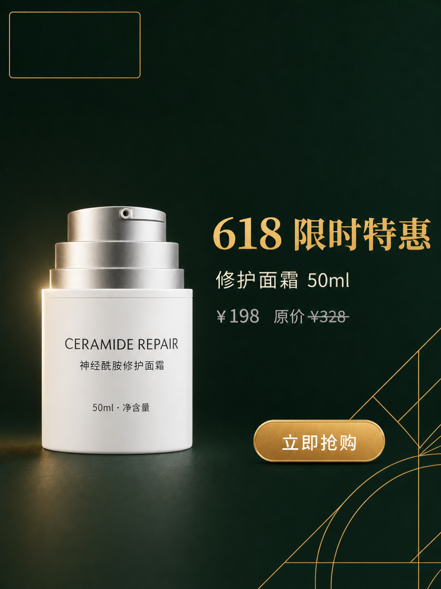

IMG · 11

###  信息流广告

抖音、小红书这种信息流广告的逻辑——  ** 强视觉冲击让人停下来  ** 。

白色大理石台面、几滴水珠、一片绿色薄荷叶，产品占画面 40%，比白底主图的 38% 略大一点，因为信息流环境干扰更多，产品要更突出。

PROMPT

电商广告投放主图，1:1 比例。 场景：白色大理石台面，面霜瓶居中，旁边有几滴水珠和一片绿色薄荷叶。 产品占画面 40%，强对比构图。
顶部标题「28天修护屏障」36pt 深灰加粗。 底部 CTA「去看看」20pt 白字 + 深灰圆角按钮。 产品标签清晰可读。光线明亮，色彩鲜艳。
不要出现：虚假认证标识、乱码、水印、夸张承诺。

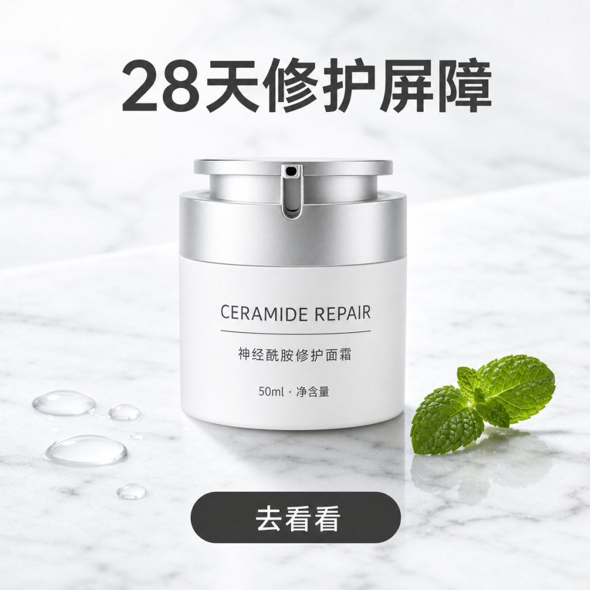

IMG · 12

###  搜索广告

淘宝直通车这种搜索广告的逻辑——  ** 清晰卖点让人点进去  ** 。和信息流的"停下来"是两个事。

纯白底加红色新品角标，产品占画面 45%（搜索图比信息流再大一点），左下角两行卖点。

PROMPT

电商搜索广告图，1:1 比例。 纯白背景，产品居中占 45%，3/4 角度。 右上角红色角标「新品」14pt 白字 + 红底。 左下角两行卖点： 「修护屏障
· 72h 锁水」18pt 深灰加粗 「敏感肌可用」14pt 浅灰 产品下方自然投影。 顶部中央留空 200×100（平台价格叠加区）。 风格：clean
e-commerce, crisp typography, no watermark。

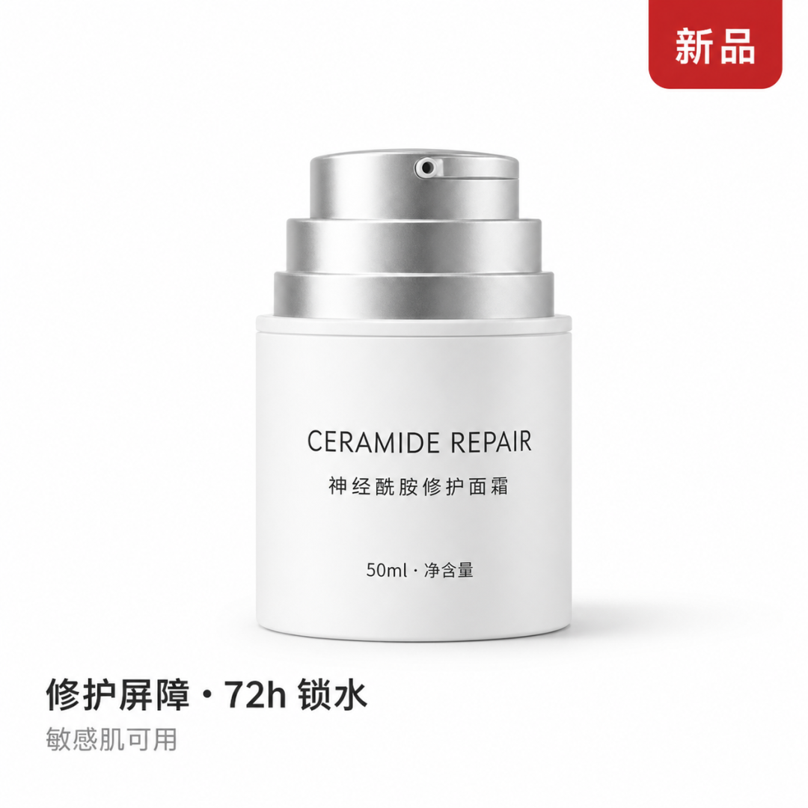
总结整体看下来还是可以，一次性出12张图就这效果，如果要修改的话也很快无非多花点时间，出图的时候要求ChatGPT保持产品的一致性就行。

PART 05

##  踩过的几个坑，你大概率也会遇到

过程不是一帆风顺，这个大家应该可以理解。下面看下出错的地方：

PIT · 01

中文字笔画错

标题里"修护屏障"出来一看，"障"字的右耳旁少了一竖。这种错肉眼看一遍容易漏，必须放大到 200%
逐字核对。复杂笔画的字（"赢""鬱""餮"这种）能换简单同义字就换，95% 的中文准确率不是 100%。

PIT · 02

品牌色漂移

Prompt 里写了"金色"，8 张图出来 8 种金，柠檬金、玫瑰金、古铜金……什么都有。后来全换成 hex 码  #D4AF37
，才稳定下来。颜色形容词在 prompt 里基本都不可靠，能用 hex 就用 hex。

PIT · 03

Logo 区被填满

你写"留空间放 logo"，模型经常当没看见。必须写"左上角 200×100 像素区域完全留白"，给出精确坐标才行。

这几个坑我都踩过，每条 prompt 里已经做了对应的防护。但你自己跑的时候，出图后还是要逐张检查，尤其是文字。

PART 06

##  聊聊成本和"省下的时间"

12 张图，GPT-Image-2 API 高质量模式 $0.20 一张，合计  ** 17 块人民币左右  ** ，30
分钟出完。如果是订阅的Pro模式不要钱简直不要太香。

公司美工建模：两三天，而且中间要不断沟通交流。

17
块出来的是初稿，不是上架级成片。你要花时间逐张检查文字、核对笔画、微调布局，第一批出图的质量也不会都让你满意，有的得重出。我自己跑这一套的时候，挑一个最接近的，再微调
prompt 出第二轮。这才是真实的工作流。

所以这件事的本质，  ** 不是"AI 替你做设计"，而是"AI 把从 0 到 80 分的环节帮你干了"  ** 。你专注做 80 到 100
分的精修，把摄影师设计师那些标准化、重复性的活儿外包给模型。

以前 80% 的时间花在从 0 到 80，现在 80% 的时间花在从 80 到 100，这才是真正的效率提升。

CLOSING

##  最后

GPT-Image-2 不会让你的电商图秒变爆款，但它确实把"出图"从瓶颈变成了可操作。以前一周出 5 套素材，现在一天出 5
套，多出来的时间你拿去选品、定价、看数据，这些才是真正决定生意的事。

如果你是电商运营，从白底主图开始试，这一张图最简单也最不容易翻车。如果你是设计师，把这套 prompt 当成设计需求文档来用——你给 AI
的指令越像你给实习生的需求文档，出来的东西越接近你想要的。

还有一件事我们不需要从零开始憋 prompt  。GitHub 上有很多条经过验证的 prompt 提示词，花 20
分钟搜一轮筛一轮，比你自己从空白页写个把小时强。先站在别人肩膀上，再往自己的方向走！

后面我会出一个简单的github教程，敬请期待吧！

我跑这一套是一次成型，护肤品这个 SKU
之前还试过其他的，比如滋补养生茶类，因为细节太多所以最后回到护肤品才比较稳。所以这套方法不一定是最好的，是我目前跑通的。如果你试了有更好的写法，欢迎告诉我。

如果是准备做一人公司的，你强烈推荐你试一下。

END

觉得这篇有点意思的话，  ** 点个赞、收藏一下  ** ，留着哪天产品上新需要做图的时候翻出来抄。  
  
我是  ** AI 应用实战派pro  ** ，只聊自己琢磨出来的东西。

REPO · GPT-IMAGE-2 PROMPT 仓库

https://github.com/YouMind-OpenLab/awesome-gpt-image-2

全球最大 GPT Image 2 prompt 库，2000+ 提示词日更。

  
本文 12 张图的 prompt 思路，部分参考自这个仓库的 poster / portrait / ui case 系列，再按电商场景做了适配改写。

---

本文最初发布于微信公众号「AI应用实战派PRO」。未经特别说明，正文与配图采用 [CC BY-NC-ND 4.0](https://creativecommons.org/licenses/by-nc-nd/4.0/deed.zh-hans) 许可。
