# 5000字教你入门github仓库，新手小白看这篇就行了（从看会到搭建仓库完整流程）

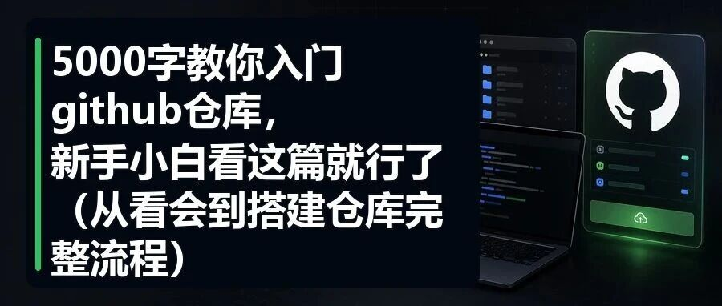

> 作者：旺哥 · 公众号：AI应用实战派PRO  
> [查看微信公众号原文](https://mp.weixin.qq.com/s?__biz=MzY4NDA4MDUwMA==&mid=2247483857&idx=1&sn=0895c9cd3765f40ad11ce7fc2e642a0c&chksm=f2dbfe74dc15be0badf52ec7befc8632dfd2f72e5e3366d7c0809858460eee8b19f3058260cb#rd)
> [下载 HTML 图文包（含图片）](https://github.com/wangge-dev/wangge-articles/releases/download/html-archive/202605091708.zip) · [HTML 文件](../../html/2026/202605091708/article.html)

GITHUB · FIRST ROUTE

#  普通人第一次用 GitHub 先看这篇

先会看项目、下载项目、收藏项目，再慢慢学命令。这个顺序会舒服很多。

先看懂

README / Issues

再拿下

ZIP / Releases

最后整理

Star / Notes

之前几篇文章里，我放过一些 GitHub 仓库地址。

[ 7000字教你从0开始用GPT-image-2搭建电商主图详情页（附完整教程和仓库地址）
](https://mp.weixin.qq.com/s?__biz=MzY4NDA4MDUwMA==&mid=2247483827&idx=1&sn=95d632b122a2df1f84239a34b7b06a26&scene=21#wechat_redirect)

[ 我用GPT-Image-2 把最普通的商品跑出了七种花样（附完整提示词以及可以白嫖的网站）
](https://mp.weixin.qq.com/s?__biz=MzY4NDA4MDUwMA==&mid=2247483764&idx=1&sn=d9c2d18620e9f0c8e6cf09f35b1caf26&scene=21#wechat_redirect)

比如 Prompt 合集、开源工具、别人整理好的资料库。

会用的人点进去就知道怎么拿，不会用的人点进去，大概率第一眼就被劝退。

全英文。

一堆代码。

上面还有 Code、Issues、Pull requests、Actions 这些词。

这就很容易让人误会：GitHub 是程序员才用的东西，和我这种做电商、做运营、做 AI 应用落地的人没什么关系。

我一个普通人，为什么还要专门学 GitHub？

对于我来说原因很简单：现在在公司推 AI 项目落地，很难完全绕开 GitHub 了。

很多 AI 工具、Prompt 库、浏览器插件、自动化脚本、Agent 框架，最早都是在 GitHub
上出现的。你不一定要自己写代码，但你至少要能看懂一个项目大概是干什么的，能不能下载，怎么安装，最近还活不活跃。

这个能力不只服务电商。

如果只把自己卡在“电商工具怎么用”这一层，后面上限会比较窄。AI 应用这件事往后走，肯定会越来越多地碰到开源项目、接口、脚本、插件、自动化工具。GitHub
就像一个入口，不会用的话，很多东西你只能等别人搬运完再看。

所以这篇我不写成“GitHub 完全指南”。

那种指南信息很全，但新手看完容易更晕（我自己看这种说明书也经常跳着看）。

这篇就按普通人第一次用 GitHub 的顺序来：

· 先知道它是什么。

· 再知道一个项目页面该看哪里。

· 然后学会下载、收藏、找项目。

· 最后再说中国访问慢怎么办。

不废话，直接开始。

01

##  先别急着学命令，先把 GitHub 当成一个工具仓库

GitHub 最标准的解释，是全球最大的代码托管和协作平台。

这个解释没错，但对新手不太友好。

你可以先把它理解成三个东西。

** 第一个，是工具仓库。  ** 很多开源工具会放在这里。比如 AI 绘图 Prompt
合集、浏览器插件、自动化脚本、数据分析工具、各种奇奇怪怪但很好用的小项目。

** 第二个，是说明书。  ** 一个项目能不能用，通常先看 README。README
就是项目首页那块说明文字，它会告诉你这个东西是干什么的、怎么安装、怎么使用、有没有注意事项。

** 第三个，是问题反馈区。  ** Issues 里面会有别人提的问题、报错、作者回复。很多时候，一个项目靠谱不靠谱，不看宣传页，看 Issues 更准。

所以先别把 GitHub 想成“我要进去写代码”。

你先把它当成一个很大的工具市场。

进去以后，先学会看货架，学会看说明书，学会把东西拿下来。

这样就够开始了。开始之前我们先把浏览器翻译的问题解决，要不然打开github仓库都是英文能瞬间劝退，如果你能fanqiang会魔法，那用谷歌自带的翻译就行。方法是右键任意网页-
翻译成中文简体。如果不能，那这里我推荐几个好用的插件。

###  . 沉浸式翻译（Immersive Translate）— 首推

  * ** 官网  ** ：immersivetranslate.com 
  * ** 是否需要翻墙  ** ：不需要，国内直接可用 
  * ** 核心特点  ** ：双语对照翻译，原文和译文同时显示在页面上，非常适合看 GitHub 的 README 和文档 
  * ** 支持的翻译引擎  ** ：集成 20+ 翻译服务（DeepL、ChatGPT、DeepSeek、Google、彩云等），可以自由切换 
  * ** 为什么适合 GitHub  ** ：它对 Markdown 渲染页面的支持很好，README、Wiki、Issues 都能直接双语对照阅读，不会破坏代码块的排版 
  * ** 免费额度  ** ：基础功能免费，高级 AI 翻译引擎有额度限制 

我们打开官网，之后安装到Chrome，其他浏览器也可以，这里不再赘述。

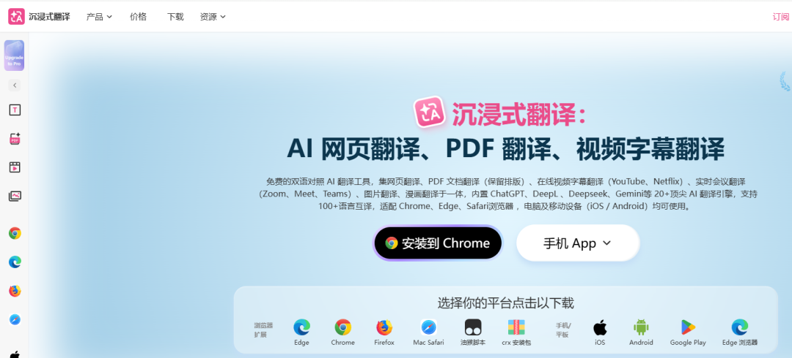

安装好固定要在浏览器上沿

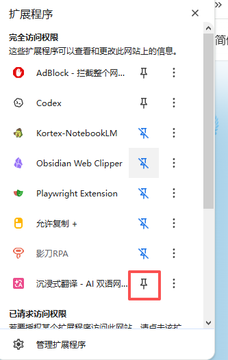

之后点击插件-设置，然后设置快捷键翻译这些都行。

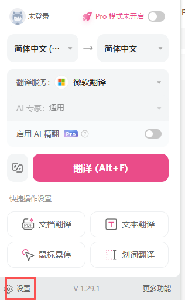
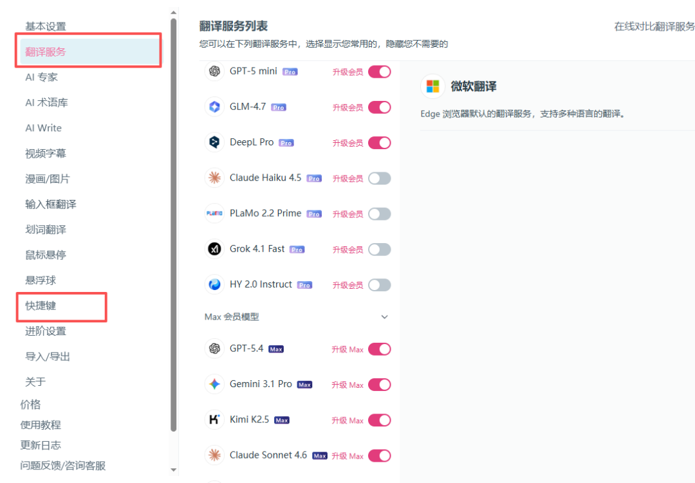

后面还有一个重要的点，要设置强制翻译所有内容，要不然插件之后翻译正文内容，一些标题还是英文，看截图就行。

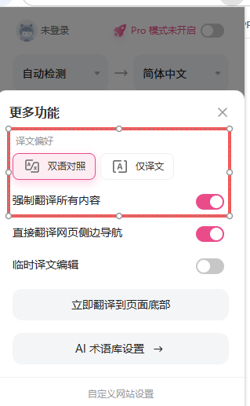

后面设置好之后，我们按我们自己设置的快捷键翻译就行。

也可以用这个插件，由于篇幅原因就不介绍了。

###  彩云小译

  * ** 官网  ** ：fanyi.caiyunapp.com 
  * ** 是否需要翻墙  ** ：不需要，国产服务 
  * ** 核心特点  ** ：同样支持双语对照，网页翻译时原文译文交替显示 
  * ** 优势  ** ：国内团队开发，服务稳定，对中文语境理解好 
  * ** 不足  ** ：翻译引擎选择没有沉浸式翻译多，对技术文档的专业术语有时不够准确 

接下来，我们以我们之前用的  [ awesome-gpt-image-2
](https://mp.weixin.qq.com/s?__biz=MzY4NDA4MDUwMA==&mid=2247483827&idx=1&sn=95d632b122a2df1f84239a34b7b06a26&scene=21#wechat_redirect)
为例：这个仓库内容还是很丰富的。值得大家标个星~

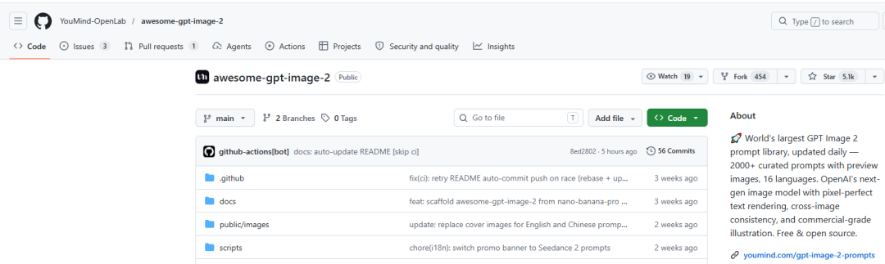
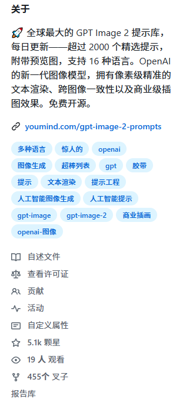
  

02

##  第一次打开一个项目，只看这几个地方

第一次进 GitHub 仓库，不要满屏乱点。

先看项目名字和简介。

一般在左上方。名字下面那一小行说明，能帮你快速判断它到底是工具、资料库、插件，还是纯代码项目。

然后看 README。

页面往下滚，中间最长的那块通常就是 README。重点看四个信息：

· 这个项目解决什么问题。

· 有没有安装方法。

· 有没有使用示例。

· 有没有截图或演示。

如果 README 写得很随便，或者只写了一堆开发者才看得懂的东西，那新手可以先放一放。不是说项目不好，只是可能不适合你现在用。

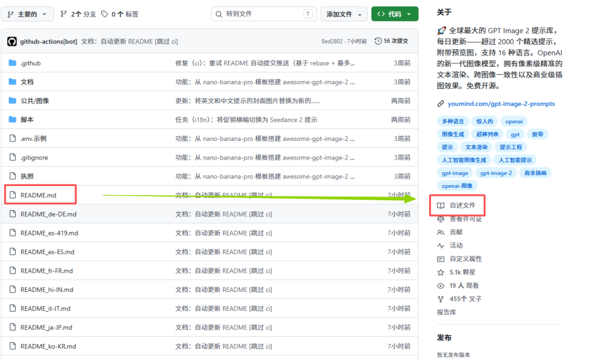

两个地方都可以。点击进去之后往下翻内容非常丰富

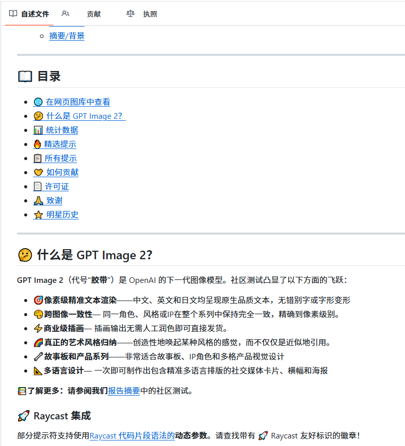

接着看绿色的 Code 按钮。

这里最常用的是两个东西：一个是复制项目地址，后面用 git clone 会用到；另一个是 Download ZIP，直接打包下载。

如果你现在不会 Git 命令，就先用 Download ZIP。这是我翻译后的截图。

再看 Releases。可以点击展开

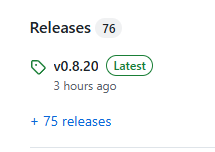
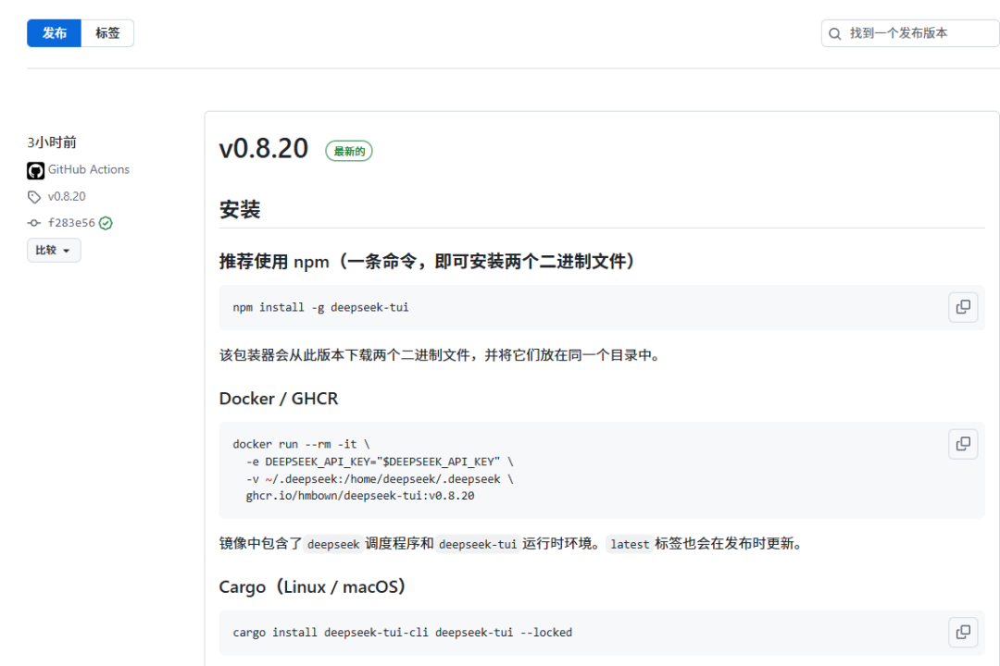
这是点击进去的样子。

这个地方很关键。

有些项目不是让你下载源码，而是已经打好了安装包。比如 Windows 的 exe，Mac 的 dmg，或者浏览器插件包。这种时候你应该去 Releases
下载，而不是点 Code 下载一堆源码。

这个坑很多人都会踩。

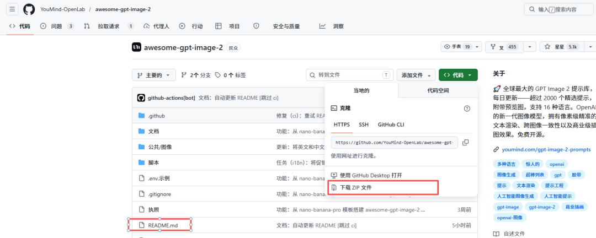

最后看 Issues 和更新时间。

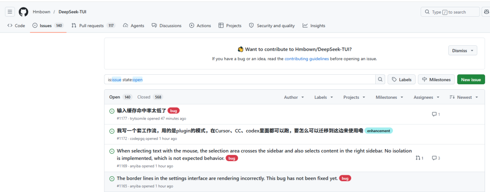

Issues 里最近有没有人反馈问题，作者有没有回复，项目最近有没有更新，这些都能帮你判断它还活不活。

简单说，第一次看一个项目，我只建议你看这几个地方：项目简介、README、Code、Releases、Issues、更新时间。

其他的先不用管。

03

##  从 0 开始，先跑通三个动作

很多教程一上来讲 Fork、Pull Request、开源贡献。

这些当然重要，但对大部分普通人来说太早了。

你先跑通三个动作就行。

** 先注册账号。  ** 用户名认真取一下，因为它会变成你的主页地址。邮箱能正常收邮件就行。GitHub 现在会要求两步验证，跟着提示做，推荐用
Authenticator App。

** 第二个动作是 Star。  ** Star 可以理解成收藏。看到一个 AI Prompt 合集、一个工具库、一个你后面可能会用的项目，点一下
Star。以后你可以在自己的 Stars 里面找回来。

** 第三个动作是下载。  ** 如果项目有 Releases，就优先去 Releases 里面找安装包。如果没有，再点 Code，选择 Download
ZIP。

下载下来以后，先打开 README，看它要求什么环境。很多项目需要 Node.js、Python、Docker 这些，如果你电脑没有，直接跑肯定报错。

到这里你就已经完成第一阶段了。

你能看项目，能收藏，能下载。

这比“我知道 GitHub 是什么”有用多了。

04

##  可以建一个自己的工具笔记仓库

后面我建议再做一件小事。

建一个自己的仓库。之后会跳转到新的页面。

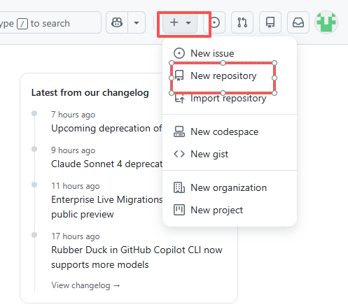

不用复杂，名字就叫  my-ai-tools  、  my-github-notes  、我的xxx仓库  都行。

创建的时候勾选 Add a README file。

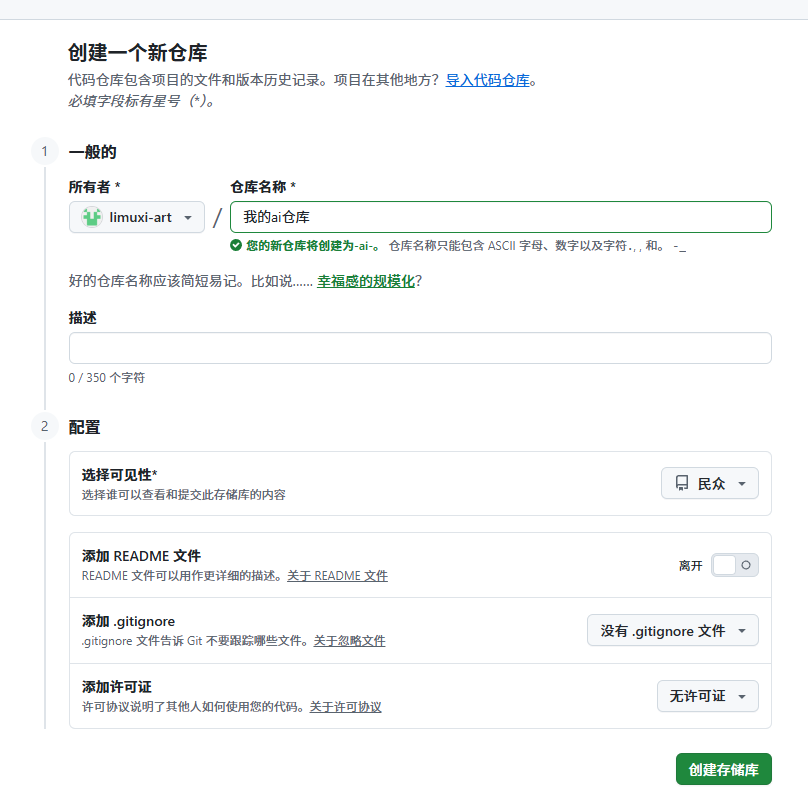

然后把你看过、收藏过、试过的项目记进去。

格式可以很简单：

README SAMPLE

# 我的 AI 工具收藏  ## 图片工具 - 项目名： - 地址： - 用来做什么： - 我试下来的感受：  ## Prompt 合集 - 项目名： - 地址： - 哪几个 Prompt 值得看：  ## 自动化工具 - 项目名： - 地址： - 需要什么环境：

这个不是为了装门面。

主要是避免 Star 点多以后变成垃圾收藏夹（这个大家应该都懂）。

你只要多写一句“我试下来的感受”，这个仓库就从收藏夹变成了你的工具笔记。

时间长了，它会很有用。

05

##  几个术语，用人话过一遍

GitHub 里有几个词，新手绕不开。

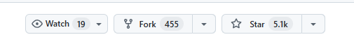

· Star，就是收藏。

· Fork，就是把别人的项目复制一份到你自己的账号下面。你可以在自己的副本里改，不影响原作者。

· Clone，就是把项目下载到你的电脑上。

· Commit，可以理解成存档。你改了一些文件，保存一次修改记录。

· Push，就是把你电脑上的修改上传回 GitHub。

· Pull Request，就是你改了别人的项目以后，向原作者申请：我改了这里，你看看要不要合并。

克隆指令-后面填写地址

git clone https://github.com/username/repo.git

这些词不用一天学完。

普通新手的顺序可以是：

先会 Star。再会 Download ZIP。再会看 README。再学 clone。最后再碰 Fork、Commit、Push、Pull
Request。

如果你只是想找 AI 工具、下载工具、看 Prompt 合集，前面几个已经够用很久了。

06

##  怎么找项目，重点是先想清楚你要什么

GitHub 最有价值的地方，不是别人给你一个链接，你点进去下载。

而是你能自己找到东西。

但搜索这件事不能乱搜。

你要先想清楚：我是想找工具，找资料，还是找能直接运行的项目。

如果你只是想看最近什么东西火，可以看 GitHub Trending（直接在网址端搜）。

TRENDING

github.com/trending

Trending 适合看趋势，不适合直接照单全收。比如某段时间 AI Agent、图片生成、浏览器自动化项目突然多起来，你大概能感觉到行业风向。

如果你想找某个领域的项目，可以看 Topics。

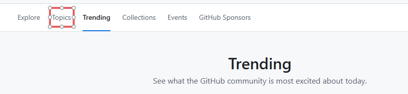

Topics 就是标签。

比如我自己就常用这些  ai  、  ecommerce  、  automation  、  browser-extension  、  prompt-
engineering  。中文也可以，但是英文搜出来的内容和质量都比较高。

ai  太大，但适合先看全局。

ecommerce  会筛出电商相关项目。

automation  对应自动化，很多运营提效工具会在这里。

browser-extension  对应浏览器插件，适合找采集、辅助分析、页面增强这类东西。

prompt-engineering  则适合找 Prompt 资源库。

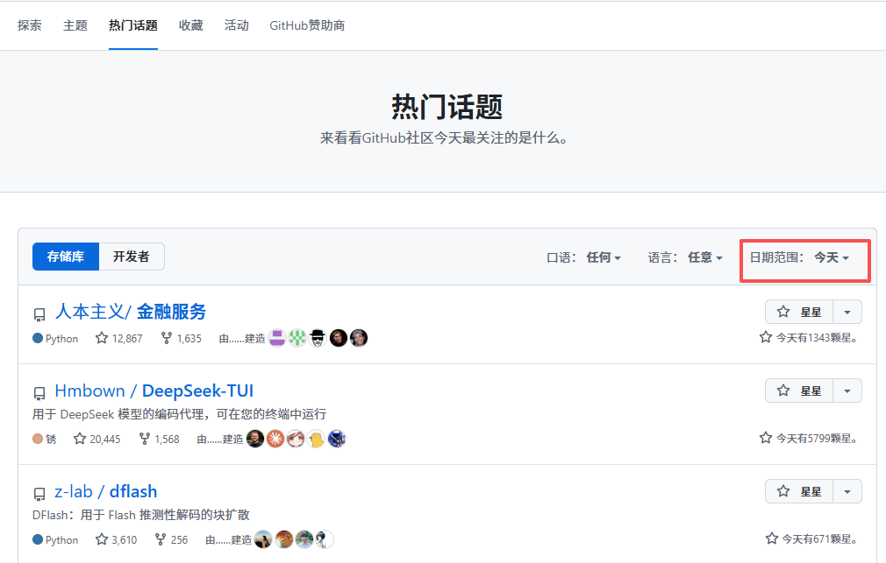

还可以搜 awesome 列表。

awesome 的意思不是“这个项目很厉害”，而是社区里有人整理的一份资源清单。

AWESOME LIST

awesome-ai awesome-prompt awesome-selfhosted awesome-python

这种列表对新手很友好，因为别人已经帮你筛过一遍。当然也可以换成中文但是那样的话资源比较少。

但也别迷信。awesome 列表很多也会过期，所以还是要看里面项目的更新时间。

再说几个搜索语法。

SEARCH EXAMPLES

stars:>1000 language:python ai  topic:ecommerce stars:>500  good first issue

stars:>1000  先筛掉太冷门的项目。

language:python  是因为很多 AI 工具、数据处理、自动化脚本都用 Python 写。

最后加  ai  ，把方向限制在 AI。点击右上角的搜索框

当然规则你可以自行改，下面是搜索框，在右上角。

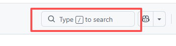
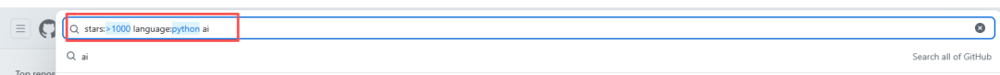

后面可以换成  topic:ecommerce stars:>500这样的组合。

搜电商相关项目时，用 topic 是因为很多项目作者会给项目打标签。  topic:ecommerce  比单纯搜 ecommerce 更干净一些。

good first issue  是开源项目里常见的标签，意思是“适合第一次贡献的人做”。

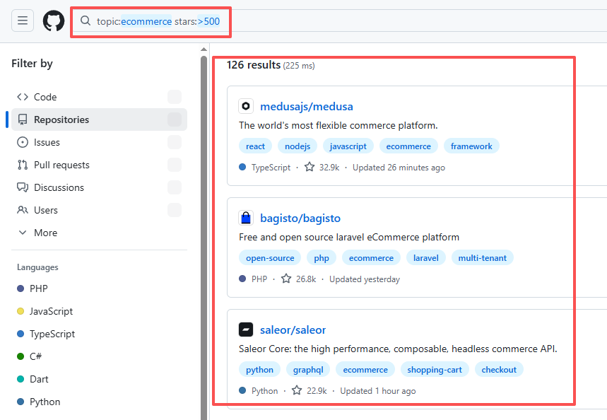

但我建议刚开始不要急着参与贡献。

你可以先点进去看看别人是怎么提问题、怎么讨论、怎么改代码的。看几次以后，你会更理解 GitHub 的协作方式。

搜索这块的核心不是记命令。

核心是先把需求拆清楚：我要找成熟项目，就加 stars；我要找某种语言，就加 language；我要找某个领域，就加 topic；我要找新手任务，就搜
good first issue。

这样搜出来的东西会清楚很多。

07

##  新手容易踩的几个坑

** 第一个坑，是下载错地方。  ** 很多工具应该去 Releases 下载安装包，但你点 Code
下载源码。下载回来一堆文件，双击哪个都打不开，然后觉得 GitHub 太难。不是 GitHub 太难，是入口选错了。

** 第二个坑，是 README 没看完。  ** 项目需要 Python，你电脑没有 Python。项目需要 Node.js，你电脑没有
Node.js。项目要求 Docker，你连 Docker 是什么还不知道。这种情况下直接跑命令，肯定报错。

** 第三个坑，是把密钥传上去。  ** API Key、Token、密码、账号信息，不要放进公开仓库。如果你建的是 Public 仓库，别人是能看到的。

** 第四个坑，是只看 Star。  ** 高 Star 说明很多人收藏，不代表它适合你。

我现在看项目，一般会按这个顺序：

先看它解决什么问题。再看 README 写得清不清楚。再看最近有没有更新。再看 Issues 有没有大量没人管的报错。最后才看 Star。

这个顺序会稳一点。

官方参考文档：  https://docs.github.com/zh，  里面介绍的也比较详细

08

##  国内访问慢，我把自己研究和网上资料整理了一下

GitHub 在国内有时候确实不稳定。如果能fanqiang会魔法则不用看下面的了。

如果偶尔使用下面可忽略哈。高强度使用+不会qiang可以看一下。

页面打不开、图片加载不出来、raw 文件访问不了、clone 到一半断掉，这些都挺常见。

这块我也是自己研究了一下，再结合网上一些资料整理的。不是说下面每种方法都一定适合你，但至少可以按场景选。

** 先说 Hosts。  ** 很多人会用 GitHub520 这类项目更新 GitHub 相关域名的 hosts，再用 SwitchHosts
管理和自动刷新。大概思路是，把 GitHub 常用域名解析到更合适的 IP，减少 DNS 抽风。

** 第二个是镜像站。  ** 镜像站适合下载公开项目和公开文件，比如 Release 包、zip、raw 文件。但只用来下载公开文件，不要在镜像站登录
GitHub 账号，不要输入密码，不要输入 token。

** 第三个是 SSH 走 443。  ** 如果你后面开始长期 clone、push 项目，HTTPS 不稳定，可以配置
SSH。刚开始只下载项目，可以先不用折腾。

** 第四个是 Gitee 中转。  ** 如果团队主要在国内协作，或者只是想把 GitHub 上的项目先拉下来研究，可以用 Gitee 导入 GitHub
仓库。

** 最后是 DNS。  ** 可以试试阿里 DNS、腾讯 DNS、114 DNS 这些。这个不一定立刻见效，但有时候能缓解解析问题。

ACCESS ROUTE

网页慢：Hosts + SwitchHosts 下载慢：镜像站下载公开文件 长期 clone / push：SSH 团队国内协作：Gitee 中转 解析抽风：换 DNS

不要一上来就把加速折腾半天。

先确认你要干什么。

只是下载一个公开项目，就用下载加速。

要长期维护自己的仓库，再去配 SSH。

END

##  最后

GitHub 这个东西，刚打开确实不友好。

但普通人第一阶段不用学得太重。

· 先会找项目。

· 再会看 README。

· 再会下载 Releases 或 ZIP。

· 再会 Star 和整理自己的工具清单。

· 最后再慢慢学 clone、commit、push、Pull Request。

这个顺序比较舒服。

尤其现在做 AI，很多东西都先出现在 GitHub。Prompt 合集、Agent 框架、自动化脚本、浏览器插件、开源工具，基本绕不开。

你不需要马上变成程序员。

但至少要能看懂门牌号，知道哪个门可以进去，哪个文件能下载，哪个项目值得先收藏。

先到这一步，就够用了。

官方参考文档：  https://docs.github.com/zh

如果有个人或者企业咨询ai应用落地或者构造个人/企业专属智能体的，欢迎加我个人微信：  HPwangtang

END

觉得本文还不错，  ** 赶紧点赞收藏  ** 吧。关注我，还有更多精彩文章和教程。

我是  ** AI 应用实战派pro  ** ，只聊落地，不讲虚的。

---

本文最初发布于微信公众号「AI应用实战派PRO」。未经特别说明，正文与配图采用 [CC BY-NC-ND 4.0](https://creativecommons.org/licenses/by-nc-nd/4.0/deed.zh-hans) 许可。
