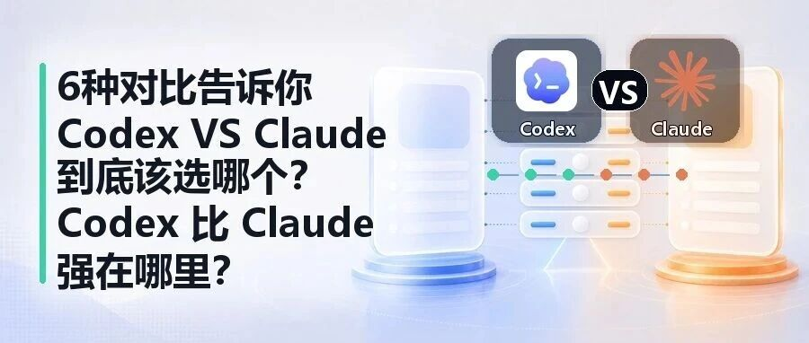
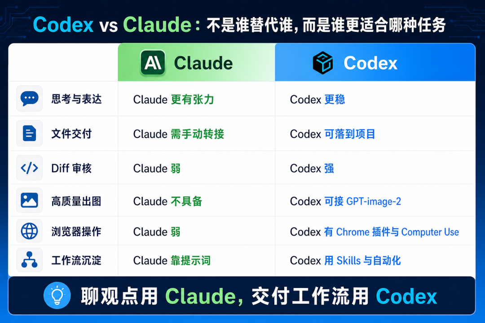
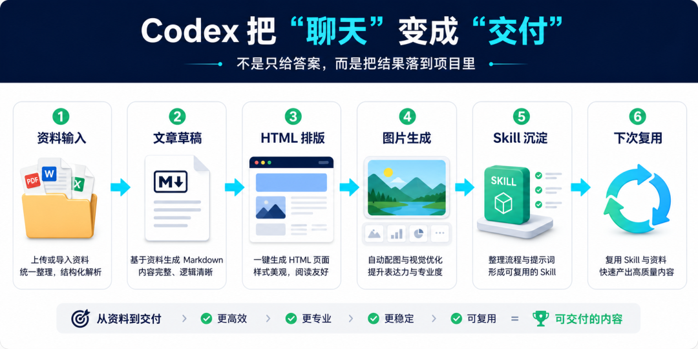
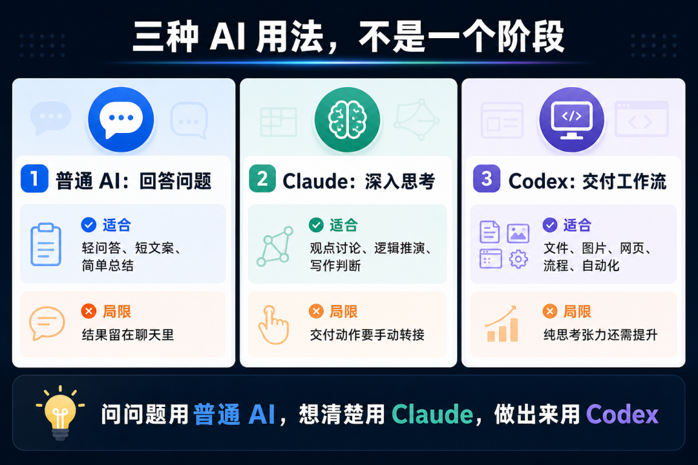

# 6种对比告诉你Codex VS Claude 到底该选哪个？Codex 比Claude 强在哪里？

> 作者：旺哥 · 公众号：AI应用实战派PRO  
> [查看微信公众号原文](https://mp.weixin.qq.com/s?__biz=MzY4NDA4MDUwMA==&mid=2247483914&idx=1&sn=70c0a47b0f401f15bf574c2b72f744f2&chksm=f24cf8ff7563a63f192a3d11ef26b317c314c4e5df21b4e5e147cfcdd69e1e6168fd0e1d7e7b#rd)
> [下载 HTML 图文包（含图片）](https://github.com/wangge-dev/wangge-articles/releases/download/html-archive/202605161047.zip) · [HTML 文件](../../html/2026/202605161047/article.html)

AI 应用实战派 PRO

#  Codex 这 6个用法，我试完发现更适合干活

写稿、出图、排版、浏览器操作，都能接上。

核心变化

从回答到交付

关键能力

文件 + 图片 + 网页

适合场景

电商与内容落地

最近 Codex 讨论明显变多了。

有人拿它和 Claude Code 比，有人说它额度更多，也有人说它终于不像以前只是“写代码工具”了，而是一个真正的agent。

做 AI 项目的推进之后，对“又一个很强的工具”自然是要体验一番。体验下来之后必须要给到夯。比什么龙虾的好多了。没有体验过的赶紧去体验一下哈。

工具到底强不强，不看宣传。

要看它能不能进入真实工作。

这段时间我认真用下来，感受比较明确：

** Codex 真正吸引我的，不是它会写代码。  **

** 而是它能把文字、文件、图片、网页操作这些动作，接成一个工作流。(个人感受，如果你有不同的观点欢迎留言区讨论！)  **

图位 1｜Codex vs Claude 总览对比图

  

01

##  为什么 Codex 最近会火

先说一个现实背景。

Claude 依然很强。

尤其是 Opus，那种“它好像能比你多想一步”的感觉，确实很容易让人上头。

但很多人用 Claude Code，也会遇到一些现实问题。

比如费用、额度、任务中断、账号限制。

特别是频繁的封号，相信被封的朋友应该不少(推荐可以去淘宝上买那个销量高的，还有就是不要频繁换梯子切记切记)

这些东西平时看起来只是小麻烦。

但一旦你把复杂任务交给 AI，做到一半突然断掉，就很难受。

不是它不聪明。是你的工作节奏被打断了。

这也是为什么最近很多人开始看 Codex。

它不一定在每个方面都比 Claude 强。

但它给人的感觉更像一个可以长期干活的工作台。

Project、文件落盘、diff 审核、Skills、自动化、Chrome 插件、Computer Use、GPT-image-2 出图  。

这些能力单独看都不神奇。

但合在一起，就不只是聊天工具了。

02

##  我为什么开始用它

我不是程序员出身。

我更多是在公司里做业务、做电商、推 AI 项目落地。

所以我对工具的判断很简单：

** 能不能帮我把真实工作往前推。  **

比如一堆资料、一堆截图、一堆表格，最后要变成一篇文章、一个 HTML 页面、一组小红书图文，或者一份内部 SOP。

普通 AI 对话框当然也能帮你总结。

但总结完之后，后面还有一堆事。

复制出来，存成文件，改格式，做配图。

整理素材目录，再把经验变成下次能复用的规则。

这些才是真正耗时间的地方。

Codex 对我有价值，就是因为它不只是给一段回答。

它能把东西落到项目里。

文件草稿可以落成 Markdown，排版可以落成 HTML，图片位置可以列出来，流程可以沉淀成 Skill，下一次还能继续接着用。

图位 2｜从资料到交付的 Codex 工作流图

03

##  图片能力，是我现在特别看重的一点

这里要单独说一下 GPT-image-2。

最近大家应该也被 GPT-image-2 生成的图片刷到过。

我之前写的  GPT-image-2  文章，大家可以看一下效果（没有精修过）：

[ 7000字教你从0开始用GPT-image-2搭建电商主图详情页（附完整教程和仓库地址）
](https://mp.weixin.qq.com/s?__biz=MzY4NDA4MDUwMA==&mid=2247483827&idx=1&sn=95d632b122a2df1f84239a34b7b06a26&scene=21#wechat_redirect)

[ 我用GPT-Image-2 把最普通的商品跑出了七种花样（附完整提示词以及可以白嫖的网站）
](https://mp.weixin.qq.com/s?__biz=MzY4NDA4MDUwMA==&mid=2247483764&idx=1&sn=d9c2d18620e9f0c8e6cf09f35b1caf26&scene=21#wechat_redirect)

这个能力对很多人来说可能只是好玩。

但对电商人来说，它不是玩具。

** 它是生产力。  **

做电商，很多时候不是缺一句文案。

是缺图。

主图要图，详情页要图，小红书封面要图，项目文件里讲一个复杂流程，也最好有图。

以前你让 AI 写完项目文件，后面还要单独切到别的工具做配图。

现在 Codex 如果能直接接 GPT-
image-2，就意味着它不只是写文字，还能参与视觉生产。现在可以在skills嵌套图片生成技能，这样遇到需要生图的地方（流程图对比图等，可以直接生成而不需要单独设立一个对话框去说帮我生成一个xxx图片）。

这个差别很大。

以后只要文件里出现对比、流程、路线图、工具选型，它就应该自动判断这里适不适合做图。

如果适合，就在文件里留图位，甚至直接生成一张能放进去的图片。

因为很多公司运营或者领导不是看不懂，而是纯文字看起来太累。一张对比图，能省掉很多解释。

图位 3｜电商人为什么更需要 Codex 出图能力

04

##  Chrome 插件和 Computer Use，让它不只会“建议你去做”

还有一个我觉得很关键的点：

** Codex 能接浏览器和电脑操作。  **

这件事对非程序员其实更重要。

很多 AI 只能告诉你：

你可以去这个网站查一下。

你可以打开这个页面。

你可以把结果复制回来。

听起来没问题，但本质上还是你在干活。

Codex 的 Chrome 插件和 Computer Use 的意义在于，它有机会直接去看网页、点页面、读信息、基于当前登录态完成一些操作。

这和普通聊天框不是一个体验。

比如查资料、看竞品页面、整理网页信息、填表、检查一个页面有没有更新。

过去你要自己点。

现在可以把一部分动作交给 AI。

当然，涉及付款、下单、账号安全、公司内部系统，还是要人工确认。

但方向已经很清楚了：

AI 不再只是告诉你怎么做。

它开始能帮你做一部分。

05

##  Claude 依然强，但 Codex 更适合“交付型任务”

这篇不是说 Claude 不行。

恰恰相反，Claude 在思考、表达、讨论上的体验依然很好。特别是在文字处理和

写文案润色方面，这一点codex就稍逊色了，不过最近的opus 4.7在文字方面反而

不如之前的opus 4.6，不知道什么原因（狗头）。

还有就是编程方面这个没得说，不过我目前编程方便不怎么用，所以我就不评价

还有你想和 AI 深聊一个问题，或者希望它帮你把观点往前推一点，Claude 很多时候更有张力。

但如果任务变成整理资料、生成文件、改 HTML、出图、查网页、看 diff、沉淀 Skill，让流程下次还能继续复用，那 Codex 的优势就会明显很多。

Claude 更像一个很会思考、很会讨论的助手。

Codex 更像一个可以接任务、能落文件、能出图、能操作网页的工作台。

这两个不是谁完全替代谁，而是适合的任务不同。

图位 4｜普通 AI / Claude / Codex 三方工作方式对比

06

##  对我来说，Codex 的价值在电商和内容工作里会更明显

如果只是写一段短文案，我不一定非要用 Codex。

普通聊天框也够。

但如果我要做一套完整内容：先整理资料，再搭文章结构，再写正文，再做 HTML，再生成配图，再沉淀成下次能复用的 Skill。

那 Codex 就更顺。

因为它处理的不是一句话。

而是一串连续动作。

电商工作本来就不是单点任务。

你要看竞品，要分析评论，要拆卖点，要做主图，要做详情页，要写小红书，要做推广，还要把一次经验变成下次能复用的流程。

如果 AI 只能写文案，那只是帮了一小段。能写、能看、能出图、能落文件、能沉淀流程，才更接近真正的 AI 落地。

07

##  什么时候不需要 Codex

也别把 Codex 神化。

如果你只是问一个概念，普通 ChatGPT 就够。

如果你只是想和 AI 深度讨论一个观点，Claude 可能更舒服。

如果你长期在 IDE 里写代码，Cursor、Claude Code、VS Code 插件也都有各自顺手的地方。

Codex 更适合的是这类任务：

有资料、有文件、有图、有网页，要反复修改，要检查结果，要沉淀流程，要输出可交付物。

这也是我现在对它的定位：

它不是一个更聪明的聊天框。

它更像一个可以帮我推进任务的工作台。

如果只是聊天，很多 AI 都够用。

但如果你要把文字、图片、网页和文件一起交付出来，Codex 的优势才会真正出来。

如果有个人或者企业咨询ai应用落地或者构造个人/企业专属智能体的，欢迎加我个人微信（free）：  HPwangtang

最后留一个问题：

你现在用 AI，更多是在问它问题，还是已经开始让它接一段工作流程了？

这两个阶段，体验真的不一样。

AI 应用实战派PRO

觉得本文还不错，赶紧点赞收藏吧。  
关注我，还有更多精彩文章和教程。

我是  ** AI 应用实战派pro  ** ，只聊落地，不讲虚的。

---

本文最初发布于微信公众号「AI应用实战派PRO」。未经特别说明，正文与配图采用 [CC BY-NC-ND 4.0](https://creativecommons.org/licenses/by-nc-nd/4.0/deed.zh-hans) 许可。
