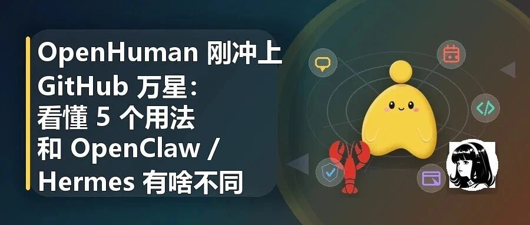

# OpenHuman 刚冲上 GitHub 万星：看懂 5 个用法和 OpenClaw / Hermes 有啥不同

> 作者：旺哥 · 公众号：AI应用实战派PRO  
> [查看微信公众号原文](https://mp.weixin.qq.com/s?__biz=MzY4NDA4MDUwMA==&mid=2247483925&idx=1&sn=75905fc261fb07bc7d97d3f032a31282&chksm=f2dc67a201670ad214bf8716b8a2c1cca3799c2ed54ba11a7afbb4e8bc74f1551ef3a79b98ed#rd)

AI HOT / OPENHUMAN

#  OpenHuman 刚冲上 GitHub 万星：看懂 5 个用法和 OpenClaw / Hermes 有啥不同

刚出圈的项目，先搞清楚它是什么、怎么用、和同类 Agent 到底差在哪。

热度

万星级

定位

桌面 AI

阶段

Early Beta

OpenHuman 这两天有点出圈。

GitHub 上已经冲到万星级别，Fork 也接近 900。一天涨近1000星！

同类 AI Agent 项目最近不少，前面有 OpenClaw，也有 Hermes。

所以这篇先不急着吹。

也不急着下结论说谁替代谁。

刚出圈的项目，最适合先搞清楚三件事：

它到底是什么？

我们怎么用？

它和 OpenClaw、Hermes 这些项目有什么不同？

我看了一下 OpenHuman 的公开仓库和其他介绍，先说一个比较直观的判断：

它火起来，不只是因为“又来了一个 Agent”。

而是它把 Agent 做成了一个更容易被小白理解的形态。

桌面应用。

一键连接账号。

自动同步资料。

本地记忆树。

还有一个会说话、有表情的桌面小人。

01

##  OpenHuman 是什么

OpenHuman 官方给自己的定位是：

** Personal AI super intelligence。  **

这个说法整得挺大的，不知后续如何。

但我们先别被这个词带跑。

拆开看，它更像是一个桌面端个人 AI Agent。

它想做的不是单纯聊天。

而是把你的工具、资料、日历、邮件、文档、代码仓库这些东西接进来，让 AI 对你的工作环境有持续理解。

  

** 第一，  ** 它是 UI-first，尽量让你从桌面应用开始，而不是先打开终端、配一堆插件。

** 第二，  ** 它有 118+ 第三方集成，包括
Gmail、Notion、GitHub、Slack、Calendar、Drive、Linear、Jira 等常见工具。

** 第三，  ** 官方说法是，每 20 分钟从已连接的服务里拉取新数据。

** 第四，  ** 它会把资料整理成 Memory Tree，放进本地 SQLite，也能生成 Obsidian 兼容的知识库。

** 第五，  ** 它还有桌面 Mascot，可以说话、有表情，也能做一些语音和会议相关的事情。

所以一句话说：

OpenHuman 想做的不是“你来问我”。

而是“我先了解你的工作环境，然后再帮你做事”。

这就是它最抓人的地方。

安装方式：

** 1\. 一键安装预编译版本（推荐普通用户）  **

直接运行官方安装脚本，自动下载最新稳定版：

  * ** macOS / Linux  ** ：  ` curl -fsSL https://raw.githubusercontent.com/tinyhumansai/openhuman/main/scripts/install.sh | bash  `
    * macOS 会安装  ` OpenHuman.app  ` 到  ` ~/Applications  `
    * Linux x64 会安装 AppImage 到  ` ~/.local/bin/openhuman  ` 并写入桌面快捷方式 
  * ** Windows  ** ：PowerShell 执行  ` irm https://raw.githubusercontent.com/tinyhumansai/openhuman/main/scripts/install.ps1 | iex  ` ，下载 MSI/EXE 安装包 
  * 也可以直接去 GitHub Releases 页面手动下载 

** 2\. 从源码编译（开发者/贡献者）  **

需要 Node.js 24+、pnpm 10.10.0、Rust 1.93.0、CMake 等工具链，clone 仓库后通过  ` pnpm build
` 构建桌面应用，或用  ` pnpm dev  ` 进行开发调试。

地址：  https://tinyhumans.ai/openhuman?utm_source=github&utm_medium=readme

02

##  现在能理解成哪 5 个用法

因为它刚出圈，大家先别急着把它想成万能办公助手。

更稳一点，可以先理解成 5 类用法。

  

** 1\. 个人资料入口。  ** 你可以把它理解成一个能连接多种账号的 AI 桌面入口。邮件、日历、文档、代码仓库、团队工具，原本散在不同地方。

** 2\. 个人知识库。  ** Memory Tree 不是简单把所有资料塞给模型，而是把连接进来的资料压缩、分块、归类，形成一套本地知识结构。

** 3\. 日常工作助理。  ** 如果你连接了邮件、日历、文档和代码仓库，它理论上就可以整理日程、总结邮件、读取仓库 README。

** 4\. 语音和会议助手。  ** 桌面小人、语音和会议参与者很有传播点，但会议场景涉及知情、合规和数据边界，不能直接上真实场景。

** 5\. 个人 AI 工作台。  ** 它还内置网页搜索、网页抓取、文件系统、Git、模型路由、可选 Ollama 本地推理等能力。

这个方向确实值得关注。

但要注意，它现在还是 Early Beta。

所以先理解方向，不要直接当成熟生产力工具。

03

##  和 OpenClaw / Hermes 有什么不同

这里先说明一下。

下面这个对比不是最终结论。

Agent 项目变化很快，版本一更新，很多细节都会变。

我这里只按 OpenHuman README 里的高层级对比，以及目前公开信息，做一个小白能看懂的粗略区分。

  
OpenClaw  |  更像自动化 Agent 平台，适合想折腾任务自动化的人。   
---|---  
Hermes  |  更像会学习和沉淀技能的 Agent，适合研究自学习机制的人。   
OpenHuman  |  更像桌面端个人 AI 助手，强调 UI-first、118+ 集成、Memory Tree 和低门槛。   
  
这就是它能快速出圈的关键。

它不是把 Agent 讲成一个工程框架。

而是讲成一个小白能想象的东西：

一个能打开的桌面应用。

一个能连接账号的助手。

一个能记住你资料的知识库。

一个有形象、有语音、有会议存在感的 AI。

传播上，这比“某某框架支持多少工具调用”更容易被理解。

04

##  为什么它能火出圈

我觉得主要有 5 个原因。

** 第一，GitHub 万星带来的信号很强。  ** AI 圈信息太多，一个开源项目能快速冲上 Trending 和万星，本身就是强信号。

** 第二，叙事非常清楚。  ** 它不是讲“又一个 Agent 框架”，而是讲“你的个人 AI”。

** 第三，降低门槛。  ** 很多 Agent 项目卡在安装、API Key、插件、终端和权限，OpenHuman 至少在叙事上把这个痛点讲得很清楚。

** 第四，Memory Tree 这个词很好懂。  ** 它不像向量数据库、RAG、上下文压缩那么技术，小白一听大概能明白：它要给 AI
做一棵关于我的记忆树。

** 第五，桌面小人和会议参与者很有传播点。  ** 这未必是最核心的技术点，但确实是第一眼记忆点。

所以它能火，不是单点原因。

是 GitHub 热度、个人 AI 叙事、低门槛上手、记忆树、桌面形象这几个点叠在一起。

05

##  小白现在可以怎么试

如果你想研究 OpenHuman，我建议别一上来就接所有账号。

可以按这个顺序来。

** 第一步，看 README。  ** 先搞清楚它到底承诺了什么。

GitHub 地址：

https://github.com/tinyhumansai/openhuman

** 第二步，看 Release 和 Issues。  ** 一个项目的真实状态，经常不在宣传里，而在用户遇到的问题里。

** 第三步，先用低风险账号测试。  ** 比如新建一个测试 Gmail、测试 Notion、测试 GitHub 仓库。

** 第四步，先测 3 个简单任务。  ** 它能不能读测试日历、总结测试邮箱、读取测试仓库 README。

** 第五步，再看 Memory Tree。  ** 重点看它到底生成了什么，结构是否清楚，有没有把敏感内容暴露出来。

这才是比较稳的试法。

先验证最小闭环。

再决定要不要扩大权限。

06

##  现在还要注意哪些边界

OpenHuman 值得关注。

但有几个边界必须先说清楚。

** 第一，  ** 它还在 Early Beta，体验和稳定性不要期待太满。

** 第二，  ** 账号连接很敏感，Gmail、日历、GitHub、Slack、Drive 都不是普通素材。

** 第三，  ** 118+ 集成是亮点，也是压力，后续维护要继续观察。

** 第四，  ** 会议场景要谨慎，参会人知情、内容合规、数据保存边界都要考虑。

** 第五，  ** GPL-3.0 协议要看清，企业二次开发或商业集成不能只看功能。

** 第六，  ** 本地存储、本地知识库、可选本地模型、云端模型路由，是不同层面的东西。

07

##  我对它的阶段判断

OpenHuman 现在最值得看的，不是它已经多成熟。

而是它给个人 AI Agent 提了一个很明确的方向。

过去很多 Agent 项目更像工程工具。

OpenHuman 想把它做成一个小白能打开、能连接、能理解的桌面助手。

这就是它和 OpenClaw、Hermes 不太一样的地方。

OpenClaw 更容易让人想到“自动化 Agent 平台”。

Hermes 更容易让人想到“会学习、会沉淀技能的 Agent”。

OpenHuman 更容易让人想到“一个先了解我的个人 AI”。

这个叙事更适合破圈。

但能不能长期留下来，还要看后面几个问题：

安装体验是不是够顺。

118+ 集成是不是稳定。

Memory Tree 是不是好用。

隐私边界是不是讲得清楚。

小白是不是不用折腾就能跑通第一批任务。

所以我现在的判断是：

值得关注。

值得试一个低风险环境。

但还不适合直接把真实工作数据全部交进去。

08

##  最后说一句

OpenHuman 这次火，不只是因为它是一个新 Agent。

更重要的是，它把 Agent 的未来样子讲得很直观。

不是你每天去教它。

而是它先去理解你。

不是你一项一项接插件。

而是它尽量把常用工具先接进来。

不是让技术用户在终端里折腾。

而是让小白从桌面应用开始。

这就是它能出圈的原因。

但也正因为它想碰你的邮件、日历、文档、代码、会议，越要谨慎。

后续我会带来更详细的评测，敬请期待！

咨询讨论请加：  HPwangtang

AI 应用实战派PRO

觉得本文还不错，赶紧点赞收藏吧。  
关注我，还有更多精彩文章和教程。

我是  ** AI 应用实战派pro  ** ，只聊落地，不讲虚的。

资料参考：OpenHuman GitHub 公开仓库 README 与公开介绍。功能和数据会随项目更新变化，正式使用前建议以仓库最新说明为准。

---

本文最初发布于微信公众号「AI应用实战派PRO」。未经特别说明，正文与配图采用 [CC BY-NC-ND 4.0](https://creativecommons.org/licenses/by-nc-nd/4.0/deed.zh-hans) 许可。
