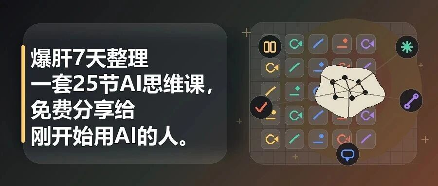

# 爆肝7天整理了一套25节AI思维课，免费分享给刚开始用AI的人

> 作者：旺哥 · 公众号：AI应用实战派PRO  
> [查看微信公众号原文](https://mp.weixin.qq.com/s?__biz=MzY4NDA4MDUwMA==&mid=2247483956&idx=1&sn=5241523dfc4e48e409b54f927fb0122d&chksm=f29a228a9029ab99db06c13ce11fc3434a72ef13e0ef1343cb68cd633f56a3f3bbfe3aa2e8b5#rd)

花了一周时间整理了一套很长的课，一共 25 节，  从 AI 是什么、怎么写提示词，一直讲到文案、客服、数据整理、竞品分析、小红书内容生产线、业务 SOP
和促销活动策划  。里面还有精美的配图来贴合文章。

给公司其他同事培训也准备了一整套课，但是涉及公司数据，所以恕我不能放出来给大家分享了，感谢理解。

大部分内容是相似。所以大家看这份就行。

课程整理完之后，我第一反应是：

这东西要不要做成付费阅读？

后来想了想，还是先免费放出来。

原因也简单。

这套课的价值，不靠几个所谓万能提示词。它更像一份给小白的  入门地图  。很多人其实愿意学
AI，只是被一堆工具名、模型名、参数名挡住了，最后收藏了一堆教程，真正干活的时候还是不知道从哪一步开始。

由于微信篇幅的原因，所以这篇文章我不把 25 节全文塞进来。

课程太肝，也太长了，适合慢慢看。

我也希望你把本篇文章看完再去看课程，这样配合更佳。

我会放一部分课程截图、完整目录和飞书文档链接。你觉得有用，可以跳到飞书慢慢看。

看完之后  点个赞收藏转发  一下不过分吧！

完整飞书文档：

https://my.feishu.cn/wiki/Z67owvhWSiXMPokpaO4cn7Ccndb

01

##  这套课真正想解决什么

这套课叫 AI 思维课。

我这里说的 AI 思维，其实就三件事。

** 第一，遇到一件工作，先想一下：  ** 这件事 AI 能不能帮我做一部分？

** 第二，如果能帮，怎么把这件事说清楚？  **

** 第三，如果事情太大，怎么拆成几步，让 AI 一步一步做？  **

这三个问题，比100 个工具有用。

我见过很多刚开始用 AI 的人，问题不是不会注册，也不是不会点按钮。

他们真正卡住的地方是：脑子里没有“这件事可以交给 AI 试试”的反应。

比如一个小店老板要上新品，需要写详情页文案、卖点标题、客服 FAQ、文案。

以前他可能要花一个下午东拼西凑。但如果他知道怎么把产品信息说清楚，再把任务拆开，这里面很多东西其实可以让 AI 先出第一版。

不是直接照抄。

是先让 AI 把最费时间、最容易卡住的那一版做出来，然后人再判断、修改、确认。

这就是我想讲的 AI 思维。

02

##  我为什么不把它做成工具清单

现在 AI 工具太多了。

ChatGPT、DeepSeek、豆包、Kimi、通义、Claude、秘塔、即梦、可灵，后面还会继续变。

如果课程只是告诉你“这个工具能做什么，那个工具怎么注册”，它很快就过期。

所以我在课程里会讲工具，但不把工具当重点。更重要的是知道：文字类工具适合处理什么，搜索类工具适合查什么，做图工具适合出什么，办公类工具适合接入哪些工作。

工具会换。

但工作里的问题不会那么快换。

小商家还是要写文案、回客户、做活动、上新品、看竞品、整理账目。

内容运营还是要想选题、写稿、改小红书、做封面、拆素材。

公司里做 AI 落地，还是要把流程说清楚，把 SOP 写下来，把重复劳动拆出来。

这套课真正想帮你建立的判断

我现在手上这件事，到底适合让 AI 帮哪一段？

03

##  提示词也不是背模板

很多人一学 AI，就开始收藏提示词模板。

收藏的时候很兴奋，用的时候还是卡。

因为模板只解决了一个很小的问题。你不知道自己要什么，模板再漂亮也没用。

课程第 05 节讲提示词，我把它压成了四个要素：

** 背景、任务、要求、参考。  **

你是谁，在什么场景下，要 AI 做什么，结果有什么限制，有没有样例可以让它照着学。

比如你只说：

“帮我写一段产品介绍。”

AI 大概率会写得很空。

但你如果说：

“我在拼多多开店卖家用收纳箱，客户以家庭主妇为主。帮我写一段产品详情页开头，200
字左右，突出能装、耐用、好看，语气温馨居家，不要用‘尊敬的顾客’这种正式开头。”

结果会立刻不一样。

不是 AI 突然变聪明了。

是你给它的信息能用了。

我自己现在越来越觉得，提示词写得好不好，很多时候不取决于格式，而取决于你有没有把事情想清楚。你说不清楚，AI
就只能猜。它猜出来的东西，也许看起来完整，但往往不贴你的真实工作。

04

##  后面的实战部分，我反而更建议先看

如果你已经会打开 AI 工具了，我建议不要从第 1 节一路读到第 25 节。

你可以先按自己的工作场景跳着看。（适合从0开始的小白用，如果你是大神请跳过，也不要杠！）

做内容的人，可以先看第 08、12、13、20、23 节。

做电商的人，可以先看第 09、10、11、21、22、25 节。

想提高日常工作效率的人，可以先看第 14、15、17、18、24 节。

我更推荐这种读法。

先找一件你今天真的要做的事，带着问题进去看。

比如你今天刚好要写一套客服话术，就别先研究模型原理。直接翻第 09 节，照着里面的方式把你的产品、客户、常见问题丢进去，让 AI 先生成一版。

用完之后你再回头看第 05 节、第 06 节，会更容易理解为什么提示词要写背景、任务、要求和参考。

学习 AI，最怕变成看教程。

看完好像懂了，关掉页面还是不会用。

这套课我希望你反过来用：先拿一个真实问题去试，再回来补方法。

05

##  它适合谁，不适合谁

这套课适合刚开始用 AI 的小白。（大神请跳过！）

尤其是这些人：

· 小商家、个体户、

· 做朋友圈、小红书、公众号内容的人

· 经常要写文案、回客户、整理资料的人

· 想让 AI 进入日常工作，但还不知道怎么开始的人

· 公司里要推广 AI，但团队基础不太一致的人

它不太适合研究模型原理的人。

也不适合已经熟练使用 Cursor、Claude Code、Dify、Coze、RAG、Agent 工作流的人。

如果你已经在搭智能体、写自动化、接 API，这套课对你来说会偏基础。

但如果你身边有朋友、同事、家人一直问你“AI 到底怎么用”，你可以直接把这份发给他。

我做这套课的时候，想的不是把高手再往前推一步。

我想解决的是：让一个没基础的人，别被 AI 吓住，先把第一步迈出去。

06

##  免费

这次免费分享！点个赞不过分吧！

小白阶段最缺的不是付费门槛，而是一份能照着走的入门材料。

这份文档现在更像一个完整底稿。后面如果继续打磨，我更想把它拆成练习表、提示词模板包、内部培训 PPT，或者公众号 / 小红书能直接发布的切片图文。

如果以后做付费，也应该围绕模板、作业、案例、更新和答疑来做，而不是只把全文放到付费后面。

所以这次先当免费版发出来。

你可以把它当成一个 AI 入门自学包。

看完不用急着收藏一堆工具。

先做一个小练习就行：

今晚回顾一下你今天做过的工作，挑一件最琐碎、最重复、最想绕开的事，试着问自己：

这件事能不能让 AI 先帮我做第一版？

如果答案是能，就把背景、任务、要求、参考说清楚，丢给 AI 试一次。

哪怕结果只帮你省了 10 分钟，也算开始了。

完整飞书文档我放这里：

https://my.feishu.cn/wiki/Z67owvhWSiXMPokpaO4cn7Ccndb

咨询讨论请加：  HPwangtang

AI 应用实战派PRO

觉得本文还不错，赶紧点赞收藏吧。  
关注我，还有更多精彩文章和教程。

我是  ** AI 应用实战派pro  ** ，只聊落地，不讲虚的。

---

本文最初发布于微信公众号「AI应用实战派PRO」。未经特别说明，正文与配图采用 [CC BY-NC-ND 4.0](https://creativecommons.org/licenses/by-nc-nd/4.0/deed.zh-hans) 许可。
