# AI电商实战教程：从0开始拆解竞品并做竞品分析报告（附完整SOP）

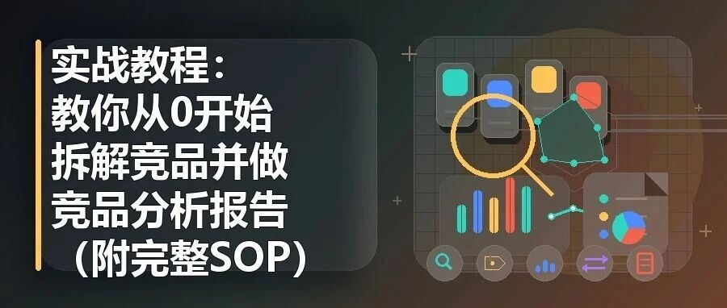

> 作者：旺哥 · 公众号：AI应用实战派PRO  
> [查看微信公众号原文](https://mp.weixin.qq.com/s?__biz=MzY4NDA4MDUwMA==&mid=2247483971&idx=1&sn=e038a4311aee861f1ed7d55a69bdfd47&chksm=f28522f10f03ed0ab12cd9b288a68e3397eb1c0ace5acca13e5264a1acc55be5368ac25e4ab9#rd)
> [下载 HTML 图文包（含图片）](https://github.com/wangge-dev/wangge-articles/releases/download/html-archive/202605241256.zip) · [HTML 文件](../../html/2026/202605241256/article.html)

AI 应用实战派 PRO

#  分享一套电商竞品拆解 SOP

输入类目或链接，做出完整竞品分析报告，再落到主图详情页线稿。

输入：类目 / 链接 / 图片

过程：逐图拆解

输出：报告 + 线稿

今天更新一期电商 AI 实战教程。我用codex做出来，如果你用Claude或者其他openclaw/龙虾也可以做出同样的效果。思路是一样的。下面开始~

这次分享的是一套竞品拆解 SOP。看下跑出的结果：

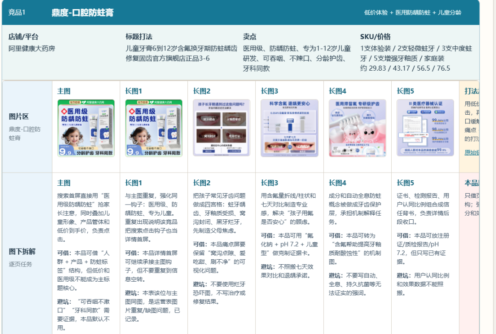
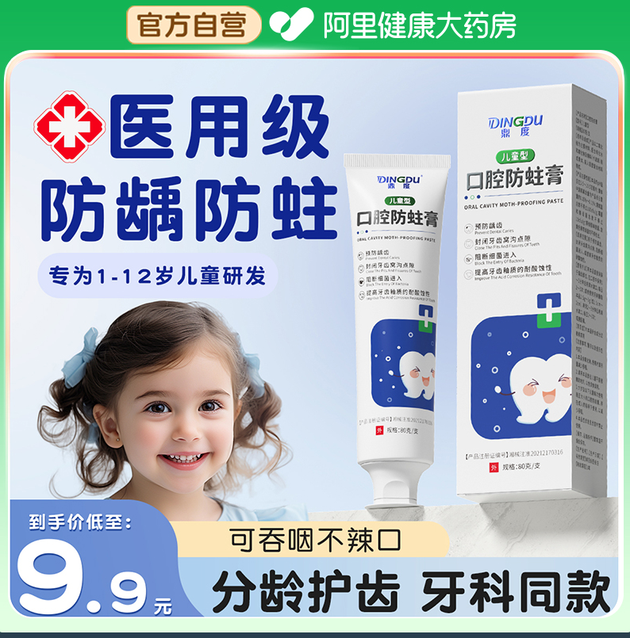
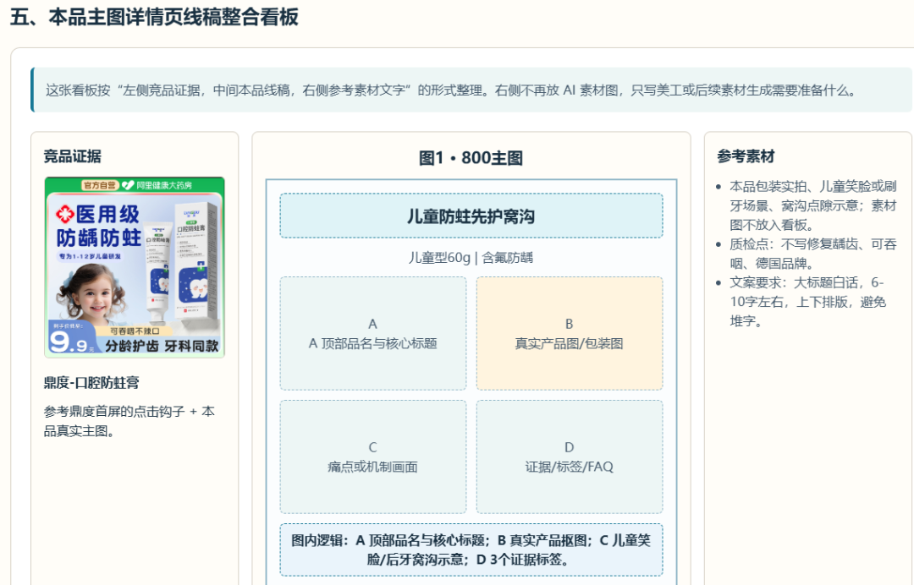
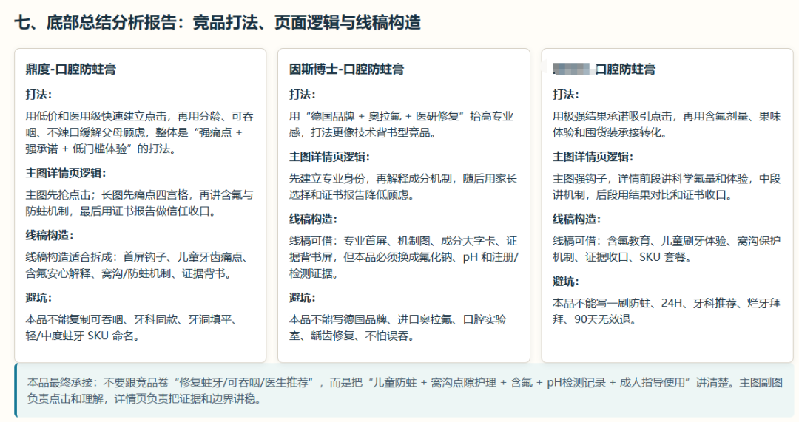

它的目的很明确：给一个新品类目，或者给几个竞品链接，最后输出一份  竞品分析报告  ，再给出本品主图和详情页线稿建议。报告里面的图片可以点击放大看清晰图！

这套流程不是用来抄竞品文案的，也不是让 AI 直接出终图。

它解决的是页面策划前半段的问题——竞品怎么讲的、每张图在干什么、本品能借哪些结构、哪些证据搬不了。这些先拆清楚，后面做图才不容易跑偏。

需要注意的一点：  竞品拆解逻辑你可以给codex/agent提供
。如果你不提供相关信息那拆解出来的文字逻辑就是没有调整的，效果肯定不够好，这一点相信大家用过ai的都知道。下面不再赘述！

我也整理了两份通用附件：一份是公开版竞品拆解 Skill，一份是脚本使用说明。

由于公众号限制，附件不能放在文章中。后台回复  竞品  即可获得。

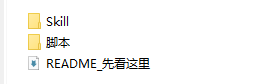

01

##  竞品分析最后要落到页面上

很多竞品分析看起来很完整，但真正到运营和设计手里，还是用不起来。

常见的报告会写：这个竞品主打专业背书，那个竞品主打场景体验，另一个竞品主打价格优惠。

这些判断不算错，但它没有回答页面怎么做。

主图第一眼抢谁？第二张图讲痛点，还是讲机制？证据背书放在前面，还是放在中后段？哪些话只能借结构，不能照搬？

所以我更建议把竞品拆成  图位任务  。

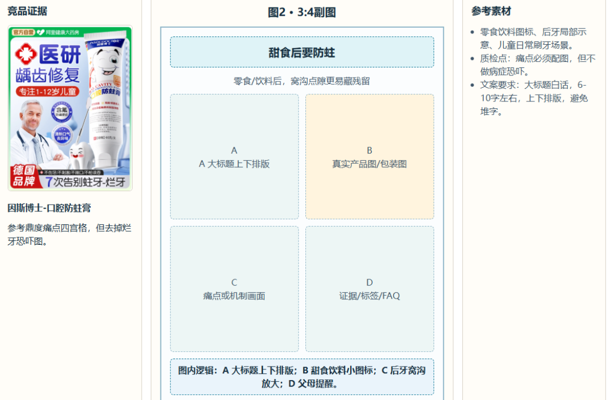

一张图在页面里一定有任务。可能是负责点击，可能是讲痛点，也可能是做证据背书。任务拆出来以后，主图 1+5 和详情页线稿才有依据。

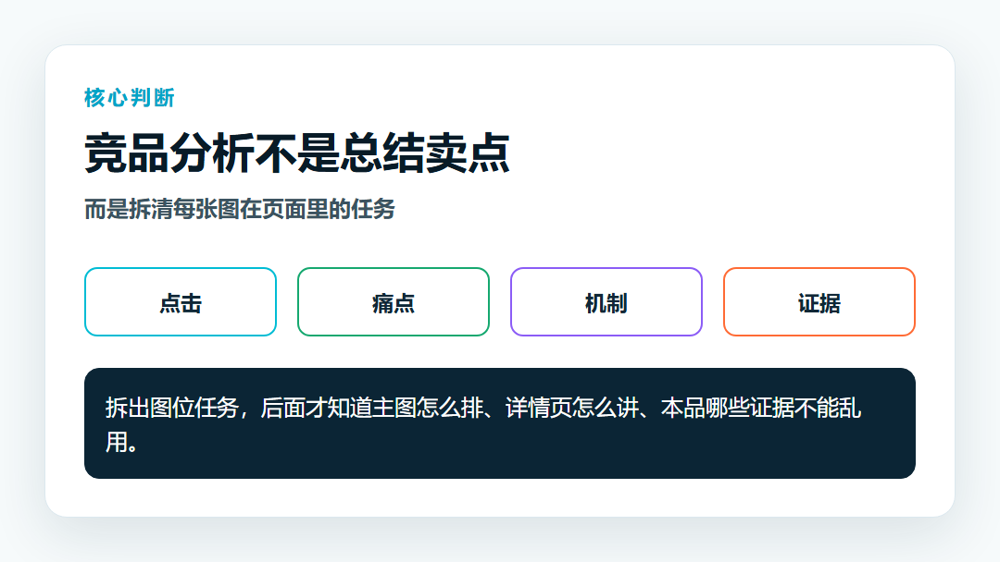

02

##  入口保留三种，别把流程做复杂

这套 SOP 可以从三个地方开始。

•  只给产品或类目：先在指定平台里找 5 个左右竞品。

•  直接给竞品链接：不重新扩池，围绕这些链接采图和拆解。

•  直接给图片文件夹：跳过采集，适合小白先跑通。

这里要先定平台。京东就只看京东，天猫就只看天猫，不要为了凑数量把不同平台混在一起。抓取图片脚本在skills里面哦（目前比较稳定）。

三种入口最后都进入同一条链路：先整理样本，再逐图拆解，最后生成报告和线稿建议。

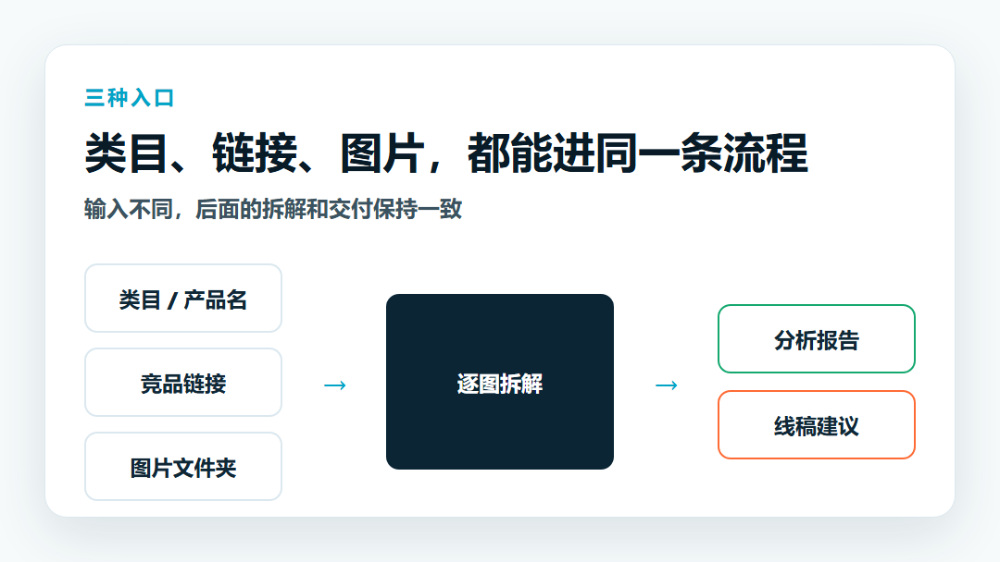

03

##  跑之前，先准备最少的信息

不用一开始就准备很复杂。

准备这些就够了：  平台、类目、产品名称、  这些可以后期准备：目标人群、核心卖点、真实证据材料、禁用表达、竞品链接。

如果你已经有竞品链接，放 3-8 个就行。

如果你想让 Agent
自动找竞品，就把类目、品名、目标人群和核心卖点写清楚。比如它是给谁买的，主要解决什么问题，价格大概在哪个区间，本品有什么真实材料可以支撑。

这里有个小细节：不要把愿望写成事实。

“想打专业感”是方向。

“有检测报告、包装实拍、成分表、资质文件”才是证据。

AI 可以帮你组织表达，但不能替你编产品事实。这个边界提前写清楚，后面会少很多麻烦。

04

##  标准流程尽量压短

这套流程不用拆得太碎。

先整理本品资料，把品类、目标人群、核心卖点、证据材料、价格规格、禁用表达放到一张产品卡里。

然后建立竞品池。默认 5 个左右就够了，不只找同质商品，也可以放标杆竞品、证据型竞品、价格型竞品和场景型竞品。这样拆出来的页面思路会更完整。

接着整理图片。优先看主图、副图、详情页长图、包装规格图。

图片整理好以后，生成一张图片索引，再开始逐图拆解。

每张图都看清楚：它在页面里负责什么任务，标题怎么写，画面怎么组织，本品能借什么，本品不能照搬什么。

报告只算中间结果。最后要落到本品主图 1+5 和详情页 8-12 屏线稿。每张线稿都要写清页面任务、主标题、画面骨架、素材清单和质检点。

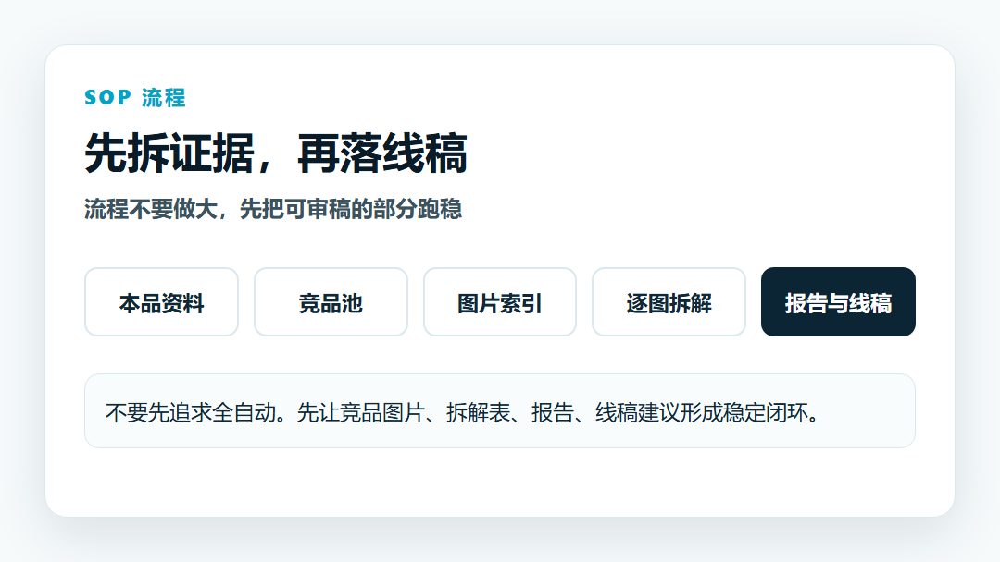

05

##  Skills 的关键

这套 Skill 不需要拆的很碎

它要做的事只有一个：让 AI 不要泛泛总结卖点，而是按图位拆页面逻辑。

我会在 Skill 里固定三件事。

•  先按图位拆页面任务，包括标题钩子、画面结构、点击或转化作用。

•  再判断本品能借什么、不能照搬什么，尤其是销量、实验数据、机构背书这些证据。

•  最后标清边界。比如详情页没采到，就写“基于主图/副图反推”。

这几条比“你是一个XXX资深专家”更重要。

AI 不知道你的产品到底有没有检测、专利、资质、真实包装图。所以这些材料必须由人提供。

06

##  脚本只保留几个小模块

脚本不要一开始就做得太大。

我建议先保留四个模块：图片采集、图片索引、逐图拆解表、报告生成。

文件目录也尽量用中文，读起来更直观。

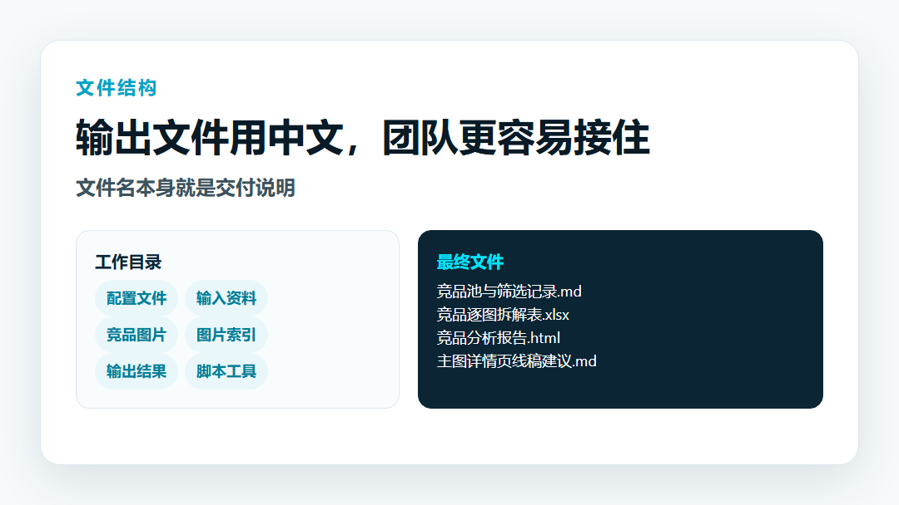

•  竞品池与筛选记录.md

•  图片采集记录.md

•  竞品图片索引

•  竞品逐图拆解表.xlsx

•  竞品分析报告.html

•  主图详情页线稿建议.md

•  竞品证据与线稿看板.html

•  协作文档待粘贴版.md

这样后面给运营、设计看，都更容易理解。不要一堆英文文件名堆在那里，让人还没打开就懵了。

07

##  输出文件要能审，不只是能看

这套流程最后至少要有三类交付物。

第一类  是表格，比如“竞品逐图拆解表”。它用来复核每张图的任务、标题、画面结构和风险点。

第二类  是报告，比如“竞品分析报告”。它负责把样本范围、图片证据、横向图位共性、本品承接方向写完整。图片不要只放小缩略图，最好能放大查看。

第三类  是线稿建议，比如“主图详情页线稿建议”和“竞品证据与线稿看板”。它们不是终图，而是给运营审图序、审标题、审画面骨架用的。

08

##  几个避坑经验

先说平台。

指定平台后，就尽量只在这个平台里找竞品。不同平台的页面习惯、价格氛围、用户心智不一样，混着拆容易误判。

再说证据。

竞品页面上的销量、实验数据、机构背书、检测报告，只能作为竞品证据，不能直接变成本品表达。本品没有材料，就不要写。

最后说终图。

不要一开始就让 AI 生成产品终图。包装、LOGO、中文、规格、证据卡，最好来自真实素材或本地排版。AI
可以做机制图、场景图、辅助素材，但不要替你编产品事实。

这个流程的价值不是把人完全拿掉，而是把重复整理、拆图和报告生成先自动化。真正的产品判断、证据复核和页面取舍，还是要人来定。

09

##  两份通用附件可以直接拿去改

这次我准备了两份文件。由于文件不好放在文章中，大家后台回复  竞品  即可获得。

•  通用版竞品拆解 Skill.md：给 AI Agent 用，规定输入方式、拆解字段、输出结构和边界要求。

•  脚本使用说明.md：给实际跑流程的人看，写清楚目录怎么放、输入怎么准备、最后会输出哪些文件。

最稳的方式是先准备 3-5
个竞品链接，或者直接准备一批竞品图片，让这套流程跑出第一版报告。只要能稳定输出逐图拆解表和线稿建议，后面再加自动找竞品、自动采图、自动生成 HTML
报告，就会顺很多。

有问题留言讨论哦。

咨询讨论请加：  HPwangtang

AI 应用实战派PRO

觉得本文还不错，赶紧点赞收藏吧。

关注我，还有更多精彩文章和教程。

我是  AI 应用实战派pro  ，只聊落地，不讲虚的。

---

本文最初发布于微信公众号「AI应用实战派PRO」。未经特别说明，正文与配图采用 [CC BY-NC-ND 4.0](https://creativecommons.org/licenses/by-nc-nd/4.0/deed.zh-hans) 许可。
