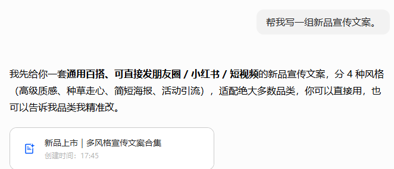
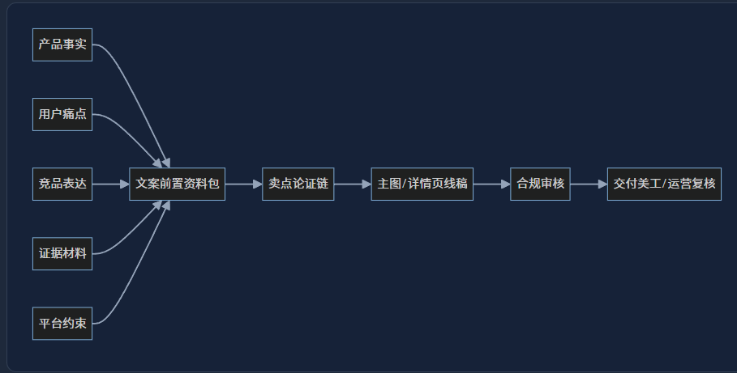
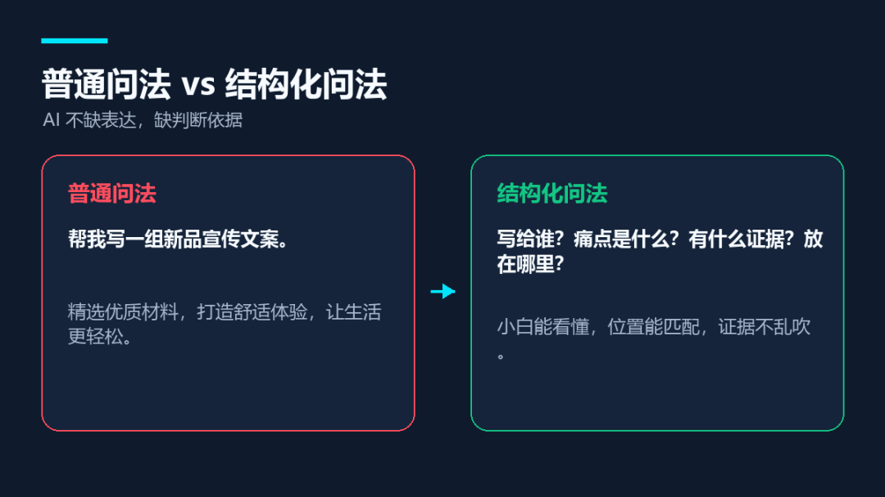
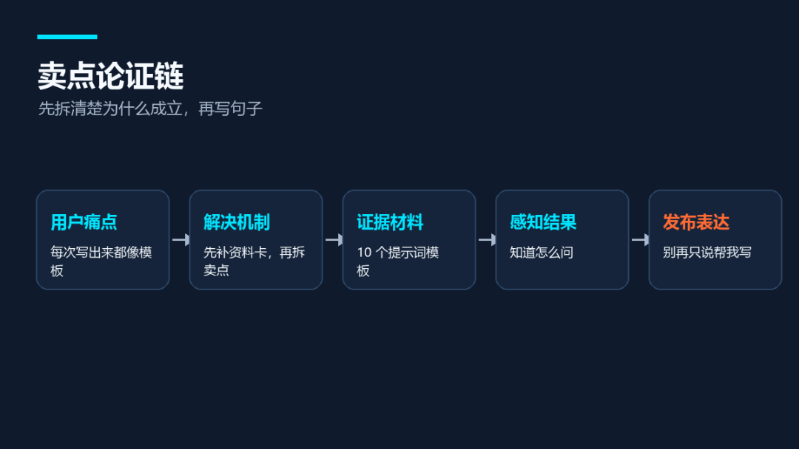
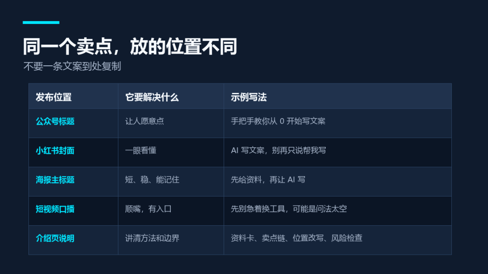
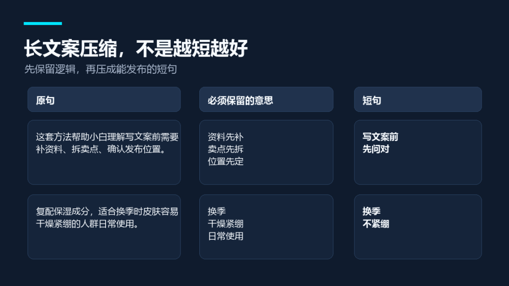
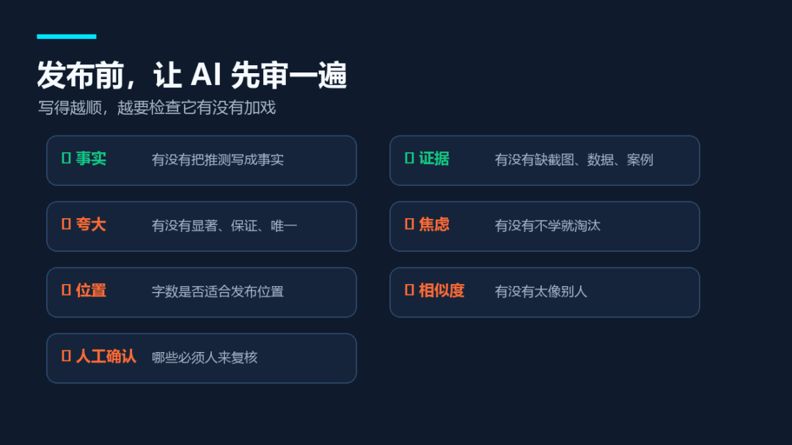
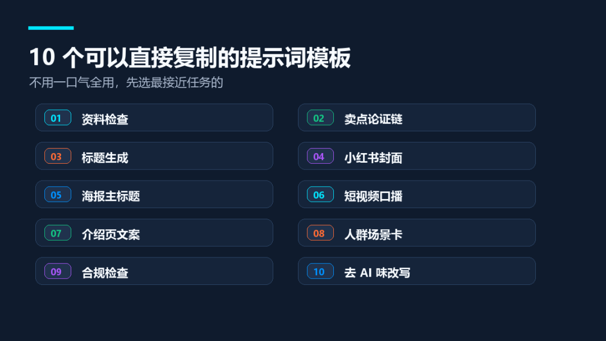

# 从 0 开始用ai写文案（附思路过程和提示词）。

> 作者：旺哥 · 公众号：AI应用实战派PRO  
> [查看微信公众号原文](https://mp.weixin.qq.com/s?__biz=MzY4NDA4MDUwMA==&mid=2247483988&idx=1&sn=e9f17d7c02ca003e49faa751a276d782&chksm=f2e815977eaefc484e351d7c65167c9e14255e590032f3766ff258f7fd0f588e1c3c106988f2#rd)
> [下载 HTML 图文包（含图片）](https://github.com/wangge-dev/wangge-articles/releases/download/html-archive/202605251818.zip) · [HTML 文件](../../html/2026/202605251818/article.html)

本文主要总结了我日常用ai写文案的用法以及踩坑总结，希望对你也有用。下面开始。

文案类 AI 提示词完整教程

上一篇写了怎么做竞品分析，今天来看我们日常经常遇到的用ai帮忙写文案：

[ AI电商实战教程：从0开始拆解竞品并做竞品分析报告（附完整SOP）
](https://mp.weixin.qq.com/s?__biz=MzY4NDA4MDUwMA==&mid=2247483971&idx=1&sn=e038a4311aee861f1ed7d55a69bdfd47&scene=21#wechat_redirect)

很多人第一次用 AI 写文案，都会遇到一个挺尴尬的问题。

你让它写一句宣传语，它马上给你一大段。

语法没错，但你看完之后，大概率还是不会直接用。

比如你输入：

> 帮我写一组新品宣传文案。

AI 很可能回你：

这句话当然不能说错。

问题是，它像很多东西，又不像任何一个具体东西。

你不知道它写给谁看，不知道它解决什么问题，也不知道这句话最后要放在标题、海报、产品页、小红书，还是短视频口播里。

很多小白用 AI 写文案写不好，常见问题是开头问得太空，高级提示词只是后面的事。

写文案这件事，不能只问「帮我写一句」。

要先问清楚：

这句话写给谁？他现在卡在哪？这个产品或服务靠什么解决？有什么证据？最后放在哪里？

这些问题不说清楚，AI 只能在漂亮废话里转圈。这篇就从 0 讲一遍文案类 AI 提示词。本篇主要总结我的一些经验和踩坑经历。

先看一下工作流：

01

##  为什么 AI 写的文案总是「正确但不能用」

普通问法 vs 结构化问法

先说几个最常见的翻车。

第一种，文案太空。

「高效便捷」「品质升级」「体验更好」「轻松解决」。

这些词放在任何东西上都能成立，也就等于没有信息。

第二种，人群太宽泛。

你说「写给年轻人」，AI 就写「年轻人都喜欢」。

但能写出东西的，往往是具体处境。

比如：

刚开始学剪辑的小白。每天要写日报的运营。买了工具却一直没用起来的人。

这些人比「年轻人」好写得多。但这还不够

第三种，痛点没有画面。

「提高效率」听起来对，但很难让人有感觉。

换成「一个标题改了 20 分钟，最后还是像 AI 写的」，画面就出来了。

第四种，证据不足。

AI 很喜欢写「效果显著」「大幅提升」「更专业」。

如果没有数据、截图、案例、前后对比，这些词最好先删掉。

第五种，不知道文案最后放在哪里。

同一个卖点，放在公众号标题、海报主标题、小红书封面、产品页和短视频口播里，写法完全不一样。

如果不告诉 AI 发布位置，它只能写一段通用文案。

通用文案最大的问题，就是谁用都差点意思。

还有最大的问题就是在网页对话框对话，刚开始ai还能按照你的要求来回答，但随着对

话越来越长，ai就会忘了前面的提示词要求（点名豆包大小姐），所以后面如果是经常

使用的话那就需要用到工作流来写（扣子，dify等等都行）。

02

##  写之前，先给 AI 一份资料卡

文案资料卡

很多人觉得提示词难，是因为总想用一条指令把 AI 调教好。更简单的做法，是先给 AI 一张文案资料卡。

** 1\. 写什么  **

是课程、工具、服务、产品、活动，还是一篇文章？

不要只写名字，要写清楚它到底提供什么。比如「AI 思维课」这个名字不够，还要补一句：它是给小白理解 AI 工具、提示词、工作流和内容生产的一套入门课。

** 2\. 写给谁  **

不要只写「小白」，最好写成一个具体场景。

比如：

刚开始用 AI，但只会问零散问题的人。

想让 AI 帮自己写内容，但每次写出来都像模板的人。

公司里被要求学 AI，却不知道先学什么的人。

** 3\. 这个人现在有什么问题  **

问题越具体，文案越好写。「想提升效率」太宽，「每天复制一堆提示词，但写出来的东西还是不能发」就具体很多。

** 4\. 你靠什么解决  **

这里要写机制。

比如你提供的不止是 10 个模板，背后还有一套顺序：先补资料，再拆痛点，再找证据，最后按发布位置改写。

机制写清楚，文案才不容易只剩口号。

** 5\. 有什么证据  **

证据可以是截图、案例、数据、对比、用户反馈、过程记录。没有证据也可以写，但要让 AI 标出来，别让它把推测写成事实。

** 6\. 最后发在哪里  **

公众号、朋友圈、小红书、海报、详情页、短视频口播、直播间话术，位置不同，文案长度和语气都不同。

你可以直接复制这段给 AI：

prompt · 可直接复制

我想写一组文案，请你先不要直接生成。  请先根据下面资料，帮我检查信息是否足够：  1. 写什么： 2. 写给谁： 3. 这个人现在的问题： 4. 我靠什么解决： 5. 已有证据： 6. 发布位置： 7. 不能夸大的地方：  请输出： - 已经足够的信息 - 还缺的信息 - 可以先写但需要我确认的内容

很多文案改来改去，根源不在句子，而在资料一开始就没给够。

03

##  核心方法：先拆卖点，再写句子

卖点论证链

文案最怕直接写卖点。一直接写，就容易变成：

「专业可靠，值得选择」「高效省心，体验升级」「适合多种场景」

这些句子没什么错，但读者很难被它打动。更稳的方法，是先让 AI 拆一条卖点论证链。

它的顺序是：

用户痛点 → 产品机制 → 证据背书 → 用户感知结果 → 发布表达

举个简单例子。如果你要写一个「AI 文案课」。

不要直接写：

> 让你快速掌握 AI 文案写作。

可以先拆成：

用户痛点  |  解决机制  |  证据/材料  |  用户感知结果  |  可以怎么写   
---|---|---|---|---  
每次让 AI 写文案都像模板  |  先补资料卡，再拆卖点链  |  10 个提示词模板  |  知道该怎么问 AI  |  别再只说「帮我写文案」   
写出来很长，但不能直接发  |  按发布位置改写  |  标题、海报、口播示例  |  每个位置都有不同版本  |  同一个卖点，别到处复制   
不知道哪里夸大  |  加合规和证据检查  |  风险词替代表  |  先删掉高风险表达  |  没证据的话，别让 AI 硬吹   
  
到这一步，文案会明显好写很多。

因为它开始回答具体问题，不再只找漂亮词。

这也是文案提示词最核心的一步。不要上来就让 AI 写 20 条，先让它说明这个卖点为什么成立。

可以用这个提示词：

prompt · 可直接复制

请根据我提供的资料，先不要写完整文案。  请把每个卖点拆成一条论证链：  用户痛点｜解决机制｜证据材料｜用户能感受到什么｜适合放在哪里｜可写短句  要求： - 每个卖点必须对应一个具体痛点 - 机制必须来自我提供的资料 - 没有证据就写「缺证据」 - 不要使用「高效、优质、精选、专业、强大」这类空泛词 - 可写短句要适合直接放到标题、封面、海报或页面上

04

##  同一个卖点，放的位置不同，写法也不同

发布位置对照表

很多人写文案只盯着某一句好不好。

但发出去的时候，位置更重要。

同一个意思，放在不同位置，要改写。

比如卖点是：

> 这套方法能让小白学会用 AI 写文案。

放在公众号标题里，可以写：

> 手把手教你从 0 开始写文案，附 10 个 AI 提示词模板

放在小红书封面上，可以写：

> AI 写文案

> 别再只说「帮我写」

放在海报上，可以写：

> 先给资料

> 再让 AI 写

放在短视频口播里，可以写：

> 如果你每次让 AI 写文案，出来的都是一堆漂亮废话，先别急着换工具。你可能只是少给了它判断依据。

放在产品页或课程介绍里，可以写：

> 这套方法会从资料卡、卖点链、发布位置和风险检查四步入手，帮你把一句模糊需求拆成可发布的文案版本。

所以提示词里一定要写发布位置。

可以这样问：

prompt · 可直接复制

请把下面这个卖点，分别改写成 5 种发布位置的文案：  卖点： 目标人群： 证据材料： 不能夸大的地方：  请分别输出： 1. 公众号标题 2. 小红书封面标题 3. 海报主标题 4. 短视频口播开头 5. 产品页/课程页说明  要求： - 每个位置都要符合阅读习惯 - 不要直接复制同一句话 - 标出每个版本适合的原因

这一条很适合小白。

很多 AI 文案不能用，常常是拿错了位置。

05

##  长文案要先保留逻辑，再压成短句

长文案压缩示例

还有一个常见问题：AI 写得太长。

尤其是封面、海报、产品页大标题，根本放不下长句。

很多人会直接说：

> 帮我写短一点。

结果 AI 把一句长废话，改成一句短废话。

更好的做法是先让它保留逻辑，再压缩。

比如原句是：

> 这套提示词方法可以帮助刚接触 AI 的人，理解写文案前需要先补充资料、拆解卖点、确认发布位置。

先保留意思：

资料要先补。卖点要先拆。位置要先定。

再压缩成短句：

> 别先写，先补资料

或者：

> 写文案前，先问对

再比如：

> 这款面霜复配保湿成分，适合换季时皮肤容易干燥紧绷的人群日常使用。

可以压成：

> 换季不紧绷

短句要保留有效信息。

「更好用」「更省心」「更专业」这种短句，短是短了，但没什么用。

可以用这个提示词：

prompt · 可直接复制

请把下面长文案压缩成适合发布的短句。  长文案： 发布位置： 目标人群： 不能丢掉的信息： 不能使用的词：  要求： - 先提取这段话必须保留的 3 个意思 - 再给出 5 个短句版本 - 每个短句控制在 6 到 12 个字 - 不要使用「高效、优质、精选、专业、黑科技」这类空词 - 标出哪个版本最适合发布，并说明原因

06

##  最后一步：让 AI 自己先审一遍

文案审核清单

第一版文案别急着发。尤其是产品、课程、服务、工具类文案，很容易一不小心写过头。

常见风险有几类：

比如没有数据，却写「显著提升」；只是一种学习方法，却写「保证学会」；只是相对优势，却写「全网最强」「唯一」「100%
有效」。还有一种更隐蔽：把人群焦虑放大，动不动就写不学就淘汰、不买就吃亏。

你可以让 AI 在生成后再审一遍：

prompt · 可直接复制

请审核下面这组文案是否适合发布。  文案： 发布位置： 已有证据： 目标人群：  请检查： 1. 有没有把推测写成事实 2. 有没有夸大效果 3. 有没有绝对化表达 4. 有没有制造过度焦虑 5. 有没有和竞品或他人表达太像 6. 字数是否适合发布位置 7. 哪些地方需要人工确认  请输出： 风险位置｜问题原因｜建议改法｜是否必须人工确认

AI 写得越顺，越要检查它有没有偷偷替你加戏。

07

##  10 个可以直接复制的文案提示词模板

10 个提示词模板清单

下面这 10 个模板，也可以自己改也可以让ai生成哦，要求还是前面说的。

你先选一个最接近当前任务的。

如果你是小白，先用第 1 个和第 2 个。

如果你已经有初稿，用第 9 个和第 10 个。

###  模板 1：文案资料检查

prompt · 可直接复制

我想写一组文案，请你先检查资料是否足够，不要直接写。  写什么： 写给谁： 用户现在的问题： 我提供的解决方式： 已有证据： 发布位置： 不能夸大的地方：  请输出： 已足够的信息｜缺失的信息｜可以先写但需要确认的内容｜建议补充材料

###  模板 2：卖点论证链

prompt · 可直接复制

请把下面资料拆成文案卖点论证链。  资料： 目标人群： 发布位置：  输出字段： 用户痛点｜解决机制｜证据材料｜用户能感受到什么｜适合放在哪里｜可写短句｜风险提醒  要求： - 每个卖点必须对应具体痛点 - 没有证据就写「缺证据」 - 不要写空泛词

###  模板 3：标题生成

prompt · 可直接复制

请根据下面资料，生成 10 个标题。  主题： 读者： 读者最关心的问题： 文章能给出的结果： 不能夸大的地方：  要求： - 前 15 个字尽量出现核心信息 - 不要标题党 - 给出 3 个直给型、3 个痛点型、2 个数字型、2 个反差型 - 标出你最推荐的 3 个

###  模板 4：小红书封面文案

prompt · 可直接复制

请把下面内容改成小红书封面文案。  主题： 目标人群： 最想解决的问题： 已有结果或证据：  要求： - 每个版本最多两行 - 每行尽量不超过 10 个字 - 不要夸张词 - 输出 8 个版本 - 标出适合配什么图

###  模板 5：海报主标题

prompt · 可直接复制

请把下面卖点改成海报主标题。  卖点： 发布场景： 目标人群： 语气要求：  要求： - 主标题 6 到 12 个字 - 副标题不超过 24 个字 - 给出 5 个版本 - 每个版本说明适合的画面

###  模板 6：短视频口播开头

prompt · 可直接复制

请把下面主题写成短视频前 10 秒口播。  主题： 观众： 观众现在的困扰： 视频后面会讲什么：  要求： - 开头不要寒暄 - 不要喊口号 - 先说一个具体问题 - 输出 5 个版本 - 每个版本控制在 80 字以内

###  模板 7：产品 / 服务介绍页文案

prompt · 可直接复制

请根据下面资料，写一版介绍页文案。  产品或服务： 适合谁： 解决什么问题： 核心方法： 已有证据： 不适合谁： 不能承诺什么：  输出结构： 首屏标题｜首屏副标题｜适合人群｜解决的问题｜核心方法｜使用后能得到什么｜风险和边界

###  模板 8：人群场景卡

prompt · 可直接复制

请不要只用年龄、性别描述人群。  请根据下面资料，生成 5 个人群场景卡：  主题： 可能用户： 他们会在什么情况下需要：  输出字段： 人群｜具体场景｜当前困扰｜触发动作｜购买/阅读顾虑｜可以怎么写

###  模板 9：合规和风险检查

prompt · 可直接复制

请审核下面文案是否适合发布。  文案： 发布位置： 证据材料： 目标人群：  检查： - 是否把推测写成事实 - 是否夸大效果 - 是否使用绝对化表达 - 是否制造过度焦虑 - 是否缺少证据 - 是否需要人工确认  输出： 风险位置｜问题原因｜建议改法｜是否必须人工确认

###  模板 10：把 AI 味改掉

prompt · 可直接复制

请帮我把下面文案改得更自然，但不要改变事实。  原文： 目标读者： 发布位置：  修改要求： - 删除空泛词和套话 - 减少排比句 - 不要使用「赋能、闭环、抓手、沉淀」这类词 - 不要突然升华 - 保留具体例子和判断 - 改完后列出你删掉了哪些 AI 味表达

08

##  这套方法适合谁，不适合谁

这套方法适合刚开始用 AI 写文案的小白，也适合经常写标题、海报、课程介绍、产品页、小红书、公众号的人。

如果团队里经常写相似类型的内容，也可以把这 10 个模板变成固定流程。

后面会讲到搭建工作流。我之前也写过一篇：

[ 我用 Coze 搭了几个文案智能体配置和 PPT 都给你（附完整教程）。
](https://mp.weixin.qq.com/s?__biz=MzY4NDA4MDUwMA==&mid=2247483786&idx=1&sn=8154860aba49c306988698f3dcac18af&scene=21#wechat_redirect)

但它也不适合所有情况。

如果你只是想写一段很私人、很情绪化的文字，不一定需要这么结构化。

如果你没有任何事实、案例、证据，只想让 AI 直接帮你编一套很厉害的说法，这套方法也救不了。

AI 可以帮你写得更快，但不能替你凭空拥有调查。

最后记住一句就够：

别先让 AI 写漂亮话。

先给它判断依据。

下一期更新一期实战对比（Claude，codex，Kimi等写文案对比）！

有问题留言讨论哦。

AI 应用实战派PRO

觉得本文还不错，赶紧点赞收藏吧。

关注我，还有更多精彩文章和教程。

我是  AI 应用实战派pro  ，只聊落地，不讲虚的。

讲虚。

---

本文最初发布于微信公众号「AI应用实战派PRO」。未经特别说明，正文与配图采用 [CC BY-NC-ND 4.0](https://creativecommons.org/licenses/by-nc-nd/4.0/deed.zh-hans) 许可。
