# AI电商实战教程：拆了 500 张电商图，整理出一套电商反推提示词 SOP（附完整 Skill）

> 作者：旺哥 · 公众号：AI应用实战派PRO  
> [查看微信公众号原文](https://mp.weixin.qq.com/s?__biz=MzY4NDA4MDUwMA==&mid=2247484066&idx=1&sn=fb15837a151047210e665ce7bffdcb80&chksm=f272f93c5b6988c64781457d8db9c2391ead96ce328d35ca84185ed6a623614130f3f8fd0812#rd)
> [下载 HTML 图文包（含图片）](https://github.com/wangge-dev/wangge-articles/releases/download/html-archive/202605310900.zip) · [HTML 文件](../../html/2026/202605310900/article.html)

AI 应用实战派 PRO

上一篇实战讲竞品怎么拆。

这一篇讲拆完以后，怎么把竞品好图反推成自家产品能用的主图、详情页和中文提示词。

不是照抄竞品图，而是把它变成自己的页面方案。

之前我分享过一套电商竞品拆解 SOP。

[ AI电商实战教程：从0开始拆解竞品并做竞品分析报告（附完整SOP）
](https://mp.weixin.qq.com/s?__biz=MzY4NDA4MDUwMA==&mid=2247483971&idx=1&sn=e038a4311aee861f1ed7d55a69bdfd47&scene=21#wechat_redirect)

那套流程解决的是：给一个类目、产品名，或者几个竞品链接，怎么整理竞品图片、拆图位任务，最后输出竞品分析报告和主图详情页线稿。

但竞品拆解只是前半段。

真正做页面时，还会遇到另一个问题：

看到别人家的主图很好，怎么变成自己产品能用的主图？看到别人家的详情页逻辑很顺，怎么反推出适合自己产品的详情页画面？

直接照抄肯定不行。

只让 AI 写“高级感、干净、商业摄影”，又很容易变成一张好看但不卖货的图。

所以这篇文章讲的是后半段：

** 从竞品拆解，到图片反推，再到自家产品可用提示词。  **

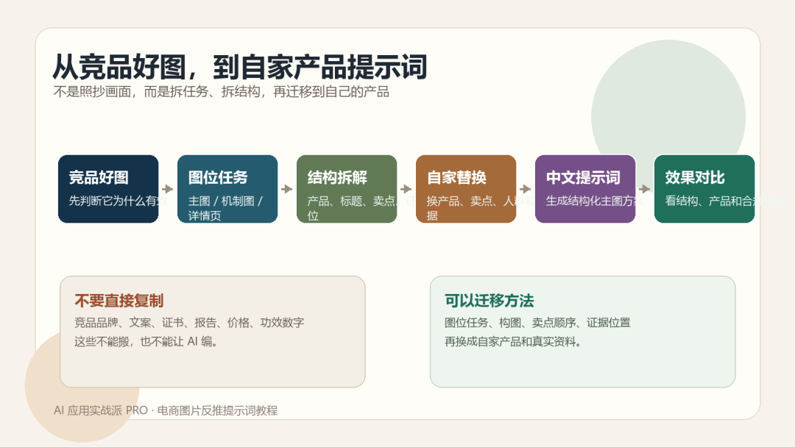

为了把这件事跑顺，我随便选了一个店铺的 20 个商品图拉出来看了一遍。

主图、副图、详情页切片、SKU 组合图加起来，差不多 500 张。

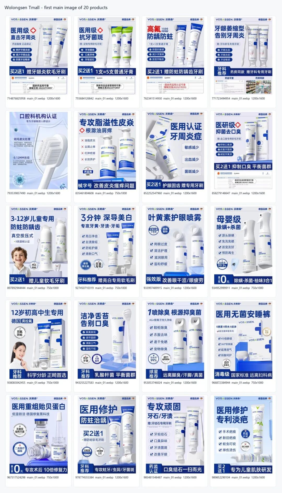

拆完之后，我把日常做页面的经验整理成了一套 SOP，也顺手做成了一个 Skill。

先看完整流程：

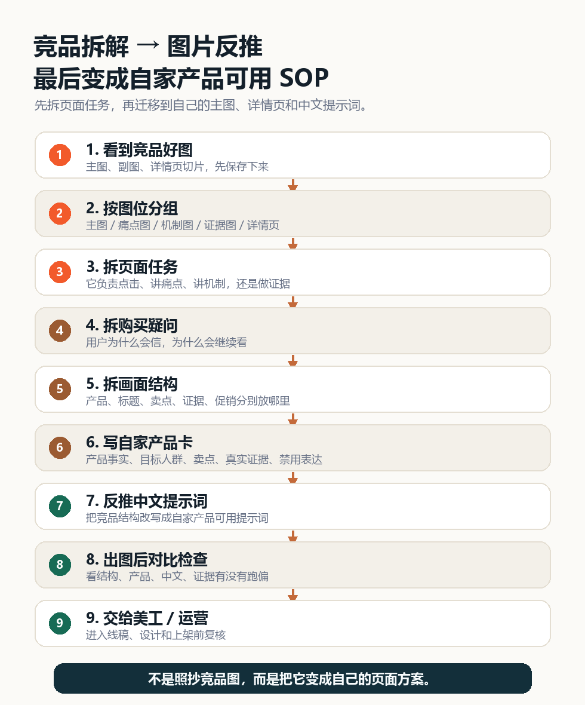

SOP 总图：先拆页面任务，再迁移到自己的主图、详情页和中文提示词。

01

##  先准备两类材料

第一类是竞品材料。

你可以保存竞品  主图、副图、详情页切片、SKU 图、证据图  。

不用一开始就追求全自动采集。能先把图片按竞品分文件夹放好，就已经够用了。

第二类是自家产品材料。

至少要有  产品名称、目标人群、核心卖点、真实证据、包装图、禁用表达  。

竞品页面上的证书、检测报告、销量、功效数字，只能拿来学习结构，不能直接搬到自己产品里。

AI 可以帮你组织画面，但不能替你编产品事实。

02

##  先按图位分组

看到一堆图片，先不要急着写提示词。

先判断它们分别是什么图位。

** 主图  ** ：负责抢点击。

** 痛点图  ** ：负责让用户觉得“这说的是我”。

** 机制图  ** ：负责解释产品为什么有效。

** 证据图  ** ：负责降低不信任。

** 详情页切片  ** ：负责把购买理由一屏一屏讲清楚。

同样一张图，放在主图和详情页里，任务是不一样的。

03

##  再拆它回答了哪个购买问题

我现在看一张竞品图，会先问：用户看到这张图时，心里可能在问什么？

这一步比“风格好不好看”更重要。

因为电商图不是单纯的视觉图，它本质上是在回答用户的购买问题。

如果这个问题没找准，提示词写再长，也只是：

蓝白背景，高级感，产品在右边，商业摄影，画面干净。

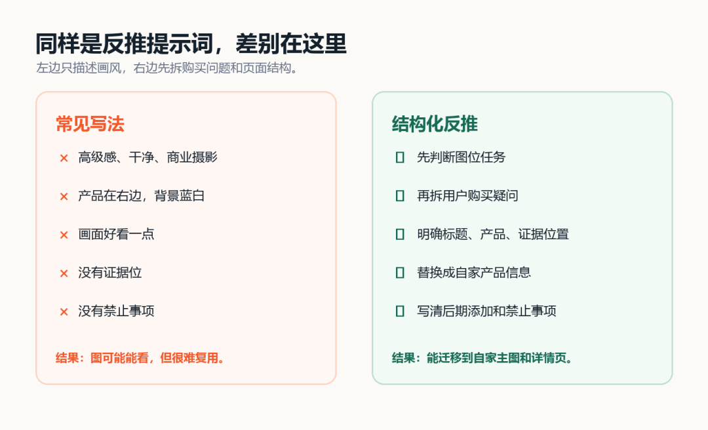

对比图：左边只描述画风，右边先拆购买问题和页面结构。

04

##  然后拆画面结构

画面结构要拆得具体一点。

产品在哪里？标题在哪里？卖点在哪里？证据在哪里？促销信息在哪里？哪些位置适合后期加字？

拿一张高氟牙膏主图举例。它的结构很清楚：左边大标题，右边产品，底部促销条，下方放证据位。

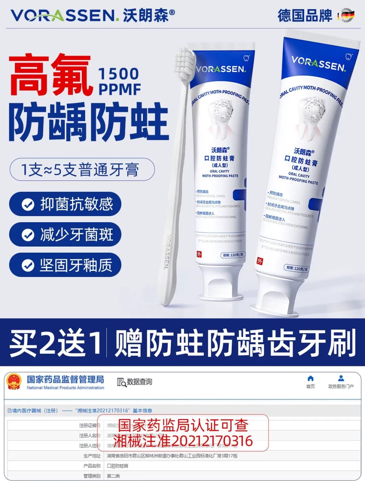

截图位 02：高氟牙膏主图拆解

这张图真正值得学的不是蓝白配色。

而是它同时做了两件事：先让用户知道这是防蛀牙膏，再用证据位降低不信任。

05

##  把竞品结构换成自家产品

反推到这一步，才开始写提示词。

不是把竞品文案复制进去，而是把它的结构换成自家产品信息。

竞品图位任务： 它负责点击、痛点、机制、证据，还是转化？ 竞品画面结构： 产品、标题、卖点、证据、促销分别放在哪里？ 可学习部分：
构图、信息顺序、证据位置、产品尺度、图位节奏。 不能照搬部分： 品牌、包装、文案、证书、报告、价格、功效数字。 自家产品替换：
换成自家产品主体、自家卖点、自家证据、自家目标人群。 最终输出： 主图线稿、详情页切片方案、中文 AI 图片提示词。

这里最重要的是“替换”。

把竞品的页面结构留下，把竞品的品牌和证据拿掉。

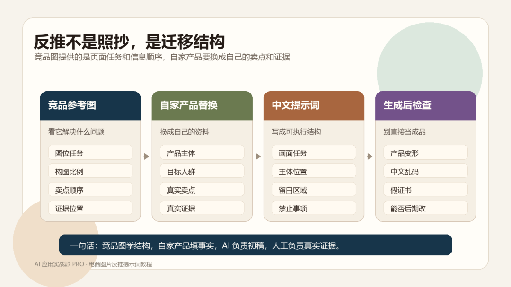

06

##  中文提示词要写成页面方案

迁移到自家产品以后，提示词可以这样写：

主图反推提示词

请生成一张 3:4 竖版电商主图。 画面任务： 用于搜索和推荐场景，让用户一眼看懂产品是什么、核心卖点是什么、为什么值得点进来。 产品主体：
右侧放置【自家产品主体】，产品占画面 45%-55%，边缘清晰，有轻微棚拍阴影。 信息结构： 左侧预留大标题区。 标题下方预留 3 条卖点勾选区。
底部预留促销条。 画面下方预留证据展示区，用于后期放真实检测报告、备案截图或资质证明。 背景风格： 白色到浅蓝渐变，干净、专业，适合口腔护理或医用消费品。
后期添加： 品牌 logo、准确中文文案、检测报告、备案截图、注册号、功效数字，全部后期人工添加。 禁止： 不要生成假证书、假报告、假
logo、乱码中文、虚假功效数字，不要让产品包装变形。

这段提示词里，最重要的不是形容词。

而是画面任务、信息结构、证据位置和禁止事项。

07

##  机制图和详情页也按同一套拆

牙刷、牙膏、护肤、家清这类产品，经常会遇到抽象卖点。

比如超软、抗敏、修护、除螨、锁水。

这些词直接写出来，用户没感觉。机制图要做的是把卖点变成可见细节。

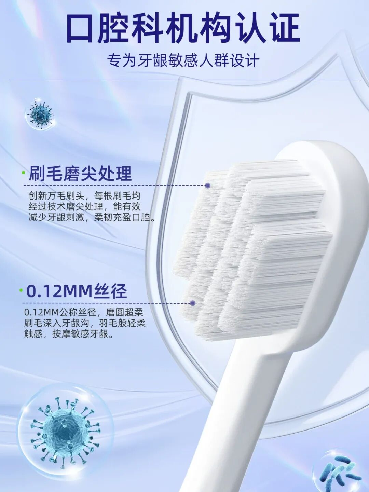

截图位 03：牙刷刷毛机制图。重点看它如何把卖点放大成可见细节。

详情页也是一样。一屏只回答一个问题。

这一屏讲痛点，就不要同时讲促销；这一屏讲机制，就不要同时讲售后。

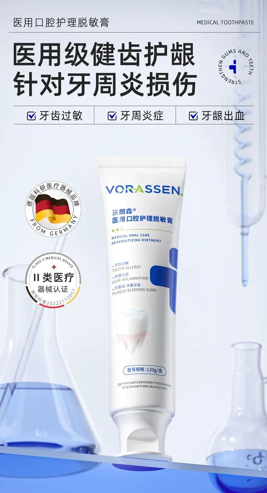

截图位 04：详情页痛点切片。

08

##  出图后必须做对比检查

提示词写完，不代表结束。要看ai出图效果。怎么看呢？

我会看 4 件事：结构有没有回来，产品有没有变形，中文和证据是否需要后期加，证据有没有跑偏。

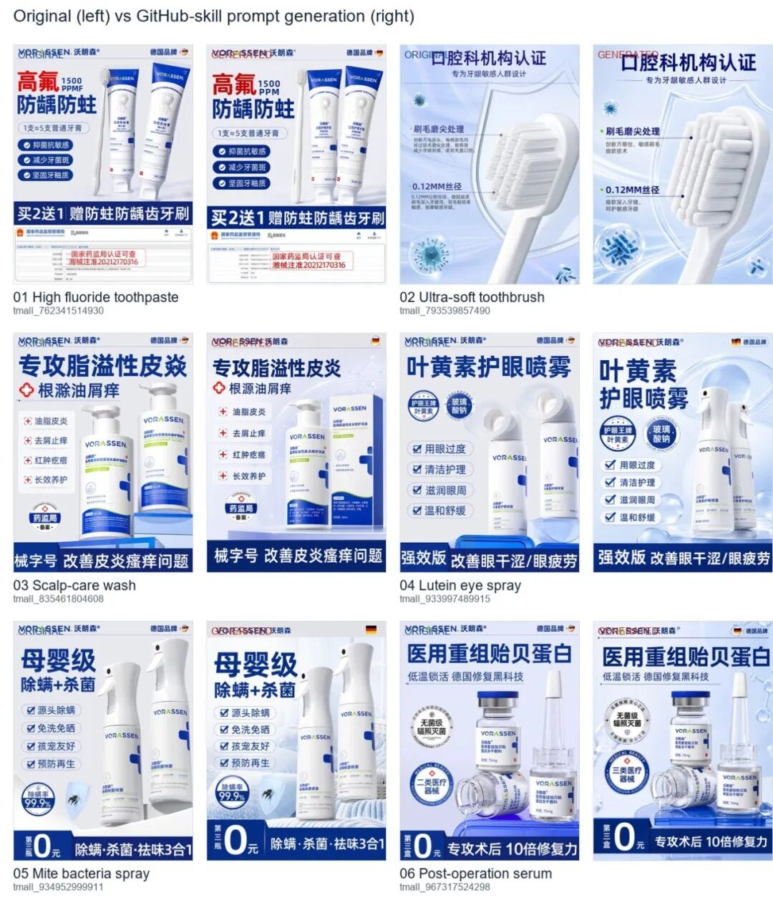
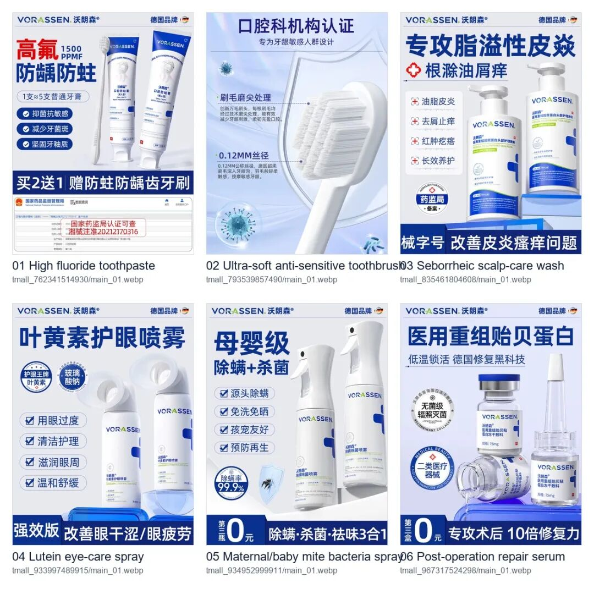

截图位 05：原图/生成图对照。这里看结构，不要把生成图当最终上架图。

AI 能帮你把大结构拉回来。

但它不能保证包装细节、中文小字、真实资质完全准确。

所以这套 SOP 更适合做主图初稿、详情页线稿、卖点图结构和视觉方向。

09

##  我把这套 SOP 做成了 Skill

这套流程我已经整理成了一个通用 Skill。

它不是让 AI 照抄竞品图，而是让 AI 按固定顺序拆：图位任务、购买疑问、画面结构、可迁移点、不能照搬点、中文提示词和生成后检查清单。

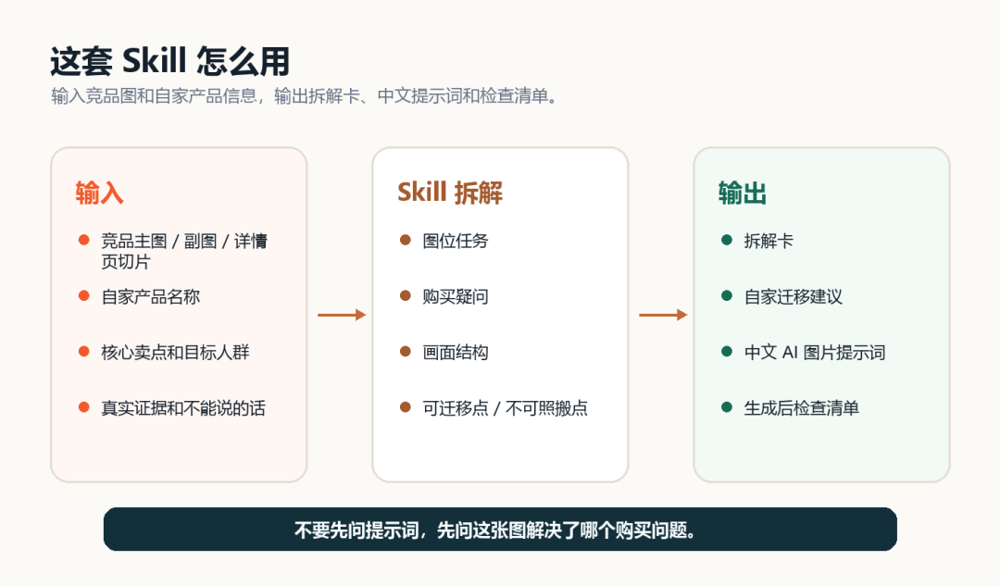

Skill 使用说明图：输入竞品图和自家产品信息，输出拆解卡、中文提示词和检查清单。

资料包里有 3 个文件：

** SKILL.md  ** ：给支持 Skill 的 Agent 使用。

** AGENT_PROMPT.md  ** ：给不支持 Skill 的 AI 使用，直接复制也能跑。

** README.md  ** ：写清楚怎么安装、怎么输入图片、怎么拿到结果。

重点：如果你的工具支持 Skill，就把整个资料包放进去。

如果不支持 Skill，就复制  ` AGENT_PROMPT.md  ` 。

然后给它一张竞品图，或者一组主图/详情页截图，再补一句：

请按电商图片拆解反推 SOP，拆出这张图的图位任务、购买疑问、画面结构、可迁移点、不可照搬点，并改写成适合我自家产品的中文 AI 图片提示词。

这套资料包我已经整理好了在（里面的资料非常详细哦，要仔细阅读哦）：  评论区

咨询讨论请加：  HPwangtang

AI 应用实战派 PRO

觉得本文还不错，赶紧点赞收藏吧。

关注我，还有更多精彩文章和教程。

我是  AI 应用实战派pro  ，只聊落地，不讲虚的。

---

本文最初发布于微信公众号「AI应用实战派PRO」。未经特别说明，正文与配图采用 [CC BY-NC-ND 4.0](https://creativecommons.org/licenses/by-nc-nd/4.0/deed.zh-hans) 许可。
