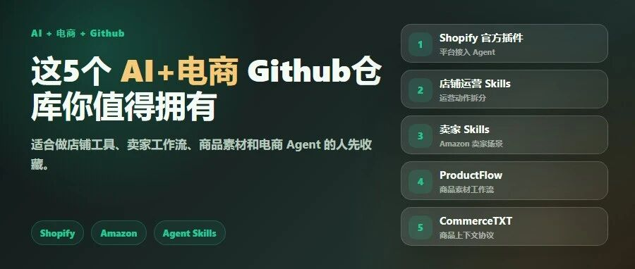

# 这5个 AI+电商 Github仓库你值得拥有

> 作者：旺哥 · 公众号：AI应用实战派PRO  
> [查看微信公众号原文](https://mp.weixin.qq.com/s?__biz=MzY4NDA4MDUwMA==&mid=2247484099&idx=1&sn=d0805c16ca0602c48b40ae2fe0fe102e&chksm=f27edf01e4f2c4e70d7d68f6b2daca1669ed6779286b7f6428bc628d7c6de1c913b2629c5ac0#rd)

GITHUB × AI 电商

这几个 AI 电商仓库值得看。

Shopify 官方插件、店铺 Skills、亚马逊卖家工具，还有一个商品数据协议。

Shopify  Amazon  Agent Skills

用我手搓的skills发现的ai电商仓库，有兴趣的可以自己探索发现一下：

[ GitHub 系列：一个 Skills 帮你挖掘高潜力的Github仓库
](https://mp.weixin.qq.com/s?__biz=MzY4NDA4MDUwMA==&mid=2247484049&idx=1&sn=bfcdd7386b9b28d954f430f2da44359e&scene=21#wechat_redirect)

[ GitHub 系列：一个Skill教你从0拆解GitHub 仓库
](https://mp.weixin.qq.com/s?__biz=MzY4NDA4MDUwMA==&mid=2247484039&idx=1&sn=dcdf2ebb8e36081fcafaa332e882954d&scene=21#wechat_redirect)

看下总览：

先说结论：如果你做 Shopify、亚马逊、独立站，或者正在研究“AI 怎么接入电商运营”，这 3 个可以先看：

先看这三个：

Shopify/Shopify-AI-Toolkit  
40RTY-ai/shopify-admin-skills  
nexscope-ai/Amazon-Skills

另外还有一个  commercetxt/commercetxt  ，Star 不高，但想法思路不错。

01

##  Shopify 官方插件

** 仓库：  ** Shopify/Shopify-AI-Toolkit

** 一句话：  ** Shopify 官方把 Agent 接到平台文档、API schema、代码校验和店铺操作里。

这个仓库最值得看的地方是身份。它不是第三方随手做的插件，而是 Shopify 官方在给 AI 工具补能力。

README 里已经写了 Claude Code、Cursor、Gemini CLI、OpenAI Codex、VS Code 等接入方式。

小白可以这么理解：以前你问 AI Shopify 问题，它更多是靠已有知识猜。现在通过这个插件，它可以读取 Shopify
相关资料和接口规则，再帮你写代码、查文档、做校验。

** 适合谁看：  ** 做 Shopify 店铺、独立站开发、跨境工具，或者想让 Codex / Claude Code 接进 Shopify
工作流的人。

开源地址：  
https://github.com/Shopify/Shopify-AI-Toolkit

02

##  Shopify 店铺运营 Skills

** 仓库：  ** 40RTY-ai/shopify-admin-skills

** 一句话：  ** 它把 Shopify 店铺里的运营动作拆成了一组 Agent Skills。

这个仓库更贴近商家。

README 里写了 106 个 skills，覆盖 10 个分类，还有 20 个常驻
routines。方向包括库存、欺诈、履约、财务、客户健康、退货、订单分析、转化这些。

我觉得它比普通 AI 工具更有参考价值，因为它不是让 AI 泛泛分析店铺，而是把店铺运营拆成具体动作。

比如什么时候看库存，什么时候看退款，什么时候看订单异常，什么时候提醒履约或财务问题。

注意一点：  它不是装好就能替你管店。真正用起来，还要接账号、权限、数据源。但它给了一个很清楚的方向：电商 Agent 要从“聊天”走向“具体运营动作”。

** 适合谁看：  ** Shopify 商家、店铺运营、想做电商 Agent 或店铺自动化的人。

开源地址：  
https://github.com/40RTY-ai/shopify-admin-skills

03

##  Amazon 卖家 Skills

** 仓库：  ** nexscope-ai/Amazon-Skills

** 一句话：  ** 一套给亚马逊卖家用的 Skills，覆盖关键词、Listing、FBA、PPC、竞品分析。

这个仓库的好处是场景很明确。

它不是说“AI 帮你提升效率”，而是直接落到亚马逊卖家的日常问题：关键词怎么找，Listing 怎么改，FBA 费用怎么算，PPC 活动怎么拆。

README 里也写了支持 OpenClaw、Claude Code、Cursor、Windsurf、Codex 这类支持 Skills 的 Agent。

如果你做亚马逊，或者想研究跨境电商 Agent 怎么设计，这个仓库可以作为参考样本。

** 适合谁看：  ** 亚马逊卖家、跨境运营、研究电商 Skills 的人。

开源地址：  
https://github.com/nexscope-ai/Amazon-Skills

04

##  CommerceTXT

** 仓库：  ** commercetxt/commercetxt

** 一句话：  ** 它想给电商网站做一份类似  llms.txt  的结构化商品上下文。

这个仓库 Star 不高，不适合直接写成工具实测。

但它的想法挺有意思：让电商网站主动给 AI 一份交易相关资料，比如商品价格、库存、规格、政策、评论摘要，而不是让 Agent 在网页里自己猜。

现在很多 AI 读商品页时，容易把活动文案、历史价格、缺货状态、页面装饰混在一起。电商网站如果能给 AI
一份清楚的商品上下文，价格、库存、退换货规则这些就更不容易读错。

** 适合谁看：  ** 做电商网站、商品数据、AI 购物助手、Agent 产品的人。

开源地址：  
https://github.com/commercetxt/commercetxt

05

##  ProductFlow 先留到下一篇

还有一个  yuqie6/ProductFlow  ，这次我不展开。

它更像商品素材工作台：产品资料、参考图、AI 文案、海报、图片生成会话、图片库、视觉工作流都放在一起。

这个方向和我们之前写过的“电商图片反推提示词 SOP”更接近，适合单独写一篇商品图和素材工作台专题。

[ AI电商实战教程：拆了 500 张电商图，整理出一套电商反推提示词 SOP（附完整 Skill）
](https://mp.weixin.qq.com/s?__biz=MzY4NDA4MDUwMA==&mid=2247484066&idx=1&sn=fb15837a151047210e665ce7bffdcb80&scene=21#wechat_redirect)

开源地址：  
https://github.com/yuqie6/ProductFlow

先看哪一个？

如果你只想先收藏一个，我建议先看 Shopify 官方插件。更关心运营动作，就看  shopify-admin-skills  。做亚马逊，就看
Amazon-Skills  。

咨询讨论请加：  HPwangtang

AI 应用实战派 PRO

觉得本文还不错，赶紧点赞收藏吧。

关注我，还有更多精彩文章和教程。

我是  AI 应用实战派pro  ，只聊落地，不讲虚的。

---

本文最初发布于微信公众号「AI应用实战派PRO」。未经特别说明，正文与配图采用 [CC BY-NC-ND 4.0](https://creativecommons.org/licenses/by-nc-nd/4.0/deed.zh-hans) 许可。
