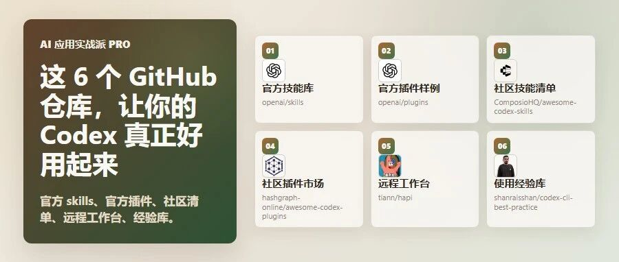

# 这 6 个 GitHub 仓库，让你的 Codex 真正好用起来

> 作者：旺哥 · 公众号：AI应用实战派PRO  
> [查看微信公众号原文](https://mp.weixin.qq.com/s?__biz=MzY4NDA4MDUwMA==&mid=2247484115&idx=1&sn=c71179355429ee837db2849a4adc4763&chksm=f2b72ae6699500a1f1929ad037fc44974414b6fd54d9e9e4bcd73d89b5bb640b90d75120a163#rd)

装好 Codex 只是第一步。

想用得顺手，还要会找 skills、看插件、远程盯进度、查常见概念。下面这 6 个仓库，可以先按问题收藏。

很多人装好 Codex 后，只会在终端里一句一句问。

其实 Codex 还有一整套可扩展玩法：  skills 可以沉淀固定任务，plugins 可以接工具，远程工作台可以看进度，经验库可以帮你少走弯路。

下面这 6 个仓库，适合 Codex 用户先收藏。

它们能帮你回答几个很实际的问题：

  * 去哪里找官方 skills？ 
  * 插件和 skill 到底差在哪里？ 
  * 有没有现成的社区 skill 和插件清单？ 
  * Codex 跑任务时，能不能离开电脑看进度？ 
  * AGENTS.md、MCP、hooks 这些词看不懂时，去哪查？ 

选这 6 个，是因为它们分别解决 skills、plugins、远程进度和经验速查这些实际问题，而不是只展示技术名词。

我是怎么挖掘和拆解的：

[ GitHub 系列：一个 Skills 帮你挖掘高潜力的Github仓库
](https://mp.weixin.qq.com/s?__biz=MzY4NDA4MDUwMA==&mid=2247484049&idx=1&sn=bfcdd7386b9b28d954f430f2da44359e&scene=21#wechat_redirect)

[ GitHub 系列：一个Skill教你从0拆解GitHub 仓库
](https://mp.weixin.qq.com/s?__biz=MzY4NDA4MDUwMA==&mid=2247484039&idx=1&sn=dcdf2ebb8e36081fcafaa332e882954d&scene=21#wechat_redirect)

它们可以分成三组：

01

openai/skills

官方技能库：Codex 官方技能目录，先看这里，能最快理解 skill 到底长什么样。

02

openai/plugins

官方插件样例：官方插件示例仓库，适合搞清楚 Codex 插件是怎么打包的。

03

ComposioHQ/awesome-codex-skills

社区技能清单：社区整理的 Codex skill 清单，适合找现成技能和写法参考。

04

hashgraph-online/awesome-codex-plugins

社区插件市场：社区整理的 Codex 插件和资源入口，适合找可安装的插件来源。

05

tiann/hapi

远程工作台：把本地 Codex 会话放到 Web、PWA、Telegram 里看，适合离开电脑也盯进度。

06

shanraisshan/codex-cli-best-practice

使用经验库：Codex 使用经验库，适合遇到 AGENTS.md、skills、hooks、MCP 时翻一翻。

  * 官方底座：先看 OpenAI 自己怎么定义 skills 和 plugins。 
  * 社区货架：再去社区清单里找可用的技能和插件。 
  * 日常增强：最后解决远程盯进度、查经验、少走弯路。 

Codex 好用仓库地图

如果你已经开始用 Codex，可以直接把它当收藏清单。

不需要一次全部装完，先按自己的问题挑一个看。

01

##  openai/skills：先看官方 skill 长什么样

GitHub：https://github.com/openai/skills

这是 OpenAI 官方的 Codex Skills Catalog。

如果你只听过“skill”，但还不知道它  到底是什么/怎么使用  ，先看这个仓库。

简单说，skill 不是一句提示词，而是一个小文件夹。里面可以放说明、脚本、参考资料，让 Codex 在处理某类任务时按固定方式做。

openai/skills 短拆解卡

这个仓库适合先收藏，不一定马上安装。

你可以先点进去看官方样例，理解一个合格的 SKILL.md 应该怎么写、什么时候触发、哪些资料应该放在 references 里。

对新手来说，最有用的思路是：不要反复复制一大段提示词。只要某个任务经常出现，就可以考虑把它做成 skill。

02

##  openai/plugins：想懂插件，先看官方样例

GitHub：https://github.com/openai/plugins

如果说 skill 更像“让 Codex 记住一套做法”，那 plugin 更像“给 Codex 装一套工具包”。

OpenAI 的这个仓库放的是 Codex 插件样例。README 里写得很清楚：可以配套放 skills、App 配置、MCP 配置等内容。

openai/plugins 短拆解卡

以后你看到别人说“Codex 插件”，就不会只把它理解成一个按钮。它更像一个打包好的工作能力。

03

##  ComposioHQ/awesome-codex-skills：找社区现成 skill

GitHub：https://github.com/ComposioHQ/awesome-codex-skills

官方仓库适合理解规范，社区清单适合找灵感。

ComposioHQ/awesome-codex-skills 是一个面向 Codex 的技能清单。它会讲 skills 放在哪里、SKILL.md
怎么组织、安装后如何让 Codex 识别。

awesome-codex-skills 短拆解卡

我建议把它当“技能货架”看。

不要看到 Star 高就全装，而是按自己的高频任务去找：  资料整理、自动化、文档、研究、工具连接  ，先挑一个最常用的方向。

真正有价值的 skill，应该帮你减少重复说明，而不是让你的 Codex 变得更乱。

04

##  awesome-codex-plugins：找插件市场和社区资源

GitHub：https://github.com/hashgraph-online/awesome-codex-plugins

这个仓库更像社区插件入口。

它收集 Codex plugins、skills 和相关资源，还给了 marketplace source 的添加方式。

awesome-codex-plugins 短拆解卡

适合什么时候看？

当你已经知道 skill 是什么，也大概明白 plugin 是什么，接下来想找更多插件来源，就可以翻这个仓库。

不过第三方插件要谨慎一点。

尤其是涉及本地文件、命令、MCP、外部账号时，先看清楚 README、权限、更新情况，再考虑安装。

05

##  tiann/hapi：离开电脑，也能看 Codex 进度

GitHub：https://github.com/tiann/hapi

这个仓库和前面几个不一样，它解决的是使用场景问题。

很多 Codex 任务不是马上结束。它可能在跑命令、改文件、等你批准操作。你离开电脑后，就很难知道它做到哪一步。

HAPI 的定位是：在本地运行 Claude Code、Codex、Gemini、OpenCode 等会话，然后通过 Web、PWA、Telegram
Mini App 远程控制。

tiann/hapi 短拆解卡

这类工具对 Codex 用户很实用。

不是因为它让 Codex 变聪明，而是让你不用一直坐在终端前等。

但要注意，它不是让你跳过确认，也不是随便暴露到公网。先看 README 里的加密、自托管和访问方式，再决定怎么用。

06

##  codex-cli-best-practice：用一阵后，回来查经验

GitHub：https://github.com/shanraisshan/codex-cli-best-practice

Codex 用久了，你一定会遇到一些词：AGENTS.md、skills、hooks、MCP、config、subagents、workflows。

单独搜每个词很碎。这个仓库的价值，是把 Codex 常见概念和经验放在一起，适合当速查资料。

codex-cli-best-practice 短拆解卡

我不建议你把它当安装包。

更好的用法是：遇到概念不懂，回去翻对应部分；想优化自己的 Codex 用法，再看 Tips。

它不是官方标准，但很适合帮新手建立使用框架。

##  这 6 个怎么配合

如果你只想按顺序收藏，可以这样来：

  * 先看 openai/skills，理解 skill 是什么。 
  * 再看 openai/plugins，理解 plugin 是什么。 
  * 想找现成技能，看 awesome-codex-skills。 
  * 想找插件入口，看 awesome-codex-plugins。 
  * 想离开电脑盯进度，看 HAPI。 
  * 用一阵后不懂概念，再翻 codex-cli-best-practice。 

这版清单的重点不是“Codex 到底能不能干活”。

重点是：当越来越多人开始用 Codex，真正拉开差距的往往不是会不会输入一句话，而是有没有把技能、插件、远程控制和使用经验整理起来。

先收藏这 6 个仓库。

等你下次觉得 Codex “还能不能更好用一点”时，可以回来按问题查。

##  开源地址汇总

openai/skills

GitHub：https://github.com/openai/skills

openai/plugins

GitHub：https://github.com/openai/plugins

ComposioHQ/awesome-codex-skills

GitHub：https://github.com/ComposioHQ/awesome-codex-skills

hashgraph-online/awesome-codex-plugins

GitHub：https://github.com/hashgraph-online/awesome-codex-plugins

tiann/hapi

GitHub：https://github.com/tiann/hapi

shanraisshan/codex-cli-best-practice

GitHub：https://github.com/shanraisshan/codex-cli-best-practice

咨询讨论请加：  HPwangtang

AI 应用实战派 PRO

觉得本文还不错，赶紧点赞收藏吧。

关注我，还有更多精彩文章和教程。

我是 AI 应用实战派pro，只聊落地，不讲虚的。

---

本文最初发布于微信公众号「AI应用实战派PRO」。未经特别说明，正文与配图采用 [CC BY-NC-ND 4.0](https://creativecommons.org/licenses/by-nc-nd/4.0/deed.zh-hans) 许可。
