# AI电商实战教程: 我用Codex + 6 个 GitHub 仓库，跑通了一套电商作图 SOP

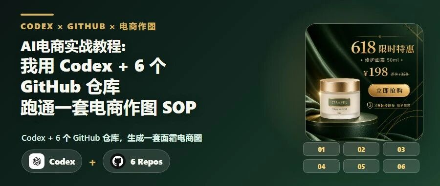

> 作者：旺哥 · 公众号：AI应用实战派PRO  
> [查看微信公众号原文](https://mp.weixin.qq.com/s?__biz=MzY4NDA4MDUwMA==&mid=2247484134&idx=1&sn=45b425bac946350285021aec0d703fe7&chksm=f2153d1a130ea83bd4d103832d316608f7c6ecc66b9d5d5cbc768946d9d07204b37772e7f21b#rd)
> [下载 HTML 图文包（含图片）](https://github.com/wangge-dev/wangge-articles/releases/download/html-archive/202606061801.zip) · [HTML 文件](../../html/2026/202606061801/article.html)

CODEX × GPT-IMAGE-2 × 电商作图

#  我用 Codex + 6 个 GitHub 仓库，跑通了一套电商作图 SOP

从一个面霜产品开始，拆主图、卖点图、质地图、促销图和详情页首屏。

6

个仓库

6

张实测图

SOP

可复用流程

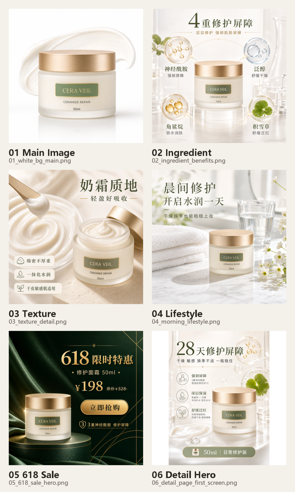

前段时间，我写过一篇 GPT-image-2 电商图教程。那篇更偏“提示词实战”：怎么描述、怎么出图、效果怎么样。

[ 7000字教你从0开始用GPT-image-2搭建电商主图详情页（附完整教程和仓库地址）
](https://mp.weixin.qq.com/s?__biz=MzY4NDA4MDUwMA==&mid=2247483827&idx=1&sn=95d632b122a2df1f84239a34b7b06a26&scene=21#wechat_redirect)

这次我换了一个角度。我想试试能不能把这件事变成一套 SOP：不是临时想一条提示词，而是把产品、图位、参考仓库、提示词和审图标准串起来。

分享包在评论区，一定要看到最后哦，本篇教程十分精彩！一个免费的点赞收藏转发不过分吧！

先说结论：Codex 不太适合硬保真复刻真实商品包装，但很适合把一个  产品重新创作成  一套电商图工作流。

这次我用的是一个虚构护肤品：  CERA VEIL 神经酰胺修护面霜  ，50ml，磨砂象牙白圆罐，香槟金圆盖，鼠尾草绿标签。

流程图

产品资料  →  平台图位  →  仓库参考  →  中文提示词  →  Codex 出图  →  人工审图

对比图：临时出图 vs SOP 出图

临时出图

一句话让 AI 画图，容易出现风格漂移、图位混乱、文字难控。

SOP 出图

先拆产品和图位，再写单图提示词，最后审图迭代。

01

##  6 个仓库怎么放进流程

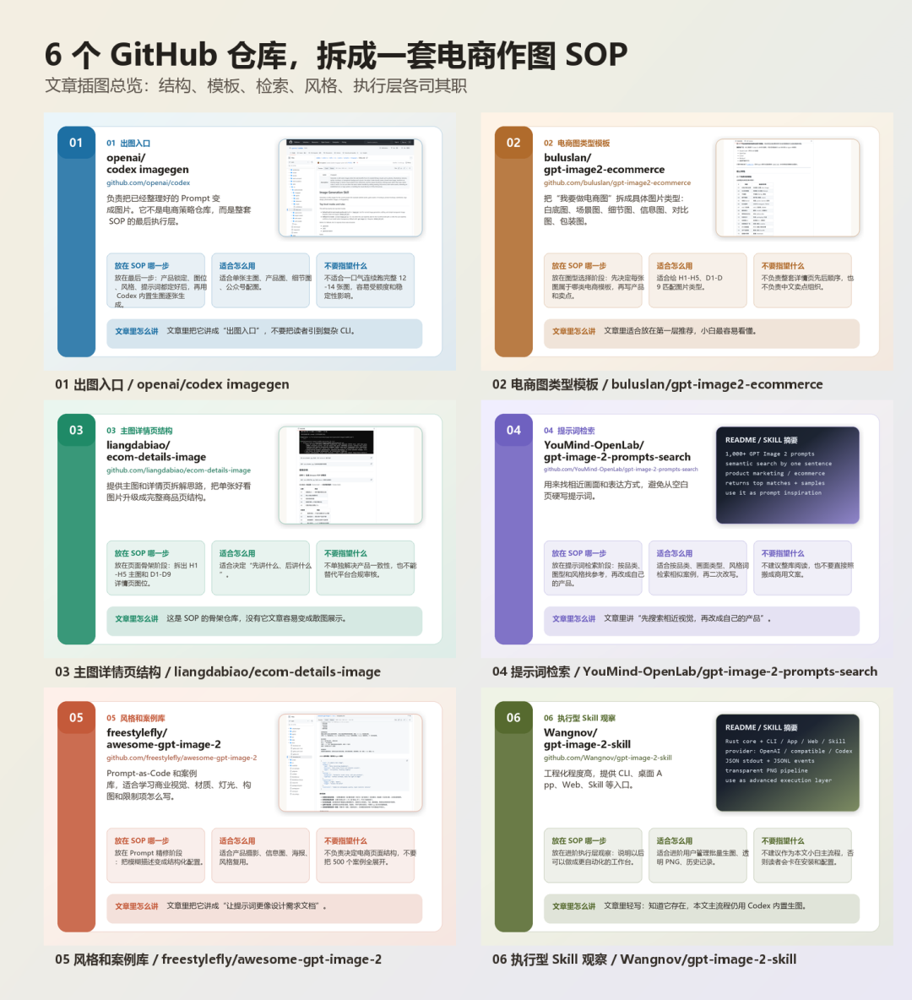

这 6 个仓库不是平铺推荐，而是放在同一条工作流里看。

** openai/codex imagegen  ** 是出图入口，把整理好的提示词变成图片。

** buluslan/gpt-image2-ecommerce  ** 像电商图型字典，帮我拆白底图、场景图、信息图、促销图。

** liangdabiao/ecom-details-image  ** 负责页面结构，让商品页不是散图堆叠。

** YouMind-OpenLab/gpt-image-2-prompts-search  ** 用来找提示词方向。

** freestylefly/awesome-gpt-image-2  ** 适合学习风格、光线、材质和限制项。

** Wangnov/gpt-image-2-skill  ** 更偏工程化，适合后续自动化观察。

Codex 负责出图；buluslan 负责图型；liangdabiao 负责页面结构；YouMind 负责找方向；freestylefly
负责风格精修；Wangnov 代表后续自动化方向。

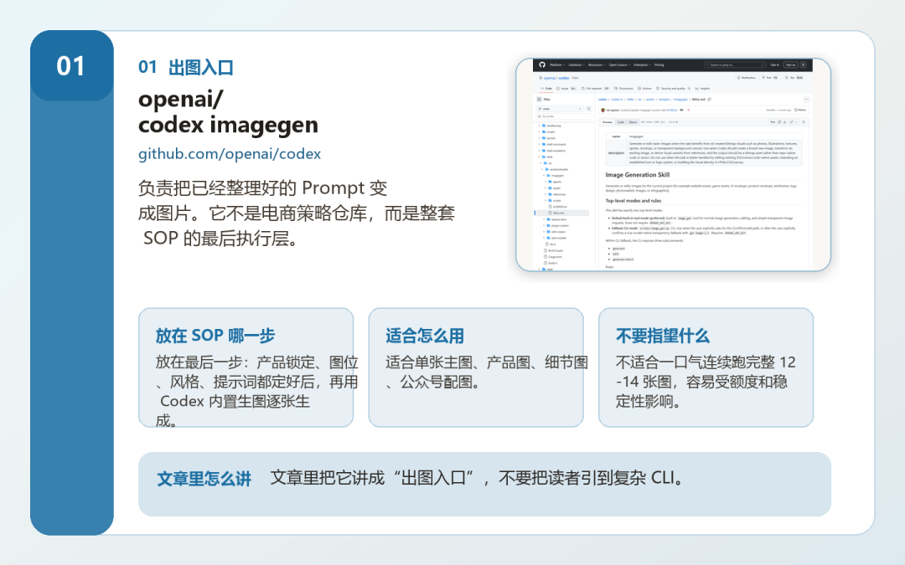
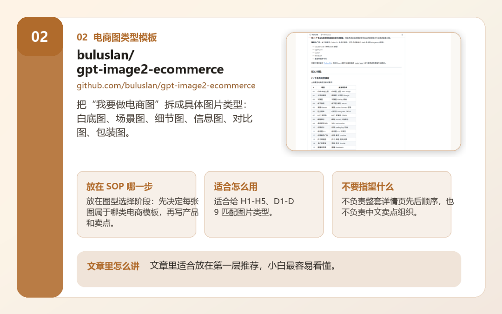
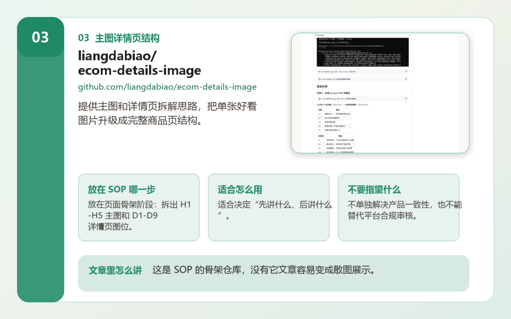
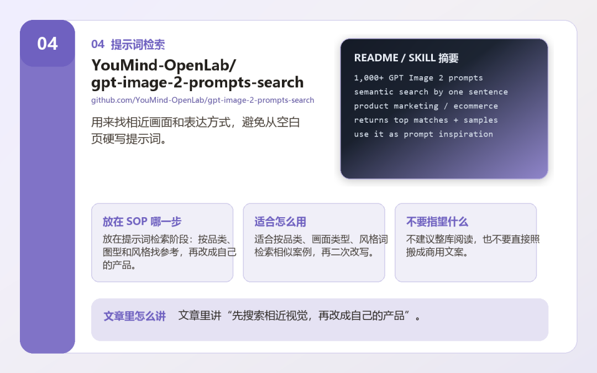
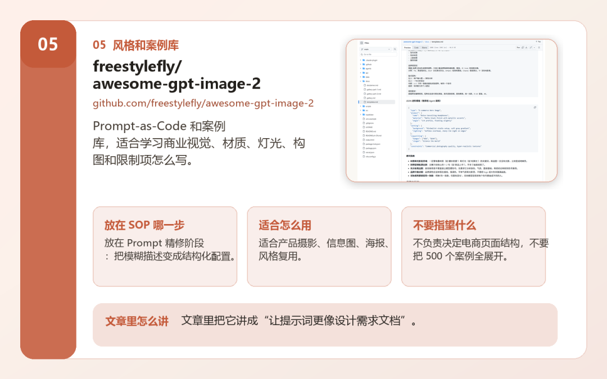
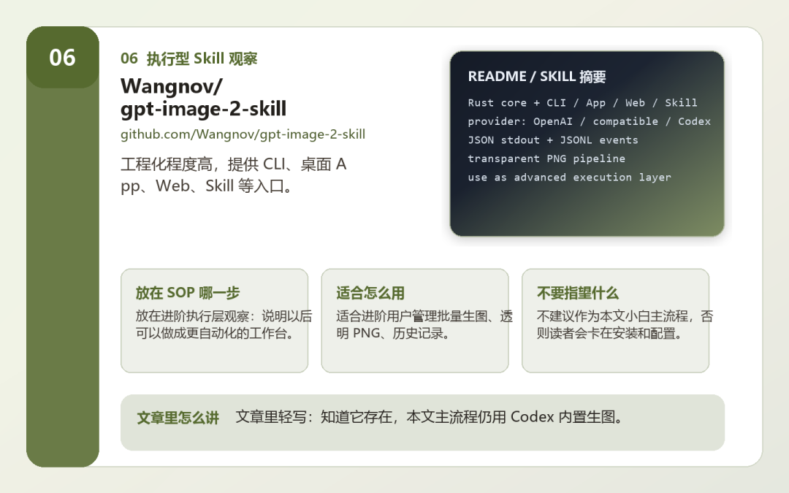

02

##  先写产品资料，再写单图提示词

正式出图前，我先写产品资料。它的作用是让每张图里的产品尽量保持一致。

产品名称：CERA VEIL 神经酰胺修护面霜 规格：50ml 类目：护肤品 / 修护面霜 包装：磨砂象牙白圆罐，香槟金圆盖，鼠尾草绿标签 核心卖点：神经酰胺修护屏障、保湿、舒缓干燥、换季敏感肌适用 视觉风格：高端护肤、奶油白、香槟金、鼠尾草绿 平台：天猫 / 京东风格电商图 限制：不写绝对功效，不写医疗化表述，不加真实品牌名，不加水印 必须保持一致：圆罐、金盖、绿标签、50ml、CERA VEIL、CERAMIDE REPAIR

图位我先拆成 6 张：白底主图、成分卖点图、质地细节图、场景图、618 促销图、详情页首屏。正式跑图时，我更建议一张图一条提示词。

03

##  实测：6 张关键图和完整中文提示词

###  1\. 白底主图：先锁定产品

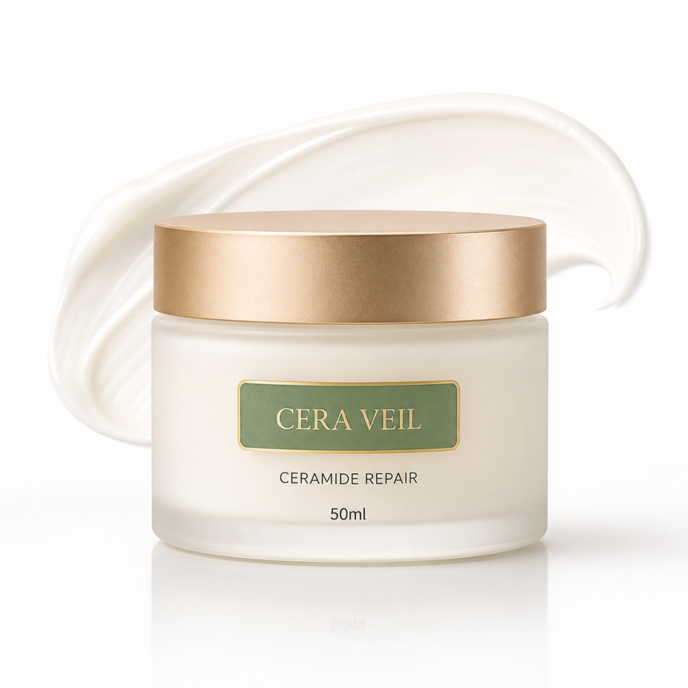

白底主图的作用是锁定产品外观。它不一定最吸睛，但能给后面的卖点图、场景图和促销图一个统一基准。

PROMPT

生成一张高质量电商白底主图，产品为虚构护肤品 CERA VEIL 神经酰胺修护面霜，规格 50ml。产品外观保持一致：磨砂象牙白圆罐、香槟金圆盖、正面有鼠尾草绿小标签，标签上有 CERA VEIL、CERAMIDE REPAIR、50ml。画面为天猫/京东风格白底主图，产品居中，正面清晰，略微低角度，底部有自然阴影和轻微反光，背景只保留淡淡面霜涂抹痕迹，不放多余道具。风格为高端护肤品商业摄影，干净、真实、质感细腻。不要添加大段促销文字，不要水印，不要出现其他品牌。

###  2\. 成分卖点图：讲清购买理由

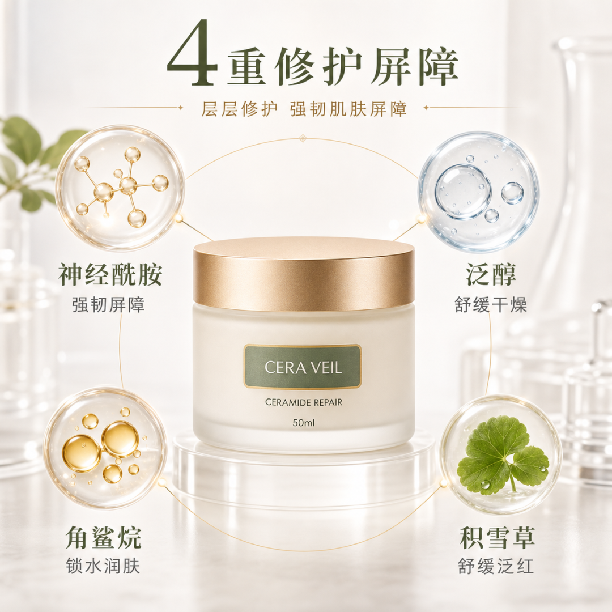

成分卖点图不是堆成分，而是把“为什么买”讲清楚。这张图的小字和成分名，正式使用前必须人工审。

PROMPT

生成一张方形护肤品成分卖点信息图。产品为 CERA VEIL 神经酰胺修护面霜 50ml，外观保持一致：磨砂象牙白圆罐、香槟金圆盖、鼠尾草绿标签。产品放在画面中心，周围做四个透明成分气泡，用细金色连线连接到产品。四个成分方向分别是：神经酰胺，强调强韧屏障；泛醇，强调舒缓干燥；角鲨烷，强调锁水润肤；积雪草，强调舒缓泛红。主标题写“4重修护屏障”。画面为白金实验室护肤风，香槟金和鼠尾草绿点缀，排版清爽，文字尽量清晰，不要水印。

###  3\. 质地细节图：把触感视觉化

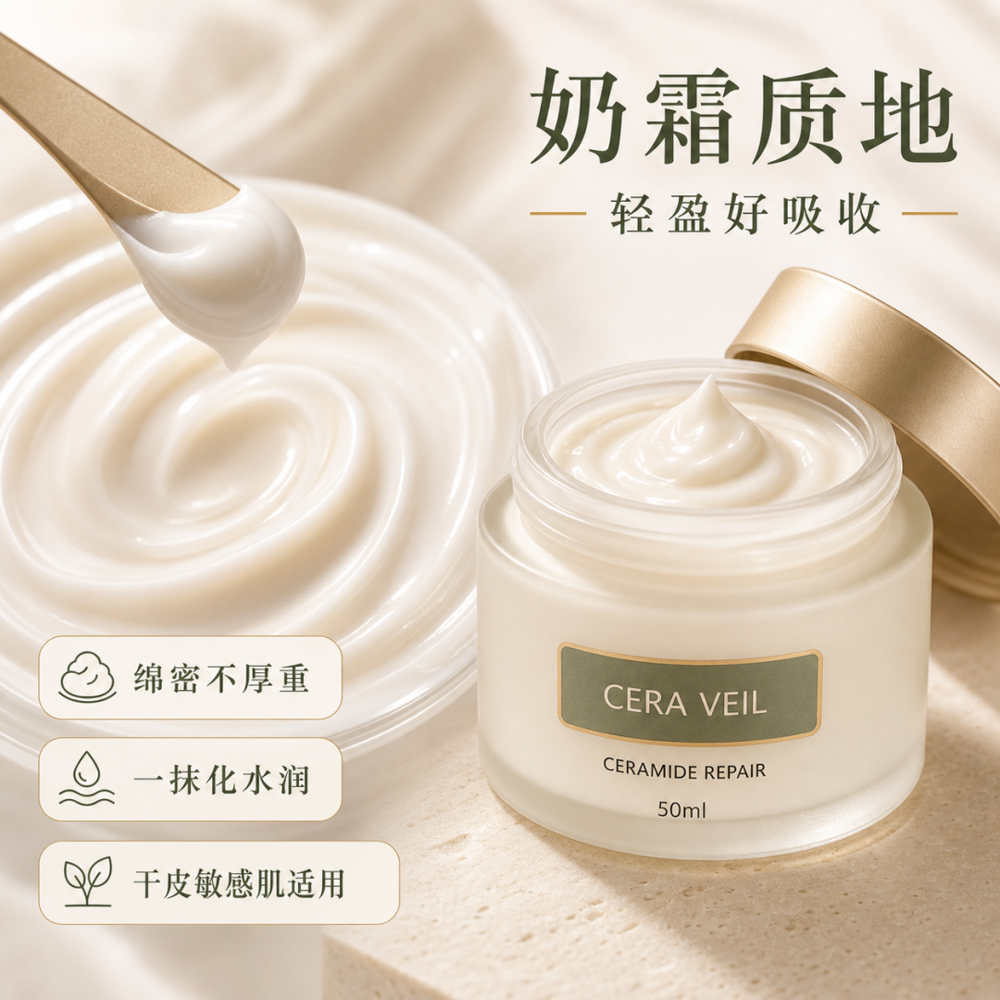

质地图的核心，是让用户隔着屏幕感受到“这瓶面霜涂起来是什么感觉”。

PROMPT

生成一张方形高端护肤品质地细节图。产品为 CERA VEIL 神经酰胺修护面霜 50ml，保持磨砂象牙白圆罐、香槟金圆盖、鼠尾草绿标签。画面右侧放打开的面霜罐，左侧做大面积奶霜质地特写，有细腻旋纹；加入一把小刮勺，挑起一颗顺滑的膏体。主标题写“奶霜质地 轻盈好吸收”。左下放三个小卖点标签：绵密不厚重、一抹化水润、干皮敏感肌适用。整体为奶油白、香槟金、鼠尾草绿配色，高端护肤微距摄影风，细节清晰，不要水印。

###  4\. 场景图：把产品放回生活里

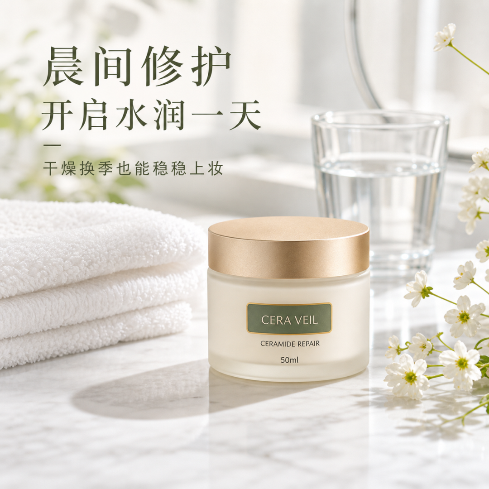

场景图不需要堆卖点，更适合讲一个具体使用时刻。

PROMPT

生成一张方形高端护肤品生活场景图。产品为 CERA VEIL 神经酰胺修护面霜 50ml，保持磨砂象牙白圆罐、香槟金圆盖、鼠尾草绿标签，正面标签清楚。场景为明亮晨间浴室台面，有柔软白毛巾、透明水杯、小白花和自然光，整体干净清新。产品放在画面偏右位置，保留优雅阴影。左上写主标题“晨间修护 开启水润一天”，副标题写“干燥换季也能稳稳上妆”。风格为真实高端护肤品摄影，白色和鼠尾草绿为主，不要水印。

###  5\. 618 促销主视觉：价格和按钮要醒目

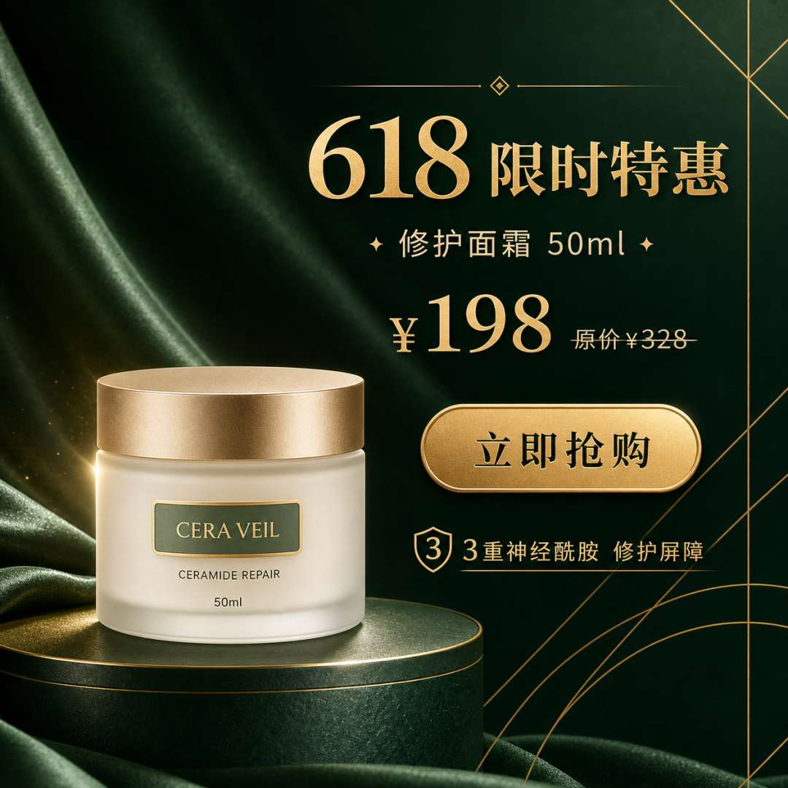

促销图不是单纯好看，它要让用户快速看到活动、价格、原价、购买按钮和核心卖点。

PROMPT

生成一张方形 618 电商促销主视觉图，产品为高端护肤品 CERA VEIL 神经酰胺修护面霜 50ml，保持磨砂象牙白圆罐、香槟金圆盖、鼠尾草绿标签。背景为深祖母绿丝绒或哑光质感，加入细金色几何线条，整体是高级促销氛围。产品放在左下方，有聚光和金色反光。右侧留出文字区域。大标题写“618 限时特惠”，副标题写“修护面霜 50ml”，价格写“¥198 原价 ¥328”，按钮写“立即抢购”，底部补充“3重神经酰胺 修护屏障”。画面高对比、深绿金配色、产品清晰，不要水印。

###  6\. 详情页首屏：从单图延展到页面

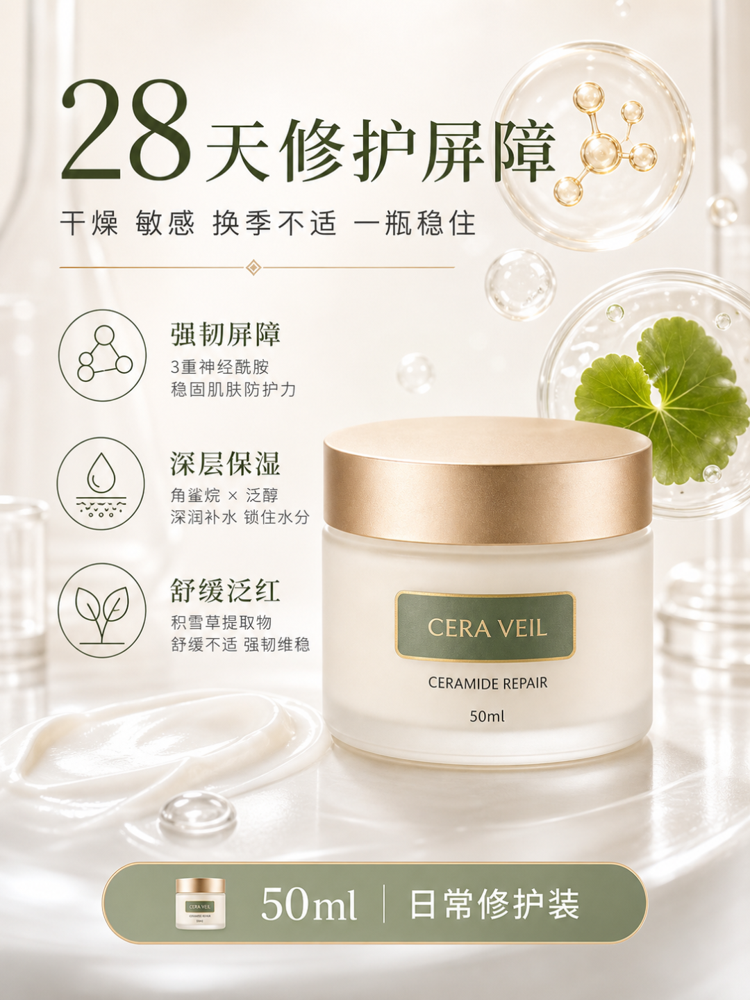

详情页首屏的意义，是证明这套 SOP 不只会做单张图，还能往商品页结构延展。

PROMPT

生成一张 3:4 纵向电商详情页首屏图，产品为 CERA VEIL 神经酰胺修护面霜 50ml，保持磨砂象牙白圆罐、香槟金圆盖、鼠尾草绿标签。版式参考天猫详情页首屏：产品放在右下方，背景为奶油白和浅金色，有轻微实验室玻璃质感、透明成分气泡和柔和光线。顶部大标题写“28天修护屏障”，副标题写“干燥 敏感 换季不适 一瓶稳住”。左侧做三个利益点模块，配简洁线性图标：强韧屏障、深层保湿、舒缓泛红。底部规格条写“50ml 日常修护装”。整体高级、干净、信息层级清楚，不要水印。

04

##  换类目时怎么套用

面霜只是示例。这套流程真正有用的地方，是能换到其他类目。

** 保温杯：  ** 改成杯身材质、容量、杯盖结构、保温时长、防漏、通勤和办公场景。

** 牙膏：  ** 重点处理牙膏管和盒子、清洁感、口气清新、浴室场景，同时避免医疗化表述。

** 食品：  ** 审成分、口味、规格和食用场景。

** 小家电：  ** 审功率、容量、续航、电压等真实参数。

AI 负责视觉初稿和表达方向，人负责事实、合规和最终判断。

05

##  最容易踩的坑

1\. 产品一致性不够：每条提示词都重复核心外观。

2\. 中文不是 100% 稳：正式商用前必须人工审图。

3\. 成分和功效不能乱写：AI 可以做视觉，不能替你做合规判断。

4\. 不要一条提示词管所有图：正式素材最好一张图一条提示词。

5\. 不要把 GitHub 仓库当魔法按钮：真正有价值的是整理出来的 SOP。

06

##  可复制模板

产品名称： 类目： 规格： 包装形态： 主体颜色： 辅助颜色： 核心卖点： 使用场景： 目标平台： 风险词/禁用词： 视觉风格： 必须保持一致的元素：
    
    
    图片类型： 产品名称： 产品外观保持： 画面构图： 场景或背景： 主标题： 副标题： 卖点模块： 整体风格： 配色： 避免出现： 画面比例：

07

##  最后

这次跑下来，我最大的感受是：AI 生图真正难的不是“画一张好看的图”，而是把产品拆成图位、卖点、风格、提示词和审图标准。

Codex 的价值也在这里。它不只是一个聊天窗口，更像一个能帮你整理  项目文件、拆解 GitHub 仓库、生成图片、记录提示词、沉淀 SOP 的工作台
。

面霜只是示例。换成保温杯、牙膏、食品、小家电，本质上还是同一套流程。

如果只是收藏一条提示词，它很快会过期。因为产品会变，平台会变，风格会变，模型也会变。

但如果你整理出一套 SOP，它就可以不断换类目、换风格、换平台。这才是普通人真正能复用的电商作图方法！

AI 应用实战派 PRO

觉得本文还不错，赶紧点赞收藏吧。

关注我，还有更多精彩文章和教程。

我是 AI 应用实战派pro，只聊落地，不讲虚的。

---

本文最初发布于微信公众号「AI应用实战派PRO」。未经特别说明，正文与配图采用 [CC BY-NC-ND 4.0](https://creativecommons.org/licenses/by-nc-nd/4.0/deed.zh-hans) 许可。
