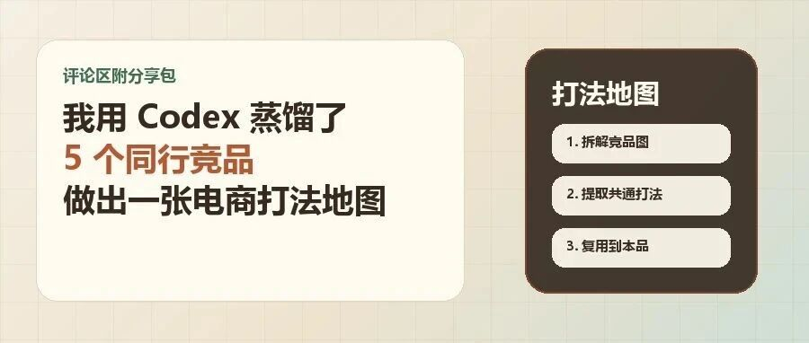

# 我用 Codex 蒸馏了 5 个同行竞品，做出一张电商打法地图

> 作者：旺哥 · 公众号：AI应用实战派PRO  
> [查看微信公众号原文](https://mp.weixin.qq.com/s?__biz=MzY4NDA4MDUwMA==&mid=2247484156&idx=1&sn=c279469f73dc2bb630cef05ac78ea770&chksm=f2dfc4f7c21519afbf97ee831b3f99fe0237e02b296c6304d685aa86cccadc5ed757bd49ef0d#rd)

Codex 实战 · 竞品蒸馏

5 个同行 -> 5 种打法 -> 1 套主图副图框架 + 详情页动线

竞品截图  打法地图  提示词模板  SOP 分享包

前段时间，我做了一个口腔护理新品的页面策划。

这个品类小，但竞品很多。

如果按以前的方式，第一步通常是打开一堆商品页面截图：主图、副图、详情页各截一遍，看到好看的版式再单独存起来。

看起来资料很多，真正要写页面时，还是会卡住：哪张图值得学、竞品在卖什么、哪些能借、哪些不能照抄、图序怎么排。

我没有让 Codex 直接“帮我写一份竞品分析”。

我让它做一件更具体的事：  ** 把 5 个同行的主图、副图和详情页逻辑，蒸馏成一张可以指导页面策划的打法图。  **

先说清楚，这里的“蒸馏”不是照抄。

我的理解很简单：先拆解竞品图，再提取共通打法，最后把能用的打法复制/复用到自己的主图和详情页里。

配套的提示词、表格模板和竞品拆解 SOP 分享包，我会放在  评论区  。正文先把方法讲清楚，免得拿到模板也不知道怎么用。

01  先拆解：别把竞品截图堆成资料夹

做电商页面的人，大多不缺竞品资料，缺的是把资料变成决策的能力。

如果你缺少竞品资料，看我前面文章，分享包在评论区：

[ AI电商实战教程：从0开始拆解竞品并做竞品分析报告（附完整SOP）
](https://mp.weixin.qq.com/s?__biz=MzY4NDA4MDUwMA==&mid=2247483971&idx=1&sn=e038a4311aee861f1ed7d55a69bdfd47&scene=21#wechat_redirect)

以前这样做：主图、详情页、卖点，看到不错就截图收藏。

现在想解决的就是这个问题：

不要只收集竞品图片，而是把竞品图片压缩成页面打法。  02  先定样本：5 个同行分别代表什么打法

我先选了 5 个比较典型的同行。

这 5 个同行分别代表 5 种打法：

竞品类型  |  主要打法  |  我关心的问题   
---|---|---  
A  |  正畸痛点 + 高氟成分  |  它怎么一眼命中戴牙套人群   
B  |  套装解决方案 + 真实产品图  |  它怎么让用户觉得“买回去就能用”   
C  |  成分证据 + 安全背书  |  它怎么把专业感做出来   
D  |  牙渍/口气/清爽感  |  它怎么把辅助利益讲得轻松   
E  |  专业防蛀标杆  |  它怎么做机制图和证据链   
  
如果你只说“分析 5 个竞品”，Codex 很容易给你一份普通报告。

但如果你先把问题问清楚：

这 5 个同行分别在打什么？  
    它们的页面任务分别是什么？  
    哪些可以借鉴？  
    哪些不能照抄？  
    最后怎么翻译成我们自己的主图和详情页？

输出就不再只是总结竞品，而是开始帮你做“蒸馏”。

03  第一层蒸馏：逐图拆页面任务

我先让 Codex 逐图拆主图和副图，不是看好不好看，而是看每张图的页面任务。

比如第一个同行，核心是正畸护理。

它的第一张图不只是摆产品，而是把“正畸、高氟、防蛀”放到最前面；后面的图继续讲托槽、牙缝、清洁盲区、成分机制、检测背书。

这个同行给我的启发是：

如果你的产品本来就是给戴牙套人群用，首屏就不能只放一支牙膏。

用户第一眼要看到：这是xxx人群用的，解决托槽和牙缝清洁问题，不是普通美白牙膏，而且有防蛀护理逻辑。

第二个同行靠套装和真实产品图建立购买感：牙膏、漱口水、牙刷放在一起，用户立刻知道这是日常护理组合。

它值得学的是“真实产品图”和“使用场景”；如果自己的产品没有套装，就不能学它的组合承诺。

第三个同行强在  成分证据，把成分纯度、检测、安全背书、人群分层  做得很好。我提取的不是某句文案，而是一个结构：

成分名称 -> 为什么有效 -> 证据在哪里 -> 适合谁使用

第四个同行打牙渍、口气和清爽感，适合补充“用起来舒服”的理由，但只能做副线。第五个同行强在专业感，会用机制图、成分图、实验对比、机构背书来建立信任。

04  第二层蒸馏：把 5 个同行提取成 5 种打法

逐图拆完以后，我让 Codex 做第二层整理：不继续描述竞品，而是把它们压缩成可以复用的页面打法。

最后得到的是这样一张表：

竞品打法  |  适合解决什么问题  |  我们能借什么  |  不能照抄什么   
---|---|---|---  
正畸痛点首屏  |  快速命中目标人群  |  托槽、牙缝、清洁盲区视觉  |  不能写治疗、根治、绝对防蛀   
高氟/成分机制  |  建立专业信任  |  成分路径、牙面保护机制  |  不能复制竞品实验数据   
证据背书页  |  降低购买疑虑  |  专利、检测、包装证据  |  不能借用竞品销量、榜单、机构背书   
牙渍/口气辅助  |  增加购买理由  |  清爽感、泡沫、牙渍视觉  |  不能让美白抢掉防蛀主线   
使用场景收口  |  告诉用户怎么用  |  早晚刷牙、饭后护理、洗漱台场景  |  没有套装就不要做套装承诺   
  
这张表才是我想要的东西。它不是竞品截图，也不是竞品总结，而是指导页面怎么写、怎么画、怎么排的判断。

我把它叫做“打法图”。

它的价值在于，看到竞品图时，不再停留在“不错”“真实”“专业”，而是判断它在打哪类页面任务。

这样，竞品就从一堆图片，变成了可用模块。

05  第三层蒸馏：把打法复用到自己的主图副图

我让 Codex 继续做第三层：

根据前面的竞品打法，  
    把它们翻译成一个新品的 1+5 主图/副图框架。  
    每张图只承担一个页面任务。  
    不要堆文案。  
    不要照抄竞品数据。  
    需要标明画面方向和素材要求。

最后得到的不是一篇报告，而是一套图序：

图序  |  页面任务  |  图的核心   
---|---|---  
图 1  |  定品类、抢点击  |  让用户一眼知道这是正畸人群的防蛀护理产品   
图 2  |  痛点证明  |  讲清托槽、牙缝、菌斑、清洁盲区   
图 3  |  成分机制  |  讲核心成分如何形成防蛀护理逻辑   
图 4  |  辅助利益  |  讲牙垢、牙渍、口气等日常使用感   
图 5  |  证据背书  |  放真实专利、检测、包装成分等证据   
图 6  |  使用场景  |  让用户知道早晚刷牙、饭后护理怎么用   
  
这个结果运营、设计、文案都能看，也能继续变成主图线稿。

Codex 不是替我拍脑袋，而是在做整理、压缩和翻译：

竞品图片  
    ↓  
    页面任务  
    ↓  
    竞品打法  
    ↓  
    本品图序  
    ↓  
    画面要求

人要做的是判断哪些能用，哪些不能用。

06  详情页也按同样方法复用

主图副图跑通后，我又让 Codex 反推详情页。

这一步的重点不是写长文案，而是确定详情页动线。5 个同行拆完后，大致会得到一个共同公式：

人群/品类首屏  
    ↓  
    痛点教育  
    ↓  
    成分/机制解决方案  
    ↓  
    证据背书  
    ↓  
    使用体验或辅助利益  
    ↓  
    规格/FAQ/购买理由

这个公式适合口腔护理、护肤品、保健品这类需要解释的产品。用户不只看价格，还会问：适不适合我、有什么区别、有没有证据、买回去怎么用。

所以最后详情页可以拆成 10 屏：

屏序  |  页面任务   
---|---  
1  |  首屏定品类，告诉用户这是给谁用的   
2  |  痛点页，讲清为什么这个人群有特殊需求   
3  |  风险页，把痛点转成购买理由   
4  |  解决方案页，讲核心成分或机制   
5  |  含量/规格页，强化专业感   
6  |  机制页，把看不见的作用路径画出来   
7  |  辅助利益页，补充使用体验   
8  |  证据页，放真实证据   
9  |  使用场景页，让用户知道怎么用   
10  |  规格/FAQ，收口转化   
  
这就是竞品蒸馏最有用的地方：不照抄某一家，而是把多家竞品背后的页面逻辑整理成自己的页面顺序。

07  Codex 在这套流程里做什么

Codex 最适合做三件事：把图片变成结构，把多个竞品压缩成打法，再翻译成自己的页面。

继续往下走：

它强在哪里？  
    我们能借什么？  
    我们有什么证据？  
    放到主图第几张？  
    放到详情页第几屏？  
    哪些词不能写？  
    哪些图必须人工排版？

做到这一步，竞品分析才会变成生产资料。

08  但有些判断不能交给 Codex

Codex 可以帮你整理和压缩，但不能替你负责所有判断。

比如功效表达。竞品说了某个数字，不代表你也能写；竞品用了“更有效”“全天候”“修复”等词，不代表你也能用。

这些都要回到自己的产品证据。

比如证据背书。你有专利就写专利，有检测就写检测，有包装成分就放包装成分。

没有的东西，不要从竞品那里借。

再比如出图。这类产品图最稳的做法，不是让 AI 重新画包装，而是：

真实产品图  
    +  
    AI 生成痛点/机制/场景素材  
    +  
    人工排版中文标题和证据

这样包装、中文和证据都不容易乱。

Codex 负责把资料蒸馏成结构。

AI 图负责生成素材层。

最终页面由人来审图和排版。

09  这篇文章真正想说的

以前做竞品分析，最容易得到的是截图，但截图不能直接告诉你页面怎么做。

这次用 Codex 跑完后，我更想要的是另一种结果：

5 个同行  
    ↓  
    5 种打法  
    ↓  
    1 套主图副图框架  
    ↓  
    1 套详情页动线  
    ↓  
    1 张能指导执行的页面方案

这就是我说的竞品蒸馏。

不是总结。

不是截图。

也不是照抄。

而是把同行验证过的页面逻辑，压缩成自己能用的结构。

10  评论区分享包里有什么

这篇文章配套的分享包，我会放在评论区。

更实用的做法是：把本文喂给 AI，再补产品或类目、5 个同行截图，让它照着这套方法输出打法图。

分享内容分成 4 份：

  1. 一段“把本文喂给 AI”的完整提示词； 
  2. 一张竞品打法地图表格模板； 
  3. 一套主图副图和详情页图序模板； 
  4. 之前那套电商竞品拆解 SOP 公开脚本包。 

不用 Codex，也可以用 龙虾、Claude、等agent

最简单的玩法是：

把本文 + 5 个同行截图 + 你的产品资料  
    一起发给 AI  
    让它输出：  
    5 个同行打法表  
    可借鉴/不可照抄表  
    本品 1+5 主图副图图序  
    详情页 8-10 屏动线  
    需要人工补证据的位置

之前做过的竞品拆解 SOP 也可以接进来。它偏前一步：把竞品图片、图片索引、逐图拆解表、分析报告模板搭起来。

[ AI电商实战教程：拆了 500 张电商图，整理出一套电商反推提示词 SOP（附完整 Skill）
](https://mp.weixin.qq.com/s?__biz=MzY4NDA4MDUwMA==&mid=2247484066&idx=1&sn=fb15837a151047210e665ce7bffdcb80&scene=21#wechat_redirect)

本文偏后一步：把竞品压缩成页面打法，再翻译成自己的主图和详情页。

两套东西可以连起来：

竞品拆解 SOP  
    负责把资料拆干净  
      
    竞品蒸馏打法图  
    负责把资料变成页面决策

咨询讨论请加：HPwangtang

###  AI 应用实战派 PRO

觉得本文还不错，赶紧点赞收藏吧。

关注我，还有更多精彩文章和教程。

我是 AI 应用实战派pro，只聊落地，不讲虚的。

---

本文最初发布于微信公众号「AI应用实战派PRO」。未经特别说明，正文与配图采用 [CC BY-NC-ND 4.0](https://creativecommons.org/licenses/by-nc-nd/4.0/deed.zh-hans) 许可。
