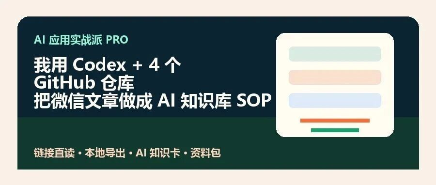

# 我用Codex+4个 Github 仓库把微信文章做成了一套 AI 知识库SOP

> 作者：旺哥 · 公众号：AI应用实战派PRO  
> [查看微信公众号原文](https://mp.weixin.qq.com/s?__biz=MzY4NDA4MDUwMA==&mid=2247484168&idx=1&sn=27e05bf33edc7973ee1f909d9d02ade9&chksm=f28d14d66ed9b952ce053579dffc0779ca319c3d8e7d0feb2d6e536597bd35cc3be529ceb115#rd)

看上面结果

这套 SOP 能把一篇公众号文章整理成知识卡，也能把一批文章按主题归档，最后变成后续写文章、做选题、做项目时能调用的资料。

我以前收藏过很多公众号文章。

当时觉得很有用，点了收藏，过几天真要找的时候，基本又找不到了。

这时你会发现，收藏夹不是知识库。

收藏只是“我以后可能会看”，知识库才是“我现在能拿来用”。

所以这次我做了一个小实验：把公众号文章从链接，变成 AI 能读、我能检索、后面能复用的资料库。

配套的工具选择表、整理 SOP、目录模板、AI 总结提示词，我会放在  评论区  。

先说结论：它不是一键抓取所有公众号文章，而是先跑通一篇文章，再扩展到合集和长期资料库。

01

##  这套流程能干啥

一篇公众号文章变成 AI 知识卡的 5 步流程

我把它拆成一个很简单的流程：  先拿到文章正文，再放进固定目录，然后让 AI 生成知识卡，最后补上自己的判断。

拿到正文可以通过文章链接，也可以通过已经导出的 Markdown、HTML、PDF。关键不是入口有多酷，而是最后能不能沉淀成可复用资料。

AI 生成知识卡时，不是改写文章，而是提取摘要、观点、方法、标签和风险。

自己的备注也很重要。AI 能整理内容，但只有你知道这篇文章对自己的业务有没有用。

比如一篇 AI 作图教程，整理完以后不只是一条链接，而是能知道它解决什么问题，哪些方法可复用，哪些工具值得测试，后面能不能变成自己的。

02

##  单篇文章怎么用

如果你只想测试一篇文章，可以先试链接。（  详细的操作在分享包哦  ）

有些公众号文章链接可以直接转成 AI 能读的 Markdown。。

如果链接能读到正文，就继续做知识卡。

如果打开后只有验证页、环境异常页，就不要让 AI 硬总结。它没读到正文，就不能生成知识卡。

第二步，可以换一种正常打开方式，比如干净浏览器或移动端浏览器环境试一下。这里不是绕验证，只是模拟普通读者正常打开文章。如果出现扫码、验证码、登录，就停止。

第三步，改走文件输入。你可以手动复制正文，也可以保存 HTML/PDF，或者用工具导出 Markdown。

这一点很重要

链接失败不等于流程失败。只要最后拿到真实正文，后面的目录、知识卡、入库流程都能继续。

03

##  批量文章怎么用

4 类工具的选择方式：单篇、批量、排版、长期订阅

如果你要整理的不止一篇文章，就不要只靠单篇链接。

这时更适合用导出工具。我这次看了几类开源仓库，最后按用途分成 4 类。

第一类  ，单篇链接转 Markdown，适合临时保存一篇文章，或者先把文章交给 AI 总结。

第二类  ，本地批量导出，代表是 wechatDownload。如果你想整理某个公众号、某个合集，导出
Markdown、HTML、PDF、Word，这类工具更适合。

第三类  ，排版还原，代表是 wechat-article-exporter。如果你需要尽量保留原文样式、图片和结构，可以看这一类。

第四类  ，长期订阅，代表是 we-mp-rss。它适合长期关注一批公众号，让新文章进入 RSS 或资料库。

我的建议是：先用一篇文章测试，再跑一个合集，最后再考虑长期订阅。

04

##  4 个 GitHub 仓库快拆

这次快拆解的 GitHub 仓库卡片

拆解方法看我之前的文章，也有分享包：

[ GitHub 系列：一个Skill教你从0拆解GitHub 仓库
](https://mp.weixin.qq.com/s?__biz=MzY4NDA4MDUwMA==&mid=2247484039&idx=1&sn=dcdf2ebb8e36081fcafaa332e882954d&scene=21#wechat_redirect)

05

##  资料库怎么建

我建议目录尽量简单。比如这样：

公众号资料库/   账号名/     2026/       2026-06-09_文章标题/         original.html         article.md         summary.md         notes.md

最少保留四份内容：原文文件方便回看，Markdown 方便 AI 读取，summary 方便检索，notes 放自己的判断。

summary.md 可以让 AI 生成。资料包里我放了一份提示词，主要让 AI
输出一句话摘要、关键观点、可复用方法、可引用素材、风险和边界、标签、后续选题。

这里要注意，不要让 AI 把文章改写成另一篇文章。这套流程是做内部资料整理，不是洗稿。如果要引用观点，要回到原文确认来源。

06

##  这套资料包里有什么

我把这次流程整理成了一个小资料包，里面包括：

  * 工具选择表 
  * 公众号文章导出 SOP 
  * 本地目录模板 
  * AI 总结提示词 
  * 合规边界说明 
  * 测试记录表 
  * 链接失败兜底流程 
  * 轻量 Skill 说明版 

这个 Skill 说明版不是让 AI 自动采集。它更像一个路由器。

你给它文章链接、本地 Markdown、HTML、PDF，或者告诉它你想整理某个公众号，它先判断输入类型，再推荐最轻的路线。

能直接读，就读。不能直接读，就告诉你换哪条路。拿到正文以后，再生成知识卡。

我觉得这比单纯推荐一个工具更有用。工具会变，网页会验证，服务也会限额，但流程可以留下来。

怎么用，我之前的文章也说过：

把分享包丢给你的codex或者Claude或者其他龙虾，hermes都行！

07

##  最后

这篇文章不是教大家搬运公众号文章，也不是教大家绕平台限制。

我真正想解决的是：我们每天看了那么多内容，到底有没有变成自己的资料？

如果只是收藏，大概率没有。

如果能导出、整理、总结、打标签，再结合自己的业务场景做判断，它才有机会变成自己的知识库。

AI 在这里的价值，不是替你偷懒。它是帮你把散落的信息，整理成可复用的结构。

你可以先拿一篇文章测试。如果第一步失败，也不用慌，因为这套流程本来就不是假设永远成功，而是把失败后的路也写清楚了。

配套资料包我会放在评论区。

咨询讨论请加：  HPwangtang

AI 应用实战派 PRO

觉得本文还不错，赶紧点赞收藏吧。

关注我，还有更多精彩文章和教程。

我是  AI 应用实战派pro  ，只聊落地，不讲虚的。

---

本文最初发布于微信公众号「AI应用实战派PRO」。未经特别说明，正文与配图采用 [CC BY-NC-ND 4.0](https://creativecommons.org/licenses/by-nc-nd/4.0/deed.zh-hans) 许可。
