# Claude Fable 5 刚发布，我拿几个真实场景测了一遍（含电商场景附完整测试提示词）

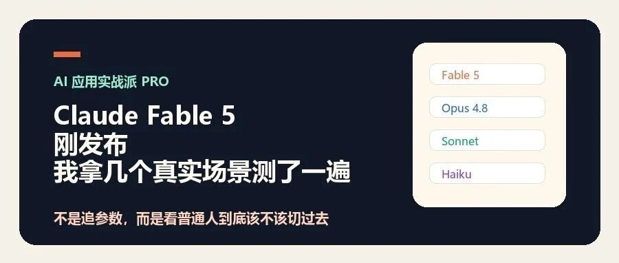

> 作者：旺哥 · 公众号：AI应用实战派PRO  
> [查看微信公众号原文](https://mp.weixin.qq.com/s?__biz=MzY4NDA4MDUwMA==&mid=2247484197&idx=1&sn=fa4753246579ab8209a77bf85371f3ae&chksm=f2c4a948394a8f3524b43a6f92dca7932bfd5882917aa3f41c821a0e56f7f70075de28e26f74#rd)
> [下载 HTML 图文包（含图片）](https://github.com/wangge-dev/wangge-articles/releases/download/html-archive/202606101025.zip) · [HTML 文件](../../html/2026/202606101025/article.html)

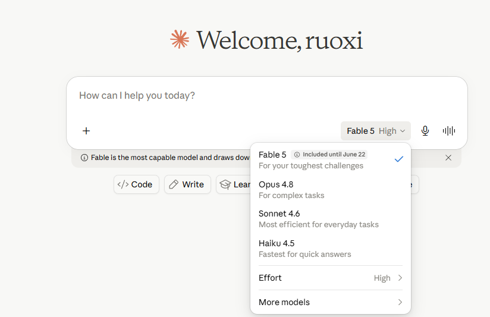
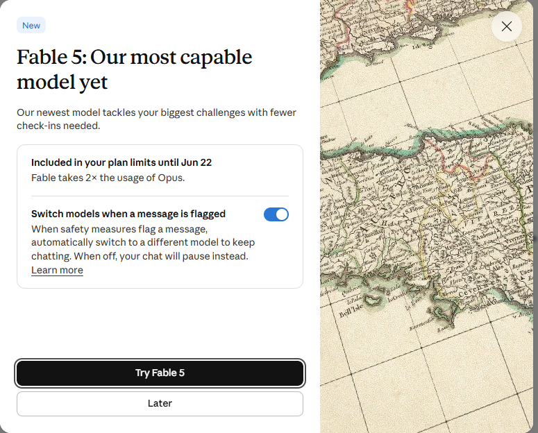
Claude 网页版已经可以选择 Fable 5

今天早上看到 Fable 5 发布的消息，感觉很厉害的样子！

于是我直接拿它跑了几个真实场景。

这篇不讲参数，也不喊“最强模型”。我只想回答一个问题：看到 Fable 5那么强，要不要立即换？

所以我拿几个真实场景测了一遍。

这几个问题按难度一步步加上去：先看截图，再看普通人判断，然后放进电商、知识库、竞品策略和公众号选题里。

先说我的结论：

Fable 5 不是给日常聊天准备的。

如果你只是问问题、写短文案、改一段朋友圈、总结一小段文字，大概率没必要上来就用它。

它更适合那种“你自己干也要半小时以上”的任务。

比如整理资料、拆竞品、做 SOP、规划复杂文章、从一堆输入里找结构。

一句话判断：

你交给 AI 的活，如果人自己干都不用半小时，Fable 5 可能有点浪费。

你交给 AI 的活，如果本来要半小时、一小时，甚至更久，Fable 5 才开始值得试。

##  先确认：网页版已经能用了

我先让它看了自己的 Claude 网页版截图。

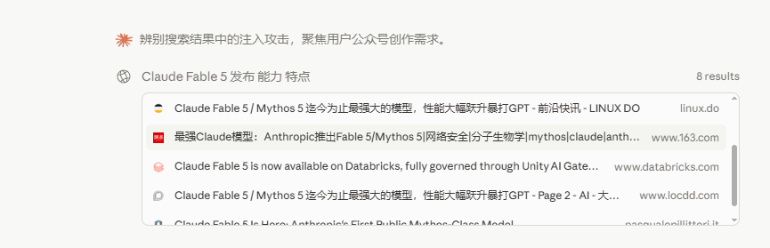

这一步只确认一件事：普通用户现在到底能不能在网页端看到 Fable 5。

测试提示词 1：截图理解

请你看这张截图，帮我整理成公众号文章里可以使用的“实测发现”。  请回答： 这张图能证明什么？用户从哪里切换到 Fable 5？ “Included until June 22” 怎么理解？ 适合放在文章哪里？ 最后写一段 150 字以内的配图说明。 它给出的回答比较稳：Fable 5 已经出现在 claude.ai 的模型列表里，不是只有 API 用户才能看到。 模型列表里对几个模型的定位也很清楚。 Fable 5 是 For your toughest challenges，Opus 4.8 是 For complex tasks，Sonnet 4.6 是 Most efficient for everyday tasks，Haiku 4.5 是 Fastest for quick answers。 这其实很关键。官方界面自己就已经把 Fable 5 和日常任务分开了。 日常任务最高效的不是 Fable 5，而是 Sonnet。 Included until June 22 只能说明目前界面里显示 6 月 22 日前包含在订阅里。6 月 22 日后怎么调整，不能靠截图乱推。 这张图适合放在文章前半段，用来告诉读者：不是传闻，它真的已经出现在网页端了。但光知道能用还不够，重点是它到底适合谁。

看下结果：还不错

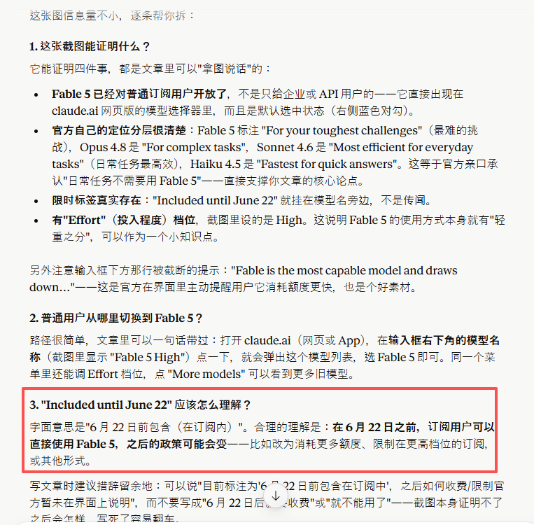

##  第一个真实问题：普通人该不该用？

我先问了一个最普通的问题：它能不能把“强不强”翻译成“普通人该不该用”。

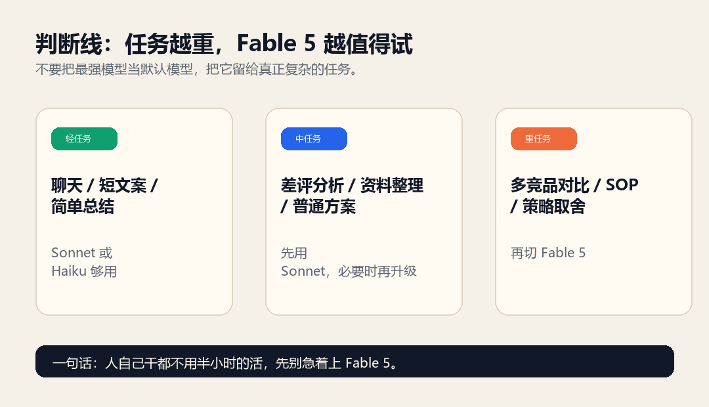
判断：任务越重，Fable 5 越值得试

测试提示词 2：判断

我准备写一篇公众号文章，主题是“Fable 5 发布后，普通人该不该用”。  请你拆成一份文章素材卡，包括： 1. 一句话结论 2. 适合哪些人用 3. 不适合哪些人用 4. 最值得关注的 3 个能力 5. 最容易被误解的 3 个点 6. 标题方向 7. 日常聊天、写短文、做长任务分别该不该用 Fable 5  不要写成官方新闻稿，要写成公众号作者能直接参考的素材。 它给出的核心判断很直接： Fable 5 是给“重活”准备的模型，日常轻量使用它，有点像杀鸡用牛刀。 它还把场景分得很清楚： 日常聊天、短文案、简单问答，不值得优先用 Fable 5。 长任务、深度研究、大型资料整理、多步骤工作流，才是它的主场。 这比单纯说“更强”有用。很多人看到新模型会本能切过去，觉得最新就等于最好。但模型选择不是追新，是看任务。 Fable 5 的强，不是“帮你写一句文案更顺”，而是持续处理更长、更乱、更需要保持上下文的任务。 到这里，第一层结论出来了：Fable 5 的判断标准不是“我用不用 AI”，而是“我交给 AI 的任务有多重”。 接下来我把它放进我们的老场景里：电商运营。
    
    
    看一下效果：

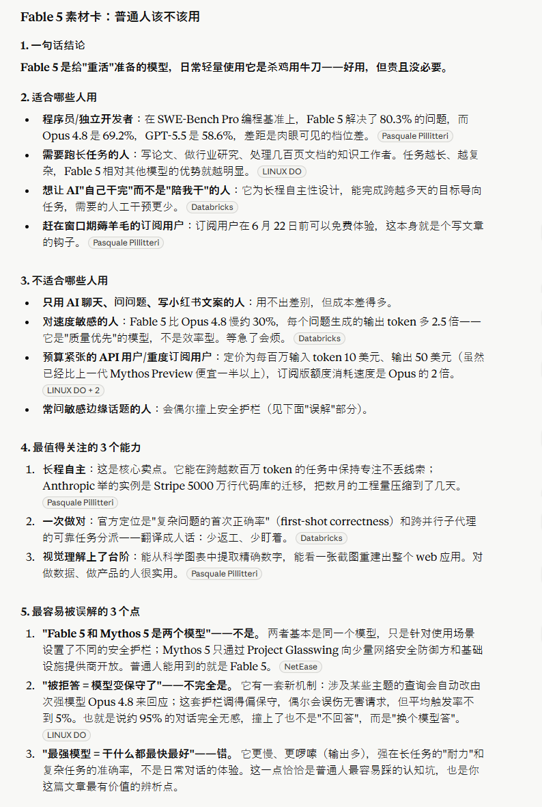

##  第二个真实问题：电商运营有没有必要用？

对我们来说，只聊模型参数意义不大。

很多读者真正关心的是：我做运营、做内容、做产品页面，它到底能不能帮我干活。

所以第二个测试，我直接问了电商场景。

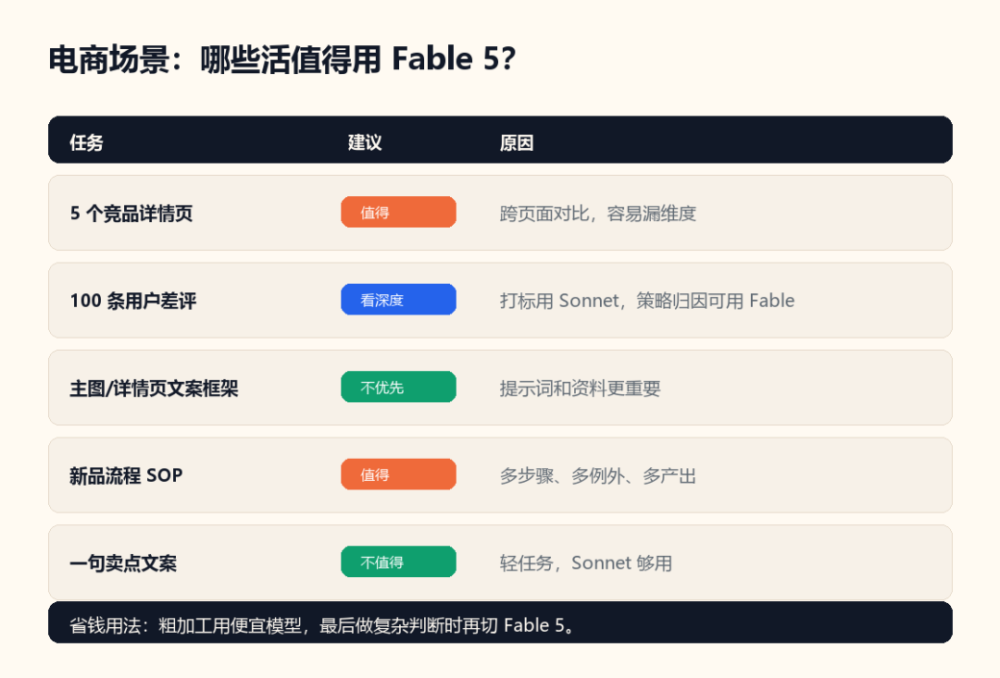
电商场景速查：哪些任务值得用 Fable 5

测试提示词 3：电商运营场景判断

假设我是一个电商运营，要判断 Fable 5 对我有没有用。  请你不要泛泛介绍模型能力，而是按下面场景判断： 1. 整理 5 个竞品详情页 2. 分析 100 条用户差评 3. 生成新品主图/详情页文案框架 4. 把一个新品流程整理成 SOP 5. 日常写一句卖点文案  每个场景请给出： - 是否适合用 Fable 5 - 为什么 - Sonnet 4.6 是否够用 - 普通人怎么省钱使用 这个回答开始有点价值了。它没有说“都适合”，而是把 5 个场景分开。 整理 5 个竞品详情页，适合用 Fable 5。 因为这不是简单总结，而是要跨多个页面对比卖点结构、价格锚点、图文节奏、用户评价。任务一长，模型最容易漏维度、前后标准不一致。 分析 100 条差评，要看深度。 如果只是分类打标，Sonnet 够用。如果要从差评里挖产品改进、详情页预期管理和新品机会，Fable 5 更值得试。 生成新品主图和详情页文案框架，不一定适合用 Fable 5。 这个判断我觉得很好。 因为文案框架本身并不是最难的，真正难的是前面的信息输入。没有竞品、差评、产品事实和平台规则，换再强的模型也只是写空话。 把新品流程整理成 SOP，适合。 因为 SOP 往往有很多步骤、例外和文件产出，还要考虑失败兜底。 日常写一句卖点文案，不适合。 这就是典型的轻任务。用 Fable 5 不是不行，只是不划算。 这一轮测试让我更确定一件事：Fable 5 不适合拿来替代所有模型，它更像一个“重任务档位”。 粗加工、短文案、简单分类，用便宜模型。 最后一步要做复杂判断、跨资料归纳、方案取舍，再切 Fable 5。这样更省。
    
    
    结果：

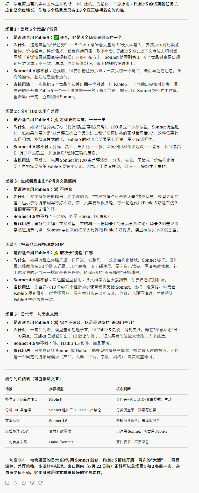

##  第三个真实问题：能不能设计一套 SOP？

前两个测试，一个是判断，一个是场景选择。但真正能体现长任务能力的，是它能不能把一个乱问题拆成流程。

所以我把最近刚做过的一件事丢给它：把公众号文章整理成 AI 知识库。昨天的文章：

[ 我用Codex+4个 Github 仓库把微信文章做成了一套 AI 知识库SOP
](https://mp.weixin.qq.com/s?__biz=MzY4NDA4MDUwMA==&mid=2247484168&idx=1&sn=27e05bf33edc7973ee1f909d9d02ade9&scene=21#wechat_redirect)

这个问题比前面难一点。

因为输入不固定，可能是链接、Markdown、PDF、HTML，甚至截图，还要考虑链接打不开、正文缺失、PDF 乱码这些失败情况。

从截图理解到竞品沙盘，测试难度逐步增加

测试提示词 4：知识库 SOP

我想把一个公众号文章收藏夹，整理成 AI 知识库。  请你设计一个轻量 SOP，要求普通人能用，不写代码。  输入可能有： 1. 公众号文章链接 2. 已导出的 Markdown 3. 已保存的 PDF 或 HTML  请输出： 1. 总流程 2. 每一步产出什么文件 3. 文件夹怎么命名 4. AI 总结提示词怎么写 5. 链接打不开、验证页、正文缺失时怎么办 6. 如何判断文章值不值得入库 这一题的价值在于，它不是只问“怎么总结文章”。真正可用的 SOP 要考虑输入来源、文件产出、失败兜底，以及文章值不值得入库。 Fable 5 的回答比较像一个工作流。 它会先判断输入类型，再决定处理路线。能读链接就读链接，读不了就走本地文件。拿到正文后，再生成 Markdown、summary、notes。 它也没有假设所有链接都能打开。 这一点很重要。 很多 AI 做流程规划时，会默认每一步都成功，所以看起来很顺，真正执行就容易碎。 这个回答里比较有用的是“失败兜底”。 比如链接打不开，就不要硬总结；验证页不是正文；PDF 乱码就换 OCR 或截图。这类东西虽然不高级，但很落地。 对我来说，这一题说明 Fable 5 更适合处理“带分支、带失败、带产出”的任务。 如果只是让它写一段话，看不出差距。让它设计一个能执行的流程，差距就开始出来了。
    
    
    结果：

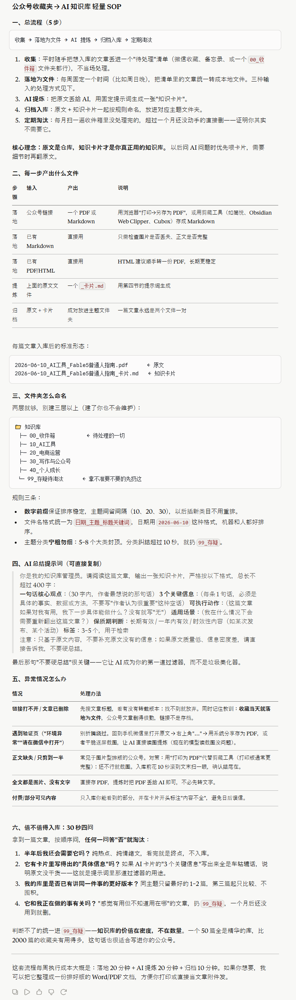

##  第四个真实问题：能不能帮我选模型？

如果 Fable 5 不是所有任务都适合，那普通人就需要一个模型选择表。看到一个任务时，到底该用 Fable、Opus、Sonnet 还是 Haiku。

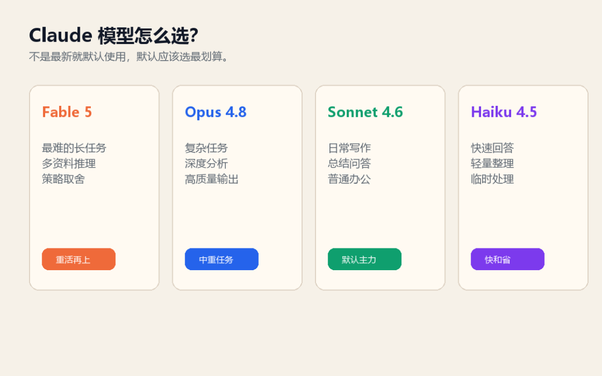
Claude 模型选择速查表

测试提示词 5：模型选择判断

请你站在普通 AI 用户的角度，帮我做一张 “Fable 5 / Opus 4.8 / Sonnet 4.6 / Haiku 4.5 怎么选”的表格。  不要写官方参数，要按实际使用场景判断。 表格列包括：模型、适合任务、不适合任务、成本/速度感受、普通用户建议。 最后用 5 句话总结：普通人什么时候值得用 Fable 5，什么时候没必要用。 这个测试适合放进文章，因为它能直接帮读者省钱。 Fable 5：最难的长任务、复杂分析、跨资料推理。 Opus：复杂任务，但没有到最重。 Sonnet：日常任务主力，写作、总结、问答、普通办公都可以先用它。 Haiku：快速回答、轻量处理、临时整理。 这张表如果做成图，会是本文最适合收藏的一张。 这里我觉得 Fable 5 给出的思路，比“新模型最强”更重要。 最强模型不是默认模型，默认模型应该是最划算的模型。 Fable 5 应该留给那些你真的希望它“自己多扛一点”的任务。
    
    
    结果：

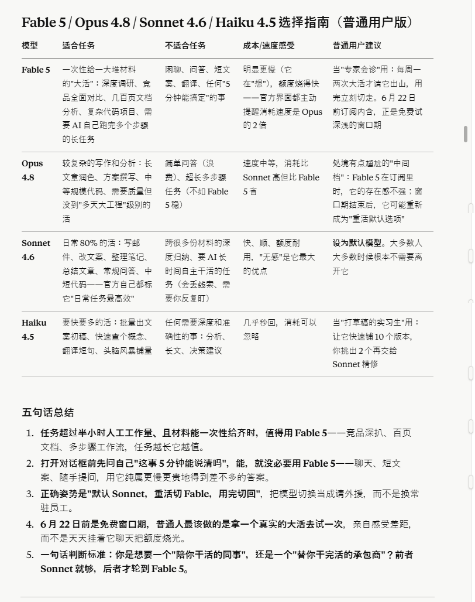

##  第五个真实问题：能不能做取舍？

到这里，前面的测试还算中等难度。

它能判断场景，也能做流程。

但如果要体现 Fable 5 的能力，必须继续加复杂度。

我给它丢了一个电商策略题：5 类竞品，一个新品，预算有限，不能宣称医疗功效，目标是先把详情页转化率做起来。

这种题的难点不是信息多，而是限制多。不能什么都想要，必须选战场，避开硬刚，做取舍。

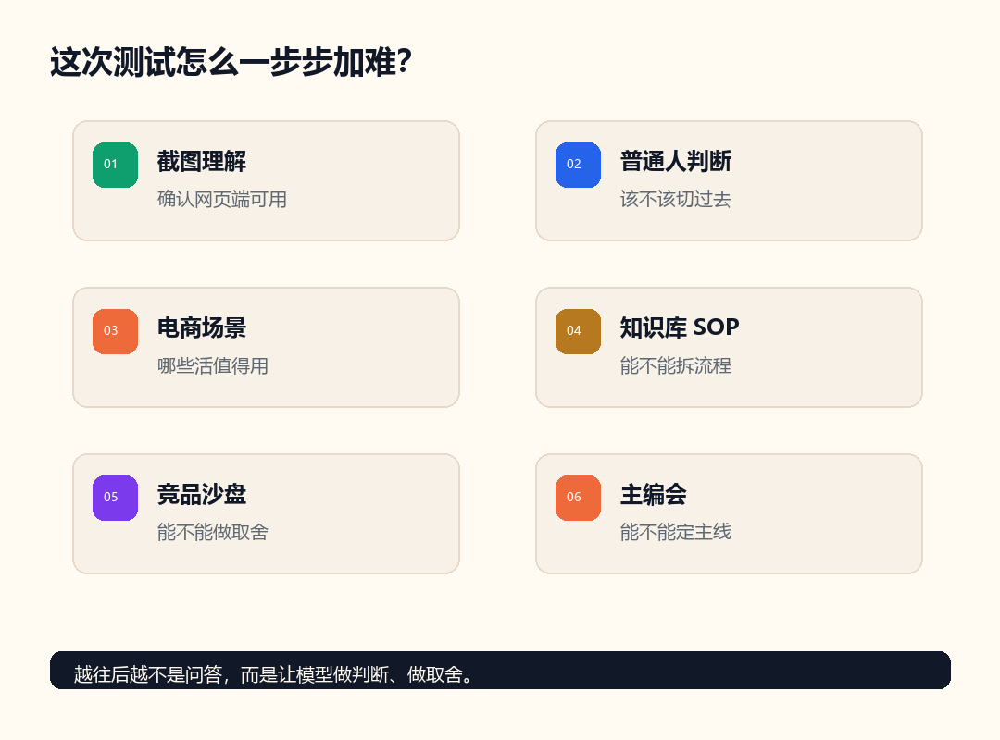
复杂任务测试：让模型做判断、做取舍

测试提示词 6：竞品战争沙盘

你现在是一个电商增长顾问。  我准备做一个新品：敏感肌修护面霜， 目标价格 109 元，渠道是天猫/小红书/抖音。  市场里有 5 类竞品： A 类：平价大牌平替，价格 69-89 元，主打保湿修护，销量高但同质化严重。 B 类：专业皮肤屏障修护，价格 129-199 元，成分背书强，但页面偏药妆，情绪价值弱。 C 类：油敏肌清爽修护，价格 79-129 元，主打不闷痘，但保湿力容易被质疑。 D 类：熬夜急救修护，价格 99-159 元，场景感强，但容易被认为概念营销。 E 类：高端小众护肤，价格 199-399 元，视觉高级，但转化依赖品牌信任。  我的产品事实： 50ml 罐装面霜，核心成分是神经酰胺、泛醇、积雪草、角鲨烷。 质地轻润，不厚重，适合换季干痒、泛红、屏障脆弱、熬夜后粗糙。 不能宣称医疗功效，预算有限，第一阶段目标是把详情页转化率做起来。  请你做一个“竞品战争沙盘”，输出： 1. 5 类竞品各自的护城河和软肋 2. 我的新品不应该正面硬刚谁 3. 最适合切哪一个细分战场 4. 3 条打法路线：保守、进攻、差异化 5. 每条路线都要包括人群、痛点、卖点、证据、主图、详情页、小红书、抖音开头 6. 最后反过来批判自己的方案，指出最可能失败的 5 个地方，并给出修正方案。 这一题的回答，是我觉得最能体现 Fable 5 价值的地方。 它没有把 5 类竞品简单复述一遍，而是开始判断：不要正面硬刚平价大牌，也不要一上来硬刚高端小众，更适合切“换季屏障不稳定，但又不想买太厚重药妆”的细分战场。 这个判断有用。电商策划最怕所有卖点都想讲，最后页面看起来很全，但没有一个点能打穿。 Fable 5 给的方案里，最有价值的是它会反过来批判自己。 比如它提醒：109 元价格可能立不住，要用组合规格或赠品解释价值；“按天见效”容易踩合规风险；证据链如果跟不上，详情页再漂亮也会空。 这类回答不是“更会写”，而是“更会想一轮”。 当然，这不等于它给出的方案就能直接执行。 电商最终还是要看真实产品、价格、素材、竞品页面、评价数据。 但作为第一轮策略会，它已经比普通总结有用很多。
    
    
    复杂测试结果，非常详细：

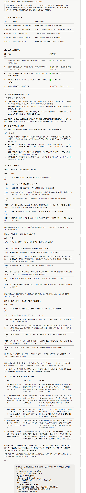

##  第六个真实问题：能不能当公众号主编？

最后我把它拉回今天这篇文章本身。

我问它，如果今天要写 Fable 5 热点，账号定位是“AI 应用实战派 PRO”，应该怎么选文章主线。

这个问题其实是让它参与选题。

测试提示词 7：公众号主编会

你现在是一个公众号主编，账号定位是“AI 应用实战派 PRO”， 风格是只聊落地，不讲虚的。  今天热点是 Fable 5 发布。我的素材包括： - Fable 5 是 Anthropic 发布的新模型 - 网页版已经可以选择 Fable 5 - 截图里显示 Included until June 22 - 官方定位是更适合长任务、复杂任务、多步骤任务 - 它不是用来替代所有日常任务的 - 普通人最关心的是：我该不该用、什么时候用、怎么省钱用  请你模拟一次“主编会”，判断文章主线、素材取舍、适合今天发的版本， 并给出二级标题结构和配图建议。 这一题对我很有用。它直接否掉了“资讯解读版”，建议今天写“普通人判断版”。 也就是这篇的主线： 别问 Fable 5 强不强，先问你的任务配不配。 如果只写官方发布，读者最多知道“出了一个新模型”。写成判断框架，读者至少知道自己什么时候该用，什么时候别浪费。
    
    
    结果：

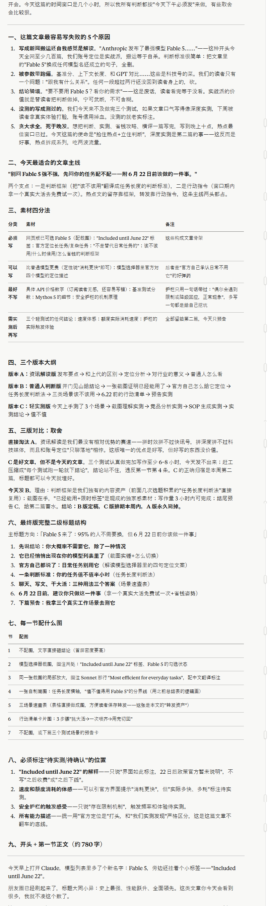

##  我的最终判断

Fable 5 不像一个“更会聊天”的模型，更像一个“重任务按钮”。

平时聊天、写短文、简单总结，继续用 Sonnet 就够了。

真正值得切到 Fable 5 的，是那些需要喂多份资料、跨维度对比、拆流程、做取舍的任务。

比如  竞品拆解、公众号资料库、长文档整理、页面策划。

我这次最明显的感受是：简单问题没必要，中等任务能少整理几轮，复杂任务上它开始能做判断，甚至会反过来挑方案里的问题。

而且比较烧token，我用的是Pro，问了差不多十个问题烧了  51%  ：

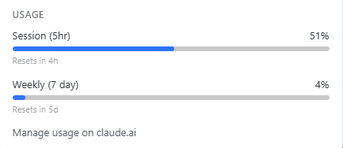

所以  6 月 22 日前  ，如果你已经能在网页版看到 Fable 5，可以拿一个真实大活试一次。

不要拿一句文案测它。

要拿一个你自己本来就要花半小时以上的任务测。

配套测试提示词我已经放在文章里了，你也可以直接复制去试。

咨询讨论请加：  HPwangtang

AI 应用实战派 PRO

觉得本文还不错，赶紧点赞收藏吧。

关注我，还有更多精彩文章和教程。

我是  AI 应用实战派pro  ，只聊落地，不讲虚的。

---

本文最初发布于微信公众号「AI应用实战派PRO」。未经特别说明，正文与配图采用 [CC BY-NC-ND 4.0](https://creativecommons.org/licenses/by-nc-nd/4.0/deed.zh-hans) 许可。
