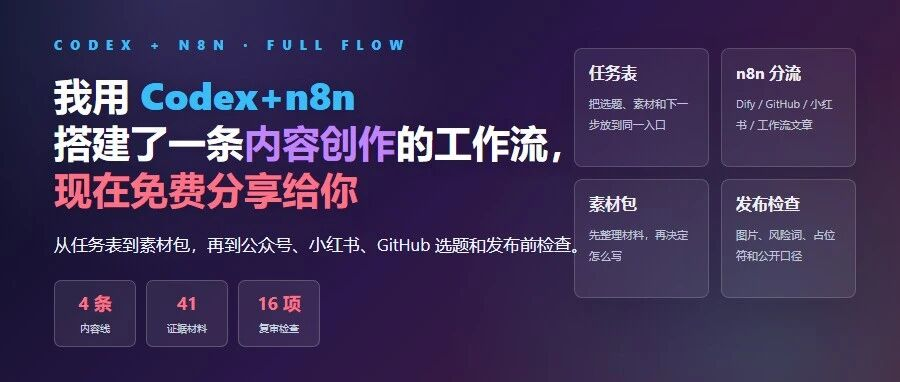
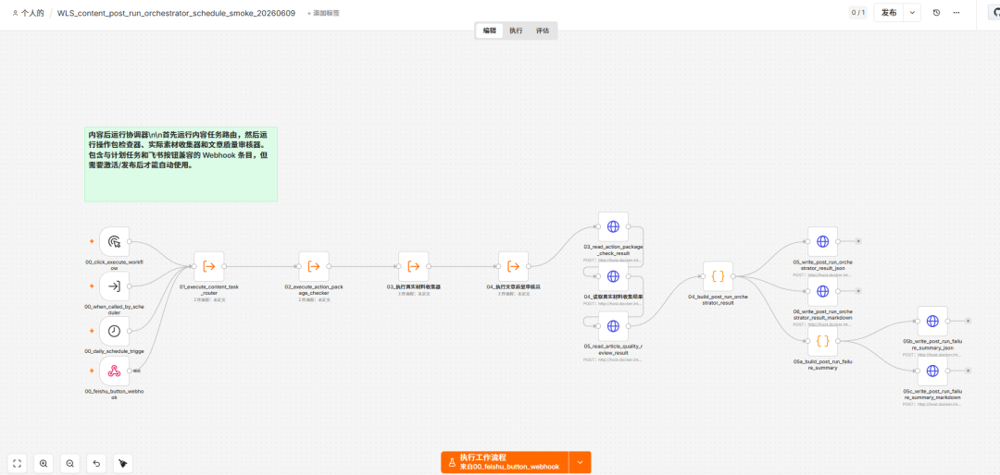
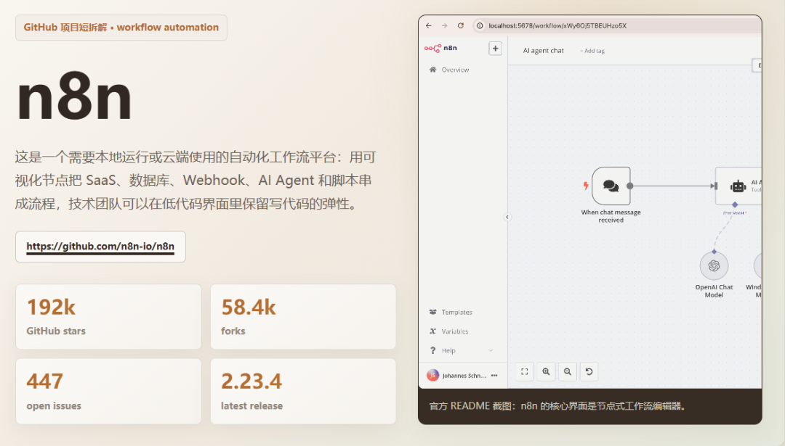
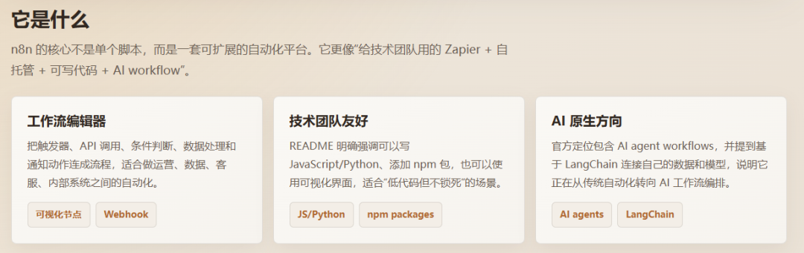
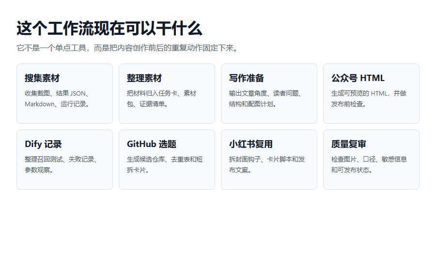
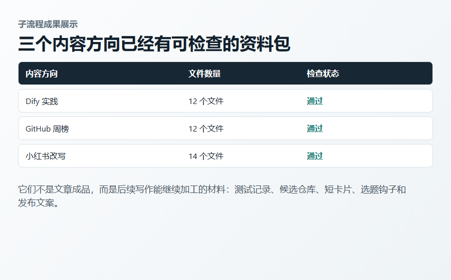
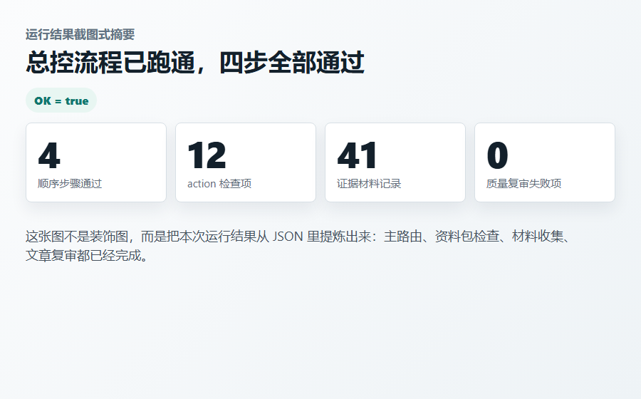
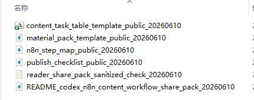
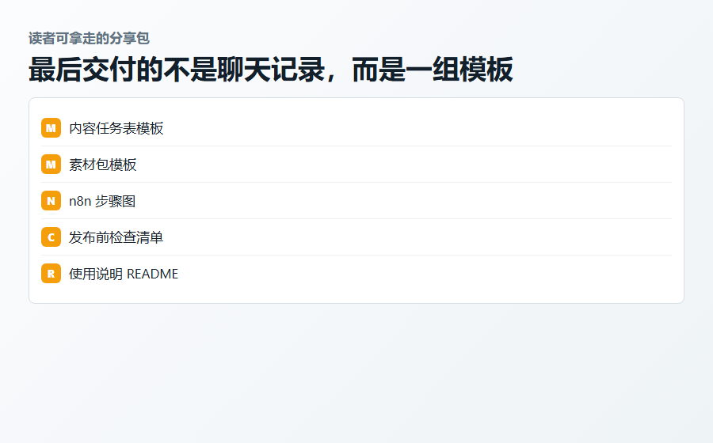

# 我用 Codex+n8n 搭建了一条内容创作工作流，现在免费分享给你。

> 作者：旺哥 · 公众号：AI应用实战派PRO  
> [查看微信公众号原文](https://mp.weixin.qq.com/s?__biz=MzY4NDA4MDUwMA==&mid=2247484229&idx=1&sn=4530a012f4943fdfa9f2b872fd4b2ec6&chksm=f2124f9f445229730379fe91b2d251fdc7d139b9d3794eccff4a534721e1e27da0ece822c99c#rd)
> [下载 HTML 图文包（含图片）](https://github.com/wangge-dev/wangge-articles/releases/download/html-archive/202606111706.zip) · [HTML 文件](../../html/2026/202606111706/article.html)

这次想补齐的不只是文章，而是一条从任务到素材、再到发布检查的内容工作流。

OPENING

##  内容创作完整链路跑一遍

内容创作，最容易乱的地方，往往不是正文。

更麻烦的是这些东西分散在不同地方：  选题记录、素材文件、截图、HTML、发布检查、数据回收  。

一两篇内容靠记忆还能撑住。但只要同时推进 Dify、GitHub、n8n、小红书复用、实战素材这些方向，光靠codex是不够的。

所以我这次先搭了一版很轻的内容任务流水线。  分享包在评论区

它不是完整内容中台，也不是一键生成文章。它更像一个内容项目整理台：先把任务放进一张表，再用 n8n 分流，最后让不同子流程生成对应的素材包。看一下最终流程：

##  先说清楚 n8n 是个啥（没用过的人先看这段）

可能有人看到这儿会卡一下：n8n 到底是什么？

简单说，n8n 就是一个把“  做完这一步、自动接着做下一步
”串起来的工具。和coze以及dify有点像。你在它的界面上拖几个方块、用线连起来，每个方块负责一件事——读一张表、判断一个状态、写一个文件、发一条消息。连完之后，这条线就能自己跑，不用你一步步手动点。

它的输入和输出也好理解。
输入通常是一个“触发”，比如表格里新增了一行、到了某个时间、收到一条消息；输出就是它按你连好的顺序，把后面几步自动做完，最后落一个结果——一个文件、一条记录、一份检查报告。

那它适合谁？说白了，适合那些你老是重复手动做、而且步骤相对固定的活。比如每次都要“看一下任务表、判断该走哪条流程、把材料归到对应文件夹”，这种你一个月要干几十遍的事，交给
n8n 最划算。

它不适合的，是那些一次性的、或者需要大量临场判断和创作的活。比如写文章、拆结构、想标题——这些变化太多，没法用一条固定的线连出来，那是
AI（在这套流程里就是 Codex）该干的。所以我这套流程才是 n8n 管“稳定的搬运和分流”，Codex 管“灵活的理解和创作”，两边各干各擅长的。

如果你也想试，第一步真不用想太大。先别急着连一长串，你就找出自己手上“老是重复的那两三步”，先连成一条最短的线，跑通了再往后加。我这次也是这么干的——先连一个主路由，能把任务分到对的方向，就算第一版了。

如果不懂n8n也不会搭建流程，那就让让codex负责搭建所有n8n流程完全也是可以，但是比较烧token！

##  第一步：先做一张内容任务表

我先用本地 JSON 模拟了一张任务表。后面如果要更方便，可以换成飞书表、多维表格或者其他在线表格。

这张表不用复杂，先有几个字段就够了。

任务表先保留 5 个字段

内容标题：这条内容大概是什么  
当前状态：是不是已经可以推进  
动作类型：它应该进入哪条子流程  
下一步：先做素材、截图、复审还是发布检查  
输出位置：结果要放在哪里

中文字段给人看，英文 key 给流程判断。这样做还有一个好处：n8n、Windows、命令行之间传文件时，中文路径和中文状态偶尔会出问题，英文 key
更稳。

##  第二步：n8n 主路由只负责分拣

主路由不直接处理内容。它只负责：这条任务现在该往哪里走？

这个设计很重要。如果一个流程既判断方向，又写文章，又做截图，又做发布检查，后面一定会越来越难维护。

所以主路由只负责读取任务、判断状态、分发方向，再把结果写出来。具体内容交给后面的子流程处理。

每个旁支都对应一种内容任务，不是所有工作都挤在主流程里。

##  每个旁支到底能干什么

这里要讲清楚，不然读者只会看到一张 n8n 图，却不知道每个分支有什么用。

现在已经拆出来的 6 类动作

工作流文章：整理流程、节点解释、HTML、截图计划、发布检查  
Dify 实践：整理召回测试、问题表、失败记录、素材卡  
GitHub 周榜：整理候选仓库、去重记录、短拆卡片  
小红书复用：整理封面钩子、卡片脚本、发布文案  
真实素材收集：把截图、JSON、Markdown、结果文件放进证据清单  
质量复审：检查公开口径、图片、占位符和发布风险

这套流程能做的事：搜集素材、整理素材、输出 HTML、小红书、GitHub 选题和质量复审。

##  第三步：子流程先产出素材包

这里是我觉得最实用的地方。

很多人搭自动化，容易一开始就想做最终结果。但实际做内容任务时，第一步更应该是把材料理清楚。

所以我让子流程先生成素材包，而不是直接进入最终交付。

Dify 实践先整理测试记录和问题表；GitHub 周榜先整理候选仓库、去重记录和短拆卡片；小红书复用先整理原文、封面钩子和卡片脚本  。

这些东西不是成稿，但它们会决定后面写得顺不顺、图能不能补上、发布前有没有东西可查。

三个内容方向都已经能产出可检查的资料包。

##  这次实际跑出来了什么

这次不是只画了一张流程图。总控流程已经跑完：先跑内容任务主路由，再跑资料包检查、真实材料收集和文章质量复审。

结果文件里能看到 4 步全部通过，资料包检查项 12 个，真实材料记录 41 条，质量复审失败项为 0。

这类结果比“流程看起来很完整”更重要。因为内容工作流最后要靠文件、截图和检查结果说话。

这张图来自本地运行结果文件，说明流程不是停在概念图。

##  Codex 在这里做什么

n8n 更适合做稳定动作：  触发、分流、读取文件、写结果、跑检查  。

Codex 更适合处理变化多的部分：读材料、拆结构、整理说明、改 HTML、生成检查脚本，再把一次实战沉淀成可复用的模板。

##  读者能拿走什么

我最后整理了一份公开分享包。里面不是项目交接文档，而是读者可以自己改的模板。

大家看到英文不用怕，直接把分享包丢给  codex或者Claude，workbuddy  就行了！

分享包里放这些

内容任务表模板  
素材包模板  
n8n 步骤图  
发布前检查清单  
README 使用说明

最后交付的不是聊天记录，而是一组可以继续改的模板。

##  如果你也想做，可以先从小版本开始

不要一开始就做大系统。

先做一张任务表，再做一个主路由，然后挑两三条最常用的子流程。

每条子流程先不要追求最终交付，先输出素材包。

当素材包稳定以后，再接截图、HTML、配图、发布检查。

这样做起来会轻很多，也更容易发现问题。

第一版不用追求完整。先让任务能被看见，先让流程能跑起来，先让每条内容知道自己下一步该去哪。

AI 应用实战派 PRO

觉得本文还不错，赶紧点赞收藏吧。

关注我，还有更多精彩文章和教程。

我是  AI 应用实战派pro  ，只聊落地，不讲虚的。

---

本文最初发布于微信公众号「AI应用实战派PRO」。未经特别说明，正文与配图采用 [CC BY-NC-ND 4.0](https://creativecommons.org/licenses/by-nc-nd/4.0/deed.zh-hans) 许可。
