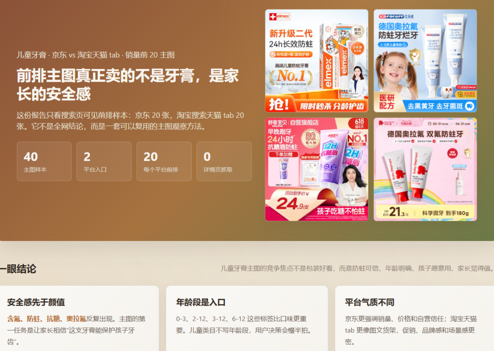
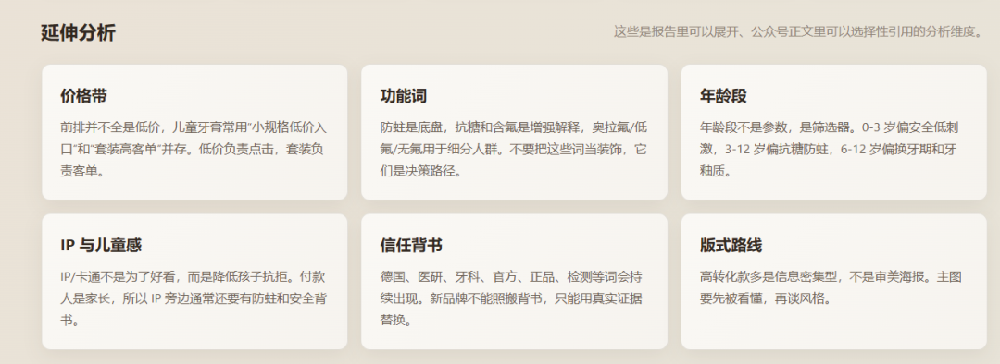
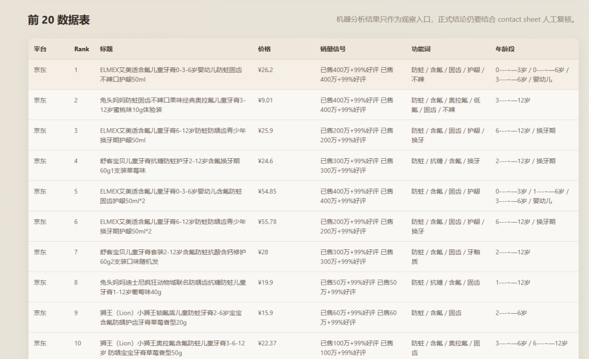
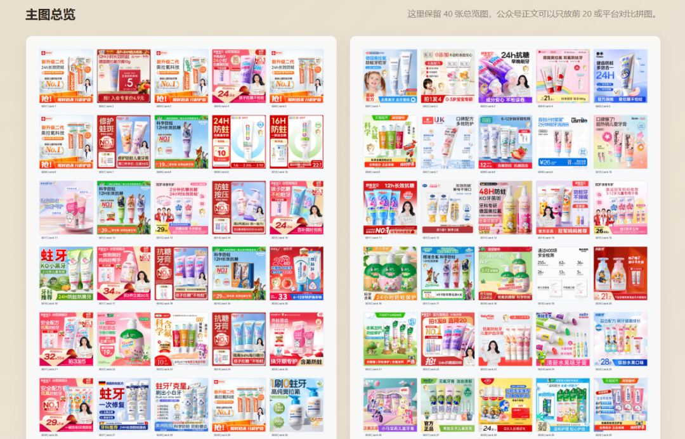
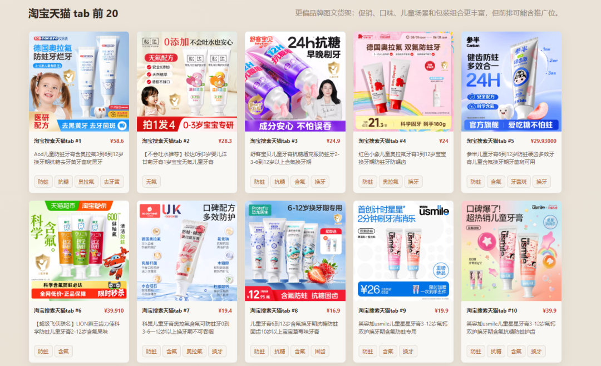
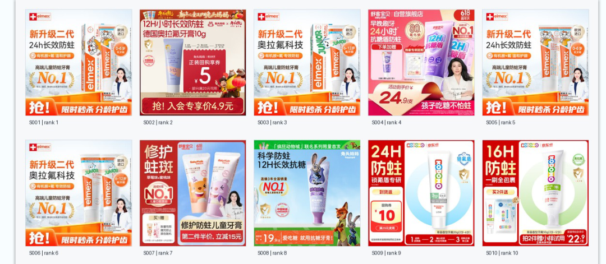

# 分享一个 AI+电商 skill：输入商品/类目自动输出爆款拆解报告以及爆款规律

> 作者：旺哥 · 公众号：AI应用实战派PRO  
> [查看微信公众号原文](https://mp.weixin.qq.com/s?__biz=MzY4NDA4MDUwMA==&mid=2247484242&idx=1&sn=302dab35e0403158529fa3a7d4267599&chksm=f2d6725b2b75bc2088596d57f3887731f7fbc21f2bc37f448b81768c21e83f22b133fb55acb4#rd)
> [下载 HTML 图文包（含图片）](https://github.com/wangge-dev/wangge-articles/releases/download/html-archive/202606121853.zip) · [HTML 文件](../../html/2026/202606121853/article.html)

MAIN IMAGE · SKILL

输入类目

自动输出  爆款拆解报告

儿童牙膏实测：京东 20 张 + 淘宝天猫 tab 20 张

2026.06.12 · REPORT NOTES

40 张  主图样本  2 个  采集平台  前 20  排序样本

今天给大家分享一个拆解爆款主图的 Skill。报告第一页截图（儿童牙膏）：

延伸分析（可以自己另外加角度分析以及自己的逻辑）：

还可以看价格带，功能词，年龄段：

还有京东和天猫的对比图：

以及主图前20（详细的主图会采集到本地，还可以做拆解竞品主图拆解分析）：

说下为什么要做这个。

主图拆解最有用的地方，是把前排商品的表达方式放到同一张桌面上：人群怎么写、功效怎么描述、怎么露出重点、证书怎么摆。

这对运营定方向、设计找参考、AI 出图写提示词，都有帮助。

拆爆款主图时主要看三件事。

1  前排商品反复强调什么卖点。

2  卖点用什么画面证明。

3  哪些表达已经成了类目里的常见写法。

做完这一步，运营能更快判断这个类目该主推什么信息；设计拿到的不是零散截图，而是一组带排名和标题的参考；后面写 AI 出图提示词，也能少一些空泛描述。

以前这些样本要自己打开平台慢慢截。这次我把采集、下载、编号、表格、报告打包成一个 Skill，后面换类目就能继续跑。

这次我用「儿童牙膏」测试了一轮。给 Codex 一个类目，它会去采集前排商品主图，再整理成一份可以直接打开看的拆解报告。

这次分享包里有  40 张主图  ：京东 20 张，淘宝搜索里的天猫 tab 20 张。一起放进去的还有 HTML 报告、CSV 表、JSON
数据、主图拼图和 README 说明。

评论区会放这次的分享包  。拿到后，先打开  report.html  ，大概就知道这个 Skill 能产出什么。

01

##  这次采了什么

这次的采集口径比较简单：儿童牙膏，京东和淘宝搜索天猫 tab，每个平台取当前可见前 20。看一下我自己搜索的京东的前20儿童牙膏的销量排序：

如果你想按综合排序看，也可以直接跟 Codex 说。想按销量排序，就把排序口径说清楚。想换类目，把「儿童牙膏」换成自己的类目就行。

02

##  分享包里有什么

report.html  是直接看的报告。

top20_combined.csv  是商品表，里面有平台、排名、标题、价格、链接和本地主图路径。

images  文件夹里是下载好的主图，按平台和排名编号。

assets  里有主图拼图，适合快速扫一眼样本有没有跑偏。

README.md  里放采集口径、容易卡住的地方和处理办法。

03

##  和人工看到的差多少

我自己也按相同关键词去平台上看了一下，和 Skill 采集出来的前排样本大体能对上。

这里不用追求 100%
一模一样。平台排序会受地区、账号状态、广告位和实时变化影响，所以报告里写的是「当前可见顺序」。只要样本方向对，后面做主图拆解就够用了。

再看一下codex自己用脚本采集（脚本也在分享包里）：

差距不大吧，采集效果还是不错。。

报告里还会把前排主图做一层拆解。比如儿童牙膏这次，前排主图里反复出现的是年龄段、防蛀、含氟、换牙期、儿童口味这些表达。

这篇先不展开儿童牙膏本身。今天分享的是这个 Skill 和分享包，类目分析可以自己打开报告看，图片放在一起会更直观。

04

##  拿到包以后怎么用

先看  report.html  ，确认最终报告长什么样。

再看  assets  里的主图拼图，确认样本方向。

需要二次分析时，再打开  data/top20_combined.csv  。

最后把  README.md  给 Codex 或其他 Agent 看一遍，再让它跑自己的类目。

README 里已经写了这次遇到的问题，比如京东直连搜索页容易被挡、阿里图片链接后缀要处理、淘宝天猫 tab 前排可能有推广位、PowerShell 读中文
JSON 可能乱码。文章里不展开这些，放在 README 里更适合复现。

你可以这样给 Codex 下指令：

帮我按销量排序采集京东和淘宝天猫 tab 的儿童牙刷前 20 主图，并按这个分享包格式输出报告。

帮我采集猫砂这个类目，先只要前 20，输出主图、CSV、contact sheet 和 HTML 拆解报告。

第一次建议先跑具体类目。关键词越具体，报告越容易检查，后面也更好改成自己的工作流。

05

##  适合怎么用

后面我会优先把它用在三个地方：选题前先扫一遍类目，给设计整理一组带编号的参考图，做 AI 出图时把前排图当成提示词参考和反例素材。

写公众号、小红书或者内部报告时，也可以直接带上一组真实样本，不用空口讲「爆款主图规律」。

这次先分享到这里。后面如果继续稳定，我会再拿几个类目跑一轮，把主图拆解、详情页拆解、AI 出图提示词这些流程继续往后接。

咨询讨论请加：  HPwangtang

AI 应用实战派 PRO

觉得本文还不错，赶紧点赞收藏吧。

关注我，还有更多精彩文章和教程。

我是  AI 应用实战派pro  ，只聊落地，不讲虚的。

---

本文最初发布于微信公众号「AI应用实战派PRO」。未经特别说明，正文与配图采用 [CC BY-NC-ND 4.0](https://creativecommons.org/licenses/by-nc-nd/4.0/deed.zh-hans) 许可。
