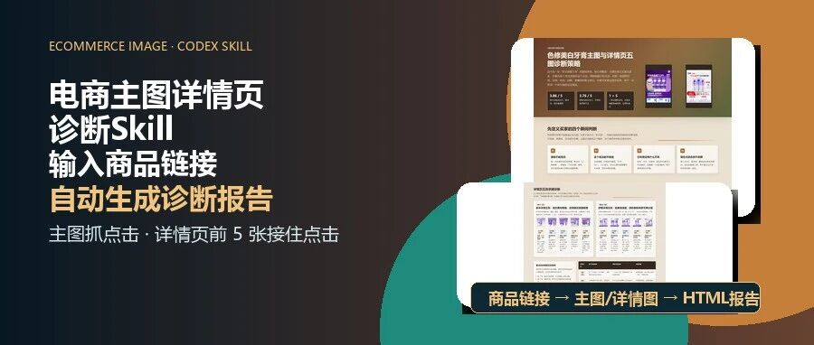

# 电商主图详情页诊断Skill :输入商品链接自动生成主图详情页诊断报告

> 作者：旺哥 · 公众号：AI应用实战派PRO  
> [查看微信公众号原文](https://mp.weixin.qq.com/s?__biz=MzY4NDA4MDUwMA==&mid=2247484273&idx=1&sn=af96ded2f1f505e20a120e88c08492e1&chksm=f23ae7967cfb34b1908874ce3d57f22a03fc611cf5cf5ad688e06c9d983c601193d2a5151648#rd)

ECOMMERCE IMAGE · CODEX SKILL

电商主图详情页诊断Skill

输入商品链接  
自动生成诊断报告

主图抓点击，详情页前 5 张接住点击

1 + 5  主图+详情  2 种  输入入口  HTML  诊断报告

今天给大家分享一个我刚整理好的电商诊断 Skill：

ecom-main-image-diagnosis

给它商品主图、商品链接、搜索结果截图，或者一组详情页图片，它会把这些素材整理成一份可读的诊断报告。

它会把图片拆成两个动作：第一眼为什么点，点进去以后靠什么继续看。

这次我把它升级成了“主图 + 详情页前 5
张”的联合诊断。很多主图的问题，表面上是信息太挤，实际上是主图和详情页没有分工。主图拼命塞功效、价格、榜单、赠品、套餐，详情页前几张又继续重复促销，结果买家看见很多字，却没有看完的耐心。

01

##  先看结果

这次样例用的是两款天猫色修美白牙膏。  生成的报告是ai做的诊断，大家可以自行加入自己品类的诊断逻辑！  报告里最核心的判断是一个“1 + 5”结构：

一张主图负责抓点击，五张详情图负责承接结果、证明和成交。

主图保留结果、可信线索、成交钩子；详情页前 5 张再往下接结果确认、机制解释、证明来源、套餐选择和场景补充。

02

##  为什么要把详情页也放进来

单看主图，很容易给出一句“简化一点”。这句话帮助不大。

真正要判断的是：被删掉的信息，后面有没有地方接住。

如果主图去掉榜单、功效数字、检测来源，但详情页前 5 张也没有把这些证据讲清楚，那主图不是简化，是丢证据。

如果主图去掉套餐、赠品、第三支 0 元，但详情页前 5 张没有把买哪组讲明白，那就是不合格了。

所以这版 Skill 不只看第一张图，它会把主图和详情页前 5 张放在一个报告里看。

主图负责点击判断，详情页负责继续说服。

03

##  样例里的两处差异

这次两款牙膏，只保留两个观察。下面是ai的分析（你可以给ai你的分析逻辑）：

参半的问题不是卖点少，而是促销信息太靠前。囤货、赠品、口味组合都很强，但“以紫修黄”“3 天美白”“271%”这些信息，需要更清楚的机制和来源承接。

舒客的问题是结果清楚，机制偏薄。“7 天白 4 度”容易记住，“R°4 冷光科技”如果只停留在名词，买家不一定知道它为什么可信。

所以参半更适合把“以紫修黄”的机制前置，舒客更适合把“7 天白 4
度”的结果稳住，再补一张冷光机制图。牙膏本身不是重点，重点是这份报告会把每张图的任务拆出来。

04

##  报告主要看什么

主图部分看六个缺口：

  * 识别缺口：一眼能不能知道是什么产品。 
  * 利益缺口：买家能不能看到明确结果。 
  * 信任缺口：强功效、榜单、检测有没有可读来源。 
  * 差异缺口：和旁边竞品有没有记忆点。 
  * 焦点缺口：产品、标题、价格、赠品谁在抢第一视觉。 
  * 平台缺口：这张图适不适合淘宝、天猫、京东、拼多多、抖音或小红书场景。 

详情页前 5 张看承接链：

  * 主图讲了什么，详情第 1 张有没有接住。 
  * 机制是不是被画出来了。 
  * 证明是不是能被看清，而不是变成小角标。 
  * 套餐是不是帮助选择，而不是连续堆促销。 
  * 场景、口味、人群是不是在合适的位置补充，而不是提前分散主线。 

05

##  读者拿到后怎么用

这版 Skill 保留两种入口。

入口  |  适合场景   
---|---  
商品链接  |  能公开访问的商品页。尝试抓取主图和详情页素材，再生成报告。遇到登录、验证码、风控或空壳页面时，标记为阻塞。   
自己提供素材  |  平台限制较强，或手里已有素材包。提供主图 1-5 张、详情页前 5 张、标题、价格带、平台和声明来源即可。   
  
第二种方式更稳。电商平台页面随时可能被登录、风控、动态加载挡住，但图片素材本身只要给到，诊断逻辑就能继续跑。

06

##  分享包里会放什么

分享包说明不用写成文件树。正文里只保留读者会用到的几样：

  * Skill：  ecom-main-image-diagnosis  。 
  * 样例报告：一份主图 + 详情页前 5 张的 HTML 诊断报告。 
  * README：告诉 Agent 先读什么、怎么跑、遇到阻塞怎么处理。 
  * 验证记录：说明图片加载、移动端预览、Skill 校验都过了。 

分享包还是放在了评论区，过两天我会整合在一起，敬请期待！

怎么用？  收到分享包后，给到agent那直接把分享包丢给agent就行（Claude，各种龙虾，workbuddy这种）

07

##  哪些事需要人工复核

这个 Skill 不做实时监控。

销量、排名这些结果，不能靠一份视觉报告直接推出。

它不能凭空证明“销量第一”“第三方检测”“专利技术”这些说法。凡是涉及功效、榜单、销量、专利、检测和平台规则的内容，都需要运营或品牌方自己提供来源，再人工复核。

这份报告适合放在改图前。先把主图和详情页放回买家的阅读顺序里，再决定哪条信息出现在哪一张图，下一版只测一个变量。

咨询讨论请加：  HPwangtang

AI 应用实战派 PRO

觉得本文还不错，赶紧点赞收藏吧。

关注我，还有更多精彩文章和教程。

我是  AI 应用实战派pro  ，只聊落地，不讲虚的。

---

本文最初发布于微信公众号「AI应用实战派PRO」。未经特别说明，正文与配图采用 [CC BY-NC-ND 4.0](https://creativecommons.org/licenses/by-nc-nd/4.0/deed.zh-hans) 许可。
