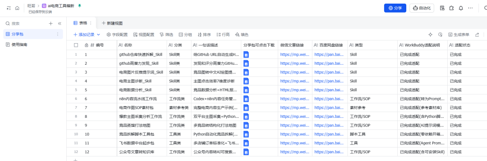
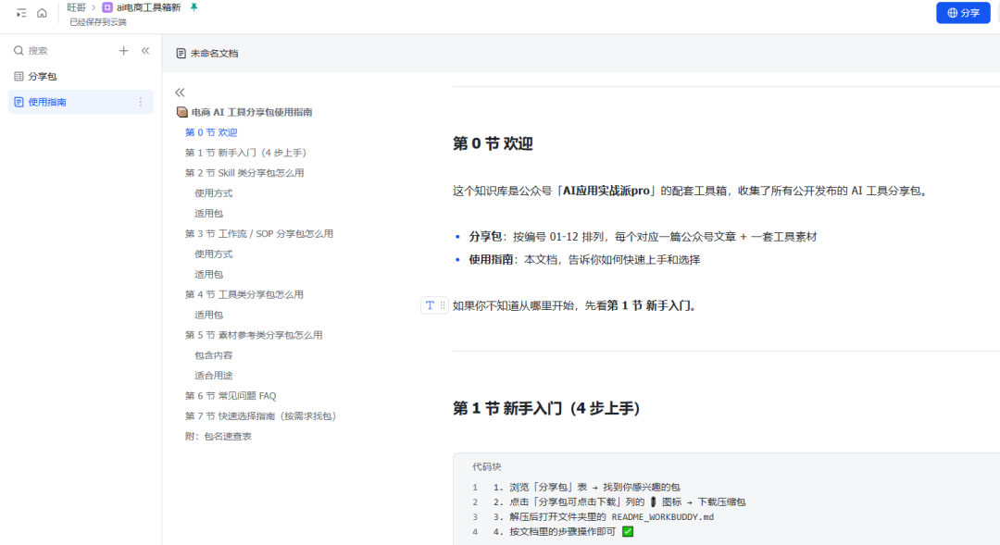
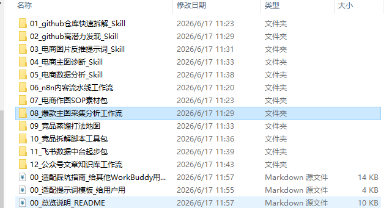
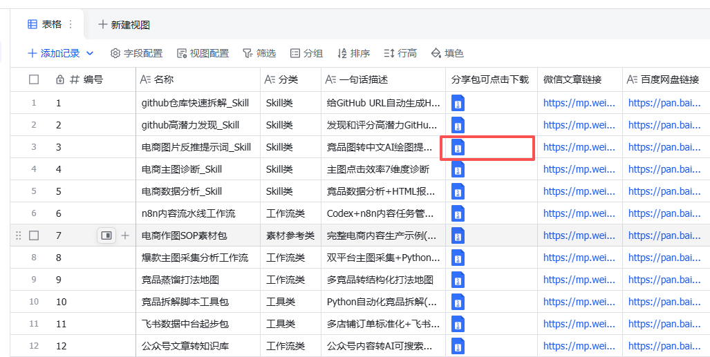
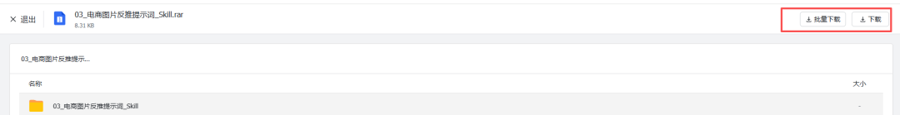

# 粉丝必看：Codex分享包的网址变更以及给Workbuddy适配的分享包

> 作者：旺哥 · 公众号：AI应用实战派PRO  
> [查看微信公众号原文](https://mp.weixin.qq.com/s?__biz=MzY4NDA4MDUwMA==&mid=2247484284&idx=1&sn=2a84530427faeec8df0704db2a011080&chksm=f2dcffa16a5d6c90d93c728fa255394b6e46330ef1dcb6e5a4fdfde8750965b2d7e79192064d#rd)
> [下载 HTML 图文包（含图片）](https://github.com/wangge-dev/wangge-articles/releases/download/html-archive/202606171800.zip) · [HTML 文件](../../html/2026/202606171800/article.html)

SHARE UPDATE · WORKBUDDY

#  Codex 分享包  
领取入口改了  
WorkBuddy 版也补上了

统一入口下载，Codex / WorkBuddy 两份按需使用

2026.06.17 · PROMPT NOTES

1 个入口  长期更新  2 个版本  Codex + WB  已适配  跑过一轮

OPENING

##  这次不是重新发一遍，而是把入口和版本整理清楚

这两天有读者反馈，说之前分享包放在百度网盘里，每次找链接、输提取码、翻历史文章，有点麻烦。

所以这次我把分享包重新整理了一下。以后会尽量放到一个统一页面里，大家打开一个链接，就能看到目前已经整理好的分享包。

长期更新入口

https://my.feishu.cn/wiki/DJMRwTyK2ifkkmk5FHPcZeP3nwc?table=tbl1SvuqTb3Vmeq4&view=vew95iuRuH

里面的分享包可以直接下载。之前的百度网盘链接还会保留，不会突然删掉。只是后面新发的内容，我会优先放到这个统一页面里，省得大家到处翻。

##  这次为什么加 WorkBuddy 版

之前很多分享包是按 Codex 的使用方式整理的。

但最近不少读者反馈，Codex 对新手不太友好。有些人卡在注册登录，有些人卡在安装，有些人一直遇到验证码。工具还没开始用，第一步就被劝退了。

所以这次我让 WorkBuddy 做了一轮评估和适配，把之前的分享包重新整理了一版 WorkBuddy 用法。

Codex 版还在，适合已经能正常使用 Codex 的读者。

WorkBuddy 版会补上，适合想先跑起来、少折腾一点的读者。

后面新的分享包，我都会尽量放两份，大家按需使用。

WorkBuddy 是国产工具，不需要梯子，每天也有赠送额度。对新手来说，它的第一步门槛会低很多。  强烈建议使用。如果不想折腾codex！

我已经把之前的分享包全部做了一轮 WorkBuddy 适配，并且跑过一轮验证。不是只改了文件名，也不是只写了说明。

我实在是太宠粉了哈哈哈。

##  目前怎么用

打开上面的飞书页面后，找到你想要的分享包。

如果你已经会用 Codex，就下载 Codex 版。

如果你现在还卡在账号、验证码、安装这些问题上，就先下载 WorkBuddy 版。

每个分享包里我会尽量写清楚：适合什么任务、第一步怎么用、提示词怎么复制、跑不通时先检查哪里、哪些结果需要人工复核。

后面这个飞书页面会作为长期更新入口。旧文章里的百度网盘链接也会保留，大家不用担心之前的链接突然失效。

##  Codex 常见问题

Q：  Codex 如何注册安装？

A：  可以先看我之前写过的文章： [ Codex 极简安装教程：：从 0 到 1 跑通 Codex
](https://mp.weixin.qq.com/s?__biz=MzY4NDA4MDUwMA==&mid=2247484243&idx=1&sn=ff0f8ce9e483bf0cad469c87f362b225&scene=21#wechat_redirect)
，里面把注册、安装和基础使用写过一遍了。

Q：  Windows 商店的 Codex 无法安装怎么办？

A：  可以走 GitHub Releases。打开 https://github.com/openai/codex/releases ，找到最新版，下载
Windows 对应的独立 exe 文件，一般文件名类似 codex-x86_64-pc-windows-msvc.exe。这个版本不依赖 Windows
商店，下载后双击本地安装就行。缺点也很明显：GitHub 国内下载速度可能很慢，必要时需要自己想办法加速。

Q：  Codex 一直遇到验证码怎么解决？

A：  可以优先开 Plus / Pro
会员。我这边的经验是，开了会员后，验证码问题会少很多，使用会稳定一些。这里不写成绝对保证，因为不同账号、网络环境、登录状态都可能影响验证频率。

Q：  怎么购买会员？

A：  可以自己到官方渠道购买。如果你实在搞不定，也有人会走闲鱼，或者用类似 https://bewild.ai/subscribe
这样的页面。这类渠道大家自己判断风险，我不替任何第三方渠道背书。

Q：  新手更推荐先用 Codex，还是先用 WorkBuddy？

A：  新手我更推荐先用 WorkBuddy。原因很简单：国产工具，不需要梯子，每天有赠送额度，安装和登录门槛低一些。等你把分享包的逻辑跑明白了，再折腾
Codex 也不迟。

Q：  WorkBuddy 版分享包现在适配到什么程度？

A：  已经跑过一轮验证。不是只把 Codex 里的提示词复制过去，而是按 WorkBuddy 的使用方式重新整理了一遍。

Q：  后面所有分享包都会有两个版本吗？

A：  会。后面我尽量都放 Codex 版和 WorkBuddy 版。你能用哪个，就先用哪个。不要为了工具本身卡太久，先把结果跑出来更重要。

Q：  飞书页面会长期更新吗？百度网盘还保留吗？

A：  飞书页面会作为长期入口。旧的百度网盘也会保留。后面如果链接变动，我也会优先在飞书页面里更新。

Q：  如果下载后跑不通，评论区需要反馈什么？

A：  最少给两个信息：你用的是 Codex 还是 WorkBuddy，以及报错截图。如果方便，再补一句你用的是 Windows 还是
Mac。这样我才好判断是工具问题、路径问题、权限问题，还是提示词没适配好。

##  最后

这次统一页面先放出来，大家可以先试。

如果哪个分享包下载不了，或者 WorkBuddy 版跑不通，可以在评论区告诉我。我会按反馈继续补。

如果大家对 WorkBuddy 教程有兴趣，也可以留言。

人多的话，我后面单独写一篇，从安装、跑第一个任务、导入分享包，到怎么改提示词，尽量写成能跟着做的版本。

咨询讨论请加：  HPwangtang

AI 应用实战派 PRO

觉得本文还不错，赶紧点赞收藏吧。

关注我，还有更多精彩文章和教程。

我是 AI 应用实战派pro，只聊落地，不讲虚的。

---

本文最初发布于微信公众号「AI应用实战派PRO」。未经特别说明，正文与配图采用 [CC BY-NC-ND 4.0](https://creativecommons.org/licenses/by-nc-nd/4.0/deed.zh-hans) 许可。
