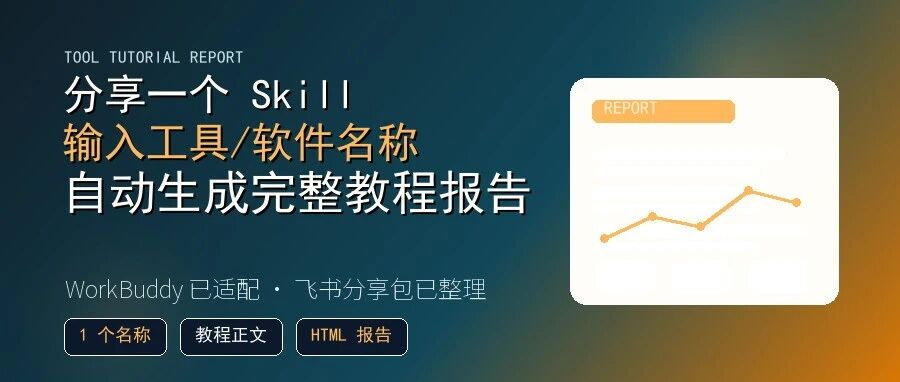

# 分享一个 Skill :输入工具/软件名称自动生成完整教程报告

> 作者：旺哥 · 公众号：AI应用实战派PRO  
> [查看微信公众号原文](https://mp.weixin.qq.com/s?__biz=MzY4NDA4MDUwMA==&mid=2247484296&idx=1&sn=6e33e22d7049531ab847aaffe804d642&chksm=f2799a325757957948920d3941a1cd6a3fd1fee97019fe77f5a91e85f677839936533e6fe965#rd)

SKILL SHARE · TOOL REPORT

分享一个 Skill

输入工具/软件名称

自动生成完整教程报告

从找资料、搭目录到 Markdown 和 HTML 报告，先用 WorkBuddy 跑了一遍。

1 个名称  作为入口  |  2 份产物  教程 + 报告  |  已适配  WorkBuddy   
---|---|---  
  
OPENING

找教程这件事，比看教程更耗时间

平时想学一个新工具，最花时间的地方往往在找教程。

公众号、百度、或者知乎、B 站、小红书都翻一圈，

为了解决这个耗时耗力的事情，所以今天分享一个工具教程写作 Skill。  这样新的ai工具

出来，大家可以自己先出一版教程看看，而不用等大V的教程了。

输入一个工具或软件名称，比如 WorkBuddy、Coze、Dify、它会按固定流程整理公开资

料，生成一份中文完整教程，并同步输出一份可以直接打开的 HTML 教程报告。

我这次用 WorkBuddy 跑了一遍，已经生成了 Markdown 教程和 HTML 报告。

成果预览

这个 Skill 解决什么问题

流程图：从工具名到完整教程报告

输入工具名  |  整理公开资料  |  核对关键事实   
---|---|---  
填入教程骨架  |  生成 Markdown  |  输出 HTML 报告   
  
这个 Skill 先把教程写作拆成几件固定动作：多平台找资料、生成教程骨架、整理事实来源、输出教程正文、生成 HTML 报告。可以自己调整搜索权重。

这样做的好处是，下次换一个产品，不用重新想目录，也不用每次都提醒 AI 该查哪里、该写哪些章节。

WorkBuddy 示例里有什么

WorkBuddy 这个例子比较适合测试，因为它有比较完整的工具链。

它涉及下载安装到、模型配置、Skills、微信助理、自动化任务，刚好能看出一份教程是否完整。

这次生成的教程里，主线是：先认识 WorkBuddy 是什么，再看账号和
Credits，然后安装客户端，进入主界面，创建第一个任务，再继续讲模型配置、Skills、微信助理和自动化。

读者看到的不只是一堆功能介绍，还能顺着教程完成一次最小上手。

截图位

拿到后怎么用

用法尽量简单。

先把 Skill 文件夹放到你的 Agent 技能目录里，再让 Agent 读 README。README 里写了输入参数、搜索权重、教程骨架和 HTML
报告生成方式。

然后给一个产品名：

/beginner-tutorial-writer product_name=WorkBuddy vendor=腾讯

如果只是试跑，可以先选公开资料多一点的产品，比如 WorkBuddy、Coze、Dify。

生成后重点检查三类内容：官网入口、价格套餐、功能截图。这些内容变化快，正式发布前最好再回到官方页面确认一次。

对比图：旧办法和 Skill 的差别

手工写教程  |  Skill 生成报告   
---|---  
到处翻教程，来源容易散  |  按来源权重整理公开资料   
每次重新想目录  |  固定教程骨架，少漏步骤   
写完还要单独排版  |  同步生成 HTML 教程报告   
  
分享包里有什么

分享包里除了提示词，还包含一套完整的教程生成材料。

里面包含 Skill 主文件、教程骨架、搜索配置、HTML 报告生成脚本，以及这次 WorkBuddy 完整教程。

读者拿到后，不需要先研究一堆技术细节。最稳的做法是：  先看 README，再换成自己想写的产品名称，跑出第一版教程  。

适合什么场景

如果你经常写 AI 工具教程，或者公司里需要给同事做内部上手文档，这个 Skill 会比较顺手。

它也适合已经在用 Codex、Claude Code 或其他 Agent 的人。与其每次临时写提示词，不如把常用写作流程做成 Skill。

这次给到的重点，是一个可以反复换产品名的教程生成流程。

分享入口

这次分享我放在飞书上，也做了 WorkBuddy 的适配：

https://my.feishu.cn/wiki/DJMRwTyK2ifkkmk5FHPcZeP3nwc?table=tbl1SvuqTb3Vmeq4&view=vew95iuRuH

百度网盘我也准备了一份。如果不嫌麻烦，可以在评论区拿。

咨询讨论请加：  HPwangtang（无群，无课程）

AI 应用实战派 PRO

觉得本文还不错，赶紧点赞收藏吧。

关注我，还有更多精彩文章和教程。

我是  AI 应用实战派pro  ，只聊落地，不讲虚的。

---

本文最初发布于微信公众号「AI应用实战派PRO」。未经特别说明，正文与配图采用 [CC BY-NC-ND 4.0](https://creativecommons.org/licenses/by-nc-nd/4.0/deed.zh-hans) 许可。
