# 实测6个小红书Skill : 分析 / 搜索 / 研究/写作/ 自动化 / 全链路希望能帮到你

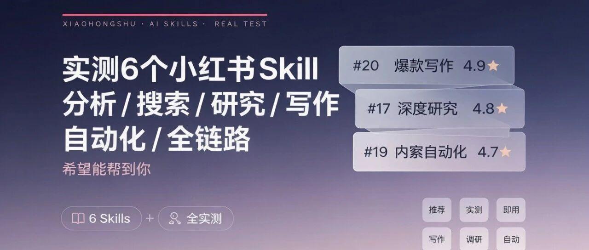

> 作者：旺哥 · 公众号：AI应用实战派PRO  
> [查看微信公众号原文](https://mp.weixin.qq.com/s?__biz=MzY4NDA4MDUwMA==&mid=2247484338&idx=1&sn=ef0c7b8375ec05cc8259fd7ce0229834&chksm=f2f72e53372e62dd0d3452b1b4c3c6196fff3d988a54e812f08e0a6bf4ad93ae2718021f33eb#rd)
> [下载 HTML 图文包（含图片）](https://github.com/wangge-dev/wangge-articles/releases/download/html-archive/202606221755.zip) · [HTML 文件](../../html/2026/202606221755/article.html)

XIAOHONGSHU · AI SKILLS · REAL TEST

实测6个小红书Skill：  分析 / 搜索 / 研究

写作 / 自动化 / 全链路

希望能帮到你

2026.06.22 · SKILL NOTES

6 个  实测 Skill  4 个  强烈推荐  开箱即用  无需配置

01

##  为什么找这些 Skill 来测

我自己日常也在刷小红书，后台也有读者问：有没有能直接用的小红书 Skill？

于是我下午搜索整理了一下，然后把 6 个全部装进 WorkBuddy，逐个跑了一遍真实场景。

下面按"好不好用"排序讲，省得你们自己踩坑。（个人觉得）  #15  全链路运营看着最厉害，但没配 XHS Bridge
的话大半功能都是摆设，这个后面会说。

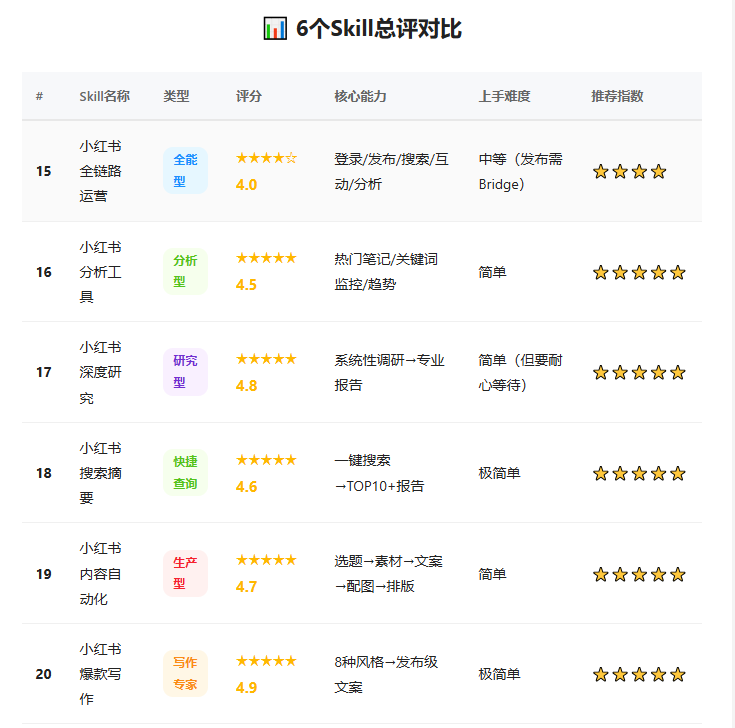

02

##  实测结果：4 个推荐，2 个看情况

测试方法很简单——每个 Skill 给一个真实业务场景的指令，看它输出什么、花了多久、能不能直接用。数据采集用的是 WorkBuddy 内置的
WebSearch，不涉及任何小红书账号操作。

#20  爆款写作  评分 4.9⭐ / 门槛最低的一个

** 测试指令：  ** 用「好物种草」风格写一篇「AI 工具推荐」的小红书文案。

** 输出：  ** 不到一分钟出稿，标题+正文+标签+配图规划+SEO 关键词全齐了。标题自动算 UTF-16 长度（19/20），emoji
用得像真人写的而不是硬塞。文案里甚至自带"性价比排行"和"诚实缺点"，这个细节很好——小红书上太完美的种草反而没人信。

适合谁：想做小红书的新手、需要批量出稿的博主。  ** 零依赖，给个主题就能跑。  ** 8
种风格模板覆盖了好物种草/干货教程/测评对比/打卡记录等主流类型。

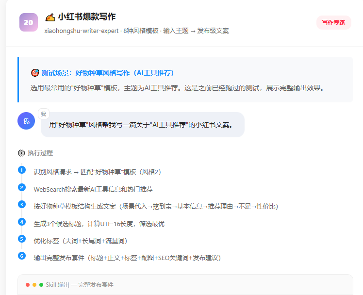

·

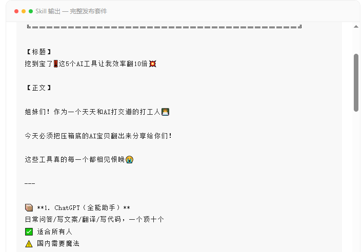
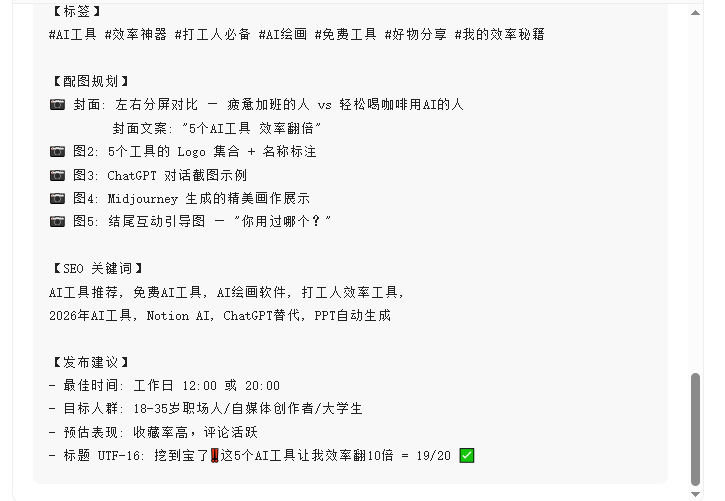

· ·

#17  深度研究  评分 4.8⭐ / 最专业的那个

** 测试指令：  ** 做一个「功能性洗发水」的小红书深度调研报告，要市场格局、用户需求、竞争情况。

** 输出：  ** 这个是真的重活。它会先设计搜索矩阵（12
个关键词变体），批量采几十篇笔记，然后从品牌声量、用户评论、测评笔记三个角度交叉验证，最后输出一份结构化报告——包含执行摘要、话题热度排行、用户痛点
TOP5（带提及率百分比）、竞争格局四阵营分析、短中长期行动建议。报告质量接近咨询公司交付物了。

适合谁：品牌战略、新品上市前的尽职调查、投资分析。  ** 缺点就是慢  ** ，标准调研模式跑完大概十来分钟。但如果你是要写方案或做 PPT
汇报，这份东西直接复制粘贴就能用。

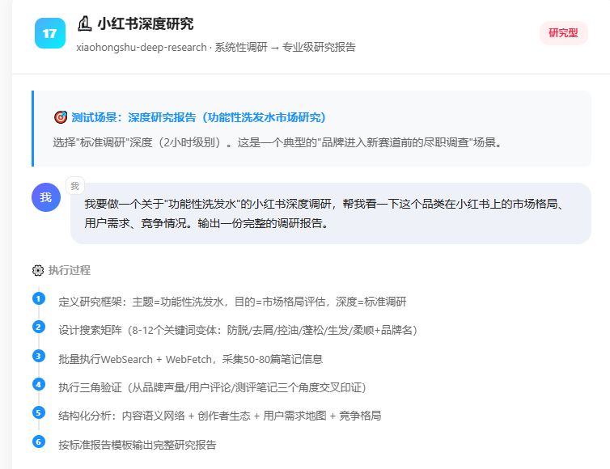
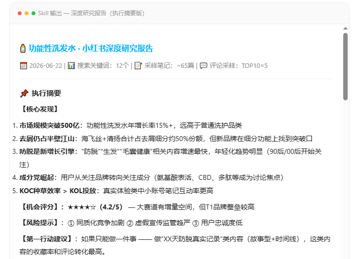
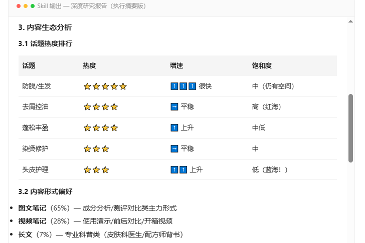
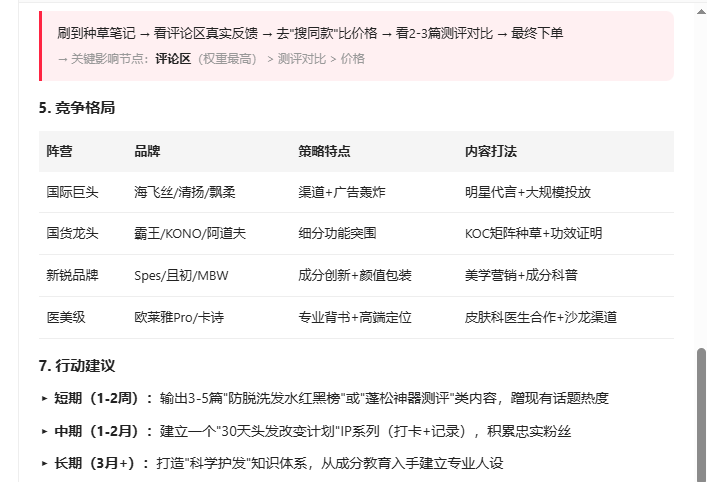

· · ·

#19  内容自动化  评分 4.7⭐ / 最省事的一条龙

** 测试指令：  ** 我是美妆博主，帮我做一套「夏季防晒」主题的小红书内容，从选题到成品文案都给我。

** 输出：  ** 它真的走了完整 7 步流程——先挖出 8
个候选选题并逐个给推荐理由，再选最优的那个，然后搜素材、写文案、规划每张图的画面描述，最后输出发布检查清单。最终产出的那篇《5步正确涂防晒，90%的人都涂错了》，标题长度、段落数量、标签数量全部自检通过，配图规划详细到可以直接喂给图片生成工具。

适合谁：自媒体博主、MCN 内容团队、电商运营。  ** 给一个方向它帮你完成 80% 的内容生产工作  **
，特别适合没灵感的时候用。整个流程跑完五到八分钟，换来的是一套发布就绪的内容包。

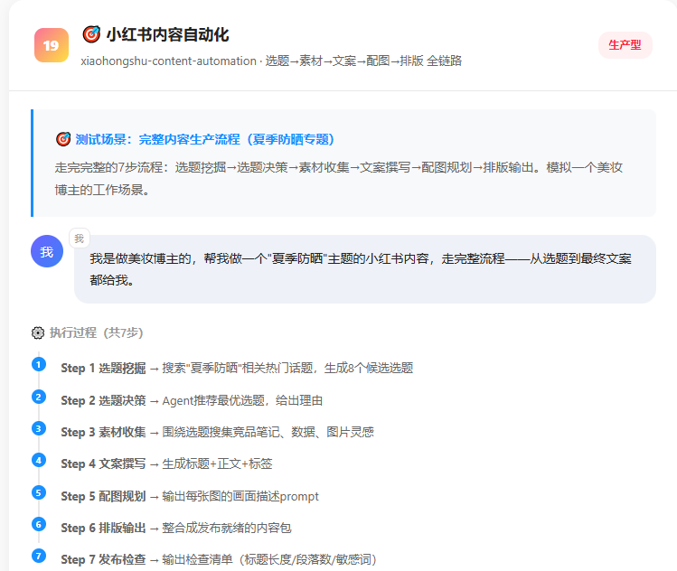

·

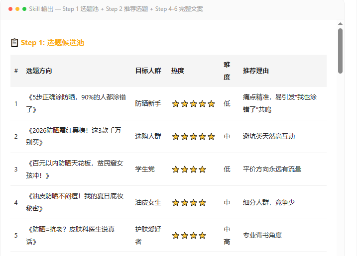
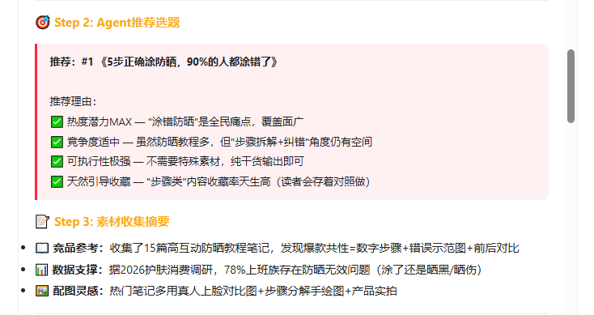

··

#18  搜索摘要  评分 4.6⭐ / 使用频率最高

** 测试指令：  ** 搜一下小红书上大家都在聊什么 AI 绘画工具？整理一份摘要。

** 输出：  ** 一句话搜索，一份完整报告。TOP10
热门笔记概览表（含方向、典型标题、热度等级、核心看点）、内容话题分布占比、评论区高频问题提炼、分人群的使用建议。速度也快，两三分钟内出结果。

适合谁：所有人。  ** 这是我用得最多的一个  ** ——想了解任何话题在小红书的讨论情况，丢一个关键词就行。日常选题调研、竞品监控、热点追踪都能用。

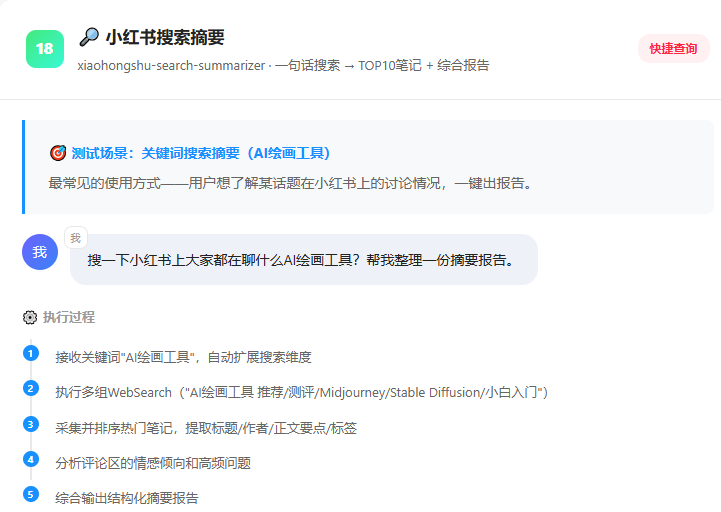
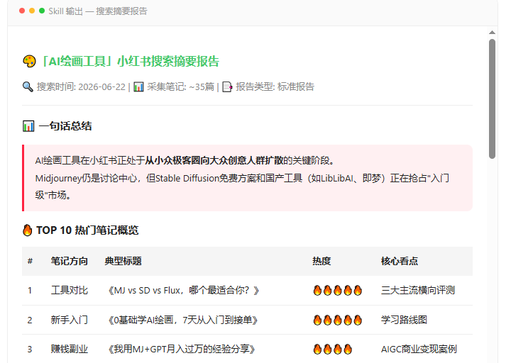
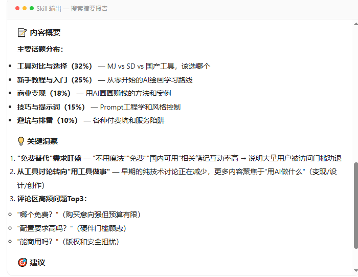

03

##  另外两个：一个要看配置，一个中规中矩

** #16  分析工具（4.5⭐）  ** 做热门笔记发现和类目趋势判断还不错，露营装备那个测试里它能关联行业报告数据、给出趋势预判和选题建议。但它和
#18  搜索摘要有部分功能重叠，如果只选一个的话我更推荐  #18  。

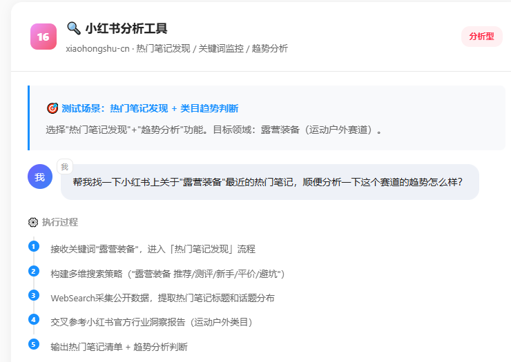
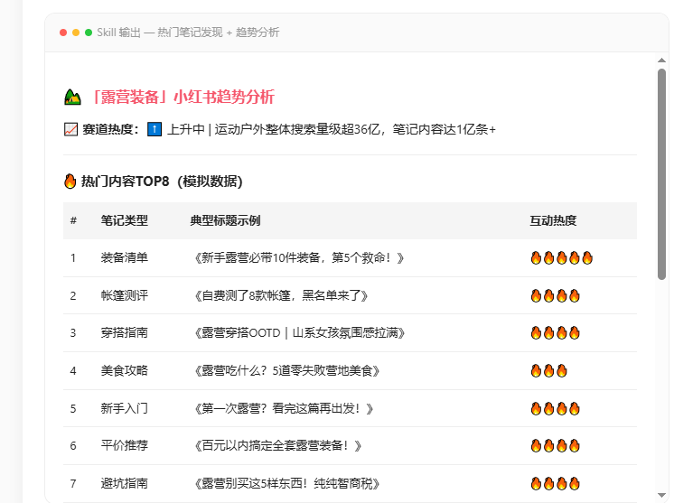
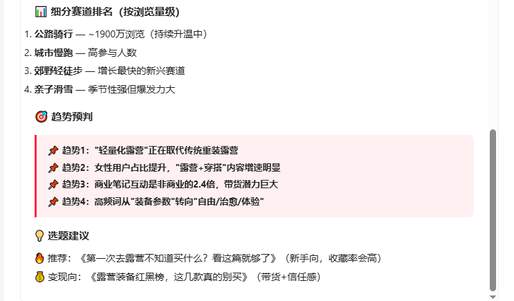

** #15  全链路运营（4.0⭐）  ** 是这个系列里功能最全的——登录、发布、搜索、互动、竞品分析一站式都有。但问题就在这：发布和互动功能需要额外配
XHS Bridge（一个浏览器扩展），没配上的话这部分就是空壳子。它的竞品分析和热点追踪功能倒是开箱就能用，如果你不需要自动发布，只用这部分的话其实也够。

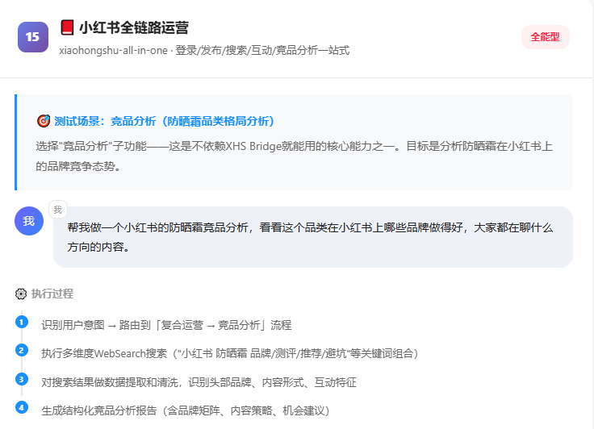
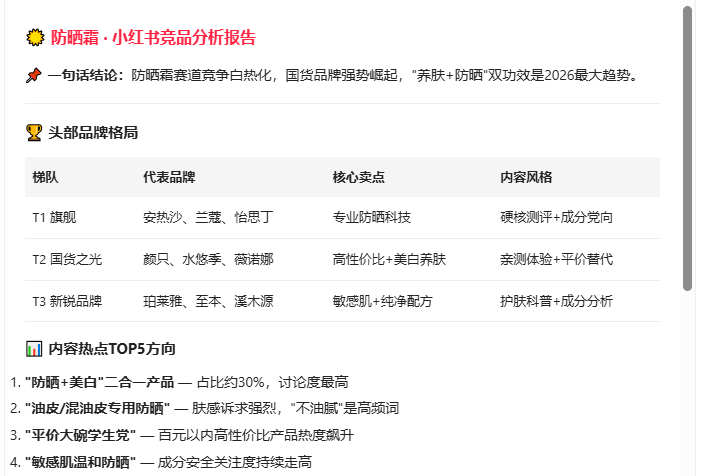
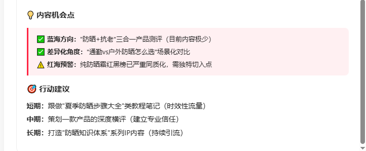

04

##  怎么选：一张表说清楚

Skill  |  评分  |  一句话定位  |  要不要装别的   
---|---|---|---  
#20  爆款写作  |  4.9⭐  |  1分钟出稿，门槛最低  |  不用   
#17  深度研究  |  4.8⭐  |  最专业，报告质量最高  |  不用   
#19  内容自动化  |  4.7⭐  |  一条龙全自动  |  不用   
#18  搜索摘要  |  4.6⭐  |  使用频率最高  |  不用   
#16  分析工具  |  4.5⭐  |  趋势判断不错  |  不用   
#15  全链路运营  |  4.0⭐  |  功能最全但要Bridge  |  需XHS Bridge   
  
新人入局优先级：  ** #20  →  #18  →  #19  ** ，先用写作和搜索技能快速上手产生价值；进阶后再加  ** #16  →  #17
** 做策略升级；  #15  等你真有自动发布需求再说。

05

##  怎么拿到

我已经做好了 WorkBuddy 适配版。分享包放在飞书上（之前建的多维表格里有链接），里面每个 Skill 都有 SKILL.md 和
README_WORKBUDDY.md。

飞书和网盘链接全部在评论区！

安装方式：把对应文件夹放到你的 Skill 目录就行，不需要额外依赖。除了  #15  的发布功能要 XHS Bridge，其余 5 个都是开箱即用。

咨询讨论请加：  HPwangtang

AI 应用实战派 PRO

觉得本文还不错，赶紧点赞收藏吧。

关注我，还有更多精彩文章和教程。

我是  AI 应用实战派pro  ，只聊落地，不讲虚的。

---

本文最初发布于微信公众号「AI应用实战派PRO」。未经特别说明，正文与配图采用 [CC BY-NC-ND 4.0](https://creativecommons.org/licenses/by-nc-nd/4.0/deed.zh-hans) 许可。
