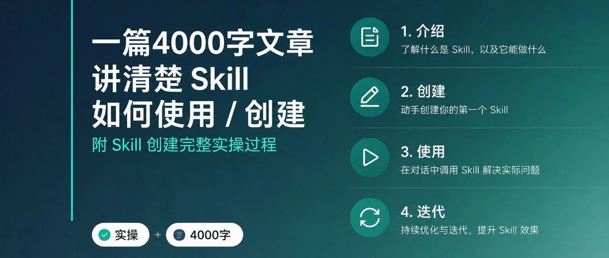

# 一篇4000字文章讲清楚 Skill 如何使用/创建,附 Skill 创建完整实操过程

> 作者：旺哥 · 公众号：AI应用实战派PRO  
> [查看微信公众号原文](https://mp.weixin.qq.com/s?__biz=MzY4NDA4MDUwMA==&mid=2247484362&idx=1&sn=1080d3e53ef5815f889770d461732d07&chksm=f25b9e8b8a600d08ccb49e9702974f249a4f3b13fe5a725c65c32a8cd4886e7862429c860103#rd)

SKILL · INTRODUCTION

写过很多 Skill 分享文章

今天讲清它  到底是什么

四个真实 Skill 演示递进过程

2026.06.24 · SKILL NOTES

~7 行  最小骨架  4 级  递进演示  1100 行  系统级

OPENING

之前分享过不少 Skill 文章——小红书skill、电商主图诊断、竞品分析，有一个基础问题还没回复过：

Skill 到底是什么？和普通提示词有什么区别？怎么从零创建？创建之后怎么迭代？

很多人下载了分享包，但  ** 不知道怎么自己写  ** ，或者  ** 不敢写  ** 。今天把这件事一次讲完。

01

##  Skill 到底是什么

先说结论：  ** Skill = 一段结构化的长提示词  ** 。它告诉 AI 遇到什么情况该怎么做、调什么工具、输出什么格式。电商主图诊断skill：

和普通提示词的核心区别在三个维度：

维度  |  普通提示词  |  Skill   
---|---|---  
触发  |  每次手动输入  |  触发词命中后自动加载   
复杂度  |  几句话一次执行  |  十几到上千行 多步骤   
复用性  |  用完就没了  |  存成文件随时调用   
  
可以把 Skill 理解成一个  ** 可复用的 AI 工作说明书  ** ——写一次，以后遇到同类问题 AI 自动照着执行。

02

##  一个最小 Skill 长什么样

不用一上来就写复杂的。下面是一个真实能用、只有约 15 行的最小 Skill，功能是从产品描述里提取核心卖点，标准化的提示词：

---  
    名称: 电商产品卖点提取器  
    描述: 从电商产品描述中提取核心卖点  
    ---  
      
    # 电商产品卖点提取器  
      
    ## 规则  
    1. 读产品名称和描述  
    2. 提取 3-5 个核心卖点  
    3. 每个卖点一句话，按优先级排序  
      
    ## 输出格式  
    | 卖点 | 优先级 | 可用场景 |

就这些。15 行，四个部分：

** ① 元数据  ** （前 3 行）：名字 + 什么时候触发。

** ② 标题  ** ：一句话说干什么。

** ③ 规则  ** （核心）：具体步骤，AI 照着走。

** ④ 输出规范  ** ：产出长什么样。

如果你不想麻烦直接说（给workbuddy或者codex都想）：我想生成一个skill：  读取电商产品名称与描述，提取 3-5
个核心卖点并按优先级排序，采用指定表格格式输出卖点、优先级、适用场景。  效果也是一样。下面我用workbuddy演示：

这样一个很简单的skill就创建好了，测试一下效果：

就是这么简单。表达完整你的需求就行了。上面就是 Skill 的最小骨架：  ** 触发词 — 做什么步骤 — 输出什么格式  ** 。任何一个
Skill，不管后来长到几千行，都逃不出这四块。

03

##  Skill从简单到复杂

下面用三个真实的电商 Skill，演示 Skill 是怎么从「一句话指令」长成「一套研究系统」的。每个阶段都拆开看，你会发现规律很简单。

Level 2  ** 电商图片工作流  **

解决的问题：给一张产品卡，自动输出多张 AI 生图的 prompt 批次。它比 15 行版本多了哪些东西？看核心片段：

# 触发词  
    当用户提到 "生图/生成主图prompt" / "AI生图" / "产品图prompt"  
      
    # 核心规则  
    - 中文渲染底线：禁止英文混排、禁止过度美化失真  
    - 默认输出路径：桌面  
      
    # Prompt 模板（核心资产）  
    模板变量：{产品名称} / {主题} / {角色} / {颜色色调}  
    示例输出格式见 测试文档  
      
    # 外部 SOP 引用  
    生成后自动调用 测试文档 做合规检查

相比 Level 1，多了四件东西：

** ① 触发词规则  ** ：不再靠你手动选，AI 自己判断什么时候加载。

** ② 核心规则集  ** ：「中文渲染底线」「默认输出路径」，这些是业务经验沉淀。

** ③ Prompt 模板 + 变量体系  ** ：不是每次现想，而是有固定格式可复用。

** ④ 外部 SOP 引用  ** ：第一次出现 references/ 文件夹，规则不放主文件里。

质变：从「一段话指令」变成「带规则约束的工作流」。AI 不再自由发挥，按你的底线输出。

大白话版本：  只要我提到生图、生成主图 prompt、AI 生图或者产品图 prompt
就触发这个功能，写提示词全程都用纯中文，不能中英文混排，也不能过度美化产品导致失真脱离实物，生成好的内容默认保存到桌面；写的时候直接套固定模板，填上产品名称、主题、角色和颜色色调这几项内容就行，具体的输出格式可以参考测试文档，全部生成完成后还会自动调用测试文档做一遍合规检查。

看一下效果还是同一个商品描述提示词：

Level 3  ** 电商主图诊断  **

问题更复杂：给一张主图，自动诊断为什么点击率低，并给出具体改法。核心变化在  ** 输入路由  ** 和  ** 诊断框架：  **

# 输入路由（7种入口）  
    如果 用户给单张图 -> 走单图诊断流程  
    如果 用户给截图（含数据）-> 提取 CTR 后走诊断 + 数据对比  
    如果 用户给图片组 -> 逐张诊断后汇总对比  
    如果 用户给竞品图 -> 竞品对比模式  
    如果 用户给链接 -> 先下载图片再诊断  
    如果 用户只给了CTR数据 -> 纯数据分析模式  
    如果 用户说"帮我看看这张图" -> 默认单图诊断  
      
    # 六维诊断框架  
    [1] 视觉冲击力（首屏吸引力）  
    [2] 信息传达效率（3秒内能看懂卖什么）  
    [3] 色彩搭配（是否符合品类调性）  
    [4] 文案质量（标题/卖点/促销信息）  
    [5] 竞品差异化（和同行比有没有记忆点）  
    [6] 平台适配（是否符目标平台规范）  
      
    # 分级输出  
    [-] Fix（小改即可）：调整文案/微调色彩  
    [-] Test（建议测试）：换构图/A/B测试  
    [-] Rebuild（建议重做）：方向性问题，需重新拍摄或设计

相比 Level 2，又多了几个关键能力：

** ① 多入口输入路由  ** ：不管用户给图、链接、数据还是截图，AI 都知道该怎么处理。

** ② 结构化诊断框架  ** ：不是凭感觉评价，而是按六个维度逐项打分。

** ③ 分级输出  ** ：结论不只是文字，还有行动建议。

质变：从「单一工作流」变成「有判断能力的专业工具」，能根据不同输入分流处理，给出结构化结论而不是泛泛而谈。

大白话版本直接复制：  主图诊断的需求一共分 7 种情况对应不同流程哈，如果只发单张图过来就走单图诊断流程，发的是带数据的截图就先把 CTR
数据提取出来，一边做诊断一边做数据对比，发了一组好几张图的就逐张挨个诊断完再汇总做整体对比，专门发竞品图过来的直接切竞品对比模式就行，甩链接过来的就先把图下载好再走诊断，只给了
CTR 数据没配图的就走纯数据分析模式，随口说一句 “帮我看看这张图”
的默认就按单图诊断来处理；诊断的时候就从六个方面挨个把关，首先看视觉冲击力够不够、能不能第一时间抓住眼球，然后看信息传得快不快、能不能 3
秒内就让人看明白卖的是什么，再看色彩搭配合不合适、符不符合对应品类的风格调性，接着看文案质量过不过关、标题卖点促销信息清不清楚，还要看跟竞品比有没有差异化、能不能让人留下印象，最后检查平台适配性、符不符合目标平台的规范要求；最后输出结论分三档，小毛病改改就好的归
Fix 档，调调文案微调下色彩就行，觉得有优化空间值得试试效果的归 Test 档，建议换个构图或者做 A/B 测试跑跑看，要是方向本身就有问题的就归
Rebuild 档，得建议重新拍摄或者重新设计才行。

看一下效果，完成的也很快，因为我们的要求写的很多很明确：

Level 4 · 约 1100 行  ** 全域蒸馏器  **

这个级别已经不是解决单个问题。输入一个行业名（比如「电商 AI 工具」），它会自动跑完五步研究，产出 85-99
个文件的分析报告。代码太长不放完整，直接看架构。

这是我根据一篇文章整理出来的：

[ 如何用 Codex 在 1 小时内快速了解陌生行业
](https://mp.weixin.qq.com/s?__biz=MzkwMzI0MDMzNA==&mid=2247489093&idx=1&sn=49af046828beea094d61f82e07c384fe&scene=21#wechat_redirect)

Step 1 · 建数据库  ：品牌（52 个）+ 产品分类（48 类）+ 痛点 + 关键词 + 社区 + 内容源。

Step 2 · 竞品反向拆解  ：Google 搜索语法+ Top 20 深度分析 + 行业共识。

Step 3 · 内容生态研究  ：100 账号采样 + 五分法归类 + Top 20 爆款规律。

Step 4 · 知识地图构建  ：248 节点树 + 30 张知识卡 + 连接关系 + 21 个机会。

Step 5 · 情报监控搭建  ：56 个信息源 + 监控 SOP + 周报模板。

相比 Level 3，又升了几个维度：

** ① 并行 Agent 协作  ** ：Step 1 的品牌库、产品树、痛点关键词同时跑，不是串行等。

** ② 质量 Checkpoint  ** ：每一步结束都有检查标准，不合格不进下一步。

** ③ 大规模结构化产出  ** ：不是一份报告，而是一个完整的「行业操作系统」文件夹。

质变：从「工具」变成「研究系统」。注意——不是所有 Skill 都需要这个级别。只有当你需要「输入一个模糊方向，输出一套完整认知体系」时才值得做。

  
|  15 行  |  68 行  |  70 行  |  1100 行   
---|---|---|---|---  
定位  |  一句话指令  |  带规则工作流  |  有判断的工具  |  研究系统   
输入  |  1 种  |  1 种  |  7 种路由  |  行业/品牌/网站   
产出  |  1 个表格  |  prompt 批次  |  诊断报告  |  85-99 个文件   
场景  |  重复小任务  |  固定流程  |  专业分析  |  陌生领域认知   
  
04

##  什么时候该做一个 Skill

我的判断标准：  ** 事不过三原则  ** 。

如果一个任务你只做一次，直接在对话框里用提示词发给 AI 就行，没必要搞 Skill。但如果你发现同一个规矩跟 AI 纠正过 3 次以上，就该做成
Skill。

比如连续三次告诉它「不要在文案里加小标题」「价格不要用破折号引出」——说明你的需求是高频且稳定的，值得固化下来一劳永逸。

反过来，如果每次需求都不一样、没有重复模式，那就别强凑 Skill，用临时提示词反而更灵活。

05

##  怎么从零创建你的第一个

不需要会编程。三步走。

** 第一步，选对场景。  ** 用上面的「事不过三」判断，找一件你重复做了 3 次以上的事。比如每次上新都写产品描述、每周整理竞品价格、批量起标题候选。

** 第二步，写核心流程（约 20-30 行）。  ** 新建 SKILL.md，按上面的小骨架填：

---  
    名称: 第一个skill  
    描述: 一句话说明什么时候触发  
    ---  
      
    # 名称  
      
    ## 核心规则  
    （不能违反的底线，1-3条）  
      
    ## 工作流程  
    [1] 第一步做什么  
    [2] 第二步做什么  
    [3] 第三步做什么  
      
    ## 输出规范  
    （产出的格式和位置）

** 第三步，跑一遍，记录问题，改，再跑。  ** AI 哪里没理解清楚就补哪里，哪个步骤多余就删掉。循环 2-3 次，靠谱的 Skill 就成型了。

其实也大可不必写的那么标准，把你的要求按照大白话的形式说出来就行，如果嫌打字麻烦，语音输入最好，有人该问了，那语音输入是不是显得废话有点多，恰恰相反，语音输入输出的内容比打字提供的内容多多了，想象一下你打字还要思考哪里改写哪里不该写，这往往漏掉了信息给ai使用，而ai不怕信息少不怕信息杂，ai怕的是你给的信息少，比如帮我生成一张图片，ai就会很懵，生成一张什么图片呢？

##  怎么使用 Skill

创建好之后，两种方式触发。

** 方式一：自然语言触发（推荐）。  ** 直接在对话中说对应需求，AI 会自动匹配触发词并加载 Skill。比如对着电商主图诊断 Skill
说「帮我看看这张图为什么点击率低」，它就自动走了。

** 方式二：手动选择。  ** 在工具的技能列表里找到对应的 Skill 名称，手动选中后再发内容。适合不确定触发词的时候。

Skill 做好后是  ** 跨平台通用  ** 的。在 WorkBuddy 里写的，在 Claude Code、Codex
里也能用，核心逻辑只需要微调工具调用的语法。

07

##  怎么迭代（大多数人停在这里）

很多人创建了第一个 Skill 就停了。但价值在迭代，不在初版。

阶段  |  做什么  |  典型改动   
---|---|---  
v1 → v2  |  跑 3-5 次收集问题  |  补边界情况 + 加 Common Mistakes   
v2 → v3  |  给别人用收反馈  |  加输入路由 + 引用文件 + 改措辞   
v3+  |  定期复盘使用频率  |  砍没人用的功能 / 合并相似步骤   
  
最有效的一招：  ** 把你修改后的结果发给 AI，让它自己找差异、总结规律、写入 Skill  ** 。比你凭空想规则精准很多。
好的skill是不断迭代不断实践的结果，这其中涉及到大量的试错和实验，由于篇幅的有限这里就不展示了。

08

##  去哪找现成的 + 为什么不要装太多

不想从零写？三类资源。

** 技能市场  ** ：WorkBuddy 内置推荐市场，搜索安装即可。

** GitHub / 社区  ** ：很多开发者开源了自用的 Skill。

** 官方插件库  ** ：内置 100+ 官方 Skill 开箱即用。

不要贪多装一堆半成品。

AI 每次回答依赖的是上下文（当前对话能看到的全部内容），空间有限。装太多 Skill 反而互相干扰。现在的机制是  ** 渐进式加载  **
：先看名片决定要不要用，用了才读全文，执行时再按需调参考资料。所以精简你的 Skill 库，盯准最高频的几个场景就够了。

本文提到的Skill：

Skill  |  解决什么  |  复杂度   
---|---|---  
全域蒸馏器  |  陌生行业快速建立完整认知  |  系统   
电商主图诊断  |  点击率低？诊断 + 给改法  |  工具   
图片工作流  |  产品卡 → AI 生图 prompt 批量  |  工作流   
卖点提取器  |  产品名称→提取卖点  |  工具   
  
· · ·

咨询讨论请加：  HPwangtang

AI 应用实战派 PRO

觉得本文还不错，赶紧点赞收藏吧。

关注我，还有更多精彩文章和教程。

我是  AI 应用实战派pro  ，只聊落地，不讲虚的。

---

本文最初发布于微信公众号「AI应用实战派PRO」。未经特别说明，正文与配图采用 [CC BY-NC-ND 4.0](https://creativecommons.org/licenses/by-nc-nd/4.0/deed.zh-hans) 许可。
