# 一个万能蒸馏 Skill :输入行业/品牌/网站/XX自动蒸馏并生成全域深度调研报告

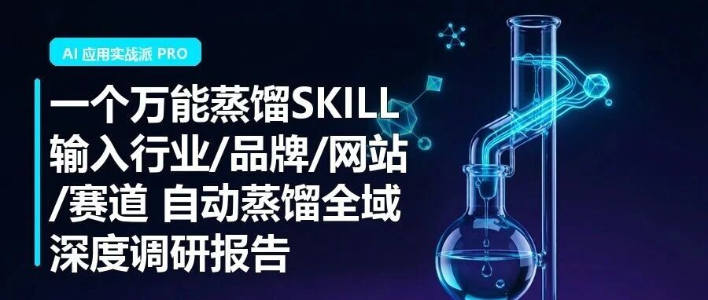

> 作者：旺哥 · 公众号：AI应用实战派PRO  
> [查看微信公众号原文](https://mp.weixin.qq.com/s?__biz=MzY4NDA4MDUwMA==&mid=2247484393&idx=1&sn=7d30dec8678011d2cc6f52ffbe9f4363&chksm=f21187d35733cf4cb08f5d535ca15ae49dd81b416a2960772a590f9945e7206823f638f8f837#rd)
> [下载 HTML 图文包（含图片）](https://github.com/wangge-dev/wangge-articles/releases/download/html-archive/202606261736.zip) · [HTML 文件](../../html/2026/202606261736/article.html)

FULL-SPECTRUM · DISTILLER

输入行业/品牌/网站/赛道

自动产出  全域深度调研

Claude 实测：53 个文件 · 6 家竞品横评 · 18 个机会 · 52 个内容账号

53  产出文件  6 家  竞品横评  18  可行动机会

之前看到一篇文章很不错，讲了一套行业调研框架：

[ 如何用 Codex 在 1 小时内快速了解陌生行业
](https://mp.weixin.qq.com/s?__biz=MzkwMzI0MDMzNA==&mid=2247489093&idx=1&sn=49af046828beea094d61f82e07c384fe&scene=21&poc_token=HG0-PmqjYpi2qNgnbEB5JaIa5C-Y5C5xnjXmmthn#wechat_redirect)

差不多是这样的五步：  建数据库、拆竞品、研究内容生态、画知识地图、搭情报系统  。框架不复杂，但每步要搜集的信息量很大。

我想着能不能把它封装成一个固定流程：给一个行业/品牌/网址等等，它自动跑完所有步骤，输出一套结构化报告。做出来之后叫「  全域蒸馏器
」，名字借自化学实验室，把混合物加热蒸发再冷凝提取纯物质。放到信息领域，就是从全网散乱信息里提纯出一套完整的认知档案。

拿  Claude  和  Notion  （网站） 各跑了一次。下面主要说 Claude 这次的结果和这个东西怎么用。

01 它产出了什么

我用workbuddy，输入一句「  蒸馏 Claude  」，等十来分钟，输出 目录里多出 53 个文件。品牌数据库、产品矩阵、用户痛点、关键词库（65
个词按搜索意图分了 5 类）、6 家竞品逐家拆解对比、52 个内容账号采样加爆款规律分析、知识地图、18 条可行动机会，还有一份可以直接打开看的 HTML
报告。  内容极其丰富！但是比较烧TOKEN！

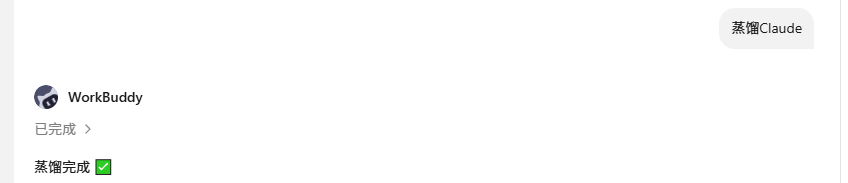 竞品覆盖  6 家  12 维横评  |  内容采样  52  个账号
---|---  
关键词  65 条 × 5 类意图  |  知识卡片  12 张核心概念卡   
---|---  
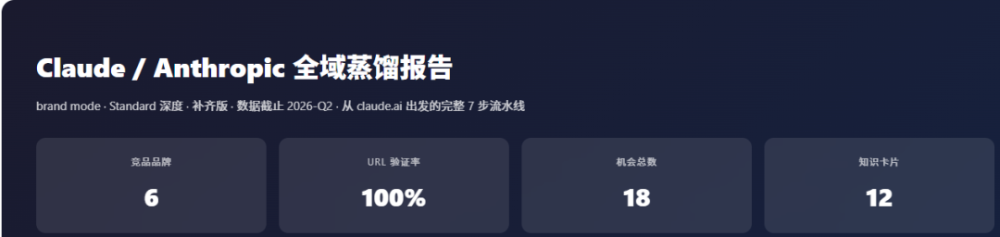
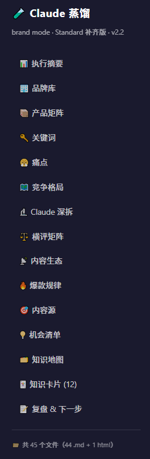
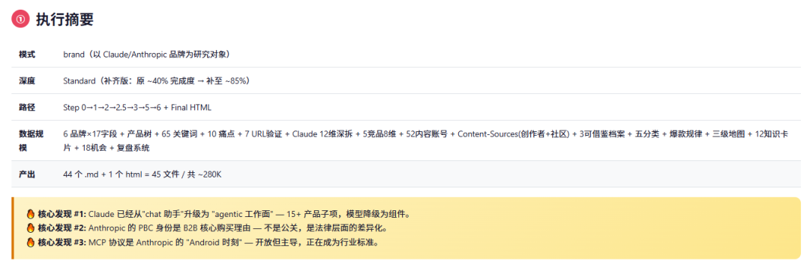

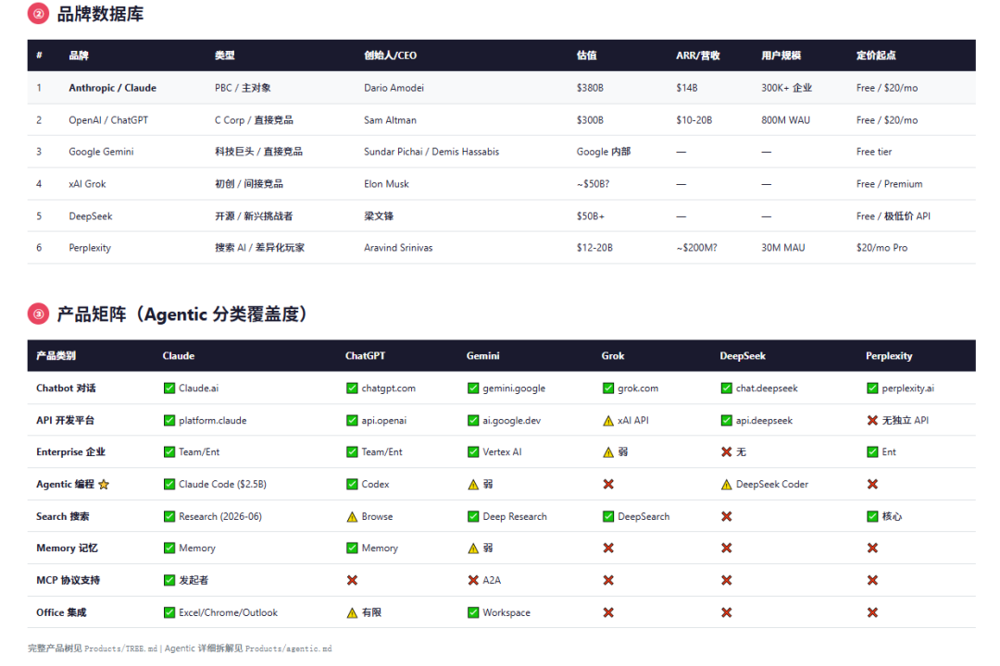
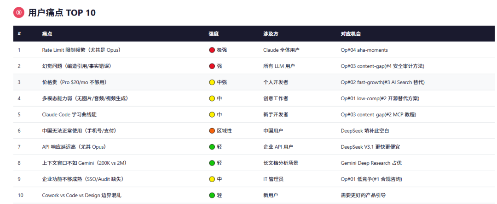

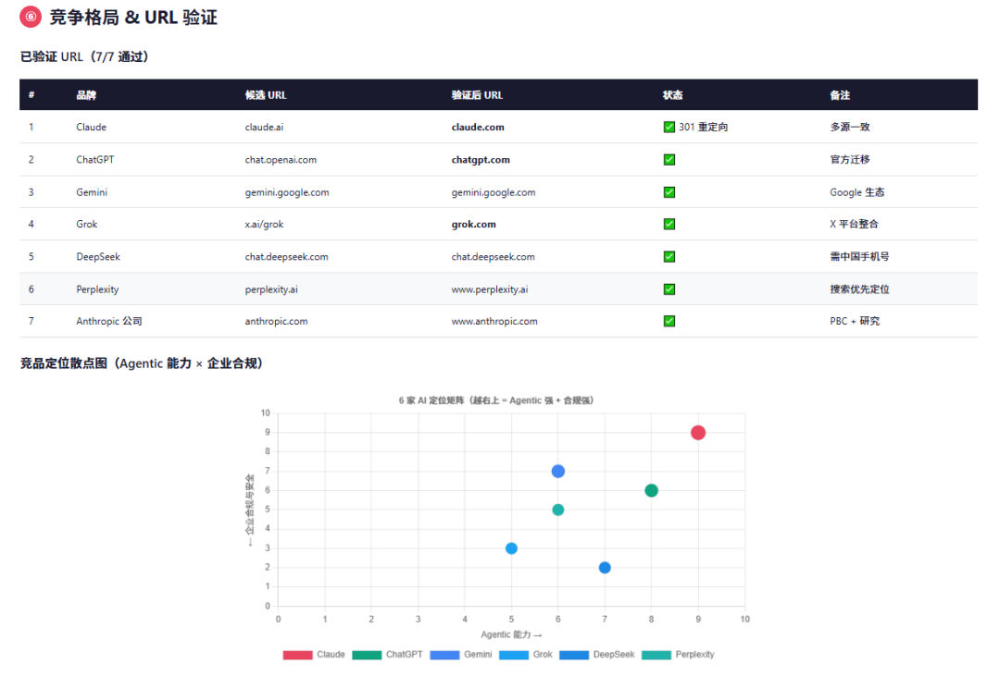
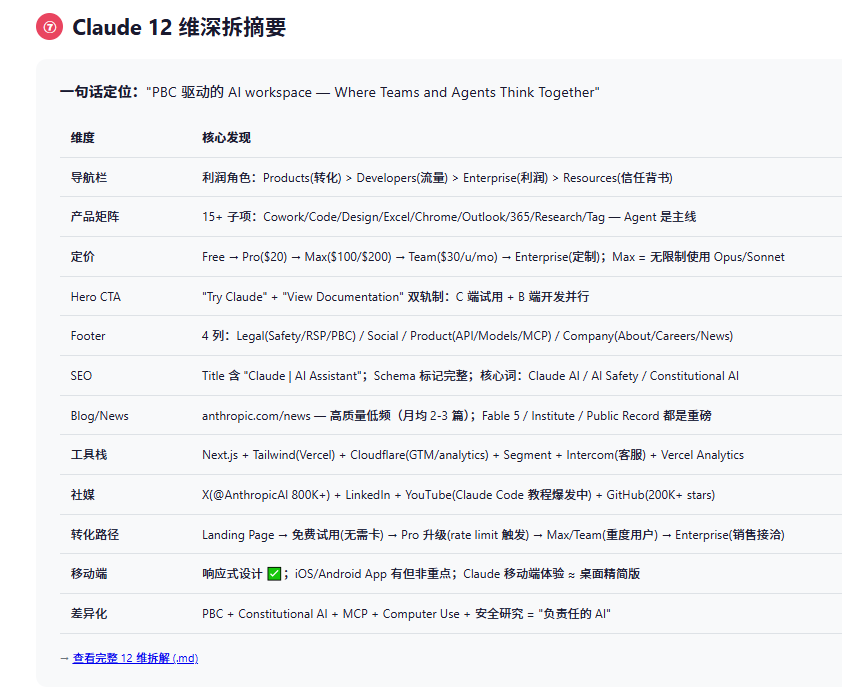
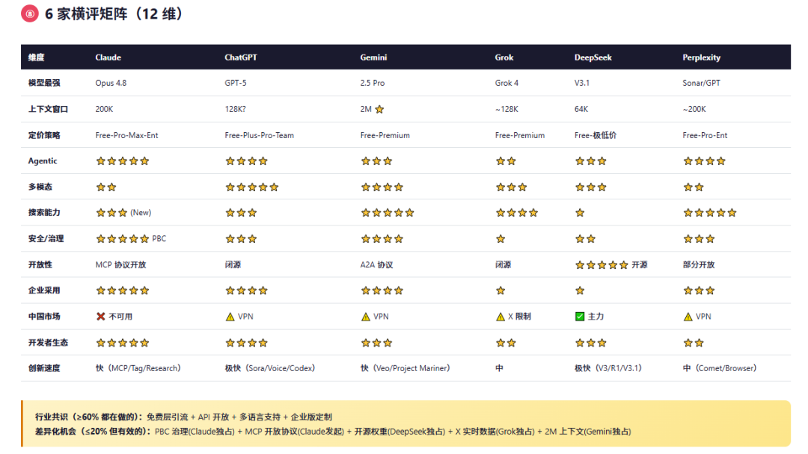
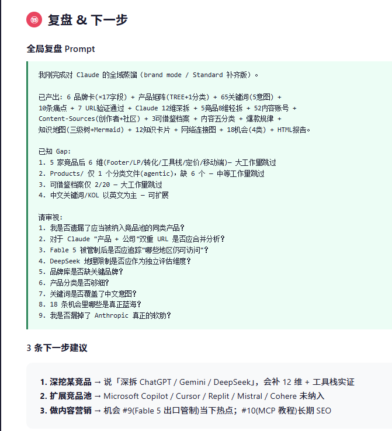
---  
  
跑完之后有几个值得说的发现。

** Claude 已经不是聊天助手了  ：  ** 它的产品线从单一对话扩展到了十几个子项，包括能操作本地文件的 Cowork、能写代码的 Claude
Code、能嵌入 Excel 的插件。

** Anthropic 的公司架构是独一份的  ：  ** 它是公共利益公司（PBC），安全直接写进公司章程，法律上可以拒绝股东短期利润压力。这一点在
ChatGPT、Gemini、Grok、DeepSeek、Perplexity
五家里面都没有。所以银行、航空这些监管行业开始选它，已经通过两家大集成商进入了生产环境。

** 六家各有各的活法  ：  ** ChatGPT 规模最大还在冲 IPO；Gemini 背靠 Google 生态，上下文窗口全行业最长；DeepSeek
开源权重价格极低，在中国市场一家独大；Perplexity 走搜索路线刚出了桌面端 agentic 产品；Grok 反审查定位，和 Claude
的用户基本不重叠。

另外还跑了一个 Notion 的网站拆解以及ai相关的，产出 14 个文件。Notion 也在往 AI 方向转，hero 标语已经从文档工具改成了团队协作加
agents。不过这个不展开。

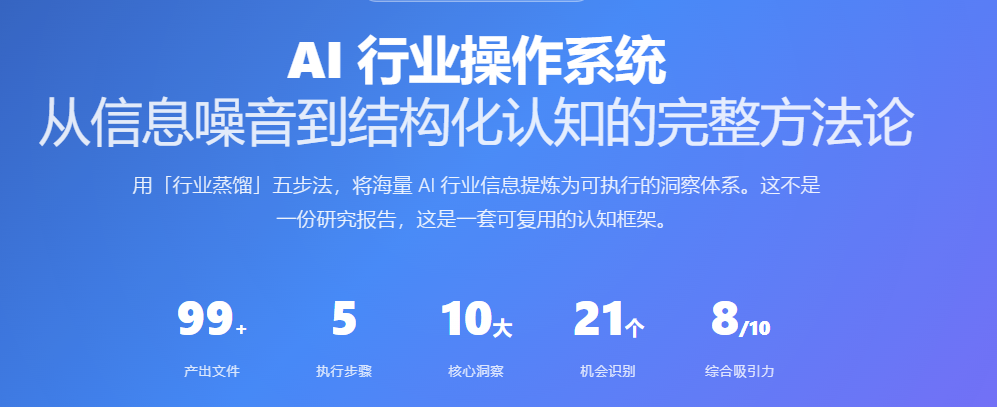
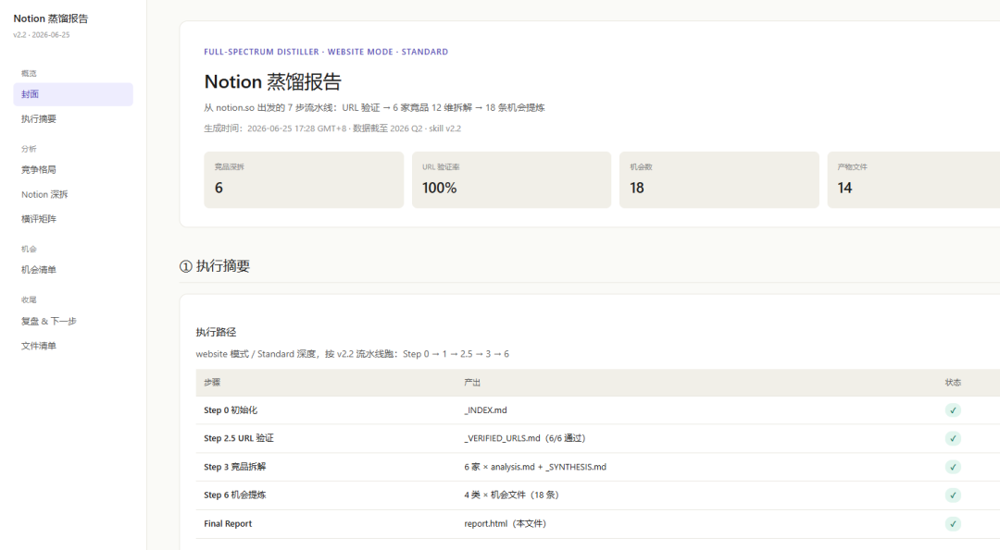

02 它解决什么问题

简单说就是：你想了解一个陌生领域，但信息太散太杂，搜一圈下来收藏夹多了两百个链接，脑子还是一团浆糊。

不用蒸馏器  |  用了蒸馏器   
---|---  
自己搜几十篇报告，复制粘贴到文档里  |  自动生成品牌库、产品树、关键词体系   
手动打开十几个竞品网站一个个记笔记  |  每家竞品 12 维拆解，横评矩阵一键出   
刷社交媒体找热门话题，凭感觉判断  |  50 多个账号采样，五分类找爆款规律   
花两三天整理，最后还是碎片化的一堆链接  |  一套完整、可检索、能持续更新的认知档案   
  
核心就一句话：  ** 你给一个起点，它帮你把整个拼图画出来  ** 。它负责收集、整理、结构化所有信息，你站在更高的视角做判断。

03 怎么用

用起来很简单。装好skill之后直接给workbuddy或者codex说一句话就行，：

蒸馏 Claude  拆解 https://notion.so  研究 DTC 咖啡行业  
---  
  
** 它支持四种输入  **

给一个品牌名，比如「Claude」「Shopify」「瑞幸咖啡」，它以这个品牌为中心全套拆解，找竞品、比差异、挖机会。

给一个网址，它深拆那个网站的结构、转化路径、定价策略，再找同类站点对比。

给一个行业名，它全量执行，最重，品牌库、内容生态、情报系统全部拉满。

给一个话题，它专注知识地图和痛点，不做竞品拆解。

** 三档深度可以选  **

快速档，半小时内出结果，适合先摸个底。标准档，默认就是这个，大多数情况够用，产出 40-60
个文件。深度档，每个步骤做得更细，还多出一个情报系统模块（信息源清单、RSS 监控、周报模板），适合长期跟踪一个方向。

不确定就别选，默认标准档就行。跑完觉得哪块不够深再说。

** 跑完拿到两样东西  **

第一样是一堆 .md 文件，40 到 60 个不等。品牌卡、产品分类、关键词表、竞品拆解、内容账号档案、知识卡片、机会清单，每个都是独立文件。这些文件兼容
Obsidian，拖进去就能用，支持双链跳转和图谱视图。

第二样是一份 HTML
报告，单文件，双击就能在浏览器打开，不需要装任何东西。里面有侧边栏导航、图表、机会清单的分类切换。你可以自己看，也可以直接发给别人。打印成 PDF 也行。

** 跑完还能继续补  **

如果觉得某一块不够深，不用从头来。直接说「补齐内容生态」或者「深拆 ChatGPT 这个竞品」，它在已有成果上增量追加新文件，然后重新生成 HTML 报告。

每个文件末尾还带一段复盘 prompt，复制出来追问「这一步漏了什么」，它会基于已有数据继续补。

** 适合这些场景  **

** 进新品类之前  ** ，先跑一遍看看有哪些玩家、竞争格局怎么样、哪些需求还没被满足。

** 做内容找选题  ** ，内容生态那一步会告诉你什么选题反复爆、什么没人做但有需求、哪些跨平台迁移机会还没人占。

** 老板让你研究某个行业  ** ，半天内交出一份有数据支撑的报告初稿，不是那种泛泛而谈的总结。

** 长期跟踪某个方向  ** ，第一次跑深度档拿到全套情报系统之后，以后每周刷新一次就行，数据库会持续增长。

04 分享包

老规矩分享包在评论区，网盘和飞书云文档都有。

怎么用：拿到分享包后，直接给你的workbuddy或者codex使用，让它看完 readme 就行！

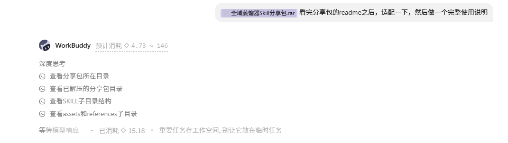
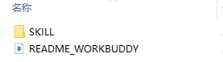
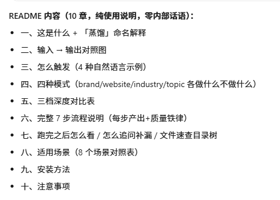
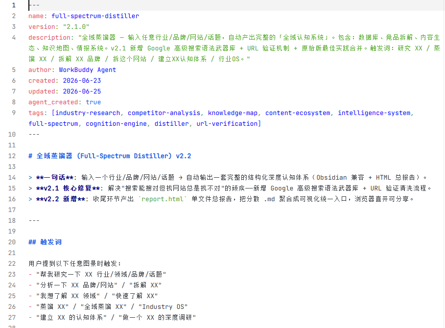

· · ·

总结：

普通问 AI
的方式是问一个问题得一个答案，看完三天就忘。蒸馏器的区别在于，它给你的是一整套有来源验证、有结构、能持续更新的知识资产。品牌库随时加新品牌，情报系统每周刷一次周报，知识地图根据新发现不断细化。从一次性问答变成了一套可持续的行业研究工作流。

咨询讨论请加：  HPwangtang

AI 应用实战派 PRO

觉得本文还不错，赶紧点赞收藏吧。

关注我，还有更多精彩文章和教程。

我是  AI 应用实战派pro  ，只聊落地，不讲虚的。

---

本文最初发布于微信公众号「AI应用实战派PRO」。未经特别说明，正文与配图采用 [CC BY-NC-ND 4.0](https://creativecommons.org/licenses/by-nc-nd/4.0/deed.zh-hans) 许可。
