# 我用 Codex 拆解了 20 个视频做出一套数据视频工作流 （一）

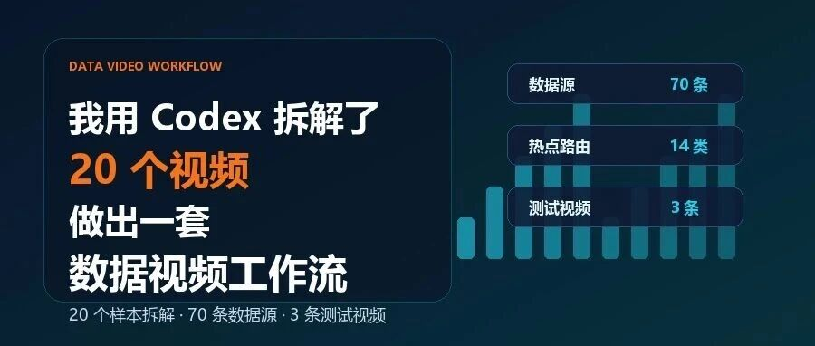

> 作者：旺哥 · 公众号：AI应用实战派PRO  
> [查看微信公众号原文](https://mp.weixin.qq.com/s?__biz=MzY4NDA4MDUwMA==&mid=2247484505&idx=1&sn=a2ca4bf0828a134f85f5815558dd895d&chksm=f23e41bbca5af18990d6f0fc47a59da5d51e44f727e0e0a88e0b15aea9673e36060b468d7f7d#rd)
> [下载 HTML 图文包（含图片）](https://github.com/wangge-dev/wangge-articles/releases/download/html-archive/202607081808.zip) · [HTML 文件](../../html/2026/202607081808/article.html)

DATA VIDEO WORKFLOW · CODEX

我用 Codex 拆了 20 个视频

做出一套数据视频工作流

20 个样本拆解，70 条数据源，3 条测试视频

20 个样本  70 条来源  3 条样片

OPENING

先看结果，再讲怎么做

前两天刷到一条动态排行视频。

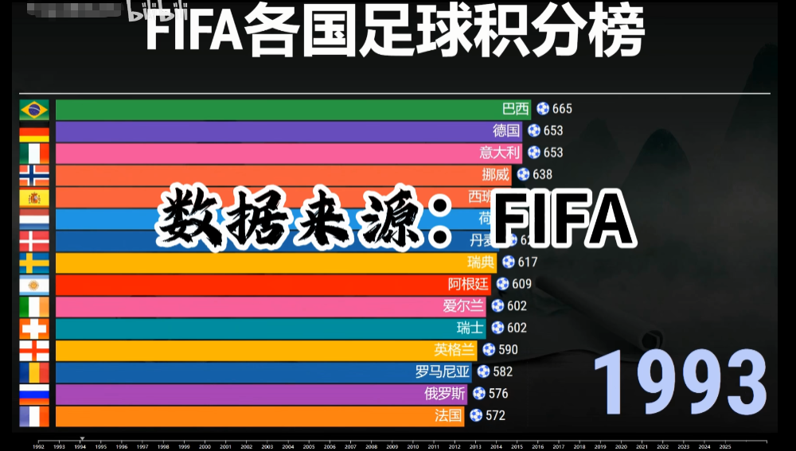
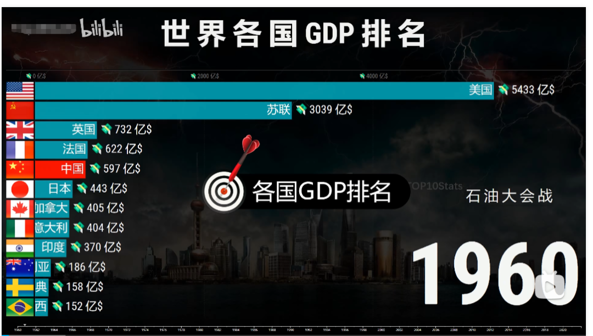

国家、品牌、平台这些名字随着年份往前走，条形图不断换位置。画面不复杂，但很容易看下去。几秒钟之内，观众就能看出一段变化。

于是我想着能不能用codex做出来，没有想到codex拆解速度那么快，最后做出来的效果也不错。

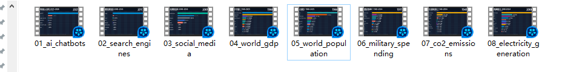

流程是：我把这个UP主账号发给 Codex，让它先拆 20 个样本。拆完以后，我又给它设了一个
Goal：不要停在分析，直接跑出一套从热点到成片的数据视频工作流。

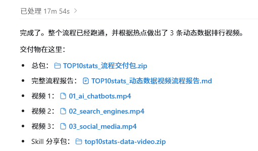

成果总览：样本拆解、数据源、热点路由、测试视频、Skill 包

截图位：完整交付包目录

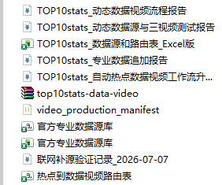

这套流程先判断题能不能做

我让 Codex 把热点先分到 14 类。人口、能源、气候、科技、体育、金融，不同题材走不同数据源，也对应不同视频形式。

能拿到多年连续数据的，适合动态排行；只有当天或当周数据的，更适合快照榜；两组对象差异明显的，做对比图比硬拉年份更清楚。

这一步很关键。数据找不到，口径说不清，一上来就做动画，最后很容易变成硬凑一个榜单。

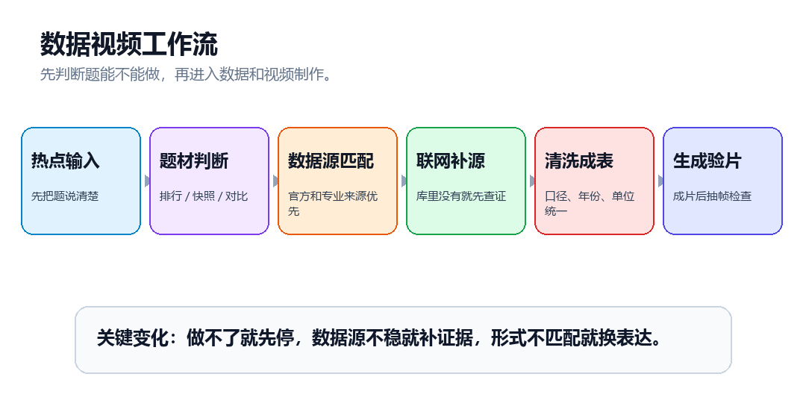

自动判断流程：热点输入后，先路由，再补源，再进入清洗和成片

数据源不能只靠几个常见网站

数据源这块，我让 Codex 做成了种子库。它不只存几个常见网站，而是按题材放官方或专业来源，同时写清楚备选搜索词和复查频率。

命中库里的题，先用已有来源；本地库没有覆盖，先联网找官方或专业来源，再决定这个题能不能继续做。

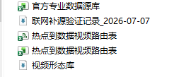

后来我又让 Codex 测了一个本地库没有覆盖的热点。旧逻辑会被宽泛词带偏，新逻辑直接提示需要补源。

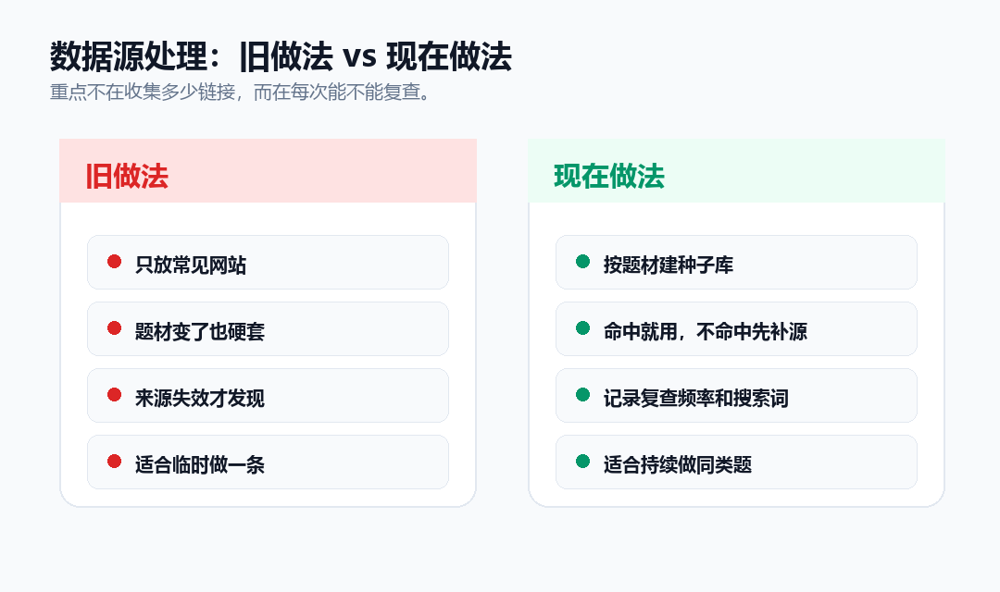

数据源对比：从固定清单改成可更新的种子库

截图位：数据源 Excel 表

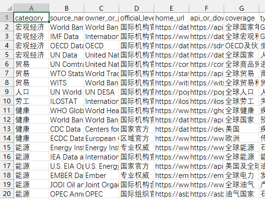

截图位：热点路由判断结果

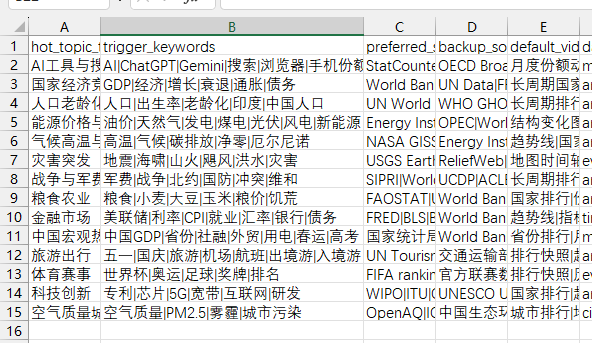

我让它重跑了 3 条样片

视频这边，我最后让 Codex 重跑了 3 条测试片：世界人口排行 90 秒，全球 CO2 排放排行 90 秒，全球发电量排行 80 秒。

三条都抽了中段画面检查。现在还没到发布级成片，封面、BGM、剪辑节奏都还能继续调，但已经能证明这套流程可以从数据源走到视频。

看一下视频效果：

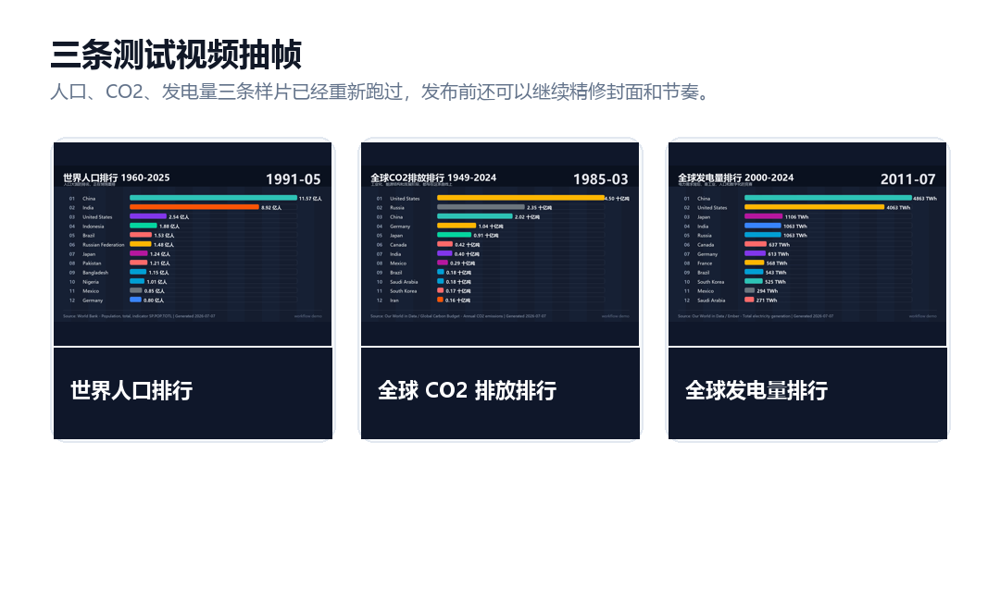

三条测试视频抽帧：人口、CO2、发电量

最后整理成一个 Skill

这套工作流最后被整理成了一个 Skill。

以后再做同类题，不用从空白对话开始问“数据视频怎么做”。让 Agent 先读
Skill，再按同一套步骤走：判断题材，找数据源，清洗口径，选视频形式，生成视频，再抽帧检查。

它帮我省下的，是前面的判断时间：这个热点能不能数据化，去哪里查，适合动态排行、快照榜，还是对比图。先把这些弄清楚，后面的动画才有意义。

怎么获取skill

赞赏  9.9  获取哦！

你可以拿这个skill来自己发布视频到B站抖音当视频博主，所以本次skill不免费分享了

大家见谅！

如果你也想试这种数据视频流程，建议先从公开数据比较稳定的题开始。人口、发电量、碳排放这类题更适合练手。等数据源、清洗、成片、验片这几步跑通，再去接实时热点，会稳很多。

分享包有详细使用方法丢给codex或者workbuddy就行。

截图位：分享包目录

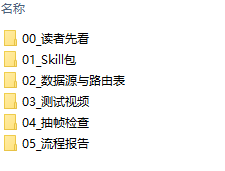

咨询讨论请加：  HPwangtang

---

本文最初发布于微信公众号「AI应用实战派PRO」。未经特别说明，正文与配图采用 [CC BY-NC-ND 4.0](https://creativecommons.org/licenses/by-nc-nd/4.0/deed.zh-hans) 许可。
