# 如何提高 Codex 的审美? 这五种方法让你的 Codex 审美提高一个档次

> 作者：旺哥 · 公众号：AI应用实战派PRO  
> [查看微信公众号原文](https://mp.weixin.qq.com/s?__biz=MzY4NDA4MDUwMA==&mid=2247484533&idx=1&sn=cc152a93792d47b4d127538878af3200&chksm=f254e6a39b5f392f22be8399ac7e569fb74b131ca8d3f064349035ad7bd68366a2676953f344#rd)
> [下载 HTML 图文包（含图片）](https://github.com/wangge-dev/wangge-articles/releases/download/html-archive/202607131629.zip) · [HTML 文件](../../html/2026/202607131629/article.html)

你如果也在为 Codex 审美发愁把这篇文章发给 Codex 就好！

OPENING

##  开始

我平时会用 Codex 做网页、工作台和 HTML
报告。功能基本上都能做出来，但是审美一言难尽，Codex就像一个理工科，干活嘎嘎猛，但是前端审美和文案书写就有点直男了。所以本篇文章来讲一下怎么提高或者优化
Codex 的审美.

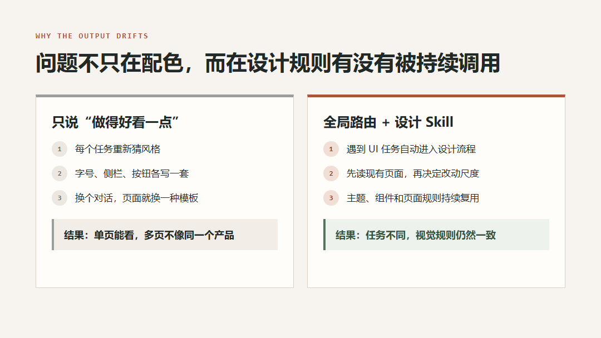
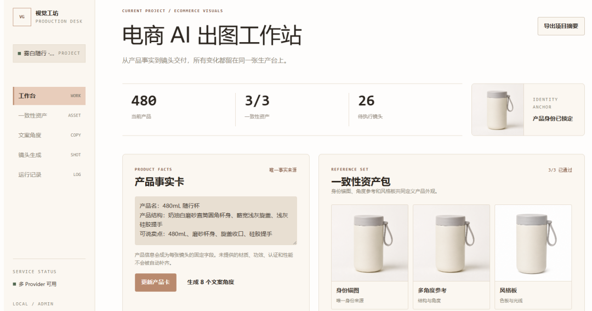

** 我最后整理出 5 种方法。  ** 第一种可以直接拿去用，后面四种适合继续补充自己的设计规则和参考素材。

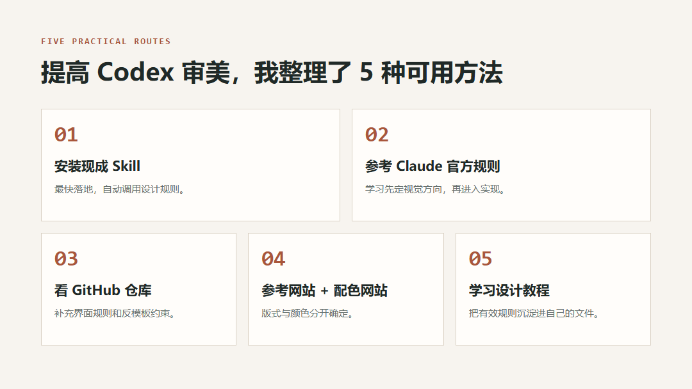

METHOD 01

##  直接安装我整理好的 Codex 设计 Skill

这是最省事的办法。我已经把设计规则、自动调用方式和安装说明整理成了一个分享包。  由于每个人的审美不同，先说明一下我这里主要借鉴了Claude的审美！

我现在在开发的一个作图的工作站以及电商智能工作台，Codex第一版做的很快，干活能力很强，但是审美一言难尽，满满的ai味：

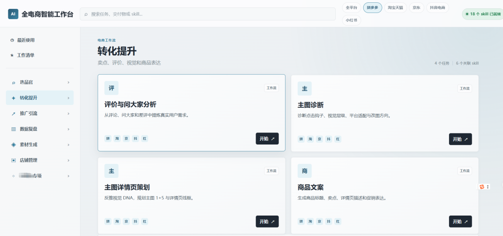

现在用我这个分享包里skill优化之后：

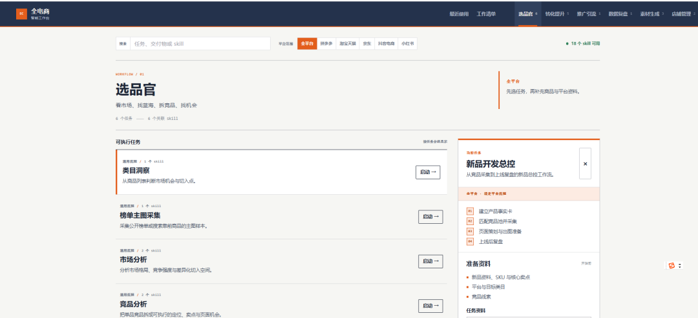

还是有点提升的吧！

再来看一个对比：

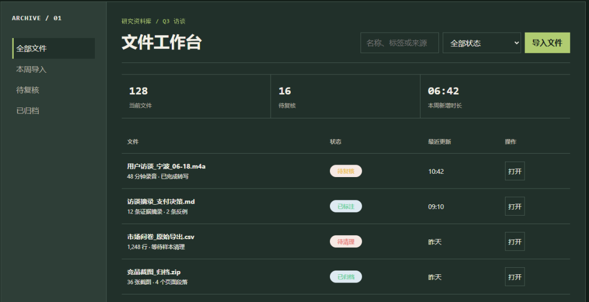

优化后：

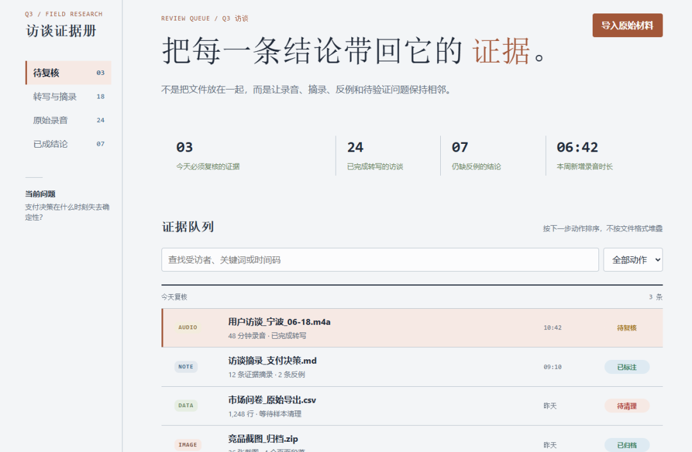

下面说回分享包，分享包里主要有两部分：  在评论区

AGENTS-route.md frontend-design-system/

** frontend-design-system  ** 是设计 Skill，里面放完整的前端设计规则。  ** AGENTS-route.md  **
负责告诉 Codex：只要遇到网页、配色、排版、组件、后台或截图参考，就自动调用这个 Skill。

Windows 用户把 Skill 文件夹放到：

C:\Users\你的用户名\.codex\skills\frontend-design-system

再把  ** AGENTS-route.md  ** 里的内容追加到：

C:\Users\你的用户名\.codex\AGENTS.md

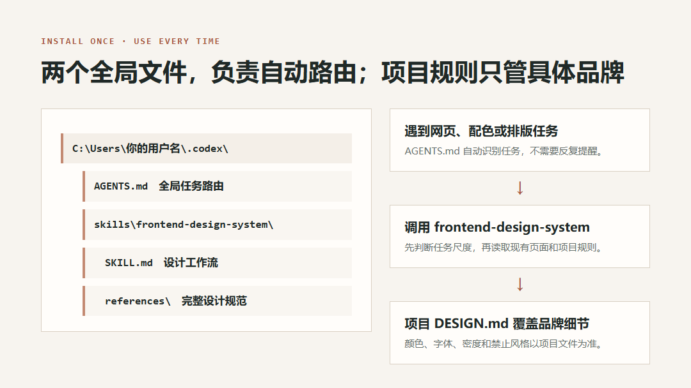

装好以后，新任务直接说：

把这个页面的配色、字号和信息层级统一一下，保留现有功能。

** 不需要每次再说“先读取 DESIGN.md”。  ** Codex 会自动进入设计 Skill。

如果某个项目有固定品牌，再在项目根目录放一份  ** DESIGN.md  ** 。里面写颜色、字体、目标用户、信息密度、参考图和禁止风格即可。全局
Skill 负责通用方法，项目文件负责具体品牌。

如果你还是不会装，把本篇文章丢给codex或者workbuddy也行！

METHOD 02

##  参考 Claude 官方的 frontend-design

如果想自己整理规则，可以先看 Anthropic 官方公开的 frontend-design。

https://github.com/anthropics/skills/blob/main/skills/frontend-design/SKILL.md

这份文件不长（一页多），重点很明确：写代码前先确定页面服务谁、视觉方向是什么、这次页面靠什么和通用模板拉开差别。字体、颜色、布局和动效都要围绕同一个方向，把"大胆"集中花在一个签名元素上，其他部分保持克制。

它还点名了三种最常见的 AI 默认审美，让 AI
主动避开：暖米色底配衬线加陶土色、近黑底配荧光绿或朱红、报纸风的发丝线加零圆角密集分栏。这些风格本身不差，问题是 AI 在没有明确 brief
时会条件反射地套上去。

可以把其中关于视觉方向、字体、结构、动效和反 AI 默认审美的规则，整理进自己的  ` frontend-design-system  ` 。  **
注意它只提供方法论，不给素材和配色  ** ，实际项目里还要配合你自己的截图参考和色板才能落地。

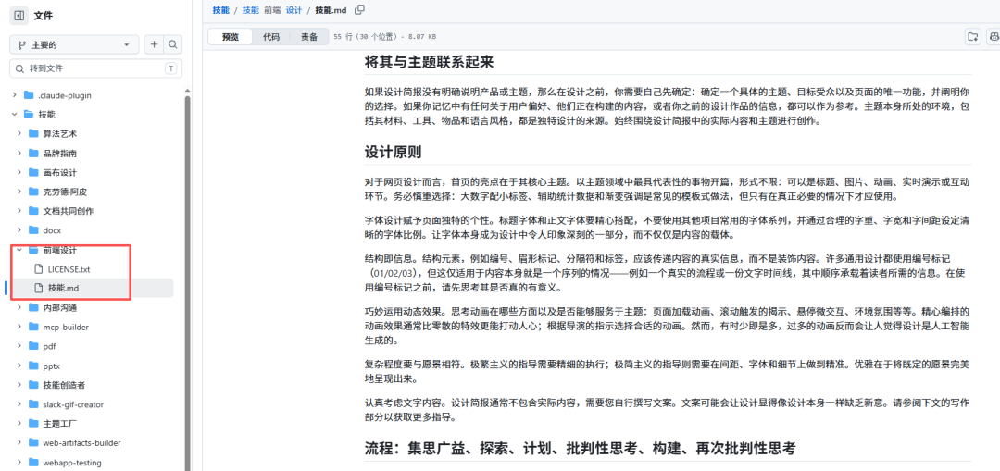

METHOD 03

##  参考 GitHub 上的前端审美仓库

除了 Claude 官方 Skill，GitHub 上还有一些已经整理好的设计规则。我筛选时主要看三点：  **
适用场景是否清楚、有没有反模板规则、有没有实际页面检查。  **

Vercel Web Interface Guidelines

适合检查表单、焦点状态、移动端、长内容、溢出和可访问性。

https://github.com/vercel-labs/web-interface-guidelines

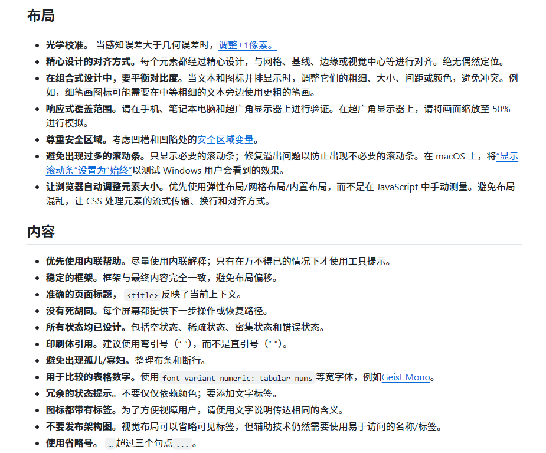

frontend-design-principles

区分工作台和营销页，适合补页面类型判断。

https://github.com/joshuadavidthomas/agent-skills/blob/main/frontend-design-
principles/SKILL.md

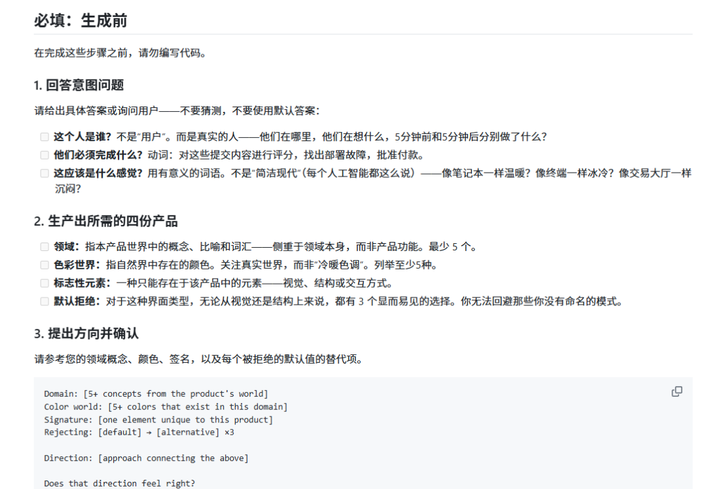

taste-skill

偏营销页和图像主导页面，可以参考它对卡片堆叠、紫蓝光效和常见首屏的限制。

https://github.com/Leonxlnx/taste-skill

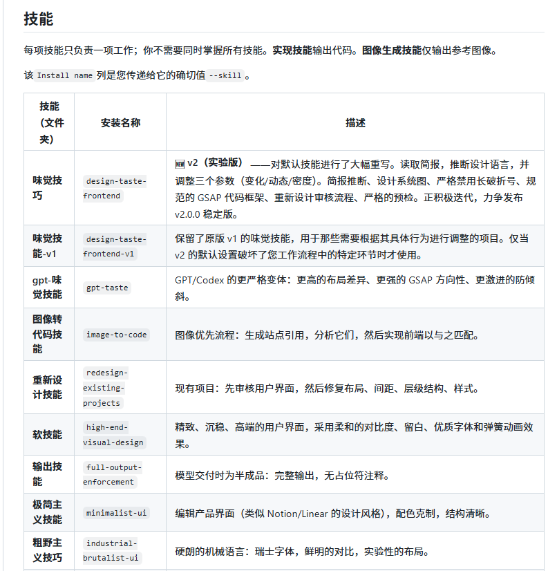

这些仓库不必整包复制。找到适合自己业务的规则，再补进现有 Skill。  ** 营销页、运营后台和电商工具的需求不同，规则越多不一定越好。  **

METHOD 04

##  先找设计参考，再单独确定配色

只用文字描述“高级、简洁、有科技感”，Codex 很容易回到熟悉的页面模板。更稳定的做法是先提供参考页面，让它知道大致长什么样，再单独提供颜色。

设计参考网站

** Mobbin：  ** 真实产品页面和操作流程，适合 App、后台和工作台。

https://mobbin.com/

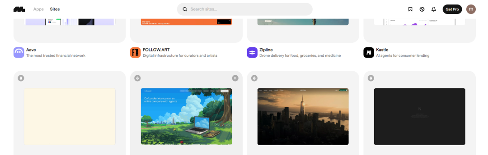

** Land-book：  ** 以网站和 landing page 为主，适合找版式、行业风格和首屏参考。

https://land-book.com/

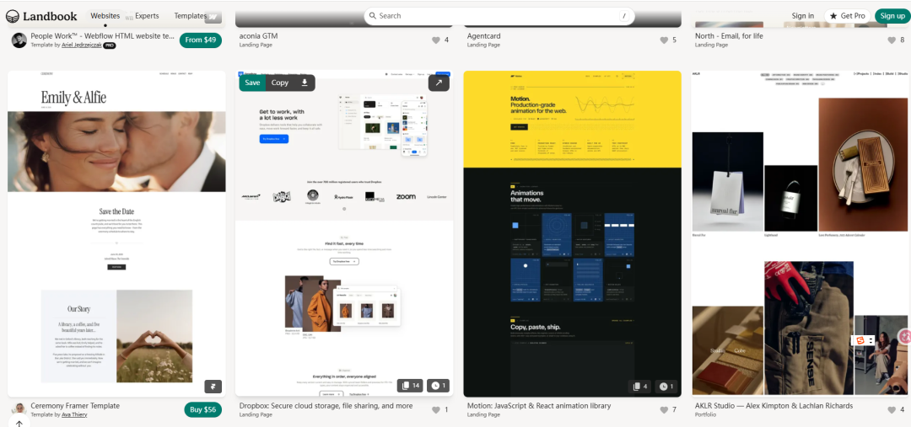

** Godly：  ** 偏实验性和视觉表现较强的网站，目前会跳转到 Recent.design。

https://recent.design/?ref=godly

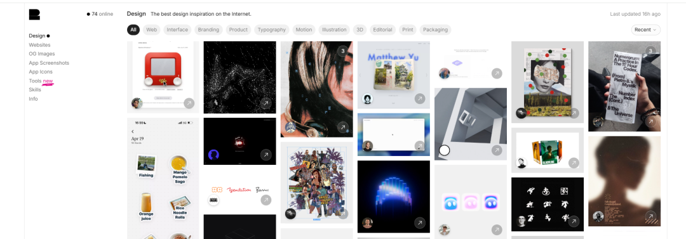

配色网站

** Radix Colors：  ** 成组的语义色阶，适合界面组件与状态色。  

https://www.radix-ui.com/colors

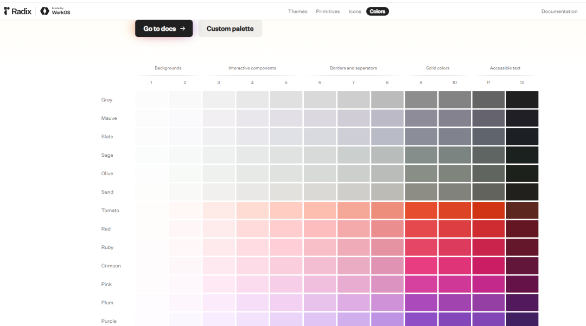

** uicolors：  ** 输入主色生成从浅到深的完整色阶，适合 Tailwind 项目。

https://uicolors.app/generate

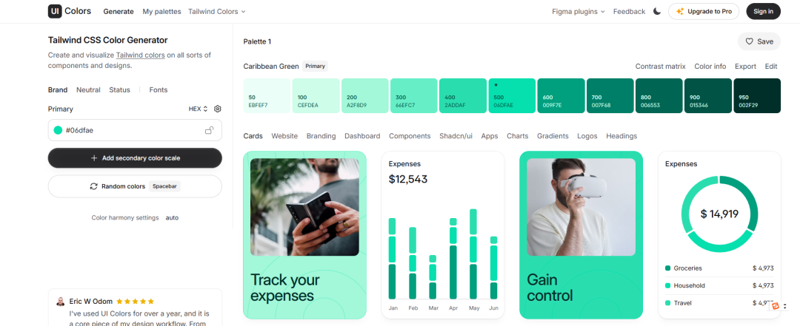

** Happy Hues：  ** 直接展示颜色在背景、正文、标题和按钮中的用法。

https://www.happyhues.co/

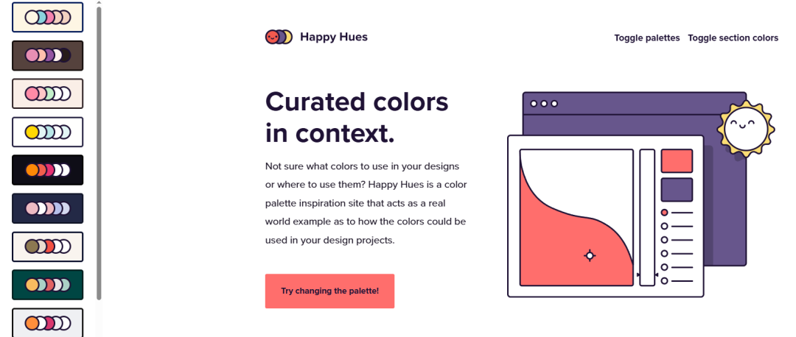

我的用法很简单：先从 Mobbin 或 Land-book 选一两个页面截图，确定版式和信息密度；再从 Radix Colors 或 uicolors
选颜色。  ** 参考图和色板分两次给 Codex，比把所有要求塞在一句话里更清楚。  **

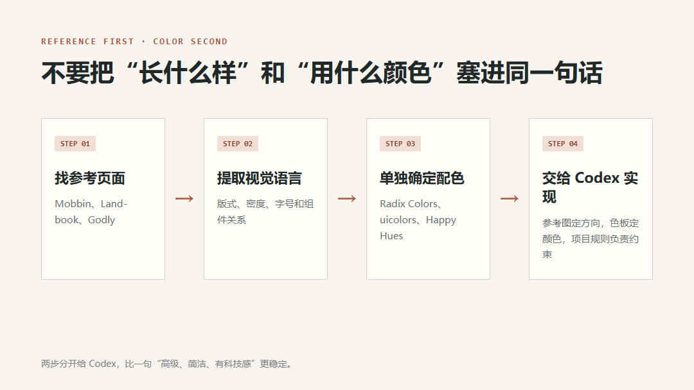

METHOD 05

##  看设计教程，把常用规则加进自己的文件

如果还想继续提高，可以看一些讲设计原理和细节的教程。这里也只留 3 个：

** Refactoring UI：  ** 内容偏实用，颜色层级、间距、阴影和文字层次都能直接用在界面上。
https://refactoringui.com/

** Rauno Freiberg：  ** 看他对交互、动效和界面细节的处理，适合补微小但影响质感的部分。  https://rauno.me/

** Cursor Directory：  ** 参考社区怎样约束 AI 写前端，再把适用部分改写成 Codex 的 AGENTS.md。
https://cursor.directory/

一本讲基础规则，一个看细节处理，一个看现成规则写法，已经够用了。看到有用的内容，记进自己的 Skill 或项目 DESIGN.md，后面做页面时会反复用到。

FINAL NOTE

##  先装起来，再慢慢补自己的规则

这几种方法不用一次全部上。想马上改善页面，先装现成 Skill；想继续调整，就看 Claude 官方规则和 GitHub
仓库；缺少具体画面时去参考网站；想长期提高，再看设计教程。

往期推荐：

[ 电商数据分析skill：输入一个商品链接自动生成多平台数据分析报告
](https://mp.weixin.qq.com/s?__biz=MzY4NDA4MDUwMA==&mid=2247484264&idx=1&sn=42827f909be64973162250ea15ac8232&scene=21#wechat_redirect)

[ 7000字教你从0开始用GPT-image-2搭建电商主图详情页（附完整教程和仓库地址）
](https://mp.weixin.qq.com/s?__biz=MzY4NDA4MDUwMA==&mid=2247483827&idx=1&sn=95d632b122a2df1f84239a34b7b06a26&scene=21#wechat_redirect)

[ AI+电商：我用 Codex 改造了一个数据分析工作流
](https://mp.weixin.qq.com/s?__biz=MzY4NDA4MDUwMA==&mid=2247484487&idx=1&sn=f08fe93d1f49e522c7a0a4e3cf439bf3&scene=21#wechat_redirect)

[ AI电商实战教程: 我用Codex + 6 个 GitHub 仓库，跑通了一套电商作图 SOP
](https://mp.weixin.qq.com/s?__biz=MzY4NDA4MDUwMA==&mid=2247484134&idx=1&sn=45b425bac946350285021aec0d703fe7&scene=21#wechat_redirect)

---

本文最初发布于微信公众号「AI应用实战派PRO」。未经特别说明，正文与配图采用 [CC BY-NC-ND 4.0](https://creativecommons.org/licenses/by-nc-nd/4.0/deed.zh-hans) 许可。
