# 我用 Codex 把电商 skill 搭成了一个工作台

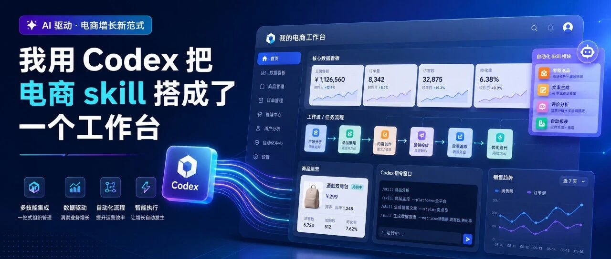

> 作者：旺哥 · 公众号：AI应用实战派PRO  
> [查看微信公众号原文](https://mp.weixin.qq.com/s?__biz=MzY4NDA4MDUwMA==&mid=2247484555&idx=1&sn=d2706993f77ec2cc4d89cc724370b023&chksm=f286b474fd77c6b843af7b3d6306658c952df38253d4fef19de14bcdca38505b3c03c3697000#rd)
> [下载 HTML 图文包（含图片）](https://github.com/wangge-dev/wangge-articles/releases/download/html-archive/202607151742.zip) · [HTML 文件](../../html/2026/202607151742/article.html)

ECOMMERCE SKILL · WORKSTATION

16 个电商 Skill

变成一套  可执行工作台

选品、转化、引流、复盘和素材任务  
放到同一个入口里

2026.07 · WORKFLOW NOTES

16 个  电商 Skill  23 个  任务入口  5 类  电商工作

OPENING

##  为什么做这个工作台

最近我专门整理了一遍电脑里的电商 Skill。

有的负责类目洞察，有的分析竞品和评论，有的诊断主图，还有一些用于商品文案、标题优化和电商出图。随着数量增加，具体工作中容易出现几个问题：该用哪个、需要准备什么、最后能拿到什么。

所以我让 Codex 把这些能力重新梳理了一遍，并做成了一个可以直接执行任务的本地工作台。备注  Workbuddy  也可以做的哦

现在，我自己的版本里整理了  ** 16 个电商 Skill  ** ，组合成  ** 23 个任务入口  **
，按选品与市场、转化提升、推广引流、数据复盘、素材生成五类工作来使用。

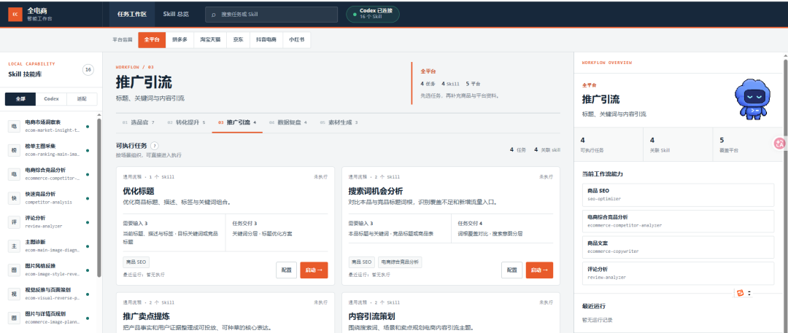
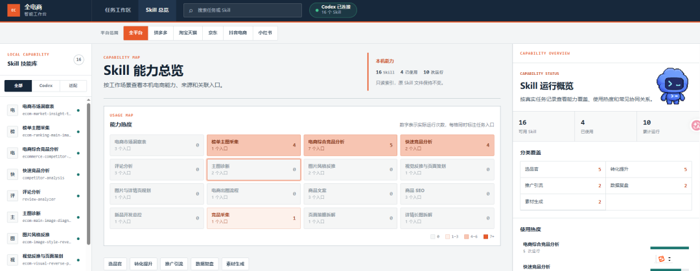

打开一个任务，可以看到需要准备的资料、会调用哪些能力、执行步骤和预期结果。点击启动后，工作台会调用本机 Codex
执行，完成后可以直接复制结果，也可以打开报告或任务文件夹。

这个工作台主要解决三个实际问题：

• 不需要记住一串英文 Skill 名称

• 开始前就能看清输入资料和交付结果

• AI 完成后，结果可以直接找到和继续使用

01

##  先看它能做什么

工作台里的任务不是按技术名称排列，而是按日常电商工作来组织。

做选品时，可以进入类目洞察、榜单主图采集、市场分析和竞品分析；做转化时，可以分析评论与问大家、诊断主图、策划主图详情页、生成商品文案；做推广和复盘时，也有标题优化、搜索词机会、商品表复盘和竞品周期复盘等入口。

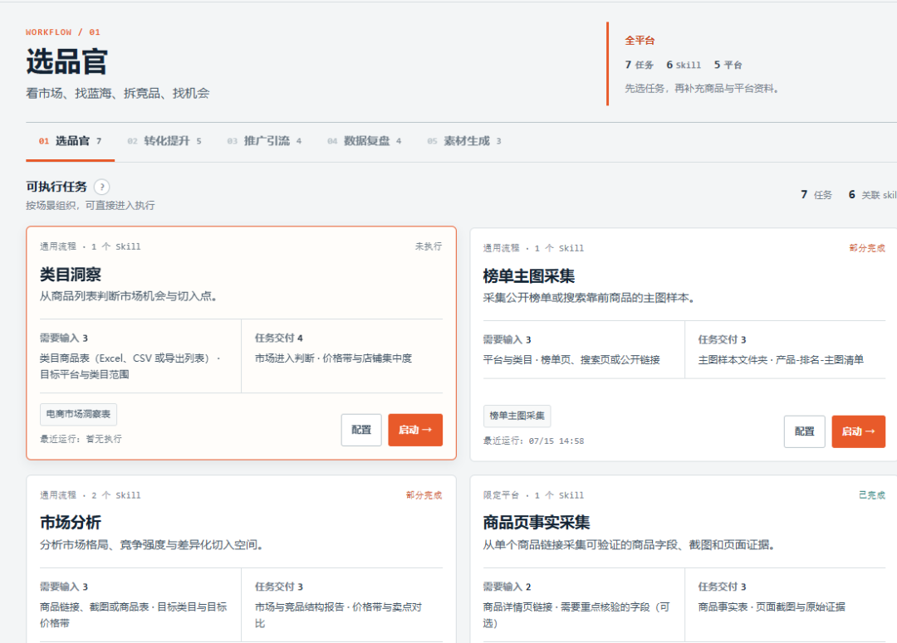
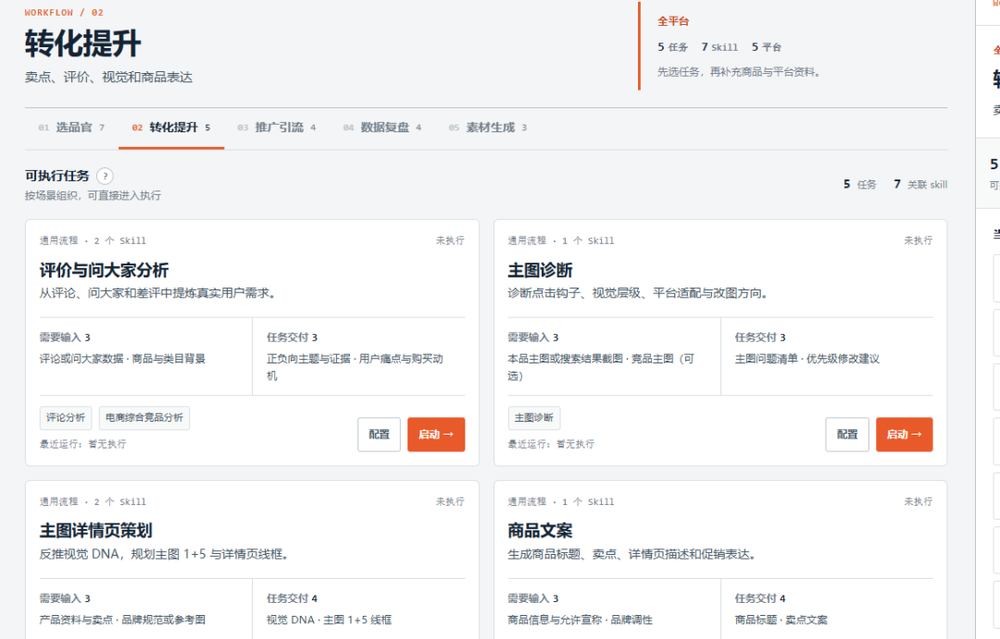

比如“榜单主图采集”，需要填写平台、类目、公开榜单页或搜索页，以及采集数量。执行后会整理主图样本、商品与排名清单，并生成一份可查看的拆解报告。

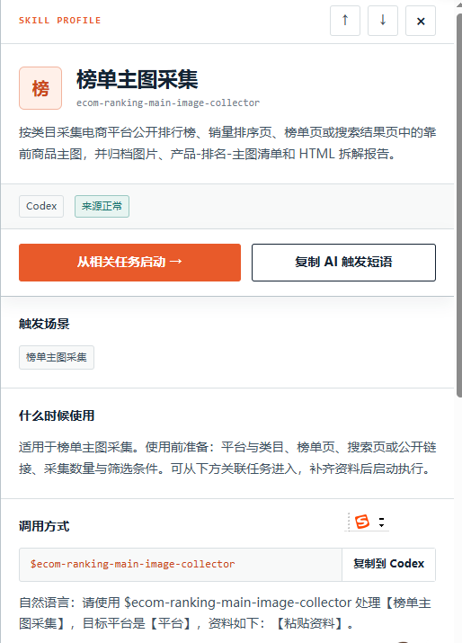
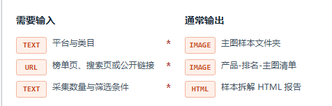
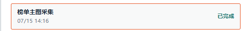

榜单主图采集任务生成的样本拼图

再比如“主图诊断”，需要提供当前主图或搜索结果截图。它会检查点击钩子、视觉层级、竞品差异和平台适配，最后给出问题清单、修改优先级和 A/B 测试建议。

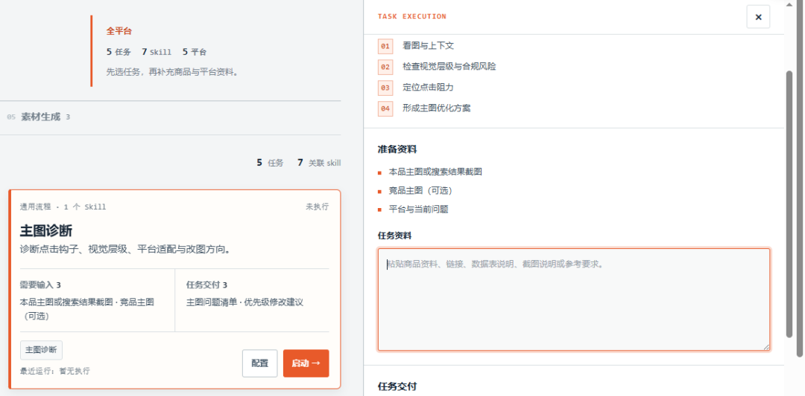

同样是“给 AI 一张图”，如果没有任务说明，运营往往还要自己组织一大段提示词。工作台把这些准备动作写到了页面上，小白也能知道下一步该给什么资料。

02

##  工作台的创建过程

整个创建过程分为五步。先盘点电脑里的电商 Skill，再识别相近能力，随后按照电商工作分类，并为每个任务补齐输入、流程和结果，最后接通本机 Codex
执行。

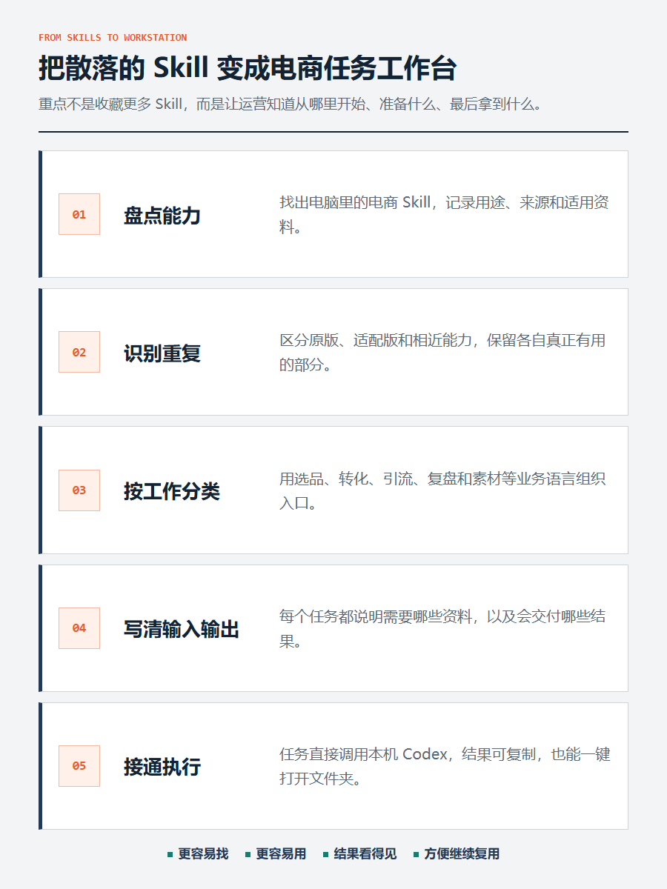
整理前按 Skill 查找，工作台按电商任务选择
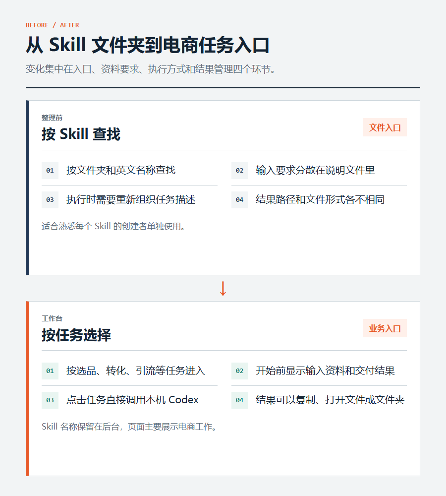

###  第一步：先盘点，再决定保留什么

先把电脑里的电商 Skill 找出来，记录名称、用途、来源、需要的资料和典型结果。

这一步不能只看文件夹名。有些 Skill 名称不同，实际解决的是同一类问题；也有些看起来相近，但一个适合快速分析，一个适合做完整报告。

Codex 和 WorkBuddy 里也存在这种情况。有些 WorkBuddy Skill 是对同类能力的适配版，  不适合看到重复就直接删除
。更合适的处理方式是看它们在任务里承担什么角色：能互补就组合，完全重复再合并。

###  第二步：按照电商工作分类

页面不让使用者先理解技术名词，而是先展示熟悉的工作：

• 选品与市场

• 转化提升

• 推广引流

• 数据复盘

• 素材生成

运营看到“竞品分析”“评价分析”“主图诊断”，就能判断应该从哪里开始。至于背后调用哪个 Skill，可以交给工作台处理。

###  第三步：每个任务都写清输入和结果

每个任务都要回答四件事：  适合解决什么问题、开始前准备什么、会调用哪些能力、最后能拿到什么结果。

对小白来说，“请提供商品表、竞品截图或评论数据”比 Skill
的英文名称更直接。页面同时写清“会生成竞品矩阵、价格带分析和机会建议”，也方便在执行前确认任务是否合适。

###  第四步：工作台不只导航，还要能执行

如果点击任务以后只生成一段文字，再让人复制到 Codex，它仍然只是一个任务说明页。

当前版本会直接调用本机 Codex。任务启动后，执行状态、过程消息、最终结果和文件路径都能在页面里看到。

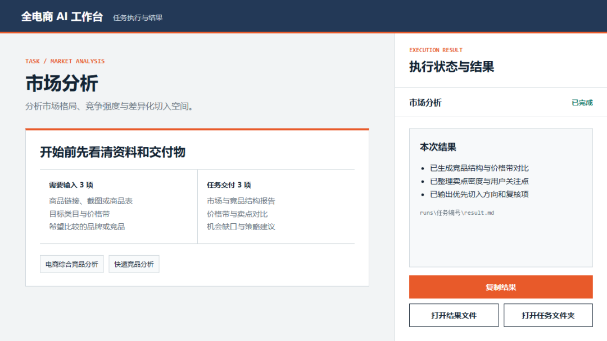
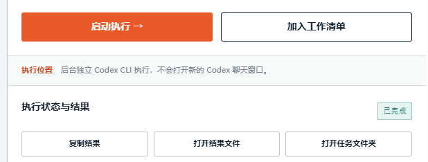

执行结果可以复制，也可以直接打开文件和任务目录

结果区域增加了复制按钮，长文本可以直接带走；报告和文件夹也提供打开按钮，不用再去硬盘里逐层查找。

###  第五步：把使用条件写在任务前面

电商任务很容易受到平台登录、验证码和数据完整度影响。

一个商品链接不一定能直接得到标题、价格、销量和评论，也不能代表整个市场。要做可靠的类目和竞品分析，最好提供商品表、页面截图，或 3 至 10
个可以比较的竞品样本。

工作台可以减少操作，但不能补全缺失数据。价格、销量、功效宣称和平台规则，正式使用前仍要人工复核。

03

##  实际怎么用

日常使用可以简化为四步：

** 01  ** 选择平台和工作分类

** 02  ** 选择任务，查看输入和交付结果

** 03  ** 补充商品表、评论表、图片或链接

** 04  ** 启动任务，复制结果或打开文件夹

不同任务的资料应该分开保存。商品链接只适合链接采集和竞品类任务，主图诊断应该上传图片，类目洞察应该上传商品表。工作台会为每个任务保存自己的资料，不会把一个天猫链接自动带到所有任务里。

04

##  本地版怎么使用

当前版本运行在本机，地址是  127.0.0.1  。这表示工作台运行在自己的电脑上，并不是公开网站。

分享包安装到另一台电脑后，工作台调用的是  ** 那台电脑上的 Codex  ** ，读取的也是本机 Skill 和任务资料，不会远程调用分享者电脑上的
Codex。

如果需要多人打开同一个网址，可以继续改成服务器版，并接入统一的账号、权限和模型费用管理。执行部分也可以换成其他大模型 API。这里交给
workbuddy或者codex  改就行了。

大模型 API 主要负责理解和生成。  网页采集、浏览器登录、表格处理、图片归档和本地文件输出，还需要对应的工具执行能力  。只把 Codex
换成一个聊天接口，不能自动完成全部电商工作。

05

##  怎么获取分享包

最近搞了一个  AI  \+  电商  VIP实战群，里面干货满满，这些分享包以及后面的重磅干货教程和分享包都可以在群里直接拿来用，还有下面的
耗费了大量精力打造的  专家团。

咨询请加：  HPwangtang

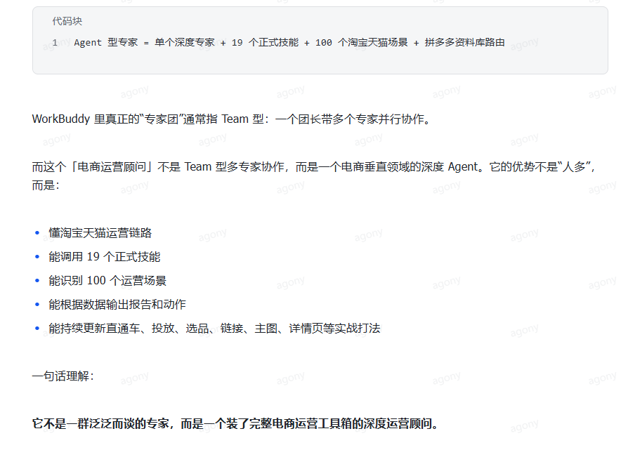
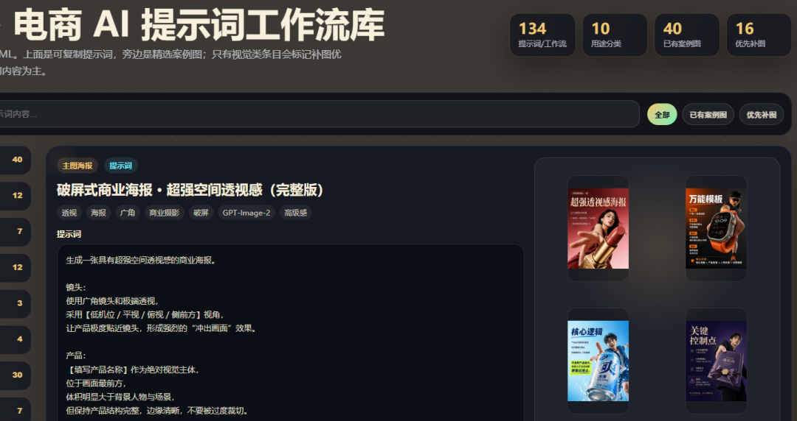

分享包内容：

• 可直接运行的全电商 AI 工作台

• 12 个通用电商 Skill

• 一键安装、启动和卸载脚本

• 面向小白的中文使用说明

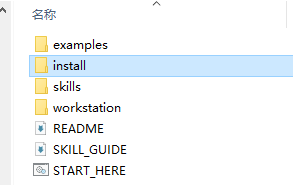

解压后双击  START_HERE.cmd  即可安装。首次使用前，需要确保电脑已经安装并登录 Codex，详细要求和常见问题都写在 README 里。

AI 应用实战派 PRO

觉得本文还不错，赶紧点赞收藏吧。

关注我，还有更多精彩文章和教程。

我是  AI 应用实战派pro  ，只聊落地，不讲虚的。

---

本文最初发布于微信公众号「AI应用实战派PRO」。未经特别说明，正文与配图采用 [CC BY-NC-ND 4.0](https://creativecommons.org/licenses/by-nc-nd/4.0/deed.zh-hans) 许可。
