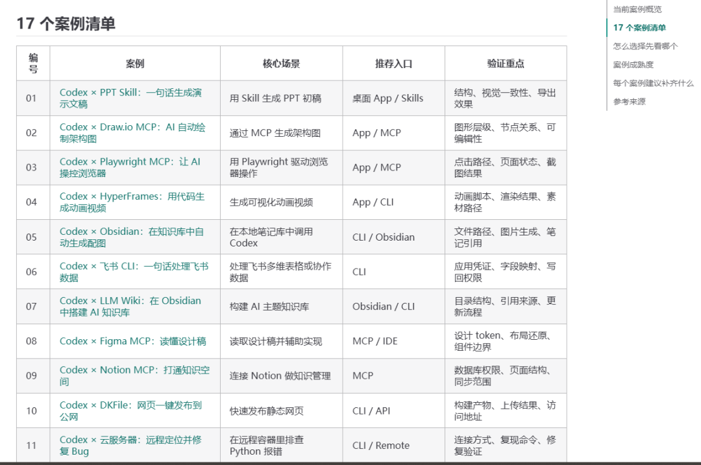
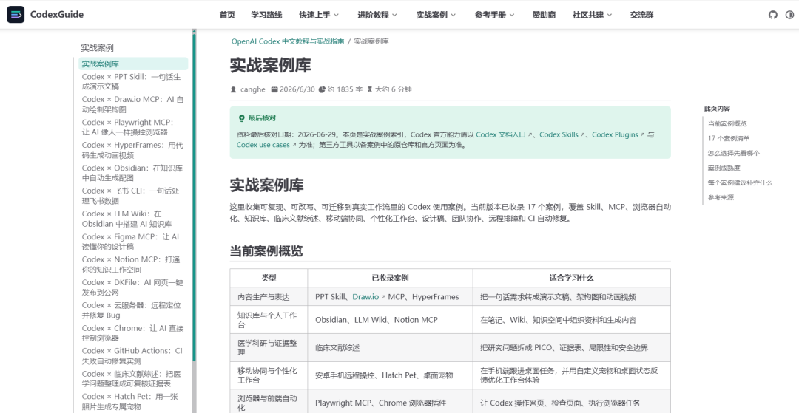
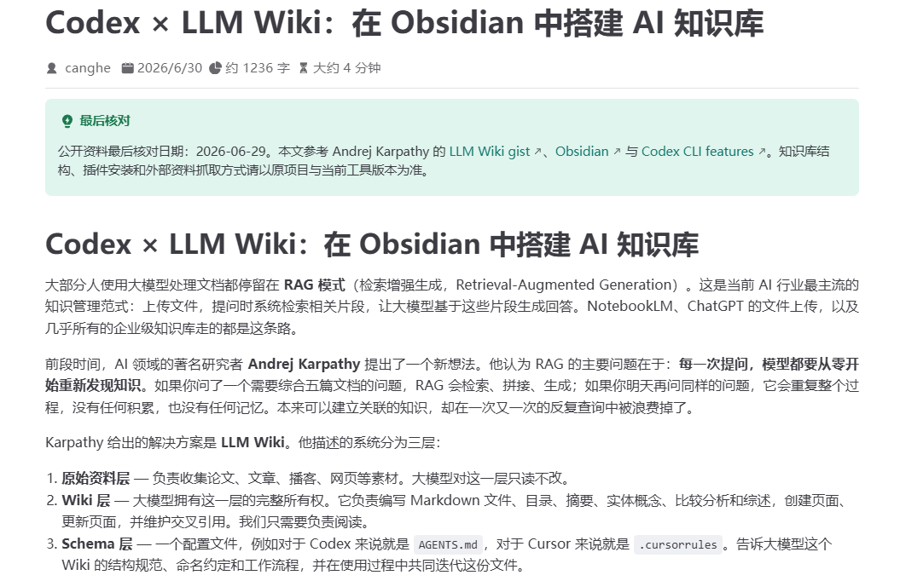
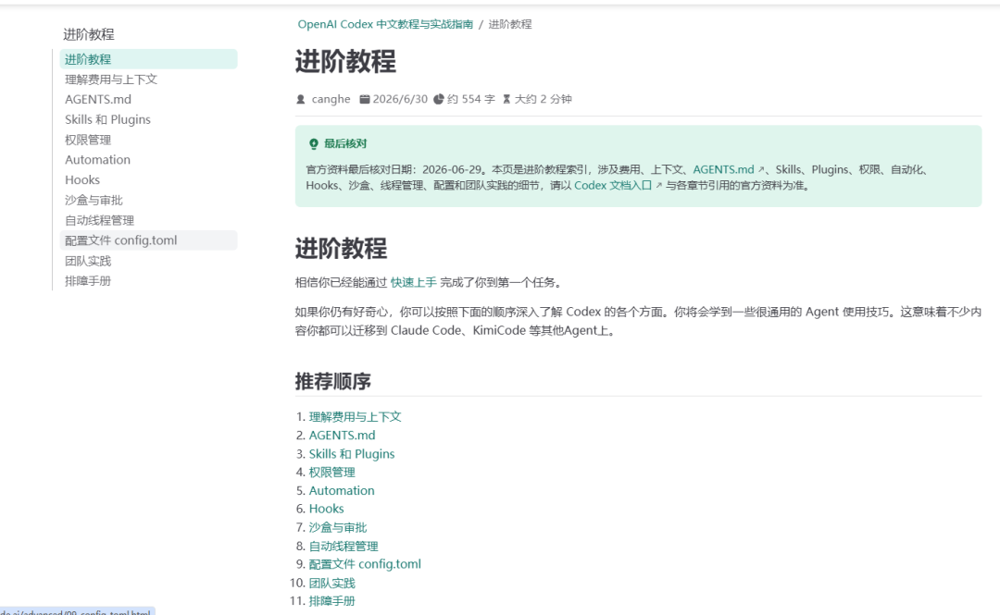

# 这个网站让你学透 Codex：从账号注册准备到实战全流程

> 作者：旺哥 · 公众号：AI应用实战派PRO  
> [查看微信公众号原文](https://mp.weixin.qq.com/s?__biz=MzY4NDA4MDUwMA==&mid=2247484571&idx=1&sn=97987fdf31417d0ca094aebaa7553cb0&chksm=f291fb2e97e1945e116907462b1f1803d301bf5602c378419a9a735232994f185d2c0df398b1#rd)
> [下载 HTML 图文包（含图片）](https://github.com/wangge-dev/wangge-articles/releases/download/html-archive/202607172031.zip) · [HTML 文件](../../html/2026/202607172031/article.html)

最近 Codex
实在太火了，关于codex的教程网上也很多，但是很少有一个网站或者教程能把codex的注册到实战全讲清楚，这不今天发现一个专门讲Codex网站：
https://codexguide.ai

这个网站把codex的方方面面几乎都讲清楚而且还在不断更新，包括最近比较火的  如何设置自己的 Codex 桌面宠物。竟然也有。

#  下面简单介绍一下有什么：

#  学习路线：

快速上手：

实战案例：

#  进阶教程：

#  对AI之王 Codex 感兴趣的赶紧去尝试一下吧!

---

本文最初发布于微信公众号「AI应用实战派PRO」。未经特别说明，正文与配图采用 [CC BY-NC-ND 4.0](https://creativecommons.org/licenses/by-nc-nd/4.0/deed.zh-hans) 许可。
