# 用国产之光 ：Workbuddy 搭建了一个AI+电商运营顾问团

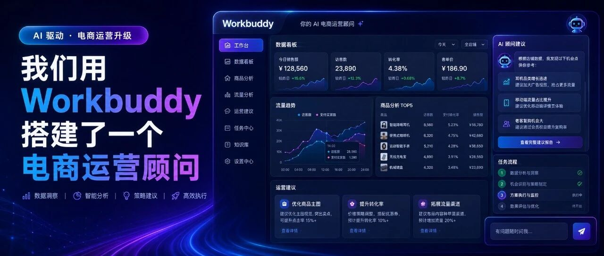

> 作者：旺哥 · 公众号：AI应用实战派PRO  
> [查看微信公众号原文](https://mp.weixin.qq.com/s?__biz=MzY4NDA4MDUwMA==&mid=2247484611&idx=1&sn=7fc748119ec0a02dfef2c5c1b3a38a79&chksm=f2fd29c7aae967d0910c17ecb03ccc7f7b51fd28ee9f6cd7fb734386efab815c6b5c1eb768eb#rd)
> [下载 HTML 图文包（含图片）](https://github.com/wangge-dev/wangge-articles/releases/download/html-archive/202607241828.zip) · [HTML 文件](../../html/2026/202607241828/article.html)

今天来给大家分享一个我和15年电商老兵用 Workbuddy 搭建的 AI+ 电商运营顾问团,整个搭建过程全程使用Workbuddy ，不得不说
workbuddy 越来越好用了，  简直是国产之光，如果你用不了codex也可用  Workbuddy
代替的，每天还额外赠送积分，最近的HY3还可以免费白嫖，太香了！

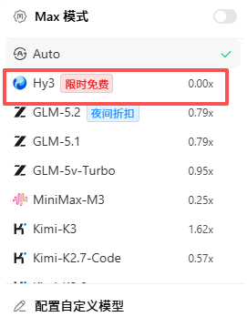
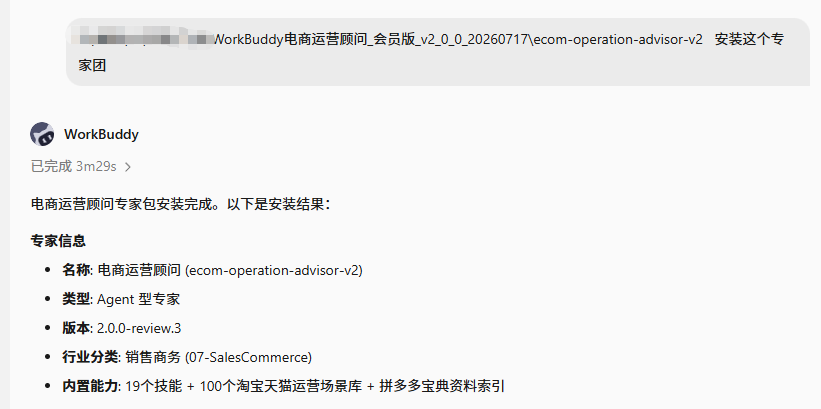

1

专家团能干什么

我们这个「电商运营顾问」不是普通聊天机器人，也不是一堆提示词合集。它更像一个运营总控专家——你说问题，它先判断你卡在哪个运营阶段；你给数据，它调用对应技能跑报告；你没数据，它先给你判断路径和下一步动作。

一句话理解：你不用懂技能目录，只要说你现在的电商问题，它会判断阶段、匹配技能、输出动作方案。

核心逻辑：先判断链路，再调用技能

电商从 0 到打爆，不是想到哪做到哪。顾问会先判断你属于哪条运营链：

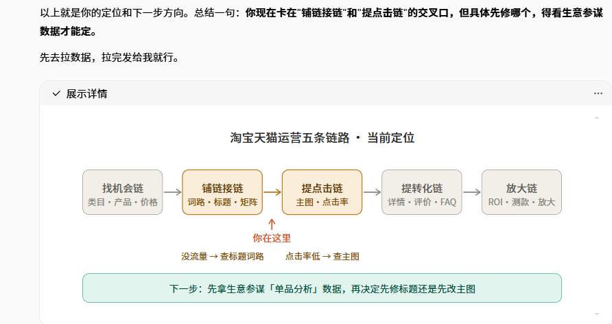

19 个正式技能，按链路分组

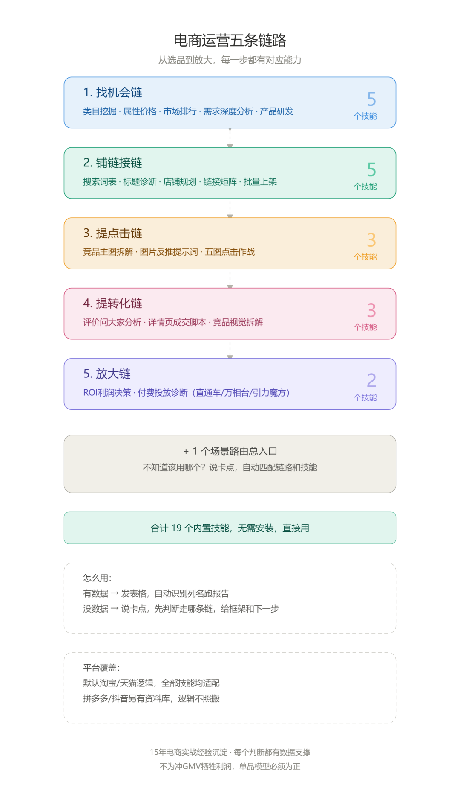
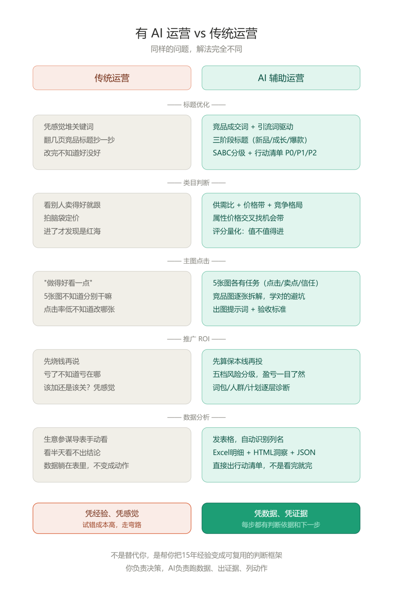
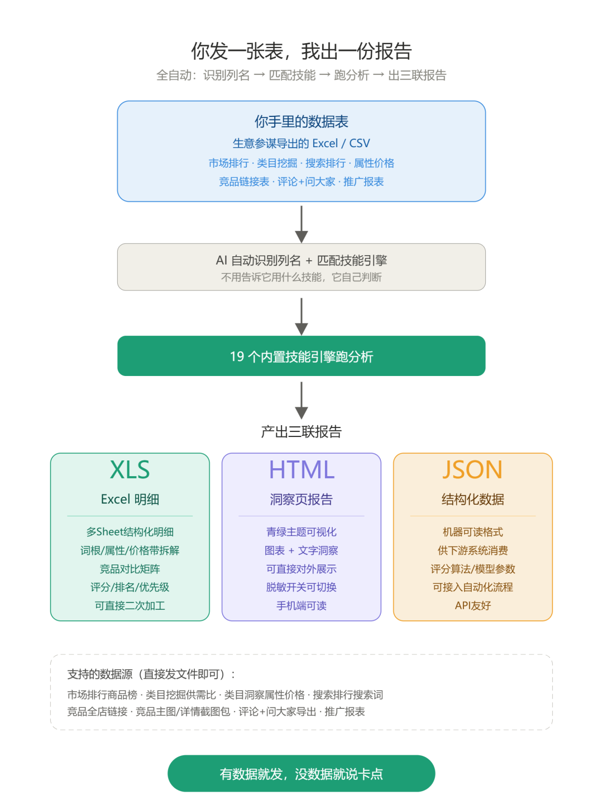
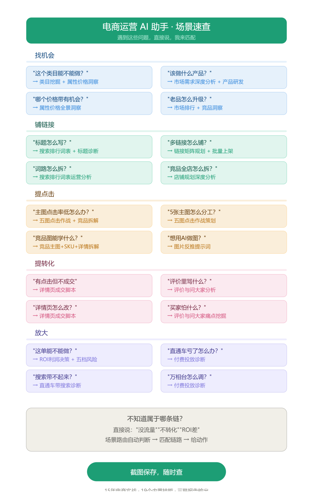

100 个场景映射库

除了 19 个正式技能，专家还内置 100
个淘宝天猫运营场景模板。当你说一个具体问题时，它会自动匹配场景，给你链路判断、需要补充的信息、该看的指标、可以先做的动作。

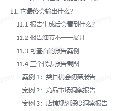 板块  |  适合问什么问题  |  示例问法
---|---|---  
搜索流量与标题关键词  |  标题、词根、关键词库、搜索流量  |  调用001，帮我做标题词根拆解   
商品页与主图详情  |  主图、详情页、SKU、商品页转化  |  我的商品有展现但点击率低   
店铺装修与活动承接  |  首页、分类、活动承接页、店铺动线  |  我的店铺首页怎么规划承接路径   
生意参谋与数据诊断  |  店铺诊断、单品诊断、流量渠道、转化漏斗  |  用033生意参谋店铺诊断   
直通车万相台与付费投放  |  直通车、万相台、引力魔方、ROI  |  直通车 ROI 不稳怎么复盘   
大促活动与价格策略  |  618、双11、优惠券、价格毛利、库存  |  这个活动价还能不能报   
客服售后与评价问大家  |  售前话术、催付、退款、差评、买家秀  |  帮我写一套售前客服话术   
逛逛内容直播与种草  |  图文笔记、短视频、直播脚本、达人Brief  |  帮我写淘宝短视频脚本   
会员私域与复购CRM  |  会员分层、老客复购、短信、私域SOP  |  老客复购怎么做   
规则合规与运营总控  |  规则、资质、广告法、版权、侵权、SOP  |  帮我检查这段文案有没有广告法风险   
  
关键差异化：这些技能不是简单模板拼接，而是把 15
年电商运营经验拆成不同场景的判断逻辑。每一个技能的报告内容、分析重点和输出结构都会不同。数据分析技能会输出「Excel明细 + HTML洞察页 +
结构化JSON」三联报告。

2

实战案例一：一个淘宝链接的完整诊断

下面以一个真实的淘宝链接为例，展示从"不知道问题在哪"到"拿到可执行方案"的完整流程。

案例背景：淘宝店，产品是乌梅三焦膏（养生膏类目），链接已上架，有访客但搜索流量低、点击率低。店主不知道该先改标题还是先改主图。

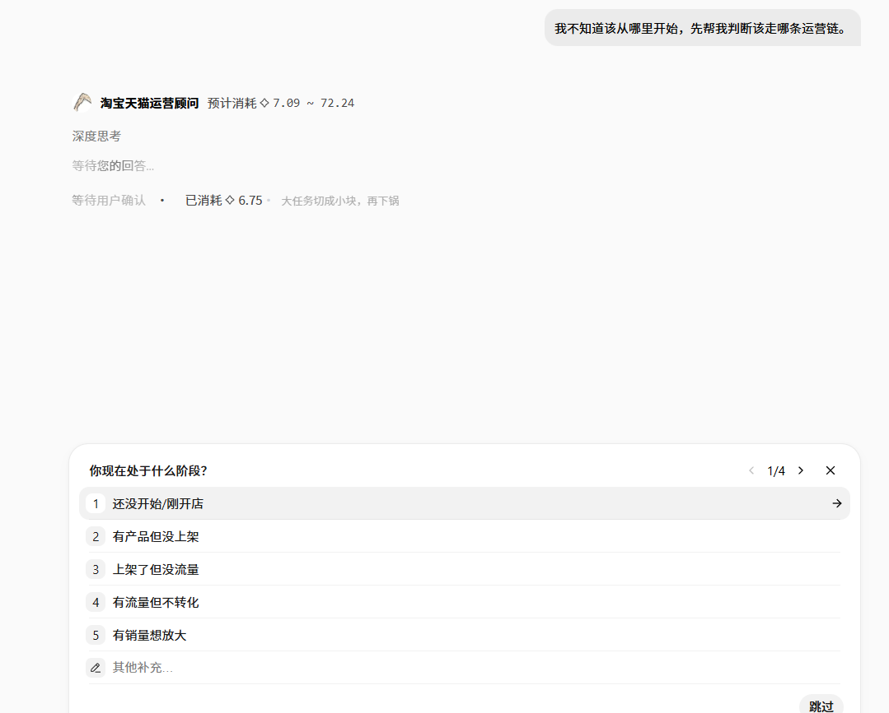

第一步：定位——你卡在哪条运营链

不需要先搞懂技能目录，直接说卡点：

"我不知道该从哪里开始，先帮我判断该走哪条运营链。"

通过几个关键问题（阶段、平台、数据情况、最痛指标），快速定位：

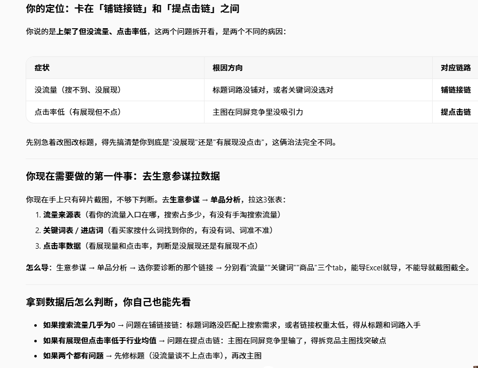  判断维度  |  情况  |  对应链路
---|---|---  
店铺阶段  |  链接已上架，有访客但增长乏力  |  运营中期   
最痛指标  |  搜索流量少、点击率低  |  铺链接链 + 提点击链   
平台  |  淘宝/天猫  |  按淘系逻辑诊断   
  
定位结论：卡在「铺链接链」和「提点击链」的交叉口。要先看数据判断是"没展现"（标题词路问题）还是"有展现不点"（主图问题），这俩治法完全不同。

第二步：准备数据——做这种诊断需要什么

数据类型  |  用途  |  重要性   
---|---|---  
选词助手-引流搜索词  |  看买家搜什么词进店、各词转化率  |  核心   
商品二级来源-无线流量来源  |  看流量结构（搜索/推荐/付费占比）  |  核心   
商品360标题优化数据  |  看标题内各词30天访客和转化  |  核心   
当前完整标题文本  |  逐字拆解、比对高转化词位置  |  核心   
市场搜索排行-搜索词  |  看行业什么词搜索量大、转化高  |  加分   
市场排行-商品  |  看竞品格局、价格带、流量结构  |  加分   
所以我们去生意参谋后台下载相应的表格和截图，当然下面是演示，到时候你可以根据你的需求来给相应的数据！下面是参考

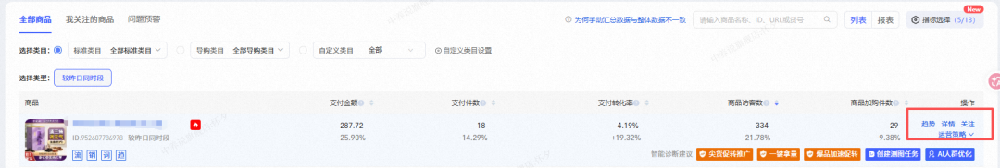
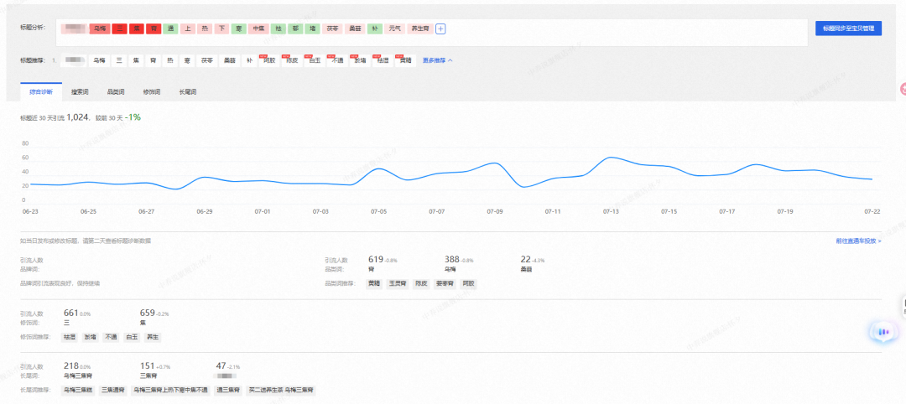

最小可用数据组合：只要前4项，就能做出方向性判断和一版标题优化方案。后面2项用于做更深度的市场分析。

第三步：流量结构诊断——问题到底是什么

拿到数据后，先看流量结构：

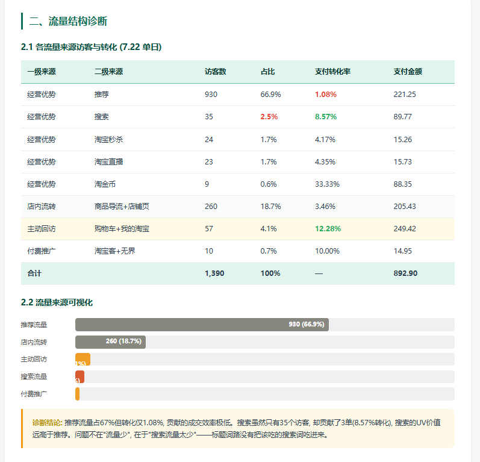

核心问题：不是"没流量"，而是"搜索流量太少"。搜索流量占比仅2.5%，但转化率是推荐流量的8倍。标题没有把高价值搜索词吃进来，导致链接依赖推荐流量"大而不精"。

第四步：搜索词价值分析——哪些词该留、该删、该加

判断标准只有一个：看数据，不要凭感觉。重点关注两个指标：访客数（有没有搜索量）和支付转化率（来了买不买）。

自有进店词 + 标题引流30天数据

类型  |  搜索词  |  30天访客  |  转化率  |  处理建议   
---|---|---|---|---  
核心成交词  |  乌梅三焦膏  |  218  |  29.82%  |  必须保留，放前面   
核心成交词  |  三焦膏  |  151  |  31.13%  |  必须保留   
高转化原料词  |  茯苓  |  17  |  58.82%  |  从标题尾部前移   
高转化原料词  |  桑葚  |  22  |  45.45%  |  从标题尾部前移   
低效占位词  |  补元气  |  0  |  0%  |  删除，无搜索无成交   
低效品类词  |  养生膏  |  8  |  —  |  「膏」字已覆盖，可精简   
  
市场搜索排行——行业里有什么机会词

搜索词  |  搜索人气  |  支付转化率  |  机会判断   
---|---|---|---  
调理脾胃  |  1万-2万  |  20%-25%  |  最大流量机会词，必须放进标题   
三焦膏  |  2500-5000  |  15%-20%  |  比乌梅三焦膏更大的品类词池子   
乌梅三焦膏  |  1200-2500  |  15%-20%  |  产品核心赛道，竞争小   
玉灵膏/茯苓膏  |  5000+  |  较高  |  红海，头部品牌垄断，不建议正面打   
  
机会结论：「调理脾胃」是养生膏类目中与乌梅三焦膏最相关的高价值大词——搜索量是「乌梅三焦膏」的8-16倍，转化率20-25%。标题中必须覆盖这个词。

第五步：标题优化方案——具体怎么改

优化前（30字）

XXX乌梅三焦膏通三焦上热下寒中焦祛郁堵茯苓桑葚补元气养生膏

优化后（28字）

XXX乌梅三焦膏调理脾胃通三焦茯苓桑葚中焦不通上热下寒膏

改动  |  说明  |  数据依据   
---|---|---  
新增  |  加入「调理脾胃」  |  市场搜索人气1万-2万，转化率20-25%   
前移  |  茯苓桑葚从第21-24位提到第14-17位  |  30天转化率茯苓58.82%、桑葚45.45%   
替换  |  「中焦祛郁堵」换成「中焦不通」  |  用户实际搜索「中焦不通」，长尾词转化50%   
删除  |  去掉「补元气」  |  选词助手30天数据为0，纯占位   
删除  |  去掉「养生」（保留「膏」）  |  「养生膏」仅8访客，「膏」字619访客已覆盖   
  
改标题原则：先覆盖核心成交词，再吃进市场机会词，再把高转化词往前挪，最后删掉无数据词。不要追求30字满，保留有效词更重要。

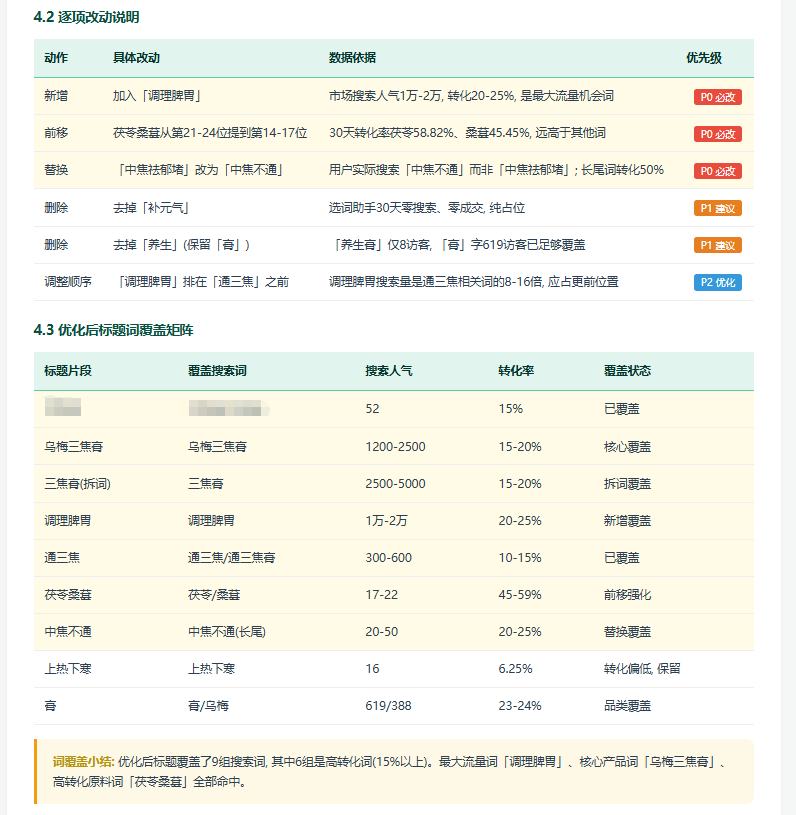

第六步：生成完整分析报告

当核心数据都齐全后，顾问可以输出一份结构化的HTML分析报告，包含7个章节：

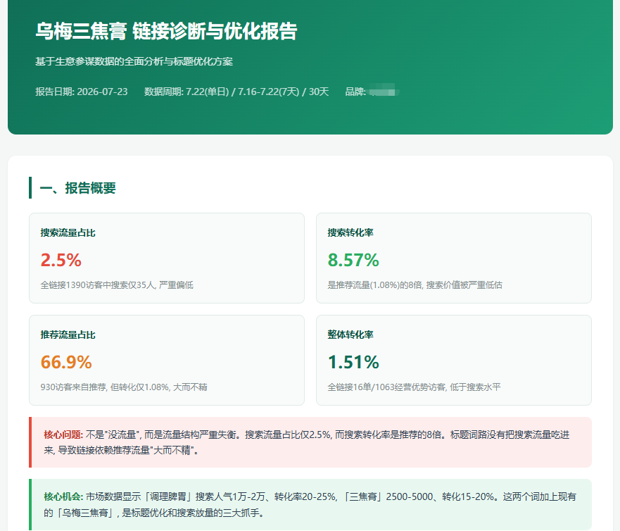

最终行动清单

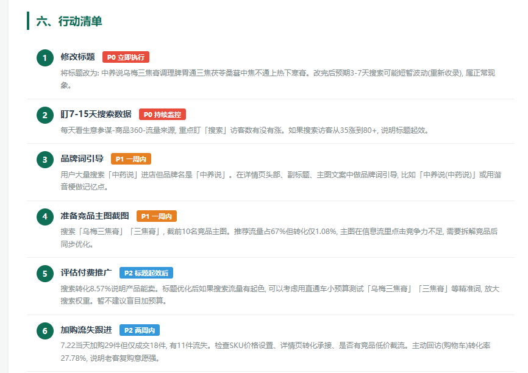

预期波动：改标题后3-7天搜索可能短暂下降，这是平台重新收录的正常过程。不

要看到短期波动就立即改回去，至少观察7-15天。

3

实战案例2：直通车测算

来一个模拟简单的测算：
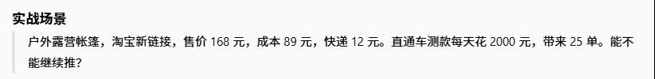
当然里面的功能远不止，这里举个简单例子，由于篇幅有限，本篇文章只举一个实战案例，剩下的大家拿来完整的顾问团之后自己探索吧！  跑完的诊断：
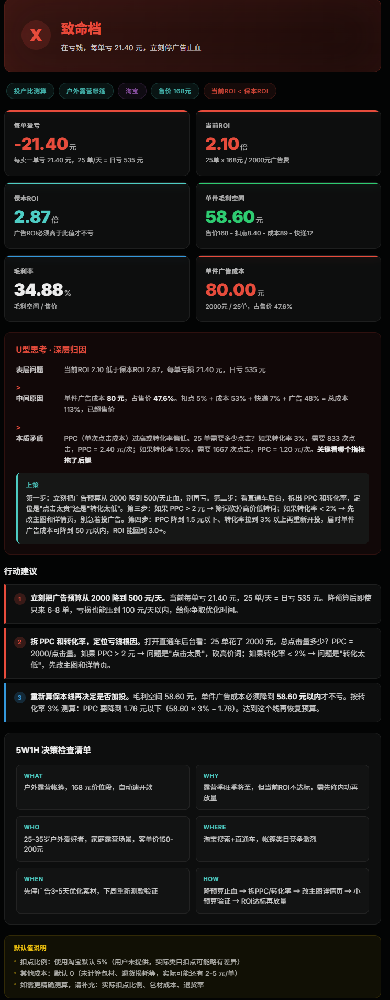

4

分享包：3个可独立使用的分析技能

第一个案例展示了顾问的核心能力。现在，我们从这次诊断过程中提炼出 3
个独立的、可单独安装使用的分析技能，让你即使没有完整的专家顾问团，也能体验"发个Excel就能出诊断"的能力。

和完整专家团的区别：完整专家团包含 19 个技能 + 100 个场景映射 + 五条链路路由 + 拼多多资料库。这 3 个 skill
只提取了"读Excel、分析、给结论"的核心能力，不含链路路由、场景映射、竞品拆解、评价分析等专家团专属内容。

流量结构诊断

ecom-traffic-diagnosis

输入：生意参谋「商品二级来源-无线流量来源」Excel

输出：流量结构诊断（各来源访客/占比/转化率）+ 问题定位 + 可视化

能干什么：自动解析流量来源Excel，计算各渠道访客占比和转化率，判断你是"搜索流量太少"还是"推荐流量大而不精"，定位核心问题方向。

完全独立 Excel输入 可视化输出

搜索词价值分析与标题优化

ecom-title-optimizer

输入：生意参谋「选词助手-引流搜索词」Excel + 当前标题文本

输出：搜索词价值评估表（高/中/低效词分类）+ 标题前后对比 + 逐项改动理由

能干什么：自动解析关键词Excel，按访客数和转化率给每个词打分，识别高转化词被埋没、低效词占位等问题，输出一版数据驱动的标题优化方案。

完全独立 Excel输入 标题优化

链接诊断完整报告生成

ecom-listing-report

输入：流量来源Excel + 选词助手Excel + 当前标题 + 市场搜索词数据（可选）

输出：7章节HTML分析报告（流量诊断 + 搜索词分析 + 标题优化 + 竞争格局 + 行动清单）

能干什么：把前两个技能的分析结果整合成一份完整的HTML报告，带数据卡片、可视化图表、对比表格和优先级行动清单。适合保存、分享或做复盘。

可独立使用 配合前两个效果最好 HTML报告

安装方式

把 zip 文件解压到 WorkBuddy 的 skills 目录：~/.workbuddy/skills/

或者直接把 zip 发进 WorkBuddy 对话框，配一句"安装这个技能"

安装后在任意对话中直接说你的问题，技能会自动触发

推荐先装前两个（流量诊断 + 标题优化），体验够了再装第三个（报告生成）

使用示例

"我有一个淘宝链接，产品是XXX，品牌XXX，现在搜索流量低、点击率低，帮我诊断标题和流量问题。我准备了这些数据：选词助手引流搜索词Excel、商品二级来源流量Excel、当前标题文本。"

4

如何获得完整专家顾问团

上面 3 个技能只是完整专家团能力的冰山一角。完整的「电商运营顾问」专家包含：

19个正式技能

覆盖找机会、铺链接、提点击、提转化、放大五条链路，从类目挖掘到直通车投放诊断全流程

100个场景映射

10大板块场景模板，涵盖搜索流量、主图详情、活动策略、客服售后、内容直播、会员复购、合规总控

五条链路路由

不用懂技能目录，说卡点就能自动判断属于哪条运营链，匹配技能，输出动作方案

对比项  |  分享包（3个skill）  |  完整专家团   
---|---|---  
技能数量  |  3个  |  19个正式技能 + 100个场景   
链路路由  |  无  |  五条链路自动判断 + 场景路由   
数据分析  |  流量诊断 + 标题优化 + 报告  |  全链路：类目挖掘、属性价格、竞品拆解、评价问大家、ROI、直通车等   
运营规划  |  无  |  产品研发、链接矩阵、批量上架、五图作战、详情页脚本   
投放诊断  |  无  |  直通车/万相台/引力魔方投放诊断 + ROI测算   
平台覆盖  |  淘宝/天猫  |  淘宝/天猫 + 拼多多资料库路由   
持续更新  |  静态  |  直通车打法、新技能持续迭代   
  
怎么获取完整的电商运营顾问专家团？

可以加入我们的AI+电商实战交流群获取！  里面干货满满，完整分享包以及后面的重磅干货教程和 电商工作台 / 数据中台/
电商ai作图工作台都可以在群里直接拿来用，还有这个  耗费了大量精力打造的运营  专家团！  咨询请加：  HPwangtang
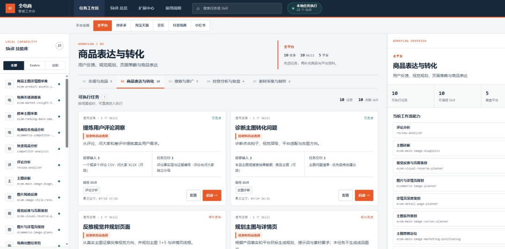
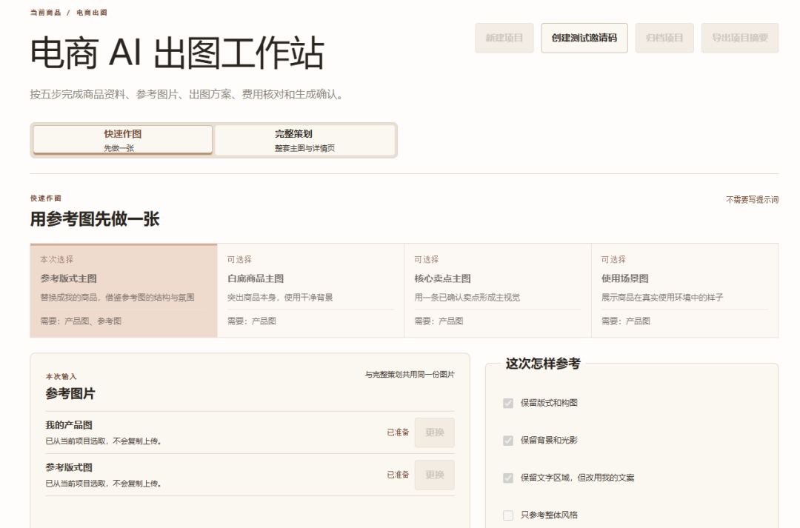
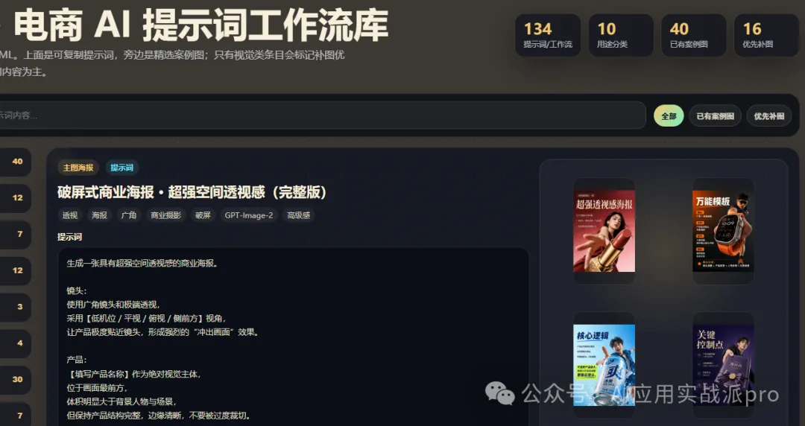

咨询请加：  HPwangtang

---

本文最初发布于微信公众号「AI应用实战派PRO」。未经特别说明，正文与配图采用 [CC BY-NC-ND 4.0](https://creativecommons.org/licenses/by-nc-nd/4.0/deed.zh-hans) 许可。
