# 我用 Codex 手搓了一套抓取工作流 : 电商，飞书，微信，网页全搞定

> 作者：旺哥 · 公众号：AI应用实战派PRO  
> [查看微信公众号原文](https://mp.weixin.qq.com/s?__biz=MzY4NDA4MDUwMA==&mid=2247484639&idx=1&sn=2c95ed24b4a9c5409ae7ef5c4d116aa6&chksm=f2b89e4ffb510e4553f528978b12387d50ddc40db5d24661a43be2b3cf052c195fd13acca6cb#rd)
> [下载 HTML 图文包（含图片）](https://github.com/wangge-dev/wangge-articles/releases/download/html-archive/202607271800.zip) · [HTML 文件](../../html/2026/202607271800/article.html)

WEB COLLECTION SUITE · WORKFLOW SHARE

四类网页资料  
一套抓取工作流

电商、飞书、微信、普通网页，整理成可以直接阅读和继续使用的本地资料。

2026.07.25 · REAL COLLECTION TEST

4 类  真实页面  |  85 张  本地图片  |  4 次  最终成功   
---|---|---  
  
OPENING

今天分享一套我用 Codex 手搓的抓取工作流

电商商品页、飞书资料、微信公众号文章、普通网页，这几类内容平时都能用得上。我把它们放进同一套工具里，需要处理哪一种，选择对应入口就行。

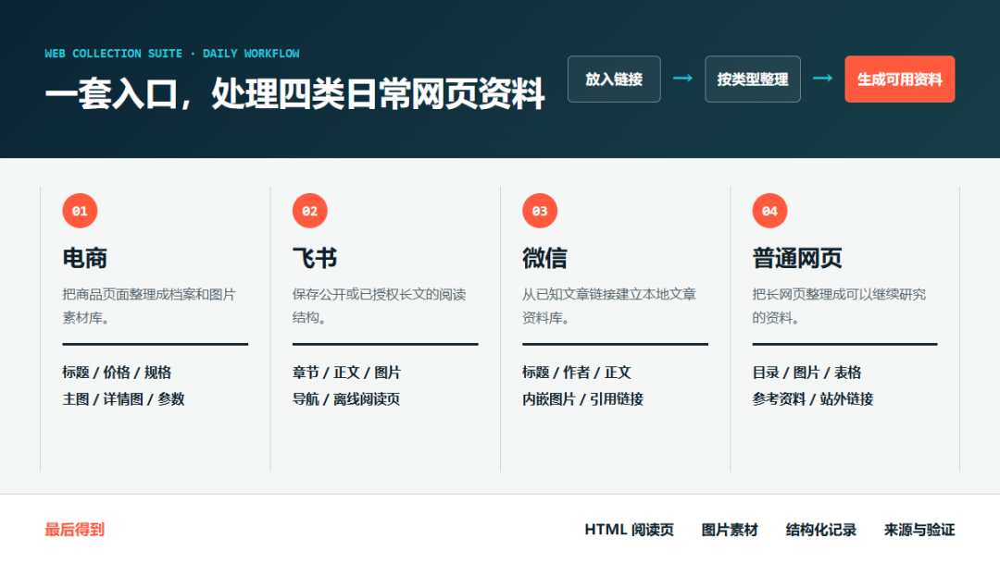

常用的全都能抓  

平时找链接并不难，费时间的是后面的保存和整理。商品图要逐张下载，飞书长文要重新梳理标题，公众号文章容易漏掉正文图片，普通网页一长，目录、表格和参考资料很快就乱了。

为了确认这些能力能不能实际完成，我让 Codex
同时处理了四个真实链接：一个天猫商品页、一篇飞书公开文章、一篇微信公众号文章，以及维基百科的“人工智能”词条。

四次采集全部成功。每个链接最后都变成了一套能直接打开、能检查来源、也能继续交给 AI 使用的本地资料。

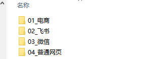

▲ 四类真实页面采集后的本地成品。这里展示结果页，不放启动菜单和命令行。

01 / ECOMMERCE

电商页面：把商品信息和图片一次整理出来

先看最接近日常工作的天猫商品页。  当然京东拼多多都能，前提要登录个人账号

Codex 从页面里整理出了商品标题、品牌、图片部分单独保存了  5 张主图和 14 张详情图
，还生成了一个素材画廊。打开本地商品档案，左边能看主图，右边能看标题、价格、规格和服务；切到素材页，主图和详情图一排展开，不用再回商品页逐张另存。

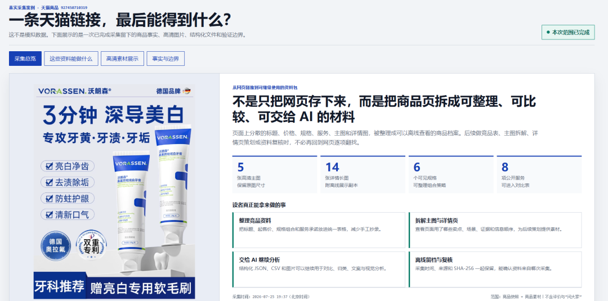
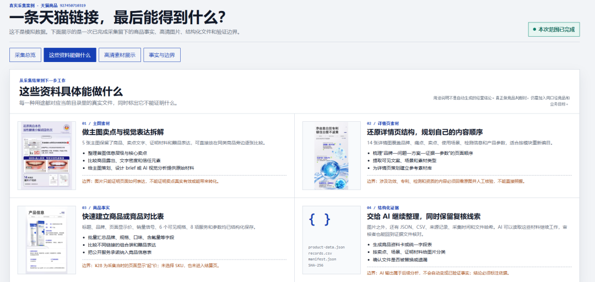
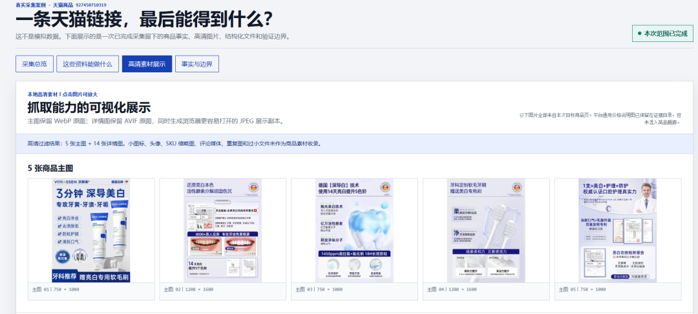
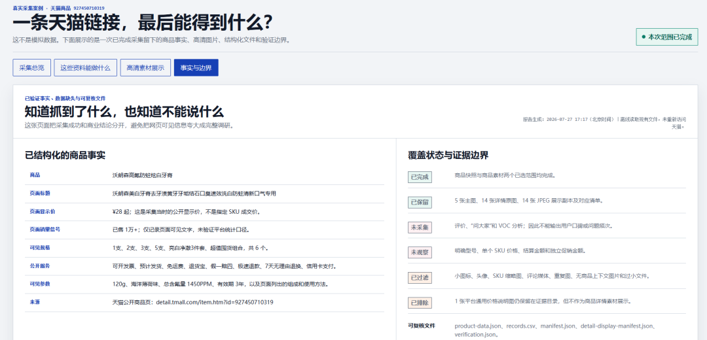

▲ 一条商品链接被整理成商品档案和图片素材库。本次按要求没有采集评论与“问大家”。

这套资料可以继续拿来做竞品页面拆解、卖点整理、主图分析、详情页规划和规格对照。设计要找图片，直接进素材画廊；运营要核对页面信息，打开商品档案；要让 AI
分析，目录里还有结构化记录和来源清单。

02 / FEISHU

飞书页面：长文的章节和图片都能保留下来

第二个测试是一篇飞书官网公开文章。

最终资料里有  196 条正文记录、30 个章节标题和 6 张本地图片  ，图片全部保存成功，记录完整度为 100%。  网址：

https://www.feishu.cn/content/article/7644418854143315157

阅读页左边是章节导航，右边是正文。原文里的标题、段落、代码块和图片仍按阅读顺序排列。即使以后原链接有变化，也可以直接打开本地 HTML 阅读。

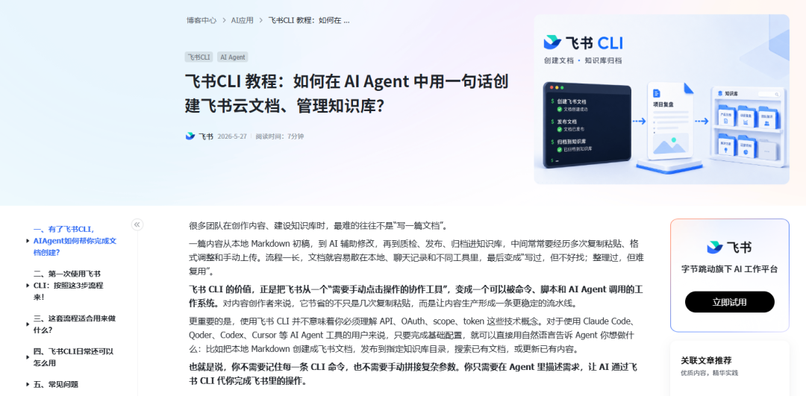

抓取的结果大家看下：

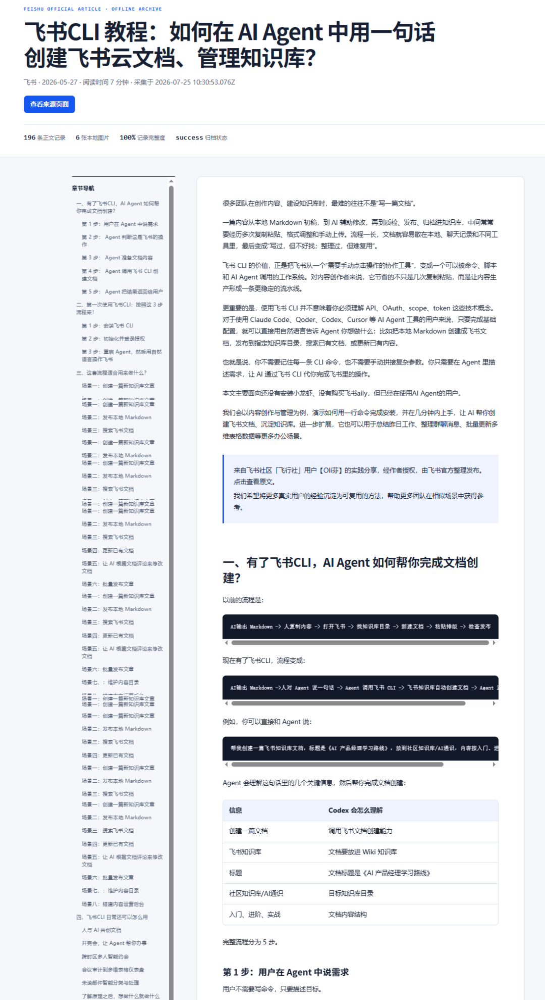
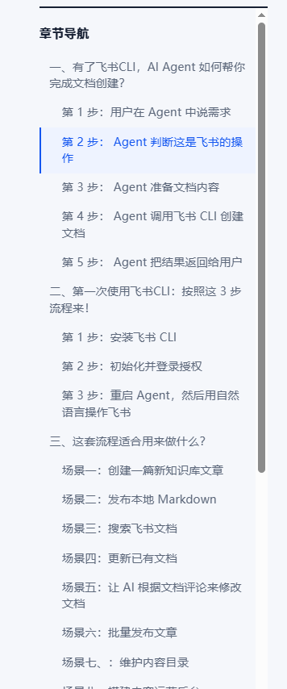

并且抓取到的HTML也可以像飞书文档一样，点击目录跳转到对应地方，简直是一比一复刻！

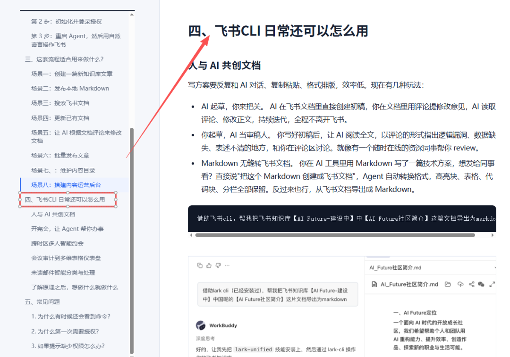

▲ 飞书公开文章归档后，章节、正文和图片被整理进一个本地阅读页。

这类结果适合保存公开教程、项目说明、产品文档和团队已经授权访问的资料。后面要总结全文、提取步骤、搜索关键词、改成培训材料，AI
不必重新访问原网页，直接读取本地资料就可以继续做。

飞书这里只处理公开可访问的页面，或者用户已经明确获得访问权限的内容。需要登录或确认权限时，仍然要由本人完成。

feishu bu ke fuzhi de wendang ye keyi zhua!

03 / WECHAT

微信文章：正文和 22 张内嵌图片一起归档

微信公众号文章最容易出现的问题，是文字保存了，正文图片却散了。

这次测试的文章最终保留了标题、公众号名称、作者、发布日期、104 个有序内容块、4 个章节标题和 10 条引用链接。正文中的  22 张图片全部下载成功
，并按照原来的位置放回本地阅读页。测试的链接：

[ 实战 WorkBuddy+反爬+爬虫固化 Skill，6大能力搞定浏览器自动化
](https://mp.weixin.qq.com/s?__biz=MzA4NzMyNzU5Mg==&mid=2453080109&idx=1&sn=241c29add71bc239c5e878f00dfdc751&scene=21#wechat_redirect)

原链接：

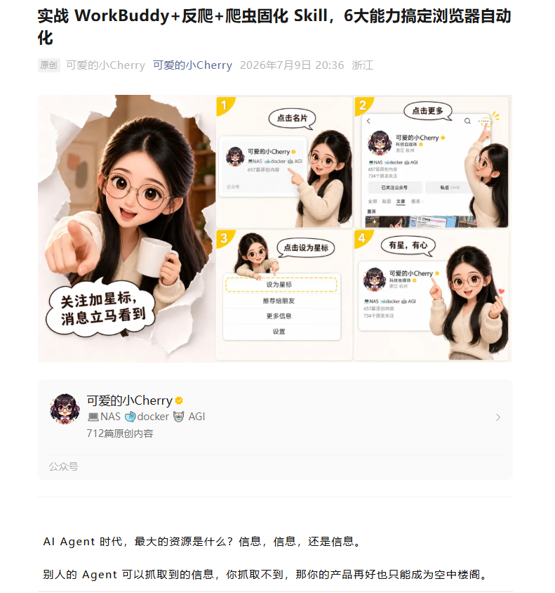
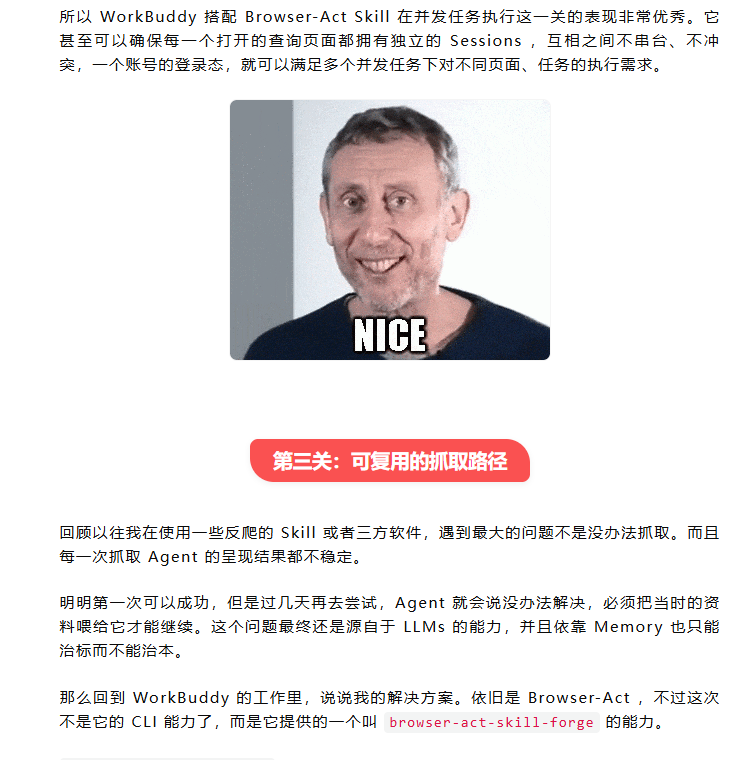

用抓取工作流抓到的结果，甚至动图也能抓到！

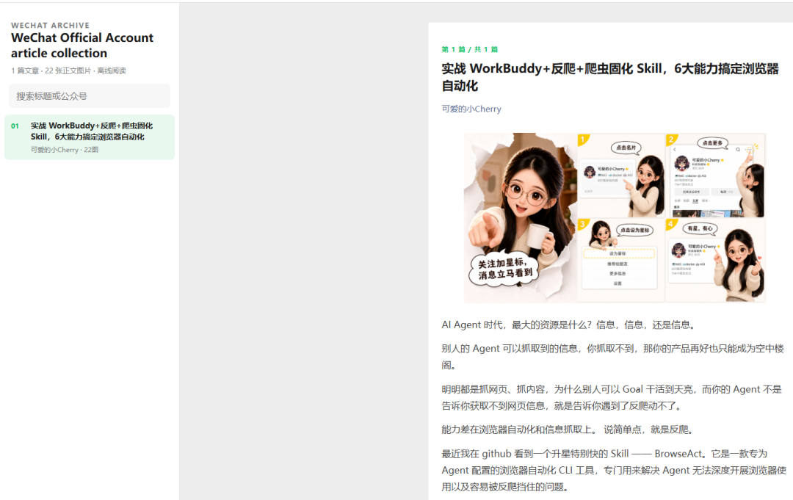
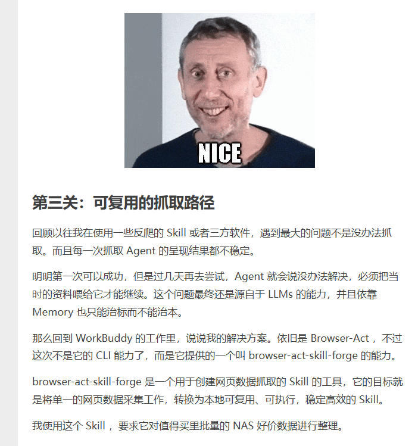

然后还有批量抓取：

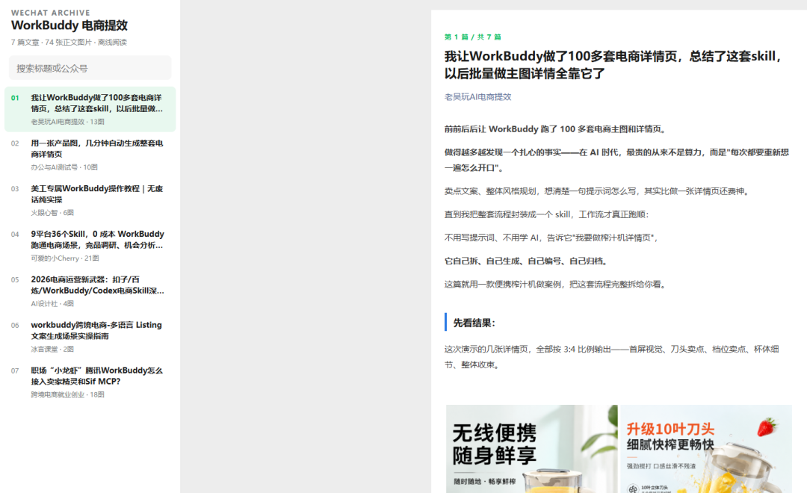

也能做到，基本上完美还原！

▲ 已知微信公众号文章链接可以整理成带目录、正文和本地图片的阅读档案。

拿到这套资料以后，可以建立自己的公众号文章库，按主题保存案例，做标题和内容研究，也可以交给 AI 提炼大纲、分析写法或改成其他内容形式。

这如果想要快速批量抓取建议使用api。  https://redfox.hk/

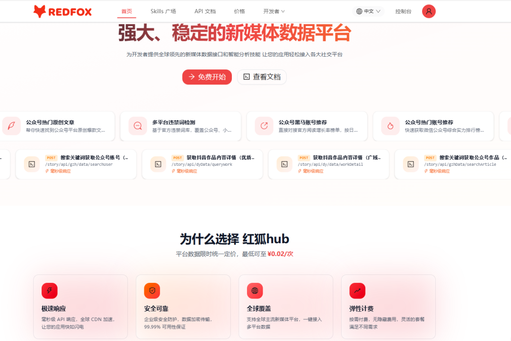

你想要的平台数据基本上都有，有免费积分，如果使用比较多付费就行！

本次分享的抓取工作流分享包也集成了这个流程，如果你需要让codex帮你解决就好。

04 / GENERAL WEB

普通网页：目录、图片、表格、参考资料一起带走

最后一个测试是维基百科的“人工智能”词条。这个页面很长，既有目录和正文，也有图片、表格、参考资料和大量外部链接。

采集完成后，本地档案包含 1011 条记录，其中有  50 个章节标题、80 段正文、38 张图片、22 个表格  、279 条参考资料和 207
个站外链接。

打开 HTML，先看到标题、摘要和 50 节目录，往下还能继续查看原来的图片、图注、表格与参考资料。页面内容已经保存在本地，不需要同时开着几十个浏览器标签。

原始网页：

  
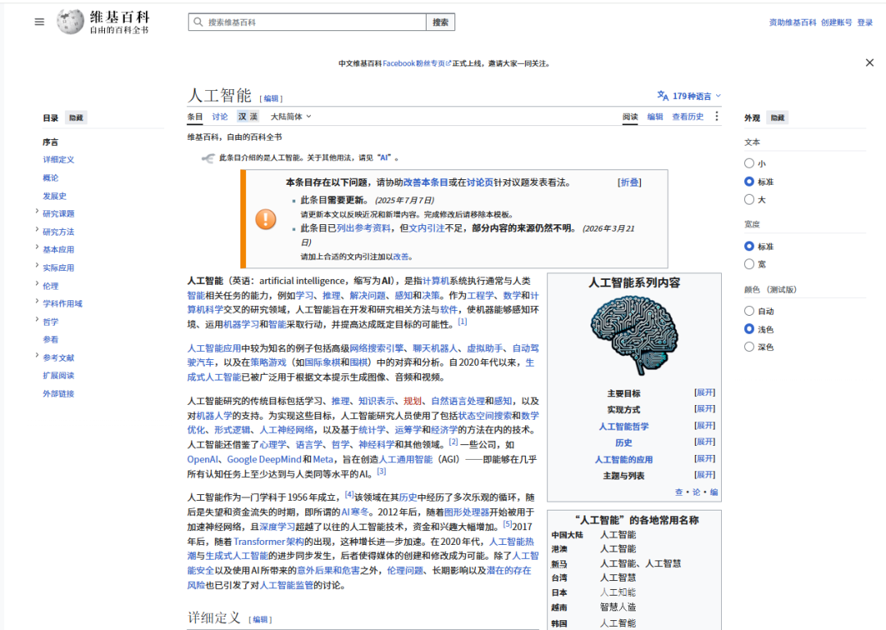

抓取到的：

  
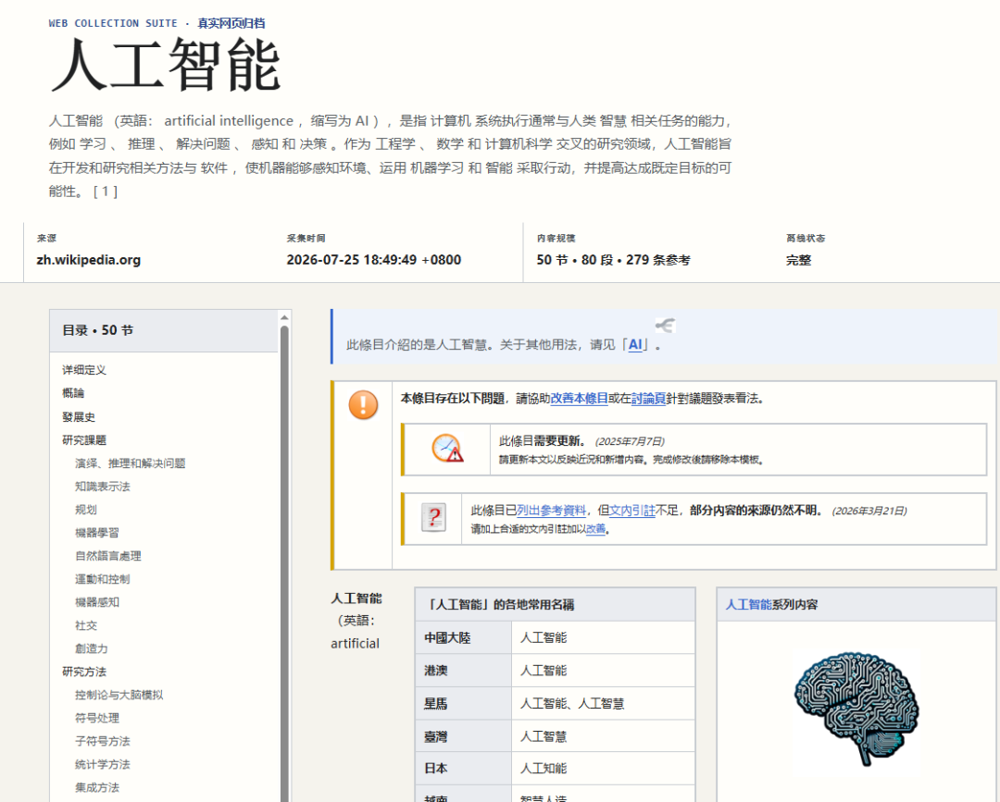

甚至表格也能抓取到：

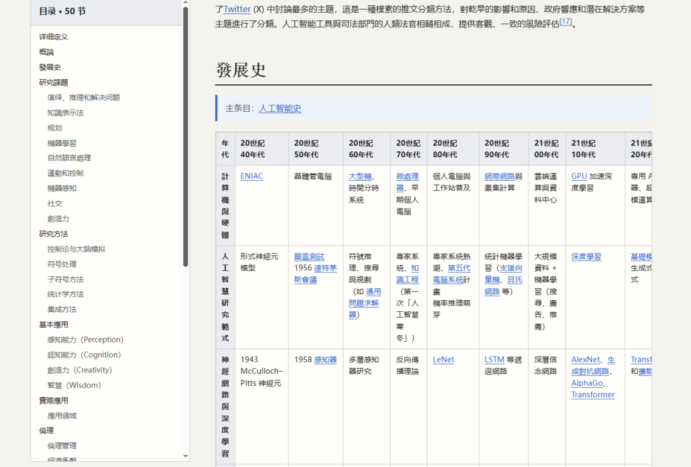

▲ 一个长网页可以变成带目录、图片、表格和参考资料的本地知识档案。

这种资料适合做专题研究、课程准备、资料库整理和长文写作。人直接看 HTML，AI 读取结构化记录，需要核对时再回到来源与验证报告。

站外链接只会被记录下来，不会继续递归采集所有目标页面。搜索、编辑、账号设置等网站交互功能也不会复制到本地。

05 / WHAT YOU GET

这套工具具体能替你做什么

四次测试看下来，这套工具可以处理不同网站，把网页资料进入下一步工作之前的重复整理交给 Agent。

你给它一个公开可访问或已经授权的链接，它可以识别页面内容，保存正文和图片，整理标题与章节，记录商品规格、表格、参考资料和来源链接，再生成本地
HTML、结构化数据和验证报告。

给人看：  可以直接打开的阅读页和商品档案。

给 AI 用：  正文、字段、图片清单和结构化记录。

用于核对：  来源、完成数量、缺失项和验证结果。

它不会替人完成选品判断、营销决策或权限确认。页面要求登录、扫码、验证码或授权时，任务会暂停，等用户本人处理；看不到的字段也会标成缺失，不会用猜测补齐。

06 / GET STARTED

普通用户怎么开始

第一次使用，下载完整包即可。

把压缩包解压到 D、E 或 F 盘，运行依赖检查和安装程序，然后双击“网页采集一键启动”，选择普通网页、飞书、微信、电商或混合链接任务。

安装器只检查 Python、PowerShell、Kimi WebBridge、BrowserAct 和 lark-cli
等依赖，不会偷偷安装本机缺少的软件。检测结果会告诉你已经具备什么，还缺什么。

普通网页、公开飞书页面、已知微信文章链接和电商商品页都不要求购买微信发现服务。只有需要按公众号或关键词发现更多文章时，才可能用到放在微信菜单最后的付费选项。

07 / CAUTION

注意什么

需要 Kimi 插件的辅助:

https://www.kimi.com/zh-cn/features/webbridge

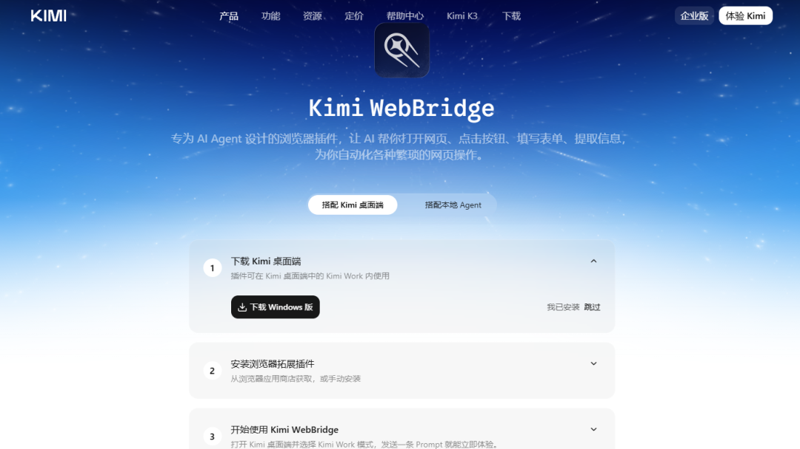
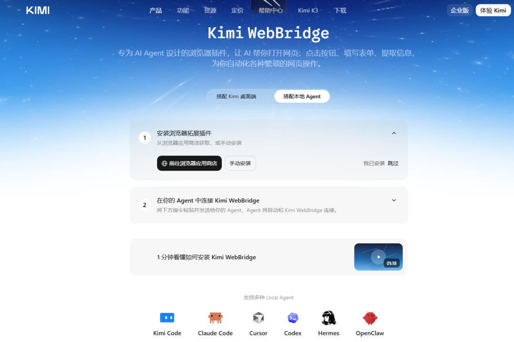

谷歌浏览器应用商店安装更方便

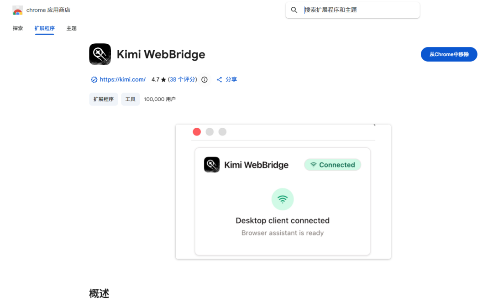

咨询讨论获取请加：  HPwangtang

AI 应用实战派 PRO

觉得本文还不错，赶紧点赞收藏吧。

关注我，还有更多精彩文章和教程。

---

本文最初发布于微信公众号「AI应用实战派PRO」。未经特别说明，正文与配图采用 [CC BY-NC-ND 4.0](https://creativecommons.org/licenses/by-nc-nd/4.0/deed.zh-hans) 许可。
