# 一个Skill ：把近 10 小时视频交给 Codex，最后变成可读/可分享的可视化图文

> 作者：旺哥 · 公众号：AI应用实战派PRO  
> [查看微信公众号原文](https://mp.weixin.qq.com/s?__biz=MzY4NDA4MDUwMA==&mid=2247484679&idx=1&sn=abca409318b2177b738b62941bdc7361&chksm=f2530fde1f31c3292edc02111a1ab345733c8d520a78500b13dbdc65f9bb5a6f2ea7a7f17d6f#rd)
> [下载 HTML 图文包（含图片）](https://github.com/wangge-dev/wangge-articles/releases/download/html-archive/202607311819.zip) · [HTML 文件](../../html/2026/202607311819/article.html)

VIDEO COURSE · CODEX SKILL

一堆学习视频  
变成可视化图文

63 个视频 · 接近 10 小时 · 两套课程

2026.07.31 · PRACTICE NOTES

63 个

学习视频

21 份

图文文稿

2 套

HTML 课程

OPENING

很多学习视频没来得及看，我先挑了两套让 Codex 试一下

手里一直存着不少学习视频，但很多都没有来得及看。  相信大家和我一样哈哈。  这次我先找了两套，让 Codex 来试一下。

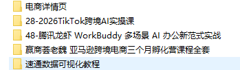

一套是 WorkBuddy，37 个视频；另一套是 TikTok 跨境课，26 个视频。加起来 63 个，时长接近 10
个小时。真要一节一节播放，看完还要记笔记、分主题、重新整理，基本上一整天就没了。

我当时想，Codex 现在可以读取本地文件，也能调用工具处理不同格式，那能不能让它先替我把这批视频看一遍？看一下成果

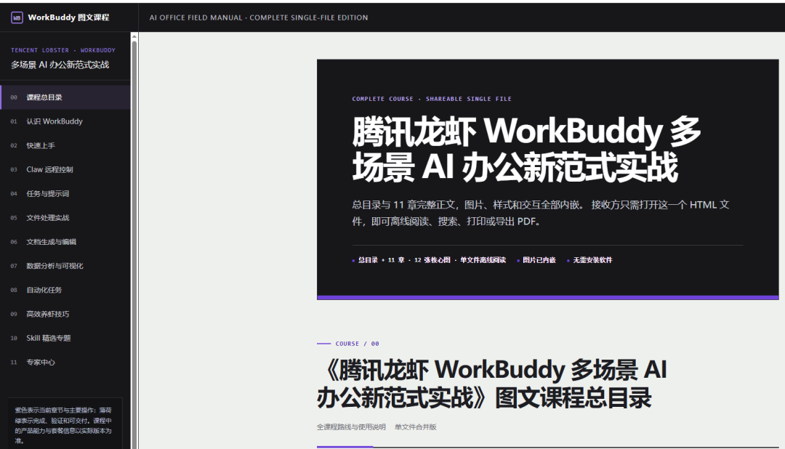

效果还可以吧，给到codex一个：夯
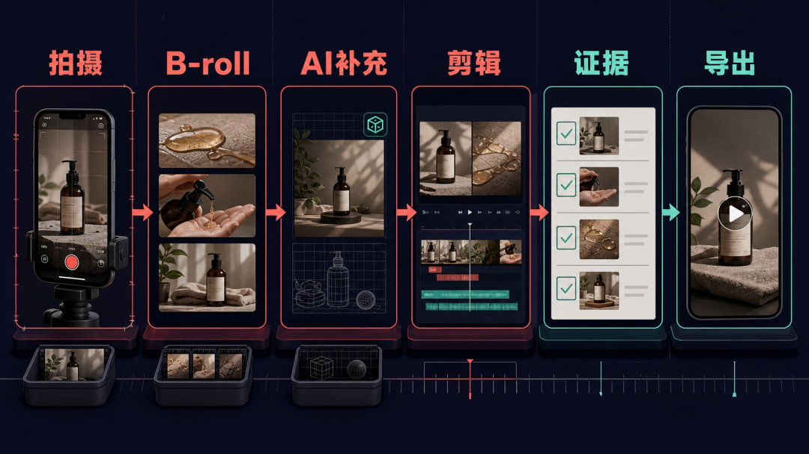
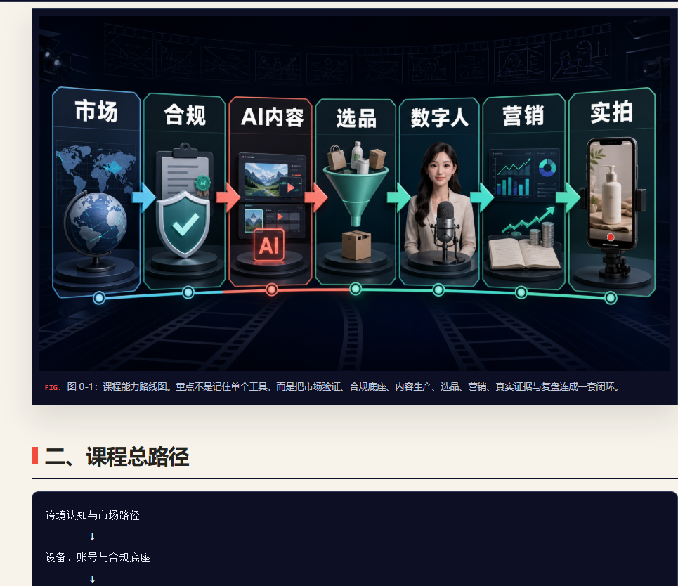

说一下思路，我没有一开始就把 63
个视频全交进去，而是先让它处理第一个文件夹：完整看完，整理成文档，我确认没有问题再继续。原本只是想省下观看和做笔记的时间，没想到第一个结果出来以后，效果比我预想的好很多。

CODEX的执行也很给力！
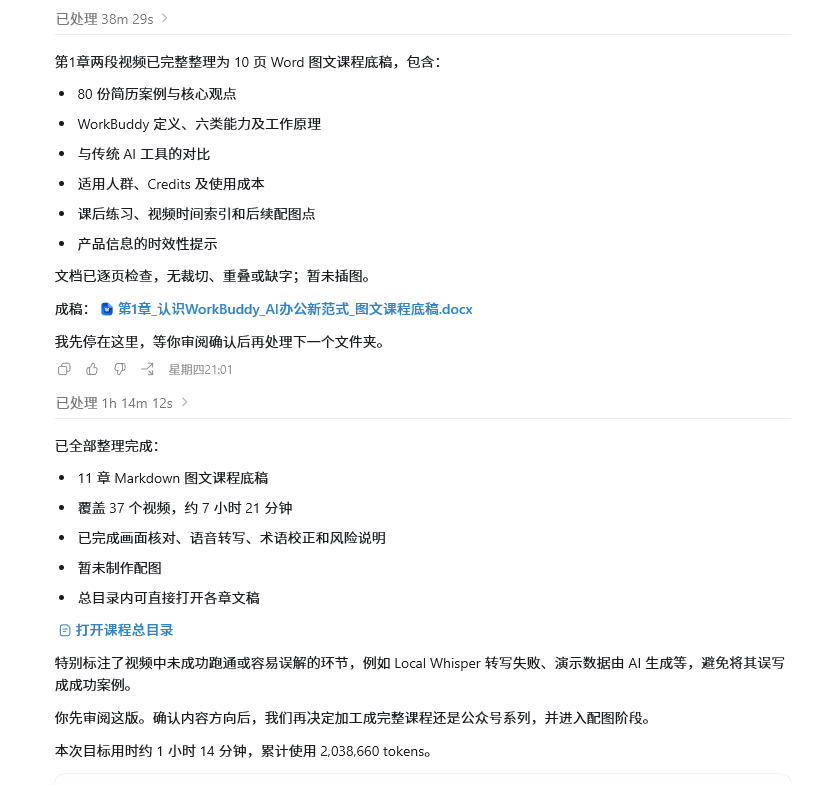

后面我把两套课程都交给了 Codex。最终得到  21 份可以继续修改的 Markdown  、21 张核心插图、21
个课程页面，以及两份可以直接发给别人的单文件 HTML。下面是原始视频，还挺多的。

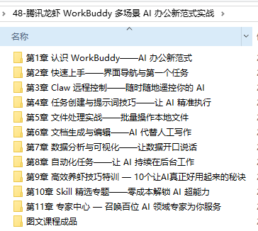
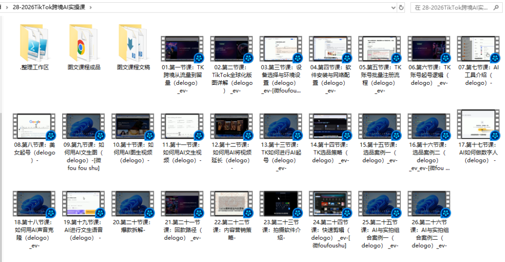

01 · PAIN POINT

最先解决的，就是我没时间看

视频这种资料有一个麻烦，只要不点开播放，里面讲了什么基本看不出来。几十个文件放在硬盘里，能看到的往往只有文件名。

有了 codex
之后，视频里的内容终于可以继续使用了。原来它只能播放，现在可以改成课程讲义、企业内训资料，也可以从一个章节里单独抽出提示词、检查表或操作说明。

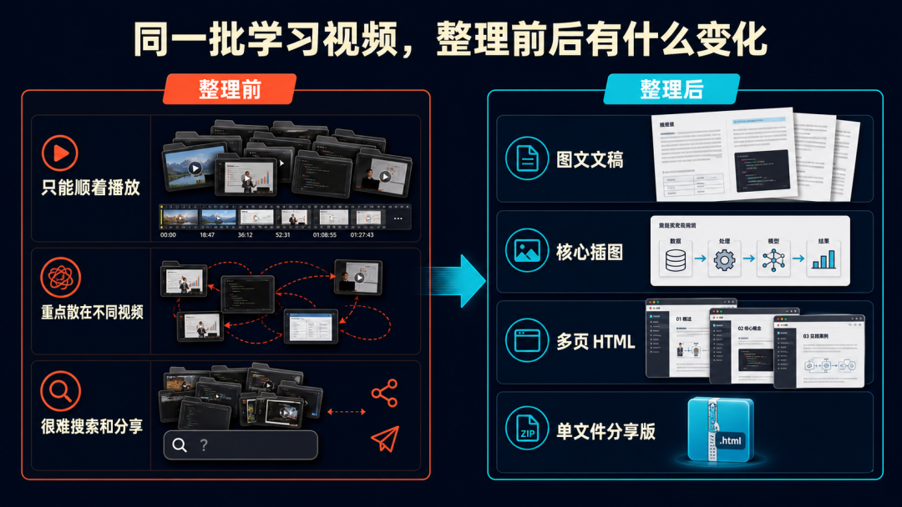

整理前只能顺着播放，整理后可以阅读、搜索、修改，也可以直接分享。

02 · FROM IDEA TO SKILL

我的思路，是被结果一步步推出来的

最开始，我只想让 Codex 帮我看视频、做总结。

第一个文件夹整理出来以后，我开始想：既然文字已经有了，能不能把剩下的章节也做完？全部文稿完成以后，我又想到，只有文字读起来还是有点累，能不能调用 Image
2 给每一章配一张真正解释内容的图？

图文都有了，下一步自然变成网页。多页面 HTML 方便自己按章节阅读和修改，单文件 HTML 更适合直接分享。WorkBuddy 做完以后，我又把完全不同的
TikTok 课程交给 Codex，看相同的方法能不能继续用。

两套课程都完成后，我才想到最后一步：把这次用到的方法整理成一个 Skill。以后再遇到类似的视频资料，不用重新解释一遍要求，把课程文件夹和分享包交给
Codex 就行。

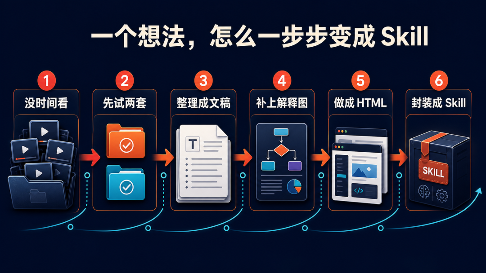

这次没有预先设计一条复杂工作流，而是从一个可用结果开始，一步一步向后扩展。

我真正做的事情其实很简单：看到一个结果，再追问下一步还能省掉什么。很多新用法就是这样长出来的，很少有人一开始就能把完整方案全部想清楚。

03 · THE METHOD

这个 Skill 很简单，我更想分享的是这种想法

` video-course-publisher  ` skill本身并不复杂。它告诉 Codex
收到课程文件夹以后，按照素材盘点、语音转录、文字清洗、课程重组、Image 2 配图、HTML 制作和最终检查的顺序处理。

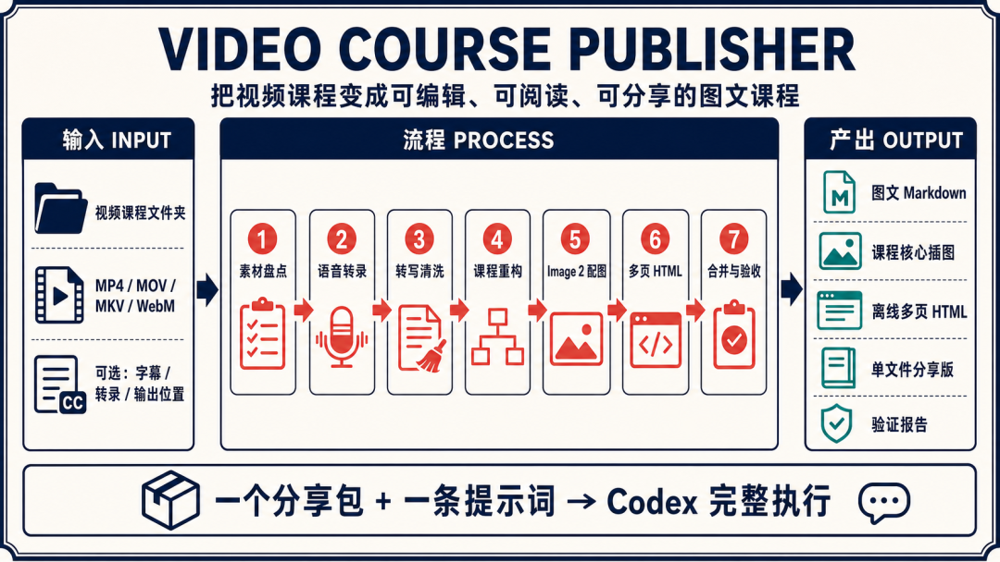

从课程视频文件夹，到图文文稿、多页面课程和单文件分享版。

我今天更想分享的是，遇到一件重复、繁琐、一直没时间处理的工作，可以先换一个问法：

01  这些资料，AI 有没有办法读取？

02  整件事能不能拆成几个可检查的小任务？

03  我希望最后拿到文档、表格、图片，还是 HTML？

04  这次做完以后，能不能保存成 Skill，下次直接再用？

很多事情想通这四个问题，后面就比较清楚了。提示词写得不够完整也没关系，可以先把真实资料和想要的结果告诉 Codex，让它给一个处理方案，再决定从哪里开始。

04 · MORE MATERIALS

能交给 Codex 的，远不止视频

同样的思路可以继续放到其他资料上。

会议录音可以整理成纪要、待办和常见问题；访谈音频可以按主题归类，再整理成文章素材；一堆 Word、PDF 和网页资料可以改成教程、知识地图或 HTML
报告；视频、文档、语音和截图混在一起  ，也可以先盘点，再按用途重新整理。

有些格式 Codex 可以直接读，有些需要语音识别、OCR
或其他工具。即使它暂时不能直接完成，也可以让它先列出需要什么工具、处理步骤是什么、每一步怎么验收。能先拿到一条可执行的方案，事情就已经往前走了。

05 · ACTION

AI 做不完，也可以先让它给方案

现在还有不少人把 AI 只用来问问题、改标题、润色几句话，我个人觉得有点可惜。现在的 Codex
确实太能打了，它已经可以接下一整段工作，只是很多时候我们还没有想到把这件事交给它。

AI 时代更缺的是想法和执行力。  所谓想法，不一定要多复杂，可能只是一句“这件麻烦事能不能让 AI
试试”。执行也不用等完整计划，先拿两三个文件做个样板，结果不对就改，结果可用再扩大。

06 · SHARE PACKAGE

分享包怎么用

这次我已经把整个方法整理成了一个可移植分享包。里面有  ` video-course-publisher  `
Skill、一张流程说明图和一条可以直接复制给 Codex 的提示词。

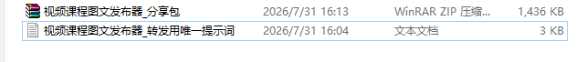

使用方法很简单：

  1. 把分享包解压到 E 盘、F 盘或其他方便保存的位置。 
  2. 把分享包和要整理的视频课程一起交给 Codex，或者直接告诉它课程文件夹的本地路径。 
  3. 复制分享包里的唯一提示词，并说明成品要放到哪个盘。 

正常情况下，最后会拿到可编辑的 Markdown、对应插图、离线多页面 HTML，以及只需要发送一个文件的合并版 HTML。

分享包在评论区！

咨询讨论请加：  HPwangtang

AI 应用实战派 PRO

觉得本文还不错，赶紧点赞收藏吧。

关注我，还有更多精彩文章和教程。

我是 AI 应用实战派pro，只聊落地，不讲虚的。

---

本文最初发布于微信公众号「AI应用实战派PRO」。未经特别说明，正文与配图采用 [CC BY-NC-ND 4.0](https://creativecommons.org/licenses/by-nc-nd/4.0/deed.zh-hans) 许可。
