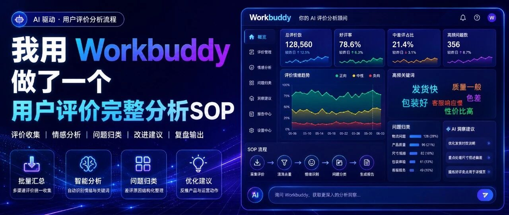

# AI+电商实战：我用 Workbuddy 做了一个商品评价完整分析SOP（附Skill）

> 作者：旺哥 · 公众号：AI应用实战派PRO  
> [查看微信公众号原文](https://mp.weixin.qq.com/s?__biz=MzY4NDA4MDUwMA==&mid=2247484723&idx=1&sn=aec447bd14e51d52b204de93280688c7&chksm=f2b2372f768fe1fcb80c7b8bfcb684bf55a3036230a6032d37b7b316b0f096ee11e82458c5b9#rd)

REVIEW · AI ANALYSIS

几万条评论

AI 一次性跑完  优化清单

分类 / 归因 / 参照物 / 可视化报告，一次对话搞定

2026.08.06 · PROMPT NOTES

4 段  核心提示词  100+  最低样本  1 套  Excel + 报告

OPENING

开始

做电商的都知道，用户的真实评价有多重要，所以今天我们就来做一个完整的商品评价分析过程。看一下产出：

这次  我以儿童牙膏为例，  废话不多说，下面直接开始！

工具准备：这次我是用国产之光  Workbuddy  做的，好用，靠谱，关键现在还能白嫖，腾讯这次真大方！

大致流程是：  让 workbuddy 帮你把评论全读一遍，分好类、量化出来、找到根因，做出一份能直接动手的优化清单。

01

数据准备

在让
workbuddy分析之前，你需要先把评论数据准备好。不同平台获取方式不同，你可以从电商后台导出评论数据，如果没有后台权限，可以用影刀、浏览器插件辅助采集。我这次用的店透视！

首先找一个链接，这次我找了一个儿童牙膏，链接进去找到店透视插件，点击  评价分析  ，之后加载个七八页差不多500条就行。批量下载就行

评论的话太少，结论站不住。建议至少凑够一百条。我这次导出了550条

字段能多就多。起码得有"评论内容"这一列。要是有评价时间、SKU，追评，后面能做得更细。

文件用 Excel 或 CSV，一行一条评论，列名写清楚。

拿到的真实数据多半不干净。重复的、空白的、系统默认的"好评"、甚至混进别家商品的评论，这些都得先洗掉，不然后面全歪。

02

开工前先做一次数据体检

数据下载下来先不用直接分析，先清洗

请先不要分析我上传的文件。 请对我上传的评论数据做一次数据质量检查，并输出《数据质量检查表》： 1. 统计原始总行数和有效评论数； 2. 检查评论内容、评论人、时间、规格、评分等字段是否完整； 3. 识别空评论、默认评价（如「未填写评价内容」）； 4. 识别是否混入其他商品或其他 SKU 的评论； 5. 有追评也要分析； 6. 给出后续分析建议采用的有效样本口径。 请先输出检查结果和建议排除规则，等待我确认后再做数据处理。

确认没问题后，再让 workbuddy 生成清洗后的新表。样本量建议至少 100 条以上，太少结论不可靠。下面看清洗结果：

删掉无用信息：

03

结构化分类：把评论变成可分析的数据

清洗完之后，让 AI
按固定维度给每条评论打标签。主分类只能选一个最核心的：质量、价格、包装、使用体验、售后服务、其他。多标签可以多选，用分号隔开。情感倾向只分四类：正面、混合、负面、其他。

请对有效评论进行结构化分类，并生成新的 Excel 文件。 请为每条评论输出以下字段： 评论内容｜主分类｜多标签分类｜情感倾向｜判断依据｜评论时间｜已购规格｜评论人  分类说明： 主分类只能选择一个标签（按最核心话题归入）：质量、价格、包装、使用体验、售后服务、其他。 多标签分类可以选择多个，用分号隔开。  情感倾向说明： - 正面：明确满意或认可 - 混合：同一评论既认可产品，又提出明确问题 - 负面：明确不满、拒绝复购或提出严重问题 - 其他：无法判断时不要过度推断，请归入其他。

分类完成后，你就能看到：负面评论里最多的是哪一类？包装问题占多少？使用体验问题是不是集中在某个规格？这些数字比直觉靠谱。

之后验证一下  人群和场景，用评论确认谁在买、为什么买

04

购买人群和需求场景分析

提示词比较长，但一次就能跑出完整结果：

请基于生成的用户评价分析母表，对表格中已标记为「正面」和「负面」的评论进行归因分析，帮助我找到产品口碑来源和品牌优化机会。  第一部分：正面口碑来源 筛选正面和混合评论中，用户最常提到的满意因素，统计出现频次。 输出：满意因素｜出现频次｜占有效样本比例｜代表性原话｜说明的产品优势｜可放大的品牌表达  第二部分：负面问题归因 筛选负面和混合评论中的高频负面关键词，统计频次，并匹配代表性原话。 输出：负面关键词｜出现频次｜占问题评论比例｜代表性原话｜用户真实痛点｜可优化机会点  第三部分：可执行优化清单 1）产品最核心的口碑驱动是什么？ 2）当前最需要优先解决的负面问题是什么？哪些问题是个别反馈，哪些问题已经形成高频趋势？ 3）下一步最值得优化的三个方向是什么？  注意： 所有结论必须来自真实评论；每个关键结论尽量匹配代表性原话；不要放大低频个别反馈；不要过度推断评论中没有明确表达的信息。

跑完这条，你手里会有一张「该先改什么」的清单。

05

归因分析

分析的核心，提示词也贴在下面：

别只盯着差评。好评也要归因。你得知道用户为什么满意，才能在内容里把这点放大。差评则要挖出大家共同的那个根。

看归因表有个顺序。先找负面关键词里排前三的，再看代表原话，然后判断这问题出在产品本身、还是预期管理（详情页吹太高）、还是沟通（客服没讲清楚）。三者的改法不一样

正面 + 负面归因分析

最后，再强调下，拿到这份归因表之后，怎么读?先看频次排名前三的负面关键词，再看它们的代表原话。

06

参照物分析

用户心里的对手，常常不是你想的那个。

有人拿你和竞品比，有人拿你和旧版比。评论里如果出现「旧版更好」「没有某牌子厚实」，说明用户真正的参照物是「以前的你」。这个信息对详情页文案和升级沟通非常关键。

参照物分析的提示词也贴在下面。

请对我提供的电商平台产品用户评论进行参照物提及分析，帮助我识别用户心中的主要对手和差异化机会。  1. 请从评论中识别用户提到的其他品牌、其他产品或替代选择，包括：明确提到的竞品品牌；「别家」「其他牌子」等模糊竞品；替代产品；本产品的旧版、旧规格或旧配方；同店其他 SKU 或不同价格档。 2. 请统计参照物被提及的频次，并列出 Top 竞品列表。 3. 请提取每个竞品被提及时对应的代表性评论原话。 4. 请分析用户是在什么场景下拿这些产品做对比，例如：价格、效果、口感、包装、使用体验、复购、服务等。 5. 请判断用户对比后更认可哪一方，并说明原因。 6. 基于对比内容，总结本产品可能的差异化切入点。  输出格式：参照物类型｜名称或描述｜提及频次｜对比维度｜代表原话｜用户倾向｜差异化机会 如果没有出现明确竞品品牌，请直接写「未发现明确竞品品牌」，不要编造品牌名称。

07

生成可视化报告

前面几步跑完，可以让  workbuddy  汇总成一份 HTML
可视化报告，包含执行摘要、分类分布、人群场景、口碑来源、负面归因、参照物分析和可执行清单。同时让  workbuddy  输出一份 Excel
母表，方便你后续筛选和编辑。

08

封装成skill

我这次的做好的  skill  在评论区哦！

09

最后

如果不会用，把本篇文章直接丢给 Workbuddy 就行了。

咨询讨论请加：  HPwangtang

AI 应用实战派 PRO

觉得本文还不错，赶紧点赞收藏吧。

关注我，还有更多精彩文章和教程。

---

本文最初发布于微信公众号「AI应用实战派PRO」。未经特别说明，正文与配图采用 [CC BY-NC-ND 4.0](https://creativecommons.org/licenses/by-nc-nd/4.0/deed.zh-hans) 许可。
