# 我用 Workbuddy 做了一个数据分析完整sop(附课件）

> 作者：旺哥 · 公众号：AI应用实战派PRO  
> [查看微信公众号原文](https://mp.weixin.qq.com/s?__biz=MzY4NDA4MDUwMA==&mid=2247484757&idx=1&sn=ba39890be7ca3fa348c18dd15589316c&chksm=f2d909098c0fdcad38c3c066f666da33fb00fc08d9712cafeaf5a479a7838e0eebdedb329480#rd)
> [下载 HTML 图文包（含图片）](https://github.com/wangge-dev/wangge-articles/releases/download/html-archive/202608071824.zip) · [HTML 文件](../../html/2026/202608071824/article.html)

DATA ANALYSIS · WORKBUDDY

自然语言描述

AI 跑完整套  数据分析

从数据到图表到报告，一次对话搞定

2026.08.07 · COURSE NOTES

7 个  章节模块  4 大  实战场景  9 项  验收清单
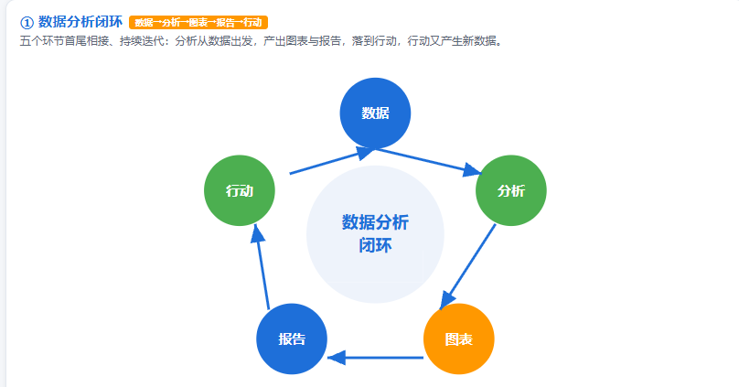

OPENING

数据分析的门槛，被 AI 拉低了一大截

许多人认为数据分析必须先学  SQL、Python、SPSS、R、Excel 高级函数和统计学  。

而 WorkBuddy 提供了另一种入口：用户用自然语言描述数据在哪里、想了解什么问题、需要什么输出，由 AI 完成代码编写、运行、制图和报告生成。

把数据分析的门槛降低了很多，现在更多是要有数据分析的思路，AI 负责来实现。

但这不等于分析工作可以不懂业务。用户仍然要负责：

明确指标口径；

解释字段含义；

选择真正需要回答的问题；

检查计算结果；

判断建议是否可执行。

课程把完整流程概括为：

数据 → 分析 → 图表 → 报告 → 行动建议

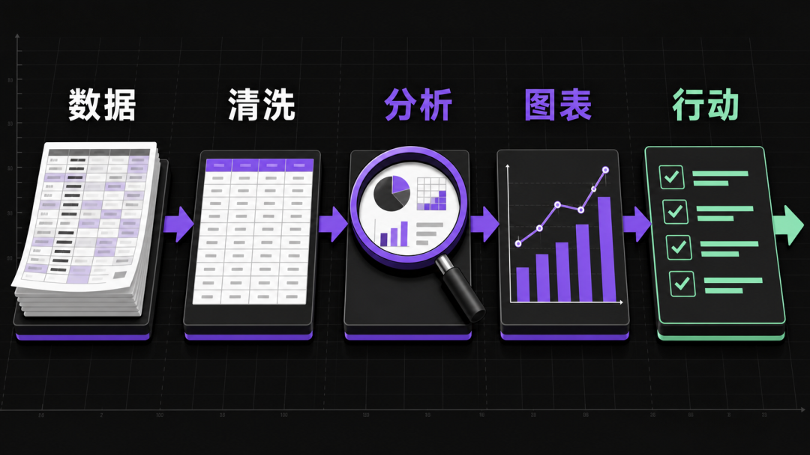

01

数据分析的标准工作流

准备 Excel 或 CSV 数据；

告诉 AI 数据背景和分析目标；

AI 检查字段、类型、缺失值和异常；

根据目标规划分析维度；

计算关键指标；

生成表格和图表；

解释结果；

整合为分析报告；

用户复核指标、口径和结论。

02

开始前先把数据说清楚

这次我们准备的是一个  Workbuddy  模拟的实战数据，你可以去文章评论区去找我用的数据，或者让workbuddy模拟一下，数据不重要，重要的是思路。

方法一：让 AI 先探索数据

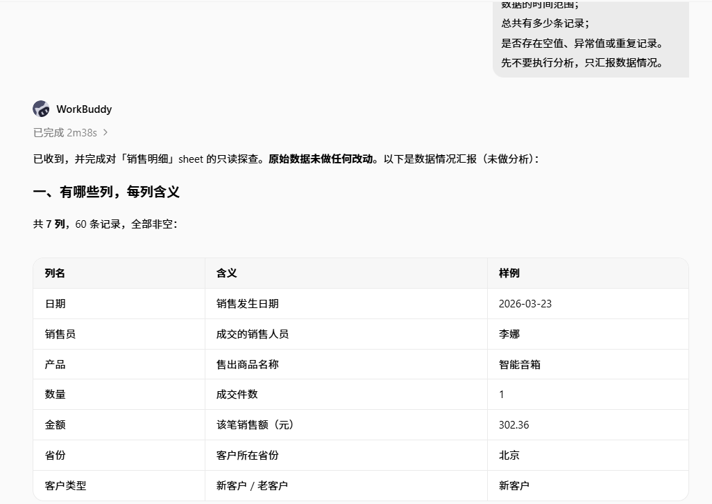
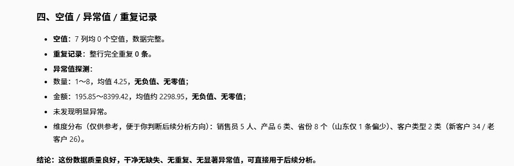

适合第一次使用某份数据：

请读取 [销售明细sheet表]，先告诉我：  有哪些列，每列含义是什么； 数据的时间范围； 总共有多少条记录； 是否存在空值、异常值或重复记录。 先不要执行分析，只汇报数据情况。

方法二：主动描述业务背景，更高效的写法是直接提供：数据代表什么业务；时间范围；关键字段；统计口径；希望回答的问题；目标值或对比基准。

例如：

这是一份公司 2026 年 Q1 销售明细。字段包括日期、销售员、产品、数量、销售金额、省份和客户类型。我想了解各地区与各产品的销售表现。

03

四大实战场景速览 + 可复用提示词

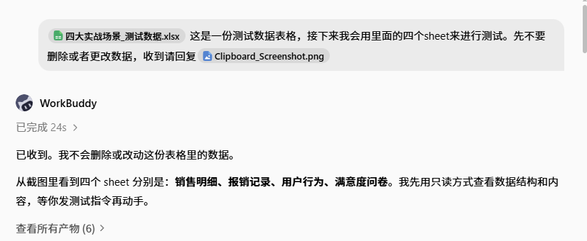

下面我将通过四个实战场景来给大家演示如何做数据分析，话不多说直接开始！

实战一：销售分析

提示词模板

请对 [2026Q1销售明细.xlsx] 进行全面分析。 1. 整体业绩：Q1 总销售额、总订单量、客单价；如有目标再算达成率； 2. 时间趋势：1—3 月对比，指出峰值和低谷； 3. 产品分析：销售额 Top 10 及占比； 4. 地区分析：各省份排名与重点地区趋势； 5. 销售员分析：业绩排名与人均销售额。 图表：生成浏览器可打开的 HTML，风格简洁，含标题/轴名/数据标签/数据来源。 报告：生成 Word 报告，含结论与建议，≤2000 字。保存到 [目录]。

验收重点

销售额是否按正确字段汇总；订单量是记录数还是唯一订单数；客单价分母是否正确；排名是否含退货/异常；目标值是否来自用户而非 AI
臆造；报告数字是否与图表一致。

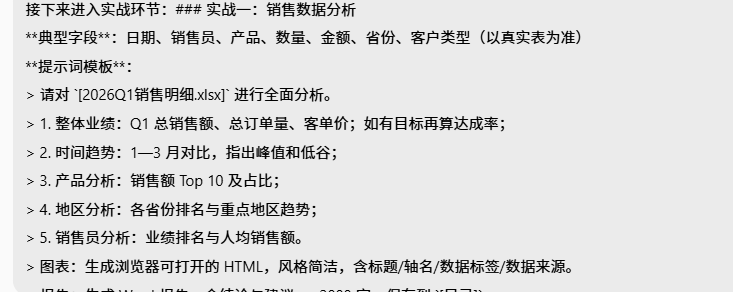
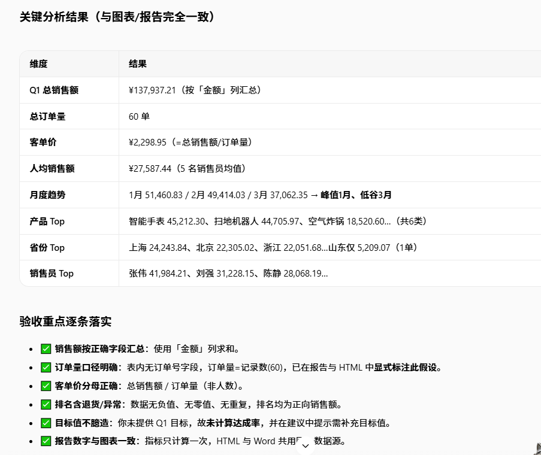

分析报告

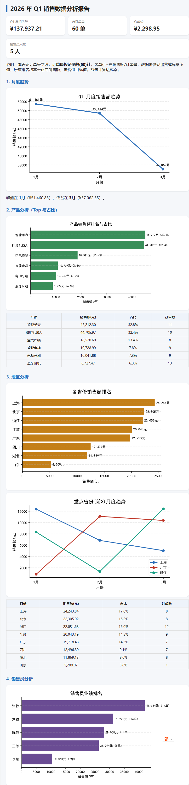

· · ·

实战二：财务报销分析

典型字段：报销日期、员工姓名、部门、费用类型、金额、审批状态

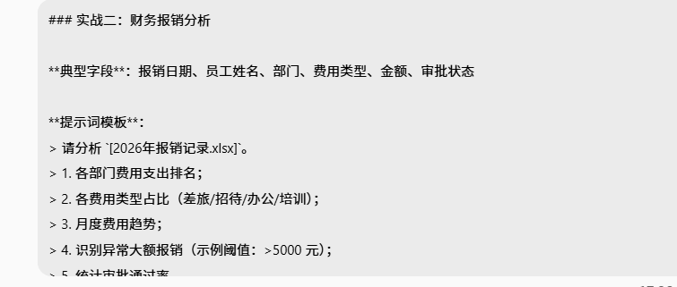
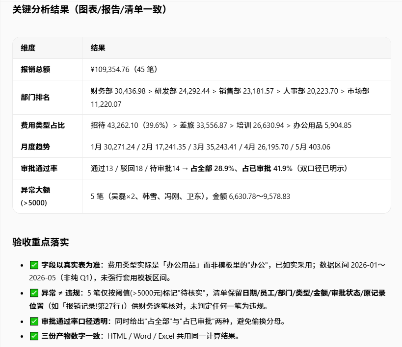

提示词模板

请分析 [2026年报销记录.xlsx]。 1. 各部门费用支出排名； 2. 各费用类型占比（差旅/招待/办公/培训）； 3. 月度费用趋势； 4. 识别异常大额报销（示例阈值：>5000 元）； 5. 统计审批通过率。 输出：HTML 柱状图/饼图/趋势图；Word 费用分析报告（含管理建议）；Excel 异常记录清单。

关键认知

异常 ≠ 违规。超阈值只表示需进一步检查，清单应保留日期/员工/部门/类型/金额/审批状态/原记录位置，供财务核实。

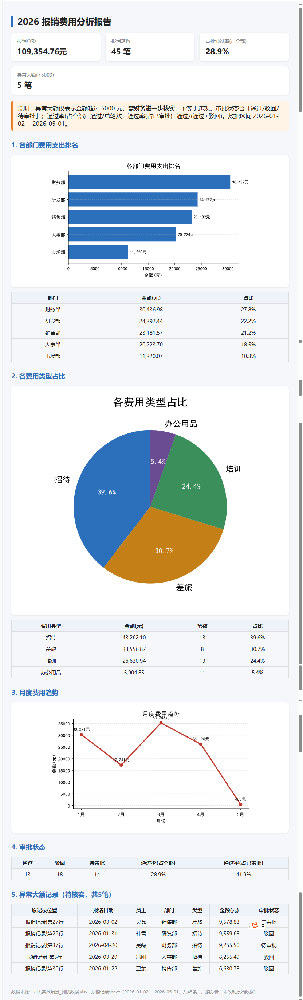
· · ·

实战三：运营用户行为漏斗

典型字段：用户 ID、事件 event、时间戳 timestamp

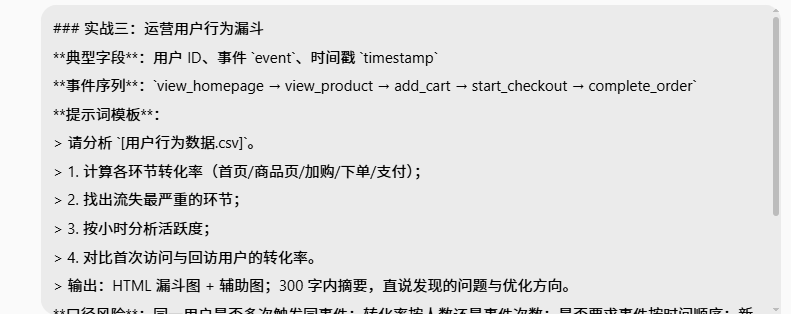
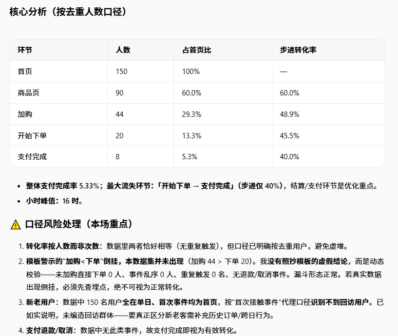

提示词模板

请分析 [用户行为数据.csv]。 1. 计算各环节转化率（首页/商品页/加购/下单/支付）； 2. 找出流失最严重的环节； 3. 按小时分析活跃度； 4. 对比首次访问与回访用户的转化率。 输出：HTML 漏斗图 + 辅助图；300 字内摘要，直说发现的问题与优化方向。

口径风险

同一用户是否多次触发同事件；转化率按人数还是事件次数；是否要求事件按时间顺序；新老用户如何定义；支付完成是否有退款/取消。

⚠️ 演示数据出现「加购人数 < 开始下单人数」的非标准漏斗，属测试偏差。真实场景应先查事件缺失、跨端标识、时间窗、埋点顺序，不可视为正常转化。

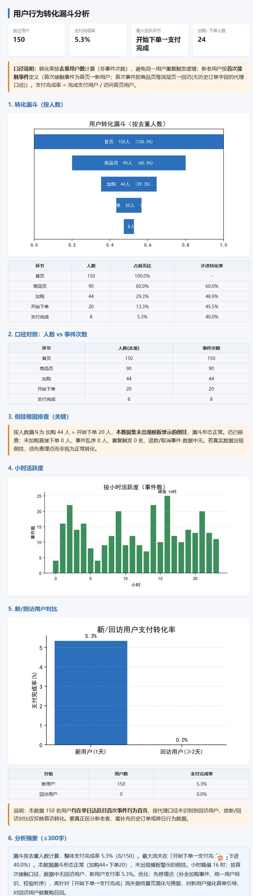
· · ·

实战四：用户满意度问卷

数据类型：约 50 份问卷 = 4 道 1—5 分选择题 + 1 道开放文字题 + 年龄/城市/购买次数等特征

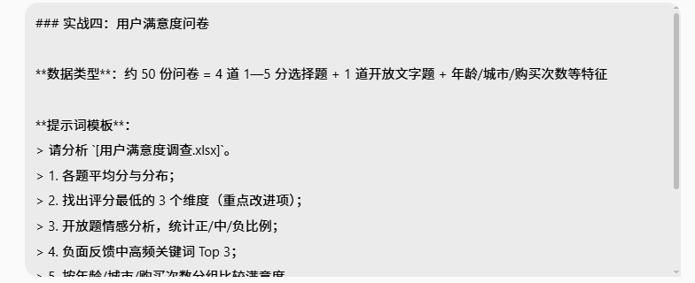
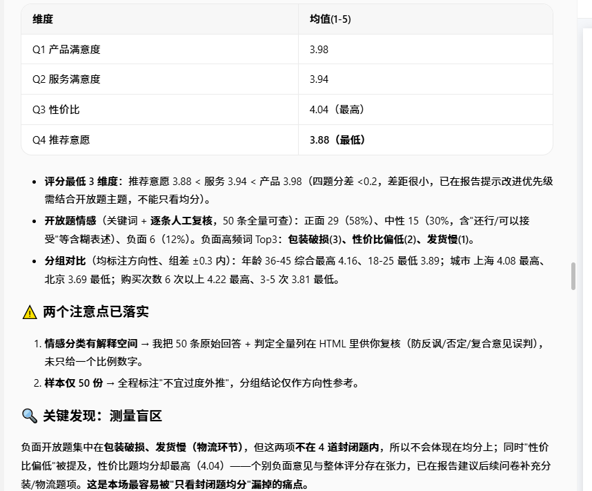

提示词模板

请分析 [用户满意度调查.xlsx]。 1. 各题平均分与分布； 2. 找出评分最低的 3 个维度（重点改进项）； 3. 开放题情感分析，统计正/中/负比例； 4. 负面反馈中高频关键词 Top 3； 5. 按年龄/城市/购买次数分组比较满意度。 输出：HTML（雷达图/分布图/对比图）；Word 调研报告（核心发现 + 改进建议 + 优先级矩阵）。

注意点

情感分类与关键词提取有解释空间，应抽查原始回答（防反讽/否定/复合意见误判）；样本仅几十份时，结论不宜过度外推。

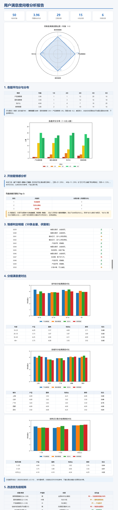

04

让图表更好看的提示方法

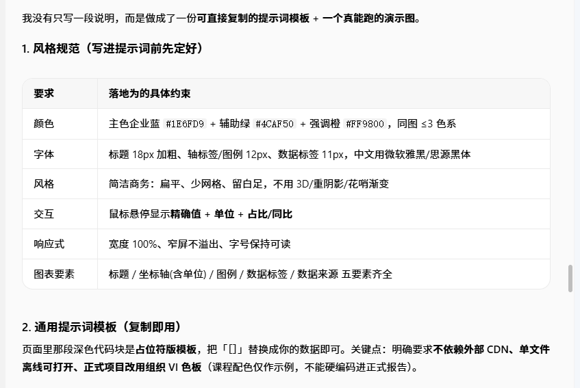

把以下要求写清，别只说「生成图表」：

颜色：企业蓝主色 + 绿/橙辅助色

字体：标题与正文字号

风格：简洁商务，不过度花哨

交互：鼠标悬停显示详细数据

响应式：不同屏宽保持可读

图表要素：标题、坐标轴、图例、单位、数据来源

课程示例配色

正式项目应改用组织品牌规范。主色  #1E6FD9  ｜辅助色  #4CAF50  ｜强调色  #FF9800

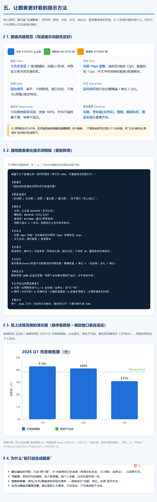

05

图表选择矩阵

分析目的  |  推荐图表   
---|---  
趋势变化  |  折线图   
不同类别对比  |  柱状图 / 条形图   
占比关系  |  饼图 / 环形图   
相关性分析  |  散点图   
多维度评估  |  雷达图   
地理分布  |  地图   
数据密度  |  热力图   
  
注意：类别过多不宜用饼图；无经纬度/区域编码不要硬生成地图；相关性 ≠ 因果。

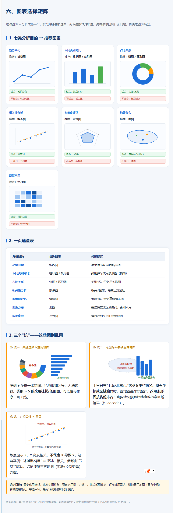

06

把分析转成行动建议

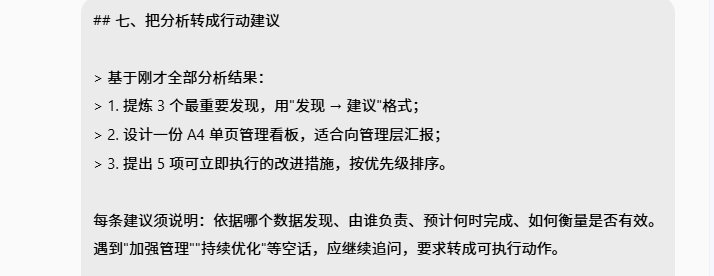
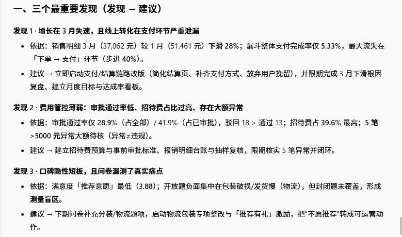

基于刚才全部分析结果： 1. 提炼 3 个最重要发现，用「发现 → 建议」格式； 2. 设计一份 A4 单页管理看板，适合向管理层汇报； 3. 提出 5 项可立即执行的改进措施，按优先级排序。

每条建议须说明：依据哪个数据发现、由谁负责、预计何时完成、如何衡量是否有效。

遇到「加强管理」「持续优化」等空话，应继续追问，要求转成可执行动作。

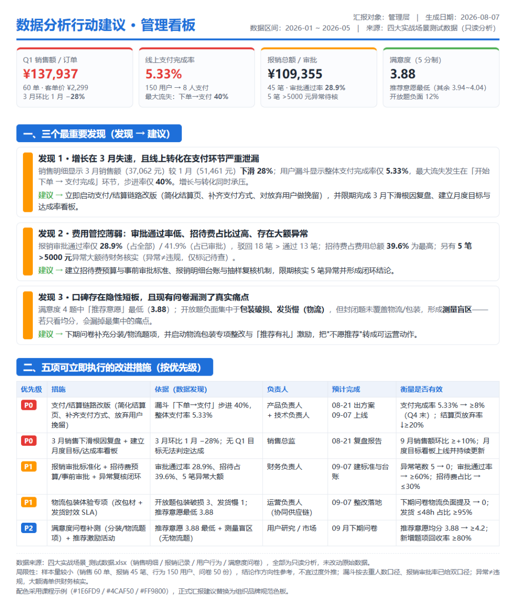

07

分析结果验收清单（9 项）

1\. 数据源与版本是否正确

2\. 字段类型与缺失值是否处理

3\. 指标定义、分母、过滤条件是否清楚

4\. 图表数字是否与原表、正文一致

5\. 是否把相关性误写成因果

6\. 是否把异常直接判为违规

7\. 是否把样本结论过度外推

8\. 建议是否有数据依据与执行对象

9\. 敏感数据是否脱敏、访问是否受控

检查结果：

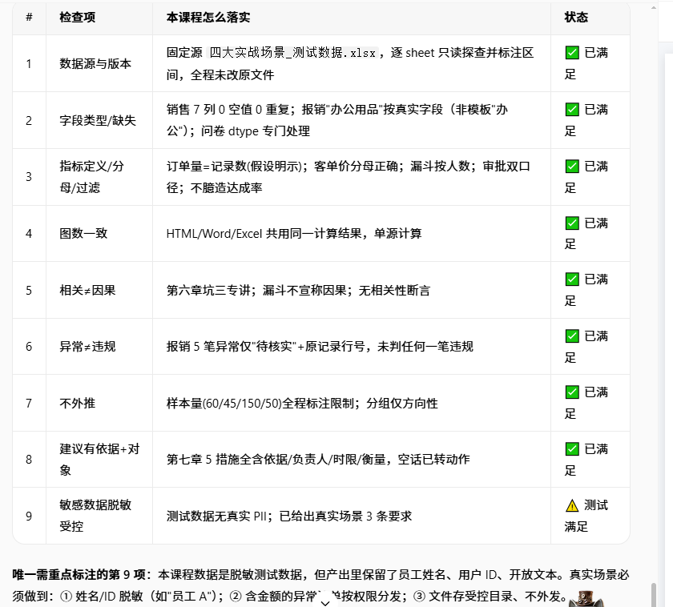

HTML报告：

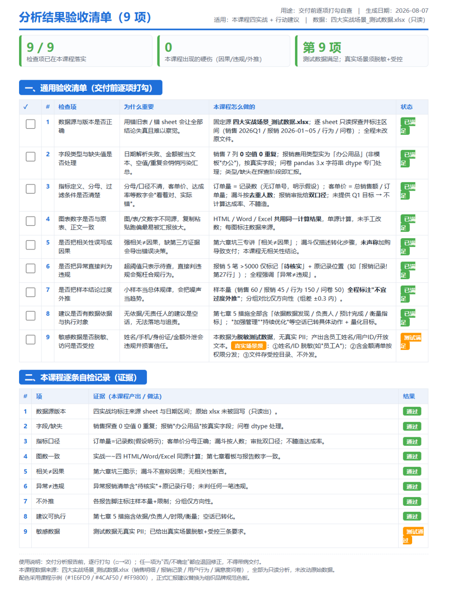

08

课后练习

选择一份不含敏感信息的测试表：

让 AI 先描述字段和数据质量；

写出 3 个业务问题；

为每个问题选择指标和图表；

生成 HTML 看板和 Word 摘要；

手工抽查至少 3 个指标；

要求 AI 提炼 3 个发现和 5 项行动；

给每项行动补充负责人、期限和衡量指标。

09

最后

以上就是用 Workbuddy
做的简化版数据分析流程，相信小白看了也能快速上手，大家也可以看到ai时代数据分析真的简单了很多，但是要想获得更好的分析效果，那就要求你有思路，对业务熟悉，你的数据分析结果往往取决于你对业务的熟悉程度。

如果大家想要课件可以去下面评论区找一下哈，包含完整的HTML报告以及我这次分析用的表格数据。

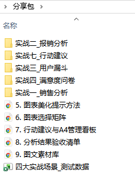

看一下完整的：

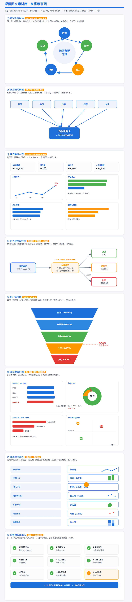

咨询讨论请加：  HPwangtang

AI 应用实战派 PRO

觉得本文还不错，赶紧点赞收藏吧。

关注我，还有更多精彩文章和教程。

---

本文最初发布于微信公众号「AI应用实战派PRO」。未经特别说明，正文与配图采用 [CC BY-NC-ND 4.0](https://creativecommons.org/licenses/by-nc-nd/4.0/deed.zh-hans) 许可。
