# AI+电商实战： 如何用 WorkBuddy + 影刀 RPA 优化你的 RPA 流程 （二）

> 作者：旺哥 · 公众号：AI应用实战派PRO  
> [查看微信公众号原文](https://mp.weixin.qq.com/s?__biz=MzY4NDA4MDUwMA==&mid=2247484831&idx=1&sn=2e908a8a26a4d5474a30fb2986194160&chksm=f23091ff879d90c818aa26a844ef811e65a2e77f2834f2d5bcb77864dcd70ea344ee3311d6c8#rd)
> [下载 HTML 图文包（含图片）](https://github.com/wangge-dev/wangge-articles/releases/download/html-archive/202608212220.zip) · [HTML 文件](../../html/2026/202608212220/article.html)

RPA 流程架构师 · WORKBUDDY

影刀流程截图

交给 WorkBuddy

设计诊断验收  都管

2026.08.21 · SKILL NOTES

5 个  特点  3 层  证据来源  3 步  上手使用

OPENING

开始

上篇写了用 Codex + 影刀改订单导出流程，结尾说要把方法整理成一个 Skill。这篇就把那个 Skill整理出来了，中间换了一次工具，从 Codex
换到了 WorkBuddy。Codex 好用，但门槛高，订阅贵；workbuddy日常使用也不错，下面开始！

[ AI +电商实战：如何用 Codex + 影刀RPA优化订单导出流程（一）
](https://mp.weixin.qq.com/s?__biz=MzY4NDA4MDUwMA==&mid=2247484659&idx=1&sn=46b0c60ed014e244f928ce9d3d417f43&scene=21#wechat_redirect)

01

这个 Skill 是怎么做的

分析一条影刀流程，以前靠截图一张张发给 AI，AI 看一张说一张，还经常凭一张截图就下结论，改错了你也不知道。我把自己的分析方法拆开，一层层搭成了这个
Skill，结构长这样：

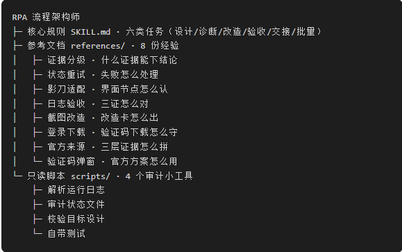

一条主规则管任务分类，经验拆成八份参考文档，再配几个只读脚本帮它核对，整个 Skill 就是这么搭起来的。下面进入实战

02

实战演示

实战一：诊断流程  。如果有之前做好的经常报错，也可以用这个skill来诊断，  只要一张  流程总览  ，它给诊断方向，不急着让你改字段。

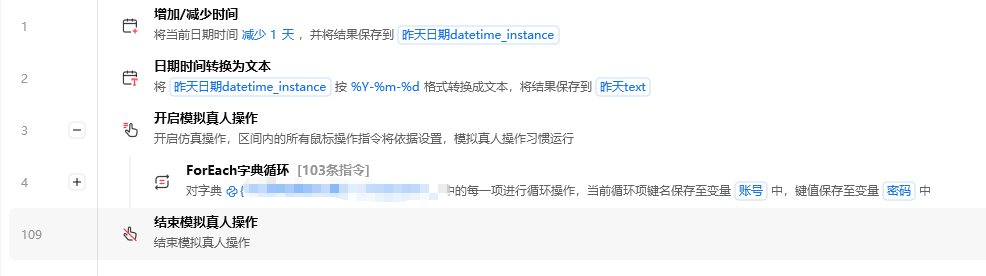

诊断报告

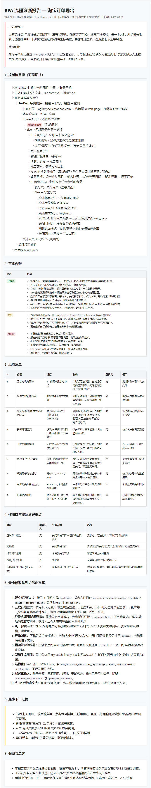

还是详细的吧！

实战2：设计方案  

刚才实战一演示了我很早之前做好的流程，这次我们让workbuddy从头梳理我们的流程，详细说一下操作步骤：

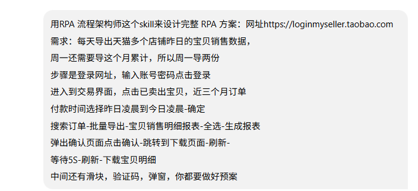

诊断与方案：

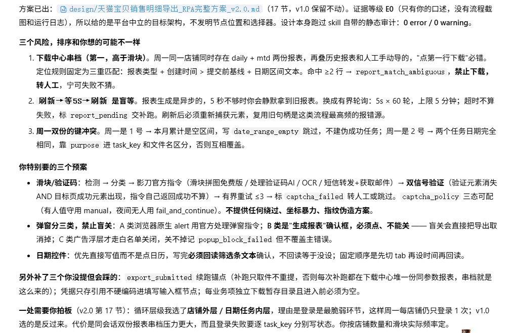
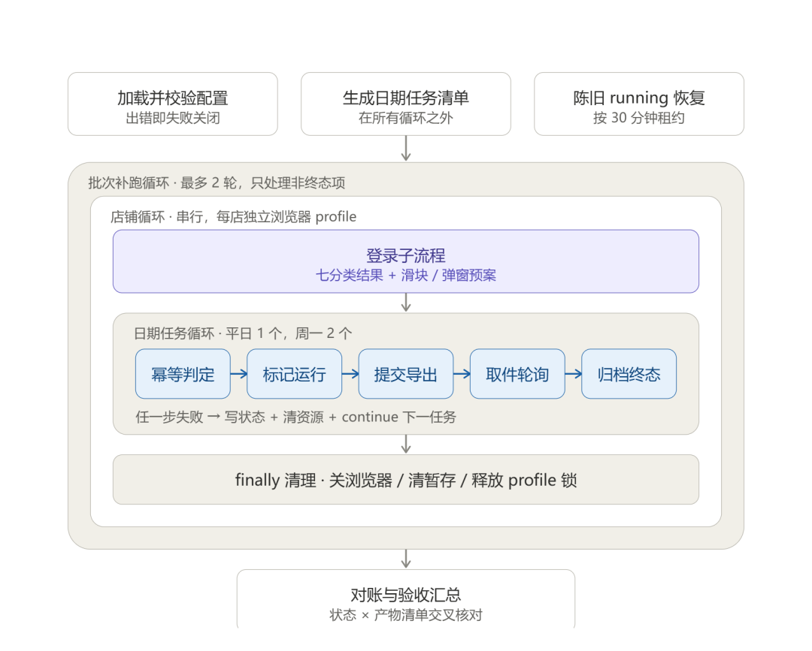

我们按照方案执行就行了！

03

一个特点：答案拼三层证据

这个 Skill
不只是自己判断，它把三层证据拼起来再下结论：你截图里看到的算一层，影刀官方文档和帮助中心算一层，官方社区里别人怎么做的算一层，每一层都标清楚来源。

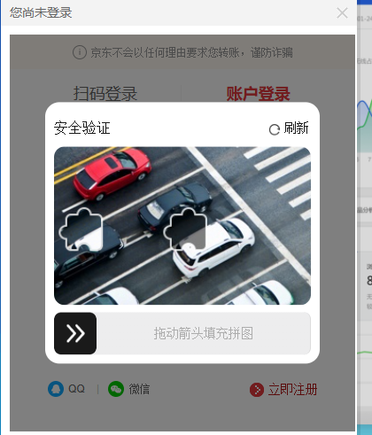

给的方案：

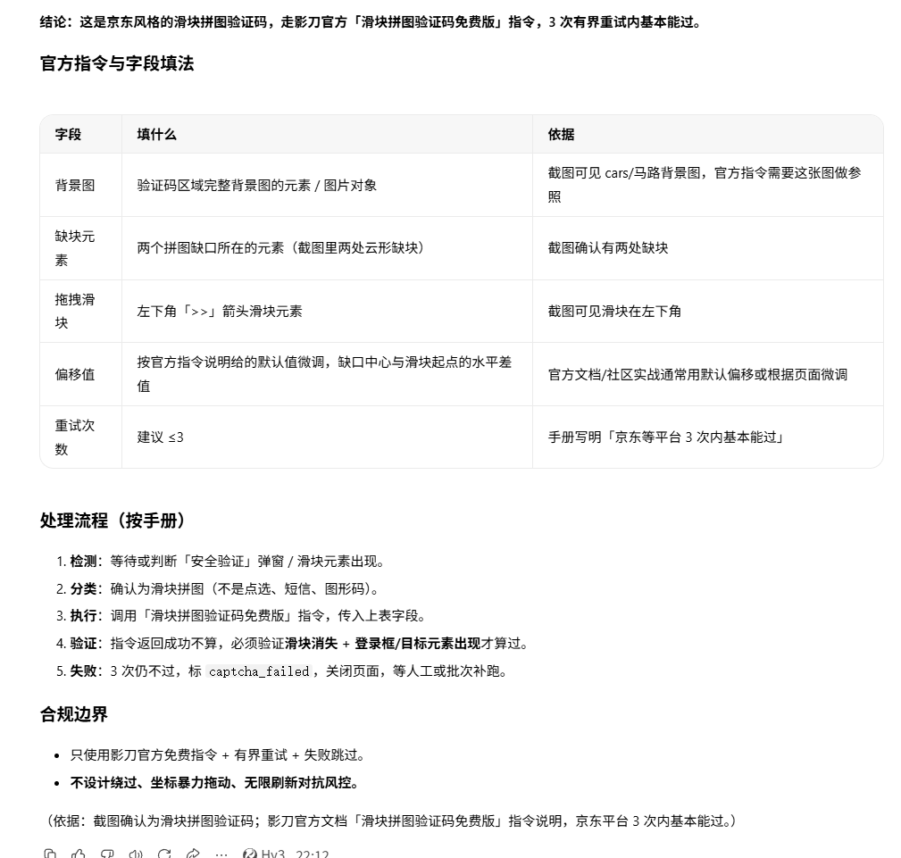

比如某个指令在新版本改没改、某个报错什么意思，它会去查影刀的官方文档、帮助中心和官方社区，把官方说法带回来，标注是官方文档还是社区经验。

验证码、滑块、弹窗拦截这些高频场景，Skill
里也内置了官方处理方案集：图形码走哪个官方指令、滑块用哪个免费指令、短信验证配什么方案、弹窗怎么处理，分类型写清楚了，碰上了直接按方案走，不用自己试。

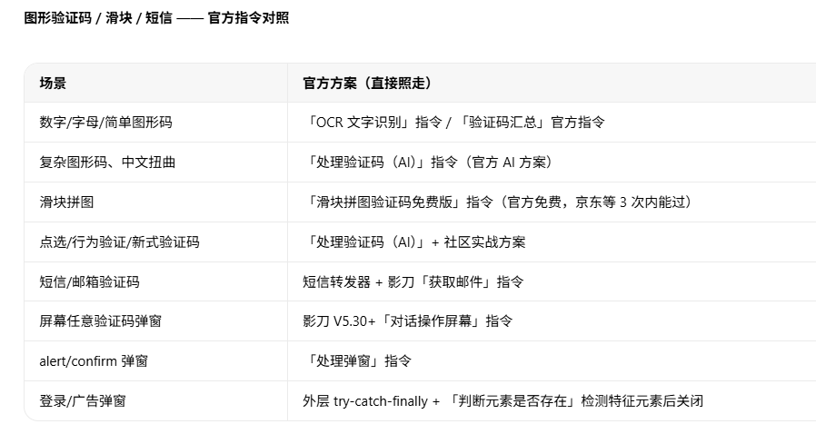

04

怎么用，三步

装 Skill。  WorkBuddy 技能管理里导入 Skill ，装好后对话里说需求会自动加载。

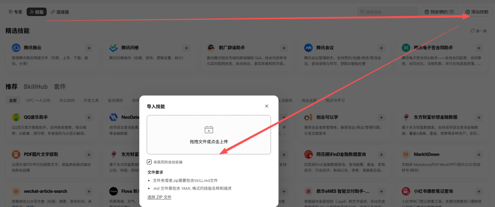

按场景说话。  三种问法：

场景  |  直接这么说   
---|---  
从零设计  |  根据这个需求设计完整 RPA 方案   
诊断现有流程  |  根据这些截图诊断现有流程   
验收运行结果  |  根据运行日志、状态文件和输出目录验收   
  
它要什么你补什么。  缺哪张截图就补哪张。改流程最后还是得你回到影刀里动手，这步跑不掉，AI 负责理思路、排顺序、盯验收。

因为我们大部分人没有影刀RPA企业版，所以这个方案可以暂时代替。

05

获取

整个 Skill 就一个文件夹，打包分享给你，导入 WorkBuddy 就能用；不想装的话，把 SKILL.md 发给 AI 让它读一遍，也能跑。

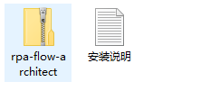

skill在： 在评论区！

咨询讨论请加：  HPwangtang

AI 应用实战派 PRO

觉得本文还不错，赶紧点赞收藏吧。

关注我，还有更多精彩文章和教程。

我是  AI 应用实战派pro  ，只聊落地，不讲虚的。

---

本文最初发布于微信公众号「AI应用实战派PRO」。未经特别说明，正文与配图采用 [CC BY-NC-ND 4.0](https://creativecommons.org/licenses/by-nc-nd/4.0/deed.zh-hans) 许可。
