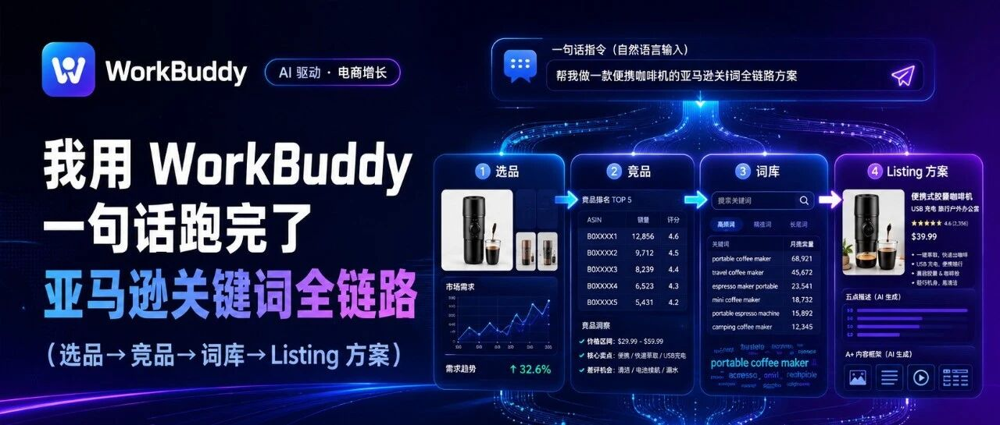

# 我用 WorkBuddy 一句话跑完了 亚马逊 关键词全链路（10 场景实测：选品→竞品→词库→Listing 方案）

> 作者：旺哥 · 公众号：AI应用实战派PRO  
> [查看微信公众号原文](https://mp.weixin.qq.com/s?__biz=MzY4NDA4MDUwMA==&mid=2247484876&idx=1&sn=7bb01325a94f27a5001a99cd24f44a8f&chksm=f2461d933b8c5e0b848b43ad6c85f6cc7892b9e61a879e3a64e69ba5147c8b3ec2ac76958019#rd)

AMAZON KEYWORD OPS · FIELD TEST

一句话指令

跑完亚马逊  从选品到上架

2026.08.24 · FIELD TEST

10 个  场景实测  4 步  跑完全链路  1,345  反查流量词  8 组  可复用提示词

OPENING

开始

以前：  亚马逊  选品要刷关键词市场、找竞品 ASIN、看头部打法；做词库要反查流量词、分类、打标签；写 Listing
要把关键词埋进标题和五点。一个熟手运营，至少  1-2 天  ，做出来的方案还不一定落地：可能趋势已经变了、可能词选错了。

现在：  一句话，AI 按流程跑完。今天我用  WorkBuddy + 卖家精灵 MCP  实测了一轮完整的亚马逊选品到上架，  10 个场景、四步走完
，从"不知道做什么品"到"完整的 Listing 方案"用时  10 分钟  。

为什么这次不一样？

❌ 旧流程 vs ✅ 一句话跑完

❌ 旧流程：  自己翻数据。自己打开卖家精灵 → 导关键词 CSV → 喂给 AI → AI 给建议 → 自己再回去调数据。每一步都是手动复制粘贴。

✅ 新流程：  WorkBuddy  直接调用卖家精灵的数据，边查边想边输出，一次成型。

一句话理解：  卖家精灵提供数据，WorkBuddy 负责执行流程，你负责做决策。

下面进入实战演示，不仅有提示词而且还

有提示词背后的逻辑

四步跑完全链路

第一步：让数据告诉你做什么品

这一步的任务：  从一整个类目的关键词池里挑出值得做的方向——避开拍脑袋和萎缩市场。

场景 1 · 关键词机会研究

这条提示词能让你拿到：  一整个类目里所有"搜索量大、购买率高、头部未垄断"的机会词清单，外加"哪个方向最值得做"的判断。

提示词：  用卖家精灵 MCP
研究美国站<宠物用品>的关键词市场，找出月搜索量高、购买率高、点击集中度低（不被头部垄断）的机会词，每个词给出搜索量、购买率、商品数、PPC
竞价、供需比，最后告诉我这些词对应的产品方向里，哪个最值得做、为什么。数据标注来源和统计周期。

实测结果  （来源：卖家精灵 MCP，2026-07）  
①  cat water fountain 月搜索 65.4 万  ，点击集中度 0.30（头部未垄断），PPC 仅 $1.23  
② 配套滤芯购买率  8.9%  、PPC $0.52——天然复购品  
③ 多个机会词入选，包括 dog poop bags 18.2%、salmon oil 9.4%

结论：  宠物饮水机 + 滤芯  是首选——需求大、竞争散、广告便宜、有持续收入。

场景 2 · 趋势验证

这条提示词能让你拿到：  一个关键词所在市场的"上升还是萎缩"判断，以及"如果萎缩、该往哪个替代方向跑"的建议。

提示词：  用卖家精灵 MCP 查询美国站关键词 "dog chew toy"
的搜索趋势。请给出近几个月的搜索量、购买量以及购买率的月度变化数据，并基于这些趋势数据判断这个细分市场目前是处于上升期还是萎缩期。同时，结合数据走势、市场饱和度、季节性波动以及竞争程度等维度，给出当前是否适合进场布局该关键词的结论与建议，包括如果适合进场应如何切入（例如选品方向、定价或运营节奏），如果不适合则说明主要风险与可替代的关键词方向。

实测结果  （来源：卖家精灵 MCP，2022.01 – 2026.07）  
① 主词从 2022 年峰值  8.6 万  月搜索一路降到 1.8 万，累计萎缩 80%  
② 替代方向 dog toys for aggressive chewers 月搜索  17.4 万  （主词 10 倍），供需比 27.6

主词不建议直接进场，改打细分。这一步把"感觉市场不行"变成了"数据确认不行 + 告诉你去哪"。

第二步：跟谁打、怎么打

这一步的任务：  看清这个品被谁统治、靠什么词活着、转化结构如何——避开正面硬刚。

场景 3 · 竞品地图

这条提示词能让你拿到：  一张头部竞品对比表（品牌/价格/评分/评论/月销/月销售额/类目排名），外加价格带总结和头部玩家打法标签。

提示词：  用卖家精灵 MCP 分析美国站<ASIN， B00CPDWT2M>的竞品，找出同类目里表现好的竞品
ASIN，整理成表格：品牌、价格、评分、评论数、月销、月销售额、类目排名，并总结这个细分市场的价格带和头部玩家的差异化打法。

实测结果  （来源：卖家精灵 MCP，2026-07）  
① 头部 Benebone：$10.87、  10.9 万评论、月销 68,281 件、月销额 $74.6 万  ，子类目  #1  
② 主流价格带 $9.97–14.20 高度集中，$10 附近价格战最惨烈  
③ 中国卖家矩阵（Jeefome / Kseroo / ChienBox）靠"组合装 + 关键词堆砌 + New Release"起量

场景 4 · 单 ASIN 深度拆解

这条提示词能让你拿到：  一条头部链接的全维度画像——价格、评分、类目、变体、Listing
质量分、认证标识、五点卖点结构，以及"它为什么卖得好"的七维分析。

提示词：  用卖家精灵 MCP 深度分析美国站这个商品：<Benebone Wishbone>，输出价格/评分/评论数/类目排名/变体数/Listing
质量分/认证标识；列出完整标题（逐词展示）和五点卖点（逐条拆解撰写逻辑）；简要说明核心图片/A+
内容策略；结合以上数据从关键词布局、差异化卖点、评分评论、定价策略、类目竞争格局、变体覆盖、品牌背书七个角度分析它为什么卖得好，最后给出强项与潜在短板的落地建议。要求数据具体、可量化，最后以简洁总结收尾。

实测结果  （来源：卖家精灵 MCP）  
①  22 个变体  （3 风味 × 5 尺寸 × 组合装），一条链接吃全犬种  
② Listing 质量分  LQS 100 满分  ，Amazon's Choice + EBC + 视频  
③ 五点拆解：耐咬承诺 / 真肉风味 / 易抓握专利造型 / Made in USA / 售后保障

场景 5 + 6 · 流量从哪里来

这条提示词能让你拿到：  头部竞品的完整流量结构——总流量词数、自然/广告占比、AC 词、官方推荐词数，外加"健康度判断"和新品切入建议。

提示词：  使用卖家精灵 MCP 反查美国站竞品 Benebone Wishbone
的流量来源词：①以搜索量降序列出主要流量词；②每个词给出月搜索量、购买率、自然排名、PPC、流量占比（表格呈现）；③分析其流量结构（头部词/长尾词/品牌词分布，自然
vs 广告比例）；④基于数据判断流量健康度并给出可借鉴的选词方向。请确保数据真实、字段完整、排序正确。

实测结果  （来源：卖家精灵 MCP）  
① 总流量词  1,345 个  ：自然 1,215 / 广告 184  
② 自然流量占比  90.3%  ——典型的自然流量健康型  
③ 334 个词挂了 Amazon's Choice 标识，官方推荐体系免费导流

场景 7 · 转化结构诊断

这条提示词能让你拿到：  竞品关键词的四分类诊断（优质 / 平稳 / 流失 / 无效曝光）+ 扩词、否词、降价的可执行广告策略。

提示词：  使用卖家精灵 MCP 反查美国站竞品 Benebone Wishbone 近 30
天的关键词转化结构，按四分类：转化优质词、转化平稳词、转化流失词、无效曝光词。重点详列转化优质词与转化流失词两类的清单及转化率、曝光量、点击率。请给出可执行广告投放策略：①扩词建议（基于优质词拓展长尾词）；②否词建议（无效曝光词、流失词及否词逻辑）；③降价建议（转化平稳但成本偏高词的竞价调整）。最后输出流量结构健康度结论和我方后续广告关键词优化方向。要求数据来源明确、分类口径清晰、建议可直接落地执行。

实测结果  （来源：卖家精灵 MCP）  
① 转化优质词 7 个（品牌词 + 核心精准词）撑起全部利润  
② 流失词里藏着机会：large dog chew toys 购买率  23.8%  但广告位差，新品可直接抢  
③ 无效曝光词 14 个——照着否掉，省预算

第三步：从词到 Listing

这一步的任务：  把前面的数据落成可执行的词库和投放方案——不只看到词，还要知道哪些埋 Listing、哪些投广告。

场景 8 · 关键词挖掘拓展

这条提示词能让你拿到：  基于一个核心词根挖出的完整词库——按长尾/场景/品类三级分类，每词带搜索量/购买率/竞争度/相关度，并分好 Listing 埋词
vs 广告投放用途。

提示词：  用卖家精灵 MCP 基于核心词<indestructible dog
toy>挖掘相关关键词：①按长尾词/场景词/品类词三类分类，每词输出搜索量、购买率、竞争度、相关度；②按搜索量降序，筛出"推荐词"（高相关+竞争适中+搜索量达标）；③明确区分
Listing 埋词 vs 广告投放用途；④以表格呈现（序号/关键词/分类/搜索量/购买率/竞争度/相关度/推荐用途/备注），最后附词库使用建议总结。

实测结果  （来源：卖家精灵 MCP，2026-07）  
① 钻石词 durable dog toys for aggressive chewers：购买率  22.6%  、SPR 30（竞争压力小）  
② 词序变体捡漏：dog toys indestructible 购买率 24.3%、SPR 18  
③ 词库 31 词、17 个推荐，分好用途

场景 9 · 高转化词识别

这条提示词能让你拿到：  从词库里筛出的高价值广告词——按搜索转化率降序排好，每词标注 PPC、推荐用途（SEO 还是 PPC），以及差异化投放建议。

提示词：  用卖家精灵 MCP 分析美国站关键词 "indestructible dog toy" 的转化情况。基于搜索量、转化率、PPC
竞价筛选出高价值词，按"搜索转化率"从高到低排序。①说明筛选条件（搜索量/转化率/PPC
阈值与合理区间判定）；②高价值词表（关键词/搜索量/转化率/PPC/推荐用途）；③每个词标注更适合 SEO 还是
PPC；④建议优先关注的差异化维度（相关性、竞品竞争度）。最后附简短分析总结。

实测结果  （来源：卖家精灵 MCP，90 天窗口）  
① Top 词 puppy chew toys 搜索转化率  15.82%  、PPC $2.22  
② dog chew toys for aggressive chewers 转化率 9.45%  
③ 21 个高价值词，按转化率分三层（≥9% 核心、6–9% 均衡、5–6% 试投）

第四步：一句话跑完全链路

这一步的任务：  把前三步串成一次调用——一句话拿到"做什么、跟谁打、怎么打"的全部答案。

场景 10 · 全链路闭环

这条提示词能让你拿到：  一份可执行的"从数据到方案"调研报告——四阶段（市场机会→竞品分析→词库搭建→Listing+广告方案）完整闭环。

提示词：  请用卖家精灵 MCP
对亚马逊"狗狗耐咬玩具"细分类目完成一轮从选品到上架的完整调研。第一阶段：进入关键词市场筛选高搜索量+高购买率+低垄断的机会型关键词，明确产品定位。第二阶段：找出该方向下头部
Top 10-20
竞品，分析价格带、评价结构、上架时长、核心卖点、推广打法，给出定价与竞争策略建议。第三阶段：反查头部竞品的流量词与转化词结构，区分核心/长尾/场景/关联词，构建完整可落地的关键词词库。第四阶段：基于前三个阶段数据，生成
Listing
标题、五点卖点文案、分层级广告投放词表（广泛/词组/精准匹配）。每一步的关键数据均标注来源与统计周期；末尾给出完整的"从数据到方案"总结结论；结构清晰、可执行。

实测结论  （来源：卖家精灵 MCP，2026-07）  
① 做什么：中小型犬（15–40 lbs）耐咬玩具，  $12.99–15.99 组合装  ，避开大犬红海  
② 跟谁打：不跟 Benebone 正面，对标 Jeefome / Kseroo 腰部——组合装 + 关键词堆砌打法可复制  
③ 怎么打：标题 8 个核心词前置 + 五点五卖点 + 广告"精准钻石词 → 词组扩量 → 广泛拓词"三层结构

过去从选品到上架方案，一个人翻后台、做词库、写 Listing，至少几天。现在一句话，Workbuddy 按流程跑完，你只需要在最后做判断。

05 · 可复用提示词

8 组可复用提示词

下面 8 组提示词覆盖选品、竞品、流量、词库、上架全环节，  橙字  换成你自己的类目/ASIN/站点就能用。每条都标了"解决什么问题"。

① 市场选品 · 不知道做什么品

解决什么  |  从一整个类目里筛"搜索量大+购买率高+头部未垄断"的机会词，给出最值得做的方向。   
---|---  
提示词  |  用卖家精灵 MCP 研究美国站<类目>的关键词市场，找出月搜索量高、购买率高、点击集中度低（不被头部垄断）的机会词，每个词给出搜索量、购买率、商品数、PPC 竞价、供需比，最后告诉我这些词对应的产品方向里，哪个最值得做、为什么。数据标注来源和统计周期。   
  
② 趋势验证 · 这个市场还能进吗

解决什么  |  判断你选的词所在市场是涨是萎缩；如果萎缩，给出替代方向。   
---|---  
提示词  |  用卖家精灵 MCP 查询美国站关键词 <核心词> 的搜索趋势。给出近几个月的搜索量、购买量以及购买率的月度变化数据，并基于这些趋势数据判断这个细分市场目前是处于上升期还是萎缩期。同时，结合数据走势、市场饱和度、季节性波动以及竞争程度等维度，给出当前是否适合进场布局该关键词的结论与建议。   
  
③ 竞品地图 · 这个品被谁统治

解决什么  |  一张头部竞品对比表 + 价格带 + 打法标签，告诉你这个品被谁统治。   
---|---  
提示词  |  用卖家精灵 MCP 分析美国站<竞品 ASIN>的竞品，找出同类目里表现好的竞品 ASIN，整理成表格：品牌、价格、评分、评论数、月销、月销售额、类目排名，并总结这个细分市场的价格带和头部玩家的差异化打法。   
  
④ 单 ASIN 深度 · 头部为什么卖得好

解决什么  |  一条头部链接的全维度画像 + 五点卖点结构 + 七维"为什么卖得好"分析。   
---|---  
提示词  |  用卖家精灵 MCP 深度分析美国站这个商品：<商品名或 ASIN>。数据维度：价格（含历史区间）、评分与评论数、类目归属及排名、变体数量、Listing 质量分及优化建议、认证标识（Best Seller / Amazon's Choice）。内容结构：完整标题（逐词展示）、五点卖点（逐条拆解撰写逻辑）、核心图片/A+ 内容策略。深度分析：结合以上数据，从关键词布局、差异化卖点、评分评论数量与内容、定价策略、类目竞争格局、变体覆盖、品牌背书与标识效应七个角度分析它为什么卖得好。给出强项与潜在短板的落地建议。要求数据具体、可量化，最后以简洁总结收尾。   
  
⑤ 流量反查 · 头部靠什么词活着

解决什么  |  竞品流量结构明细 + 自然 vs 广告占比 + 健康度判断 + 选词方向。   
---|---  
提示词  |  使用卖家精灵 MCP 反查美国站竞品<竞品名或 ASIN>的流量来源词：①以搜索量降序列出主要流量词；②每个词给出月搜索量、购买率、自然排名、PPC、流量占比（表格呈现）；③分析其流量结构（头部词/长尾词/品牌词分布，自然 vs 广告比例）；④基于数据判断流量健康度并给出可借鉴选词方向。请确保数据真实、字段完整、排序正确。   
  
⑥ 转化诊断 · 哪些词扩、哪些词否

解决什么  |  关键词转化四分类 + 可执行的扩词 / 否词 / 降价广告策略。   
---|---  
提示词  |  使用卖家精灵 MCP 反查美国站竞品<竞品名或 ASIN>近 30 天的关键词转化结构，按四分类：转化优质词、转化平稳词、转化流失词、无效曝光词。重点详列转化优质词与转化流失词两类的清单及转化率、曝光量、点击率等关键指标。请给出可执行广告投放策略：①扩词建议（基于优质词拓展长尾词）；②否词建议（无效曝光词、流失词及否词逻辑）；③降价建议（转化平稳但成本偏高词的竞价调整）。最后输出流量结构健康度结论和我方后续广告关键词优化方向。要求数据来源明确、分类口径清晰、建议可直接落地执行。   
  
⑦ 词库搭建 · 从一个词根铺成可运营词库

解决什么  |  基于词根挖出长尾/场景/品类三级词库，并分好 Listing 埋词 vs 广告投放用途。   
---|---  
提示词  |  用卖家精灵 MCP 基于核心词<词根>挖掘相关关键词：①按长尾词/场景词/品类词三类分类，每词输出搜索量、购买率、竞争度、相关度；②按搜索量降序，筛出"推荐词"（高相关+竞争适中+搜索量达标）；③明确区分 Listing 埋词 vs 广告投放用途；④以表格呈现（序号/关键词/分类/搜索量/购买率/竞争度/相关度/推荐用途/备注），最后附词库使用建议总结。   
  
⑧ 全链路方案 · 一句话跑完从选品到上架

解决什么  |  从选品到 Listing 的完整闭环——一句话拿到"做什么、跟谁打、怎么打"的全部答案。   
---|---  
提示词  |  请用卖家精灵 MCP 对亚马逊<类目>完成一轮从选品到上架的完整调研。第一阶段：进入关键词市场筛选高搜索量+高购买率+低垄断的机会型关键词，明确产品定位。第二阶段：找出该方向下头部 Top 10-20 竞品，分析价格带、评价结构、上架时长、核心卖点、推广打法，给出定价与竞争策略建议。第三阶段：反查头部竞品的流量词与转化词结构，区分核心/长尾/场景/关联词，构建完整可落地关键词词库。第四阶段：基于前三个阶段数据，生成 Listing 标题、五点卖点文案、分层级广告投放词表（广泛/词组/精准匹配）。每一步的关键数据均标注来源与统计周期；末尾给出完整的"从数据到方案"总结结论；结构清晰、可执行。   
  
06 · 配置教程

连上卖家精灵 MCP

全程不用写代码，照着点就行：  ⏱ 全程约 5 分钟  ，你只需要：  一台装了 WorkBuddy 的电脑 + 一串卖家精灵 MCP Key。

1  拿到你的 MCP Key  ——卖家精灵开放平台注册后，右上角账号 →【我的密钥】→ 创建密钥。注意：MCP Key 与 API Key 不是同一个。

2  打开 WorkBuddy 的「连接器」  ——左侧边栏 → 连接器 → 顶部「自定义连接器」入口。

3  添加 MCP 服务，照抄 4 项：

服务名  |  卖家精灵 MCP（名字随意）   
---|---  
连接类型  |  ` streamable-http  `  
地址 URL  |  ` https://mcp.sellersprite.com/mcp  `  
请求 Header  |  名称  ` secret-key  ` ，值填你的 MCP Key   

4  点「信任」，让服务生效  ——不点信任 = 白配，很多人卡在这一步。

5  验证（30 秒）  ——新开对话框输入"反查这个 ASIN 的流量词：B00CPDWT2M"。如果返回带搜索量、自然排名、PPC
竞价的真实数据——配好了。

MCP连接过程出现问题可以去下面这个网页：

https://open.sellersprite.com/mcp

07 · 更省事一点

装成 Skill，一句话更稳

我把这套流程做成了 Skill，装上之后连提示词都不用写了。

提示词和 Skill 的区别，一句话讲清：  提示词是"一次性指令"——你每次输入，AI 每次重新理解；Skill
是"固化好的执行脚本"——把查询顺序、筛选标准、输出格式都写好，AI 装上后自动按流程跑，不会自由发挥，也不会漏步骤。

这个 Skill 把上面 4 步流程（  数据选品 → 竞品拆解 → 词库搭建 → Listing 方案  ）固化成了 4 个工作流，装上后你只需要说：

"用卖家精灵 MCP 对狗狗耐咬玩具做一轮从选品到上架的完整调研。"

安装：  解压 Skill 文件夹，复制到 WorkBuddy 的技能目录（Windows：  `
C:\Users\你的用户名\.workbuddy\skills\  ` ），重启 WorkBuddy 即可。装好后输入上面那句话，AI 会按固定流程跑完
4 步，给你完整方案。

或者直接把压缩包丢给 Workbuddy 就行

08 · 最后

怎么获取 Skill

在评论区，飞书，网盘都有

建议你现在就做一件事：  配好  卖家精灵 MCP
，拿一个真实类目跑一遍「关键词机会研究」。你会拿到一份带真实搜索量、购买率、竞争度的机会词榜单——这是任何"AI 教你做亚马逊"的文章都给不了的东西。

咨询讨论请加：  HPwangtang

AI 应用实战派 PRO

觉得本文还不错，赶紧点赞收藏吧。

关注我，还有更多精彩文章和教程。

---

本文最初发布于微信公众号「AI应用实战派PRO」。未经特别说明，正文与配图采用 [CC BY-NC-ND 4.0](https://creativecommons.org/licenses/by-nc-nd/4.0/deed.zh-hans) 许可。
