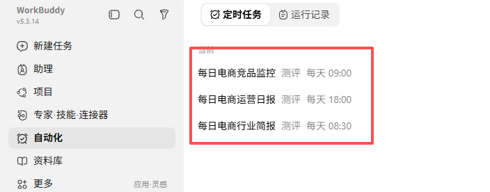
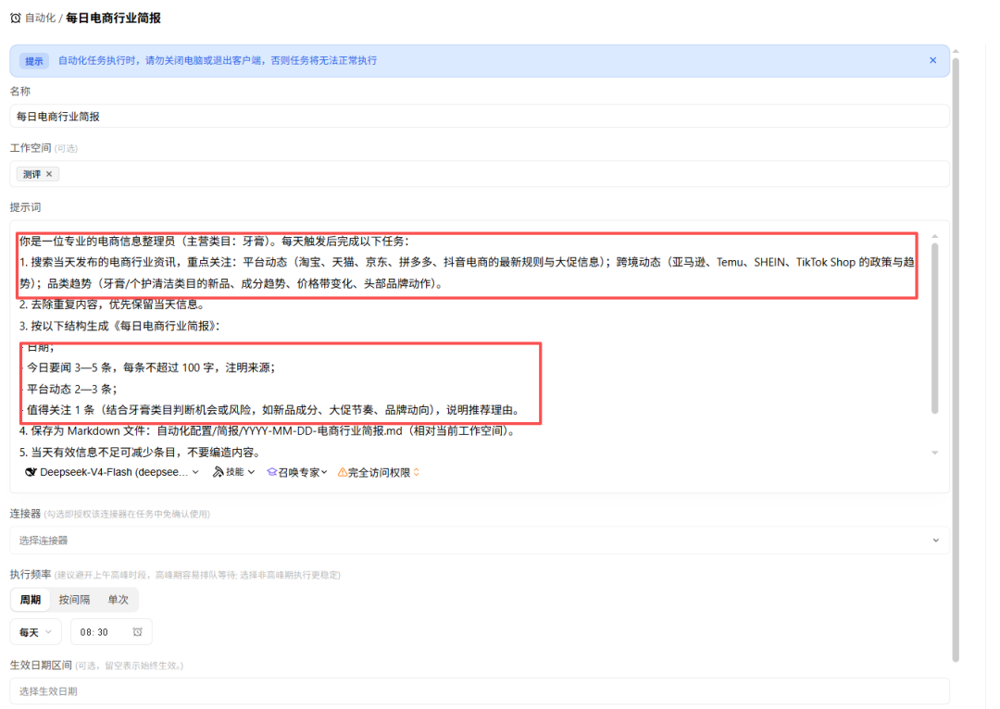
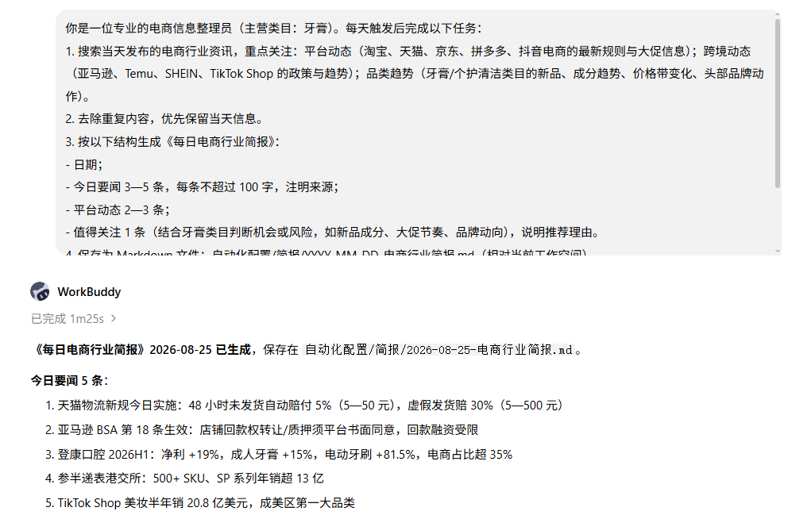
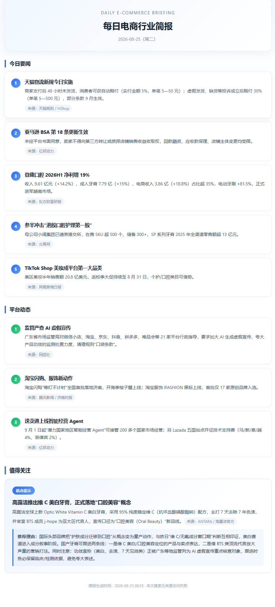
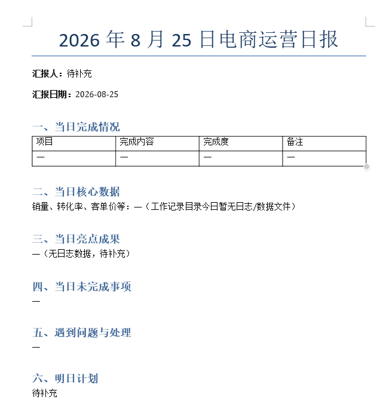
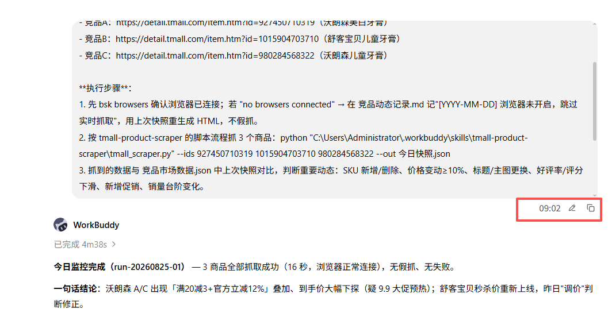
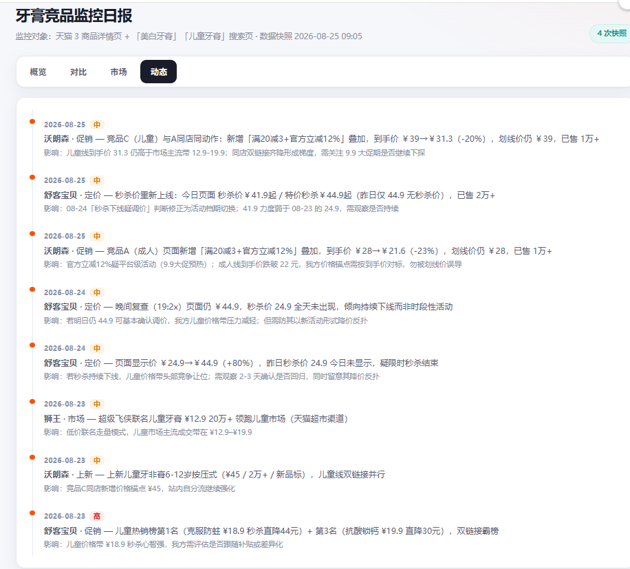
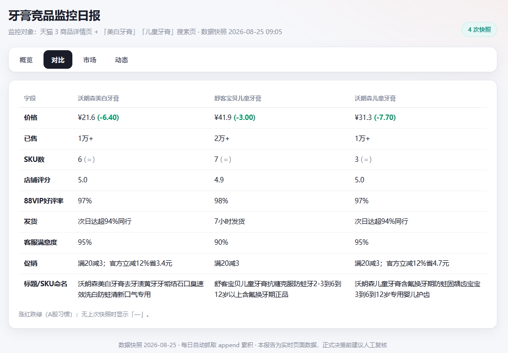
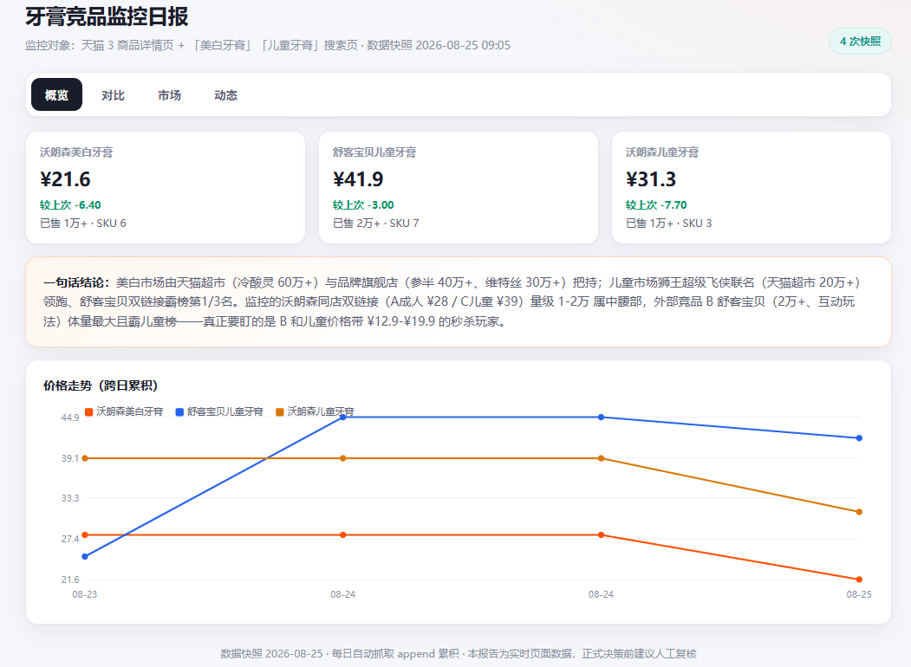

# 3000字教你如何用 Workbuddy 跑自动化任务? 三大场景实战 （附完整提示词）

> 作者：旺哥 · 公众号：AI应用实战派PRO  
> [查看微信公众号原文](https://mp.weixin.qq.com/s?__biz=MzY4NDA4MDUwMA==&mid=2247484893&idx=1&sn=fde4a594197c960efdc126a49dfc1205&chksm=f2dcab6f5843309663fc857b4662b6642f4e9f4c612bf248c2a5fcbff11d206fcdb6a39e9599#rd)
> [下载 HTML 图文包（含图片）](https://github.com/wangge-dev/wangge-articles/releases/download/html-archive/202608252109.zip) · [HTML 文件](../../html/2026/202608252109/article.html)

WORKBUDDY · AUTOMATION

把重复的电商工作

交给 AI 每天自动跑

WorkBuddy 自动化模块实测：3 个电商任务定时执行，简报、周报、竞品监控全部无人值守

2026.08.25 · FIELD TEST

3 个  自动任务  每天  定时执行  0 人工  值守运行

OPENING

Workbuddy自动化

好多人觉得自动化是个很神秘的事情，要会写脚本，懂程序，在ai时代之前，确实是这样，但现在大模型发展的这么迅速，我们普通人也可以自己跑自动化任务了

今天我们以电商行业为例，做电商，每天有大量重复工作：早上看行业类目有什么新动态，写日报，盯竞品动态。看昨日销售转化库存这些。这里面有些事规则固定、频率固定、判断标准也固定，手动做一遍很费时间。

而  WorkBuddy  的自动化模块，就是把这些已经跑通、规则稳定、需要重复执行的工作，配置成按时自行启动的任务。

今天我们就来简单讲讲自动化这个事情，当然复杂的自动化也不涉及，主要是思路展示。大家看完还是不会把文章丢给workbuddy就行。

有一点要说清楚：自动化不是把所有工作都交给 AI。需要临场判断、会对外发送、可能修改重要数据或规则经常变化的任务，仍然需要人工把关。
适合自动化的，是那些不用动脑、纯重复的收集整理活。

下面开始！

01 · TYPES

自动化任务的两种类型

自动化任务分两类，选哪种取决于业务节奏：

类型  |  含义  |  适合场景   
---|---|---  
定时循环任务  |  按固定时间或周期重复运行  |  每日简报、每周周报、周期性统计   
一次性定时任务  |  指定日期和时间只执行一次  |  到期提醒、特定日期生成报告   
  
两类任务的共同点：创建时就要把  输入、操作、输出、异常处理和触发时间写完整  。这一条决定了任务能不能无人值守跑下去。

02 · CONFIG

一项自动化任务需要配置什么

进入 WorkBuddy 的自动化模块，新建一项任务，至少包含四组信息：

 配置项  |  要回答的问题
---|---  
任务名称  |  以后如何快速识别这项任务   
工作空间  |  AI 从哪里读取素材、结果保存到哪里   
任务指令  |  每次触发时 AI 到底要做什么   
触发时间  |  何时运行，是一次性还是循环   
  
有一点要注意自动化任务的提示词和普通对话不一样。任务触发时你很可能不在电脑前，指令必须能独立运行，不能依赖你临时补充背景。具体有四项要求：

指令完整自包含  。  不依赖用户临时补充背景，任务自己知道要干什么。

输出位置明确  。  写清楚目录、文件名和格式，比如"保存为 自动化配置/简报/2026-08-25-电商行业简报.md"。

失败处理明确。  素材缺失、网页不可访问或结果不足时怎么处理，提前写好。

避免必须确认的动作。  无人值守任务里不要安排需要临时选择或确认的步骤，比如"你要不要继续？"这种会卡住。

自动化不是"设置一次就不管"。一个可靠的自动化任务，是  触发、执行、检查、报告、调整的完整运行流程  ：到点触发，AI
执行，执行后检查结果，把运行情况报告出来，发现问题再调整指令。这一步我后面实测时会具体演示。

03 · FLOW

创建自动化任务的完整流程

第一步：先手动跑通。
不要把没验证过的提示词直接设为自动运行。先在普通任务里完整跑一次，确认输入文件能找到、所需组件可用、输出格式符合要求、任务不会卡在确认步骤、执行成本和耗时能接受。

第二步：进入自动化模块。  新建任务，填写任务名称，选对工作空间。工作空间选错，往往是"任务显示成功但找不到结果"的直接原因。

第三步：写入完整任务指令。  推荐按这个结构写：

目标（每次触发后完成什么）；

输入（读取哪些目录、文件或网络来源）；

步骤（搜索、筛选、整理、生成的顺序）；

输出（保存路径、文件名、格式）；

异常处理（无数据、缺文件、网络失败时如何记录）；

禁止动作（不删除、不覆盖、不自动对外发送）。

第四步：设置触发规则。  按实际需要选日期、星期和时间。频率不是越高越好，要根据业务更新节奏和 Credits 消耗来定。

第五步：启动前测试。
用"立即执行一次"检查：能否正常启动、是否完成全部步骤、结果是否保存在指定位置、消息是否推送成功、执行记录里有没有异常。测试通过后再启用周期触发。

04 · CASE 1

案例一：每天定时生成电商行业简报

任务目标。  每天早上 8 点 30 分搜索当天的电商行业资讯，去重、筛选后生成 HTML
简报，保存到工作空间。（当然每个人的上班时间不同，这里只是思路演示）

可复用的任务指令（直接抄）：

你是一位专业的电商信息整理员。每天触发后完成以下任务：

1\.
搜索当天发布的电商行业资讯，重点关注平台动态（淘宝、天猫、京东、拼多多、抖音电商的最新规则与大促信息）、跨境动态（亚马逊、Temu、SHEIN、TikTok
Shop 的政策与趋势）、品类趋势（爆款、选品、类目排行变化）；

2\. 去除重复内容，优先保留当天信息；

3\. 按以下结构生成《每日电商行业简报》：日期；今日要闻 3 到 5 条，每条不超过 100 字并注明来源；平台动态 2 到 3 条；值得关注 1
条，说明推荐理由；

4\. 保存为 Markdown 文件：自动化配置/简报/YYYY-MM-DD-电商行业简报.md；

5\. 信息不足可减少条目，不要编造内容；

6\. 网络或来源访问失败时，在文件末尾记录失败原因。

结果验收。  新闻是否属于目标日期；每条内容是否有可核查来源；同一事件有没有重复出现；文件是否按日期命名。

重要提醒。  自动抓取的新闻有时效性，也可能包含不准确或重复的内容，正式用之前还是打开原始来源核一遍。

05 · CASE 2

案例二：每日自动生成运营日报

任务目标。  每天读取工作日志，整理为 Word 日报。

可复用的任务指令（电商版）：

每天执行一次当日电商运营日报生成任务。  
  
第一步：收集日志  
读取 工作记录/ 中当天创建或修改的  .txt /Excel/PPT  文件；如果没有找到，再搜索文件名中包含"日志"或 log
的文件；同时查找当天运营数据文件（销量、转化等表格，如有）。  
  
第二步：整理日报  
按以下结构生成：  
\- 标题：[年份][月日]电商运营日报；  
\- 汇报人：从日志提取，无法确认时标注"待补充"；  
\- 汇报日期：执行当天；  
\- 当日完成情况：用"项目、完成内容、完成度、备注"表格呈现；  
\- 当日核心数据：销量、转化率、客单价等，有数据就写，没有标注"待补充"；  
\- 当日亮点成果：尽量引用日志中的数据；  
\- 当日未完成事项；  
\- 遇到问题与处理；  
\- 明日计划：没有明确记录时标注"待补充"。  
  
第三步：保存  
保存为 工作记录/日报/[年份]-[月日]日报.docx（相对当前工作空间）。  
不修改原始日志，不虚构完成情况与数据。  
若导出失败：保留已整理的正文，把错误信息写入执行记录，检查文档生成组件，修复后重新测试；不要把"任务已运行"当成"文件已成功生成"。

这个任务依赖 Word 文档生成能力，上线前要先确认本机组件或对应 Skill
可用。还要记住一点：不要把"任务已运行"当成"文件已成功生成"，实际去目录里看一眼文件。

06 · CASE 3

案例三：定时监控竞品动态

任务目标。  定期检查指定竞品的动态，有重要变化时追加详情，没有时留下当天记录。

这里我用的是  BrowserSkill 插件这个是腾讯自家出的，也比较好用，可以看下下面文章

[ WorkBuddy 装上 BrowserSkill 之后真的能照着我的操作干活了！
](https://mp.weixin.qq.com/s?__biz=MzY4NDA4MDUwMA==&mid=2247484759&idx=1&sn=be2017e277e9e058560e6a2f5f1709af&scene=21#wechat_redirect)

可复用的任务指令（当然下面的提示词比较简单，大家  按照自己的监控点来改就行，这里是思路演示，用  BrowserSkill 插件的时候要多跑几次，才能顺畅
）：

每次触发后执行电商竞品动态监控。监控对象：竞品 A、竞品 B、竞品 C（填你要盯的店铺或商品链接）。执行步骤：

1\. 搜索竞品当天的动态：上新、改价、主图或详情页更换、促销活动、评价口碑变化、负面事件；

2\. 判断是否属于重要动态：新链接、明显价格调整、重要促销、负面事件；

3\. 有重要动态就追加到 竞品动态记录.md，每条记录：日期；竞品名称；动态类型（上新/定价/促销/口碑/其他）；动态摘要（100 字以内）；信息来源
URL；重要程度（高/中/低）；我方影响（1 到 2 句话）；

4\. 没有重要动态就在文件末尾记录"[日期] 今日无重要竞品动态"；

5\. 无法核实的信息不要写成确定事实。

我实测时监控了 3 个天猫牙膏商品，连续跑了 3 天。第一天抓到舒客宝贝儿童牙膏价格从 24.9 跳到 44.9，涨幅
80%；第二天确认是秒杀档期切换而不是涨价；第三天秒杀重新上线，回到 41.9。如果只看单天数据，很容易误判成"竞品涨价了"。

07 · LOG

运行记录与常见问题

自动化模块会保存每次执行记录，以不同状态区分成功与失败，还能查看详细过程和输出内容。跑自动化常见的几个问题，对照处理：

 问题  |  常见原因  |  处理方法
---|---|---  
显示成功但找不到结果  |  未写明输出路径  |  指令里给出目录、文件名和格式   
任务一直不结束  |  指令要求 AI 等用户确认  |  删除交互环节，选择预先写清   
输出内容质量差  |  指令过于模糊  |  增加内容结构、筛选标准和来源要求   
每次输出差异过大  |  缺少固定模板  |  任务指令里加入严格格式   
消息没有送达  |  连接器未配置或推送未开启  |  先验证渠道连接，再单独测试推送   
文件生成失败  |  依赖、权限或路径异常  |  查看详细记录，修复后重新运行   
  
08 · COST

运行频率管理

自动化任务会在后台消耗 token。几个管理原则：

根据真实需要设置频率，不是所有任务都必须每天跑；

把提示词写准确，减少反复搜索和无效尝试；

先手动测试，再启用周期任务；

定期检查执行记录，停用长期没价值或持续失败的任务；

重要任务先在小范围、低频率下验证。具体计费方式和额度可能随版本变化，以使用时的官方页面为准。

可以参照我的最爱：  Deepseek-V4-Flash

09 · CHECKLIST

好的自动化任务检查表

配置完一项自动化任务，按这 11 条过一遍：

1\. 目标明确，单次执行的终点清楚；

2\. 输入来源稳定，路径真实存在；

3\. 指令完整，不依赖临时追问；

4\. 输出目录、文件名和格式明确；

5\. 对无数据、缺文件和网络失败有处理规则；

6\. 不包含无人值守时不该执行的高风险动作；

7\. 已通过至少一次手动测试；

8\. 已验证文件结果，而不只看任务状态；

9\. 已配置必要的通知渠道；

10\. 频率与 token 成本合理；

11\. 有执行记录和定期复查机制。

10 · SUMMARY

小结

自动化的价值，是把成熟的重复流程变成持续运行的任务。

先手动跑通，再定时执行，是最重要的上线顺序。

咨询讨论请加：  HPwangtang

AI 应用实战派 PRO

觉得本文还不错，赶紧点赞收藏吧。

关注我，还有更多精彩文章和教程。

我是  AI 应用实战派pro  ，只聊落地，不讲虚的。

---

本文最初发布于微信公众号「AI应用实战派PRO」。未经特别说明，正文与配图采用 [CC BY-NC-ND 4.0](https://creativecommons.org/licenses/by-nc-nd/4.0/deed.zh-hans) 许可。
