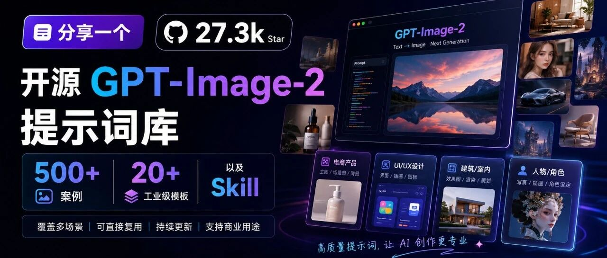
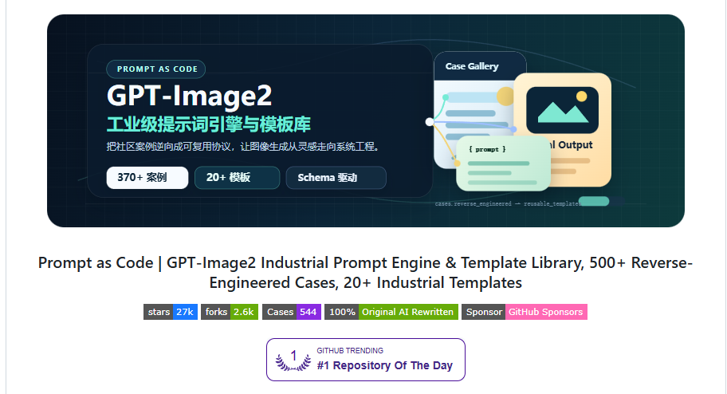
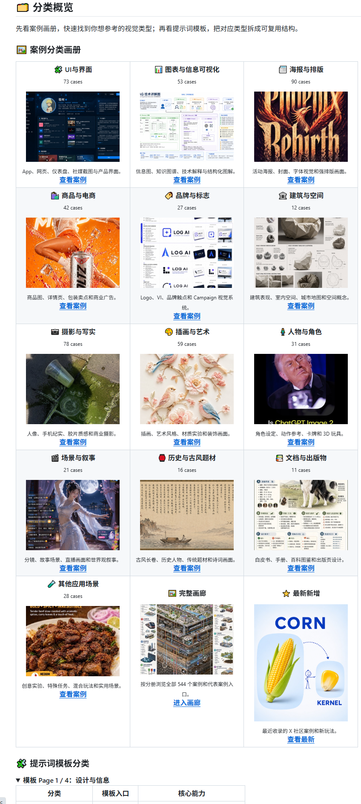
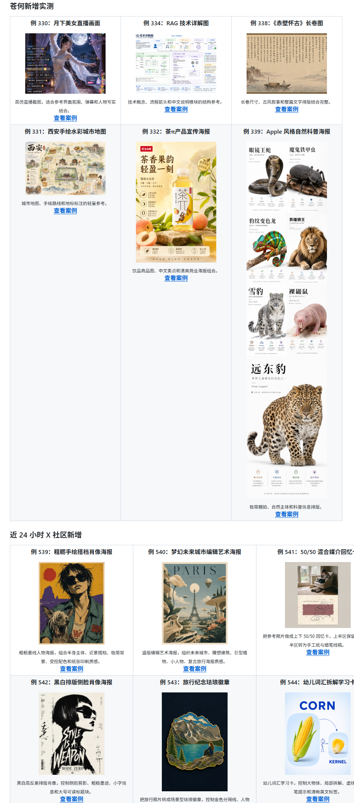
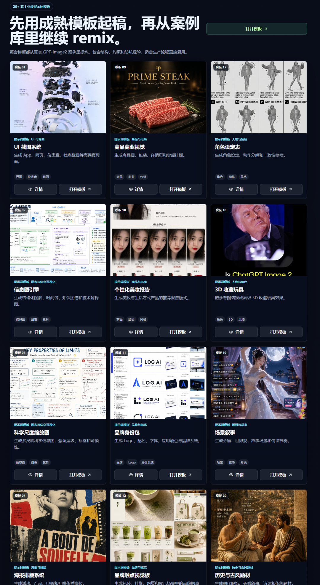

# 分享一个 27.3K Star 开源 GPT-Image-2 提示词库 ：500+ 案例,20+ 模板以及 Skill（商品图/海报/动漫）

> 作者：旺哥 · 公众号：AI应用实战派PRO  
> [查看微信公众号原文](https://mp.weixin.qq.com/s?__biz=MzY4NDA4MDUwMA==&mid=2247485021&idx=1&sn=9656268ab448e5a534c1311fe23cf6af&chksm=f2ebde318d1cdb15e6733f011eb3987c2c56bfe8d29935e9c380e785666fd2d12e7328950c58#rd)
> [下载 HTML 图文包（含图片）](https://github.com/wangge-dev/wangge-articles/releases/download/html-archive/202609022208.zip) · [HTML 文件](../../html/2026/202609022208/article.html)

最近看到一个苍何大佬开源的项目：  ** awesome-gpt-image-2  ** 。

仓库地址：  https://github.com/freestylefly/awesome-gpt-image-2

对做电商的人来说，它可以用来找  商品主图、包装视觉、详情页卖点图、品牌海报和产品摄影  的参考。看到接近的效果后，直接复制
Prompt，再换成自己的商品、卖点和文案，不用每次从零开始写。

它到底是什么

它不是一个新的图片生成模型，而是一个围绕  GPT-Image-2  整理的案例库、提示词模板库和 Agent Skill。

普通提示词合集通常只给一段文字。这个项目会进一步拆出主体、构图、光线、材质、颜色、文字和版式，让提示词可以像模板一样修改和重复使用。

它把这种方式叫作  ** Prompt as Code  ** 。简单理解，就是先从案例里确定想要的效果，再用模板把自己的商品和内容替换进去。

除了电商，它还能做什么

仓库里的案例还包括  公众号配图、知识信息图、技术图解、封面海报、UI 界面、写实摄影、插画、人物角色、建筑空间、故事分镜、古风长卷和出版物排版  。

案例最直接的价值，是让你先看见大致能做成什么样，再去研究对应的提示词结构。

怎么用

** 最简单的方法，是直接打开可视化网站。  **

** https://gpt-image2.canghe.ai  **

网站支持查看案例大图、按风格和场景筛选、复制完整 Prompt。找到喜欢的案例后，把提示词里的主题、商品、颜色和文字改成自己的内容，再交给出图工具就行。

如果经常使用  Codex  、  Claude Code  或  Workbuddy  ，也可以安装项目提供的 Agent
Skill。之后只要说清楚想做什么图，Agent 就能从风格库里选择接近的模板、分类和案例，再整理出结构化提示词。

官方安装命令

npx skills add freestylefly/awesome-gpt-image-2 --skill gpt-image-2-style-
library --agent claude-code codex --global --yes --copy

想研究模板结构或二次开发，可以直接进入 GitHub 查看源码和数据。

获取地址

GitHub 仓库

https://github.com/freestylefly/awesome-gpt-image-2

可视化案例网站

https://gpt-image2.canghe.ai

补充一句：仓库提供的是开源资料，真正出图仍需可用的模型入口；第三方案例用于商业项目时，请先核对原始授权。

咨询讨论请加：  ** HPwangtang  **

AI 应用实战派 PRO

觉得本文还不错，赶紧点赞收藏吧。

---

本文最初发布于微信公众号「AI应用实战派PRO」。未经特别说明，正文与配图采用 [CC BY-NC-ND 4.0](https://creativecommons.org/licenses/by-nc-nd/4.0/deed.zh-hans) 许可。
