# 开源我的：公众号文章/ Skill /教程/资料包/提示词

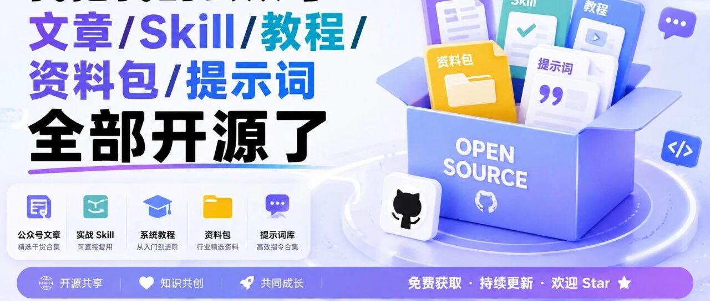

> 作者：旺哥 · 公众号：AI应用实战派PRO  
> [查看微信公众号原文](https://mp.weixin.qq.com/s?__biz=MzY4NDA4MDUwMA==&mid=2247485055&idx=1&sn=cdbf21be1d98c7e0ca189d294414cff2&chksm=f22856e822fc723872cdb22add44051b93474619417ff767705fc940cfff4f7e739290062b92#rd)
> [下载 HTML 图文包（含图片）](https://github.com/wangge-dev/wangge-articles/releases/download/html-archive/202609032237.zip) · [HTML 文件](../../html/2026/202609032237/article.html)

这几天，我把已发布的公众号文章、可以复用的 Skill，提示词以及后续会持续更新的实战项目，统一整理到了 GitHub。  地址在下面，欢迎大家点个
Star 哈!

GitHub 主页：github.com/wangge-dev

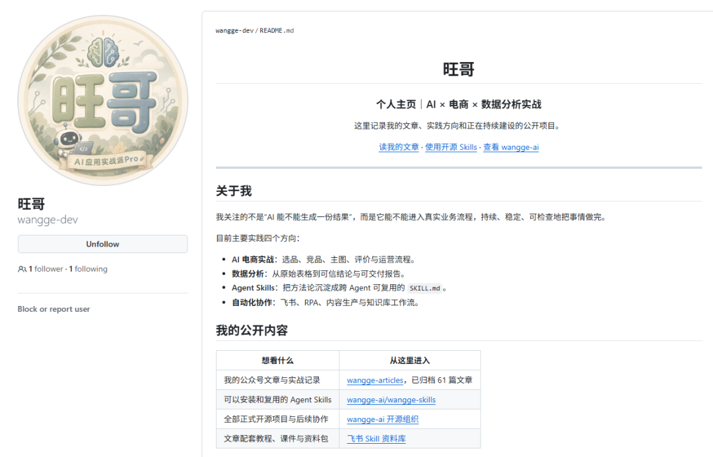

旺哥 GitHub 个人主页首屏

01

为什么要专门做一个 GitHub 主页

之前这些内容分散在公众号、本地文章文件和飞书资料库里。

公众号适合阅读和持续更新，飞书适合放教程、课件与历史资料包，但当文章和 Skill 数量越来越多以后，还是需要一个公开、清楚、能长期维护的总入口。

更多的是方便大家使用哈！

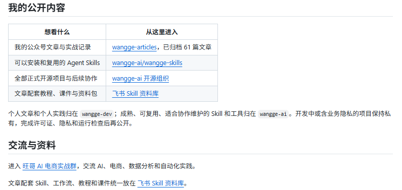

旺哥主页 → 公众号文章 / 开源 Skills / 飞书资料 / 实战社群

02

第一部分，是我的公众号文章

文章统一放在  ** wangge-dev/wangge-articles  ** 。

https://github.com/wangge-dev/wangge-articles

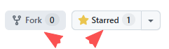

目前一共归档了 61 篇，主要是 AI 工具、真实工作流、电商数据分析、电商视觉和内容生产。文章可以按主题浏览，每一篇也保留了微信公众号原文链接。

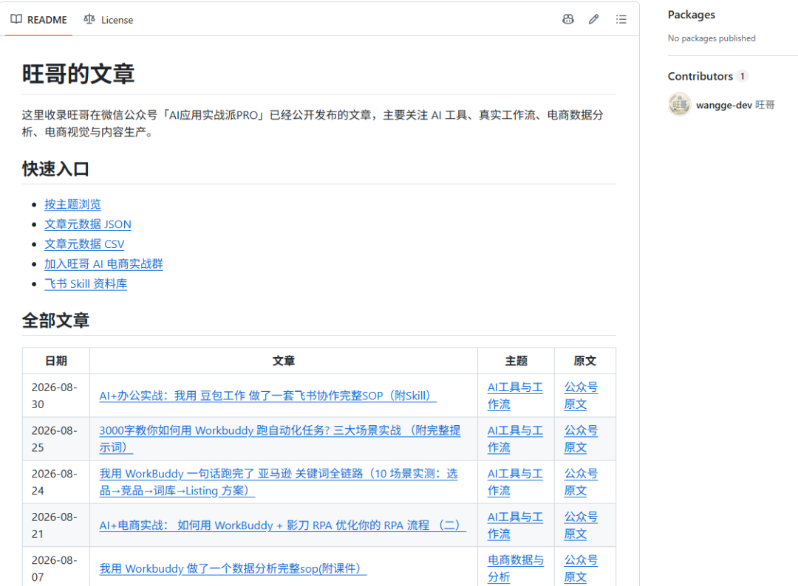

文章仓库目录与主题索引

03

第二部分，是可以安装使用的 Skill

正式开源的 Skill 统一放在  ** wangge-ai/wangge-skills  ** 。

https://github.com/wangge-ai/wangge-skills

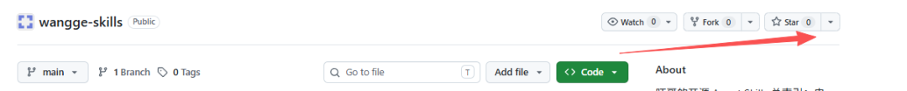

首批公开了 7 个，包括 GitHub 仓库拆解、高潜力项目发现、电商主图诊断、前端设计、RPA 流程、电商市场洞察和竞品分析。  后续陆续会上传完毕

这些内容不只是几段提示词。每个 Skill 都有标准 SKILL.md，需要脚本的会保留必要脚本，同时说明输入、输出、依赖和使用边界。

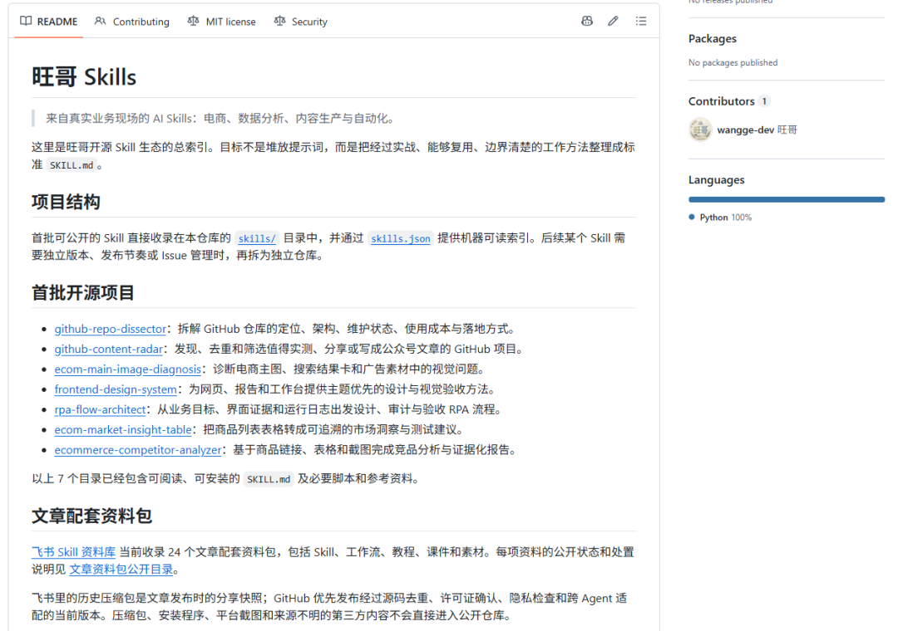

04

个人主页和开源组织

我现在保留了两个入口：wangge-dev 和 wangge-ai。

https://github.com/wangge-ai

** wangge-dev  ** 是个人主页，放我的文章、实践方向和对外介绍；  ** wangge-ai  **
是开源组织，后面主要放成熟、可复用、适合多人协作维护的 Skill 和工具。

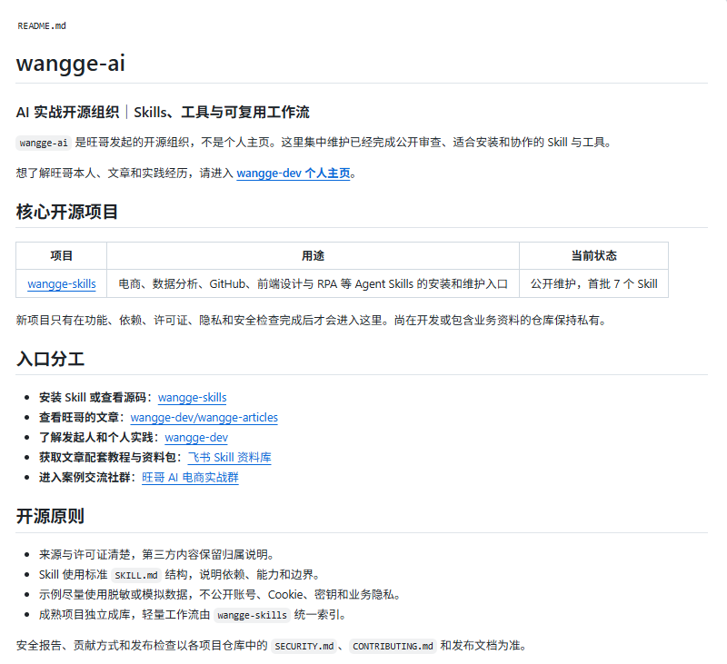

05

提示词库

这些我日常沉淀的提示词库，还是比较全面的，

欢迎大家点个 Star 哈!

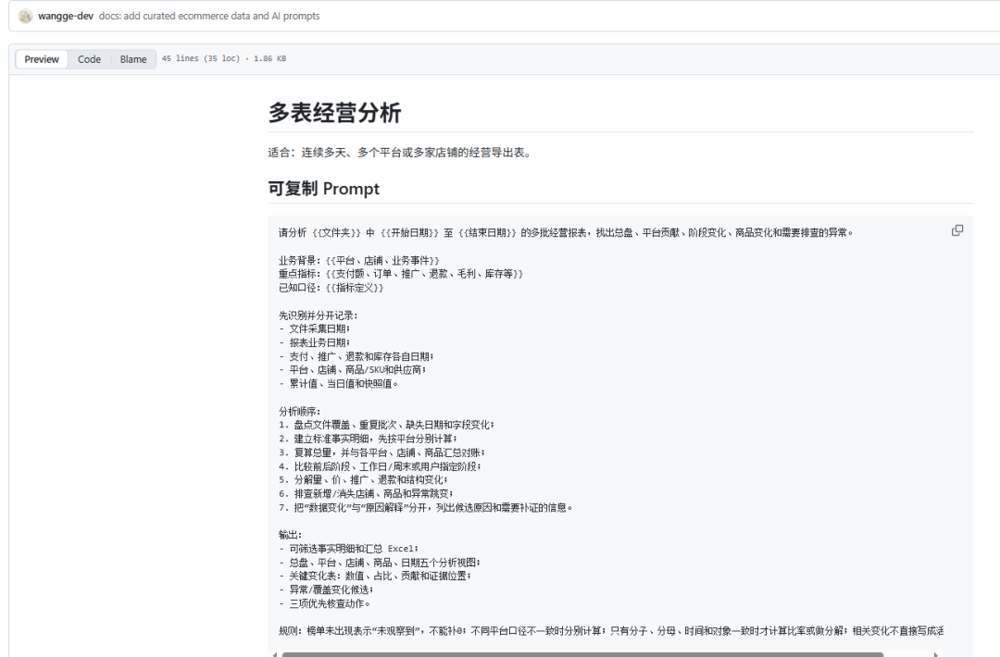

位置和部分提示词目录

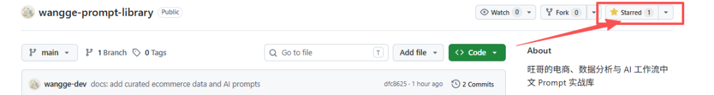
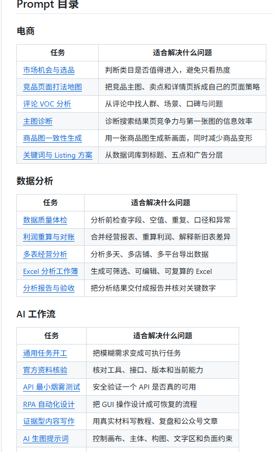

06

飞书资料库

飞书 Skill 资料库目前整理了 24 个文章配套资料包，里面既有 Skill，也有工作流、课件、模板和历史分享包。

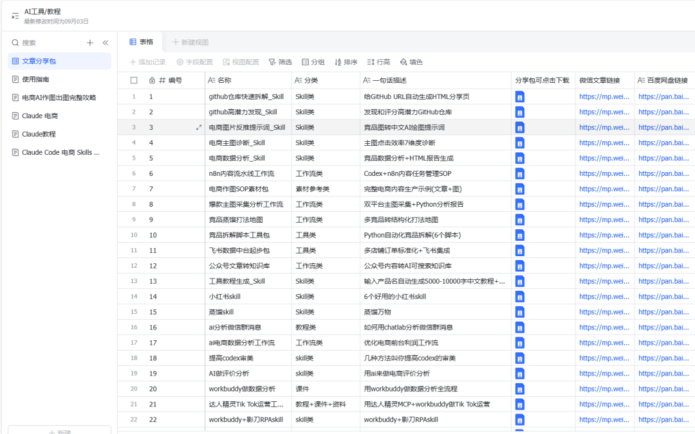
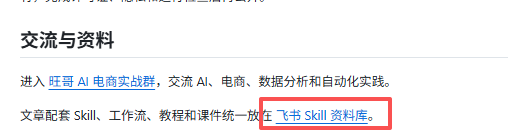

07

最后，怎么使用这个主页

如果你想看我以前写过的 AI、电商和数据分析文章，就进入文章仓库；

如果你想研究或安装 Agent Skill，就进入 wangge-skills；

如果需要文章配套教程、课件和历史资料，再进入飞书资料库。

后续公开的新文章、新 Skill 和成熟项目，我也会继续从这个主页统一更新。

咨询讨论请加：  ** HPwangtang  **

AI 应用实战派 PRO

觉得本文还不错，赶紧点赞收藏吧。

---

本文最初发布于微信公众号「AI应用实战派PRO」。未经特别说明，正文与配图采用 [CC BY-NC-ND 4.0](https://creativecommons.org/licenses/by-nc-nd/4.0/deed.zh-hans) 许可。
