# 我用 Codex 做了一个 深度数据分析 Skill (已开源）

> 作者：旺哥 · 公众号：AI应用实战派PRO  
> [查看微信公众号原文](https://mp.weixin.qq.com/s?__biz=MzY4NDA4MDUwMA==&mid=2247485127&idx=1&sn=33a6a264758c5deacb777fae18238fd6&chksm=f2952be952b3e7bbb95da578bc4dd8ce6190ac809c058591ff2f4ea1bda825ad8db99e87d7aa#rd)
> [下载 HTML 图文包（含图片）](https://github.com/wangge-dev/wangge-articles/releases/download/html-archive/202609071533.zip) · [HTML 文件](../../html/2026/202609071533/article.html)

相信大家让 AI 做分析的时候都会遇到找不到分析的重点，找不到分析角度

AI做出来的分析废话太多，幻觉太高做出来的分析不靠谱。

本着解决以上痛点的目的，我让codex做了一个深度分析 Skill，叫 Data Lens

开源地址:  https://github.com/wangge-ai/data-lens

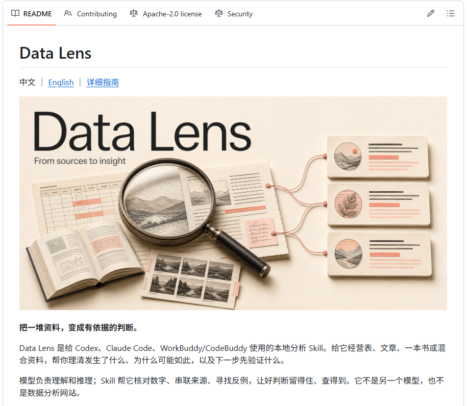

它可以配合 Codex、WorkBuddy 等智能体，分析  报表、文章、商品评论以及混合资料（图片/视频/JSON），
最后交出一份有结论、能回查依据的报告。

Data Lens
能补上更具体的分析方法，自动找到合理的分析角度，能确认统计口径，继续追查解释不通的地方，把不同来源放在一起核对。智能体负责理解和判断，脚本负责计算，两边配合着做。

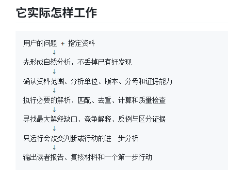

##  可以拿什么资料来用

做业务，可以给销售、利润、退款、投放和库存，客服反馈也可以。

做资料研究，可以给一批文章、访谈或聊天记录。解析名著也可以，跨篇章梳理观点、找矛盾，再把判断定位到原文。

PDF、图片和音视频同样在支持范围里，具体读取方式取决于本机已有工具。你不用先决定该用哪种统计方法，把资料位置和  真正关心  的问题交代清楚就行。

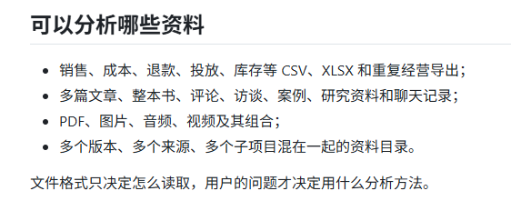

##  

##  Data Lens 几大特点（  实战分析  ）

** 1\. 没有分析角度，也能开始。  **

手里有一个大文件夹，只知道想找点有用的东西，可以让它先看哪些资料属于同一个问题，再挑值得深入的方向。

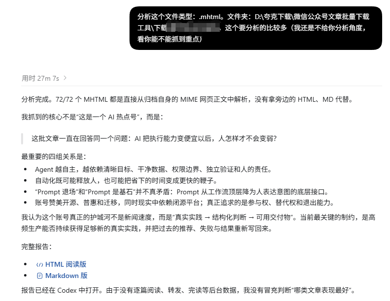

**  
**

** 2\. 先把数字代表什么弄清楚。  **

一百份文件不一定是一百个样本。重复导出的表、不同日期的累计值，都可能把数字算大。Data Lens
要先确认统计对象、缺失记录，再做计算。这一步可以减少AI的输出幻觉问题。

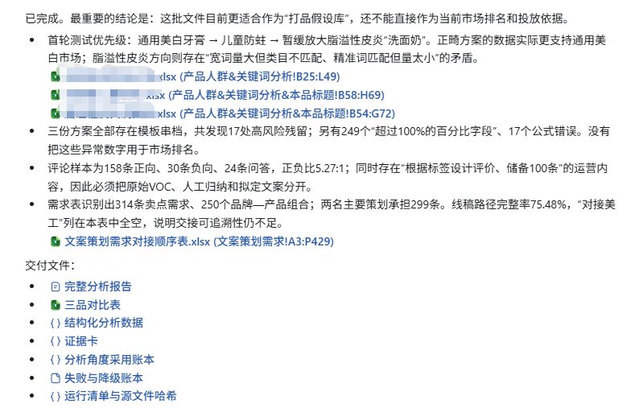

** 3.经营表分析  **

这次给的一堆，经营相关的表格，

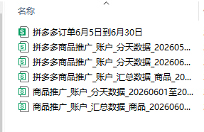

分析报告结果：

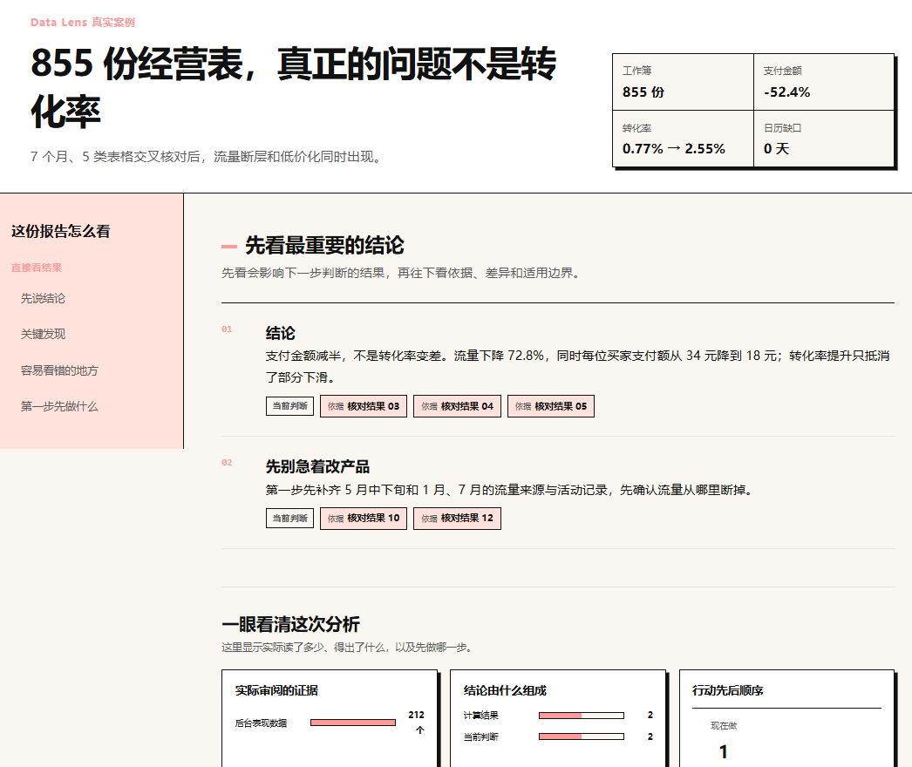

一份实际分析报告里，支付金额下降，转化率却上升，继续拆才看见访客和每位买家的支付金额都在减少。

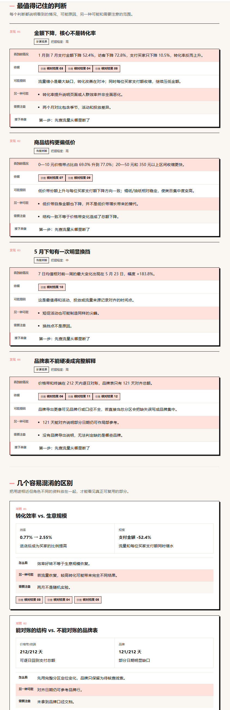
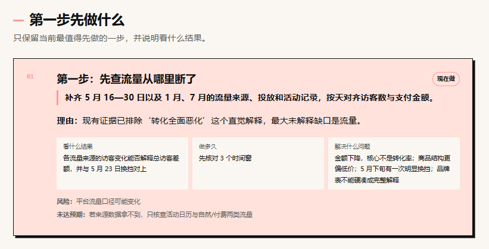

** 4\. 分析同作者的文章  **

像我写公众号文章也要分析别人的公众号，我用  Data Lens就很好的解决之前codex分析不全的问题，下面看下分析效果：  

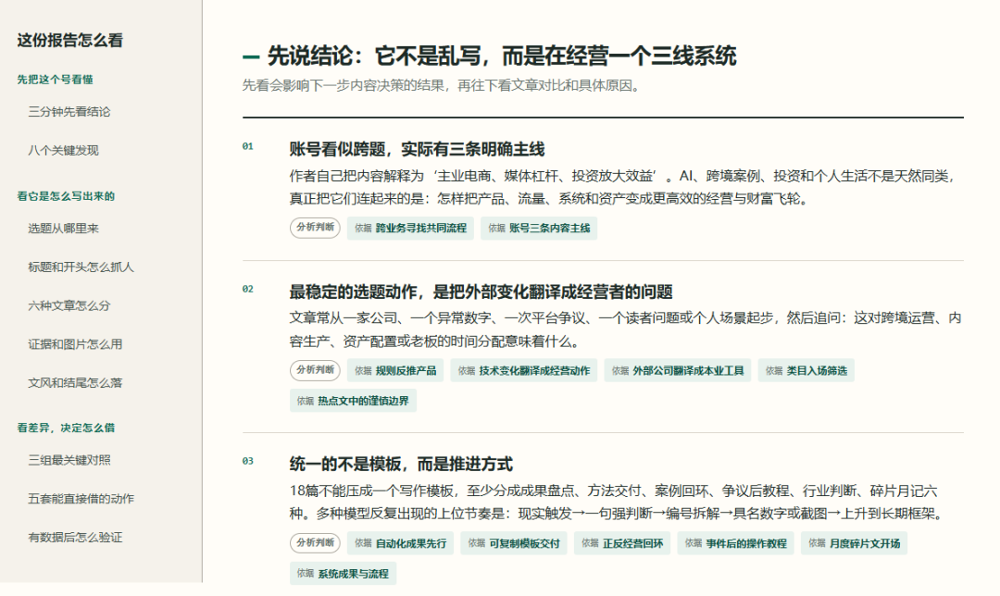
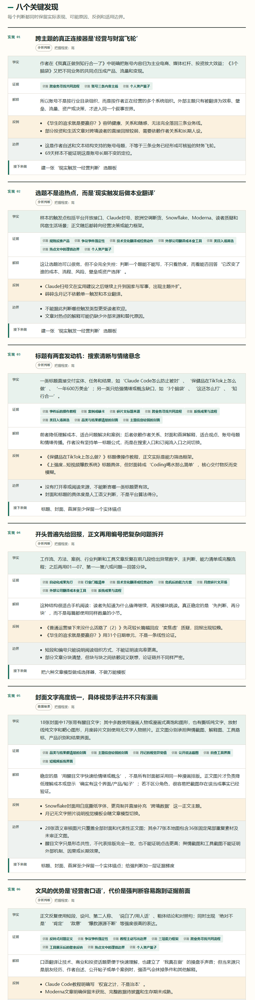
分析选题以及标题
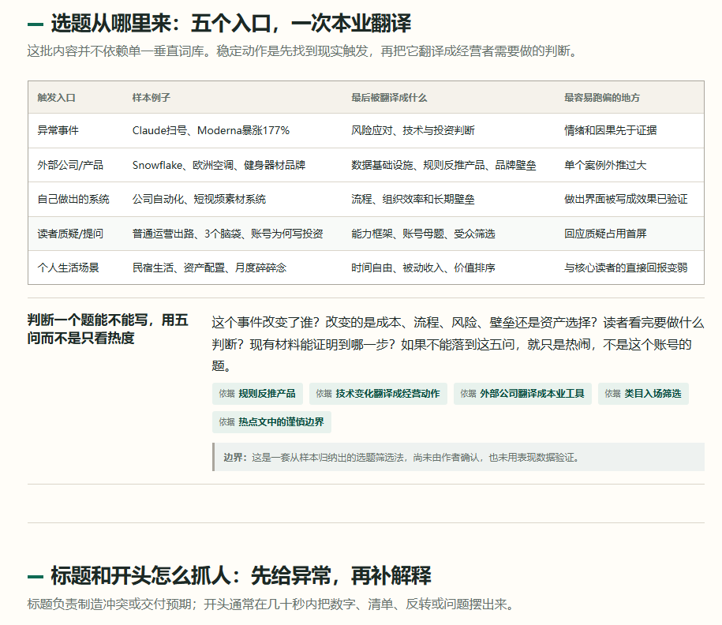
深度分析之后，给出完美方案  
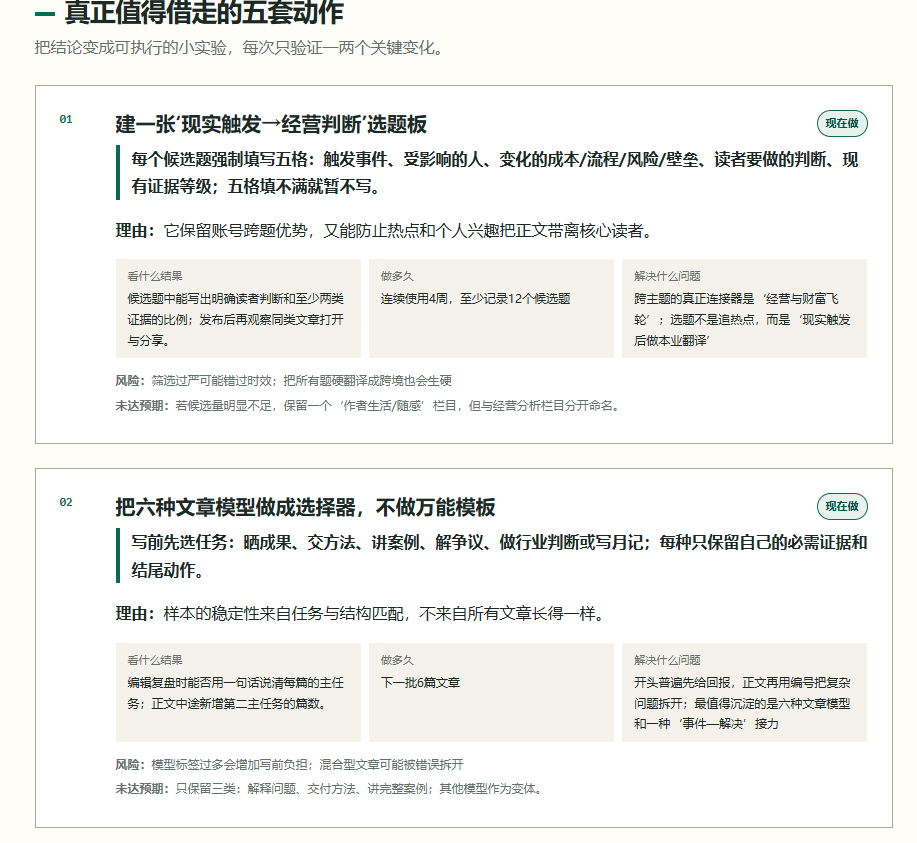

** 5\. 分析电商商品评价  **

** 这里我提供的是一份导出来的商品评价表  **

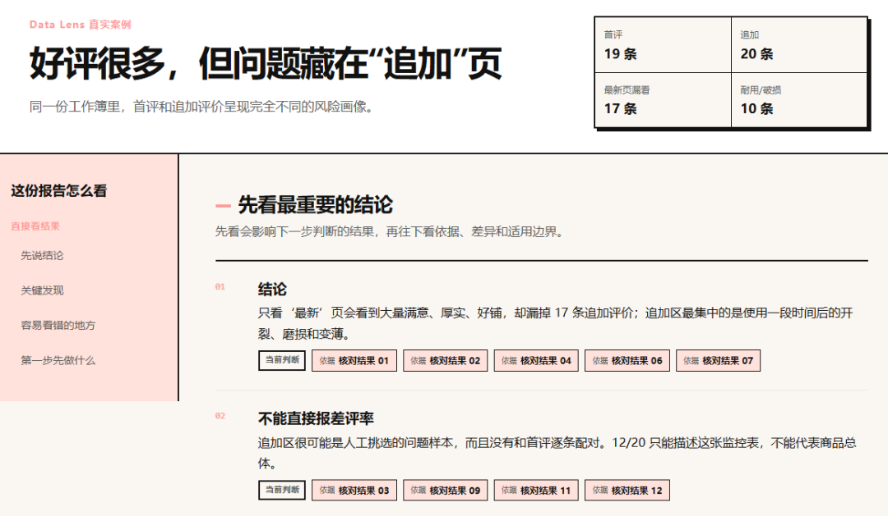
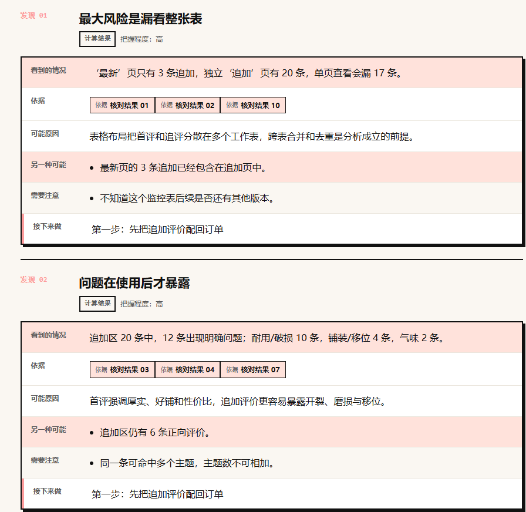
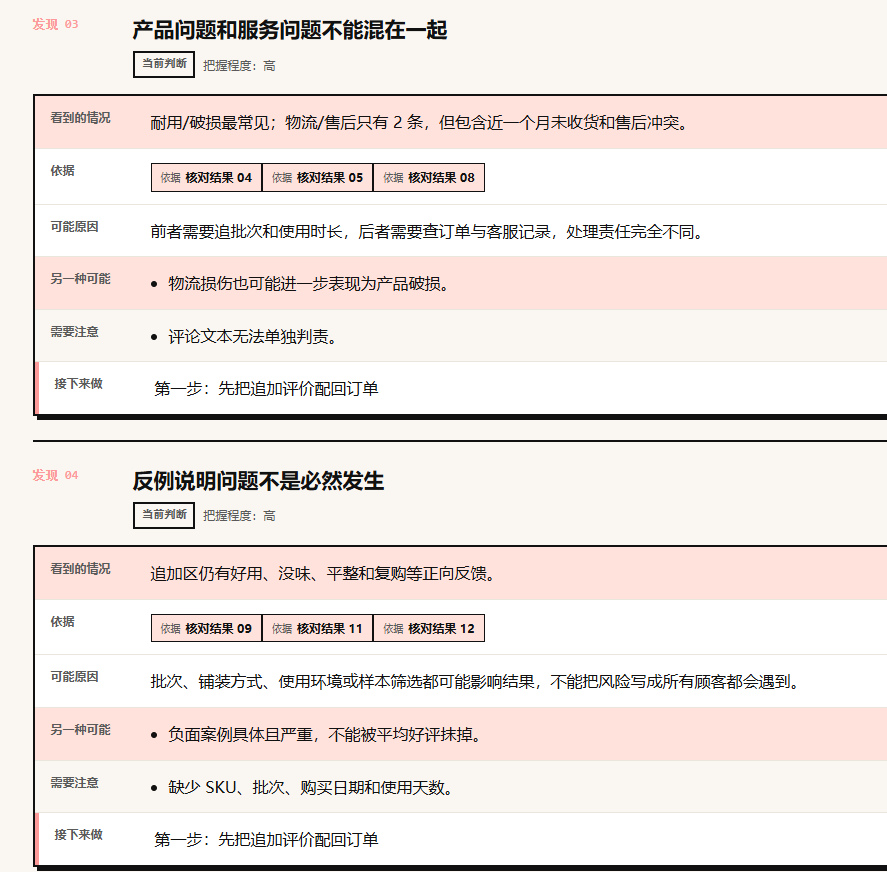

给出行动方案

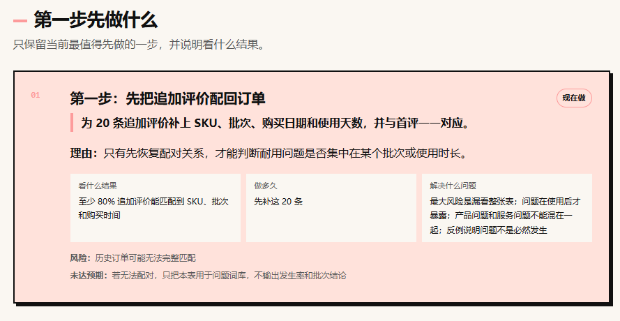

##  能分析到多深

Data Lens 把分析拆成几个不同的问题。

分析内容  |  具体回答什么   
---|---  
核对数字  |  字段、单位和统计口径是什么   
描述现状  |  发生了什么，变化有多大   
追踪时间  |  从什么时候开始变   
比较差异  |  哪些商品、人群或渠道不一样   
寻找解释  |  为什么可能这样，还有什么解释   
做预测  |  哪种方法对后续数据预测得更准   
判断因果  |  某个动作是否真的造成了变化   
帮助决策  |  考虑收益、成本后先做什么   
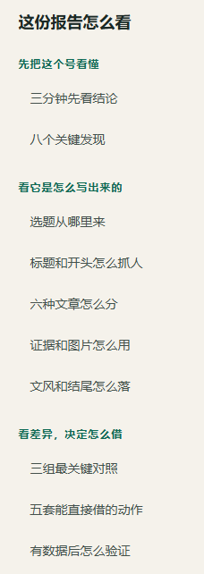
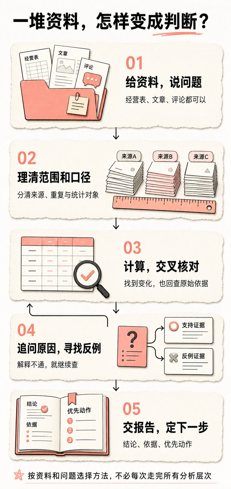

_ 流程示意：围绕问题核对，解释不通就继续查。  _

##  怎么安装和使用

项目已经放到 GitHub。

https://github.com/wangge-ai/data-lens

觉得有用的麻烦点个 Star 哈!

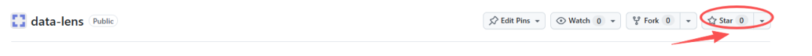

最大化 Data Lens 的能力

需要一个支持本地 Skill 的智能体，以及 Python 3.10
或更高版本。Excel、OCR、音视频等能力可能需要额外工具，让智能体先检查环境，缺什么再按任务准备。有R更好

用  Codex  ，可以直接把这段话发给它。

请按这个仓库的 README，把完整的 Data Lens 安装到 Codex 的个人 Skill 目录。  
https://github.com/wangge-ai/data-lens  
先检查运行环境，安装后确认能够识别这个 Skill。

WorkBuddy  也使用同一份完整 Skill，安装方式见仓库说明。前面的实际调用采用客户端内自安装。不要只复制
SKILL.md，配套脚本和参考文件也需要一起安装。

装好后，新开一个任务，给资料位置，再说你想解决什么问题。

使用 Data Lens 分析这个文件夹里的经营表、退款记录和客服反馈。  
我想判断下个月先调整投放、促销还是商品结构。  
请核对关键数字，找支持和相反的证据，给出一个优先动作。  
原文件不要改，报告和计算明细放到单独的输出文件夹。  
请给我一份可以直接打开的 HTML 报告。

没有明确方向，就把问题换成这一句。

使用 Data Lens 分析这些资料。  
先判断哪些材料适合放在一起，再找最值得深入的问题。  
不要只做摘要，重要结论请给出来源依据。

详细使用指南参考

https://github.com/wangge-ai/data-lens/blob/main/docs/guide.zh-CN.md

AI 应用实战派 PRO

觉得本文还不错，赶紧点赞收藏吧。

---

本文最初发布于微信公众号「AI应用实战派PRO」。未经特别说明，正文与配图采用 [CC BY-NC-ND 4.0](https://creativecommons.org/licenses/by-nc-nd/4.0/deed.zh-hans) 许可。
