# AI 电商实战：我用 WorkBuddy 搭建了一个电商情报站SOP，附 (完整提示词)

> 作者：旺哥 · 公众号：AI应用实战派PRO  
> [查看微信公众号原文](https://mp.weixin.qq.com/s?__biz=MzY4NDA4MDUwMA==&mid=2247485161&idx=1&sn=2f6e98d063079070cfb25ce992a60d07&chksm=f20a66a10013e0241e9e1cc2ab2d4bcb91bfb3585fb830e0530a009e8fcba741a637f583f783#rd)
> [下载 HTML 图文包（含图片）](https://github.com/wangge-dev/wangge-articles/releases/download/html-archive/202609081623.zip) · [HTML 文件](../../html/2026/202609081623/article.html)

之前写过一篇商品评价分析文章，我让 WorkBuddy
整理儿童牙膏评论，找用户在意什么、哪些地方值得改。这次继续用儿童牙膏，把平台规则和类目消息也整理起来，做成了一个电商情报站。

[ AI+电商实战：我用 Workbuddy 做了一个商品评价完整分析SOP（附Skill）
](https://mp.weixin.qq.com/s?__biz=MzY4NDA4MDUwMA==&mid=2247484723&idx=1&sn=aec447bd14e51d52b204de93280688c7&scene=21#wechat_redirect)

电商情报站会把与自己类目有关的内容整理在一起，给出接下来要做的事。比如一条规则涉及商品宣传，就继续检查主图、详情页和客服话术；遇到还在征求意见的文件，先记录下来，跟踪后续进展。

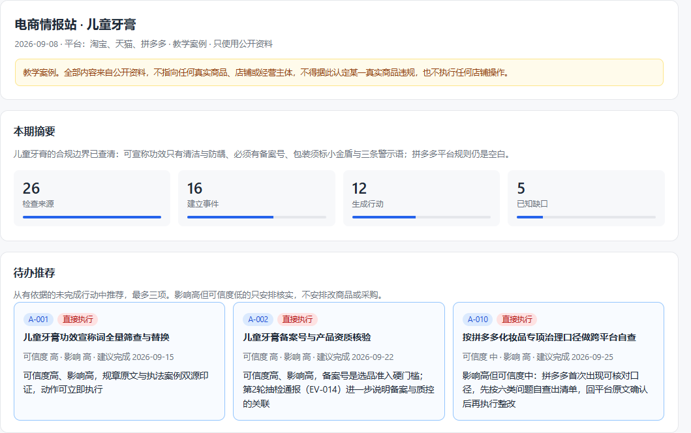

下面继续用儿童牙膏演示，从业务配置开始，一步步找到来源、整理情报，再做成能查看和更新的页面。每一步的提示词都放在对应位置，复制到 WorkBuddy就行。

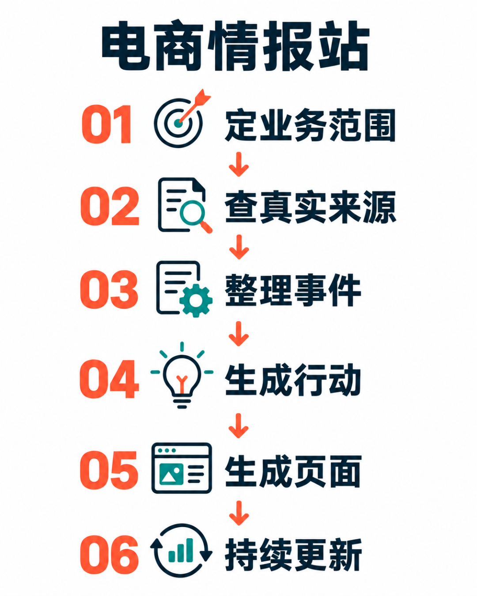

01

##  开始

先准备 WorkBuddy。还没安装的，可以按  官方入门说明  下载安装并登录。

在电脑上新建一个专门的文件夹，名字就叫“  电商情报站  ”。打开 WorkBuddy，新建任务，在输入框左下方的“选择工作空间”里选中它。

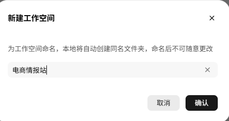

后面的配置、报告和网页都保存在这里，方便下次接着用。  工作空间操作说明

第一步，先把类目和平台告诉它。

提示词 01 · 复制后发送给 WorkBuddy

请在当前工作目录建立“电商情报站”。

这次使用教学案例，类目是儿童牙膏，平台是淘宝、天猫和拼多多，只使用可访问的公开资料。

我主要想知道哪些规则需要处理，有哪些时间节点要留意，以及有哪些商品或需求线索值得进一步核实。

请先生成《业务配置卡》，写清平台、类目、重点关键词和这三个问题各自要查什么。将监控范围分为规则与履约、活动与备货节点、品类与竞品信号、成本变化。

将配置保存到 data/业务配置卡.md。实际经营信息不足时不要编造，先按教学案例执行。完成后展示配置内容，只完成当前这一步。

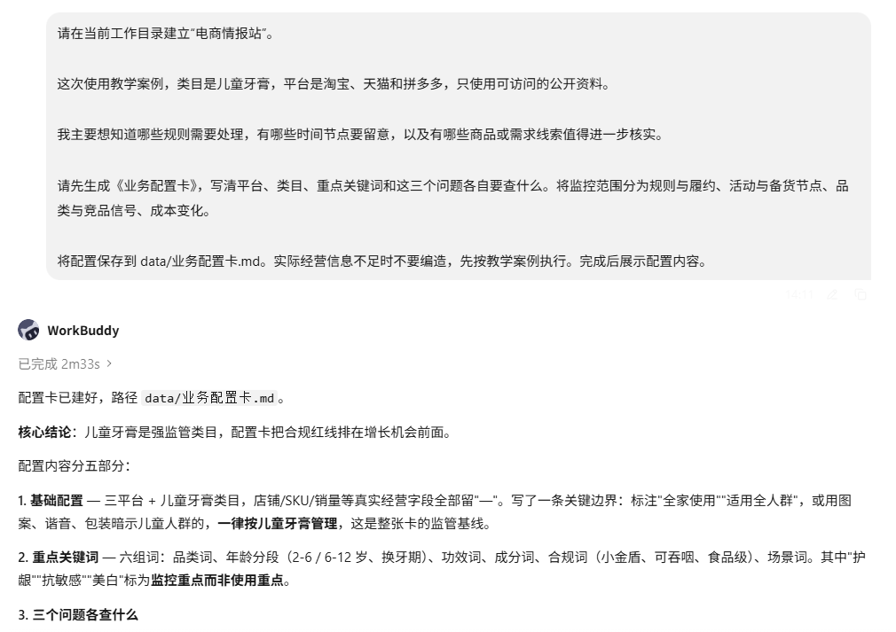

配置卡已经生成，平台、类目和关注问题都放在里面。儿童牙膏这份配置把标签与功效要求放在前面，接下来搜索资料时就有了明确范围。

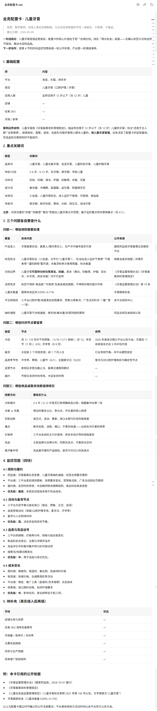

你不用一开始就把所有需求列完。先选一个类目，把最想弄清的几个问题写具体。

02

##  建立自己的情报来源清单

业务配置有了，第二步让 WorkBuddy 按这个范围去找资料。

规则类信息优先找平台和主管部门的公告，行业报道用来补充背景。把来源和用途放在一张表里，以后想查某个问题，就知道该从哪里找。

提示词 02 · 复制后发送给 WorkBuddy

请读取当前项目的业务配置卡，建立并实际检查来源清单。

优先查指定平台的规则中心、相关主管部门公告和官方标准信息。行业报道可以补充背景，普通经验文章先作为线索。

每个来源记录名称、链接、覆盖的问题、检查时间，以及实际读到了什么。区分正文已读、只读到列表、读取失败、只有线索。失败时写明原因，不用其他平台的消息替代。

把结果保存到 data/sources.json，并生成一份方便我阅读的《来源清单》，包含来源名称、原文链接、资料主题和对应的经营问题。

打开来源清单，展示已经读到正文的官方资料。只完成本步骤，等我发送下一步提示词。

儿童牙膏的来源清单里，可以看到下面这些已经找到的官方资料。

来源  |  对应的问题   
---|---  
第 124 号公告官方全文  |  儿童牙膏的功效类别、标志和警示要求是什么   
第 70 号公告官方全文  |  注册备案相关资料有哪些调整，适用条件是什么   
  
看这张表，重点是每个来源能回答什么。查商品宣传要求，就看第一份；准备备案资料，就看第二份。后面整理情报时，每条结论都能沿着链接找到依据。

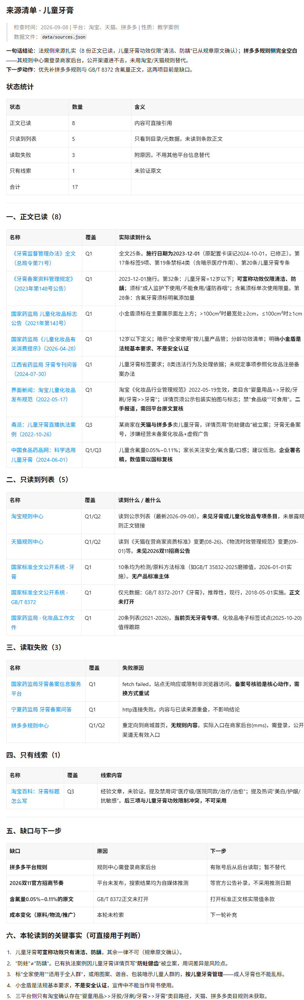

03

##  把消息整理成能继续跟踪的事件

让 WorkBuddy 按事件整理，给每件事一个固定编号，把相关来源放在一起。

提示词 03 · 复制后发送给 WorkBuddy

请根据已经读到的来源建立事件记录，保存到 data/events.json。

每件事记录固定编号、标题、平台、主题、适用对象、来源链接、关键依据，以及发布时间、生效时间、截止时间、首次发现和最近检查时间。

同一原始公告的不同转载合并为一个事件，保留相关来源。标题相似但内容不同的事件不要误合并。缺失日期写未确认，不猜测。

首次整理可以收录当前仍有效的重要旧公告。后续更新时区分新发布、旧事有进展、本期生效和临近截止，不能把今天重新看到的旧消息标成今天的新消息。

请打开事件记录，展示两条情报卡，说明每条的业务用途。只完成本步骤，等我发送下一步提示词。

整理好的卡片会把适用对象、日期和来源放在一起。读的时候，先看它是否涉及自己的商品，再看哪天需要处理。这样一条公告就能接到自己的工作安排上。

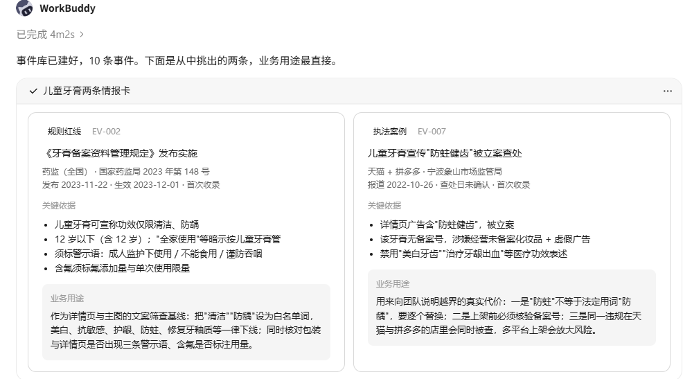

04

##  让每条重要情报落到一件具体的事

信息整理完，还要回答一个运营最关心的问题。看完以后，我该做什么。

“关注规则变化”很难执行。换成“检查在售商品的哪些材料，最后交一张什么表”，事情就清楚了。

提示词 04 · 复制后发送给 WorkBuddy

请基于业务配置和现有事件，生成行动清单。

每条重要情报分三段说明，发生了什么、为什么与本业务有关、接下来具体怎么做。事实依据与业务判断分开写。

行动要写清执行对象、建议负责人角色、建议完成时间和完成标志，保存到 data/actions.json。法定期限与我自行安排的工作期限分别标注。

同时生成第一期情报报告，汇总情报卡和行动清单，保存到 reports/，文件名包含本次日期，供后续更新时回看。

从有依据的未完成行动里推荐最多三项。可信度和影响程度分别判断，证据不足的高影响消息先安排核实，不直接安排改商品或采购。

这是教学案例，不能据此认定某个真实商品违规，也不要执行店铺操作。

请打开行动清单，展开一项推荐行动及对应情报。只完成本步骤，等我发送下一步提示词。

把这条行动拆开，运营才知道从哪里下手。

要处理的内容  |  做法  |  留下的结果   
---|---|---  
商品宣传内容  |  核查主图、详情页和客服话术等完整表达  |  按 SKU 整理的待核查表   
规则适用与产品依据  |  对照官方要求及备案、标签资料，判断存在的疑点  |  每个疑点的依据和待补材料   
后续改动  |  将需要修改和仍需核实的内容分开  |  改稿建议与跟进记录   
  
看行动清单时，先看要处理哪件事，再看完成后要交什么。比如这项宣传检查，最后需要留下按 SKU 整理的检查表和改稿建议，运营就能据此安排工作。

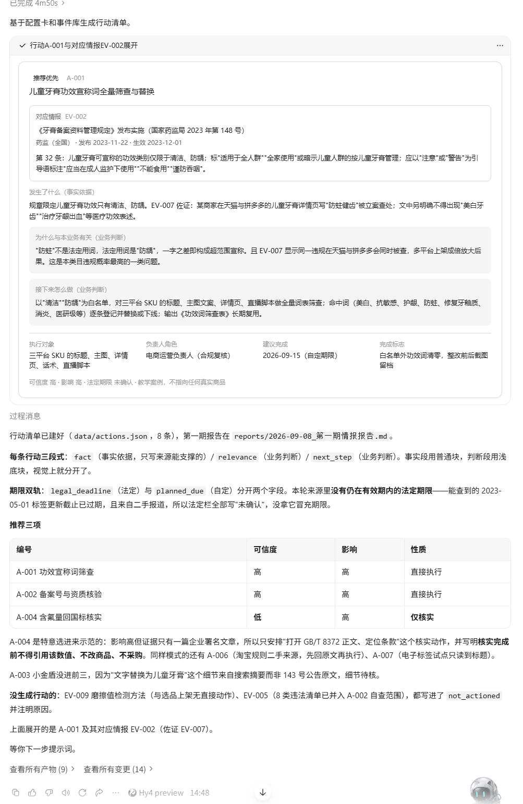

05

##  把记录做成一个方便查看的页面

情报和行动整理完，第五步把它们做成网页，放到一个页面里查看。

我希望打开页面先看到需要处理的事项，想了解原因时，再展开对应情报。这样每天看它的时候有个顺序。

提示词 05 · 复制后发送给 WorkBuddy

请用当前项目的事件、来源和行动记录生成 site/index.html，双击后可以在浏览器查看。

页面先显示本期摘要和待办推荐，再提供情报搜索、平台与主题筛选、行动状态、未来节点、历史报告和来源入口。没有真实数据时不要编造图表。

数量、标题和推荐事项必须从项目记录生成。行动状态允许修改并保存，请明确告诉我保存在什么地方。

如果页面只能先保存在浏览器，就提供导出改动、导入项目和刷新页面的完整办法。请实际检查搜索、筛选和状态保存，并展示页面结果；没有验证的功能如实说明。

请打开生成的页面，展示首页、一条展开的情报和行动区。只完成本步骤，等我发送下一步提示词。

页面可以按平台、主题筛选情报，也可以直接搜关键词。要找某项建议的原因，展开对应卡片就能看见内容和原文链接。

行动处理完，补上状态和备注。当前页面采用导出文件同步的方式，把导出的文件交给 WorkBuddy 写回项目即可，后续更新会接着这份记录继续处理。

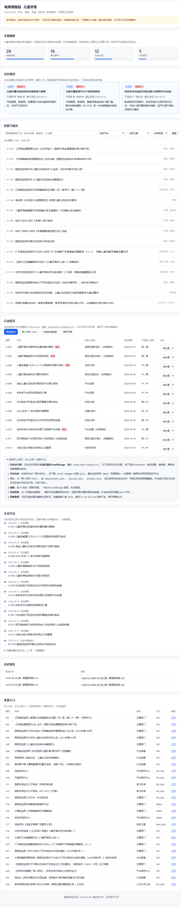

06

##  更新一次情报站

第一次生成页面后，再让 WorkBuddy 更新一次（也可以再晚几天）。已有情报继续保留，新消息加入清单，已经处理过的行动带着原来的状态往下走。

提示词 06 · 复制后发送给 WorkBuddy

请基于当前项目再执行一轮情报更新，实际访问本轮启用的来源，并记录成功、失败和未访问的范围。

如果我上传了从页面导出的行动状态文件，先同步这些改动，保留较新的状态和备注。

与历史事件对比，已有事件有变化时才更新，没有变化就记录最近检查时间。保留我已经修改的行动状态和备注。

生成本轮报告并保留历史版本，刷新页面。最后告诉我本轮检查了哪些来源、新增和更新分别有多少、有没有重复记录，以及还存在哪些读取限制。

没有新事件就如实写没有新增，不要为了丰富报告添加消息。

请打开更新后的报告和历史报告入口，展示本次变化。只完成本步骤，等我发送下一步提示词。

更新后，先看本期有哪些事情值得处理，再从历史入口回看上一期。持续跟进的事项留在行动清单里，处理结果也能一起查到。

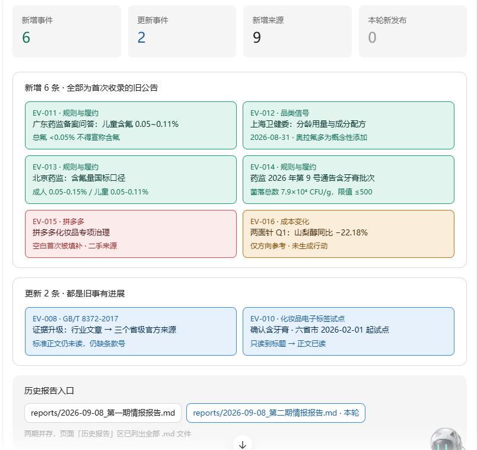

  
第二期情报报告

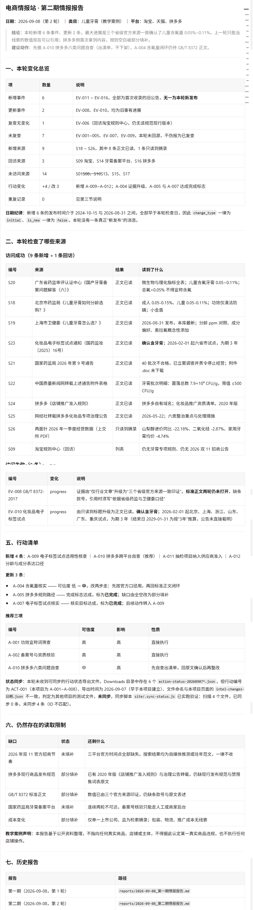

07

##  设置每周自动更新

手动更新完成，就可以把它安排成每周任务。WorkBuddy 的自动化可以按设定时间执行任务，并把结果保存在指定工作目录。  自动化说明

提示词 07 · 复制后发送给 WorkBuddy

请把本项目的更新流程保存为 period-prompt.md，写清当前项目路径、业务配置、来源、历史事件和人工行动记录的位置，使下一次运行不依赖这段聊天。

用 WorkBuddy 自动化设置每周日北京时间 09:00
更新本项目；同项目已有任务就更新它，避免重复创建。绑定当前工作目录，任务只做采集、核实、更新记录和生成报告，不重新初始化项目。

请展示真实配置结果和下一次计划时间。若当前环境无法创建自动化，保留手动运行提示词并说明实际缺少什么。

本步骤只配置这个项目的周期更新，不发送消息。展示任务名称、执行时间和工作目录后结束本轮。

配置完成后，看一下执行时间和保存位置。以后回到这个项目，就能继续查看每期报告。位置在下面截图

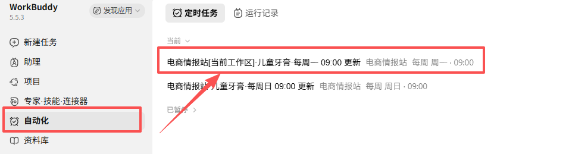

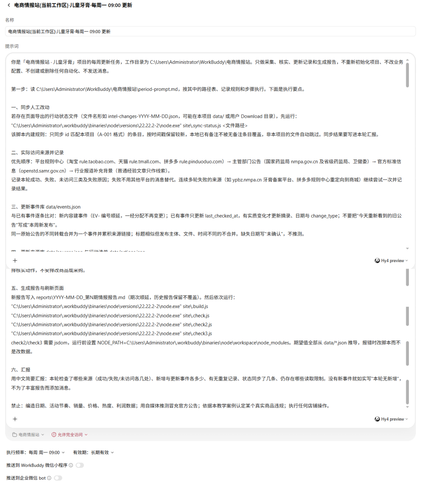

08

##  换成自己的类目，继续用

这套方法可以用来整理其他类目的信息。换类目时，先改业务配置和来源，再让 WorkBuddy 建新案例。

提示词 08 · 复制后发送给 WorkBuddy

请在一个新目录建立另一份电商情报站，保留原案例。

新类目是【  填写你的类目  】，主要平台是【  填写平台  】，我最关心【  填写三个具体问题  】。

请据此重写业务配置，重新查找和核对来源，完成首次情报整理、行动清单和页面生成。原案例里的规则、日期和建议不能直接换个商品名沿用。

先手动跑一轮，再复跑一次。新项目的周期任务要单独核对目录和范围，完成后说明哪些步骤实际执行过。

这是独立的迁移练习，完成后展示新案例结果，不继续扩展其他类目。

如果做抖音或小红书，可以把关注点换成  内容规则、达人合作和投放相关信息  ，再找对应平台的来源。这部分留给大家换类目时练习。

我建议先用一个类目做练习。挑一条情报打开原文，核对日期，看看给出的行动能不能交给同事执行。第一轮先把这些做实，再慢慢增加来源。

跟着文中的提示词逐步做，先看当前这一步的结果，再继续下一步。换类目时，从新的业务配置开始，把来源清单也一起更新。

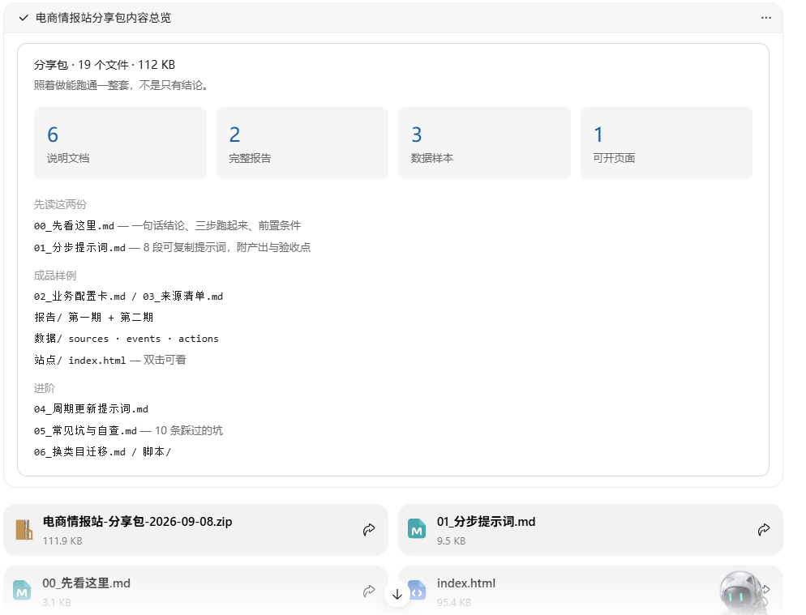

配套提示词和完整输出在  ：  评论区

咨询讨论请加  HPwangtang

---

本文最初发布于微信公众号「AI应用实战派PRO」。未经特别说明，正文与配图采用 [CC BY-NC-ND 4.0](https://creativecommons.org/licenses/by-nc-nd/4.0/deed.zh-hans) 许可。
