# 分享一个最新开源GPT-image-2.5 提示词库 电商/海报/人物全都有（每日持续更新）

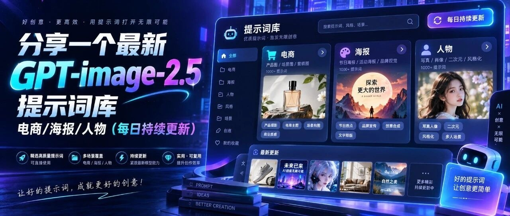

> 作者：旺哥 · 公众号：AI应用实战派PRO  
> [查看微信公众号原文](https://mp.weixin.qq.com/s/hXSDxH0ka3gcr4jYykztKw)
> [下载 HTML 图文包（含图片）](https://github.com/wangge-dev/wangge-articles/releases/download/html-archive/202609102210.zip) · [HTML 文件](../../html/2026/202609102210/article.html)

GPT-Image-2  提示词库

之前给大家分享过一个 GPT-Image-2 提示词库，里面有商品图、海报、人物、案例。

[ 分享一个 27.3K Star 开源 GPT-Image-2 提示词库 ：500+ 案例,20+ 模板以及 Skill（商品图/海报/动漫）
](https://mp.weixin.qq.com/s?__biz=MzY4NDA4MDUwMA==&mid=2247485021&idx=1&sn=9656268ab448e5a534c1311fe23cf6af&scene=21#wechat_redirect)

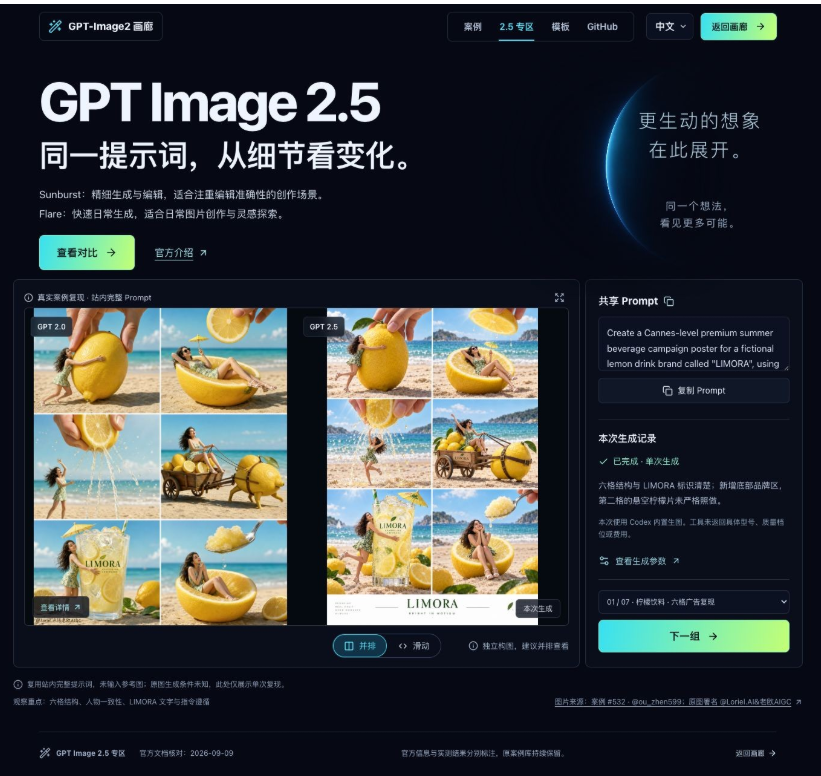

没有想到  GPT-Image-2.5这么快更新了，所以为了让大家有更好的提示词库使用  ，我让 Codex 整理了一个独立的 GPT-Image-2.5
中文提示词库，  并且加上了持续维护机制。

GitHub 提示词仓库  
https://github.com/wangge-dev/wangge-gpt-image-2-5

因为刚更新不久，目前已经整理了 103 条基础提示词、111 个完整变体，未来几天会不断完善完。

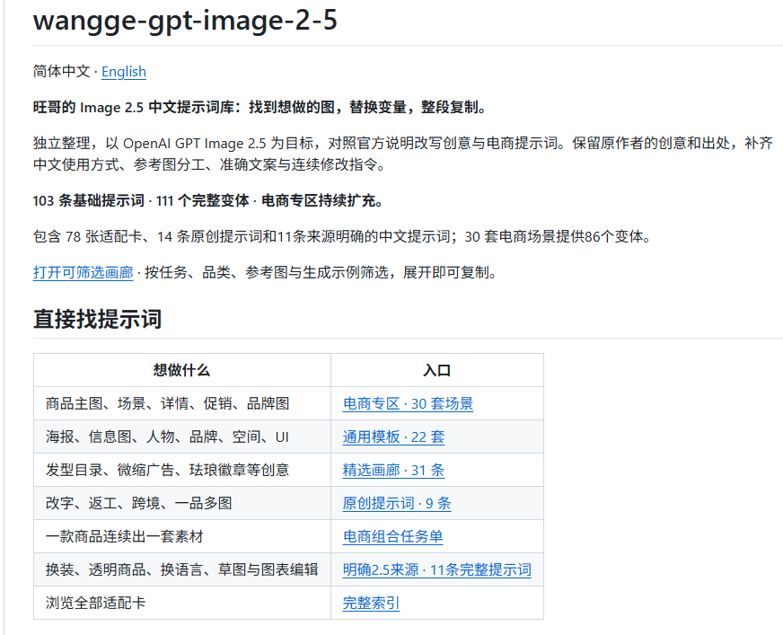

这个库  以 Image 2.5 为目标，对照官方说明整理提示词  ，保留参考案例的作者和出处，并且补充了中文使用方式。

也有可以按场景筛选的可视化页面。

可视化浏览与复制页面  
https://wangge-dev.github.io/wangge-gpt-image-2-5/browse/

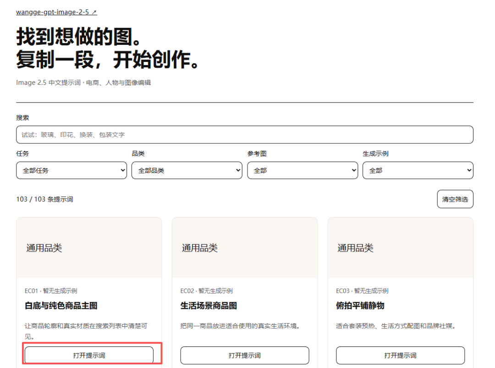
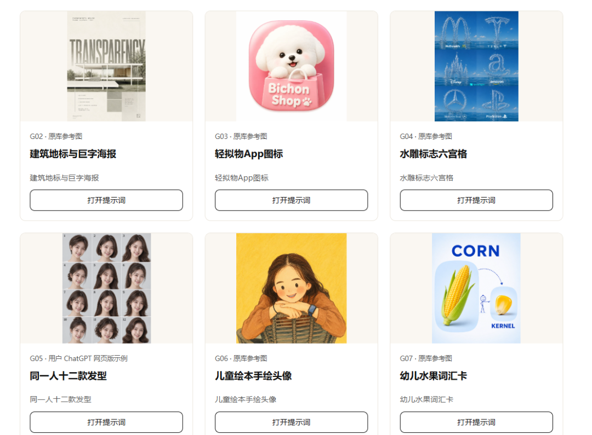
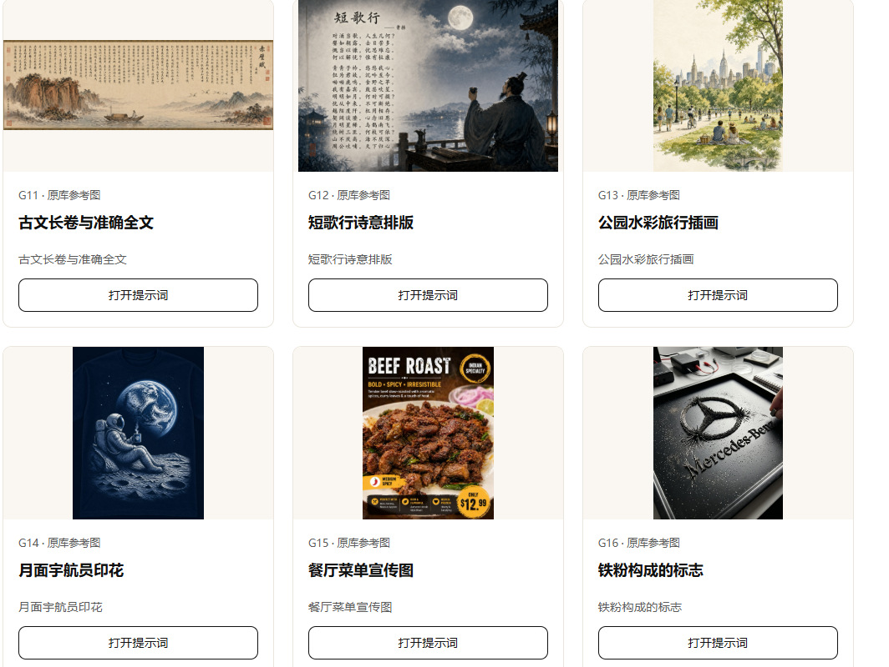
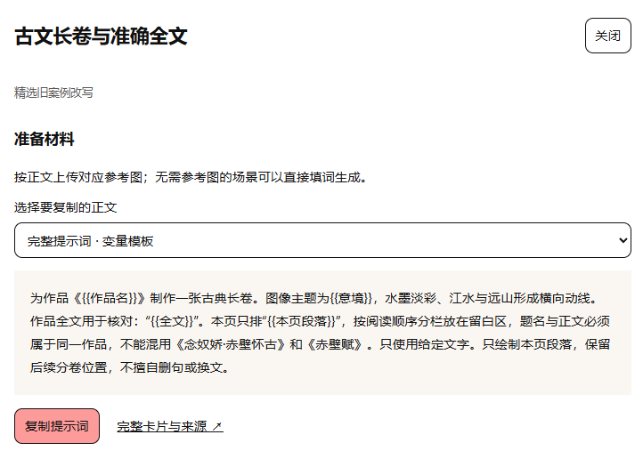
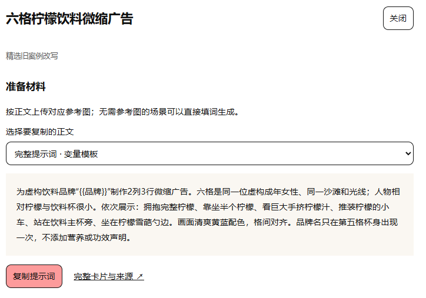

我希望它能成为一个收藏之后，还值得经常回来翻翻的仓库。

先看看里面有什么

目前包括人物发型、旅行徽章、产品摄影、海报、信息图，以及电商素材等方向。

比如十二款发型，可以围绕同一个人物尝试不同造型；香水场景图，可以描述瓶身材质、花材、光线和标签文字。

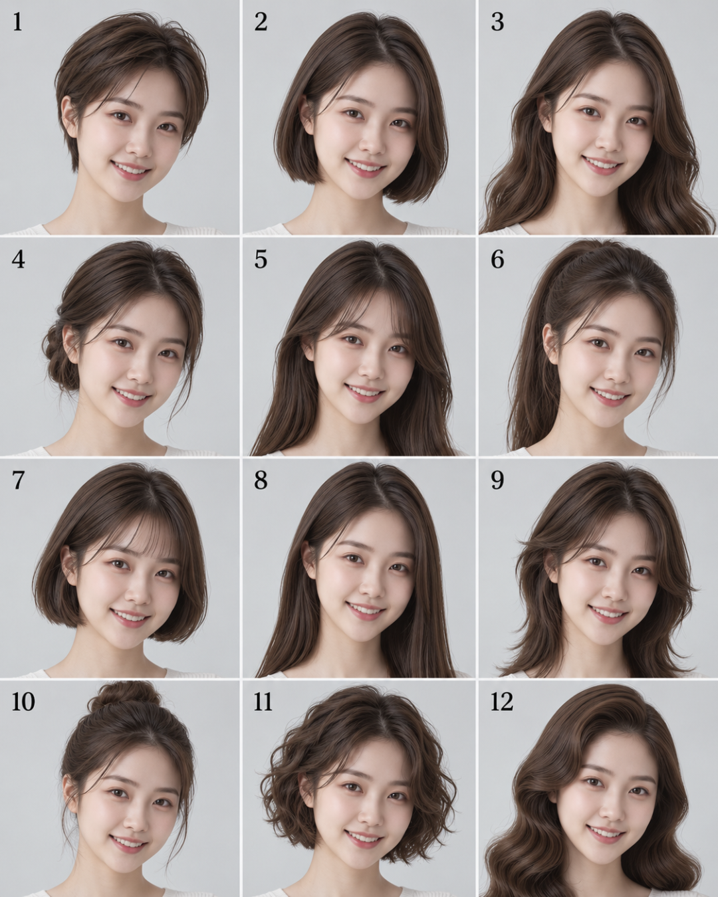

同一人物的十二款发型。

香水与花材场景。

每条内容尽量把事情写清楚：需要上传什么参考图，哪些内容可以替换，生成以后还想调整，下一轮可以怎么说。

电商部分

这次新增了一个“一品三用”专题，参考 EvoLink 分享的案例，整理了商品换场景、人物使用和多语言素材三个方向。

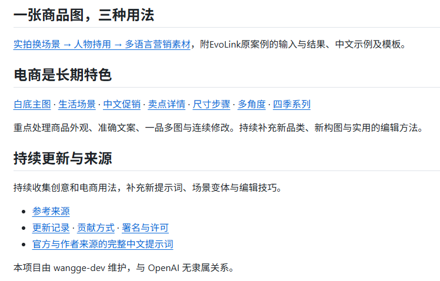

专题保留了原案例的图和出处，也补充了中文提示词、变量模板和后续修改指令。

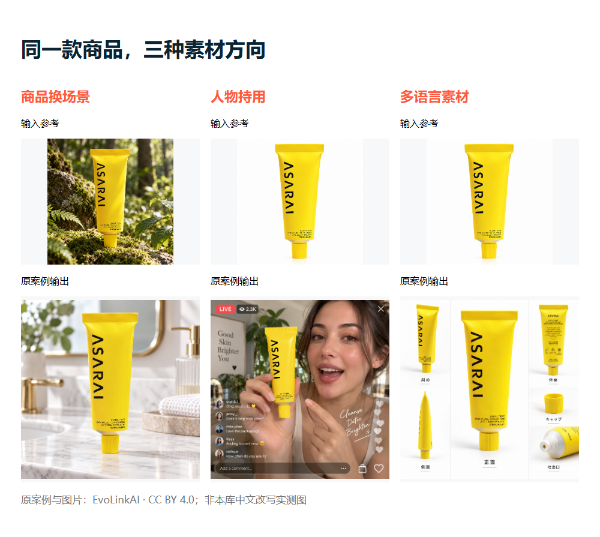

后面还会继续整理更细的商品问题。比如玻璃瓶的反光怎么描述，标签文字怎么保留，服装印花怎样跟随褶皱，包装上的局部文字如何修改。

大家可以先关注一下，点个Star,怎么点，进入仓库后，看下面截图

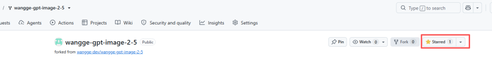

也可以fork一下，后续更新会自动同步

持续更新

模型的新玩法还在不断被发现，一次整理很难覆盖完整。

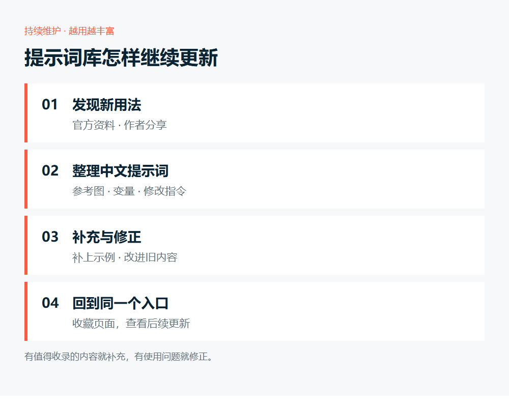

所以，这个库已经安排了定时维护：跟进官方资料、作者分享和相关项目，找到值得收录的内容，再补充来源、中文提示词和使用说明。

获取地址

建议先收藏可视化页面，使用起来更直观。有什么想做的商品图、遇到什么提示词问题，也欢迎反馈，后面继续往库里补。

可视化浏览与复制页面  
https://wangge-dev.github.io/wangge-gpt-image-2-5/browse/

GitHub 提示词仓库  
https://github.com/wangge-dev/wangge-gpt-image-2-5

EvoLink 原案例出处  
https://github.com/EvoLinkAI/gpt-image-2.5-for-e-commerce

咨询讨论请加：  HPwangtang

AI 应用实战派 PRO

觉得本文还不错，赶紧点赞收藏吧。

---

本文最初发布于微信公众号「AI应用实战派PRO」。未经特别说明，正文与配图采用 [CC BY-NC-ND 4.0](https://creativecommons.org/licenses/by-nc-nd/4.0/deed.zh-hans) 许可。
