# 亚马逊评论不用一条条翻了：只需输入一个 ASIN，自动输出商品深度评论分析报告

> 作者：旺哥 · 公众号：AI应用实战派PRO  
> [查看微信公众号原文](https://mp.weixin.qq.com/s/KvsgVsnoLFxBQtoU5_uFyw)
> [下载 HTML 图文包（含图片）](https://github.com/wangge-dev/wangge-articles/releases/download/html-archive/202609110937.zip) · [HTML 文件](../../html/2026/202609110937/article.html)

AMAZON REVIEW OPS · FIELD TEST

亚马逊  AI 评论分析功能

输入 ASIN，自动输出商品深度评论分析报告

2026.09.10 · FIELD TEST

4 款  产品实测  1,135  评论样本（条）  1 个  ASIN 就能跑  3 种  导出格式

OPENING

开始

之前我用 WorkBuddy 加  卖家精灵 MCP  跑完了关键词全链路，解决的是做什么品、怎么被搜到。今天分享怎么做亚马逊评论深度分析。

[ 我用 WorkBuddy 一句话跑完了 亚马逊 关键词全链路（10 场景实测：选品→竞品→词库→Listing 方案）
](https://mp.weixin.qq.com/s?__biz=MzY4NDA4MDUwMA==&mid=2247484876&idx=1&sn=7bb01325a94f27a5001a99cd24f44a8f&scene=21#wechat_redirect)

以前看  亚马逊  评论就是翻评论页、按星级筛、挑差评看几条，凭印象总结。一款 4.2 星、849 条评分的产品，能看完的也就前两三页。

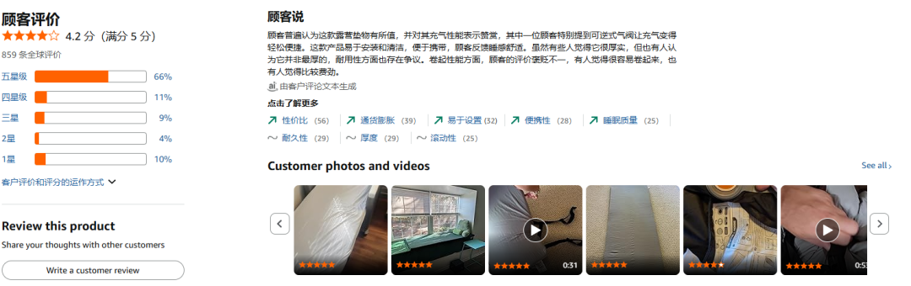

卖家精灵  最近  上线的这个「AI 评论分析」，只需要输入一个 ASIN 就交回一份深度分析报告。简单且省事

另外亚马逊的站点都有：

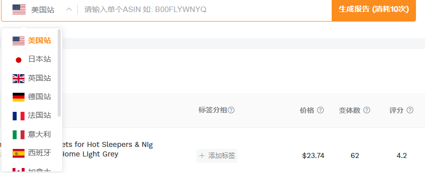

今天分析的是一款  露营床垫，  下面我按它分析出来的顺序，一步一步看它挖出了什么。

01 · 功能是什么

在哪里使用

地址：  https://www.sellersprite.com/，  找到产品-评论分析

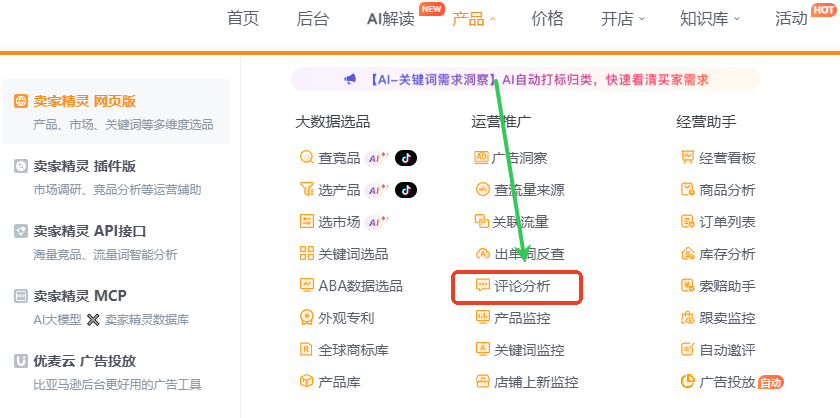

入口有三个，  商品列表、评论分析工具页、导航的「AI 解读」  菜单都能进。选好站点填上 ASIN 等它跑完，中间不用你写提示词，也不用导数据再整理。

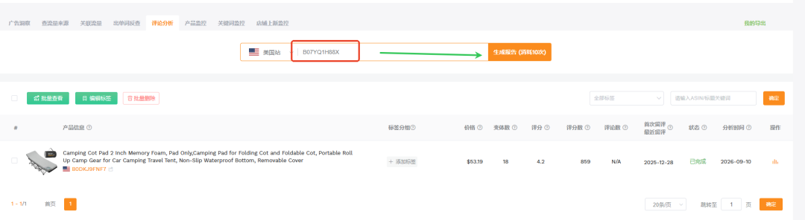

稍等几分钟一份深度分析报告就出来了，我们点击最右边的：  查看评论分析报告

点击跳转到新页面后，还可以选择md 或者PDF 格式导出。

下面我们一屏一屏分析。

02 · 第一屏给什么

摘要和口径放在同一屏

我主跑的是记忆棉露营床垫（2 英寸），4.2 星、849 条评分。

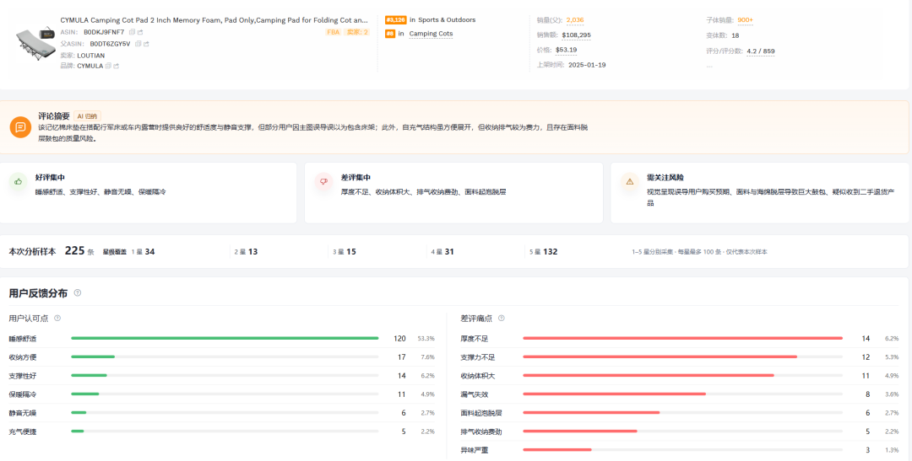

03 · 好评差评，和哪个主题在拖分

差距摆在左右两栏

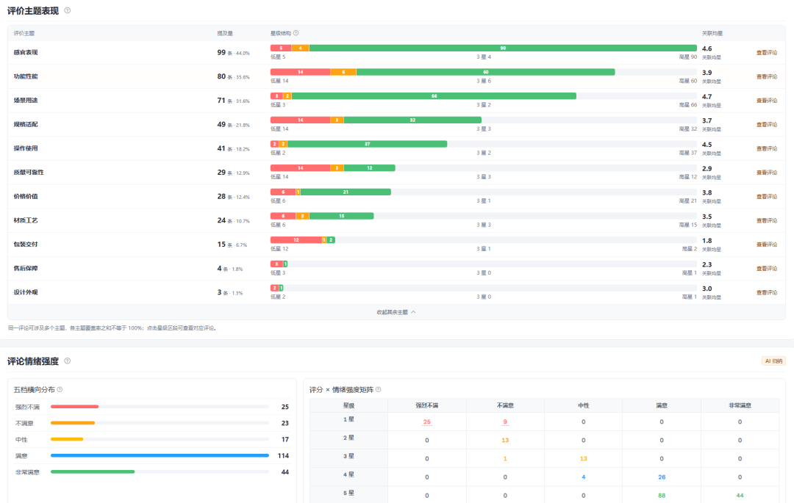

好评最大的一项和差评里排前面的那几项，  说的是同一件事的两面。同一张垫子，有人觉得厚度刚好，有人躺上去能摸到行军床的横梁。
右边还可以查看具体评论，好评！

「评价主题表现」把评论按主题归类，给出提及量和关联均星，这是判断该动哪里最直接的一屏。

场景用途 71 条（31.6%）· 均星  4.7  
感官表现 99 条（44.0%）· 均星  4.6  
功能性能 80 条（35.6%）· 均星 3.9  
质量可靠性 29 条（12.9%）· 均星  2.9  
售后保障 4 条（1.8%）· 均星 2.3  
包装交付 15 条（6.7%）· 均星  1.8

四款产品规律一致，主功能主题都在 3.5 以上，拖分的集中在流程环节，露营床垫的安全健康 1.4，收纳袋的售后保障 1.0。

1 星的 34 条里有 25 条被标成强烈不满，这批最容易写长评，也容易被潜在买家刷到。

04 · 从"骂什么"推到"为什么"

差评根因是这份报告最值钱的一节

「常见差评问题与可能原因」给每条差评标出根因标签、推断成因和样本量，再附上原文和评论 ID。

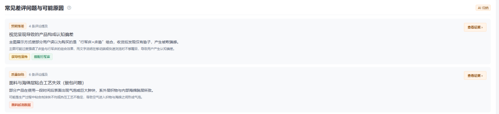
根因一 · 视觉呈现导致的产品构成认知偏差  
标签是「预期落差」，样本 4 条，报告注明它贡献了约 10% 的原始评论提及量。成因是主图强调了床垫和行军床的组合效果，文字说明在手机上不够醒目。  
  
根因二 · 面料与海绵层粘合工艺失效  
标签是「质量缺陷」，样本 6 条。用一段时间后表面出现气泡或肿块，报告判断可能是粘合剂涂抹不均或热压工艺不稳定，属于不可修复的物理损坏。  

05 · 谁在用，用到第几步出事

场景和阶段合起来是一张用户地图

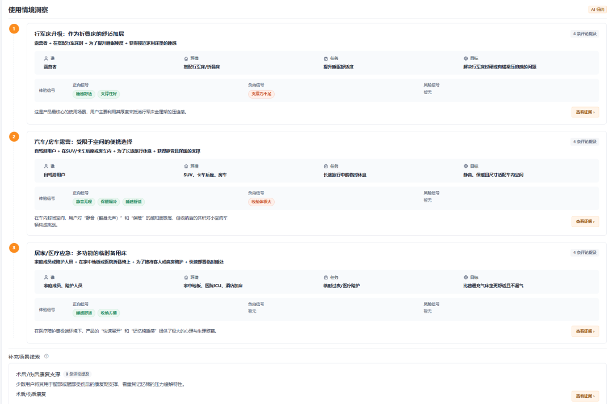

评价分歧点

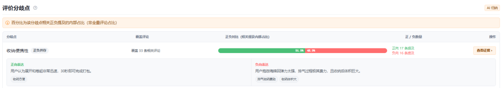

用户旅程反馈、

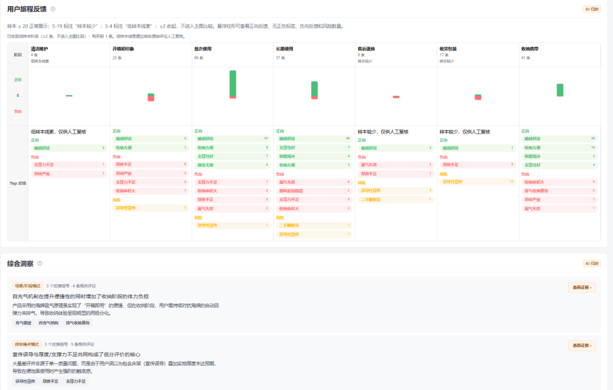

少数但值得关注的反馈

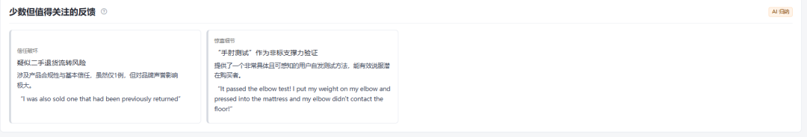

06 · 结论凭什么信

每条结论都能指回原文

每个结论卡右上角有「查看证据」，点开就是支撑这条结论的原评论，评价主题那一屏也有同样的入口。还能下载评论

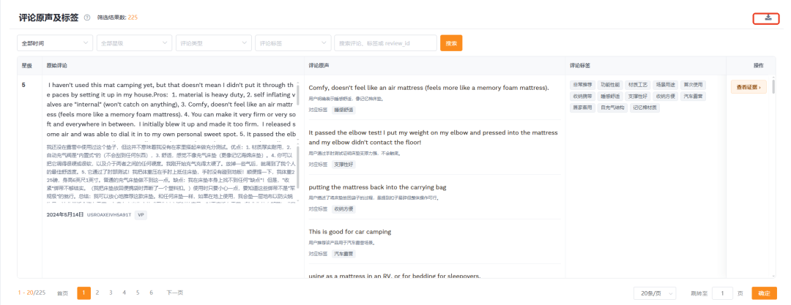

下载下来的评论信息也很重要

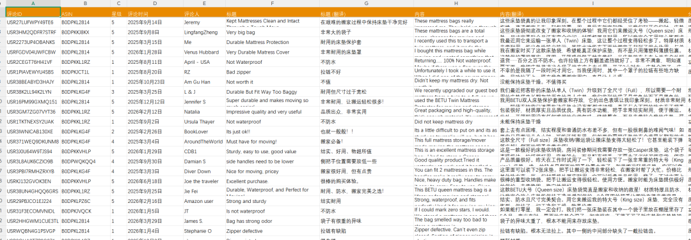

07 · 五个可以直接抄的动作

跑完四款产品沉淀下来的

① 先修均星最低的那个主题  。  拖分的是包装、售后、材质工艺这几个环节，同样的预算花上去，评分变化更快。

② 检查收货那一刻的预期落差。  不用改产品，动主图和详情页首屏就能改。

③ 按阶段看问题。  清洁维护、长期使用那几个阶段的差评，前 30 天里不出现，关键词写进详情页的保养说明。

④ 把"双向解读"的属性说明白。  薄和柔软是同一块面料，要么换个说法讲清，要么在变体上做区分。

⑤ 去「少数但值得关注」那一栏捞素材。  用户的"手肘测试"可以直接做成详情页的支撑力演示。

09 · 总结

最后

以前是先有结论再翻评论找证据，现在先看报告给出的结构，再看自己的判断。

建议你现在做一件事。  挑一个自己在做的产品用卖家精灵AI评论分析跑一次，

完整分析报告，还是很详细很有深度，而且只需要几分钟：

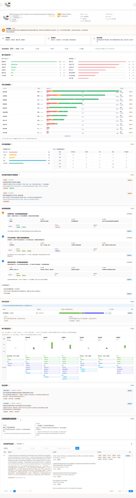

功能地址：  https://www.sellersprite.com/cn

订阅卖家精灵会员可以用我下面的折扣码，有优惠哦：

咨询讨论请加：  HPwangtang

---

本文最初发布于微信公众号「AI应用实战派PRO」。未经特别说明，正文与配图采用 [CC BY-NC-ND 4.0](https://creativecommons.org/licenses/by-nc-nd/4.0/deed.zh-hans) 许可。
