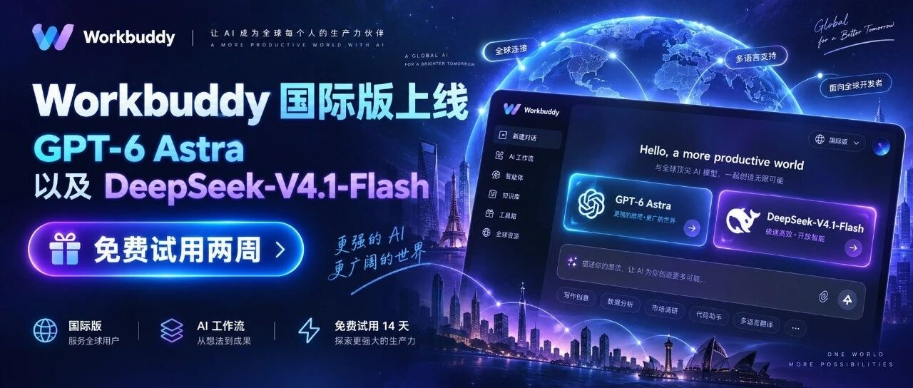

# 什么？Workbuddy也能用上GPT-6 Astra了（附使用教程）

> 作者：旺哥 · 公众号：AI应用实战派PRO  
> [查看微信公众号原文](https://mp.weixin.qq.com/s/H3I0nXYf85ekJfVEIsu5ig)

GPT-6 Astra上线也有一个星期了，体验夯爆了。

但是由于各种原因好多人还体验不了，

这不 Workbuddy 国际版来了! GPT-6 Astra和  DeepSeek-V4.1-Flash全都有

一、  WorkBuddy  国际版安装和使用

其实很简单，先打开 WorkBuddy 国际版官网：

https://www.workbuddy.ai/

大家也可以用我这个邀请码：  https://workbuddy.ai/invite?code=KF7HUSRP

进入官网以后，页面可以看到下载入口。网站会根据你的系统提供对应版本。

立即下载 ，双击以后按提示安装就行。安装位置可以根据自己的磁盘空间调整。

二、登录后，在哪里切换模型？

安装完成以后打开客户端，大家按照自己的方式选择登录注册就行。

注册完就有350积分，邀请别人还能获得100积分。

进入主界面后，和国内workbuddy界面基本上一样，不过第一次进入是英文页面

我们找到左下角的  settings-general  ，改成中文就行

回到对话框，点击auto，  在列表里找到 DeepSeek-V4.1-Flash 或 GPT-6 Astra  。

但是大家也可以看到GPT-6 Astra的消耗倍率6.67 x! 恐怖如斯

而  DeepSeek-V4.1-Flash是0.00x.

且  DeepSeek-V4.1-Flash免费使用两周

三、体验  GPT-6 Astra

看一下workbuddy+  GPT-6 Astra 有哪些玩法，官方技能还是不少的。

问下workbuddy自己

做一个数据分析

分析的结果不错，但是消耗了 98.69 积分！

我的建议是，先别急着拿它做一个特别大的项目。可以先挑一个自己熟悉的小任务，

先用免费模型跑一遍，看看它能不能理解你的要求；如果结果不够，再切到 GPT-6 Astra 。这样既能看出模型差异，也不会一上来就消耗太多积分。

咨询讨论请加：  HPwangtang

AI 应用实战派 PRO

觉得本文还不错，赶紧点赞收藏吧。

---

本文最初发布于微信公众号「AI应用实战派PRO」。未经特别说明，正文与配图采用 [CC BY-NC-ND 4.0](https://creativecommons.org/licenses/by-nc-nd/4.0/deed.zh-hans) 许可。
