# 4000字教你从 0 开始用 WorkBuddy 搭建 自己的专家团（附完整SOP）

> 作者：旺哥 · 公众号：AI应用实战派PRO  
> [查看微信公众号原文](https://mp.weixin.qq.com/s/XHCCvT6VYqBJOjOvcPrlIg)
> [下载 HTML 图文包（含图片）](https://github.com/wangge-dev/wangge-articles/releases/download/html-archive/202609151119.zip) · [HTML 文件](../../html/2026/202609151119/article.html)

EXPERT TEAM · WORKBUDDY SOP

从 0 开始搭建

自己的  专家团

不用写代码。把需求说清楚，它自己拆解、派人、交成品。

2026.09.15 · SOP NOTES

8 个  团队角色  19 个  已挂技能  7 步  搭建流程

OPENING

开始

Workbuddy 有很多专家团：

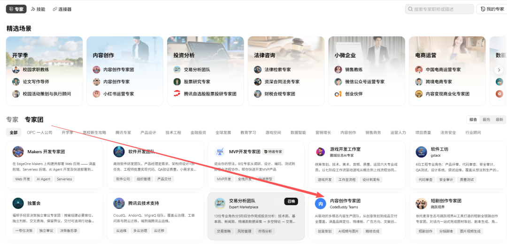

专家团太多也是一种，有时候你不知道哪个适合自己。名字看着对，点进去看示例问句，又觉得跟手头的活对不上。挑几个试，跑出来总差一点意思。

那既然挑不到合适的，那就自己搭一个。

前面几篇文章里，我分享  AI+电商  运营顾问专家团，

[ 用国产之光 ：Workbuddy 搭建了一个AI+电商运营顾问团
](https://mp.weixin.qq.com/s?__biz=MzY4NDA4MDUwMA==&mid=2247484611&idx=1&sn=7fc748119ec0a02dfef2c5c1b3a38a79&scene=21#wechat_redirect)

还有我自己在用的小红书内容专家团、智能客服专家团。

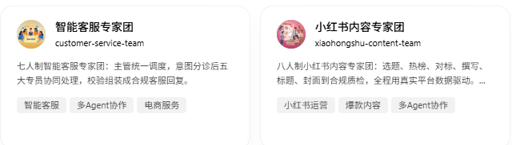

我之前展示结果，没讲从 0 开始的过程。这篇补上。下面开始！

01

为什么需要专家团

我们平时跟 AI 对话是这样的：你让它做一步，看结果，再让它做下一步。一件事如果分成五步，你就得来回带五次。

专家团解决的就是这个。你把一件事交给它，它自己拆成几步、派给不同角色、最后汇总成成品。你只说一句话，中间不用管。

具体强在哪，三条。

第一，能同时调用多个技能。  团里每个角色都可以挂技能。我那个小红书团，8 个角色合计挂了 19
个技能，搜索、爬取、榜单、标题打分、封面设计各是一个。普通对话一次基本只能把一件事做好，专家团是整条链上的技能都到位。

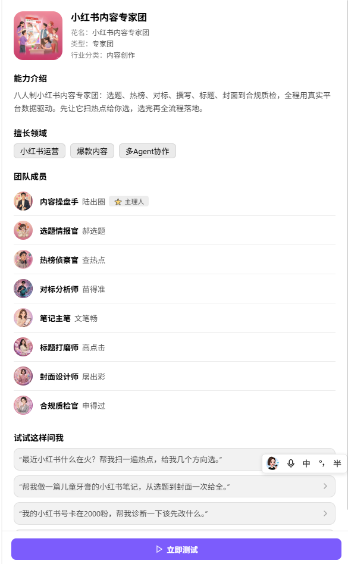

第二，有分工，也有把关。  写内容的角色不负责审，审的角色不负责写。这一点很关键。让同一个角色既生产又自查，它永远给自己打高分。

第三，有固定流程和统一口径  。  每次跑都按同一套流程走，交付格式也固定。普通对话每次都要重新交代一遍背景，专家团不用。

那它跟智能体是什么关系。

我们平时说的智能体，指的是一个能自己规划、自己调用工具的 AI。WorkBuddy 里的专家其实分两种：
单专家就是一个智能体，多角色协作的叫专家团。所以专家团可以理解成一组智能体加一个指挥。

单智能体的上限是一个角色加几个技能。专家团把这个上限打开了：多个角色接力、互相检查。一件事只要需要分工，专家团就更合适。

02

前置条件

门槛比想象中低。

装好 WorkBuddy。  Windows 和 Mac 都有客户端，这是唯一的硬要求。

有账号积分。  搭建这个动作不另外收费，消耗的是你账号里的积分。

不需要额外的 API Key。  这一点容易误会。有些团里会用到平台数据的技能，那些技能需要配 Key，比如我那个小红书团要配数据平台的
Key。或者生图用的api

不需要会写代码。  整个过程是跟 WorkBuddy 对话完成的。

04

需要的资料

门槛说清楚了，还有一件事：搭之前，手上得先有素材。缺了它，团建出来是个空壳，角色都在，但干不了活。

第一样，资料。

操作手册、流程文档、写过的提示词、以前的成稿、在聊天里交代过的要求，都算。不用整理成正式文档，零散的反而更好用，因为它就是你平时在用的东西。

有资料的好处很直接：角色分工和流程照着你的实际做法提取，不会跑偏。手上什么都没有，它只能按通用的想象编一套出来，就会出现幻觉。

第二样，技能/skill。

角色是靠技能干活的。一个角色只做判断、改写、汇总，靠对话就能跑。但只要它要动手，取数据、抓页面、爬榜单、生成表格、出图，就得挂上对应的技能，

有一点重点强调一下，如果你手中有很多skill，但是很零散，你这个时候可以把这些skill串联起来，让workbuddy来搭建专家团

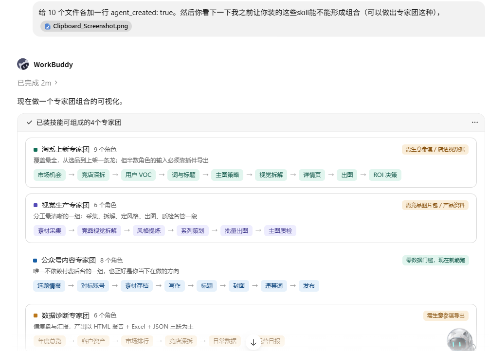

技能来源有三个：本机已经装好的、专家中心「技能」里能装的、自己写的。动手前挨个角色过一遍，谁没有工具可用，先标出来。别指望它靠聊天完成一个需要抓数据的活。

两样都没有怎么办，这很常见，不用卡在这。  资料那块先写流水账，后面专门讲没有资料怎么起步。，让团先跑起来，缺什么补什么。

05

专家团和技能有什么区别

打开左侧的「专家」，顶部有三个并列的标签：专家、技能、连接器。

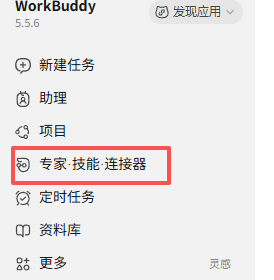
|  技能  |  专家团  
---|---|---  
是什么  |  一份能力说明书，告诉模型这类任务该怎么做  |  一组角色，加上谁指挥谁的编排  
谁触发  |  你说的话匹配上它就加载，你感知不到  |  你主动进去选中它，跟它对话  
有没有界面  |  没有，是隐形的  |  有头像、有卡片、有使用次数  
一次给你什么  |  帮你把某一步做对  |  从需求到成品，跑完一整条链  
能不能带技能  |  技能是独立的一份  |  可以，每个角色都能挂  
  
最后一行是关键。这两样东西可以叠在一起。

官方市场里有一个高考顾问，它是单专家，但内部带了 4 个技能。我那个小红书团也一样，8 个角色挂了 19 个技能。专家是壳，技能是能力。

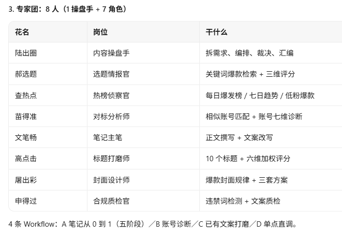

所以这样判断：

·  一件事不需要分工，用技能就够了。

·  需要几个角色接力，或者需要有人统一口径，用专家团。

·  拿不准就先做单专家，等一个人干不过来，再拆成团。

06

怎么找，怎么调用

找团有三个路径：按分类找、按精选场景找、右上角直接搜。

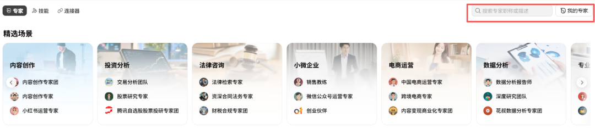

卡片上看四个信息：描述（一句话说干什么）、标签（三个词快速判断领域）、使用次数（用过的人多不多，有个开发团显示用了 10 万次以上）、点开看详情。

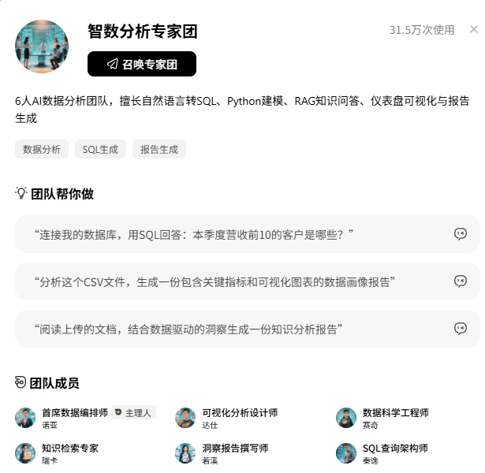

详情页最重要，里面有两块：一块是“团队帮你做”，列三条可以直接点的示例问句；一块是“使用案例”。看完这两块就知道它能不能干你的活。示例问句写得越具体，说明这个团的边界划得越清楚。

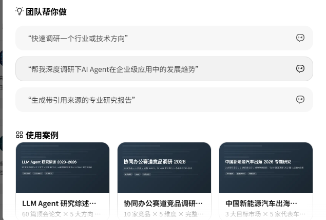

调用在两个地方：一是进详情点「召唤专家团」；二是左侧边栏，你用过的团和搭好的团都留在那里，下次直接点。

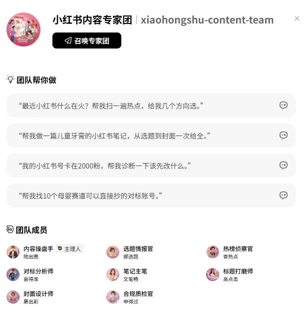

进去之后正常对话就行，不用记角色名字，把需求说清楚，主理人自己判断该派谁。

有个细节值得说：专家团不会一上来就给答案。主理人要先拆解分派，所以第一轮回复通常是“我打算这么干”或者“我需要先确认两件事”。这是正常的，不是它卡住了。

07

怎么搭建，完整流程

7.1 先判断要单专家还是团

标准只有一条：这件事需要几个角色分工。

把你现在人工做这件事的步骤写下来。产出物是同一种东西，合并成单专家。产出物是好几类不同的东西，比如一份数据、一份文案、一张图，那就是专家团。

或者直接给workbuddy说我想搭建一个XX专家团：

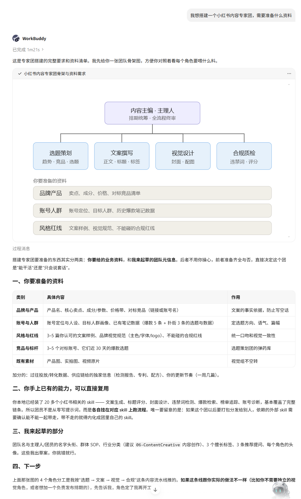

7.2 七个步骤

前三步是想：定角色、定编排、写主理人的规矩。后四步是做：生成文件、生成头像、校验、注册打包。

第一步，定角色。  按“用户卡在哪几个动作”切，不按你手上有多少工具切。

一条硬规矩：每个角色必须对应一个唯一的产出物。两个角色交出同一种东西，就合并。我搭第一版的时候按工具数量切，结果有两个角色产出高度重合，后来并了。

角色数不要贪多。8 个已经不少，官方市场里有 21 个角色的大团，那是特殊场景。你开始搭，3 到 5 个就够跑起来。

第二步，定编排。  只设一个主理人，职责是拆需求、排顺序、汇总结果。

最容易犯的错是设了多个指挥。两个角色都能指挥别人，派活就会打架。

第三步，写主理人的规矩。  主理人文件里要有六块：开工前先读哪些文件、团队有哪些成员、标准流程有哪几条、必须做什么和严禁做什么、数据从哪来、交付物长什么样。

其中“严禁做什么”最重要。我第一版漏了这一条，它跑起来直接替我选了一个方向就往下写。后来写死一条：先给候选和依据，停下来等用户选，不许替用户拍板。

第四步，让它生成文件  。
前三步想清楚之后，把角色分工和编排说清楚，它会先生成目录骨架，再填内容。生成出来的主要是三类：一份团的身份卡、每个角色一份设定文件、每个角色一张头像。

第五步，生成头像。  每个角色一张，整个团一张。自动生成，同一套风格。生成完可以手动换，换成 512×512 的 PNG。

第六步，校验。  检查有没有字段漏填、格式写错。校验不过不会让你注册。

第七步，注册和打包。  注册完它就出现在专家中心里。想分享给别人，打个包得到压缩文件，别人拿到就能装。

7.3 四条规矩

名字定下来不能改。  团名、角色文件名都是身份标识，建成后改会导致团用不了，只能重建。第一步定名字多想两分钟。

角色的三件事要齐。  名字（一个像人名的花名）、职称、能力描述。能力描述有字数要求，过长过短都要返工。

每个角色文件末尾都要写“结论交给主理人，不要直接回复用户”。  漏了角色会直接跟用户说话，层级就散了。

花名要起得像人名。  官方市场的团，花名都是“姓氏谐音加岗位动作”，读起来像正常人名，又能猜出他干嘛。全叫“XX专家”“XX助手”，派活容易搞混。

7.4 搭完怎么验

跑一次真实任务。判断标准：说一句话，能不能自己拆解、自己派人、最后交出成品。

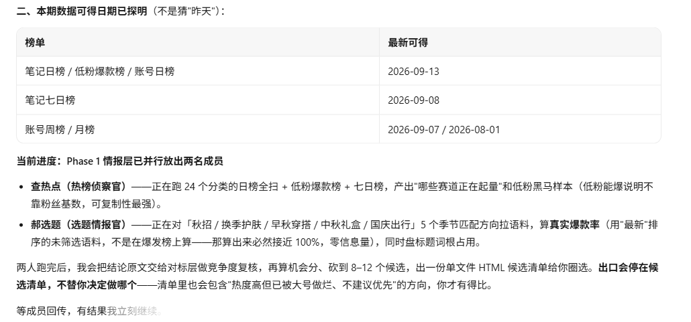

跑到一半停下来问你“你希望我怎么做”，说明主理人文件缺流程，回头补第三步。交付格式每次都不一样，说明格式没写死。

08

资料不够怎么办

大多数人卡在这里：想做团，但手上没有现成流程文档、没有角色定义。分三种情况。

有现成资料。
比如一份操作手册、一套提示词、一份流程文档。直接把资料丢给它转化，它会自动提取角色、能力、流程、输出规范，落到对应文件里。你要补的是展示信息：团叫什么、每个角色叫什么花名、归到哪个分类。

有零散资料。
没有完整文档，但你心里知道大概怎么做。按四步走：先把你现在人工怎么做写成流水账，不用管文笔；每一步标出输入和输出；输出物一样的步骤合并成一个角色；剩下说不清的先空着。走完至少能得到一个能跑起来的骨架。

什么都没有。  只有一个想法，不确定该有几个角色。直接给workbuddy说想法就行！

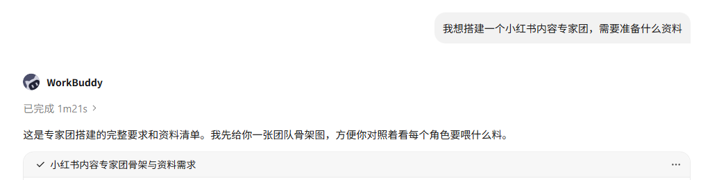

这种情况用“先做一个角色”的办法。别一上来就设计 8 个。先做 1 个，让它跑一次真实任务，看它在哪里卡住。卡住的地方，就是下一个角色该出现的位置。

我那个小红书团就是这么长出来的。第一版跑完发现它扫完热点不知道该给用户什么，于是补了一个候选清单环节；又发现它写正文会引用来路不明的数据，于是补了一条数据来源的规矩。改到第二版才稳定。

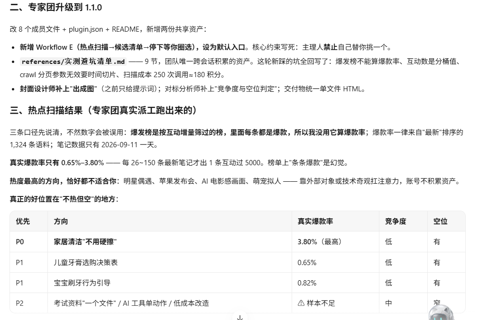

共通的一句：资料不够的时候，别靠想象补，靠跑补。跑一次真实的，缺口自己会冒出来。

09

最后说一下思路

搭建专家团的难点，全部集中在开始之前那三步：要几个角色、谁指挥谁、每个角色交出什么。

这三步想明白，后面四步基本是自动的。所以别跳过这三步，哪怕花二十分钟在纸上写一遍角色清单，也比直接开始生成文件快。

如果还是有点不明白，把本篇文章丢给 Workbuddy 就行了!

咨询讨论请加：  HPwangtang

AI 应用实战派 PRO

觉得本文还不错，赶紧点赞收藏吧。

---

本文最初发布于微信公众号「AI应用实战派PRO」。未经特别说明，正文与配图采用 [CC BY-NC-ND 4.0](https://creativecommons.org/licenses/by-nc-nd/4.0/deed.zh-hans) 许可。
