# 正式介绍一下我们的AI+ 电商VIP实战交流群

> 作者：旺哥 · 公众号：AI应用实战派PRO  
> [查看微信公众号原文](https://mp.weixin.qq.com/s/T_rTzEwHl_VYNwPUqXmzrw)
> [下载 HTML 图文包（含图片）](https://github.com/wangge-dev/wangge-articles/releases/download/html-archive/202609152231.zip) · [HTML 文件](../../html/2026/202609152231/article.html)

AI + 电商实战交流群

今天来给大家正式介绍一下我们这个 AI+电商实战交流群

这是一个付费交流群，目前  ** 99 元一年  ** 。随着群里的资料越来越多，价格也会跟着往上涨。

到今天为止，群里已经有  ** 60 多位成员  ** 了。

其中有些朋友是单纯信任我这个人，没多问就加了进来；也有一些是朋友推荐进来的。朋友推荐加入的，我们给相应折扣；如果你是原先
AI+电商实战交流群的成员，转过来加入这个群，也有优惠

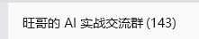

谢谢每一位愿意相信我们的人。

这个群是干嘛的

一句话概括：  ** 给电商人准备的 AI + 实战交流群  ** 。

也可以看一下这个介绍：

https://t2vq6a99kv.feishuapp.com/app/app_17fgnu76fy9/

我们把电商 Skill、开源工具、实战教程和方法论，整理成拿来就能用的东西。你不用自己满世界找工具、试提示词，进群直接拿走用。

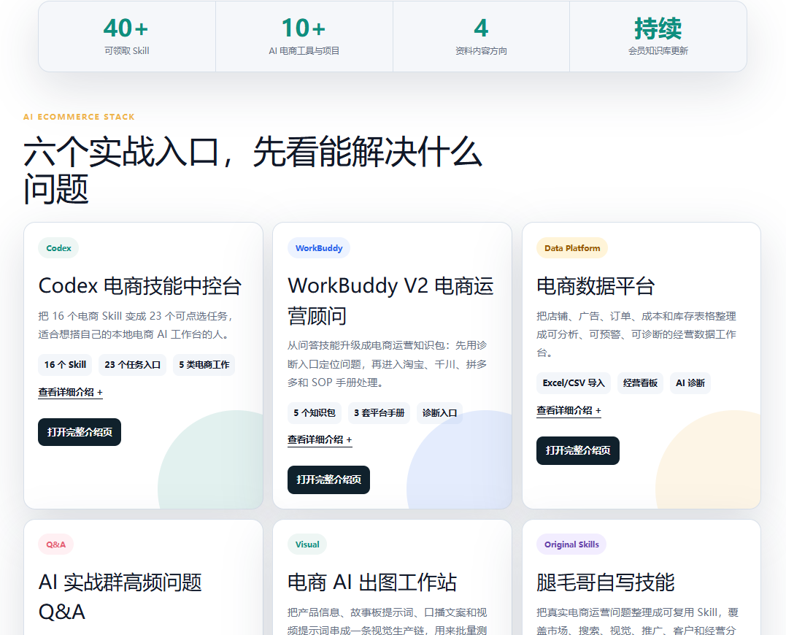

群里有这些工具

CODEX

Codex 电商技能中控台

16 个电商 Skill，整理成 23
个可执行任务入口。选品、竞品、主图、标题、详情页、推广、复盘、素材生成都能覆盖。每个任务都会写清楚要准备什么资料、执行完能拿到什么结果。

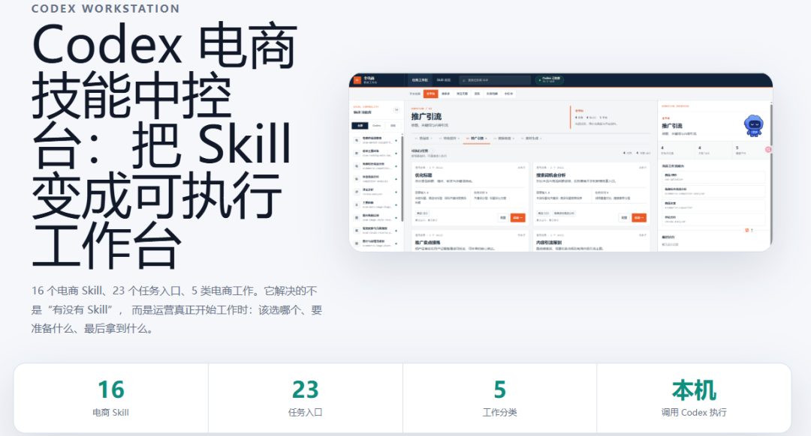

WORKBUDDY

WorkBuddy V2 电商运营顾问

5 个知识包，加 3 套平台手册，覆盖淘宝、千川、拼多多。遇到运营问题，先走诊断入口判断是哪个环节断了，再进对应手册处理。

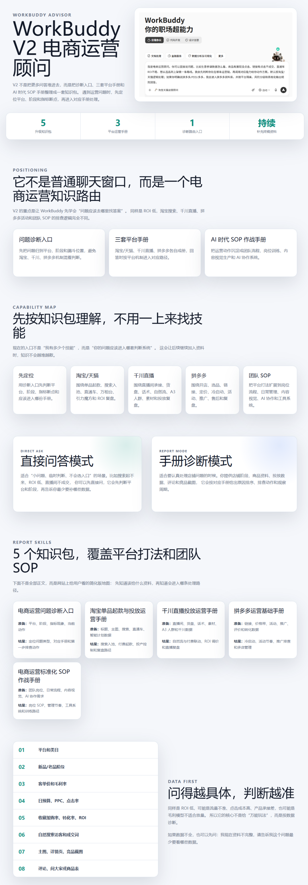

数据

电商数据平台

把店铺、广告、订单、成本和库存表格，整理成可分析、可预警的经营数据工作台。支持 Excel、CSV 和平台导出表。

视觉

电商 AI 出图工作站

从一张产品信息表出发，依次生成故事板提示词、口播文案、视频提示词，用来批量测试主图和短视频方向。

自研

自研电商技能

16 项我们自己写的电商技能，覆盖市场、搜索、视觉、推广、客户和经营分析，按场景分类，持续维护。

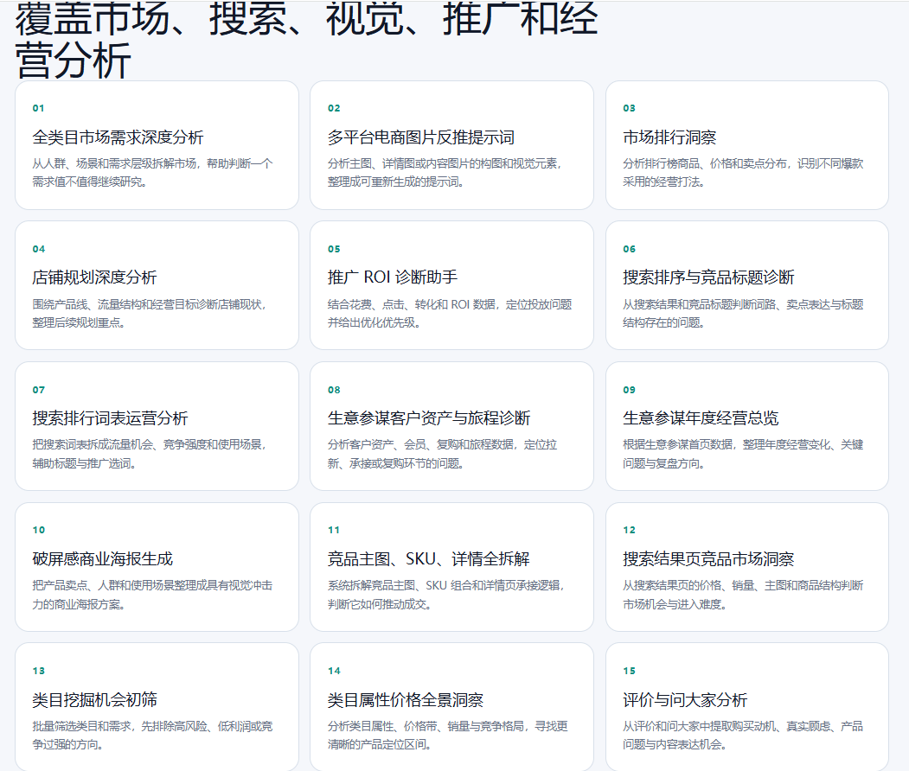

答疑

高频问题 Q&A

安装、费用、电商图、知识库、RPA、怎么提问，群里反复出现的问题都整理成了可搜索的答案库。新成员可以先自己查，再带着具体问题进来聊。

40+

可领取 Skill

|

23

任务入口

|

10+

AI 电商工具

|

持续

飞书资料更新  
  
---|---|---|---  
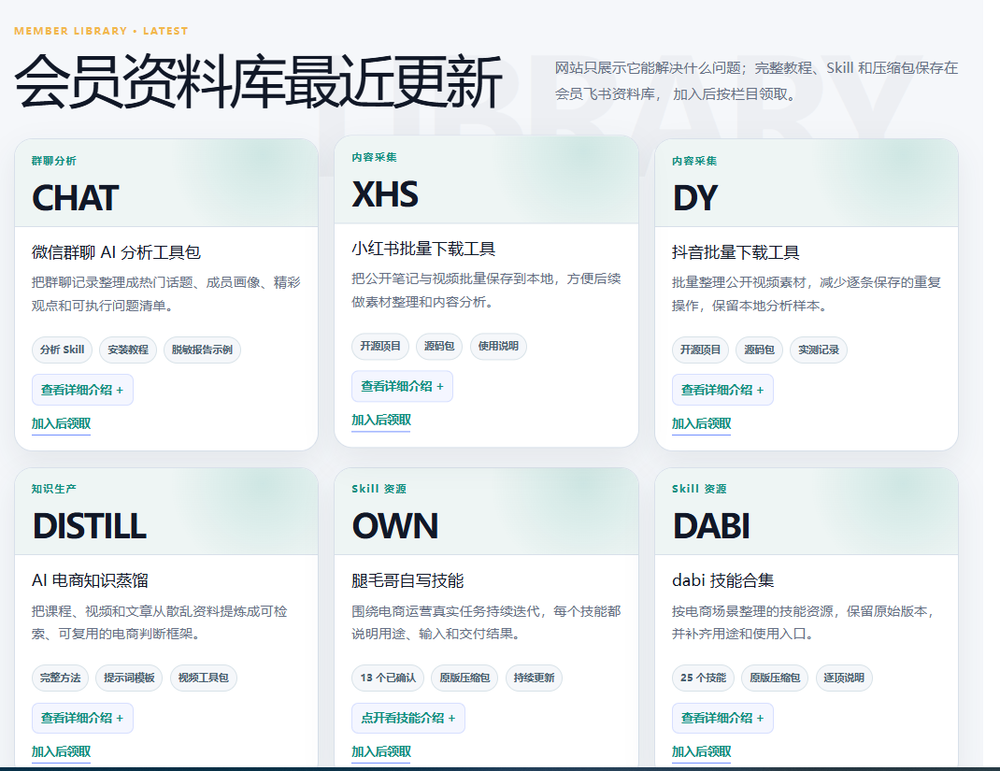

有哪些教程和资料

目前分了四个方向：

AI 思维入门

从基础认知、工具和提示词讲起，零基础也能跟上。

一百多份运营资料

开店、选品、商品发布、流量推广、活动大促、规则风控、表格模板，系统归档。

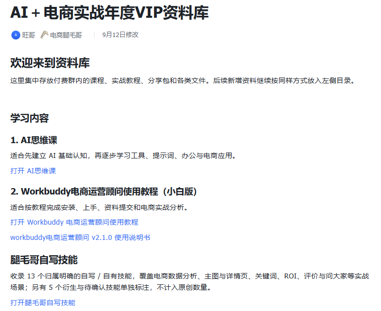

规划AI + 数据分析课程

把数据清洗、指标判断、异常诊断、分析报告串成一条能照着学的路径。

我们付费购买的AI+电商的资料

也是给群里人免费使用的

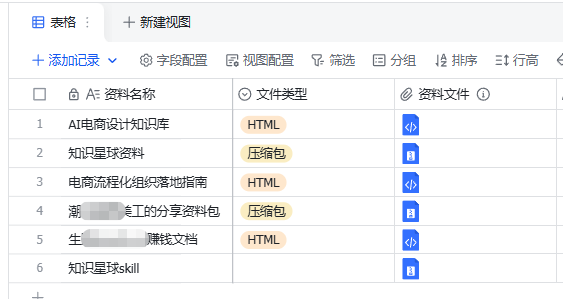

另外还有《电商运营实战手册：从执行者到操盘手》。手册负责建立判断框架，AI 工具负责提高执行效率，两样配合着用。

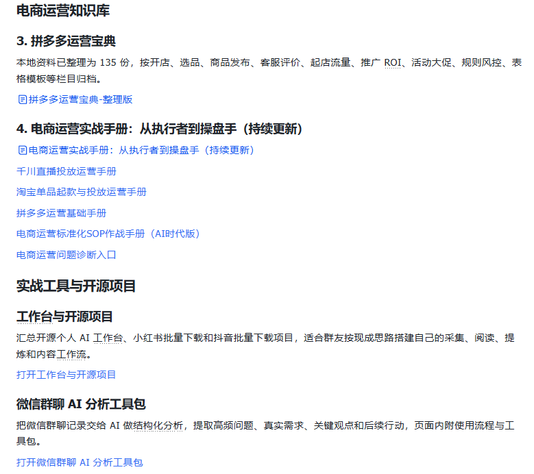

群里的日常

群里有不少大神，每天的交流都很多。关于电商的知识或者问题，这边不用担心。这个群是我和一个有  ** 15 年电商经验的老兵  **
一起打理的，遇到具体问题随时问。

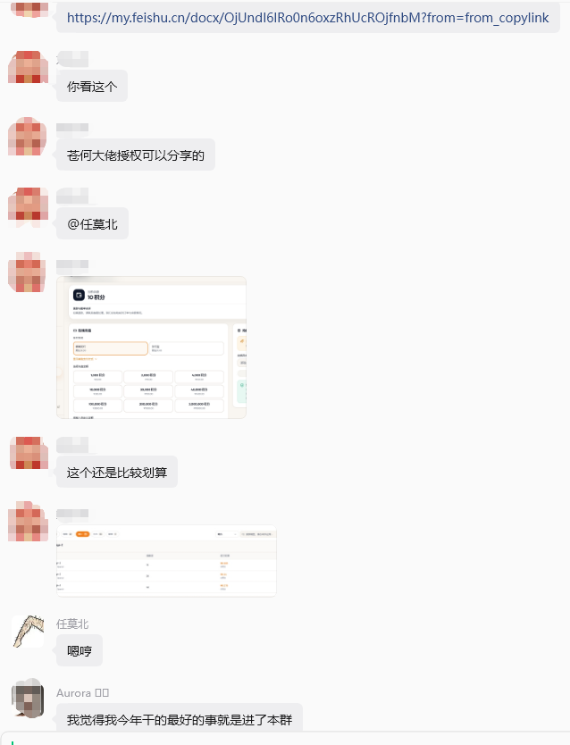

就算你错过了群聊也没关系。我会把有价值的内容总结下来，放到飞书文档里，随时可以翻看。

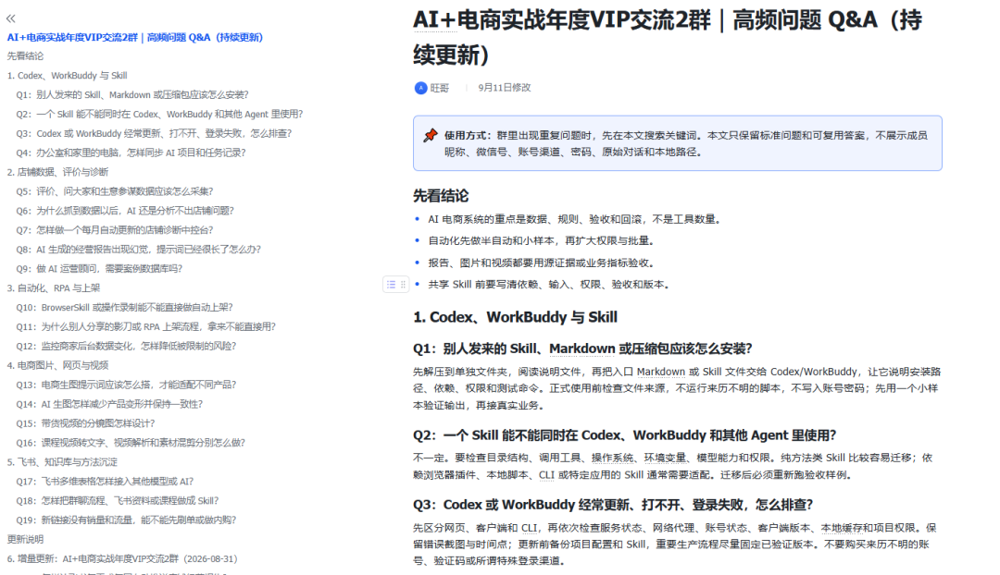

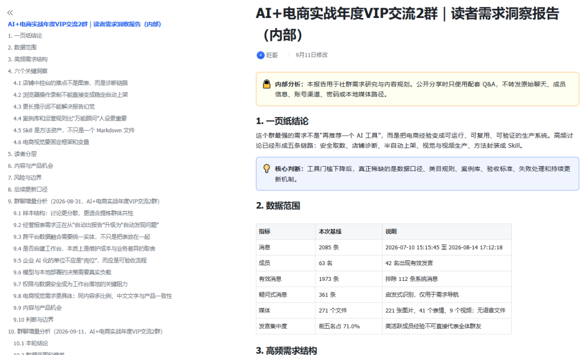

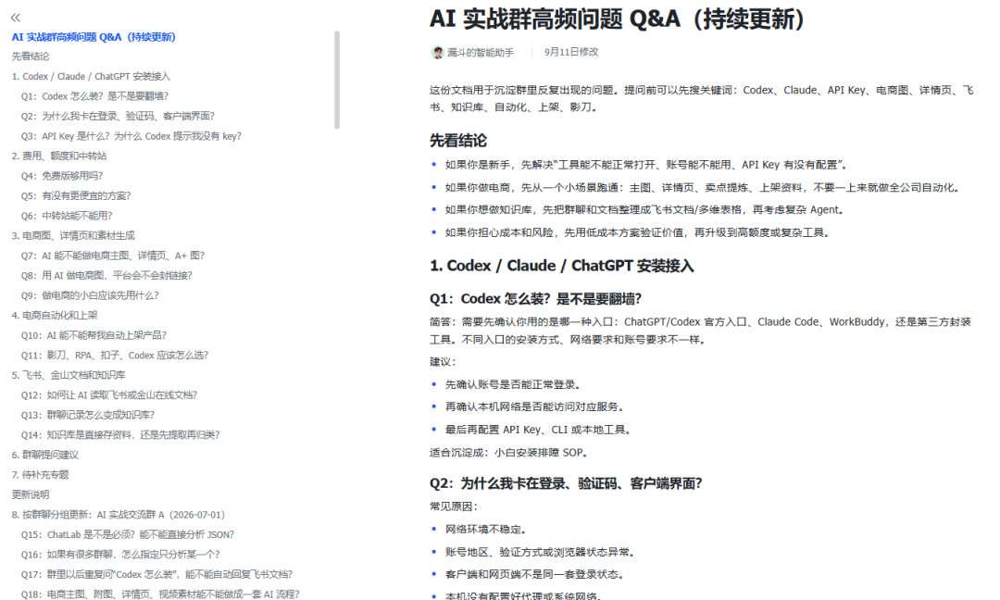

关于价格

99  元 / 一年

群里的资料相当于永久保留，后续教程及时更新

好的 AI 工具、AI 电商资讯第一时间在群里分享

原 AI+电商实战交流群成员，转过来加入有优惠

朋友推荐加入的，有相应折扣

想加入的私聊我

讨论请加：  HPwangtang  或者电商腿毛哥：  dstuimaoge

---

本文最初发布于微信公众号「AI应用实战派PRO」。未经特别说明，正文与配图采用 [CC BY-NC-ND 4.0](https://creativecommons.org/licenses/by-nc-nd/4.0/deed.zh-hans) 许可。
