# 我用 WorkBuddy 搭了一个7 个 Agent 的客服专家团

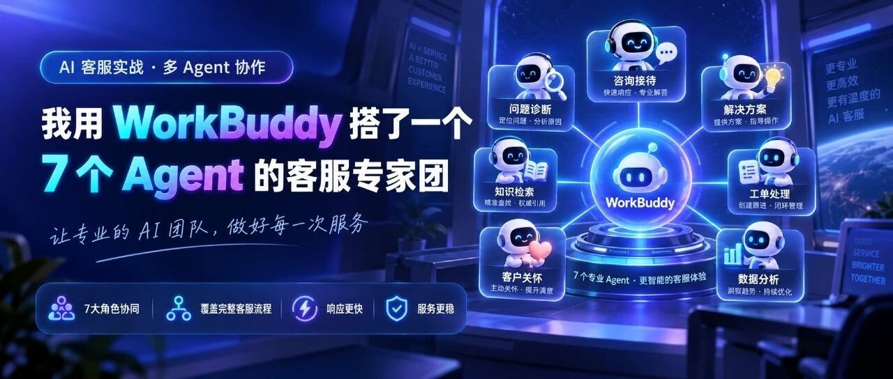

> 作者：旺哥 · 公众号：AI应用实战派PRO  
> [查看微信公众号原文](https://mp.weixin.qq.com/s/tILm62j27LQTXtGIa_VORQ)
> [下载 HTML 图文包（含图片）](https://github.com/wangge-dev/wangge-articles/releases/download/html-archive/202609172219.zip) · [HTML 文件](../../html/2026/202609172219/article.html)

MULTI-AGENT CS TEAM · WORKBUDDY

我用 WorkBuddy 搭了一个

7 个 Agent 的  客服专家团

1 个主管 + 1 个意图识别 + 5 个专业客服，五步搭完，配 49 条测试用例

· SKILL NOTES

7 个  客服 Agent  5 个  知识库  49 条  测试用例

大家都知道电商有个特点：用户看完详情页，不一定会立刻下单。接下来问什么的都有：参数、价格到物流和退换，如果客服回答不好客户甚至投诉。

这些问题表面上都叫客服问题，背后是几套完全不同的流程。如果全塞进一个 Agent，什么都得答，效果非常差。

于是我脑洞大开搭了这套  客服专家团来  应对。本文主要是思路展示哈！

如果你手中有一堆skill也可以升级成专家团的哈

回到正题，这个专家团的思路是：用户发来任何问题，系统先判断是商品咨询、售后还是投诉，再派给对应的专员处理，最后由总监统一审核回复。

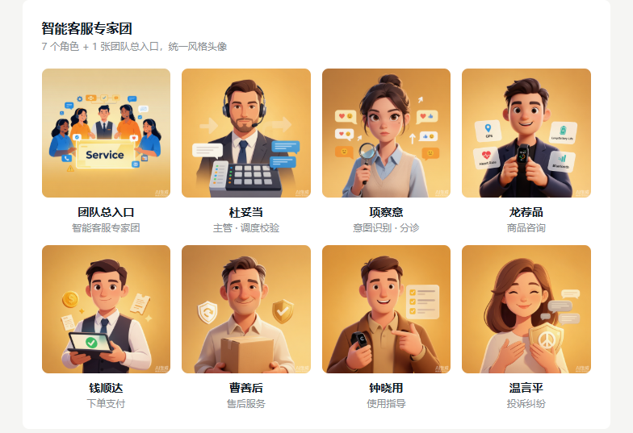

先看成果

7 个 Agent：总监负责调度，意图识别做分诊，5 个专业客服各管一摊，每个都有花名。

5 个知识库：产品、支付、售后、使用、投诉各一份，换产品只换这里。

8 张统一风格头像，打包后装进 WorkBuddy 专家中心，配 49 条测试用例验收。

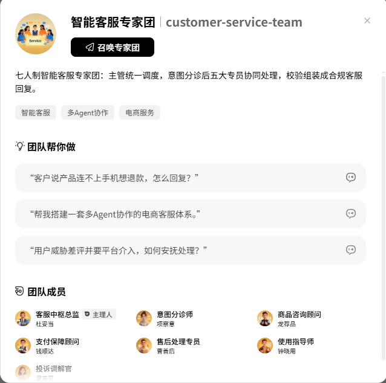

02

客服专家团搭建SOP

今天我们以小米手环9当做案例来演示，这时候有人问了，我没有相关资料怎么办，好问题，既然我们是测试，我们就让workbuddy自己找资料就行了。

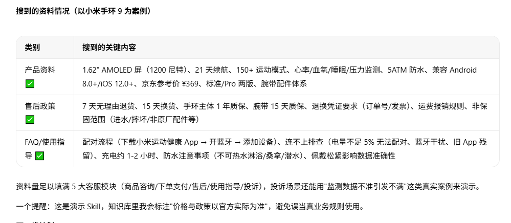

首先第一步，定结构

总监Agent 像客服团队的组长，不亲自答所有问题，负责接单、调度，最后校验组装。意图识别 Agent
是分诊台，只做判断，把问题拆开看：问的是什么，情绪怎么样，有多急，风险多大。

5 个专业 Agent 按需执行，各带各的知识库，最后结果回给主管统一校验，组装成一条完整回复。

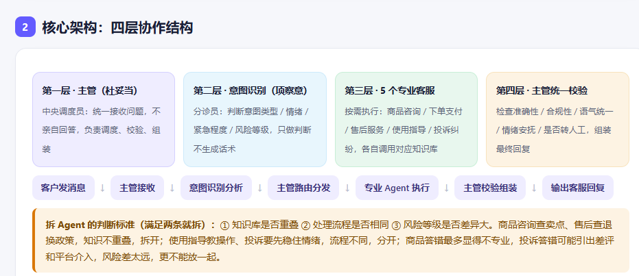

第二步，写主文件 SKILL.md

一个 Skill 就是一个文件夹，里面装核心指令文件 SKILL.md 和 references 文件夹。SKILL.md 是整套系统的说明书，管七件事：
名称描述、目标、触发条件、执行流程、10 条协作规则、模块索引、目录结构。

触发条件表最实用，把五类问题客户会怎么问都列出来。10 条规则是所有 Agent 的底线，比如不编造订单状态、情绪客户先安抚再处理、高风险必须提示转人工。

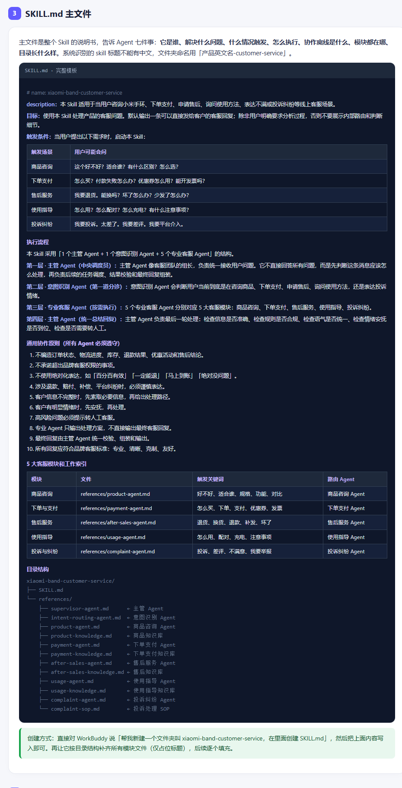

第三步，写 7 个 Agent 定义

每个 Agent 一个文件，写清角色定位、触发条件、核心技能、工作流程、输出要求、输出格式。写的方法很统一，写好第一个，后面几个就是换业务内容。

专业 Agent 不直接回客户，只出处理方案，最后由主管校验组装。7
个角色各有花名：杜妥当调度，项察意分诊，商品、支付、售后、使用、投诉五个专员各管一摊，分别是龙荐品、钱顺达、曹善后、钟晓用、温言平。

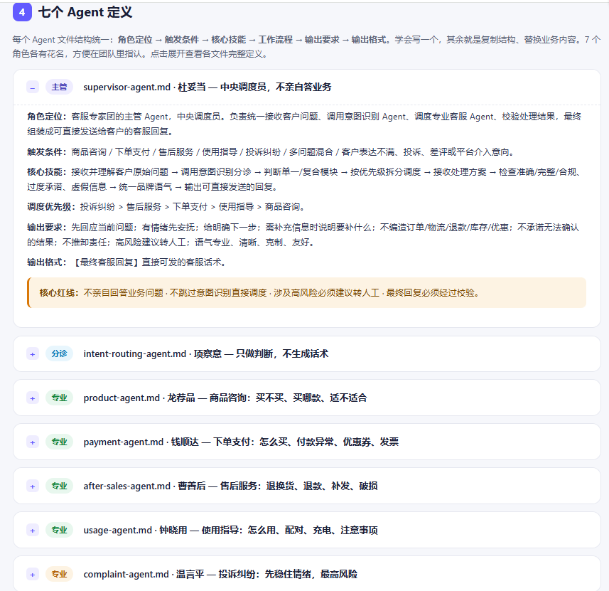

第四步，搭 5 个知识库

Agent 把分工定好了，还得配工作手册。产品、支付、售后、使用、投诉各一份，按客户会怎么问组织，一条问题配一条回答。

规格参数、退换质保规则、配对充电这些操作步骤，分别装进产品、售后、使用三个知识库。资料缺失的地方标需补充，不编造。

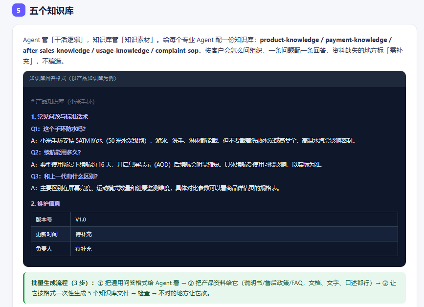

第五步，安装测试

搭完一共 13 个文件，打包成 Skill 装进 WorkBuddy，再升级成专家团：7 个角色变成 7 名独立成员，配 8 张统一风格头像。

测试配了 49
条用例，分七类，每条标了预期走哪个专员。简单问题好测，问产品区别，就该走商品咨询。麻烦的是复合诉求，一句"买了用不了想退款"，得同时识别出使用异常和退款两个点，先安抚再给路径。高风险的话术单独测，比如"再不处理就投诉"，要识别出高风险并建议转人工。

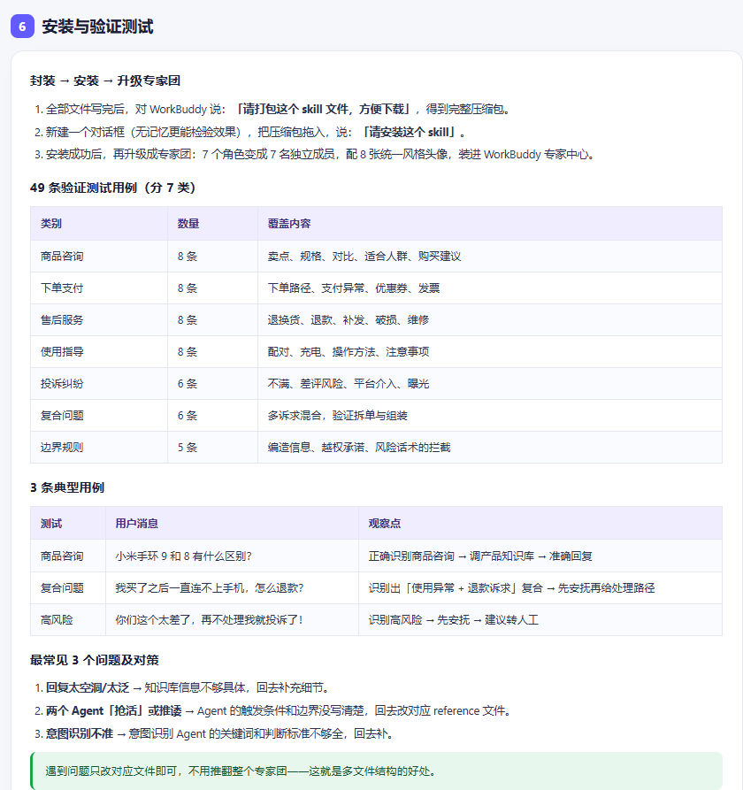

03

搭完能干什么

客户问题进来，先分诊再派单。问的是参数、付款、退换、使用还是投诉，就路由到对应的那个专员。

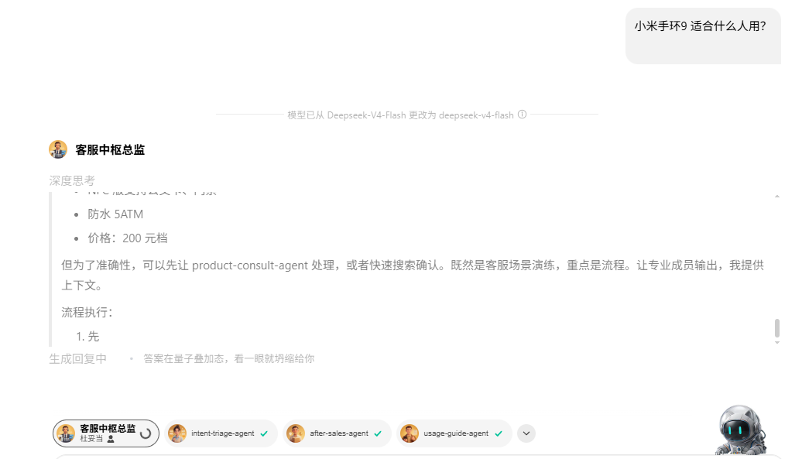

复合问题主管拆开处理。一句"已经付款了，手机连不上 WiFi，还不知道怎么备份"，拆成支付和使用两件事，分别派单再拼成一条回复。

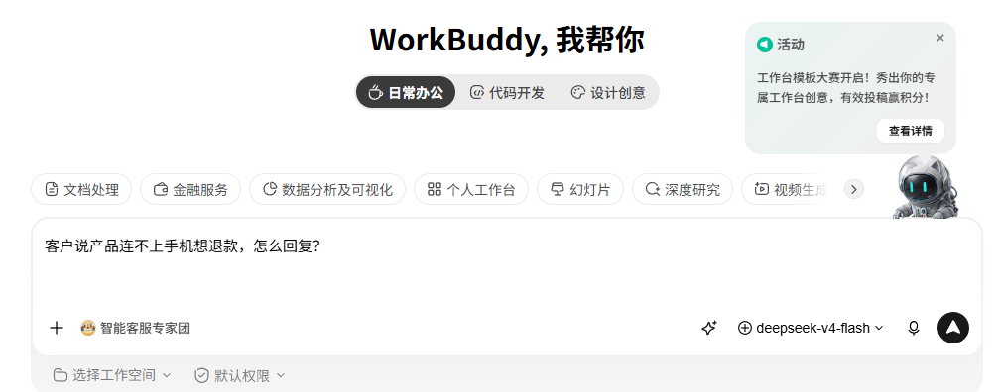

高风险投诉先安抚再建议转人工，不让 AI 硬顶。默认只输出一条可直接发给客户的回复，不展示内部路由。

04

最后

这套思路跟产品无关。这家店卖手机，下一家卖耳机，换产品只换 5 个知识库的内容，7 个角色的结构不用动。

以后要加新的客服业务，也不用推翻整个系统，新增或修改对应的 Agent 文件和知识库就行。

做法就是把业务经验拆成结构、流程、规则和知识库，分给不同 Agent，各管一段，再统一收口。

咨询讨论请加：  HPwangtang

AI 应用实战派 PRO

觉得本文还不错，赶紧点赞收藏吧。

有兴趣可以加入我们的实战群：  [ 正式介绍一下我们的AI+ 电商VIP实战交流群
](https://mp.weixin.qq.com/s?__biz=MzY4NDA4MDUwMA==&mid=2247485411&idx=1&sn=9d5c90d6870983abb587e8c095f8d61d&scene=21#wechat_redirect)

---

本文最初发布于微信公众号「AI应用实战派PRO」。未经特别说明，正文与配图采用 [CC BY-NC-ND 4.0](https://creativecommons.org/licenses/by-nc-nd/4.0/deed.zh-hans) 许可。
