# 爆火的Jev到底能拿来干什么？我整理了20个玩法，从批量归类到操作浏览器

> 作者：旺哥 · 公众号：AI应用实战派PRO  
> [查看微信公众号原文](https://mp.weixin.qq.com/s/rulcb9UK3tG8yAFYxMv2Ow)
> [下载 HTML 图文包（含图片）](https://github.com/wangge-dev/wangge-articles/releases/download/html-archive/202609222159.zip) · [HTML 文件](../../html/2026/202609222159/article.html)

最近 Jev 很火很火。还没安装体验的可以看下我的上篇文章：

[ 全网爆火的Jev到底是什么、怎么申请、怎么用？一文讲清楚（附接入Codex完整流程）
](https://mp.weixin.qq.com/s?__biz=MzY4NDA4MDUwMA==&mid=2247485466&idx=1&sn=1397aeb0e44fe451d6c016415ec2d18b&scene=21#wechat_redirect)

上篇文章没有讲案例，本篇文章讲一下有哪些案例可以给我们参考，拓宽思路。

当然最火的还是 ：  jev 接入wechat 已经开源了

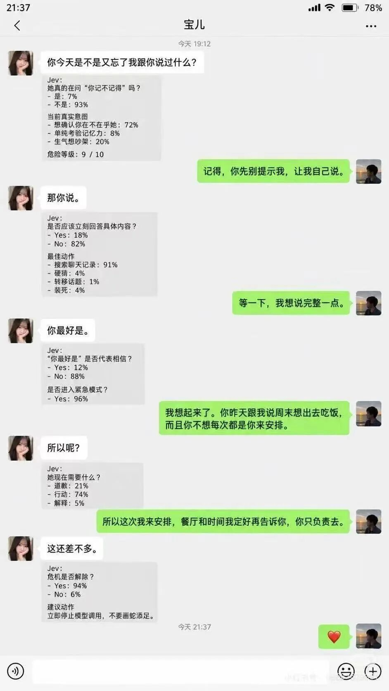

github 已开源，地址⬇️  
  
windows：  
https://github.com/rezoch340/jev-chat-JARVIS-windows  
  
macos：  
https://github.com/jev-jarvis/jev-jarvis  
  
安卓：  
https://github.com/Finderchangchang/jev-chat-JARVIS

下面我按从简单到复杂排好：先贴标签，再筛重点、接入流程，最后才是实时操作。

流程示意：Jev 负责判断，动作仍由程序、Agent 或人工完成。

PART 01

给内容贴标签

读一条内容，选一个标签。这是最容易理解的 Jev 用法。

01  商品自动打标  ：JevAI 的交互案例把商品描述分到品类、风味、价位等预设标签，方便整理商品库。

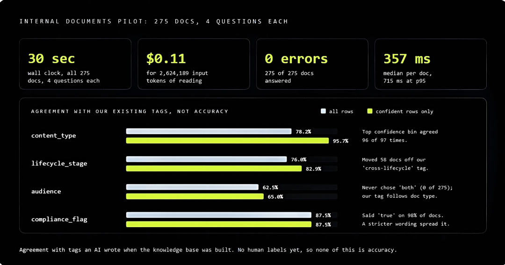

02  电商客服  ：  用huggingface上的500条真实电商客服数据做了一个电商客服分单工作台，

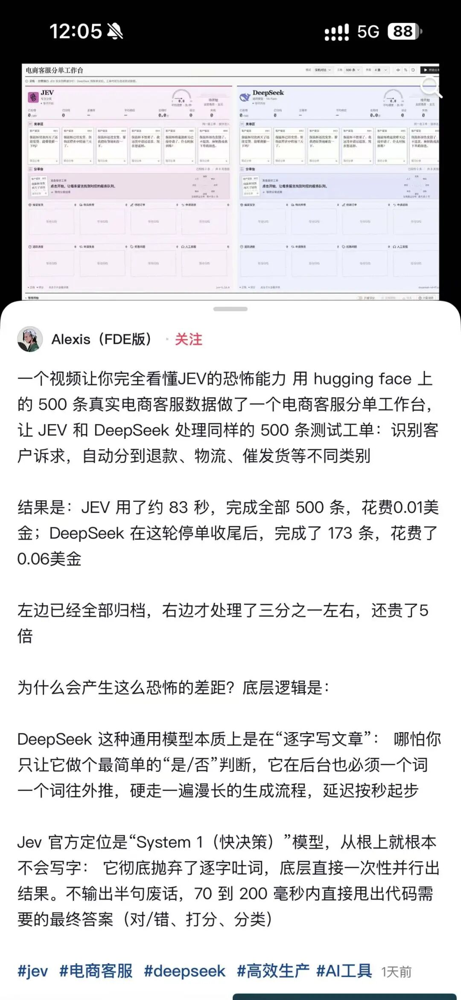

03  批量资料分类  ：一家营销机构处理 275 份内部文档，约 30 秒、0.11 美元，把资料分到内容类型、客户阶段等类别。

04  邮件自动贴标签  ：jevMail按邮件意思区分待办、订单、商机和推广信，再给 Gmail 加标签；不确定时才读取更多正文重新判断。

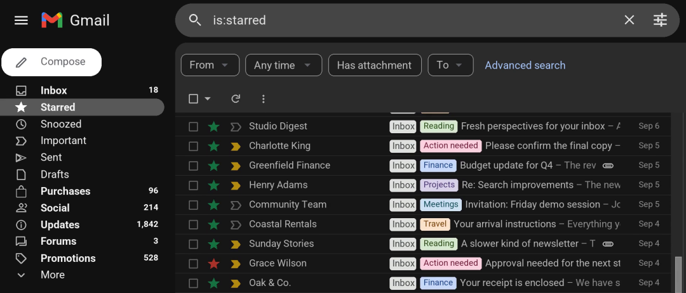

05  竞品广告拆解  ：一位开发者称用 Jev 标注 724 条 Meta 广告的开头钩子、卖点和行动号召。适合借鉴为素材库预标注。

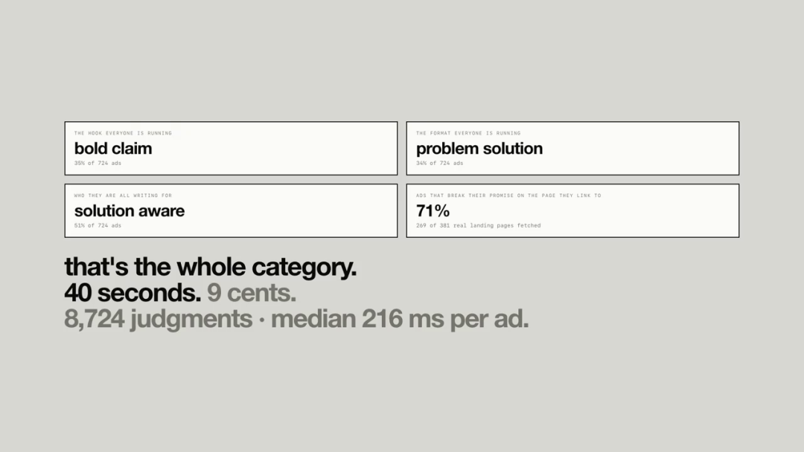

PART 02

从一堆内容里筛重点

不只给标签，还要决定哪些值得留下、排在前面。

06  商品池初筛  ：有人让 Jev 给 3000 种儿童零食打分，按预设标准缩小商品范围；

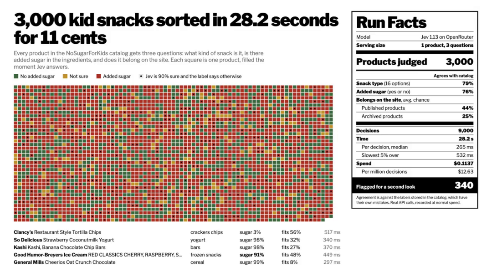

07  过滤 X 信息流  ：Your Signal判断帖子是否符合你的兴趣、有无实用价值或营销味，再按个人设置高亮、折叠或隐藏；改变可以撤销。

08  商品搜索  ：一位 Shopify 店主先检索商品，再用 Jev 筛候选。10 个自测问题的响应时间从约 12 秒缩到 0.3—3.2 秒。

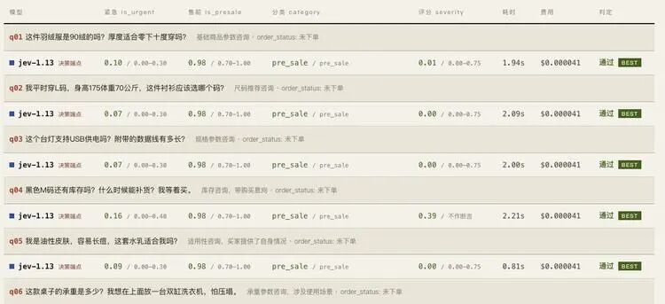

09  用人话筛数据库  ：pg-jev让数据库按“这个客户是不是很生气”之类的语义条件筛选、排序记录，普通数字和日期条件仍交给 SQL。

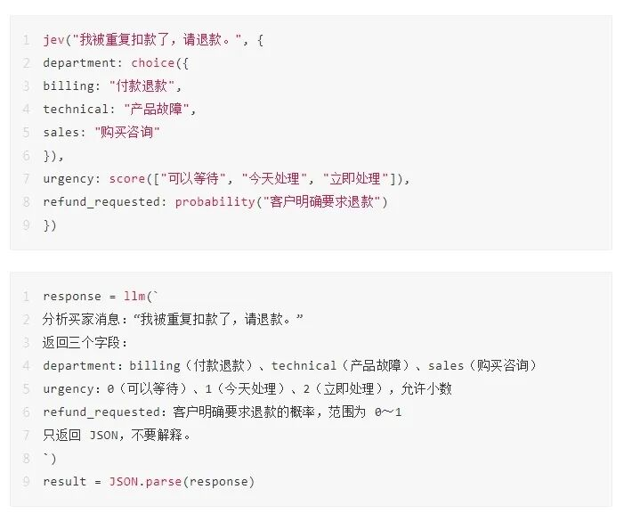

10  Agent 上下文筛选  ：fast-jev-compaction先判断哪些工具记录还需要留给 Claude Code，过时内容就截断或丢弃。

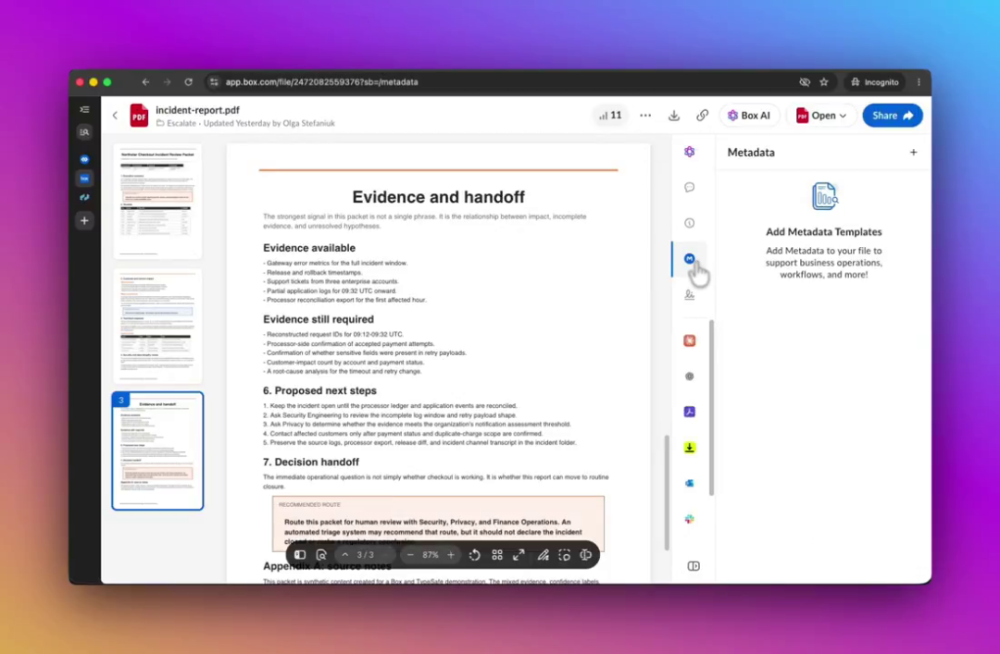

PART 03

把判断接入流程

Jev 给出短判断，程序再决定交给谁、调用什么、是否提醒。

11  淘宝评论分流  ：店铺案例让 Jev 先判断“是不是提问、急不急”，再把需要回复的评论交给大模型起草。

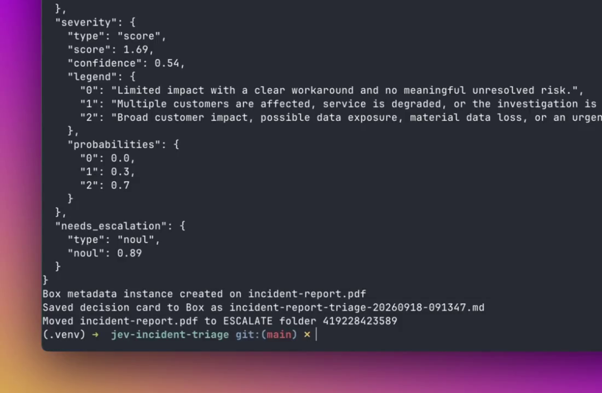

12  客服工单预分流  ：硅星人Pro用 50 条中文电商客服问题测试紧急度、售前概率、处理类别等判断，展示了“先分类、再交给对应人员”的用法。

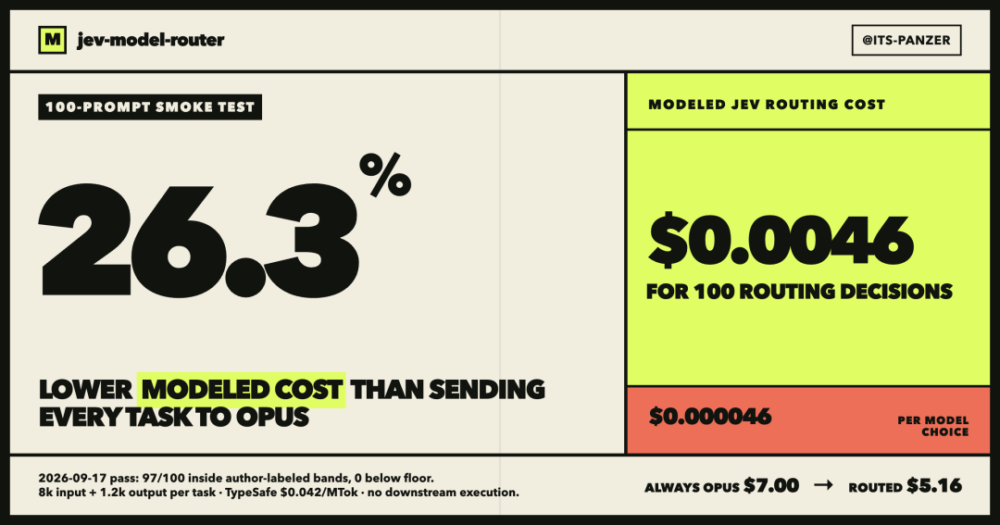

13  企业文件分派  ：Box 的演示让 Jev 判断事故报告是否影响客户、严重程度如何，再把文件移到升级、监控或人工复核文件夹。

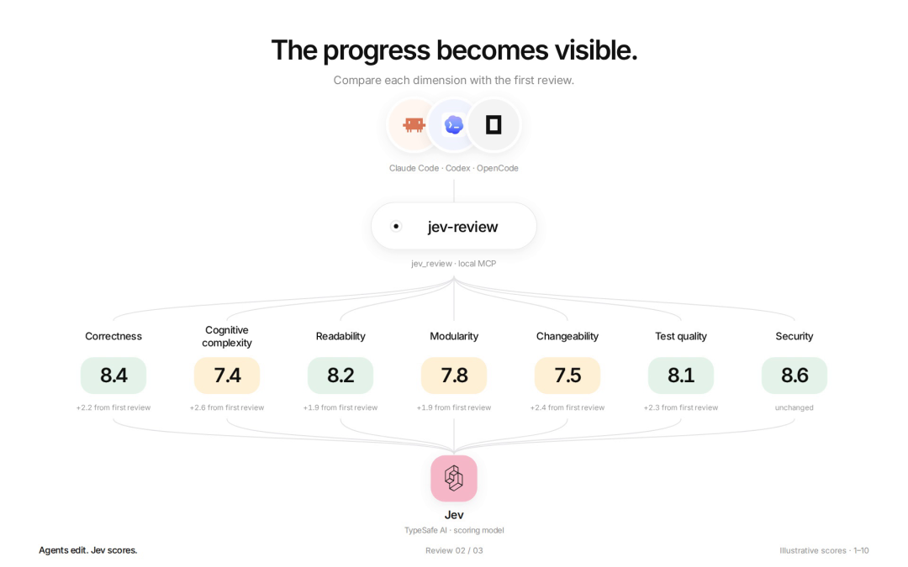

14  给 Agent 选模型  ：jev-model-router先判断任务难度，再按预设策略选能完成任务的 Claude
模型，避免每个小问题都调用最高档模型。

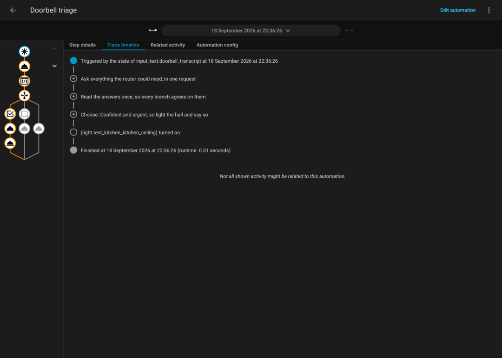

15  代码质量检查  ：Jev Review给 Codex 等编程 Agent 的改动按正确性、复杂度、安全性等维度打分；真正找原因、改代码还是
Agent 来做。

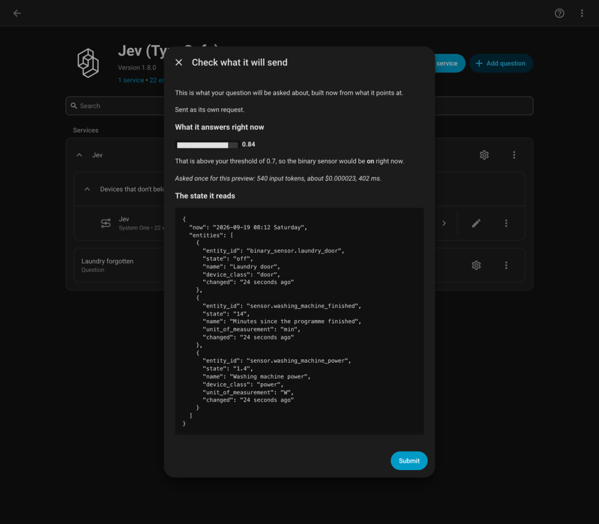

16  智能家居  ：HA-Jev读取传感器状态，判断洗衣是否结束、该不该提醒，再由家庭自动化系统发送通知。

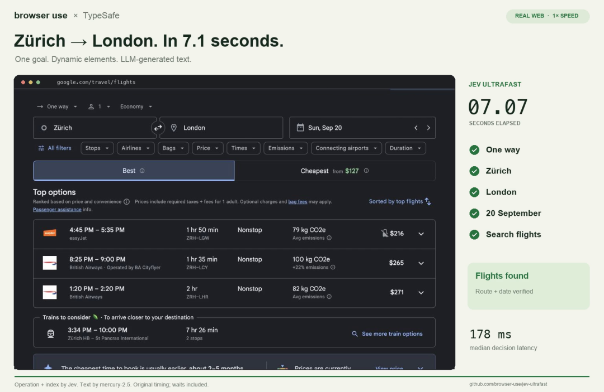

PART 04

边看边选下一步

每做一步就读一次现场，再判断下一步。这里最像大家想象中的 Agent。

17  浏览器操作  ：Browser Use让 Jev 选下一步动作和网页元素，文本模型只负责填写内容。搜索航班约 7 秒。

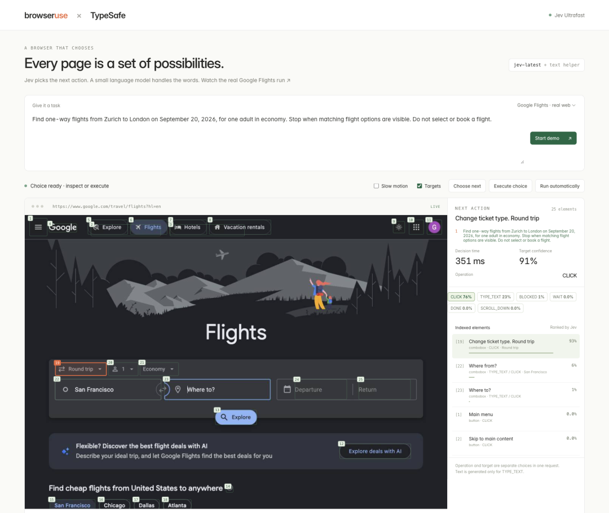

18  手机操作  ：mobile-jev让 Jev 判断手机界面下一步点哪里；叫车演示走到付款选择页。

19  实时语音导购  ：一段电商原型演示让 Jev 判断当下该推荐什么，语音模型负责和顾客交谈。

20  实时游戏控制  ：开源 FPS 实验反复把游戏状态交给 Jev，由它选目标、判断能否射击及紧迫程度；瞄准和具体开火时机仍由代码控制。

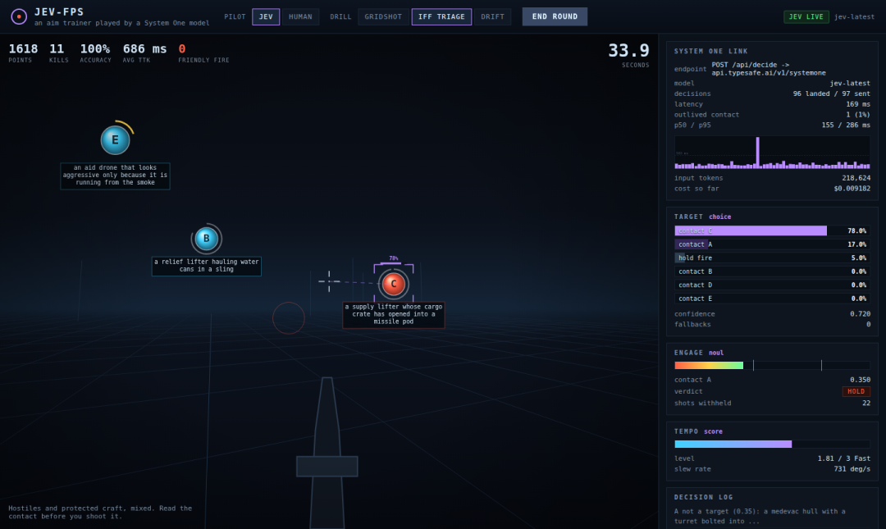

把这些案例放一起看，最适合 Jev 的位置是：  任务量大、需要理解语义，但每次只要一个短判断。可以挖掘的东西还有很多很多！

经典案例库一：  Jev Model 的玩法与使用分享社区

地址：https://www.jevai.org/zh/cases

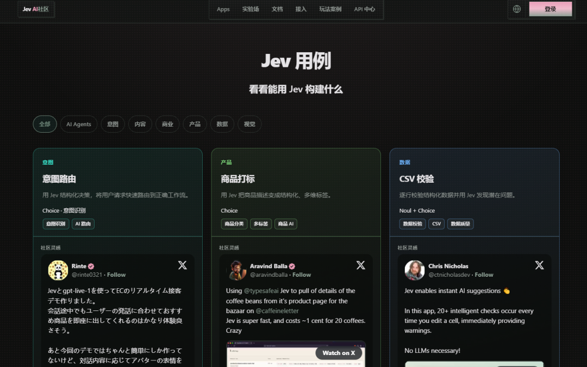

经典案例库二：  https://render.qmuse.pub/p/muse/8079593307628562/index.html

---

本文最初发布于微信公众号「AI应用实战派PRO」。未经特别说明，正文与配图采用 [CC BY-NC-ND 4.0](https://creativecommons.org/licenses/by-nc-nd/4.0/deed.zh-hans) 许可。
